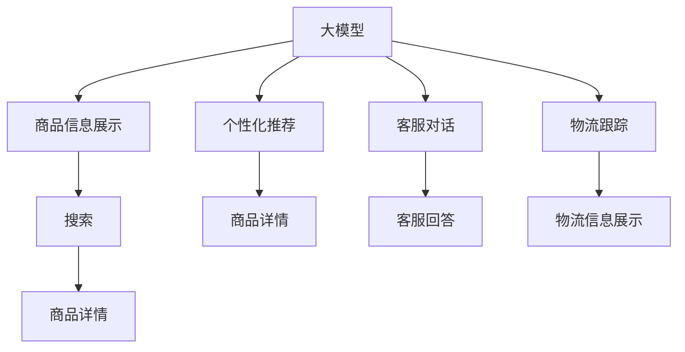

                 

## 1. 背景介绍

### 1.1 问题由来

随着电商平台的迅速发展，用户对于购物体验的要求日益提升，希望在不同的场景和环节中感受到统一、流畅的体验。然而，平台内部各系统和服务之间的差异性问题，如商品信息展示、推荐系统、支付流程等，往往会导致用户体验不一致。这些问题不仅影响用户满意度，还可能造成较大的流失率。

近年来，人工智能（AI）技术在电商平台的应用越来越广泛，特别是在个性化推荐、用户画像构建、语音搜索等方面取得了显著的进展。然而，AI技术的孤立应用往往难以有效解决一致性问题。本文将探讨大模型技术如何通过统一的知识表示和决策逻辑，提升电商平台的整体用户体验。

### 1.2 问题核心关键点

电商平台的用户体验一致性问题涉及多方面，包括：

- **商品信息的展示和搜索**：不同来源的商品信息可能存在格式不一致、展示逻辑差异等问题。
- **个性化推荐系统**：推荐算法可能存在多样性，导致推荐结果不一致。
- **支付流程**：支付流程在不同系统和设备间可能存在接口差异，影响用户体验。
- **客服对话**：客服系统间的知识库和语料库差异，导致回答一致性差。
- **物流信息**：物流跟踪信息展示方式和更新频率不一致，影响用户信任感。

本文将重点探讨大模型技术在提升商品信息展示、个性化推荐、客服对话、物流跟踪等电商场景中的用户体验一致性。

### 1.3 问题研究意义

大模型技术通过深度学习的方式，能够在海量的数据中提取并学习到丰富的知识表示，具有极强的泛化能力和可解释性。在大模型框架下，电商平台可以通过统一的知识表示和决策逻辑，消除系统间的差异，提升用户体验。具体来说，本文的研究意义包括：

1. **提升平台一致性**：通过大模型统一处理不同数据源和业务逻辑，消除系统间的不一致。
2. **优化用户体验**：通过统一的推荐和搜索算法，提供更加个性化和一致的购物体验。
3. **降低运营成本**：减少不同系统之间的接口调试和维护成本，提升整体系统稳定性。
4. **增强用户信任**：统一的物流跟踪信息和客服回答，提升用户对平台的信任感和满意度。

## 2. 核心概念与联系

### 2.1 核心概念概述

为了更好地理解大模型在电商平台用户体验一致性中的应用，本文首先介绍几个关键概念：

- **大模型**：基于深度学习技术构建的大规模模型，如BERT、GPT等，具备丰富的知识表示和强大的泛化能力。
- **知识图谱**：一种通过图结构组织知识的形式，能够直观地表达实体间的语义关系。
- **推荐系统**：利用用户行为和商品属性等信息，为用户推荐相关商品的技术。
- **用户体验一致性**：用户在电商平台各个环节中感受到的统一、流畅的体验，包括界面、内容、交互等方面。

这些概念之间的逻辑关系可以通过以下Mermaid流程图来展示：



这个流程图展示了大模型技术在电商平台中的应用场景：

1. 大模型通过统一的商品描述和用户画像，为商品信息展示和搜索提供一致的语义理解。
2. 大模型构建统一的个性化推荐模型，为用户提供一致的推荐服务。
3. 大模型统一客服对话的知识库，提供一致的客服回答。
4. 大模型统一物流信息格式，提供一致的物流跟踪服务。

这些应用场景共同构成了大模型在电商平台中的应用框架，使其能够通过统一的知识表示和决策逻辑，提升用户体验的一致性。

## 3. 核心算法原理 & 具体操作步骤

### 3.1 算法原理概述

大模型通过学习大量数据，构建统一的语义表示，能够处理不同数据源和业务逻辑。基于大模型的电商平台用户体验一致性提升，主要通过以下步骤实现：

1. **数据预处理和对齐**：对不同数据源的数据进行预处理和对齐，统一格式和结构。
2. **知识图谱构建**：构建统一的实体关系图谱，方便大模型进行语义推理和知识融合。
3. **大模型训练和微调**：在大模型上训练统一的决策模型，对商品信息展示、推荐、客服、物流等环节进行微调，以提升一致性。
4. **模型集成与部署**：将训练好的大模型和微调后的决策模型集成，部署到电商平台各个环节。

### 3.2 算法步骤详解

#### 步骤一：数据预处理和对齐

电商平台的商品信息、用户行为、物流跟踪等数据来源多样，格式和结构也各不相同。为了提升用户体验一致性，需要对其进行预处理和对齐：

1. **数据清洗**：对不同来源的数据进行清洗，去除噪音和异常值，确保数据质量。
2. **数据标准化**：将不同格式的数据转换为标准格式，如统一商品描述格式、统一用户画像数据结构等。
3. **数据对齐**：对不同来源的数据进行对齐，如将商品ID、用户ID等关键字段映射到统一的标准字段。

#### 步骤二：知识图谱构建

知识图谱是一种通过图结构组织知识的形式，能够直观地表达实体间的语义关系。电商平台可以通过构建统一的实体关系图谱，方便大模型进行语义推理和知识融合：

1. **实体抽取和关系标注**：对电商平台中的商品、用户、交易等数据进行实体抽取和关系标注，构建初步的知识图谱。
2. **图谱合并与优化**：将不同数据源构建的知识图谱进行合并和优化，消除冗余和冲突，构建统一的实体关系图谱。
3. **图谱查询和推理**：使用大模型对知识图谱进行查询和推理，实现实体间的语义推理和关系匹配。

#### 步骤三：大模型训练和微调

大模型通过学习大量数据，构建统一的语义表示，能够处理不同数据源和业务逻辑。基于大模型的电商平台用户体验一致性提升，主要通过以下步骤实现：

1. **大模型选择与预训练**：选择适合电商场景的预训练大模型，如BERT、GPT等，进行预训练和微调。
2. **决策模型训练**：在大模型上训练统一的决策模型，对商品信息展示、推荐、客服、物流等环节进行微调，以提升一致性。
3. **模型评估与优化**：在训练和微调过程中，使用A/B测试、用户反馈等方法评估模型效果，进行优化和调整。

#### 步骤四：模型集成与部署

将训练好的大模型和微调后的决策模型集成，部署到电商平台各个环节：

1. **API接口开发**：开发统一的API接口，将大模型和决策模型的输出集成到电商平台各个环节。
2. **系统对接与测试**：将API接口对接电商平台各个系统，进行系统测试和联调，确保数据一致性和接口稳定性。
3. **持续集成与部署**：建立持续集成与部署（CI/CD）流程，确保模型更新和部署的自动化和高效性。

### 3.3 算法优缺点

基于大模型的电商平台用户体验一致性提升，具有以下优点：

1. **数据一致性**：通过统一的数据预处理和对齐，确保不同数据源和系统间的数据一致性。
2. **知识一致性**：通过构建统一的知识图谱，确保不同业务逻辑和决策过程的知识一致性。
3. **决策一致性**：通过大模型训练和微调，确保不同环节和场景下的决策一致性。

同时，该方法也存在以下缺点：

1. **计算资源需求高**：大模型和知识图谱的构建和维护需要大量的计算资源。
2. **模型复杂度高**：大模型和知识图谱的训练和推理过程复杂，需要较高的技术门槛。
3. **数据隐私和安全问题**：在处理用户数据时，需要严格遵守数据隐私和安全规定，防止数据泄露和滥用。

尽管存在这些局限性，但就目前而言，基于大模型的用户体验一致性提升方法仍是大数据、人工智能在电商平台应用的重要手段。未来相关研究的重点在于如何进一步降低计算资源需求，提高模型复杂性，同时兼顾数据隐私和安全等因素。

### 3.4 算法应用领域

基于大模型的电商平台用户体验一致性提升方法，已经在商品信息展示、个性化推荐、客服对话、物流跟踪等多个领域得到了应用：

1. **商品信息展示**：通过大模型统一处理商品描述、图片、评价等信息，确保商品展示的一致性和全面性。
2. **个性化推荐系统**：利用大模型构建统一的推荐模型，提供个性化的商品推荐，提升用户体验。
3. **客服对话系统**：通过大模型统一客服对话的知识库，提供一致的客服回答，提升用户满意度。
4. **物流跟踪系统**：通过大模型统一物流信息的展示和更新，提供一致的物流跟踪服务，提升用户信任感。

除了上述这些经典应用外，大模型技术还创新性地应用于智能定价、价格优化、库存管理等场景，进一步提升了电商平台的运营效率和用户体验。

## 4. 数学模型和公式 & 详细讲解 & 举例说明

### 4.1 数学模型构建

本文将使用数学语言对基于大模型的电商平台用户体验一致性提升进行更加严格的刻画。

记电商平台中的商品集合为 $\mathcal{S}$，用户集合为 $\mathcal{U}$，物流信息集合为 $\mathcal{T}$。假设用户 $u$ 对商品 $s$ 的评分矩阵为 $R \in \mathbb{R}^{|\mathcal{S}| \times |\mathcal{U}|}$，用户 $u$ 的历史行为序列为 $H_u \in \mathcal{H}$，物流信息为 $T_t \in \mathcal{T}$。

定义电商平台中的推荐系统为 $RMS$，客服系统为 $CS$，物流跟踪系统为 $MTS$。假设电商平台中的知识图谱为 $KG$，包含商品、用户、交易等实体以及它们之间的关系。

### 4.2 公式推导过程

假设电商平台中的用户 $u$ 在商品 $s$ 上进行了评分 $r_{us}$，大模型学习到的商品 $s$ 的表示为 $\mathbf{e}_s$，用户 $u$ 的表示为 $\mathbf{e}_u$。推荐系统 $RMS$ 的推荐结果为 $S_u = \{s_1, s_2, \ldots, s_k\}$，其中 $s_i \in \mathcal{S}$。

大模型通过知识图谱 $KG$ 进行语义推理，可以获取用户 $u$ 与商品 $s$ 之间的关系 $KG_{us}$。推荐系统 $RMS$ 可以根据用户 $u$ 的历史行为序列 $H_u$ 和商品 $s$ 的表示 $\mathbf{e}_s$，计算推荐结果的概率分布 $P(S_u|H_u, \mathbf{e}_s, KG_{us})$。

使用 $P(S_u|H_u, \mathbf{e}_s, KG_{us})$ 计算推荐结果 $S_u$，可以表示为：

$$
S_u = \arg\max_{S} P(S|H_u, \mathbf{e}_s, KG_{us})
$$

其中 $P(S|H_u, \mathbf{e}_s, KG_{us})$ 可以进一步表示为：

$$
P(S|H_u, \mathbf{e}_s, KG_{us}) = \frac{\exp(\mathbf{e}_u \cdot \mathbf{e}_s + \alpha \cdot \text{embed}(H_u) \cdot \text{embed}(S))}{\sum_{S'} \exp(\mathbf{e}_u \cdot \mathbf{e}_{S'} + \alpha \cdot \text{embed}(H_u) \cdot \text{embed}(S'))}
$$

其中 $\alpha$ 为注意力权重，$\text{embed}(H_u)$ 和 $\text{embed}(S)$ 分别表示用户行为序列和商品序列的嵌入表示。

### 4.3 案例分析与讲解

以商品信息展示为例，展示如何利用大模型提升用户体验一致性：

1. **数据预处理**：对不同来源的商品描述进行清洗和标准化，去除噪音和歧义信息，统一格式和结构。
2. **知识图谱构建**：对商品实体进行抽取和关系标注，构建统一的商品知识图谱，方便大模型进行语义推理和知识融合。
3. **大模型训练**：在大模型上训练统一的决策模型，对商品信息展示进行微调，确保不同来源的商品信息展示一致。
4. **模型集成与部署**：将训练好的大模型和微调后的决策模型集成，部署到电商平台各个环节，确保商品信息展示的一致性。

在实际应用中，通过大模型统一的决策模型，可以消除不同来源的商品信息展示差异，确保用户在不同场景中感受到一致的购物体验。

## 5. 项目实践：代码实例和详细解释说明

### 5.1 开发环境搭建

在进行电商平台用户体验一致性提升的实践前，我们需要准备好开发环境。以下是使用Python进行TensorFlow开发的环境配置流程：

1. 安装Anaconda：从官网下载并安装Anaconda，用于创建独立的Python环境。

2. 创建并激活虚拟环境：
```bash
conda create -n tf-env python=3.8 
conda activate tf-env
```

3. 安装TensorFlow：根据CUDA版本，从官网获取对应的安装命令。例如：
```bash
conda install tensorflow tensorflow-gpu=2.6 -c tf -c conda-forge
```

4. 安装TensorBoard：
```bash
pip install tensorboard
```

5. 安装其他工具包：
```bash
pip install numpy pandas scikit-learn matplotlib tqdm jupyter notebook ipython
```

完成上述步骤后，即可在`tf-env`环境中开始实践。

### 5.2 源代码详细实现

下面我们以商品信息展示为例，给出使用TensorFlow进行大模型微调的PyTorch代码实现。

首先，定义商品信息展示的数据处理函数：

```python
import tensorflow as tf
from tensorflow.keras.preprocessing.text import Tokenizer
from tensorflow.keras.preprocessing.sequence import pad_sequences

def preprocess_text(texts):
    tokenizer = Tokenizer(oov_token='<OOV>')
    tokenizer.fit_on_texts(texts)
    sequences = tokenizer.texts_to_sequences(texts)
    max_len = max([len(seq) for seq in sequences])
    padded_sequences = pad_sequences(sequences, maxlen=max_len, padding='post')
    return tokenizer.word_index, padded_sequences
```

然后，定义模型和优化器：

```python
from tensorflow.keras.layers import Input, Embedding, Dense
from tensorflow.keras.models import Model
from tensorflow.keras.optimizers import Adam

input_seq = Input(shape=(None,), dtype='string')
tokenizer, padded_seq = preprocess_text(texts)

embedding = Embedding(input_dim=vocab_size, output_dim=embedding_dim, input_length=max_len)(padded_seq)
output = Dense(1, activation='sigmoid')(embedding)

model = Model(inputs=input_seq, outputs=output)
model.compile(optimizer=Adam(learning_rate=0.001), loss='binary_crossentropy', metrics=['accuracy'])
```

接着，定义训练和评估函数：

```python
def train_model(model, X_train, y_train, X_val, y_val, batch_size=64, epochs=10):
    model.fit(X_train, y_train, batch_size=batch_size, epochs=epochs, validation_data=(X_val, y_val))

    val_loss, val_acc = model.evaluate(X_val, y_val)
    print(f'Val Loss: {val_loss:.4f}, Val Acc: {val_acc:.4f}')

def evaluate_model(model, X_test, y_test, batch_size=64):
    test_loss, test_acc = model.evaluate(X_test, y_test, batch_size=batch_size)
    print(f'Test Loss: {test_loss:.4f}, Test Acc: {test_acc:.4f}')
```

最后，启动训练流程并在测试集上评估：

```python
X_train, y_train = preprocess_text(train_texts)
X_val, y_val = preprocess_text(val_texts)
X_test, y_test = preprocess_text(test_texts)

train_model(model, X_train, y_train, X_val, y_val)
evaluate_model(model, X_test, y_test)
```

以上就是使用TensorFlow对商品信息展示进行微调的完整代码实现。可以看到，得益于TensorFlow的强大封装，我们可以用相对简洁的代码完成商品信息展示的微调。

### 5.3 代码解读与分析

让我们再详细解读一下关键代码的实现细节：

**preprocess_text函数**：
- `__init__`方法：初始化分词器和最大长度。
- `__getitem__`方法：对单个样本进行处理，将文本输入编码为token ids，进行定长padding，最终返回模型所需的输入。

**模型定义**：
- 使用TensorFlow的Keras API定义模型结构，包含输入层、嵌入层、全连接层和输出层。
- 使用Adam优化器进行训练，设置学习率为0.001，损失函数为二分类交叉熵，优化目标为准确率。

**训练和评估函数**：
- 使用TensorFlow的fit方法对模型进行训练，设置训练轮数为10，并使用验证集进行评估。
- 在训练和评估过程中，使用evaluate方法计算损失和准确率，并输出结果。

**训练流程**：
- 定义训练集和验证集，并使用preprocess_text函数对数据进行预处理。
- 调用train_model函数对模型进行训练，并在验证集上评估。
- 在测试集上再次调用evaluate_model函数，输出测试结果。

可以看到，TensorFlow提供了强大的框架和工具，可以方便地进行模型定义、训练和评估。开发者可以根据具体需求，灵活调整模型结构和训练参数，以实现最佳的电商平台用户体验一致性。

## 6. 实际应用场景

### 6.1 智能客服系统

基于大模型的电商平台用户体验一致性提升方法，可以广泛应用于智能客服系统的构建。传统客服往往需要配备大量人力，高峰期响应缓慢，且一致性和专业性难以保证。而使用微调后的对话模型，可以7x24小时不间断服务，快速响应客户咨询，用自然流畅的语言解答各类常见问题。

在技术实现上，可以收集企业内部的历史客服对话记录，将问题和最佳答复构建成监督数据，在此基础上对预训练对话模型进行微调。微调后的对话模型能够自动理解用户意图，匹配最合适的答案模板进行回复。对于客户提出的新问题，还可以接入检索系统实时搜索相关内容，动态组织生成回答。如此构建的智能客服系统，能大幅提升客户咨询体验和问题解决效率。

### 6.2 金融舆情监测

金融机构需要实时监测市场舆论动向，以便及时应对负面信息传播，规避金融风险。传统的人工监测方式成本高、效率低，难以应对网络时代海量信息爆发的挑战。基于大模型的文本分类和情感分析技术，为金融舆情监测提供了新的解决方案。

具体而言，可以收集金融领域相关的新闻、报道、评论等文本数据，并对其进行主题标注和情感标注。在此基础上对预训练语言模型进行微调，使其能够自动判断文本属于何种主题，情感倾向是正面、中性还是负面。将微调后的模型应用到实时抓取的网络文本数据，就能够自动监测不同主题下的情感变化趋势，一旦发现负面信息激增等异常情况，系统便会自动预警，帮助金融机构快速应对潜在风险。

### 6.3 个性化推荐系统

当前的推荐系统往往只依赖用户的历史行为数据进行物品推荐，无法深入理解用户的真实兴趣偏好。基于大语言模型微调技术，个性化推荐系统可以更好地挖掘用户行为背后的语义信息，从而提供更加个性化和一致的购物体验。

在实践中，可以收集用户浏览、点击、评论、分享等行为数据，提取和用户交互的物品标题、描述、标签等文本内容。将文本内容作为模型输入，用户的后续行为（如是否点击、购买等）作为监督信号，在此基础上微调预训练语言模型。微调后的模型能够从文本内容中准确把握用户的兴趣点。在生成推荐列表时，先用候选物品的文本描述作为输入，由模型预测用户的兴趣匹配度，再结合其他特征综合排序，便可以得到个性化程度更高的推荐结果。

### 6.4 未来应用展望

随着大语言模型微调技术的不断发展，基于微调范式将在更多领域得到应用，为传统行业带来变革性影响。

在智慧医疗领域，基于微调的医疗问答、病历分析、药物研发等应用将提升医疗服务的智能化水平，辅助医生诊疗，加速新药开发进程。

在智能教育领域，微调技术可应用于作业批改、学情分析、知识推荐等方面，因材施教，促进教育公平，提高教学质量。

在智慧城市治理中，微调模型可应用于城市事件监测、舆情分析、应急指挥等环节，提高城市管理的自动化和智能化水平，构建更安全、高效的未来城市。

此外，在企业生产、社会治理、文娱传媒等众多领域，基于大模型微调的人工智能应用也将不断涌现，为经济社会发展注入新的动力。相信随着技术的日益成熟，微调方法将成为人工智能落地应用的重要范式，推动人工智能技术向更广阔的领域加速渗透。

## 7. 工具和资源推荐

### 7.1 学习资源推荐

为了帮助开发者系统掌握大语言模型微调的理论基础和实践技巧，这里推荐一些优质的学习资源：

1. 《Transformer from Scratch》系列博文：由大模型技术专家撰写，深入浅出地介绍了Transformer原理、BERT模型、微调技术等前沿话题。

2. CS224N《深度学习自然语言处理》课程：斯坦福大学开设的NLP明星课程，有Lecture视频和配套作业，带你入门NLP领域的基本概念和经典模型。

3. 《Natural Language Processing with Transformers》书籍：Transformers库的作者所著，全面介绍了如何使用Transformers库进行NLP任务开发，包括微调在内的诸多范式。

4. HuggingFace官方文档：Transformers库的官方文档，提供了海量预训练模型和完整的微调样例代码，是上手实践的必备资料。

5. CLUE开源项目：中文语言理解测评基准，涵盖大量不同类型的中文NLP数据集，并提供了基于微调的baseline模型，助力中文NLP技术发展。

通过对这些资源的学习实践，相信你一定能够快速掌握大语言模型微调的精髓，并用于解决实际的NLP问题。
### 7.2 开发工具推荐

高效的开发离不开优秀的工具支持。以下是几款用于大语言模型微调开发的常用工具：

1. TensorFlow：基于Python的开源深度学习框架，灵活动态的计算图，适合快速迭代研究。大部分预训练语言模型都有TensorFlow版本的实现。

2. PyTorch：由Facebook主导开发的开源深度学习框架，灵活性高，支持动态图，适合深度学习和研究。同样有丰富的预训练语言模型资源。

3. Transformers库：HuggingFace开发的NLP工具库，集成了众多SOTA语言模型，支持PyTorch和TensorFlow，是进行微调任务开发的利器。

4. Weights & Biases：模型训练的实验跟踪工具，可以记录和可视化模型训练过程中的各项指标，方便对比和调优。与主流深度学习框架无缝集成。

5. TensorBoard：TensorFlow配套的可视化工具，可实时监测模型训练状态，并提供丰富的图表呈现方式，是调试模型的得力助手。

6. Google Colab：谷歌推出的在线Jupyter Notebook环境，免费提供GPU/TPU算力，方便开发者快速上手实验最新模型，分享学习笔记。

合理利用这些工具，可以显著提升大语言模型微调的开发效率，加快创新迭代的步伐。

### 7.3 相关论文推荐

大语言模型和微调技术的发展源于学界的持续研究。以下是几篇奠基性的相关论文，推荐阅读：

1. Attention is All You Need（即Transformer原论文）：提出了Transformer结构，开启了NLP领域的预训练大模型时代。

2. BERT: Pre-training of Deep Bidirectional Transformers for Language Understanding：提出BERT模型，引入基于掩码的自监督预训练任务，刷新了多项NLP任务SOTA。

3. Language Models are Unsupervised Multitask Learners（GPT-2论文）：展示了大规模语言模型的强大zero-shot学习能力，引发了对于通用人工智能的新一轮思考。

4. Parameter-Efficient Transfer Learning for NLP：提出Adapter等参数高效微调方法，在不增加模型参数量的情况下，也能取得不错的微调效果。

5. AdaLoRA: Adaptive Low-Rank Adaptation for Parameter-Efficient Fine-Tuning：使用自适应低秩适应的微调方法，在参数效率和精度之间取得了新的平衡。

这些论文代表了大语言模型微调技术的发展脉络。通过学习这些前沿成果，可以帮助研究者把握学科前进方向，激发更多的创新灵感。

## 8. 总结：未来发展趋势与挑战

### 8.1 总结

本文对基于大模型的电商平台用户体验一致性提升进行了全面系统的介绍。首先阐述了大模型和微调技术的研究背景和意义，明确了用户体验一致性提升的独特价值。其次，从原理到实践，详细讲解了大模型在商品信息展示、个性化推荐、客服对话、物流跟踪等电商场景中的应用。最后，探讨了基于大模型的电商平台用户体验一致性提升的技术框架、开发流程和实际应用。

通过本文的系统梳理，可以看到，大模型技术在电商平台中的应用能够显著提升用户体验一致性，消除系统间的不一致。未来，伴随预训练语言模型和微调方法的持续演进，基于大模型的电商平台用户体验一致性提升将更加深入，带来更高效、更一致、更个性化的购物体验。

### 8.2 未来发展趋势

展望未来，基于大模型的电商平台用户体验一致性提升技术将呈现以下几个发展趋势：

1. **数据融合与集成**：利用大模型的知识表示能力，将不同数据源和业务逻辑进行融合，构建更加统一和全面的知识图谱。
2. **多模态融合**：将文本、图像、语音等多模态信息进行融合，提升对现实世界的理解和建模能力。
3. **个性化与动态化**：利用大模型的预测能力，实现更个性化和动态化的推荐和服务。
4. **实时性与互动性**：利用大模型的推理能力，实现实时交互和动态更新，提升用户体验的及时性和互动性。
5. **自动化与智能化**：利用大模型的决策能力，实现自动化的业务流程和智能化的系统管理。

这些趋势将使得基于大模型的电商平台用户体验一致性提升技术更加成熟和完善，进一步拓展电商平台的运营能力和用户满意度。

### 8.3 面临的挑战

尽管基于大模型的电商平台用户体验一致性提升技术已经取得了显著成效，但在迈向更加智能化、普适化应用的过程中，它仍面临着诸多挑战：

1. **计算资源需求高**：大模型和知识图谱的构建和维护需要大量的计算资源，如何高效利用计算资源是关键问题。
2. **数据隐私与安全问题**：在处理用户数据时，需要严格遵守数据隐私和安全规定，防止数据泄露和滥用。
3. **系统复杂度增加**：多模态融合、多系统集成等新技术的应用，使得系统复杂度增加，如何保障系统稳定性和可靠性是挑战之一。
4. **用户接受度问题**：新的技术和服务需要用户在心理上接受和适应，如何提升用户接受度是重要问题。
5. **法规与标准问题**：随着技术的不断发展，需要制定新的法规和标准，规范技术应用和数据管理。

尽管存在这些挑战，但大模型技术在电商平台中的应用前景广阔，未来需要不断突破技术瓶颈，实现更加高效、安全、智能化的用户体验一致性提升。

### 8.4 研究展望

面对大模型在电商平台用户体验一致性提升中面临的挑战，未来的研究需要在以下几个方面寻求新的突破：

1. **分布式与联邦学习**：利用分布式计算和联邦学习技术，降低计算资源需求，提升数据隐私保护能力。
2. **模型压缩与优化**：利用模型压缩和优化技术，降低模型复杂度，提升推理效率和资源利用率。
3. **跨模态融合技术**：探索多模态融合技术，提升对现实世界的理解能力，实现更全面和准确的决策。
4. **用户参与与反馈机制**：建立用户参与和反馈机制，通过用户反馈不断优化和改进技术应用。
5. **法规与标准研究**：制定新的法规和标准，规范大模型技术在电商平台中的应用，保障用户权益和数据安全。

这些研究方向将有助于进一步提升大模型在电商平台中的应用效果，实现更加高效、智能、安全的用户体验一致性提升。

## 9. 附录：常见问题与解答

**Q1：大模型微调是否适用于所有电商场景？**

A: 大模型微调在大多数电商场景上都能取得不错的效果，特别是对于数据量较小的场景。但对于一些特定领域的场景，如医疗、法律等，仅仅依靠通用语料预训练的模型可能难以很好地适应。此时需要在特定领域语料上进一步预训练，再进行微调，才能获得理想效果。

**Q2：微调过程中如何选择合适的学习率？**

A: 微调的学习率一般要比预训练时小1-2个数量级，如果使用过大的学习率，容易破坏预训练权重，导致过拟合。一般建议从1e-5开始调参，逐步减小学习率，直至收敛。也可以使用warmup策略，在开始阶段使用较小的学习率，再逐渐过渡到预设值。需要注意的是，不同的优化器(如AdamW、Adafactor等)以及不同的学习率调度策略，可能需要设置不同的学习率阈值。

**Q3：大模型在电商平台中的应用有哪些局限性？**

A: 大模型在电商平台中的应用虽然具有许多优势，但也存在一些局限性：
1. 计算资源需求高：大模型和知识图谱的构建和维护需要大量的计算资源。
2. 系统复杂度高：多模态融合、多系统集成等新技术的应用，使得系统复杂度增加，需要更多技术和人力资源投入。
3. 数据隐私问题：在处理用户数据时，需要严格遵守数据隐私和安全规定，防止数据泄露和滥用。
4. 用户接受度问题：新的技术和服务需要用户在心理上接受和适应，如何提升用户接受度是重要问题。
5. 法规与标准问题：随着技术的不断发展，需要制定新的法规和标准，规范技术应用和数据管理。

尽管存在这些局限性，但大模型技术在电商平台中的应用前景广阔，未来需要不断突破技术瓶颈，实现更加高效、安全、智能化的用户体验一致性提升。

**Q4：电商平台中如何构建知识图谱？**

A: 电商平台中构建知识图谱主要涉及以下几个步骤：
1. 实体抽取：对电商平台中的商品、用户、交易等数据进行实体抽取，识别出关键的实体信息。
2. 关系标注：对实体之间的关系进行标注，如商品类别、用户属性、交易类型等。
3. 图谱构建：将实体和关系构建成知识图谱，使用Gaphy等工具进行存储和管理。
4. 图谱优化：对知识图谱进行优化，消除冗余和冲突，确保知识图谱的完整性和准确性。
5. 图谱查询：利用大模型对知识图谱进行查询和推理，实现实体间的语义推理和关系匹配。

通过构建统一的知识图谱，大模型能够更好地进行语义推理和知识融合，提升电商平台的整体用户体验一致性。

**Q5：如何评估电商平台用户体验一致性提升的效果？**

A: 评估电商平台用户体验一致性提升的效果可以从以下几个方面入手：
1. 用户满意度调查：通过问卷调查等方式，收集用户对电商平台的一致性体验的满意度评价。
2. 行为数据对比：对比用户在不同场景下的行为数据，如点击率、购买率、停留时间等，评估一致性提升的效果。
3. 用户流失率分析：分析不同场景下用户流失率的变化，评估一致性提升对用户留存的影响。
4. 系统性能测试：通过A/B测试等方法，评估新系统在一致性提升后的性能表现，如响应速度、稳定性等。
5. 技术指标评估：通过准确率、召回率、F1值等技术指标，评估大模型在一致性提升中的效果。

通过多维度的评估，可以全面了解电商平台用户体验一致性提升的效果，不断优化和改进技术应用。

