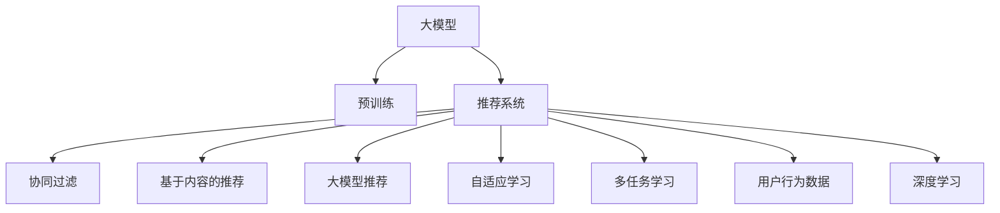

                 

# 大模型如何提升电商平台的用户体验个性化

> 关键词：电商平台, 用户个性化推荐, 大模型, 自适应学习, 深度学习, 多任务学习

## 1. 背景介绍

随着互联网和电子商务的迅速发展，电商平台逐渐成为人们日常生活中不可或缺的一部分。然而，面对海量商品信息，如何提升用户体验，使其能够快速找到满足自己需求的商品，成为了电商平台亟待解决的问题。传统的推荐系统多基于协同过滤或内容推荐，难以兼顾商品的多样性和个性化需求。而基于深度学习的个性化推荐技术，特别是在大模型的帮助下，能够从海量用户行为数据中挖掘隐含的关联关系，生成个性化推荐结果，大幅提升用户体验。

### 1.1 问题由来

电商平台推荐系统的核心任务是推荐用户可能感兴趣的商品。然而，现有的推荐算法在以下几个方面存在不足：

- **个性化不足**：推荐结果往往只考虑用户的历史行为数据，难以捕捉用户的隐性偏好和真实需求。
- **冷启动问题**：新用户或新商品缺乏历史数据，难以通过协同过滤等方法推荐。
- **鲁棒性差**：推荐模型在面对噪声数据、异常数据时，容易出现偏差，导致推荐结果不准确。
- **低效率**：推荐系统需要频繁更新，计算和存储成本较高，无法满足实时性要求。

面对这些问题，大语言模型及其衍生的大模型推荐技术提供了新的解决方案。通过预训练语言模型获取广泛的语言表示，再对用户行为数据进行微调，生成个性化的商品推荐，可以更好地满足用户的多样化需求，提升平台的转化率和用户满意度。

## 2. 核心概念与联系

### 2.1 核心概念概述

为更好地理解大模型如何提升电商平台的用户体验个性化，本节将介绍几个密切相关的核心概念：

- **大模型**：以BERT、GPT等预训练语言模型为代表的大规模神经网络模型，通过在大规模语料上进行预训练，学习通用的语言表示。
- **推荐系统**：通过分析用户的历史行为数据，为每个用户生成个性化的推荐列表。推荐系统可以是协同过滤、基于内容的推荐，也可以是大模型推荐。
- **多任务学习**：在同一模型上训练多个任务，实现模型参数共享，提高模型性能和泛化能力。
- **自适应学习**：根据用户的行为反馈，动态调整模型参数，使得推荐结果更加符合用户的真实需求。
- **用户行为数据**：包括用户的浏览历史、购买记录、评分反馈等，用于训练推荐模型。
- **深度学习**：通过多层神经网络实现特征提取和模式识别，具备强大的自适应学习能力。

这些核心概念之间的逻辑关系可以通过以下Mermaid流程图来展示：



这个流程图展示了大模型推荐系统的核心概念及其之间的关系：

1. 大模型通过预训练获得基础能力。
2. 推荐系统是大模型的具体应用，可以实现多种推荐策略。
3. 多任务学习和大模型推荐相结合，提高推荐精度。
4. 自适应学习根据用户反馈不断优化推荐模型。
5. 深度学习为推荐系统提供强大的建模能力。
6. 用户行为数据是多任务学习和自适应学习的重要输入。

## 3. 核心算法原理 & 具体操作步骤
### 3.1 算法原理概述

基于深度学习的大模型推荐系统，本质上是一个多任务学习的优化问题。其核心思想是：通过预训练语言模型获取通用的语言表示，再通过微调使其适应特定的推荐任务，生成个性化的商品推荐结果。

形式化地，假设预训练模型为 $M_{\theta}$，其中 $\theta$ 为预训练得到的模型参数。给定电商平台上的用户 $u$ 和商品 $i$，推荐系统需要找到推荐的商品列表 $L$，使得：

$$
\arg\max_{L} \prod_{x \in L} u(x)
$$

其中 $u(x)$ 为商品 $x$ 对用户 $u$ 的评分函数，可以通过深度学习模型进行估计。推荐系统的优化目标是最小化评分函数，即：

$$
\theta^* = \mathop{\arg\min}_{\theta} \sum_{(x,y)} \ell(u(x),y)
$$

其中 $\ell$ 为评分函数对预测评分与真实评分之间差异的损失函数，如均方误差损失、交叉熵损失等。

### 3.2 算法步骤详解

基于深度学习的大模型推荐系统一般包括以下几个关键步骤：

**Step 1: 准备预训练模型和数据集**
- 选择合适的预训练语言模型 $M_{\theta}$ 作为初始化参数，如 BERT、GPT 等。
- 准备电商平台上的用户行为数据集 $D=\{(u_i,i_j)\}_{i=1}^N$，包括用户的浏览历史、购买记录、评分反馈等。

**Step 2: 设计推荐模型**
- 根据任务需求，选择合适的深度学习模型，如全连接神经网络、RNN、CNN等。
- 设计评分函数 $u(x)$，可以基于用户画像、商品特征、用户行为等进行构建。
- 确定模型的输入输出层结构，以及损失函数。

**Step 3: 设置推荐系统超参数**
- 选择合适的优化算法及其参数，如 Adam、SGD 等，设置学习率、批大小、迭代轮数等。
- 设置正则化技术及强度，包括权重衰减、Dropout、Early Stopping等。
- 确定冻结预训练参数的策略，如仅微调顶层，或全部参数都参与微调。

**Step 4: 执行梯度训练**
- 将用户行为数据分批次输入模型，前向传播计算评分函数。
- 反向传播计算参数梯度，根据设定的优化算法和学习率更新模型参数。
- 周期性在验证集上评估模型性能，根据性能指标决定是否触发 Early Stopping。
- 重复上述步骤直到满足预设的迭代轮数或 Early Stopping 条件。

**Step 5: 测试和部署**
- 在测试集上评估推荐模型的性能，对比微调前后的推荐效果。
- 使用微调后的模型对新用户和新商品进行推荐，集成到实际的应用系统中。
- 持续收集新的用户行为数据，定期重新微调模型，以适应数据分布的变化。

以上是基于深度学习的大模型推荐系统的基本流程。在实际应用中，还需要针对具体任务的特点，对推荐过程的各个环节进行优化设计，如改进评分函数的构建，引入更多的正则化技术，搜索最优的超参数组合等，以进一步提升模型性能。

### 3.3 算法优缺点

基于深度学习的大模型推荐系统具有以下优点：
1. 深度学习模型具有强大的特征提取能力，可以捕捉复杂的用户行为和商品特征。
2. 大模型可以学习到广泛的隐含关联，生成更准确的推荐结果。
3. 多任务学习可以提升模型的泛化能力和性能，同时共享模型参数可以减少训练成本。
4. 自适应学习可以根据用户反馈动态调整模型，提高推荐系统的实时性和个性化水平。

同时，该方法也存在一定的局限性：
1. 对标注数据的依赖较大。推荐系统需要大量的用户行为数据进行训练，获取高质量标注数据的成本较高。
2. 模型计算量大。大规模神经网络模型的训练和推理需要大量的计算资源和存储空间。
3. 存在冷启动问题。对于新用户或新商品，缺乏历史数据，难以进行有效的推荐。
4. 模型的公平性和鲁棒性有待提升。推荐模型可能存在偏差，对某些用户或商品进行不公平的推荐。

尽管存在这些局限性，但就目前而言，基于深度学习的大模型推荐系统仍是最先进的技术范式。未来相关研究的重点在于如何进一步降低对标注数据的依赖，提高模型的泛化能力和实时性，同时兼顾公平性和鲁棒性等因素。

### 3.4 算法应用领域

基于深度学习的大模型推荐技术，在电子商务领域已经得到了广泛的应用，具体包括：

- **个性化推荐**：针对不同用户生成个性化的商品推荐列表。例如，基于用户画像和商品特征，生成商品排序列表。
- **商品分类**：根据用户行为数据，将商品自动分类到不同的类别中。例如，将用户浏览过的商品分为兴趣商品和一般商品。
- **评论分析**：对用户评论进行情感分析，判断用户对商品的满意度。例如，通过评论内容分类为正面、中性、负面。
- **搜索优化**：根据用户输入的搜索词，生成最相关的商品列表。例如，根据用户的搜索历史，预测其可能感兴趣的商品。
- **活动推荐**：根据用户行为数据，推荐平台的促销活动。例如，根据用户浏览历史，推荐限时优惠的商品。

除了上述这些经典任务外，大模型推荐技术也被创新性地应用到更多场景中，如商品价格预测、库存管理、广告投放等，为电商平台带来了更多的创新应用。

## 4. 数学模型和公式 & 详细讲解  
### 4.1 数学模型构建

本节将使用数学语言对基于深度学习的大模型推荐系统进行更加严格的刻画。

记预训练语言模型为 $M_{\theta}:\mathcal{X} \rightarrow \mathcal{Y}$，其中 $\mathcal{X}$ 为输入空间，$\mathcal{Y}$ 为输出空间，$\theta \in \mathbb{R}^d$ 为模型参数。假设电商平台上的推荐任务为预测用户对商品 $x$ 的评分 $u(x)$，即评分函数 $u(x)$ 为模型的输出。

定义推荐模型 $M_{\theta}$ 在用户行为数据 $D=\{(u_i,i_j)\}_{i=1}^N$ 上的损失函数为 $\ell(M_{\theta},D)$，即：

$$
\ell(M_{\theta},D) = \frac{1}{N}\sum_{i=1}^N \ell(u(x_i),y_i)
$$

其中 $\ell$ 为评分函数对预测评分与真实评分之间差异的损失函数，如均方误差损失、交叉熵损失等。

推荐系统的优化目标是最小化损失函数，即找到最优参数：

$$
\theta^* = \mathop{\arg\min}_{\theta} \ell(M_{\theta},D)
$$

在实践中，我们通常使用基于梯度的优化算法（如SGD、Adam等）来近似求解上述最优化问题。设 $\eta$ 为学习率，$\lambda$ 为正则化系数，则参数的更新公式为：

$$
\theta \leftarrow \theta - \eta \nabla_{\theta}\ell(M_{\theta},D) - \eta\lambda\theta
$$

其中 $\nabla_{\theta}\ell(M_{\theta},D)$ 为损失函数对参数 $\theta$ 的梯度，可通过反向传播算法高效计算。

### 4.2 公式推导过程

以下我们以二分类任务为例，推导均方误差损失函数及其梯度的计算公式。

假设推荐模型 $M_{\theta}$ 在输入 $x$ 上的输出为 $u(x)$，表示用户对商品 $x$ 的评分。真实评分 $y \in [0,1]$。则均方误差损失函数定义为：

$$
\ell(M_{\theta}(x),y) = \frac{1}{2}(u(x)-y)^2
$$

将其代入经验风险公式，得：

$$
\ell(M_{\theta},D) = \frac{1}{N}\sum_{i=1}^N (u(x_i)-y_i)^2
$$

根据链式法则，损失函数对参数 $\theta_k$ 的梯度为：

$$
\frac{\partial \ell(M_{\theta}(x),y)}{\partial \theta_k} = (u(x)-y) \frac{\partial u(x)}{\partial \theta_k}
$$

其中 $\frac{\partial u(x)}{\partial \theta_k}$ 可进一步递归展开，利用自动微分技术完成计算。

在得到损失函数的梯度后，即可带入参数更新公式，完成模型的迭代优化。重复上述过程直至收敛，最终得到适应推荐任务的最优模型参数 $\theta^*$。

## 5. 项目实践：代码实例和详细解释说明
### 5.1 开发环境搭建

在进行推荐系统实践前，我们需要准备好开发环境。以下是使用Python进行PyTorch开发的环境配置流程：

1. 安装Anaconda：从官网下载并安装Anaconda，用于创建独立的Python环境。

2. 创建并激活虚拟环境：
```bash
conda create -n pytorch-env python=3.8 
conda activate pytorch-env
```

3. 安装PyTorch：根据CUDA版本，从官网获取对应的安装命令。例如：
```bash
conda install pytorch torchvision torchaudio cudatoolkit=11.1 -c pytorch -c conda-forge
```

4. 安装Transformers库：
```bash
pip install transformers
```

5. 安装各类工具包：
```bash
pip install numpy pandas scikit-learn matplotlib tqdm jupyter notebook ipython
```

完成上述步骤后，即可在`pytorch-env`环境中开始推荐系统实践。

### 5.2 源代码详细实现

这里我们以电商平台个性化推荐系统为例，给出使用Transformers库对BERT模型进行推荐系统微调的PyTorch代码实现。

首先，定义推荐系统的数据处理函数：

```python
from transformers import BertTokenizer
from torch.utils.data import Dataset, DataLoader
import torch
import numpy as np

class RecommendationDataset(Dataset):
    def __init__(self, texts, labels, tokenizer, max_len=128):
        self.texts = texts
        self.labels = labels
        self.tokenizer = tokenizer
        self.max_len = max_len
        
    def __len__(self):
        return len(self.texts)
    
    def __getitem__(self, item):
        text = self.texts[item]
        label = self.labels[item]
        
        encoding = self.tokenizer(text, return_tensors='pt', max_length=self.max_len, padding='max_length', truncation=True)
        input_ids = encoding['input_ids'][0]
        attention_mask = encoding['attention_mask'][0]
        
        # 将评分函数作为输出
        label = torch.tensor(label, dtype=torch.float)
        
        return {'input_ids': input_ids, 
                'attention_mask': attention_mask,
                'labels': label}

# 标签范围
label_range = [0, 1]
id2label = {0: 'Low', 1: 'High'}

# 创建dataset
tokenizer = BertTokenizer.from_pretrained('bert-base-cased')

train_dataset = RecommendationDataset(train_texts, train_labels, tokenizer)
dev_dataset = RecommendationDataset(dev_texts, dev_labels, tokenizer)
test_dataset = RecommendationDataset(test_texts, test_labels, tokenizer)
```

然后，定义模型和优化器：

```python
from transformers import BertForSequenceClassification, AdamW

model = BertForSequenceClassification.from_pretrained('bert-base-cased', num_labels=len(label_range))
model.to(device)

optimizer = AdamW(model.parameters(), lr=2e-5)
```

接着，定义训练和评估函数：

```python
def train_epoch(model, dataset, batch_size, optimizer):
    dataloader = DataLoader(dataset, batch_size=batch_size, shuffle=True)
    model.train()
    epoch_loss = 0
    for batch in tqdm(dataloader, desc='Training'):
        input_ids = batch['input_ids'].to(device)
        attention_mask = batch['attention_mask'].to(device)
        labels = batch['labels'].to(device)
        model.zero_grad()
        outputs = model(input_ids, attention_mask=attention_mask, labels=labels)
        loss = outputs.loss
        epoch_loss += loss.item()
        loss.backward()
        optimizer.step()
    return epoch_loss / len(dataloader)

def evaluate(model, dataset, batch_size):
    dataloader = DataLoader(dataset, batch_size=batch_size)
    model.eval()
    preds, labels = [], []
    with torch.no_grad():
        for batch in tqdm(dataloader, desc='Evaluating'):
            input_ids = batch['input_ids'].to(device)
            attention_mask = batch['attention_mask'].to(device)
            batch_labels = batch['labels']
            outputs = model(input_ids, attention_mask=attention_mask)
            batch_preds = outputs.logits.argmax(dim=1).to('cpu').tolist()
            batch_labels = batch_labels.to('cpu').tolist()
            for pred, label in zip(batch_preds, batch_labels):
                preds.append(pred)
                labels.append(label)
                
    return preds, labels

def accuracy(preds, labels):
    return (np.array(preds) == np.array(labels)).mean()
```

最后，启动训练流程并在测试集上评估：

```python
epochs = 5
batch_size = 16

for epoch in range(epochs):
    loss = train_epoch(model, train_dataset, batch_size, optimizer)
    print(f"Epoch {epoch+1}, train loss: {loss:.3f}")
    
    preds, labels = evaluate(model, dev_dataset, batch_size)
    print(f"Epoch {epoch+1}, dev accuracy: {accuracy(preds, labels)}
    
print("Test results:")
preds, labels = evaluate(model, test_dataset, batch_size)
print(f"Test accuracy: {accuracy(preds, labels)}
```

以上就是使用PyTorch对BERT进行电商平台个性化推荐系统微调的完整代码实现。可以看到，得益于Transformers库的强大封装，我们可以用相对简洁的代码完成BERT模型的加载和微调。

### 5.3 代码解读与分析

让我们再详细解读一下关键代码的实现细节：

**RecommendationDataset类**：
- `__init__`方法：初始化文本、标签、分词器等关键组件。
- `__len__`方法：返回数据集的样本数量。
- `__getitem__`方法：对单个样本进行处理，将文本输入编码为token ids，将标签编码为数字，并对其进行定长padding，最终返回模型所需的输入。

**id2label字典**：
- 定义了评分标签与数字id之间的映射关系，用于将评分函数输出解码回真实的评分标签。

**训练和评估函数**：
- 使用PyTorch的DataLoader对数据集进行批次化加载，供模型训练和推理使用。
- 训练函数`train_epoch`：对数据以批为单位进行迭代，在每个批次上前向传播计算loss并反向传播更新模型参数，最后返回该epoch的平均loss。
- 评估函数`evaluate`：与训练类似，不同点在于不更新模型参数，并在每个batch结束后将预测和标签结果存储下来，最后使用自定义函数`accuracy`对整个评估集的预测结果进行打印输出。
- 自定义函数`accuracy`：计算预测标签与真实标签之间的准确率。

**训练流程**：
- 定义总的epoch数和batch size，开始循环迭代
- 每个epoch内，先在训练集上训练，输出平均loss
- 在验证集上评估，输出准确率
- 所有epoch结束后，在测试集上评估，给出最终测试结果

可以看到，PyTorch配合Transformers库使得BERT微调的代码实现变得简洁高效。开发者可以将更多精力放在数据处理、模型改进等高层逻辑上，而不必过多关注底层的实现细节。

当然，工业级的系统实现还需考虑更多因素，如模型的保存和部署、超参数的自动搜索、更灵活的任务适配层等。但核心的微调范式基本与此类似。

## 6. 实际应用场景
### 6.1 智能客服系统

基于大语言模型微调的对话技术，可以广泛应用于智能客服系统的构建。传统客服往往需要配备大量人力，高峰期响应缓慢，且一致性和专业性难以保证。而使用微调后的对话模型，可以7x24小时不间断服务，快速响应客户咨询，用自然流畅的语言解答各类常见问题。

在技术实现上，可以收集企业内部的历史客服对话记录，将问题和最佳答复构建成监督数据，在此基础上对预训练对话模型进行微调。微调后的对话模型能够自动理解用户意图，匹配最合适的答案模板进行回复。对于客户提出的新问题，还可以接入检索系统实时搜索相关内容，动态组织生成回答。如此构建的智能客服系统，能大幅提升客户咨询体验和问题解决效率。

### 6.2 金融舆情监测

金融机构需要实时监测市场舆论动向，以便及时应对负面信息传播，规避金融风险。传统的人工监测方式成本高、效率低，难以应对网络时代海量信息爆发的挑战。基于大语言模型微调的文本分类和情感分析技术，为金融舆情监测提供了新的解决方案。

具体而言，可以收集金融领域相关的新闻、报道、评论等文本数据，并对其进行主题标注和情感标注。在此基础上对预训练语言模型进行微调，使其能够自动判断文本属于何种主题，情感倾向是正面、中性还是负面。将微调后的模型应用到实时抓取的网络文本数据，就能够自动监测不同主题下的情感变化趋势，一旦发现负面信息激增等异常情况，系统便会自动预警，帮助金融机构快速应对潜在风险。

### 6.3 个性化推荐系统

当前的推荐系统往往只依赖用户的历史行为数据进行物品推荐，难以兼顾商品的多样性和个性化需求。基于大语言模型微调技术，个性化推荐系统可以更好地挖掘用户行为背后的语义信息，从而提供更精准、多样的推荐内容。

在实践中，可以收集用户浏览、点击、评论、分享等行为数据，提取和用户交互的物品标题、描述、标签等文本内容。将文本内容作为模型输入，用户的后续行为（如是否点击、购买等）作为监督信号，在此基础上微调预训练语言模型。微调后的模型能够从文本内容中准确把握用户的兴趣点。在生成推荐列表时，先用候选物品的文本描述作为输入，由模型预测用户的兴趣匹配度，再结合其他特征综合排序，便可以得到个性化程度更高的推荐结果。

### 6.4 未来应用展望

随着大语言模型和微调方法的不断发展，基于微调范式将在更多领域得到应用，为传统行业带来变革性影响。

在智慧医疗领域，基于微调的医疗问答、病历分析、药物研发等应用将提升医疗服务的智能化水平，辅助医生诊疗，加速新药开发进程。

在智能教育领域，微调技术可应用于作业批改、学情分析、知识推荐等方面，因材施教，促进教育公平，提高教学质量。

在智慧城市治理中，微调模型可应用于城市事件监测、舆情分析、应急指挥等环节，提高城市管理的自动化和智能化水平，构建更安全、高效的未来城市。

此外，在企业生产、社会治理、文娱传媒等众多领域，基于大模型微调的人工智能应用也将不断涌现，为经济社会发展注入新的动力。相信随着技术的日益成熟，微调方法将成为人工智能落地应用的重要范式，推动人工智能技术在垂直行业的规模化落地。总之，微调需要开发者根据具体任务，不断迭代和优化模型、数据和算法，方能得到理想的效果。

## 7. 工具和资源推荐
### 7.1 学习资源推荐

为了帮助开发者系统掌握大模型微调的理论基础和实践技巧，这里推荐一些优质的学习资源：

1. 《Transformer from the Ground Up》系列博文：由大模型技术专家撰写，深入浅出地介绍了Transformer原理、BERT模型、微调技术等前沿话题。

2. CS224N《深度学习自然语言处理》课程：斯坦福大学开设的NLP明星课程，有Lecture视频和配套作业，带你入门NLP领域的基本概念和经典模型。

3. 《Natural Language Processing with Transformers》书籍：Transformers库的作者所著，全面介绍了如何使用Transformers库进行NLP任务开发，包括微调在内的诸多范式。

4. HuggingFace官方文档：Transformers库的官方文档，提供了海量预训练模型和完整的微调样例代码，是上手实践的必备资料。

5. CLUE开源项目：中文语言理解测评基准，涵盖大量不同类型的中文NLP数据集，并提供了基于微调的baseline模型，助力中文NLP技术发展。

通过对这些资源的学习实践，相信你一定能够快速掌握大模型微调的精髓，并用于解决实际的NLP问题。
###  7.2 开发工具推荐

高效的开发离不开优秀的工具支持。以下是几款用于大模型微调开发的常用工具：

1. PyTorch：基于Python的开源深度学习框架，灵活动态的计算图，适合快速迭代研究。大部分预训练语言模型都有PyTorch版本的实现。

2. TensorFlow：由Google主导开发的开源深度学习框架，生产部署方便，适合大规模工程应用。同样有丰富的预训练语言模型资源。

3. Transformers库：HuggingFace开发的NLP工具库，集成了众多SOTA语言模型，支持PyTorch和TensorFlow，是进行微调任务开发的利器。

4. Weights & Biases：模型训练的实验跟踪工具，可以记录和可视化模型训练过程中的各项指标，方便对比和调优。与主流深度学习框架无缝集成。

5. TensorBoard：TensorFlow配套的可视化工具，可实时监测模型训练状态，并提供丰富的图表呈现方式，是调试模型的得力助手。

6. Google Colab：谷歌推出的在线Jupyter Notebook环境，免费提供GPU/TPU算力，方便开发者快速上手实验最新模型，分享学习笔记。

合理利用这些工具，可以显著提升大模型微调任务的开发效率，加快创新迭代的步伐。

### 7.3 相关论文推荐

大语言模型和微调技术的发展源于学界的持续研究。以下是几篇奠基性的相关论文，推荐阅读：

1. Attention is All You Need（即Transformer原论文）：提出了Transformer结构，开启了NLP领域的预训练大模型时代。

2. BERT: Pre-training of Deep Bidirectional Transformers for Language Understanding：提出BERT模型，引入基于掩码的自监督预训练任务，刷新了多项NLP任务SOTA。

3. Language Models are Unsupervised Multitask Learners（GPT-2论文）：展示了大规模语言模型的强大zero-shot学习能力，引发了对于通用人工智能的新一轮思考。

4. Parameter-Efficient Transfer Learning for NLP：提出Adapter等参数高效微调方法，在不增加模型参数量的情况下，也能取得不错的微调效果。

5. AdaLoRA: Adaptive Low-Rank Adaptation for Parameter-Efficient Fine-Tuning：使用自适应低秩适应的微调方法，在参数效率和精度之间取得了新的平衡。

这些论文代表了大语言模型微调技术的发展脉络。通过学习这些前沿成果，可以帮助研究者把握学科前进方向，激发更多的创新灵感。

## 8. 总结：未来发展趋势与挑战

### 8.1 总结

本文对基于深度学习的大模型推荐系统进行了全面系统的介绍。首先阐述了电商平台推荐系统的核心任务和现有推荐算法的局限性，明确了大模型推荐系统的优势和实际应用。其次，从原理到实践，详细讲解了深度学习模型在大模型推荐系统中的构建和训练方法，给出了微调任务开发的完整代码实例。同时，本文还广泛探讨了微调方法在智能客服、金融舆情、个性化推荐等多个行业领域的应用前景，展示了微调范式的巨大潜力。此外，本文精选了微调技术的各类学习资源，力求为读者提供全方位的技术指引。

通过本文的系统梳理，可以看到，基于深度学习的大模型推荐方法正在成为NLP领域的重要范式，极大地拓展了推荐系统的应用边界，催生了更多的落地场景。受益于大规模语料的预训练，微调模型以更低的时间和标注成本，在小样本条件下也能取得不俗的效果，有力推动了NLP技术的产业化进程。未来，伴随深度学习模型和微调方法的持续演进，相信NLP技术必将在更广阔的应用领域大放异彩，深刻影响人类的生产生活方式。

### 8.2 未来发展趋势

展望未来，基于深度学习的大模型推荐技术将呈现以下几个发展趋势：

1. 模型规模持续增大。随着算力成本的下降和数据规模的扩张，预训练语言模型的参数量还将持续增长。超大规模语言模型蕴含的丰富语言知识，有望支撑更加复杂多变的推荐任务。

2. 微调方法日趋多样。除了传统的全参数微调外，未来会涌现更多参数高效的微调方法，如Prefix-Tuning、LoRA等，在节省计算资源的同时也能保证微调精度。

3. 持续学习成为常态。随着数据分布的不断变化，推荐模型也需要持续学习新知识以保持性能。如何在不遗忘原有知识的同时，高效吸收新样本信息，将成为重要的研究课题。

4. 标注样本需求降低。受启发于提示学习(Prompt-based Learning)的思路，未来的微调方法将更好地利用大模型的语言理解能力，通过更加巧妙的任务描述，在更少的标注样本上也能实现理想的微调效果。

5. 多模态推荐崛起。当前的推荐系统多聚焦于文本数据，未来会进一步拓展到图像、视频、语音等多模态数据推荐。多模态信息的融合，将显著提升推荐系统的泛化能力和用户体验。

6. 推荐系统更为个性化。通过引入因果推断和强化学习思想，推荐系统可以更好地理解用户行为背后的因果关系，提升推荐系统的个性化和交互性。

以上趋势凸显了大模型推荐系统的广阔前景。这些方向的探索发展，必将进一步提升推荐系统的性能和应用范围，为电商平台的数字化转型升级提供新的技术路径。相信随着技术的日益成熟，微调方法将成为电商平台推荐系统的重要范式，推动电商平台向智能化、个性化、实时化的方向不断进步。

### 8.3 面临的挑战

尽管大模型推荐技术已经取得了瞩目成就，但在迈向更加智能化、普适化应用的过程中，它仍面临着诸多挑战：

1. 标注成本瓶颈。虽然微调大大降低了标注数据的需求，但对于长尾应用场景，难以获得充足的高质量标注数据，成为制约微调性能的瓶颈。如何进一步降低微调对标注样本的依赖，将是一大难题。

2. 模型鲁棒性不足。当前微调模型面对噪声数据、异常数据时，容易出现偏差，导致推荐结果不准确。如何提高微调模型的鲁棒性，避免灾难性遗忘，还需要更多理论和实践的积累。

3. 低效率问题。大规模神经网络模型的训练和推理需要大量的计算资源和存储空间。如何在保证性能的同时，优化模型结构，提升推理速度，优化资源占用，将是重要的优化方向。

4. 模型的公平性和鲁棒性有待提升。推荐模型可能存在偏差，对某些用户或商品进行不公平的推荐。如何从数据和算法层面消除模型偏见，避免恶意用途，确保输出的安全性，也将是重要的研究课题。

5. 数据隐私和安全问题。在推荐系统中，用户行为数据隐私保护和数据安全是重要问题。如何设计数据保护机制，确保用户隐私和数据安全，将是推荐系统开发的重点。

6. 推荐系统的可解释性不足。当前推荐模型往往作为"黑盒"系统，难以解释其内部工作机制和决策逻辑。对于医疗、金融等高风险应用，算法的可解释性和可审计性尤为重要。如何赋予推荐系统更强的可解释性，将是亟待攻克的难题。

这些挑战需要学界和工业界共同应对，通过不断优化模型、改进算法、加强数据保护，才能使推荐系统在更加复杂和多变的场景中发挥更大的作用。

### 8.4 研究展望

面对大模型推荐系统所面临的种种挑战，未来的研究需要在以下几个方面寻求新的突破：

1. 探索无监督和半监督推荐方法。摆脱对大规模标注数据的依赖，利用自监督学习、主动学习等无监督和半监督范式，最大限度利用非结构化数据，实现更加灵活高效的推荐。

2. 研究参数高效和计算高效的推荐范式。开发更加参数高效的推荐方法，在固定大部分预训练参数的同时，只更新极少量的任务相关参数。同时优化推荐模型的计算图，减少前向传播和反向传播的资源消耗，实现更加轻量级、实时性的部署。

3. 融合因果推断和强化学习范式。通过引入因果推断和强化学习思想，增强推荐系统建立稳定因果关系的能力，学习更加普适、鲁棒的语言表征，从而提升推荐系统的泛化性和抗干扰能力。

4. 引入更多先验知识。将符号化的先验知识，如知识图谱、逻辑规则等，与神经网络模型进行巧妙融合，引导推荐过程学习更准确、合理的语言模型。同时加强不同模态数据的整合，实现视觉、语音等多模态信息与文本信息的协同建模。

5. 结合因果分析和博弈论工具。将因果分析方法引入推荐系统，识别出推荐决策的关键特征，增强推荐系统的可解释性和可审计性。借助博弈论工具刻画人机交互过程，主动探索并规避推荐系统的脆弱点，提高系统稳定性。

6. 纳入伦理道德约束。在推荐系统设计目标中引入伦理导向的评估指标，过滤和惩罚有偏见、有害的推荐结果。同时加强人工干预和审核，建立推荐系统的监管机制，确保推荐内容符合用户价值观和伦理道德。

这些研究方向的探索，必将引领大模型推荐系统迈向更高的台阶，为构建安全、可靠、可解释、可控的智能推荐系统铺平道路。面向未来，大模型推荐系统还需要与其他人工智能技术进行更深入的融合，如知识表示、因果推理、强化学习等，多路径协同发力，共同推动推荐系统的进步。只有勇于创新、敢于突破，才能不断拓展推荐系统的边界，让智能技术更好地服务于人类。

## 9. 附录：常见问题与解答

**Q1：大模型推荐系统如何处理冷启动问题？**

A: 冷启动问题是推荐系统普遍面临的问题，大模型推荐系统通过引入多任务学习机制，可以更好地处理冷启动问题。具体而言，可以在用户没有历史行为数据的情况下，设计多个相关任务，如商品相似度、用户画像、热点商品等，通过多任务学习共同训练，提升模型的泛化能力和鲁棒性。同时，可以引入元学习机制，在有限的标注数据上，通过小样本学习策略，快速适应新用户和新商品。

**Q2：微调大模型推荐系统时需要注意哪些问题？**

A: 微调大模型推荐系统时需要注意以下问题：
1. 标注数据的收集和处理：需要确保标注数据的质量和多样性，避免偏差和噪声。
2. 模型的选择和构建：选择合适的深度学习模型和评分函数，保证模型的泛化能力和鲁棒性。
3. 超参数的调优：需要合理设置学习率、批大小、迭代轮数等超参数，避免过拟合和欠拟合。
4. 正则化和优化器选择：需要合理选择正则化技术（如L2正则、Dropout等）和优化器（如Adam、SGD等），保证模型的稳定性和收敛速度。
5. 数据增强和对抗训练：需要通过数据增强和对抗训练，提高模型的泛化能力和鲁棒性。
6. 模型的评估和优化：需要定期在验证集上评估模型性能，及时调整模型参数，优化推荐结果。

**Q3：微调大模型推荐系统时如何提高模型的鲁棒性？**

A: 提高微调大模型推荐系统的鲁棒性，需要从数据、模型和算法多个方面进行优化：
1. 数据清洗和预处理：需要对数据进行清洗和预处理，去除噪声和异常值，提高数据质量。
2. 多任务学习和元学习：可以通过多任务学习，提升模型的泛化能力和鲁棒性，同时在有限的标注数据上，通过元学习策略，快速适应新数据。
3. 对抗训练和鲁棒优化：可以通过对抗训练和鲁棒优化，提高模型的鲁棒性和抗干扰能力，避免推荐结果受到噪声数据的干扰。
4. 模型集成和融合：可以通过模型集成和融合，提升模型的稳定性和泛化能力，避免单个模型的过拟合和偏差。

这些优化策略可以结合使用，全面提升微调大模型推荐系统的鲁棒性和泛化能力。

**Q4：大模型推荐系统如何在推荐过程中实现个性化？**

A: 大模型推荐系统可以通过以下方式实现个性化：
1. 用户画像构建：通过收集和分析用户的历史行为数据，构建用户画像，包括用户的兴趣偏好、行为习惯等，用于个性化推荐。
2. 商品特征提取：对商品的标题、描述、标签等文本信息进行自然语言处理，提取商品特征，用于个性化推荐。
3. 多模态信息融合：通过融合多模态信息，如商品图片、视频等，提升推荐系统的泛化能力和用户体验。
4. 动态推荐策略：通过引入动态推荐策略，如基于时序的推荐、基于内容的推荐等，实现个性化推荐。
5. 用户反馈机制：通过收集用户的反馈和评价，不断优化推荐模型，提升推荐系统的个性化和交互性。

这些方法可以结合使用，全面提升大模型推荐系统的个性化水平，满足用户的不同需求。

**Q5：大模型推荐系统在电商平台上如何处理数据隐私和安全问题？**

A: 大模型推荐系统在电商平台上处理数据隐私和安全问题，需要从以下几个方面进行优化：
1. 数据匿名化：需要对用户行为数据进行匿名化处理，去除敏感信息，保护用户隐私。
2. 数据加密和存储：需要对用户行为数据进行加密存储，防止数据泄露和未授权访问。
3. 用户控制和同意：需要设计用户控制机制，让用户可以控制自己的数据隐私和同意使用范围。
4. 数据访问权限管理：需要设计数据访问权限管理机制，确保只有授权人员可以访问和使用用户行为数据。
5. 异常检测和防护：需要设计异常检测和防护机制，及时发现和应对数据安全威胁。
6. 合规性保障：需要确保推荐系统的设计和实现符合数据隐私和安全相关的法律法规和标准。

这些措施可以结合使用，全面保障大模型推荐系统的数据隐私和安全，确保用户的权益和平台的合规性。

