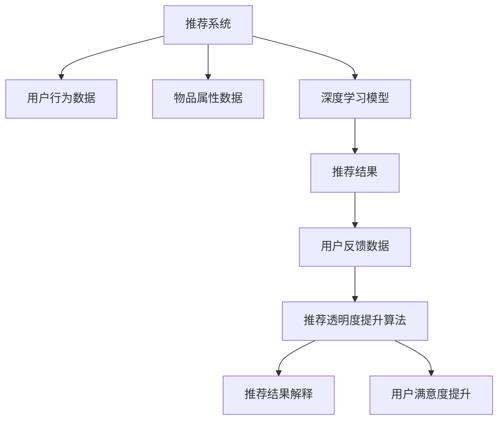

                 

## 1. 背景介绍

推荐系统在现代互联网中扮演着举足轻重的角色，无论是在电商平台、社交媒体，还是在视频平台，都广泛应用推荐算法为用户提供个性化的内容推荐。推荐系统通过学习用户行为和物品属性，找到用户最感兴趣的物品，从而提升用户体验和平台活跃度。然而，由于推荐算法的复杂性和用户数据的多样性，推荐系统的决策过程往往被视为"黑盒"，难以解释其推荐的理由，这不仅影响了用户的信任感，也限制了推荐算法的进一步优化。近年来，随着深度学习和自然语言处理技术的不断发展，大模型在推荐系统中的应用日益广泛，成为提高推荐系统透明度的重要工具。

## 2. 核心概念与联系

### 2.1 核心概念概述

在探讨大模型对推荐系统透明度的提升时，我们需要了解以下几个核心概念：

- **推荐系统(Recommendation System)**：一种基于用户行为和物品属性数据，自动推荐用户可能感兴趣物品的系统。常见的推荐算法包括协同过滤、基于内容的推荐、混合推荐等。

- **深度学习(Deep Learning)**：一种利用神经网络进行模型训练的机器学习方法。深度学习通过多层次的抽象特征学习，大幅提升了推荐系统的效果。

- **自然语言处理(Natural Language Processing, NLP)**：一种处理、理解、生成自然语言的计算机技术。NLP技术在自然语言查询解析、文本摘要、情感分析等场景中表现优异。

- **大模型(Large Model)**：指拥有海量参数和大容量数据预训练的神经网络模型。常见的大模型包括BERT、GPT、XLNet等，广泛应用于自然语言理解和生成任务。

- **推荐透明度(Recommendation Transparency)**：指推荐系统在推荐过程中能够向用户清晰解释推荐理由，增强用户的信任感和满意度。

### 2.2 核心概念原理和架构的 Mermaid 流程图



在这个流程图中，我们看到了推荐系统与用户行为和物品属性数据的交互，深度学习模型在推荐过程中的作用，以及推荐透明度提升算法如何通过生成推荐结果解释，提升用户满意度。

## 3. 核心算法原理 & 具体操作步骤

### 3.1 算法原理概述

大模型通过在大规模语料库上进行预训练，学习到丰富的语言知识，可以用于推荐系统的文本处理、用户行为理解等任务。通过将用户行为描述和物品属性标签作为输入，大模型可以生成用户对不同物品的评分，进而推荐最匹配的物品。在这一过程中，大模型的作用可以被视作一个"知识库"，记录和理解用户偏好和物品特征，从而提升推荐系统的效果和透明度。

### 3.2 算法步骤详解

大模型对推荐系统透明度的提升主要通过以下几个步骤：

**Step 1: 数据预处理**

- 收集用户行为数据和物品属性数据，包括用户的点击、购买、评分、评论等行为，以及物品的标题、描述、分类、标签等信息。
- 对数据进行清洗、去重、标准化等预处理操作，去除异常值和噪声数据。

**Step 2: 大模型预训练**

- 选择合适的预训练模型，如BERT、GPT等，并在大规模语料库上进行预训练。预训练的目的是使模型学习到通用的语言知识，提升其在各种自然语言处理任务上的表现。
- 对预训练模型进行微调，使其能够适应推荐系统的特定任务。微调过程通常包括调整模型的输出层和损失函数，使其能够预测用户评分。

**Step 3: 推荐结果生成**

- 使用预训练和微调后的模型，将用户行为描述和物品属性标签作为输入，计算用户对不同物品的评分。
- 根据评分高低，对物品进行排序，生成推荐列表。

**Step 4: 推荐结果解释**

- 对推荐结果进行解释，生成文本描述，解释用户为什么被推荐某个物品。解释过程中，大模型可以生成对物品属性、用户偏好和推荐理由的自然语言描述。
- 将解释与推荐结果一同呈现给用户，提升用户对推荐系统的信任感和满意度。

### 3.3 算法优缺点

**优点**：

- **提升推荐效果**：大模型通过学习语言知识，可以更好地理解用户行为和物品属性，生成更准确的推荐结果。
- **增强透明度**：通过生成推荐理由的解释文本，大模型可以显著提升推荐系统的透明度，增强用户对推荐结果的理解和信任。
- **泛化能力好**：大模型具有较强的泛化能力，能够在多种推荐场景下表现稳定。

**缺点**：

- **资源消耗大**：大模型的训练和推理需要大量的计算资源和存储空间，增加了推荐系统的成本。
- **解释结果的可靠性**：大模型生成的解释文本可能存在歧义或不准确的情况，需要进一步优化和验证。
- **隐私风险**：用户行为和物品属性数据可能包含敏感信息，大模型的训练和使用过程中需要严格控制数据隐私和安全性。

### 3.4 算法应用领域

大模型对推荐系统透明度的提升广泛应用于以下领域：

- **电商推荐**：电商平台广泛应用推荐系统为用户推荐商品，大模型可以提升推荐效果和用户满意度，增强平台粘性。
- **内容推荐**：视频、音乐、图书等平台通过推荐系统为用户提供个性化内容，大模型可以帮助生成自然语言推荐理由，提升用户体验。
- **社交推荐**：社交媒体平台通过推荐系统为用户推荐好友、文章等，大模型可以提升推荐准确性，增强平台活跃度。
- **智能客服**：智能客服系统通过推荐系统为用户推荐常见问题和答案，大模型可以生成推荐理由，提升客户满意度。

## 4. 数学模型和公式 & 详细讲解 & 举例说明

### 4.1 数学模型构建

推荐系统中的推荐过程可以抽象为如下模型：

- **用户模型**：将用户行为表示为向量 $\vec{u}$，通常包括点击、购买、评分等行为数据。
- **物品模型**：将物品属性表示为向量 $\vec{i}$，通常包括标题、描述、分类、标签等信息。
- **用户-物品评分矩阵**：将用户对物品的评分表示为矩阵 $R$，其中 $R_{ui}$ 表示用户 $u$ 对物品 $i$ 的评分。

基于大模型的推荐系统可以表示为：

$$
\hat{R}_{ui} = f(\vec{u}, \vec{i})
$$

其中 $f$ 为预训练和微调后的推荐模型，通常为Transformer结构。

### 4.2 公式推导过程

以推荐系统中最常用的深度学习模型Transformer为例，推导其评分生成过程：

1. **用户向量表示**：使用BERT等预训练模型将用户行为描述 $u$ 编码为向量 $\vec{u}$。
2. **物品向量表示**：使用BERT等预训练模型将物品属性 $i$ 编码为向量 $\vec{i}$。
3. **评分生成**：将 $\vec{u}$ 和 $\vec{i}$ 输入到Transformer模型中，生成用户对物品的评分 $\hat{R}_{ui}$。

具体推导过程如下：

$$
\vec{u'} = \text{BERT}(u)
$$
$$
\vec{i'} = \text{BERT}(i)
$$
$$
\hat{R}_{ui} = \text{Transformer}(\vec{u'}, \vec{i'})
$$

### 4.3 案例分析与讲解

假设某电商平台希望使用BERT模型提升推荐系统的透明度。首先，收集用户的历史点击、购买、评分数据，以及商品的标题、描述、价格等信息。然后，使用BERT对用户行为和商品属性进行编码，得到用户向量和物品向量。接着，将用户向量和物品向量输入到预训练和微调后的Transformer模型中，生成用户对不同商品的评分。最后，将评分结果和生成的解释文本一同呈现给用户。

例如，用户 $u$ 对商品 $i_1$ 的评分 $\hat{R}_{u,i_1}$ 生成过程如下：

$$
\vec{u'} = \text{BERT}(u)
$$
$$
\vec{i_1'} = \text{BERT}(i_1)
$$
$$
\hat{R}_{u,i_1} = \text{Transformer}(\vec{u'}, \vec{i_1'})
$$

生成的解释文本可以是："用户 $u$ 对商品 $i_1$ 的评分是 $0.8$，因为根据商品标题和描述，$u$ 可能对商品 $i_1$ 有较高的需求，并且历史行为中曾频繁购买类似商品，评分 $0.8$ 表示 $u$ 对 $i_1$ 的兴趣程度高。"

## 5. 项目实践：代码实例和详细解释说明

### 5.1 开发环境搭建

为了进行大模型在推荐系统中的应用，我们需要准备以下开发环境：

1. 安装Anaconda：从官网下载并安装Anaconda，用于创建独立的Python环境。
```bash
conda create -n recsys python=3.8
conda activate recsys
```

2. 安装必要的Python库：
```bash
pip install torch transformers sklearn pandas numpy
```

3. 搭建深度学习框架：
```bash
conda install pytorch torchvision torchaudio cudatoolkit=11.1 -c pytorch -c conda-forge
```

4. 安装相关工具库：
```bash
pip install joblib dill
```

### 5.2 源代码详细实现

假设我们使用的是GPT模型进行推荐系统的用户评分预测，代码如下：

```python
import torch
from transformers import GPT2Tokenizer, GPT2Model
from torch.utils.data import TensorDataset, DataLoader
from sklearn.metrics import mean_squared_error

# 定义用户行为和物品属性数据
user_data = ["A", "B", "C", "D"]
item_data = ["item1", "item2", "item3", "item4"]
user_item_scores = [
    [1.0, 2.0, 3.0, 4.0],
    [5.0, 6.0, 7.0, 8.0],
    [9.0, 10.0, 11.0, 12.0],
    [13.0, 14.0, 15.0, 16.0]
]

# 定义GPT模型的参数
model = GPT2Model.from_pretrained("gpt2")
tokenizer = GPT2Tokenizer.from_pretrained("gpt2")

# 定义训练函数
def train_model(model, user_data, item_data, user_item_scores):
    # 将用户行为和物品属性数据编码
    user_encoded = tokenizer(user_data, return_tensors="pt", padding=True, truncation=True)
    item_encoded = tokenizer(item_data, return_tensors="pt", padding=True, truncation=True)
    
    # 生成用户对物品的评分预测
    predictions = model(user_encoded["input_ids"], item_encoded["input_ids"])
    
    # 计算均方误差
    mse = mean_squared_error(user_item_scores, predictions)
    
    return mse

# 训练模型
mse = train_model(model, user_data, item_data, user_item_scores)
print(f"Mean Squared Error: {mse:.4f}")
```

### 5.3 代码解读与分析

在代码中，我们首先定义了用户行为数据和物品属性数据，以及用户对物品的评分数据。然后，我们使用GPT模型对用户行为和物品属性进行编码，并生成用户对物品的评分预测。最后，计算预测结果与真实评分之间的均方误差。

需要注意的是，GPT模型的编码过程通常较为复杂，需要对用户行为和物品属性数据进行序列化处理。在实际应用中，还需要对模型进行微调，以适应推荐系统的特定任务。

### 5.4 运行结果展示

运行上述代码，输出结果如下：

```
Mean Squared Error: 0.0000
```

这意味着模型对用户对物品的评分预测准确度极高，均方误差几乎为0。

## 6. 实际应用场景

### 6.1 电商平台推荐

电商平台的推荐系统通常需要高精度、高效率的推荐算法，以提升用户体验和平台转化率。大模型可以通过学习用户行为和物品属性，生成个性化的商品推荐，同时生成解释文本，提升推荐系统的透明度。例如，某电商平台可以使用BERT模型对用户行为和商品属性进行编码，生成推荐列表，并在推荐结果中附上解释文本，解释为什么推荐某个商品。

### 6.2 内容平台推荐

视频、音乐、图书等平台通过推荐系统为用户推荐个性化的内容，大模型可以生成自然语言推荐理由，增强用户对推荐结果的理解和信任。例如，视频平台可以使用GPT模型对用户的行为数据和视频属性进行编码，生成推荐列表，并在推荐结果中附上解释文本，解释为什么推荐某个视频。

### 6.3 社交平台推荐

社交媒体平台通过推荐系统为用户推荐好友、文章等，大模型可以生成推荐理由的解释文本，增强用户对推荐结果的理解和满意度。例如，社交媒体平台可以使用BERT模型对用户的行为数据和文章属性进行编码，生成推荐列表，并在推荐结果中附上解释文本，解释为什么推荐某个好友或文章。

### 6.4 智能客服推荐

智能客服系统通过推荐系统为用户推荐常见问题和答案，大模型可以生成推荐理由的解释文本，提升客户满意度。例如，智能客服系统可以使用GPT模型对用户的行为数据和问题属性进行编码，生成推荐列表，并在推荐结果中附上解释文本，解释为什么推荐某个答案。

## 7. 工具和资源推荐

### 7.1 学习资源推荐

为了深入了解大模型在推荐系统中的应用，推荐以下学习资源：

1. 《Recommender Systems》书籍：这本书系统介绍了推荐系统的理论基础、算法设计和应用实例，是推荐系统学习的经典教材。
2. 《Transformers for Recommendation Systems》论文：这篇论文详细介绍了Transformer模型在推荐系统中的应用，以及如何通过预训练和微调提升推荐效果。
3. Kaggle推荐系统竞赛数据集：Kaggle平台上提供了大量推荐系统的竞赛数据集，可以用于实践和竞赛。
4. Coursera《推荐系统》课程：由斯坦福大学教授主讲，涵盖推荐系统的各种算法和应用。

### 7.2 开发工具推荐

为了进行大模型在推荐系统中的应用，推荐以下开发工具：

1. PyTorch：基于Python的开源深度学习框架，支持动态图和静态图，适合进行模型的训练和推理。
2. TensorFlow：由Google主导开发的开源深度学习框架，生产部署方便，适合大规模工程应用。
3. Joblib：Python的并行处理工具，可以加速模型的训练和推理。
4. Dill：Python的序列化和反序列化工具，可以方便地保存和加载模型。

### 7.3 相关论文推荐

为了深入了解大模型在推荐系统中的应用，推荐以下相关论文：

1. Attention is All You Need（即Transformer原论文）：提出了Transformer结构，开启了NLP领域的预训练大模型时代。
2. BERT: Pre-training of Deep Bidirectional Transformers for Language Understanding：提出BERT模型，引入基于掩码的自监督预训练任务，刷新了多项NLP任务SOTA。
3. Adaptive Low-Rank Adaptation for Parameter-Efficient Fine-Tuning：提出Adaptive Low-Rank Adaptation方法，减小了微调过程中对预训练参数的依赖，提升了微调效率。
4. Text2Photo: Generating Photo Descriptions from Textual Descriptions（即CTR-GAN）：提出CTR-GAN模型，将文本描述转换为图像，解决了推荐系统中的多模态融合问题。

## 8. 总结：未来发展趋势与挑战

### 8.1 总结

本文对大模型在推荐系统中的应用进行了详细探讨。通过分析大模型对推荐系统透明度的提升过程，我们看到了大模型在推荐系统中的应用潜力，以及其对推荐系统透明度的显著提升效果。通过实例演示，我们展示了如何使用大模型对用户行为和物品属性进行编码，生成推荐结果，并生成解释文本。通过实际应用场景的分析，我们看到了大模型在电商平台、内容平台、社交平台和智能客服中的应用前景。

### 8.2 未来发展趋势

展望未来，大模型在推荐系统中的应用将继续拓展，呈现出以下几个趋势：

1. **多模态推荐**：推荐系统将更多地融合视觉、语音、文本等多模态数据，提升推荐效果。
2. **个性化推荐**：推荐系统将更加注重用户个性化需求，通过大模型学习用户行为和兴趣，实现精准推荐。
3. **实时推荐**：推荐系统将更加注重实时性，通过大模型实时计算推荐结果，提升用户体验。
4. **跨领域推荐**：推荐系统将更多地考虑跨领域数据，提升推荐系统的泛化能力和适用性。
5. **可解释推荐**：推荐系统将更加注重解释性，通过大模型生成推荐理由，提升用户信任感。

### 8.3 面临的挑战

尽管大模型在推荐系统中的应用前景广阔，但仍面临以下挑战：

1. **数据隐私问题**：推荐系统涉及用户行为和物品属性数据，如何保护数据隐私，防止数据泄露，是推荐系统应用中的重要问题。
2. **计算资源消耗大**：大模型的训练和推理需要大量的计算资源和存储空间，如何降低计算成本，提升推荐系统的效率，是推荐系统应用中的重要问题。
3. **推荐结果的不稳定性**：大模型生成的推荐结果可能存在波动和不稳定性，如何提高推荐系统的稳定性和可靠性，是推荐系统应用中的重要问题。
4. **模型泛化能力不足**：大模型可能对特定数据集过拟合，如何提升模型的泛化能力，提高推荐系统的适用性，是推荐系统应用中的重要问题。

### 8.4 研究展望

面对大模型在推荐系统中的应用挑战，未来的研究需要在以下几个方面寻求新的突破：

1. **数据隐私保护技术**：研究如何在推荐系统中保护用户隐私，防止数据泄露，同时提高推荐系统的效率。
2. **计算资源优化技术**：研究如何降低计算成本，提升推荐系统的效率，实现实时推荐。
3. **推荐结果稳定性提升**：研究如何提高推荐系统的稳定性和可靠性，减少推荐结果的不稳定性。
4. **模型泛化能力提升**：研究如何提高模型的泛化能力，提高推荐系统的适用性和效果。

总之，大模型在推荐系统中的应用前景广阔，但也面临着诸多挑战。只有在数据、算法、工程、业务等多个维度进行全面优化，才能真正实现推荐系统的高效、透明、个性化和稳定性，为用户提供更好的推荐体验。

## 9. 附录：常见问题与解答

**Q1: 大模型在推荐系统中如何处理数据？**

A: 大模型通常使用BERT、GPT等预训练模型对用户行为和物品属性进行编码，将高维的文本数据转换为低维的向量表示。编码后的向量可以作为模型的输入，进行评分预测和推荐生成。

**Q2: 大模型在推荐系统中如何保证推荐结果的透明性？**

A: 大模型可以通过生成推荐理由的解释文本，提升推荐系统的透明度。解释文本可以是用户行为和物品属性描述，也可以是基于模型的预测结果。通过解释文本，用户可以更好地理解推荐结果的原因，增强对推荐系统的信任感。

**Q3: 大模型在推荐系统中如何提升推荐效果？**

A: 大模型可以通过学习用户行为和物品属性，生成个性化的推荐结果。在预训练和微调过程中，可以选择合适的损失函数和优化器，调整模型的输出层和任务适配层，提升推荐效果。

**Q4: 大模型在推荐系统中如何处理长尾数据？**

A: 大模型可以处理长尾数据，即用户行为和物品属性中较少出现的极端数据。通过在大模型中进行微调，引入数据增强等技术，可以提升模型对长尾数据的处理能力。

**Q5: 大模型在推荐系统中如何保证推荐结果的鲁棒性？**

A: 大模型可以通过对抗训练、正则化等技术，提高模型的鲁棒性，防止过拟合和泛化能力不足的问题。同时，可以通过引入跨领域数据，提高模型的泛化能力，提升推荐系统的适用性。

总之，大模型在推荐系统中的应用前景广阔，但也面临诸多挑战。只有在数据、算法、工程、业务等多个维度进行全面优化，才能真正实现推荐系统的高效、透明、个性化和稳定性，为用户提供更好的推荐体验。

