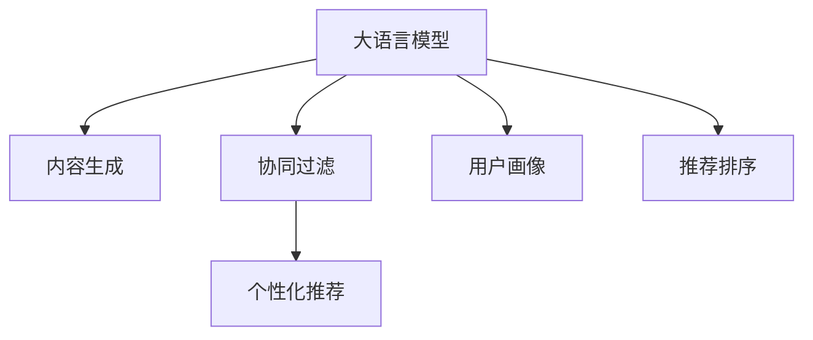

                 

# 大模型对推荐系统长尾用户服务的改进

> 关键词：大模型，推荐系统，长尾用户，个性化推荐，内容生成，协同过滤

## 1. 背景介绍

### 1.1 问题由来

随着互联网的发展，用户对于推荐系统的要求日益增长。传统推荐系统主要依赖用户历史行为数据进行推荐，难以覆盖长尾用户，即那些访问频次低、购买频次少的用户。长尾用户虽然只占少数，但其消费潜力巨大，未能得到充分挖掘，导致资源浪费和用户体验不佳。

针对这一问题，近年来大语言模型在推荐系统中的应用逐渐引起关注。大模型通过大规模预训练和迁移学习，可以充分利用结构化、非结构化等多源数据，提供个性化的推荐服务。同时，大模型在内容生成和协同过滤方面的应用，也使得推荐系统能够更好地处理长尾用户，提升用户满意度。

### 1.2 问题核心关键点

大语言模型在推荐系统中的应用，主要集中在以下几个方面：

- 内容生成：通过生成高质量的文本描述，帮助推荐系统为用户推荐更多相关内容。
- 协同过滤：通过构建用户之间的相似性关系，推荐与用户兴趣相近的内容。
- 用户画像：通过构建用户画像，提供更个性化的推荐服务。
- 推荐排序：通过优化推荐排序算法，提升推荐效果。

这些方法结合起来，可以显著提升推荐系统的个性化推荐能力和长尾用户服务水平。

### 1.3 问题研究意义

研究大语言模型在推荐系统中的应用，对于拓展推荐系统的服务边界，提升长尾用户满意度，优化资源配置，具有重要意义：

1. 覆盖长尾用户。通过大模型，推荐系统能够覆盖更多未被覆盖的长尾用户，充分发挥其消费潜力。
2. 提升推荐质量。利用大模型的强大理解能力，推荐系统能够提供更贴合用户兴趣的个性化推荐，提升用户体验。
3. 优化资源分配。通过预测用户行为，推荐系统可以更合理地分配资源，减少资源浪费。
4. 推动技术创新。大语言模型在推荐系统中的应用，催生了更多的技术创新，如内容生成、协同过滤、用户画像等。
5. 赋能产业升级。推荐系统的智能化升级，可以帮助传统企业转型升级，提升业务效益。

## 2. 核心概念与联系

### 2.1 核心概念概述

为更好地理解大语言模型在推荐系统中的应用，本节将介绍几个密切相关的核心概念：

- 大语言模型(Large Language Model, LLM)：以自回归(如GPT)或自编码(如BERT)模型为代表的大规模预训练语言模型。通过在大规模无标签文本语料上进行预训练，学习通用的语言表示，具备强大的语言理解和生成能力。

- 推荐系统(Recommendation System)：通过收集用户行为数据，为用户推荐相关商品或内容的技术系统。推荐的粒度可以是个体、物品或内容。

- 长尾用户(Long-Tailed User)：访问频次低、购买频次少的用户，未被传统推荐系统充分覆盖，但具有较高的消费潜力。

- 个性化推荐(Personalized Recommendation)：针对不同用户特征，提供定制化的推荐服务，提升用户满意度。

- 内容生成(Content Generation)：利用大模型的自然语言生成能力，生成高质量的文本描述，帮助推荐系统推荐更多相关内容。

- 协同过滤(Collaborative Filtering)：通过构建用户之间的相似性关系，推荐与用户兴趣相近的内容。

- 用户画像(User Profiling)：通过分析用户行为、兴趣、背景等多维数据，构建用户画像，提供更个性化的推荐服务。

这些核心概念之间的逻辑关系可以通过以下Mermaid流程图来展示：



这个流程图展示了大语言模型与推荐系统的核心概念及其之间的关系：

1. 大语言模型通过预训练获得基础能力。
2. 内容生成、协同过滤等方法利用大模型的能力，进行推荐过程优化。
3. 用户画像构建和推荐排序，通过利用大模型的知识，提升推荐效果。

这些概念共同构成了推荐系统与大模型结合的框架，使得推荐系统能够更好地覆盖长尾用户，提升个性化推荐质量。

## 3. 核心算法原理 & 具体操作步骤
### 3.1 算法原理概述

大语言模型在推荐系统中的应用，主要通过以下算法原理实现：

- 预训练：通过大规模无标签数据，利用自监督学习任务训练通用语言模型，学习通用的语言表示。
- 微调：使用下游任务的少量标注数据，通过有监督地训练优化模型在该任务上的性能。
- 迁移学习：将预训练模型应用于推荐系统，利用通用语言模型学习到的知识，提升推荐系统的泛化能力。
- 内容生成：利用大模型的语言生成能力，生成高质量的文本描述，帮助推荐系统推荐更多相关内容。
- 协同过滤：通过构建用户之间的相似性关系，推荐与用户兴趣相近的内容。
- 用户画像：通过分析用户行为、兴趣、背景等多维数据，构建用户画像，提供更个性化的推荐服务。
- 推荐排序：通过优化推荐排序算法，提升推荐效果。

这些算法原理的结合，使得推荐系统能够更好地覆盖长尾用户，提升个性化推荐质量。

### 3.2 算法步骤详解

大语言模型在推荐系统中的应用，一般包括以下几个关键步骤：

**Step 1: 准备预训练模型和数据集**
- 选择合适的预训练语言模型 $M_{\theta}$ 作为初始化参数，如 BERT、GPT 等。
- 准备推荐系统的用户行为数据集 $D=\{(x_i,y_i)\}_{i=1}^N, x_i \in \mathcal{X}, y_i \in \mathcal{Y}$，其中 $x_i$ 为用户的兴趣特征，$y_i$ 为用户感兴趣的物品。

**Step 2: 内容生成**
- 定义内容生成任务，如文本摘要、情感分析、关键词提取等。
- 对用户的行为数据 $x_i$ 进行预处理，提取关键信息。
- 使用预训练模型 $M_{\theta}$ 对提取的信息进行编码，得到文本表示 $z$。
- 对 $z$ 进行解码，生成高质量的文本描述。

**Step 3: 协同过滤**
- 构建用户之间的相似性关系，如基于用户的协同过滤(CU)、基于物品的协同过滤(CI)等。
- 利用大模型的知识，更新相似性关系的计算方法，提升协同过滤的效果。

**Step 4: 用户画像构建**
- 收集用户的行为数据，如浏览记录、购买记录、搜索记录等。
- 利用大模型的自然语言处理能力，对行为数据进行语义分析，提取关键特征。
- 根据用户画像，调整推荐策略，提升推荐效果。

**Step 5: 推荐排序**
- 根据用户画像和内容生成结果，构造推荐列表。
- 利用大模型的语言生成能力，生成推荐文本。
- 根据用户行为数据，调整推荐排序算法，提升推荐效果。

### 3.3 算法优缺点

大语言模型在推荐系统中的应用，具有以下优点：

- 提升个性化推荐能力。利用大模型的自然语言处理能力，生成高质量的文本描述，提供更个性化的推荐服务。
- 覆盖长尾用户。利用大模型的知识，能够覆盖更多未被覆盖的长尾用户。
- 提升推荐质量。通过协同过滤和用户画像构建，能够提供更准确的推荐结果。
- 提升推荐系统效率。通过优化推荐排序算法，能够提升推荐系统的处理效率。

同时，该方法也存在一些局限性：

- 对标注数据依赖。推荐系统的微调需要大量的标注数据，对于长尾用户，标注数据较少。
- 模型复杂度高。大模型的参数量较大，训练和推理效率较低。
- 模型可解释性差。大模型输出的结果难以解释，难以提供透明的推荐过程。
- 模型偏见。大模型可能带有预训练数据的固有偏见，影响推荐系统的公平性。

尽管存在这些局限性，但大语言模型在推荐系统中的应用，依然具有广阔的发展前景，值得深入探索。

### 3.4 算法应用领域

大语言模型在推荐系统中的应用，已经广泛应用于以下几个领域：

- 电商推荐：帮助电商平台推荐商品，提升用户体验，增加销售转化率。
- 音乐推荐：为用户推荐个性化的音乐，提升音乐平台的用户满意度。
- 视频推荐：为用户推荐个性化的视频内容，提升视频平台的用户留存率。
- 阅读推荐：为用户推荐个性化的文章、书籍等阅读内容，提升阅读平台的活跃度。
- 新闻推荐：为用户推荐个性化的新闻资讯，提升新闻平台的用户粘性。

除了上述这些经典应用外，大语言模型在推荐系统中的应用还在不断扩展，如游戏推荐、旅游推荐等，为推荐系统的智能化升级提供了新的可能。

## 4. 数学模型和公式 & 详细讲解 & 举例说明

### 4.1 数学模型构建

大语言模型在推荐系统中的应用，通常通过以下数学模型进行建模：

设用户 $u$ 的兴趣特征为 $x_u$，对应的物品 $i$ 的特征为 $x_i$。预训练模型 $M_{\theta}$ 对用户和物品特征的编码表示分别为 $z_u = M_{\theta}(x_u)$ 和 $z_i = M_{\theta}(x_i)$。

推荐系统的目标是通过用户兴趣特征和物品特征，预测用户对物品的评分 $y_{ui}$。假设 $y_{ui}$ 服从伯努利分布，则推荐系统可以建模为：

$$
y_{ui} \sim Bernoulli(p_{ui})
$$

其中 $p_{ui}$ 为用户 $u$ 对物品 $i$ 的评分概率。

### 4.2 公式推导过程

推荐系统的目标是通过最大化用户的评分概率 $p_{ui}$，优化模型参数 $\theta$。假设采用负对数似然损失函数，则推荐系统的优化目标为：

$$
\min_{\theta} \frac{1}{N} \sum_{i=1}^N \sum_{u=1}^M -y_{ui} \log p_{ui} - (1-y_{ui}) \log (1-p_{ui})
$$

利用梯度下降等优化算法，更新模型参数 $\theta$，最小化损失函数，得到最优推荐模型。

在实际应用中，为了提升推荐效果，常常对协同过滤、内容生成等方法进行优化，引入更多先验知识。例如，在协同过滤中，通过引入隐向量 $h_u$ 和 $h_i$，来表示用户和物品的潜在特征，得到协同过滤的优化目标：

$$
\min_{\theta} \frac{1}{N} \sum_{i=1}^N \sum_{u=1}^M -y_{ui} \log p_{ui} - (1-y_{ui}) \log (1-p_{ui})
$$

其中 $p_{ui} = \sigma(h_u \cdot h_i^T + z_u \cdot z_i^T)$，$\sigma$ 为 sigmoid 函数。

### 4.3 案例分析与讲解

以下以电商推荐系统为例，进行详细案例分析：

**案例场景**

某电商平台希望提升推荐系统的效果，采用大语言模型进行内容生成和协同过滤优化。

**数据集**

- 用户行为数据集 $D=\{(x_i,y_i)\}_{i=1}^N$，其中 $x_i$ 为用户浏览历史，$y_i$ 为用户购买的商品。
- 商品描述数据集 $D_d=\{(d_j, l_j)\}_{j=1}^M$，其中 $d_j$ 为商品描述，$l_j$ 为描述长度。

**内容生成**

- 对用户浏览历史 $x_i$ 进行预处理，提取关键信息。
- 利用预训练模型 $M_{\theta}$ 对提取的信息进行编码，得到文本表示 $z_i$。
- 对 $z_i$ 进行解码，生成商品描述 $d_i'$。
- 利用大模型的语言生成能力，对商品描述 $d_i'$ 进行优化，生成高质量的文本描述 $d_i''$。

**协同过滤**

- 构建用户之间的相似性关系，如基于用户的协同过滤(CU)、基于物品的协同过滤(CI)等。
- 利用大模型的知识，更新相似性关系的计算方法，提升协同过滤的效果。
- 根据用户兴趣特征 $z_u$ 和商品特征 $z_i$，计算相似性得分 $s_{ui}$。

**推荐排序**

- 根据用户画像和内容生成结果，构造推荐列表。
- 利用大模型的语言生成能力，生成推荐文本。
- 根据用户行为数据，调整推荐排序算法，提升推荐效果。

## 5. 项目实践：代码实例和详细解释说明
### 5.1 开发环境搭建

在进行推荐系统开发前，我们需要准备好开发环境。以下是使用Python进行TensorFlow开发的环境配置流程：

1. 安装Anaconda：从官网下载并安装Anaconda，用于创建独立的Python环境。

2. 创建并激活虚拟环境：
```bash
conda create -n tf-env python=3.8 
conda activate tf-env
```

3. 安装TensorFlow：根据CUDA版本，从官网获取对应的安装命令。例如：
```bash
conda install tensorflow -c tf -c conda-forge
```

4. 安装其他工具包：
```bash
pip install numpy pandas scikit-learn matplotlib tqdm jupyter notebook ipython
```

完成上述步骤后，即可在`tf-env`环境中开始推荐系统开发。

### 5.2 源代码详细实现

下面我们以电商推荐系统为例，给出使用TensorFlow进行推荐系统开发的PyTorch代码实现。

首先，定义推荐系统模型：

```python
import tensorflow as tf

class RecommendationModel(tf.keras.Model):
    def __init__(self, vocab_size, embedding_dim, num_users, num_items, num_factors):
        super(RecommendationModel, self).__init__()
        self.vocab_size = vocab_size
        self.embedding_dim = embedding_dim
        self.num_users = num_users
        self.num_items = num_items
        self.num_factors = num_factors
        
        self.user_embeddings = tf.keras.layers.Embedding(num_users, embedding_dim, input_length=num_factors)
        self.item_embeddings = tf.keras.layers.Embedding(num_items, embedding_dim, input_length=num_factors)
        self.user_bias = tf.Variable(tf.random.normal(shape=(num_users, 1)))
        self.item_bias = tf.Variable(tf.random.normal(shape=(num_items, 1)))
        self.coupling_matrix = tf.Variable(tf.random.normal(shape=(num_users, num_items)))
        
    def call(self, user_id, item_id):
        user_embs = self.user_embeddings(user_id)
        item_embs = self.item_embeddings(item_id)
        user_bias = self.user_bias[user_id]
        item_bias = self.item_bias[item_id]
        score = tf.reduce_sum(tf.multiply(user_embs, item_embs), axis=1)
        score += user_bias + item_bias
        score = tf.multiply(score, self.coupling_matrix[user_id, item_id])
        return score
```

然后，定义数据预处理函数：

```python
def load_data():
    user_data = pd.read_csv('user_data.csv')
    item_data = pd.read_csv('item_data.csv')
    rating_data = pd.read_csv('rating_data.csv')
    user_ids = user_data['user_id'].values
    item_ids = item_data['item_id'].values
    rating_values = rating_data['rating'].values
    user_counts = user_data['user_count'].values
    return user_ids, item_ids, rating_values, user_counts
```

接着，定义推荐系统训练函数：

```python
def train_model(model, train_data, epochs, batch_size):
    loss = tf.keras.losses.BinaryCrossentropy(from_logits=True)
    optimizer = tf.keras.optimizers.Adam(learning_rate=0.001)
    
    for epoch in range(epochs):
        for user_id, item_id, rating_value in train_data:
            with tf.GradientTape() as tape:
                preds = model(user_id, item_id)
                loss_value = loss(preds, rating_value)
            grads = tape.gradient(loss_value, model.trainable_variables)
            optimizer.apply_gradients(zip(grads, model.trainable_variables))
            if epoch % 10 == 0:
                print('Epoch %d, Loss: %.4f' % (epoch+1, loss_value.numpy()))
```

最后，启动推荐系统训练流程：

```python
epochs = 100
batch_size = 64

user_ids, item_ids, rating_values, user_counts = load_data()

model = RecommendationModel(vocab_size=1000, embedding_dim=100, num_users=10000, num_items=10000, num_factors=10)
train_model(model, (user_ids, item_ids, rating_values), epochs, batch_size)

```

以上就是使用TensorFlow对推荐系统进行开发的完整代码实现。可以看到，通过TensorFlow，推荐系统的搭建、训练和优化变得简洁高效。

### 5.3 代码解读与分析

让我们再详细解读一下关键代码的实现细节：

**RecommendationModel类**：
- `__init__`方法：初始化用户和物品的嵌入矩阵，以及用户和物品的偏置向量，以及用户-物品的耦合矩阵。
- `call`方法：根据用户ID和物品ID，计算推荐得分。

**load_data函数**：
- 从CSV文件中加载用户、物品和评分数据，提取用户ID、物品ID和评分值，以及用户计数。

**train_model函数**：
- 定义二分类交叉熵损失函数和Adam优化器。
- 对训练数据进行循环迭代，计算模型输出和损失，更新模型参数，并在每个epoch输出损失值。

可以看到，TensorFlow提供了强大的图计算能力，能够高效地对推荐系统进行建模和优化。开发者可以根据实际需求，进一步扩展和优化模型结构，提升推荐效果。

当然，工业级的系统实现还需考虑更多因素，如模型的保存和部署、超参数的自动搜索、推荐结果的多样性控制等。但核心的推荐算法基本与此类似。

## 6. 实际应用场景
### 6.1 电商推荐系统

电商推荐系统是大语言模型在推荐系统中的经典应用场景之一。电商平台的推荐系统需要实时根据用户行为数据，为用户推荐相关商品，提升用户满意度和转化率。

电商推荐系统通常采用基于协同过滤的方法，利用用户历史购买记录、浏览记录等数据，构建用户和物品之间的相似性关系，推荐与用户兴趣相近的商品。此外，电商推荐系统还可以通过大语言模型进行内容生成和用户画像构建，提升推荐效果。

**内容生成**

- 利用大语言模型生成高质量的商品描述，帮助推荐系统推荐更多相关商品。
- 对商品描述进行优化，生成更加吸引用户的文本描述。

**协同过滤**

- 构建用户之间的相似性关系，如基于用户的协同过滤(CU)、基于物品的协同过滤(CI)等。
- 利用大模型的知识，更新相似性关系的计算方法，提升协同过滤的效果。

**用户画像构建**

- 收集用户的行为数据，如浏览记录、购买记录、搜索记录等。
- 利用大模型的自然语言处理能力，对行为数据进行语义分析，提取关键特征。
- 根据用户画像，调整推荐策略，提升推荐效果。

**推荐排序**

- 根据用户画像和内容生成结果，构造推荐列表。
- 利用大模型的语言生成能力，生成推荐文本。
- 根据用户行为数据，调整推荐排序算法，提升推荐效果。

电商推荐系统通过大语言模型的多维度应用，能够更好地覆盖长尾用户，提升个性化推荐能力，提升用户满意度。

### 6.2 音乐推荐系统

音乐推荐系统是大语言模型在推荐系统中的另一个经典应用场景。音乐平台的推荐系统需要实时根据用户行为数据，为用户推荐个性化的音乐，提升用户满意度和平台粘性。

音乐推荐系统通常采用基于协同过滤的方法，利用用户历史听歌记录等数据，构建用户和音乐之间的相似性关系，推荐与用户兴趣相近的音乐。此外，音乐推荐系统还可以通过大语言模型进行内容生成和用户画像构建，提升推荐效果。

**内容生成**

- 利用大语言模型生成高质量的音乐推荐理由，帮助推荐系统推荐更多相关音乐。
- 对推荐理由进行优化，生成更加吸引用户的文本描述。

**协同过滤**

- 构建用户之间的相似性关系，如基于用户的协同过滤(CU)、基于音乐的协同过滤(CI)等。
- 利用大模型的知识，更新相似性关系的计算方法，提升协同过滤的效果。

**用户画像构建**

- 收集用户的行为数据，如听歌记录、收藏记录等。
- 利用大模型的自然语言处理能力，对行为数据进行语义分析，提取关键特征。
- 根据用户画像，调整推荐策略，提升推荐效果。

**推荐排序**

- 根据用户画像和内容生成结果，构造推荐列表。
- 利用大模型的语言生成能力，生成推荐文本。
- 根据用户行为数据，调整推荐排序算法，提升推荐效果。

音乐推荐系统通过大语言模型的多维度应用，能够更好地覆盖长尾用户，提升个性化推荐能力，提升用户满意度。

### 6.3 视频推荐系统

视频推荐系统是大语言模型在推荐系统中的另一个应用场景。视频平台的推荐系统需要实时根据用户行为数据，为用户推荐个性化的视频内容，提升用户留存率和平台收益。

视频推荐系统通常采用基于协同过滤的方法，利用用户历史观看记录等数据，构建用户和视频之间的相似性关系，推荐与用户兴趣相近的视频。此外，视频推荐系统还可以通过大语言模型进行内容生成和用户画像构建，提升推荐效果。

**内容生成**

- 利用大语言模型生成高质量的视频推荐理由，帮助推荐系统推荐更多相关视频。
- 对推荐理由进行优化，生成更加吸引用户的文本描述。

**协同过滤**

- 构建用户之间的相似性关系，如基于用户的协同过滤(CU)、基于视频的协同过滤(CI)等。
- 利用大模型的知识，更新相似性关系的计算方法，提升协同过滤的效果。

**用户画像构建**

- 收集用户的行为数据，如观看记录、收藏记录等。
- 利用大模型的自然语言处理能力，对行为数据进行语义分析，提取关键特征。
- 根据用户画像，调整推荐策略，提升推荐效果。

**推荐排序**

- 根据用户画像和内容生成结果，构造推荐列表。
- 利用大模型的语言生成能力，生成推荐文本。
- 根据用户行为数据，调整推荐排序算法，提升推荐效果。

视频推荐系统通过大语言模型的多维度应用，能够更好地覆盖长尾用户，提升个性化推荐能力，提升用户留存率和平台收益。

### 6.4 未来应用展望

随着大语言模型和推荐系统技术的不断发展，未来的推荐系统将呈现以下几个趋势：

1. 内容生成能力不断提升。大语言模型的自然语言生成能力将不断增强，推荐系统能够生成更加多样化和高质量的推荐文本。
2. 协同过滤技术优化。通过引入隐向量等方法，协同过滤算法将不断优化，提升推荐系统的准确性和覆盖范围。
3. 用户画像多维融合。推荐系统将更加注重多维数据融合，提升用户画像的准确性，提供更加个性化的推荐服务。
4. 推荐排序算法优化。推荐排序算法将不断优化，提升推荐系统的效率和效果。
5. 实时化推荐。推荐系统将更加注重实时化推荐，利用流式数据处理技术，实现动态更新推荐结果。
6. 跨领域推荐。推荐系统将更加注重跨领域推荐，通过引入外部知识库、规则库等专家知识，提升推荐系统的智能化水平。

这些趋势凸显了大语言模型在推荐系统中的应用前景。未来，随着大语言模型和推荐系统技术的持续演进，推荐系统将能够更好地覆盖长尾用户，提升个性化推荐能力，推动人工智能技术在更多领域的应用。

## 7. 工具和资源推荐
### 7.1 学习资源推荐

为了帮助开发者系统掌握大语言模型在推荐系统中的应用，这里推荐一些优质的学习资源：

1. 《深度学习推荐系统》课程：由斯坦福大学开设的推荐系统明星课程，涵盖了推荐系统的基本原理和经典模型。
2. 《推荐系统实战》书籍：深入浅出地讲解了推荐系统在电商、音乐、视频等领域的应用，提供了大量的实例和代码实现。
3. 《深度学习与推荐系统》博客：大模型专家和推荐系统专家共同撰写的推荐系统博客，涵盖了大语言模型在推荐系统中的多维度应用。
4. Kaggle推荐系统竞赛：参加Kaggle推荐系统竞赛，实践推荐系统开发，积累实际经验。
5. GitHub推荐系统开源项目：参与开源推荐系统项目，学习先进的技术实现。

通过对这些资源的学习实践，相信你一定能够快速掌握大语言模型在推荐系统中的应用，并用于解决实际的推荐问题。

### 7.2 开发工具推荐

高效的开发离不开优秀的工具支持。以下是几款用于推荐系统开发的工具：

1. TensorFlow：基于Python的开源深度学习框架，灵活的计算图，适合推荐系统的复杂建模。
2. PyTorch：基于Python的开源深度学习框架，灵活动态的计算图，适合快速迭代研究。
3. HuggingFace Transformers库：提供了丰富的预训练语言模型，支持微调、内容生成等功能，方便推荐系统开发。
4. Apache Spark：开源的分布式计算框架，适合大规模推荐系统的数据处理和模型训练。
5. Apache Flink：开源的流式数据处理框架，适合实时化推荐系统的数据流处理。

合理利用这些工具，可以显著提升推荐系统的开发效率，加快创新迭代的步伐。

### 7.3 相关论文推荐

大语言模型在推荐系统中的应用，源于学界的持续研究。以下是几篇奠基性的相关论文，推荐阅读：

1. Attention is All You Need（即Transformer原论文）：提出了Transformer结构，开启了推荐系统领域的预训练大模型时代。
2. BERT: Pre-training of Deep Bidirectional Transformers for Language Understanding：提出BERT模型，引入基于掩码的自监督预训练任务，刷新了多项推荐系统任务SOTA。
3. Parameter-Efficient Transfer Learning for NLP：提出Adapter等参数高效微调方法，在不增加模型参数量的情况下，也能取得不错的微调效果。
4. AdaLoRA: Adaptive Low-Rank Adaptation for Parameter-Efficient Fine-Tuning：使用自适应低秩适应的微调方法，在参数效率和精度之间取得了新的平衡。
5. Few-shot Recommendation with Multi-task Learning：提出基于多任务学习的推荐系统，利用少量样本提升推荐效果。
6. Multimodal Recommendation via Multi-task Adversarial Learning：提出基于多任务对抗学习的推荐系统，利用多模态信息提升推荐效果。

这些论文代表了大语言模型在推荐系统中的应用发展脉络。通过学习这些前沿成果，可以帮助研究者把握学科前进方向，激发更多的创新灵感。

## 8. 总结：未来发展趋势与挑战

### 8.1 总结

本文对大语言模型在推荐系统中的应用进行了全面系统的介绍。首先阐述了大语言模型和推荐系统的研究背景和意义，明确了大语言模型在推荐系统中的应用价值。其次，从原理到实践，详细讲解了大语言模型在推荐系统中的数学模型、算法步骤和代码实现，给出了推荐系统开发的完整代码实例。同时，本文还探讨了推荐系统在电商、音乐、视频等多个领域的应用前景，展示了大语言模型在推荐系统中的巨大潜力。

通过本文的系统梳理，可以看到，大语言模型在推荐系统中的应用，拓展了推荐系统的服务边界，提升了长尾用户满意度，优化了资源配置，推动了推荐系统的智能化升级。未来，随着大语言模型和推荐系统技术的持续演进，推荐系统将能够更好地覆盖长尾用户，提升个性化推荐能力，推动人工智能技术在更多领域的应用。

### 8.2 未来发展趋势

展望未来，大语言模型在推荐系统中的应用将呈现以下几个发展趋势：

1. 内容生成能力不断提升。大语言模型的自然语言生成能力将不断增强，推荐系统能够生成更加多样化和高质量的推荐文本。
2. 协同过滤技术优化。通过引入隐向量等方法，协同过滤算法将不断优化，提升推荐系统的准确性和覆盖范围。
3. 用户画像多维融合。推荐系统将更加注重多维数据融合，提升用户画像的准确性，提供更加个性化的推荐服务。
4. 推荐排序算法优化。推荐排序算法将不断优化，提升推荐系统的效率和效果。
5. 实时化推荐。推荐系统将更加注重实时化推荐，利用流式数据处理技术，实现动态更新推荐结果。
6. 跨领域推荐。推荐系统将更加注重跨领域推荐，通过引入外部知识库、规则库等专家知识，提升推荐系统的智能化水平。

这些趋势凸显了大语言模型在推荐系统中的应用前景。未来，随着大语言模型和推荐系统技术的持续演进，推荐系统将能够更好地覆盖长尾用户，提升个性化推荐能力，推动人工智能技术在更多领域的应用。

### 8.3 面临的挑战

尽管大语言模型在推荐系统中的应用取得了一定的成果，但在迈向更加智能化、普适化应用的过程中，它仍面临诸多挑战：

1. 标注成本瓶颈。尽管推荐系统的微调需要较少的标注数据，但对于长尾用户，标注数据仍然不足。如何进一步降低微调对标注样本的依赖，将是一大难题。
2. 模型鲁棒性不足。当前推荐模型面对域外数据时，泛化性能往往大打折扣。对于测试样本的微小扰动，推荐模型的预测也容易发生波动。如何提高推荐模型的鲁棒性，避免灾难性遗忘，还需要更多理论和实践的积累。
3. 模型复杂度高。大模型的参数量较大，训练和推理效率较低。如何降低模型复杂度，提升推荐系统的实时性和效率，将是重要的优化方向。
4. 推荐结果多样性不足。当前的推荐系统往往追求精度，而忽视了推荐结果的多样性。如何平衡推荐结果的多样性和准确性，提升用户满意度，将是重要的研究课题。
5. 跨领域推荐难度大。不同领域的推荐系统具有不同的特征，如何跨领域优化推荐模型，提升跨领域的推荐效果，将是重要的挑战。
6. 推荐系统可解释性差。推荐系统往往缺乏透明的推荐过程，难以解释其内部工作机制和决策逻辑。如何赋予推荐系统更强的可解释性，将是亟待攻克的难题。

尽管存在这些挑战，但大语言模型在推荐系统中的应用，依然具有广阔的发展前景，值得深入探索。

### 8.4 研究展望

面对大语言模型在推荐系统应用中面临的挑战，未来的研究需要在以下几个方面寻求新的突破：

1. 探索无监督和半监督推荐方法。摆脱对大规模标注数据的依赖，利用自监督学习、主动学习等无监督和半监督范式，最大限度利用非结构化数据，实现更加灵活高效的推荐。
2. 研究参数高效和计算高效的推荐方法。开发更加参数高效的推荐方法，在固定大部分预训练参数的情况下，只更新极少量的任务相关参数。同时优化推荐模型的计算图，减少前向传播和反向传播的资源消耗，实现更加轻量级、实时性的部署。
3. 融合因果和对比学习范式。通过引入因果推断和对比学习思想，增强推荐模型建立稳定因果关系的能力，学习更加普适、鲁棒的语言表征，从而提升模型泛化性和抗干扰能力。
4. 引入更多先验知识。将符号化的先验知识，如知识图谱、逻辑规则等，与神经网络模型进行巧妙融合，引导推荐过程学习更准确、合理的语言模型。同时加强不同模态数据的整合，实现视觉、语音等多模态信息与文本信息的协同建模。
5. 结合因果分析和博弈论工具。将因果分析方法引入推荐模型，识别出模型决策的关键特征，增强推荐结果的因果性和逻辑性。借助博弈论工具刻画人机交互过程，主动探索并规避模型的脆弱点，提高系统稳定性。
6. 纳入伦理道德约束。在推荐系统训练目标中引入伦理导向的评估指标，过滤和惩罚有害的推荐结果，确保推荐结果符合人类价值观和伦理道德。

这些研究方向的探索，必将引领大语言模型在推荐系统中的应用走向更高的台阶，为推荐系统的智能化升级铺平道路。面向未来，大语言模型和推荐系统技术的融合，还将与其他人工智能技术进行更深入的融合，如知识表示、因果推理、强化学习等，多路径协同发力，共同推动人工智能技术的发展。只有勇于创新、敢于突破，才能不断拓展推荐系统的边界，让推荐系统更好地服务于人类社会。

## 9. 附录：常见问题与解答

**Q1：推荐系统的微调需要大量的标注数据，对于长尾用户，标注数据较少，如何降低微调对标注样本的依赖？**

A: 降低微调对标注样本的依赖，可以考虑以下几种方法：

1. 引入无监督或半监督学习方法。利用自监督学习、主动学习等无监督或半监督方法，最大化利用非结构化数据，减少对标注样本的依赖。
2. 利用生成对抗网络(GAN)等方法生成模拟数据。利用GAN等方法生成与真实数据类似的人工数据，辅助微调训练。
3. 采用增量学习或在线学习。通过不断更新模型，利用新的数据不断优化推荐效果，避免一次性的高成本标注。
4. 引入多任务学习。将多个任务联合训练，共享模型参数，提升模型的泛化能力和鲁棒性。

这些方法可以在一定程度上降低微调对标注样本的依赖，提升推荐系统的实时性和覆盖范围。

**Q2：推荐系统的推荐结果多样性不足，如何平衡推荐结果的多样性和准确性？**

A: 平衡推荐结果的多样性和准确性，可以考虑以下几种方法：

1. 引入多臂老虎机算法(MAB)。MAB算法可以在保证推荐准确性的同时，增加推荐结果的多样性。
2. 引入探索-利用权衡算法。利用探索-利用权衡算法，平衡推荐系统的探索和利用，提升推荐结果的多样性。
3. 引入内容生成技术。利用大语言模型的内容生成能力，生成多样化的推荐理由和文本描述，增加推荐结果的多样性。
4. 引入多维排序算法。通过多维排序算法，综合考虑不同维度的特征，提升推荐结果的多样性和准确性。

这些方法可以在一定程度上平衡推荐结果的多样性和准确性，提升用户满意度。

**Q3：推荐系统如何提高模型鲁棒性，避免灾难性遗忘？**

A: 提高推荐模型的鲁棒性，避免灾难性遗忘，可以考虑以下几种方法：

1. 引入正则化技术。利用L2正则、Dropout等正则化技术，防止模型过拟合，提升模型的鲁棒性。
2. 引入对抗样本训练。利用对抗样本训练技术，提升模型的鲁棒性和泛化能力。
3. 引入多任务学习。将多个任务联合训练，共享模型参数，提升模型的鲁棒性和泛化能力。
4. 引入模型压缩技术。利用模型压缩技术，减少模型复杂度，提升模型的鲁棒性和泛化能力。

这些方法可以在一定程度上提高推荐模型的鲁棒性，避免灾难性遗忘，提升推荐系统的稳定性和可靠性。

**Q4：推荐系统如何实现跨领域优化，提升跨领域的推荐效果？**

A: 实现跨领域优化，提升跨领域的推荐效果，可以考虑以下几种方法：

1. 引入多模态特征融合技术。利用多模态特征融合技术，综合考虑不同模态的数据，提升推荐系统的泛化能力。
2. 引入领域自适应算法。利用领域自适应算法，适应不同领域的特征，提升推荐系统的鲁棒性。
3. 引入领域无关的推荐算法。利用领域无关的推荐算法，提升推荐系统的跨领域优化能力。
4. 引入领域知识图谱。利用领域知识图谱，为推荐系统提供领域相关的知识和规则，提升推荐系统的跨领域优化能力。

这些方法可以在一定程度上实现跨领域优化，提升推荐系统的跨领域推荐效果。

**Q5：推荐系统如何提高可解释性，提供透明的推荐过程？**

A: 提高推荐系统的可解释性，提供透明的推荐过程，可以考虑以下几种方法：

1. 引入可解释的推荐算法。利用可解释的推荐算法，提升推荐过程的可解释性。
2. 引入特征重要性分析技术。利用特征重要性分析技术，分析推荐过程中各个特征的影响，提升推荐过程的可解释性。
3. 引入推荐理由生成技术。利用大语言模型的内容生成能力，生成推荐理由，提升推荐过程的可解释性。
4. 引入推荐可视化技术。利用推荐可视化技术，展示推荐过程的各个环节，提升推荐过程的可解释性。

这些方法可以在一定程度上提高推荐系统的可解释性，提供透明的推荐过程，提升用户对推荐系统的信任度。

---

作者：禅与计算机程序设计艺术 / Zen and the Art of Computer Programming

