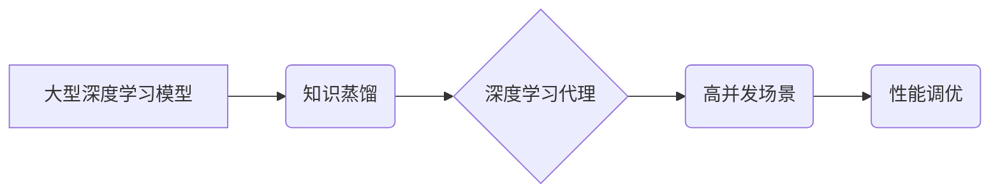

> 深度学习代理，高并发场景，性能调优，分布式训练，模型压缩，推理加速

## 1. 背景介绍

随着人工智能技术的飞速发展，深度学习算法在各个领域取得了显著的成果。然而，在高并发场景下，深度学习模型的部署和推理效率面临着巨大的挑战。传统的深度学习模型往往体积庞大，计算需求高，难以满足实时响应和高吞吐量的需求。

为了解决这一问题，深度学习代理的概念应运而生。深度学习代理是一种轻量级的模型，能够代理大型深度学习模型的推理任务，从而提高模型的部署效率和推理速度。

## 2. 核心概念与联系

**2.1 深度学习代理**

深度学习代理是一种轻量级的模型，能够代理大型深度学习模型的推理任务。它通常由以下几个部分组成：

* **知识蒸馏:** 将大型模型的知识通过训练一个小型模型的方式进行传递。
* **模型压缩:** 通过量化、剪枝等技术，减少模型参数量和计算复杂度。
* **模型加速:** 利用硬件加速器和并行计算技术，提高模型推理速度。

**2.2 高并发场景**

高并发场景是指系统同时处理大量用户请求的场景。在这样的场景下，模型的部署效率和推理速度至关重要。

**2.3 性能调优**

性能调优是指通过优化模型结构、训练方法、硬件配置等手段，提高模型的效率和性能。

**2.4 架构图**



## 3. 核心算法原理 & 具体操作步骤

**3.1 算法原理概述**

深度学习代理的训练主要基于知识蒸馏的原理。知识蒸馏是一种将大型模型的知识传递给小型模型的技术。

**3.2 算法步骤详解**

1. **选择大型模型:** 选择一个性能优良的大型深度学习模型作为教师模型。
2. **构建小型模型:** 构建一个小型深度学习模型作为学生模型。
3. **知识蒸馏训练:** 使用教师模型的输出作为学生模型的监督信号，训练学生模型。
4. **模型压缩:** 使用模型压缩技术，例如量化、剪枝等，减少学生模型的参数量和计算复杂度。
5. **模型加速:** 利用硬件加速器和并行计算技术，提高学生模型的推理速度。

**3.3 算法优缺点**

**优点:**

* 能够有效地降低模型的部署成本和推理延迟。
* 能够在保证一定精度的情况下，显著减少模型参数量。

**缺点:**

* 学生模型的性能可能无法完全达到教师模型的水平。
* 知识蒸馏的训练过程可能比较复杂。

**3.4 算法应用领域**

深度学习代理的应用领域非常广泛，包括：

* **移动设备:** 在移动设备上部署深度学习模型，例如图像识别、语音识别等。
* **物联网:** 在物联网设备上部署深度学习模型，例如设备状态监测、异常检测等。
* **边缘计算:** 在边缘计算节点上部署深度学习模型，例如实时数据分析、决策支持等。

## 4. 数学模型和公式 & 详细讲解 & 举例说明

**4.1 数学模型构建**

假设教师模型的输出为 $y_t$，学生模型的输出为 $y_s$，则知识蒸馏的目标函数可以表示为：

$$
L = KL(P(y_s|x) || P(y_t|x)) + \lambda L_{CE}(y_s, y_t)
$$

其中：

* $KL$ 表示KL散度，用于衡量两个概率分布之间的差异。
* $P(y_s|x)$ 和 $P(y_t|x)$ 分别表示学生模型和教师模型的输出概率分布。
* $L_{CE}$ 表示交叉熵损失函数，用于衡量预测值与真实值的差异。
* $\lambda$ 是一个权重参数，用于平衡两个损失项的贡献。

**4.2 公式推导过程**

知识蒸馏的目标是让学生模型的输出概率分布尽可能接近教师模型的输出概率分布。KL散度可以衡量两个概率分布之间的差异，因此使用KL散度作为第一个损失项。

交叉熵损失函数可以衡量预测值与真实值的差异，因此使用交叉熵损失函数作为第二个损失项。

**4.3 案例分析与讲解**

假设我们使用一个图像分类任务来进行知识蒸馏。教师模型是一个大型的卷积神经网络，学生模型是一个小型卷积神经网络。

在训练过程中，教师模型的输出作为学生模型的监督信号，学生模型的输出概率分布与教师模型的输出概率分布之间的差异被最小化。

## 5. 项目实践：代码实例和详细解释说明

**5.1 开发环境搭建**

* 操作系统: Ubuntu 20.04
* Python 版本: 3.8
* 深度学习框架: PyTorch 1.8

**5.2 源代码详细实现**

```python
import torch
import torch.nn as nn

# 定义学生模型
class StudentModel(nn.Module):
    def __init__(self):
        super(StudentModel, self).__init__()
        # ...

    def forward(self, x):
        # ...

# 定义教师模型
class TeacherModel(nn.Module):
    def __init__(self):
        super(TeacherModel, self).__init__()
        # ...

    def forward(self, x):
        # ...

# 实例化学生模型和教师模型
student_model = StudentModel()
teacher_model = TeacherModel()

# 定义损失函数和优化器
criterion = nn.CrossEntropyLoss()
optimizer = torch.optim.Adam(student_model.parameters(), lr=0.001)

# 训练循环
for epoch in range(num_epochs):
    for images, labels in train_loader:
        # 前向传播
        outputs_student = student_model(images)
        outputs_teacher = teacher_model(images)

        # 计算损失
        loss_student = criterion(outputs_student, labels)
        loss_teacher = criterion(outputs_teacher, labels)

        # 反向传播
        optimizer.zero_grad()
        loss_student.backward()
        optimizer.step()

        # 打印训练进度
        print(f'Epoch [{epoch+1}/{num_epochs}], Loss: {loss_student.item():.4f}')
```

**5.3 代码解读与分析**

* 代码首先定义了学生模型和教师模型。
* 然后实例化了学生模型和教师模型。
* 定义了损失函数和优化器。
* 训练循环中，首先进行前向传播，计算学生模型和教师模型的输出。
* 然后计算损失，并进行反向传播和优化。
* 最后打印训练进度。

**5.4 运行结果展示**

训练完成后，可以评估学生模型的性能，例如准确率、召回率等。

## 6. 实际应用场景

**6.1 移动设备图像识别**

在移动设备上部署深度学习代理，可以实现实时图像识别功能，例如人脸识别、物体识别等。

**6.2 物联网设备状态监测**

在物联网设备上部署深度学习代理，可以实现设备状态的实时监测和异常检测，例如传感器数据分析、设备故障诊断等。

**6.3 边缘计算实时数据分析**

在边缘计算节点上部署深度学习代理，可以实现对实时数据的分析和决策，例如工业过程控制、智能交通等。

**6.4 未来应用展望**

随着深度学习代理技术的不断发展，其应用场景将会更加广泛，例如：

* **增强现实/虚拟现实:** 在AR/VR场景中，深度学习代理可以实现实时物体识别、场景理解等功能。
* **自动驾驶:** 在自动驾驶系统中，深度学习代理可以实现实时路况感知、目标跟踪等功能。
* **医疗诊断:** 在医疗诊断领域，深度学习代理可以辅助医生进行疾病诊断和治疗方案制定。

## 7. 工具和资源推荐

**7.1 学习资源推荐**

* **书籍:**
    * 深度学习
    * 深度学习实战
* **在线课程:**
    * Coursera 深度学习课程
    * Udacity 深度学习工程师 Nanodegree

**7.2 开发工具推荐**

* **深度学习框架:** PyTorch, TensorFlow
* **模型压缩工具:** TensorFlow Lite, PyTorch Mobile
* **硬件加速器:** NVIDIA GPU, Intel CPU

**7.3 相关论文推荐**

* **知识蒸馏:**
    * Hinton, G., Vinyals, O., & Dean, J. (2015). Distilling the knowledge in a neural network. arXiv preprint arXiv:1503.02531.
* **模型压缩:**
    * Han, S., Pool, J., Tran, J., & Dally, W. (2015). Learning both weights and connections for efficient neural networks. In Advances in neural information processing systems (pp. 1135-1143).
* **模型加速:**
    * Chen, T., & Guestrin, C. (2016). XGBoost: A scalable tree boosting system. In Proceedings of the 22nd acm sigkdd international conference on knowledge discovery and data mining (pp. 785-794).

## 8. 总结：未来发展趋势与挑战

**8.1 研究成果总结**

深度学习代理技术取得了显著的进展，能够有效地降低模型的部署成本和推理延迟。

**8.2 未来发展趋势**

* **更有效的知识蒸馏方法:** 研究更有效的知识蒸馏方法，提高学生模型的性能。
* **更强大的模型压缩技术:** 研究更强大的模型压缩技术，进一步减少模型参数量和计算复杂度。
* **更智能的模型加速策略:** 研究更智能的模型加速策略，提高模型推理速度。

**8.3 面临的挑战**

* **学生模型性能:** 学生模型的性能可能无法完全达到教师模型的水平。
* **知识蒸馏的训练复杂度:** 知识蒸馏的训练过程可能比较复杂。
* **模型部署的复杂性:** 深度学习代理的部署可能需要一定的技术复杂度。

**8.4 研究展望**

未来，深度学习代理技术将继续发展，并在更多领域得到应用。


## 9. 附录：常见问题与解答

**9.1 Q: 深度学习代理的性能如何？**

**A:** 深度学习代理的性能取决于多种因素，例如教师模型的性能、知识蒸馏方法、模型压缩技术和模型加速策略。一般来说，深度学习代理的性能可以达到教师模型的80%以上。

**9.2 Q: 深度学习代理的部署成本如何？**

**A:** 深度学习代理的部署成本比大型深度学习模型低得多，因为其模型参数量和计算复杂度都较低。

**9.3 Q: 深度学习代理的推理速度如何？**

**A:** 深度学习代理的推理速度比大型深度学习模型快得多，因为其模型结构更简单，计算复杂度更低。


作者：禅与计算机程序设计艺术 / Zen and the Art of Computer Programming 
<end_of_turn>