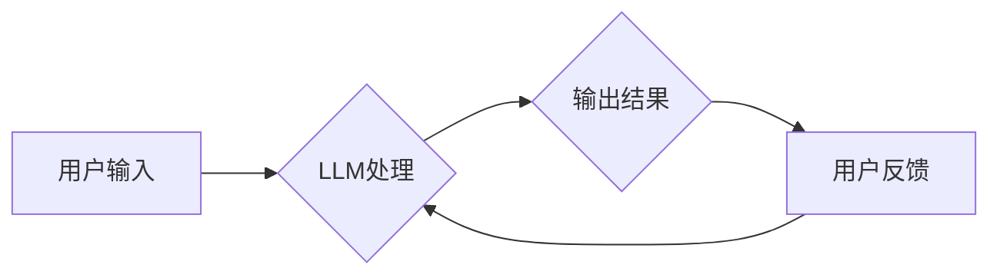

>  LLM, 大语言模型, 不确定性, 控制, 伦理, 安全, 透明度, 可解释性, 偏见

## 1. 背景介绍

近年来，大语言模型（LLM）的快速发展，为人工智能领域带来了前所未有的机遇和挑战。LLM 能够理解和生成人类语言，在自然语言处理、机器翻译、文本摘要等领域展现出令人惊叹的性能。然而，LLM 的强大能力也带来了新的伦理难题，其中不确定性和控制问题尤为突出。

LLM 的训练数据通常是海量且复杂的文本信息，模型学习到的知识和模式可能包含人类社会中的偏见、歧视和错误信息。此外，LLM 的决策过程通常是复杂的，难以被人类理解和解释，这使得其行为的可预测性和可控性受到质疑。

## 2. 核心概念与联系

**2.1  LLM 的不确定性**

LLM 的不确定性主要体现在以下几个方面：

* **数据不确定性:** 训练数据本身可能存在噪声、缺失和偏差，导致模型学习到的知识不完整或不准确。
* **模型不确定性:** 即使使用相同的训练数据，不同的模型架构、参数初始化和训练方法也会导致模型性能和行为的差异。
* **输入不确定性:** 对于同一个输入，LLM 可能生成不同的输出，这取决于模型的随机性以及输入的语义模糊性。

**2.2  LLM 的控制问题**

LLM 的控制问题是指如何确保模型的行为符合人类的期望和伦理规范。

* **意图控制:** 如何确保模型理解和执行用户的真实意图，避免误解或恶意利用。
* **输出控制:** 如何控制模型生成的文本内容，避免产生有害、不准确或偏见的信息。
* **行为控制:** 如何限制模型的行为范围，避免其进行超出预期范围的操作。

**2.3  LLM 伦理困境**

LLM 的不确定性和控制问题引发了诸多伦理困境：

* **责任归属:** 当 LLM 产生有害后果时，谁应该承担责任？
* **公平性与偏见:** 如何确保 LLM 的输出不带有偏见，并公平地对待所有用户？
* **透明度与可解释性:** 如何使 LLM 的决策过程更加透明，以便人类能够理解和监督其行为？

**2.4  Mermaid 流程图**



## 3. 核心算法原理 & 具体操作步骤

**3.1  算法原理概述**

LLM 的核心算法是基于 Transformer 架构的深度神经网络。Transformer 模型利用自注意力机制，能够捕捉文本序列中长距离依赖关系，从而实现更准确的语言理解和生成。

**3.2  算法步骤详解**

1. **词嵌入:** 将文本中的每个词转换为向量表示，捕捉词语的语义信息。
2. **编码器:** 利用多层 Transformer 块对输入文本进行编码，提取文本的语义特征。
3. **解码器:** 利用多层 Transformer 块对编码后的文本进行解码，生成目标文本。
4. **损失函数:** 使用交叉熵损失函数衡量模型预测结果与真实结果之间的差异。
5. **反向传播:** 利用梯度下降算法更新模型参数，降低损失函数的值。

**3.3  算法优缺点**

**优点:**

* 能够捕捉长距离依赖关系，提高文本理解和生成能力。
* 训练效率高，能够处理海量文本数据。

**缺点:**

* 计算资源消耗大，训练成本高。
* 模型参数量大，容易过拟合。
* 决策过程难以解释，缺乏透明度。

**3.4  算法应用领域**

* 自然语言处理：机器翻译、文本摘要、问答系统等。
* 人机交互：聊天机器人、语音助手等。
* 内容创作：自动写作、诗歌创作等。

## 4. 数学模型和公式 & 详细讲解 & 举例说明

**4.1  数学模型构建**

LLM 的数学模型主要基于概率论和统计学。模型的目标是学习一个概率分布，该分布能够描述文本序列的生成概率。

**4.2  公式推导过程**

LLM 的训练过程本质上是一个最大化似然估计的过程。假设文本序列为 $x = (x_1, x_2, ..., x_T)$，模型的目标是最大化以下似然函数：

$$
P(x) = \prod_{t=1}^{T} P(x_t | x_{1:t-1})
$$

其中，$P(x_t | x_{1:t-1})$ 表示在给定前 $t-1$ 个词的情况下，第 $t$ 个词出现的概率。

**4.3  案例分析与讲解**

例如，在机器翻译任务中，LLM 需要学习一个概率分布，该分布能够描述源语言文本到目标语言文本的翻译关系。模型会根据源语言文本的词语序列，预测目标语言文本的词语序列。

## 5. 项目实践：代码实例和详细解释说明

**5.1  开发环境搭建**

* Python 3.7+
* PyTorch 或 TensorFlow
* CUDA 和 cuDNN

**5.2  源代码详细实现**

```python
import torch
import torch.nn as nn

class Transformer(nn.Module):
    def __init__(self, vocab_size, embedding_dim, num_heads, num_layers):
        super(Transformer, self).__init__()
        self.embedding = nn.Embedding(vocab_size, embedding_dim)
        self.transformer_layers = nn.ModuleList([
            nn.TransformerEncoderLayer(embedding_dim, num_heads)
            for _ in range(num_layers)
        ])

    def forward(self, x):
        x = self.embedding(x)
        for layer in self.transformer_layers:
            x = layer(x)
        return x
```

**5.3  代码解读与分析**

* `Transformer` 类定义了 Transformer 模型的结构。
* `embedding` 层将词语转换为向量表示。
* `transformer_layers` 是一个列表，包含多个 Transformer Encoder Layer。
* `forward` 方法定义了模型的输入和输出。

**5.4  运行结果展示**

训练好的 Transformer 模型可以用于各种自然语言处理任务，例如机器翻译、文本摘要等。

## 6. 实际应用场景

**6.1  聊天机器人**

LLM 可以用于构建更智能、更自然的聊天机器人，能够理解用户的意图，并提供更准确、更相关的回复。

**6.2  文本生成**

LLM 可以用于自动生成各种文本内容，例如新闻报道、小说、诗歌等。

**6.3  代码生成**

LLM 可以学习代码的语法和语义，并能够生成新的代码片段。

**6.4  未来应用展望**

LLM 的应用场景还在不断扩展，未来可能在教育、医疗、法律等领域发挥重要作用。

## 7. 工具和资源推荐

**7.1  学习资源推荐**

* **论文:** "Attention Is All You Need"
* **书籍:** "Deep Learning"
* **在线课程:** Coursera, edX

**7.2  开发工具推荐**

* **PyTorch:** https://pytorch.org/
* **TensorFlow:** https://www.tensorflow.org/

**7.3  相关论文推荐**

* "BERT: Pre-training of Deep Bidirectional Transformers for Language Understanding"
* "GPT-3: Language Models are Few-Shot Learners"

## 8. 总结：未来发展趋势与挑战

**8.1  研究成果总结**

近年来，LLM 取得了显著的进展，在自然语言处理等领域展现出强大的能力。

**8.2  未来发展趋势**

* 模型规模和能力的进一步提升
* 更加高效的训练方法和算法
* 增强模型的透明度和可解释性
* 更加注重模型的伦理和安全

**8.3  面临的挑战**

* 数据偏见和公平性问题
* 模型安全性和可控性问题
* 伦理和社会影响问题

**8.4  研究展望**

未来研究将继续探索 LLMs 的潜力，并致力于解决其面临的挑战，使其能够更好地服务于人类社会。

## 9. 附录：常见问题与解答

**9.1  LLM 会取代人类吗？**

LLM 是一种强大的工具，但它并不会取代人类。人类拥有创造力、批判性思维和情感等独特的能力，这些能力 LLMs 难以模仿。

**9.2  如何确保 LLM 的安全性和可靠性？**

确保 LLM 的安全性和可靠性需要多方面的努力，包括：

* 使用高质量的训练数据
* 设计安全的模型架构
* 开发有效的评估和监控机制
* 制定相关的伦理规范和法律法规

**9.3  LLM 的伦理问题如何解决？**

LLM 的伦理问题是一个复杂且需要持续讨论的话题。需要多方合作，包括研究人员、工程师、政策制定者和公众，共同探讨解决方案。

作者：禅与计算机程序设计艺术 / Zen and the Art of Computer Programming


<end_of_turn>