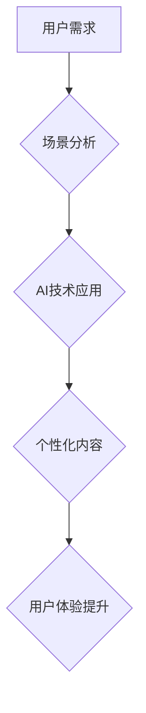

>  人工智能、出版业、场景驱动、技术发展、自然语言处理、机器学习、深度学习、内容生成、个性化推荐

## 1. 背景介绍

出版业作为文化传播的重要载体，近年来面临着前所未有的挑战和机遇。传统出版模式的局限性逐渐显现，数字出版的兴起带来了新的发展模式，而人工智能技术的快速发展则为出版业注入了一股强劲的动力。

随着人工智能技术的不断进步，特别是自然语言处理（NLP）和机器学习（ML）领域的突破，AI技术开始在出版业各个环节发挥着越来越重要的作用。从内容创作、编辑排版到营销推广，AI都能够提供高效、精准的解决方案，推动出版业的数字化转型和升级。

## 2. 核心概念与联系

**2.1 场景驱动**

场景驱动是指以用户的使用场景为核心，围绕用户需求和使用场景，设计和开发产品和服务。在出版业中，场景驱动意味着要深入了解用户的阅读习惯、兴趣偏好和需求，并根据这些信息，提供个性化、定制化的阅读体验。

**2.2 技术联系**

AI技术与场景驱动相结合，能够有效提升出版业的效率和用户体验。例如：

* **内容生成:** AI可以根据用户的阅读偏好和需求，自动生成个性化的文章、书籍章节等内容。
* **智能编辑:** AI可以帮助编辑校对文本，识别语法错误和风格问题，提高编辑效率。
* **个性化推荐:** AI可以根据用户的阅读历史和兴趣，推荐相关的书籍和文章，提升用户阅读体验。
* **智能营销:** AI可以分析用户的阅读数据，精准推送广告和促销信息，提高营销效果。

**2.3  Mermaid 流程图**



## 3. 核心算法原理 & 具体操作步骤

**3.1 算法原理概述**

在AI出版业中，常用的算法包括自然语言处理（NLP）算法、机器学习（ML）算法和深度学习（DL）算法。

* **NLP算法:** 用于处理和理解自然语言文本，例如文本分类、情感分析、文本摘要等。
* **ML算法:** 用于从数据中学习模式和规律，例如推荐系统、内容生成等。
* **DL算法:** 是一种更高级的机器学习算法，能够处理更复杂的数据，例如图像识别、语音识别等。

**3.2 算法步骤详解**

以内容生成为例，其算法步骤可以概括为以下几个阶段：

1. **数据收集和预处理:** 收集大量文本数据，并进行清洗、格式化等预处理工作。
2. **模型训练:** 使用训练数据训练深度学习模型，例如GPT-3、BERT等。
3. **文本生成:** 根据用户的输入提示，模型生成相应的文本内容。
4. **文本评估和优化:** 对生成的文本进行评估，并根据评估结果优化模型参数。

**3.3 算法优缺点**

* **优点:**

    * 自动化内容创作，提高效率。
    * 个性化内容生成，提升用户体验。
    * 降低人力成本，降低出版成本。

* **缺点:**

    * 内容质量难以保证，可能存在逻辑错误或风格不一致的问题。
    * 缺乏创造力和想象力，生成的文本可能过于平淡或缺乏深度。
    * 存在伦理风险，例如内容抄袭、虚假信息传播等。

**3.4 算法应用领域**

* 内容创作：自动生成新闻报道、小说章节、诗歌等。
* 教育培训：生成个性化学习内容、自动批改作业等。
* 营销推广：生成广告文案、社交媒体内容等。

## 4. 数学模型和公式 & 详细讲解 & 举例说明

**4.1 数学模型构建**

在AI出版业中，常用的数学模型包括：

* **词嵌入模型:** 将单词映射到向量空间，捕捉单词之间的语义关系。例如Word2Vec、GloVe等。
* **序列模型:** 用于处理顺序数据，例如文本序列。例如RNN、LSTM等。
* **生成模型:** 用于生成新的文本序列。例如GPT-3、BERT等。

**4.2 公式推导过程**

以Word2Vec为例，其目标是学习词向量表示，使得相似的词具有相似的向量表示。Word2Vec使用负采样技术，通过最大化目标函数来训练词向量模型。

目标函数：

$$
J(\theta) = \sum_{i=1}^{N} \sum_{j=1}^{M} \log \sigma(v_i^T w_j) + \sum_{i=1}^{N} \sum_{j \in \mathcal{N}(i)} \log \sigma(-v_i^T w_j)
$$

其中：

* $\theta$ 是模型参数。
* $N$ 是词典大小。
* $M$ 是上下文窗口大小。
* $v_i$ 是第 $i$ 个词的词向量。
* $w_j$ 是第 $j$ 个上下文词的词向量。
* $\mathcal{N}(i)$ 是第 $i$ 个词的上下文词集合。
* $\sigma(x)$ 是sigmoid函数。

**4.3 案例分析与讲解**

Word2Vec模型可以用于许多自然语言处理任务，例如：

* **词义相似度计算:** 计算两个词之间的语义相似度。
* **词语替换:** 根据上下文，自动替换词语。
* **文本分类:** 根据文本内容，自动分类文本。

## 5. 项目实践：代码实例和详细解释说明

**5.1 开发环境搭建**

* Python 3.x
* TensorFlow 或 PyTorch
* NLTK 或 spaCy

**5.2 源代码详细实现**

```python
# 使用Word2Vec模型训练词向量
from gensim.models import Word2Vec

# 数据准备
sentences = [['这', '是', '一个', '句子'], ['这是一个', '新的', '句子']]

# 训练模型
model = Word2Vec(sentences, vector_size=100, window=5, min_count=1)

# 保存模型
model.save('word2vec_model.bin')

# 加载模型
model = Word2Vec.load('word2vec_model.bin')

# 词语相似度计算
similarity = model.similarity('这', '是')
print(similarity)
```

**5.3 代码解读与分析**

* 使用Gensim库训练Word2Vec模型。
* 数据准备：将文本数据拆分成句子和词语。
* 训练模型：设置模型参数，例如词向量维度、上下文窗口大小等。
* 保存模型：将训练好的模型保存为文件。
* 加载模型：加载已保存的模型。
* 词语相似度计算：计算两个词语之间的语义相似度。

**5.4 运行结果展示**

运行代码后，会输出两个词语之间的语义相似度。

## 6. 实际应用场景

**6.1 个性化内容推荐**

AI可以根据用户的阅读历史、兴趣偏好和行为数据，推荐相关的书籍和文章，提升用户阅读体验。

**6.2 智能编辑和校对**

AI可以帮助编辑校对文本，识别语法错误和风格问题，提高编辑效率。

**6.3 内容生成和创作**

AI可以根据用户的输入提示，自动生成新闻报道、小说章节、诗歌等内容，降低人力成本，提高创作效率。

**6.4 智能营销和推广**

AI可以分析用户的阅读数据，精准推送广告和促销信息，提高营销效果。

**6.5 未来应用展望**

* **沉浸式阅读体验:** 利用VR/AR技术，打造沉浸式的阅读体验。
* **个性化学习平台:** 根据用户的学习进度和需求，提供个性化的学习内容和辅导。
* **跨语言出版:** 利用机器翻译技术，将书籍翻译成多种语言，拓展出版市场。

## 7. 工具和资源推荐

**7.1 学习资源推荐**

* **在线课程:** Coursera、edX、Udacity等平台提供人工智能、自然语言处理等方面的在线课程。
* **书籍:** 《深度学习》、《自然语言处理》等书籍。
* **开源项目:** TensorFlow、PyTorch、HuggingFace等开源项目。

**7.2 开发工具推荐**

* **Python:** 作为人工智能开发的主要语言。
* **TensorFlow/PyTorch:** 深度学习框架。
* **NLTK/spaCy:** 自然语言处理库。

**7.3 相关论文推荐**

* **BERT:** Devlin et al. (2018)
* **GPT-3:** Brown et al. (2020)
* **Word2Vec:** Mikolov et al. (2013)

## 8. 总结：未来发展趋势与挑战

**8.1 研究成果总结**

近年来，AI技术在出版业取得了显著的成果，例如内容生成、个性化推荐、智能编辑等。

**8.2 未来发展趋势**

* **更智能的AI助手:** AI助手将能够更深入地理解用户的需求，提供更个性化的服务。
* **更沉浸式的阅读体验:** VR/AR技术将为用户带来更沉浸式的阅读体验。
* **跨语言出版的普及:** 机器翻译技术的进步将推动跨语言出版的普及。

**8.3 面临的挑战**

* **内容质量问题:** AI生成的文本可能存在逻辑错误或风格不一致的问题。
* **伦理风险:** AI技术可能带来伦理风险，例如内容抄袭、虚假信息传播等。
* **数据安全问题:** 出版业涉及大量用户数据，需要加强数据安全保护。

**8.4 研究展望**

未来，需要进一步研究如何提高AI生成的文本质量，解决伦理风险和数据安全问题，推动AI技术在出版业的健康发展。

## 9. 附录：常见问题与解答

**9.1 AI生成的文本是否可靠？**

AI生成的文本需要经过人工审核，确保其准确性和可靠性。

**9.2 AI是否会取代出版人？**

AI可以帮助出版人提高效率，但不会完全取代出版人。出版人仍然需要负责内容策划、编辑、营销等工作。

**9.3 如何保护用户数据安全？**

出版业需要采取措施保护用户数据安全，例如加密存储、访问控制等。


作者：禅与计算机程序设计艺术 / Zen and the Art of Computer Programming 
<end_of_turn>