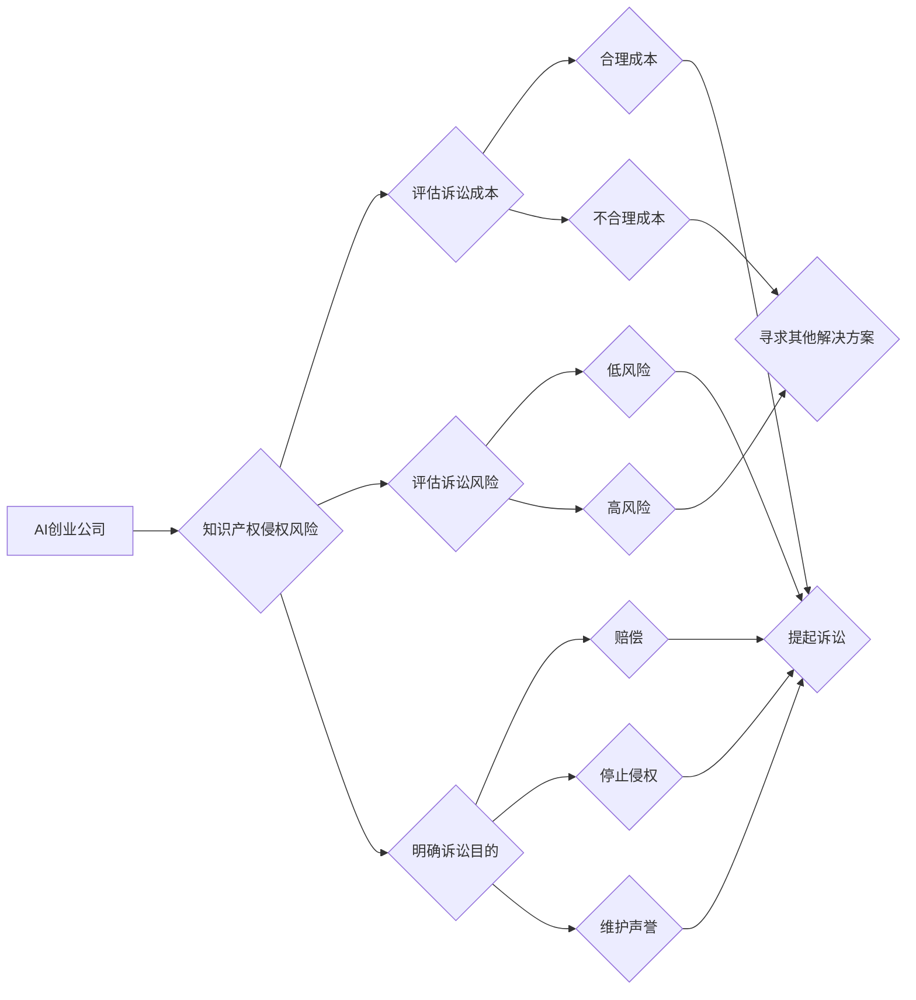

> AI创业公司,知识产权,诉讼策略,诉讼时机,诉讼地点,诉讼目的,人工智能,专利,版权,商标

## 1. 背景介绍

人工智能（AI）技术蓬勃发展，催生了一批AI创业公司。这些公司往往围绕着AI算法、模型、数据和应用等方面进行创新，并致力于将AI技术应用于各个行业。然而，在AI领域，知识产权（IP）保护问题日益突出。AI算法的原创性、数据的使用权、模型的训练过程等都存在争议，这使得AI创业公司面临着知识产权侵权风险。

知识产权诉讼是保护AI创业公司知识产权的重要手段。然而，诉讼是一个复杂且耗时的过程，需要谨慎考虑诉讼时机、诉讼地点和诉讼目的。

## 2. 核心概念与联系

**2.1 知识产权类型**

* **专利:** 专利保护发明、实用新型和设计，涉及AI算法、模型架构、数据处理方法等方面的创新。
* **版权:** 版权保护软件代码、数据处理脚本、AI模型训练文档等方面的原创作品。
* **商标:** 商标保护AI公司名称、产品名称、服务名称等方面的标识。
* **商业秘密:** 商业秘密保护AI算法、模型参数、训练数据等方面的 confidential 信息。

**2.2 知识产权诉讼**

知识产权诉讼是指当事人因知识产权纠纷而向法院提起诉讼的行为。AI创业公司可能面临以下类型的知识产权诉讼：

* **侵权诉讼:** 当AI创业公司认为其知识产权被他人侵犯时，可以提起侵权诉讼。
* **无效宣告:** 当AI创业公司认为他人的知识产权无效时，可以提起无效宣告诉讼。
* **许可协议纠纷:** 当AI创业公司与他人签订知识产权许可协议时，可能发生纠纷，需要通过诉讼解决。

**2.3 诉讼策略**

AI创业公司的知识产权诉讼策略应根据具体情况制定，需要考虑以下因素：

* **诉讼成本:** 诉讼是一个耗时和耗费资源的过程，需要评估诉讼成本是否合理。
* **诉讼风险:** 诉讼存在风险，可能导致公司名誉受损或经济损失。
* **诉讼目的:** 诉讼的目的是什么？是获得赔偿、停止侵权行为还是维护公司声誉？

**2.4 Mermaid 流程图**



## 3. 核心算法原理 & 具体操作步骤

**3.1 算法原理概述**

AI创业公司知识产权诉讼策略的制定需要结合AI领域的算法原理，例如机器学习算法、深度学习算法等。这些算法可以用于分析大量数据，识别知识产权侵权行为的模式，并提供证据支持诉讼。

**3.2 算法步骤详解**

1. **数据收集:** 收集相关数据，包括涉案的AI算法、模型、数据、代码等。
2. **数据预处理:** 对数据进行清洗、转换、特征提取等预处理操作。
3. **模型训练:** 使用机器学习算法或深度学习算法对数据进行训练，建立知识产权侵权识别模型。
4. **模型评估:** 对模型进行评估，测试其识别准确率、召回率等指标。
5. **应用部署:** 将训练好的模型部署到实际应用场景中，用于识别潜在的知识产权侵权行为。

**3.3 算法优缺点**

* **优点:**

    * 自动化识别: 可以自动识别大量数据中的知识产权侵权行为，提高效率。
    * 准确性高: 使用机器学习算法或深度学习算法可以提高识别准确率。
    * 证据支持: 可以提供数据和算法分析结果作为诉讼证据。

* **缺点:**

    * 数据依赖: 算法的准确性依赖于训练数据的质量和数量。
    * 算法解释性: 某些机器学习算法的决策过程难以解释，可能难以在诉讼中作为证据。
    * 算法更新: 随着AI技术的不断发展，需要定期更新算法模型。

**3.4 算法应用领域**

* **专利侵权检测:** 检测其他公司是否侵犯了公司的专利权。
* **版权侵权检测:** 检测其他公司是否侵犯了公司的版权。
* **商标侵权检测:** 检测其他公司是否侵犯了公司的商标权。
* **商业秘密泄露检测:** 检测商业秘密是否被泄露。

## 4. 数学模型和公式 & 详细讲解 & 举例说明

**4.1 数学模型构建**

知识产权侵权检测可以构建基于机器学习的数学模型，例如支持向量机（SVM）、逻辑回归（Logistic Regression）、决策树（Decision Tree）等。这些模型可以将知识产权特征作为输入，输出侵权概率或类别。

**4.2 公式推导过程**

例如，支持向量机模型的决策边界可以由以下公式表示：

$$
f(x) = sign(w^T x + b)
$$

其中：

* $x$ 是知识产权特征向量。
* $w$ 是权重向量。
* $b$ 是偏置项。
* $sign(x)$ 是符号函数，返回x的符号。

**4.3 案例分析与讲解**

假设一家AI创业公司开发了一种新的图像识别算法，并申请了专利。另一家公司开发了一种类似的图像识别算法，并将其用于商业应用。

可以使用支持向量机模型对两者的算法进行比较，并计算侵权概率。如果侵权概率超过一定阈值，则可以认为存在知识产权侵权行为。

## 5. 项目实践：代码实例和详细解释说明

**5.1 开发环境搭建**

* Python 3.x
* TensorFlow 或 PyTorch
* Jupyter Notebook

**5.2 源代码详细实现**

```python
# 使用 TensorFlow 构建支持向量机模型
import tensorflow as tf

# 定义模型
model = tf.keras.models.Sequential([
    tf.keras.layers.Dense(128, activation='relu', input_shape=(input_dim,)),
    tf.keras.layers.Dense(1, activation='sigmoid')
])

# 编译模型
model.compile(optimizer='adam', loss='binary_crossentropy', metrics=['accuracy'])

# 训练模型
model.fit(X_train, y_train, epochs=10)

# 预测结果
predictions = model.predict(X_test)
```

**5.3 代码解读与分析**

* 代码使用 TensorFlow 库构建了一个支持向量机模型。
* 模型包含两层全连接神经网络，第一层有 128 个神经元，激活函数为 ReLU，输入维度为 input_dim。
* 第二层只有一个神经元，激活函数为 sigmoid，用于输出侵权概率。
* 模型使用 Adam 优化器，损失函数为二元交叉熵，评估指标为准确率。
* 模型使用训练数据进行训练，并预测测试数据的侵权概率。

**5.4 运行结果展示**

运行结果包括模型的训练过程和预测结果。训练过程可以查看模型的损失函数和准确率的变化趋势。预测结果可以查看模型对测试数据的侵权概率预测。

## 6. 实际应用场景

AI创业公司可以将知识产权诉讼策略应用于以下场景：

* **专利侵权诉讼:** 当AI创业公司认为其专利权被他人侵犯时，可以收集证据，并使用AI算法分析证据，支持诉讼。
* **版权侵权诉讼:** 当AI创业公司认为其版权被他人侵犯时，可以收集证据，并使用AI算法分析证据，支持诉讼。
* **商标侵权诉讼:** 当AI创业公司认为其商标权被他人侵犯时，可以收集证据，并使用AI算法分析证据，支持诉讼。
* **商业秘密泄露:** 当AI创业公司怀疑其商业秘密被泄露时，可以收集证据，并使用AI算法分析证据，支持诉讼。

**6.4 未来应用展望**

随着AI技术的不断发展，知识产权诉讼策略将更加智能化和自动化。未来，AI算法可以更加准确地识别知识产权侵权行为，并提供更详细的证据支持。

## 7. 工具和资源推荐

**7.1 学习资源推荐**

* **书籍:**
    * "The Innovator's Dilemma" by Clayton M. Christensen
    * "Zero to One" by Peter Thiel
* **在线课程:**
    * Coursera: Machine Learning
    * edX: Artificial Intelligence

**7.2 开发工具推荐**

* **Python:** 
    * TensorFlow
    * PyTorch
* **数据分析工具:**
    * Pandas
    * Scikit-learn

**7.3 相关论文推荐**

* "Deep Learning for Patent Classification"
* "A Survey of Machine Learning Techniques for Copyright Infringement Detection"

## 8. 总结：未来发展趋势与挑战

**8.1 研究成果总结**

AI技术为知识产权诉讼策略提供了新的思路和方法。AI算法可以帮助AI创业公司更有效地识别知识产权侵权行为，并提供更强的证据支持。

**8.2 未来发展趋势**

* **更准确的识别:** AI算法将更加准确地识别知识产权侵权行为。
* **更智能的策略:** AI算法将帮助AI创业公司制定更智能的知识产权诉讼策略。
* **更自动化流程:** 知识产权诉讼流程将更加自动化，减少人工干预。

**8.3 面临的挑战**

* **算法解释性:** 某些AI算法的决策过程难以解释，可能难以在诉讼中作为证据。
* **数据隐私:** 使用AI算法分析知识产权数据需要考虑数据隐私问题。
* **法律法规:** AI技术发展迅速，法律法规需要不断更新，以适应AI技术在知识产权领域的应用。

**8.4 研究展望**

未来研究方向包括：

* **提高算法解释性:** 研究更易于解释的AI算法，以便在诉讼中更好地作为证据。
* **解决数据隐私问题:** 研究保护数据隐私的AI算法和技术。
* **探索AI与法律的融合:** 研究AI技术在法律领域的应用，探索AI与法律的融合发展方向。

## 9. 附录：常见问题与解答

**9.1 如何评估知识产权侵权风险？**

可以参考以下因素评估知识产权侵权风险：

* **技术相似性:** 涉案技术与现有技术的相似程度。
* **市场竞争:** 涉案技术与现有技术的市场竞争情况。
* **法律判例:** 相关法律判例对涉案技术的认定。

**9.2 如何收集知识产权证据？**

可以收集以下类型的证据：

* **技术文档:** 包括专利申请文件、技术方案、代码等。
* **市场数据:** 包括销售数据、市场份额、用户评价等。
* **专家意见:** 包括技术专家、法律专家的意见。

**9.3 如何选择合适的知识产权诉讼策略？**

需要根据具体情况选择合适的知识产权诉讼策略，考虑诉讼成本、诉讼风险和诉讼目的。


作者：禅与计算机程序设计艺术 / Zen and the Art of Computer Programming 
<end_of_turn>