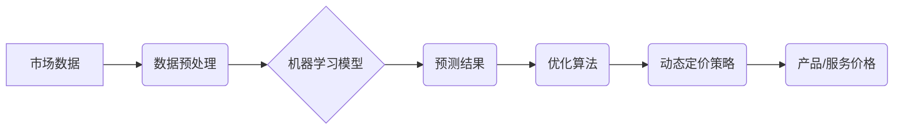

> AI、动态定价、机器学习、预测模型、市场分析、优化算法、数据驱动

## 1. 背景介绍

在当今数据爆炸和竞争激烈的商业环境中，企业越来越依赖于数据驱动决策来优化运营效率和盈利能力。其中，定价策略作为企业的重要收入来源，也面临着越来越多的挑战。传统的定价方法往往基于静态的成本和市场分析，难以适应市场需求的快速变化和竞争环境的激烈波动。

动态定价，即根据实时市场数据和用户行为进行动态调整的价格策略，逐渐成为企业优化定价策略的重要手段。它能够帮助企业更精准地把握市场需求，提高产品或服务的竞争力，并最终实现更高的利润。

## 2. 核心概念与联系

动态定价的核心在于利用人工智能（AI）技术，特别是机器学习算法，对海量市场数据进行分析和预测，从而制定最优的定价策略。

**核心概念：**

* **机器学习:**  一种人工智能技术，通过算法训练模型，使模型能够从数据中学习并做出预测。
* **预测模型:**  基于机器学习算法构建的模型，能够预测未来市场需求、竞争对手价格、用户行为等关键因素。
* **优化算法:**  用于根据预测模型的结果，优化定价策略，以最大化企业利润。

**架构图：**



## 3. 核心算法原理 & 具体操作步骤

### 3.1  算法原理概述

动态定价算法通常基于以下核心原理：

* **需求预测:** 利用历史数据和市场趋势，预测未来产品的需求量。
* **成本分析:**  分析产品的生产、运营和销售成本。
* **竞争对手分析:**  分析竞争对手的定价策略和市场份额。
* **用户行为分析:**  分析用户的购买行为、偏好和价格敏感度。

基于这些分析结果，算法可以制定最优的定价策略，以最大化企业利润。

### 3.2  算法步骤详解

1. **数据收集和预处理:** 收集市场数据、产品成本数据、竞争对手数据和用户行为数据，并进行清洗、转换和格式化。
2. **特征工程:**  从原始数据中提取关键特征，例如产品属性、时间、季节、促销活动等，用于训练机器学习模型。
3. **模型选择和训练:** 选择合适的机器学习算法，例如线性回归、逻辑回归、决策树、支持向量机等，并根据训练数据训练模型。
4. **模型评估和优化:**  评估模型的预测精度，并通过调整模型参数或选择不同的算法来优化模型性能。
5. **预测和定价:**  利用训练好的模型预测未来市场需求、成本和竞争对手价格，并根据优化算法制定最优的定价策略。
6. **监控和调整:**  持续监控市场变化和用户行为，并根据实际情况调整定价策略，以保持竞争优势。

### 3.3  算法优缺点

**优点:**

* **数据驱动:** 基于数据分析和预测，能够制定更精准的定价策略。
* **灵活性:**  能够根据市场变化和用户行为动态调整价格。
* **效率:**  自动化定价流程，提高效率和降低人工成本。

**缺点:**

* **数据依赖:**  算法性能依赖于数据质量和数量。
* **模型复杂性:**  构建和维护复杂的机器学习模型需要专业技术。
* **解释性:**  一些机器学习算法的决策过程难以解释，可能导致定价策略难以被理解和接受。

### 3.4  算法应用领域

动态定价算法广泛应用于以下领域：

* **电商平台:**  根据商品需求、竞争对手价格和用户行为动态调整商品价格。
* **旅游业:**  根据航班、酒店和旅游套餐的供需情况动态调整价格。
* **金融服务:**  根据市场利率、风险偏好和用户信用状况动态调整贷款利率和保险费率。
* **能源行业:**  根据能源供需情况和市场价格波动动态调整能源价格。

## 4. 数学模型和公式 & 详细讲解 & 举例说明

### 4.1  数学模型构建

动态定价模型通常基于以下数学模型：

* **需求预测模型:**  预测产品需求量与价格之间的关系，例如线性需求模型、指数需求模型等。
* **成本模型:**  预测产品的生产、运营和销售成本。
* **利润模型:**  计算产品销售收入与成本之间的差额，即利润。

### 4.2  公式推导过程

**需求预测模型:**

假设产品需求量与价格之间呈线性关系，则需求预测模型可以表示为：

$$Q = a - bP$$

其中：

* $Q$：产品需求量
* $P$：产品价格
* $a$：需求量在价格为0时的水平
* $b$：价格对需求量的弹性系数

**利润模型:**

产品利润可以表示为：

$$Profit = (P - C)Q$$

其中：

* $C$：产品成本

### 4.3  案例分析与讲解

假设一家电商平台销售一款商品，其需求预测模型为：

$$Q = 1000 - 2P$$

产品成本为 $C = 50$。

为了最大化利润，需要找到最优价格 $P$。

将需求模型和利润模型代入，得到利润函数：

$$Profit = (P - 50)(1000 - 2P)$$

通过求导和解方程，可以找到利润函数的最大值点，即最优价格。

## 5. 项目实践：代码实例和详细解释说明

### 5.1  开发环境搭建

* **编程语言:** Python
* **机器学习库:** scikit-learn
* **数据处理库:** pandas
* **可视化库:** matplotlib

### 5.2  源代码详细实现

```python
import pandas as pd
from sklearn.linear_model import LinearRegression

# 数据加载
data = pd.read_csv('price_data.csv')

# 数据预处理
X = data[['feature1', 'feature2', ...]]
y = data['price']

# 模型训练
model = LinearRegression()
model.fit(X, y)

# 预测
new_data = pd.DataFrame({'feature1': [value1], 'feature2': [value2], ...})
predicted_price = model.predict(new_data)

# 结果展示
print(predicted_price)
```

### 5.3  代码解读与分析

* 数据加载：从CSV文件加载价格数据。
* 数据预处理：提取特征变量和目标变量（价格）。
* 模型训练：使用线性回归模型训练预测价格。
* 预测：使用训练好的模型预测新数据的价格。
* 结果展示：打印预测的价格结果。

### 5.4  运行结果展示

运行代码后，将输出预测的价格结果。

## 6. 实际应用场景

### 6.1  电商平台

电商平台可以利用动态定价算法根据商品需求、竞争对手价格和用户行为动态调整商品价格，提高销售额和利润。

### 6.2  航空公司

航空公司可以根据航班的供需情况、竞争对手票价和用户偏好动态调整机票价格，优化收益。

### 6.3  酒店业

酒店业可以根据酒店的入住率、季节性因素和用户预订行为动态调整房间价格，提高入住率和收入。

### 6.4  未来应用展望

随着人工智能技术的不断发展，动态定价算法将应用于更多领域，例如：

* **个性化定价:**  根据用户的购买历史、偏好和行为特征，提供个性化的价格。
* **实时动态定价:**  根据实时市场变化和用户行为，进行更精准的动态调整。
* **自动谈判:**  利用人工智能技术，自动与客户进行价格谈判，达成最佳交易方案。

## 7. 工具和资源推荐

### 7.1  学习资源推荐

* **书籍:**
    * 《机器学习》 by Tom Mitchell
    * 《Python机器学习实战》 by Sebastian Raschka
* **在线课程:**
    * Coursera: Machine Learning
    * edX: Artificial Intelligence

### 7.2  开发工具推荐

* **Python:**  用于机器学习模型开发和数据分析。
* **scikit-learn:**  机器学习库，提供各种算法和工具。
* **pandas:**  数据处理库，用于数据清洗、转换和分析。
* **matplotlib:**  可视化库，用于数据可视化和分析。

### 7.3  相关论文推荐

* **"Dynamic Pricing with Machine Learning"** by  A. Agrawal et al.
* **"A Survey of Dynamic Pricing Algorithms"** by  S.  Chen et al.

## 8. 总结：未来发展趋势与挑战

### 8.1  研究成果总结

动态定价算法在过去几年取得了显著进展，并已在多个领域得到广泛应用。

### 8.2  未来发展趋势

未来，动态定价算法将朝着以下方向发展：

* **更精准的预测:**  利用更先进的机器学习算法和数据分析技术，提高预测精度。
* **更个性化的定价:**  根据用户的个性化需求和行为特征，提供更精准的定价方案。
* **更智能的决策:**  利用人工智能技术，实现更智能的定价决策，例如自动谈判和策略调整。

### 8.3  面临的挑战

动态定价算法也面临着一些挑战：

* **数据质量:**  算法性能依赖于数据质量，需要不断收集和清洗数据。
* **模型解释性:**  一些机器学习算法的决策过程难以解释，可能导致定价策略难以被理解和接受。
* **伦理问题:**  动态定价算法可能会导致价格歧视和不公平现象，需要关注伦理问题。

### 8.4  研究展望

未来，需要进一步研究以下问题：

* 如何提高动态定价算法的预测精度和解释性。
* 如何解决动态定价算法带来的伦理问题。
* 如何将动态定价算法应用于更多领域，并探索其新的应用场景。

## 9. 附录：常见问题与解答

**Q1: 动态定价算法是否会损害消费者权益？**

**A1:**  动态定价算法本身不会损害消费者权益，但需要合理应用，避免价格歧视和不公平现象。

**Q2: 如何评估动态定价算法的性能？**

**A2:**  可以使用多种指标评估动态定价算法的性能，例如预测精度、利润率、客户满意度等。

**Q3: 如何选择合适的动态定价算法？**

**A3:**  选择合适的动态定价算法需要根据具体业务场景和数据特点进行选择。

**Q4: 如何应对动态定价算法带来的伦理挑战？**

**A4:**  需要制定相应的伦理规范和监管机制，确保动态定价算法的公平、透明和可解释性。


作者：禅与计算机程序设计艺术 / Zen and the Art of Computer Programming 
<end_of_turn>