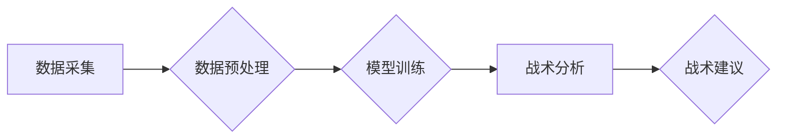

> AI,机器学习,深度学习,体育赛事分析,战术理解,数据挖掘,计算机视觉

## 1. 背景介绍

体育赛事分析一直是体育领域的重要课题，它能够帮助教练员、运动员和球迷更好地理解比赛，制定更有效的战术策略，提升竞技水平。传统的体育赛事分析主要依赖于人工观察和经验总结，效率低下，且难以捕捉到细微的战术变化。随着人工智能技术的快速发展，AI在体育赛事分析中的应用逐渐成为热点，为深化战术理解提供了新的思路和方法。

AI技术能够利用海量比赛数据，通过机器学习和深度学习等算法，识别和分析比赛中的关键信息，例如球员位置、动作轨迹、球的运动轨迹等，并从中挖掘出隐藏的战术规律和趋势。这使得AI能够提供更全面、更精准、更深入的战术分析，帮助教练员和运动员做出更明智的决策。

## 2. 核心概念与联系

### 2.1  数据采集与预处理

体育赛事分析的核心是数据，包括比赛视频、球员数据、比赛规则等。首先需要通过各种传感器、摄像头等设备采集比赛数据，然后进行预处理，例如数据清洗、格式转换、特征提取等，以便于后续的分析和建模。

### 2.2  机器学习与深度学习

机器学习和深度学习是AI的核心技术，能够帮助模型从数据中学习规律。机器学习算法可以分为监督学习、无监督学习和强化学习等，而深度学习是机器学习的一种，利用多层神经网络模拟人类大脑的学习过程，能够处理更复杂的数据和任务。

### 2.3  战术分析模型

战术分析模型是将数据和算法结合起来，用于分析比赛战术的模型。常见的战术分析模型包括：

* **球员位置分析模型:** 分析球员在比赛中的位置分布、移动轨迹等，识别球员的战术角色和职责。
* **进攻战术分析模型:** 分析进攻方的进攻路线、传球模式、射门机会等，识别进攻战术的有效性和弱点。
* **防守战术分析模型:** 分析防守方的防守策略、球员防守区域、防守强度等，识别防守战术的漏洞和优势。

**Mermaid 流程图**



## 3. 核心算法原理 & 具体操作步骤

### 3.1  算法原理概述

在体育赛事分析中，常用的算法包括：

* **聚类算法:** 将球员或事件根据相似性进行分组，例如将进攻球员根据位置和动作特征进行分类。
* **关联规则挖掘算法:** 发现数据中隐藏的关联关系，例如分析球员传球和射门之间的关联性。
* **时间序列分析算法:** 分析比赛过程中的时间序列数据，例如球员位置变化、球的运动轨迹等，识别战术变化和趋势。

### 3.2  算法步骤详解

以球员位置分析为例，具体操作步骤如下：

1. **数据采集:** 收集比赛视频和球员位置数据。
2. **数据预处理:** 将视频数据转换为图像序列，提取球员的位置信息。
3. **特征提取:** 对球员的位置信息进行特征提取，例如速度、加速度、方向等。
4. **模型训练:** 使用聚类算法对球员进行分类，例如根据位置和动作特征将球员分为进攻球员、防守球员等。
5. **战术分析:** 分析不同类型球员的位置分布和移动轨迹，识别战术策略和球员角色。

### 3.3  算法优缺点

不同的算法具有不同的优缺点，需要根据具体应用场景选择合适的算法。例如，聚类算法能够有效地识别球员类型，但对数据质量要求较高；关联规则挖掘算法能够发现隐藏的关联关系，但对数据量要求较高。

### 3.4  算法应用领域

AI算法在体育赛事分析中的应用领域广泛，包括：

* **战术分析:** 分析比赛战术，识别战术优势和弱点。
* **球员评估:** 评估球员的竞技水平和潜力。
* **伤病预测:** 预测球员的伤病风险。
* **比赛预测:** 预测比赛结果。

## 4. 数学模型和公式 & 详细讲解 & 举例说明

### 4.1  数学模型构建

在体育赛事分析中，可以使用数学模型来描述比赛过程和战术策略。例如，可以使用概率模型来预测比赛结果，可以使用博弈论模型来分析球员之间的博弈关系。

### 4.2  公式推导过程

以预测比赛结果为例，可以使用贝叶斯定理来推导预测公式：

$$P(A|B) = \frac{P(B|A)P(A)}{P(B)}$$

其中：

* $P(A|B)$ 是事件A在事件B发生条件下的概率。
* $P(B|A)$ 是事件B在事件A发生条件下的概率。
* $P(A)$ 是事件A发生的概率。
* $P(B)$ 是事件B发生的概率。

### 4.3  案例分析与讲解

假设我们想要预测足球比赛的结果，可以根据历史比赛数据，例如两队之间的胜负率、进球数、防守强度等，构建贝叶斯模型，并使用贝叶斯定理来计算预测概率。

## 5. 项目实践：代码实例和详细解释说明

### 5.1  开发环境搭建

可以使用Python语言和相关的库来开发体育赛事分析项目，例如：

* **NumPy:** 用于数值计算。
* **Pandas:** 用于数据处理和分析。
* **Scikit-learn:** 用于机器学习算法。
* **OpenCV:** 用于图像处理和计算机视觉。

### 5.2  源代码详细实现

以下是一个简单的球员位置分析代码示例：

```python
import cv2
import numpy as np

# 读取视频文件
cap = cv2.VideoCapture('video.mp4')

# 初始化球员位置列表
player_positions = []

while(cap.isOpened()):
    # 读取视频帧
    ret, frame = cap.read()
    if ret == True:
        # ... (代码用于检测球员位置)
        # 将球员位置添加到列表中
        player_positions.append(player_position)
    else:
        break

# 释放视频资源
cap.release()

# ... (代码用于分析球员位置数据)
```

### 5.3  代码解读与分析

这段代码首先读取视频文件，然后使用OpenCV库检测球员位置。检测到的球员位置信息存储在`player_positions`列表中。最后，可以使用Pandas库对`player_positions`列表进行分析，例如计算球员的位置分布、移动轨迹等。

### 5.4  运行结果展示

运行代码后，可以得到球员位置分析的结果，例如球员位置分布图、移动轨迹图等。这些结果可以帮助教练员和运动员更好地理解比赛战术。

## 6. 实际应用场景

AI在体育赛事分析中的应用场景广泛，例如：

### 6.1  职业体育

* **NBA:** 分析球员表现、预测比赛结果、优化战术策略。
* **英超联赛:** 识别球员战术动作、分析防守策略、预测比赛胜负。
* **NFL:** 分析球员跑动路线、预测接球机会、优化进攻战术。

### 6.2  高校体育

* **篮球:** 分析球员位置分布、识别进攻战术、提高训练效率。
* **足球:** 分析球员传球模式、识别防守漏洞、优化战术策略。
* **排球:** 分析球员跳跃高度、识别进攻弱点、提高防守效率。

### 6.3  大众体育

* **健身:** 分析运动轨迹、识别运动动作、提供个性化训练方案。
* **跑步:** 分析跑步速度、步频、心率等数据，提供跑步建议和训练计划。
* **游泳:** 分析游泳姿势、速度、效率等数据，提供游泳技巧和训练方案。

### 6.4  未来应用展望

随着AI技术的不断发展，AI在体育赛事分析中的应用将更加广泛和深入，例如：

* **更精准的战术分析:** 利用更先进的算法和模型，识别更细微的战术变化和趋势。
* **更个性化的训练方案:** 根据球员的个人数据和特点，制定更个性化的训练方案。
* **更智能的比赛预测:** 利用大数据和机器学习，更准确地预测比赛结果。

## 7. 工具和资源推荐

### 7.1  学习资源推荐

* **Coursera:** 提供机器学习、深度学习等相关课程。
* **Udacity:** 提供AI、数据科学等相关课程。
* **Kaggle:** 提供数据科学竞赛和学习资源。

### 7.2  开发工具推荐

* **Python:** 广泛应用于AI开发，拥有丰富的库和工具。
* **TensorFlow:** 开源深度学习框架。
* **PyTorch:** 开源深度学习框架。

### 7.3  相关论文推荐

* **Deep Learning for Sports Analytics**
* **Machine Learning in Sports: A Survey**
* **Using AI to Analyze Sports Video**

## 8. 总结：未来发展趋势与挑战

### 8.1  研究成果总结

AI在体育赛事分析中的应用取得了显著成果，能够帮助教练员、运动员和球迷更好地理解比赛，制定更有效的战术策略，提升竞技水平。

### 8.2  未来发展趋势

未来，AI在体育赛事分析中的应用将更加深入和广泛，例如：

* **更精准的战术分析:** 利用更先进的算法和模型，识别更细微的战术变化和趋势。
* **更个性化的训练方案:** 根据球员的个人数据和特点，制定更个性化的训练方案。
* **更智能的比赛预测:** 利用大数据和机器学习，更准确地预测比赛结果。

### 8.3  面临的挑战

AI在体育赛事分析中的应用也面临一些挑战，例如：

* **数据质量:** 比赛数据的质量直接影响AI模型的性能，需要保证数据的准确性和完整性。
* **算法复杂度:** 训练和部署复杂的AI模型需要强大的计算资源和技术支持。
* **伦理问题:** AI在体育赛事分析中的应用需要考虑伦理问题，例如数据隐私、算法偏见等。

### 8.4  研究展望

未来，需要继续加强AI在体育赛事分析领域的研发，解决上述挑战，推动AI技术在体育领域的应用，为体育运动的发展做出更大的贡献。

## 9. 附录：常见问题与解答

### 9.1  Q1: AI是否会取代教练员和运动员？

**A1:** AI是辅助工具，可以帮助教练员和运动员更好地分析比赛和制定策略，但不会取代他们的角色。教练员和运动员仍然需要根据AI的分析结果，结合自己的经验和判断，做出最终的决策。

### 9.2  Q2: AI在体育赛事分析中的应用有哪些伦理问题？

**A2:** AI在体育赛事分析中的应用需要考虑数据隐私、算法偏见等伦理问题。例如，需要确保比赛数据的安全和隐私，避免算法对特定球员或球队产生偏见。

### 9.3  Q3: 如何学习AI在体育赛事分析方面的知识？

**A3:** 可以通过在线课程、书籍、论文等方式学习AI在体育赛事分析方面的知识。例如，Coursera和Udacity提供相关的课程，Kaggle提供数据科学竞赛和学习资源。

作者：禅与计算机程序设计艺术 / Zen and the Art of Computer Programming


<end_of_turn>