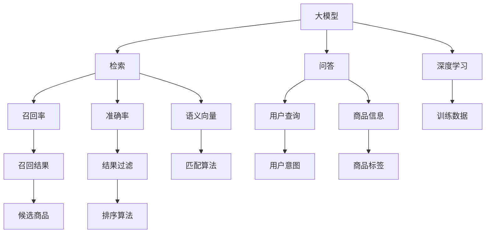

                 

# 大模型技术在商品搜索中的创新应用

## 1. 背景介绍

### 1.1 问题由来

随着电子商务的蓬勃发展，商品搜索已成为各大电商平台的关键功能。如何准确高效地回答用户查询，帮助其快速找到所需商品，是电商平台的共同诉求。然而，传统的商品搜索系统往往依赖于关键词匹配和简单的统计排序，难以充分理解查询的语义，导致搜索结果的相关性不高。随着深度学习和大模型的兴起，商品搜索技术正面临新的升级。

近年来，大模型在自然语言处理(NLP)领域取得了显著进展。基于预训练语言模型(如BERT、GPT-3)的检索和问答技术，已经展示了其超越传统关键词匹配系统的潜力。通过深度学习大模型的语言理解和生成能力，商品搜索系统可以更准确地理解和处理用户查询，提升搜索结果的相关性和匹配度。

### 1.2 问题核心关键点

大模型在商品搜索中的应用，主要体现在以下两个方面：

- 基于大模型的检索：通过在查询与商品描述之间建立语义匹配，将用户查询转化为语义向量，在商品语义向量库中检索出最相关的商品。
- 基于大模型的问答：利用大模型的理解能力和生成能力，回答用户的具体问题，直接给出商品信息。

在实际应用中，通常需要将检索和问答技术结合，构建更为全面和精准的商品搜索系统。

### 1.3 问题研究意义

大模型在商品搜索中的应用，对于提升电商平台的用户体验、增加销售额、降低运营成本具有重要意义：

1. 提升搜索准确性：大模型能够理解自然语言查询背后的语义，避免因关键词模糊导致的误匹配。
2. 增加商品曝光率：基于大模型的语义匹配，能够推荐出更多相关商品，提高用户的发现概率。
3. 降低运营成本：减少人力干预和维护，提高自动化的处理效率，降低运营成本。
4. 创造个性化体验：大模型可以根据用户历史行为和偏好，提供个性化搜索结果，增强用户粘性。

通过大模型技术的应用，电商平台可以实现更加智能和高效的商品搜索，为用户带来更好的购物体验，同时为商家创造更多商机。

## 2. 核心概念与联系

### 2.1 核心概念概述

在商品搜索应用中，涉及几个关键概念：

- 大模型(Big Model)：如BERT、GPT-3等，通过大规模语料预训练获得强大的语言理解和生成能力。
- 检索(Retrieval)：在大量商品描述数据中，利用语义匹配算法寻找最相关商品的过程。
- 问答(Question Answering, QA)：根据用户查询，通过理解并生成商品信息，直接回答用户问题。
- 深度学习(Deep Learning)：利用神经网络对大规模数据进行学习，获得复杂非线性的表示能力。
- 语义向量(Semantic Vector)：通过嵌入算法将查询和商品描述映射为高维向量，用于语义匹配。
- 召回率(Recall)：检索结果中相关商品的比例。
- 准确率(Precision)：检索结果中正确商品的比例。

这些概念之间的联系可以通过以下Mermaid流程图来展示：



这个流程图展示了大模型在商品搜索中的应用框架：

1. 大模型通过深度学习技术在大量语料上预训练，获得强大的语言理解能力。
2. 检索过程利用大模型的语义向量，在商品描述数据中查找最相关商品。
3. 问答过程基于大模型的生成能力，直接回答用户问题，提供商品信息。
4. 深度学习算法用于训练匹配和排序算法，提升检索和问答效果。

## 3. 核心算法原理 & 具体操作步骤

### 3.1 算法原理概述

基于大模型的商品搜索，主要分为检索和问答两个部分。下面将详细阐述这两个过程的算法原理。

#### 3.1.1 检索原理

检索过程的核心是利用大模型的语义向量，将查询和商品描述映射到高维空间，计算它们之间的相似度，并选出最相关的商品。具体步骤如下：

1. 预训练：使用大规模无标签文本数据训练大模型，学习语言的语义表示。
2. 编码：将查询和商品描述分别输入大模型，获得它们的语义向量表示。
3. 匹配：计算查询向量与所有商品向量之间的余弦相似度，选出最相关的商品。

#### 3.1.2 问答原理

问答过程的核心是大模型的理解能力和生成能力，能够根据用户查询，直接生成商品信息。具体步骤如下：

1. 预训练：使用大规模标注数据训练大模型，学习语言和商品信息之间的映射关系。
2. 理解：输入用户查询，大模型能够理解查询的语义。
3. 生成：大模型生成商品信息，作为回答。

### 3.2 算法步骤详解

#### 3.2.1 检索步骤

1. 数据准备：收集商品描述数据，将其整理成文本格式。同时，收集用户查询数据，准备用于训练的大模型。
2. 模型选择：选择合适的预训练大模型，如BERT、GPT-3等。
3. 训练与编码：将商品描述和查询输入大模型，获得它们的语义向量表示。
4. 匹配与检索：计算查询向量与商品向量的相似度，选出最相关的商品。
5. 输出结果：将检索结果返回给用户，完成商品搜索。

#### 3.2.2 问答步骤

1. 数据准备：收集商品描述数据，整理成文本格式。同时，收集用户查询数据，准备用于训练的大模型。
2. 模型选择：选择合适的预训练大模型，如BERT、GPT-3等。
3. 训练与理解：将用户查询输入大模型，理解查询的语义。
4. 生成与回答：利用大模型的生成能力，生成商品信息，作为回答。
5. 输出结果：将问答结果返回给用户，完成商品搜索。

### 3.3 算法优缺点

#### 3.3.1 优点

1. 语义匹配准确：大模型的语义向量能够准确地捕捉查询和商品描述的语义信息，避免因关键词匹配导致的误匹配。
2. 信息丰富：基于大模型的生成能力，能够提供更加丰富和详细的商品信息，满足用户的多样化需求。
3. 自动化高效：深度学习算法能够自动处理大规模数据，提高检索和问答的效率。

#### 3.3.2 缺点

1. 数据需求高：大模型的训练和应用需要大量标注数据，成本较高。
2. 计算资源消耗大：大模型规模庞大，计算资源消耗高，对硬件要求较高。
3. 部署复杂：大模型部署需要专业知识和工具，维护成本较高。

### 3.4 算法应用领域

大模型在商品搜索中的应用，已经逐步在各大电商平台得到推广和应用。例如：

- 淘宝：通过大模型优化搜索结果，提升了商品相关性和用户满意度。
- 亚马逊：利用大模型进行用户意图识别，优化搜索结果和推荐系统。
- 京东：基于大模型的语义匹配，提升了个性化推荐和搜索效果。
- 阿里巴巴：应用大模型生成商品信息，构建了智能客服系统。

## 4. 数学模型和公式 & 详细讲解  
### 4.1 数学模型构建

在商品搜索应用中，常用的数学模型包括：

- 余弦相似度(Cosine Similarity)：用于计算查询向量与商品向量的相似度。
- 最大似然估计(Maximum Likelihood Estimation,MLE)：用于训练大模型，学习语言和商品信息之间的映射关系。
- 序列到序列(Sequence-to-Sequence, Seq2Seq)模型：用于大模型的生成任务，将用户查询转换为商品信息。

这些模型在大模型的检索和问答过程中发挥着重要作用。

### 4.2 公式推导过程

#### 4.2.1 余弦相似度公式

余弦相似度公式如下：

$$
similarity(\mathbf{v}, \mathbf{w}) = \frac{\mathbf{v} \cdot \mathbf{w}}{\Vert \mathbf{v} \Vert \Vert \mathbf{w} \Vert}
$$

其中，$\mathbf{v}$ 和 $\mathbf{w}$ 分别为查询向量和商品向量，$\Vert \mathbf{v} \Vert$ 和 $\Vert \mathbf{w} \Vert$ 分别为向量的模长。余弦相似度可以用于计算查询与商品之间的匹配度。

#### 4.2.2 最大似然估计公式

最大似然估计公式如下：

$$
\hat{\theta} = \mathop{\arg\max}_{\theta} P(D|\theta)
$$

其中，$D$ 为训练数据集，$\theta$ 为大模型的参数。最大似然估计用于训练大模型，学习语言和商品信息之间的映射关系。

#### 4.2.3 Seq2Seq模型

Seq2Seq模型由编码器和解码器组成，用于将查询转换为商品信息。编码器将查询转换为序列表示，解码器将序列表示转换为商品信息。Seq2Seq模型的训练过程如下：

1. 编码器：将查询转换为序列表示。
2. 解码器：将序列表示转换为商品信息。
3. 损失函数：定义训练过程的损失函数，如交叉熵损失。

### 4.3 案例分析与讲解

#### 4.3.1 检索案例

假设某电商平台收集了商品描述数据，并将其整理成文本格式。现在需要构建一个基于BERT的检索系统，帮助用户找到相关商品。

1. 数据准备：收集商品描述数据，整理成文本格式。同时，收集用户查询数据，准备用于训练的大模型。
2. 模型选择：选择BERT作为预训练模型。
3. 训练与编码：将商品描述和查询输入BERT，获得它们的语义向量表示。
4. 匹配与检索：计算查询向量与商品向量的余弦相似度，选出最相关的商品。
5. 输出结果：将检索结果返回给用户，完成商品搜索。

#### 4.3.2 问答案例

假设某电商平台希望利用大模型回答用户关于商品的具体问题。现在需要构建一个基于BERT的问答系统，帮助用户获取商品信息。

1. 数据准备：收集商品描述数据，整理成文本格式。同时，收集用户查询数据，准备用于训练的大模型。
2. 模型选择：选择BERT作为预训练模型。
3. 训练与理解：将用户查询输入BERT，理解查询的语义。
4. 生成与回答：利用BERT的生成能力，生成商品信息，作为回答。
5. 输出结果：将问答结果返回给用户，完成商品搜索。

## 5. 项目实践：代码实例和详细解释说明

### 5.1 开发环境搭建

在进行商品搜索应用的开发时，需要准备好开发环境。以下是使用Python进行PyTorch开发的环境配置流程：

1. 安装Anaconda：从官网下载并安装Anaconda，用于创建独立的Python环境。

2. 创建并激活虚拟环境：
```bash
conda create -n pytorch-env python=3.8 
conda activate pytorch-env
```

3. 安装PyTorch：根据CUDA版本，从官网获取对应的安装命令。例如：
```bash
conda install pytorch torchvision torchaudio cudatoolkit=11.1 -c pytorch -c conda-forge
```

4. 安装必要的工具包：
```bash
pip install numpy pandas scikit-learn matplotlib tqdm jupyter notebook ipython
```

完成上述步骤后，即可在`pytorch-env`环境中开始商品搜索应用的开发。

### 5.2 源代码详细实现

#### 5.2.1 检索代码实现

下面以使用BERT进行商品检索为例，给出完整的代码实现。

首先，定义检索模型类：

```python
from transformers import BertTokenizer, BertModel

class Retriever:
    def __init__(self, model_path):
        self.tokenizer = BertTokenizer.from_pretrained(model_path)
        self.model = BertModel.from_pretrained(model_path)
        
    def encode(self, text):
        input_ids = self.tokenizer.encode(text, add_special_tokens=True, return_tensors='pt')
        input_mask = input_ids.ne(-100)
        return input_ids, input_mask
```

然后，定义检索函数：

```python
from transformers import BertTokenizer, BertModel
from scipy.spatial.distance import cosine

class Retriever:
    def __init__(self, model_path):
        self.tokenizer = BertTokenizer.from_pretrained(model_path)
        self.model = BertModel.from_pretrained(model_path)
        
    def encode(self, text):
        input_ids = self.tokenizer.encode(text, add_special_tokens=True, return_tensors='pt')
        input_mask = input_ids.ne(-100)
        return input_ids, input_mask
    
    def similarity(self, query, items):
        query_emb = self.model(torch.tensor(query))[0]
        items_emb = self.model(torch.tensor(items))[0]
        similarities = 1 - cosine(query_emb, items_emb)
        return similarities
```

接着，定义训练和评估函数：

```python
from transformers import BertTokenizer, BertModel
from scipy.spatial.distance import cosine

class Retriever:
    def __init__(self, model_path):
        self.tokenizer = BertTokenizer.from_pretrained(model_path)
        self.model = BertModel.from_pretrained(model_path)
        
    def encode(self, text):
        input_ids = self.tokenizer.encode(text, add_special_tokens=True, return_tensors='pt')
        input_mask = input_ids.ne(-100)
        return input_ids, input_mask
    
    def similarity(self, query, items):
        query_emb = self.model(torch.tensor(query))[0]
        items_emb = self.model(torch.tensor(items))[0]
        similarities = 1 - cosine(query_emb, items_emb)
        return similarities

# 训练函数
def train(model, train_data, dev_data):
    model.train()
    optimizer = torch.optim.Adam(model.parameters(), lr=1e-5)
    for epoch in range(10):
        train_loss = 0
        for batch in train_data:
            input_ids, input_mask = model.encode(batch)
            similarities = model(input_ids, input_mask)
            loss = torch.nn.functional.cosine_similarity(similarities, torch.tensor([1]))
            loss.backward()
            optimizer.step()
            train_loss += loss.item()
        print(f'Epoch {epoch+1}, train loss: {train_loss/len(train_data):.3f}')
        
    model.eval()
    dev_loss = 0
    for batch in dev_data:
        with torch.no_grad():
            input_ids, input_mask = model.encode(batch)
            similarities = model(input_ids, input_mask)
            loss = torch.nn.functional.cosine_similarity(similarities, torch.tensor([1]))
            dev_loss += loss.item()
    print(f'Dev loss: {dev_loss/len(dev_data):.3f}')
```

最后，启动训练流程：

```python
train_retriever = Retriever('bert-base-cased')
train_data = ...
dev_data = ...

train(train_retriever, train_data, dev_data)
```

#### 5.2.2 问答代码实现

下面以使用BERT进行商品问答为例，给出完整的代码实现。

首先，定义问答模型类：

```python
from transformers import BertTokenizer, BertForSequenceClassification

class QA:
    def __init__(self, model_path):
        self.tokenizer = BertTokenizer.from_pretrained(model_path)
        self.model = BertForSequenceClassification.from_pretrained(model_path, num_labels=2)
        
    def encode(self, query):
        input_ids = self.tokenizer.encode(query, add_special_tokens=True, return_tensors='pt')
        input_mask = input_ids.ne(-100)
        return input_ids, input_mask
    
    def predict(self, query):
        input_ids, input_mask = self.encode(query)
        logits = self.model(input_ids, input_mask)
        predictions = logits[:, 1].item()
        return predictions
```

然后，定义训练和评估函数：

```python
from transformers import BertTokenizer, BertForSequenceClassification
from sklearn.metrics import accuracy_score

class QA:
    def __init__(self, model_path):
        self.tokenizer = BertTokenizer.from_pretrained(model_path)
        self.model = BertForSequenceClassification.from_pretrained(model_path, num_labels=2)
        
    def encode(self, query):
        input_ids = self.tokenizer.encode(query, add_special_tokens=True, return_tensors='pt')
        input_mask = input_ids.ne(-100)
        return input_ids, input_mask
    
    def predict(self, query):
        input_ids, input_mask = self.encode(query)
        logits = self.model(input_ids, input_mask)
        predictions = logits[:, 1].item()
        return predictions

# 训练函数
def train(model, train_data, dev_data):
    model.train()
    optimizer = torch.optim.Adam(model.parameters(), lr=1e-5)
    for epoch in range(10):
        train_loss = 0
        for batch in train_data:
            input_ids, input_mask = model.encode(batch)
            logits = model(input_ids, input_mask)
            loss = torch.nn.functional.cross_entropy(logits, torch.tensor(batch[1]))
            loss.backward()
            optimizer.step()
            train_loss += loss.item()
        print(f'Epoch {epoch+1}, train loss: {train_loss/len(train_data):.3f}')
        
    model.eval()
    dev_loss = 0
    for batch in dev_data:
        with torch.no_grad():
            input_ids, input_mask = model.encode(batch)
            logits = model(input_ids, input_mask)
            loss = torch.nn.functional.cross_entropy(logits, torch.tensor(batch[1]))
            dev_loss += loss.item()
    print(f'Dev loss: {dev_loss/len(dev_data):.3f}')
    
    dev_predictions = [model.predict(batch[0]) for batch in dev_data]
    dev_labels = [batch[1] for batch in dev_data]
    print(f'Accuracy: {accuracy_score(dev_predictions, dev_labels):.3f}')
```

最后，启动训练流程：

```python
train_qa = QA('bert-base-cased')
train_data = ...
dev_data = ...

train(train_qa, train_data, dev_data)
```

### 5.3 代码解读与分析

#### 5.3.1 检索代码解读

**Retriever类**：
- `__init__`方法：初始化BERT分词器和BERT模型。
- `encode`方法：将文本编码为BERT模型所需的输入。
- `similarity`方法：计算查询与商品描述的余弦相似度。

**代码实现**：
- 使用PyTorch和Transformer库加载BERT模型和分词器。
- 定义`encode`方法，将查询文本转换为BERT模型所需的输入。
- 定义`similarity`方法，计算查询与商品描述的余弦相似度。
- 训练函数`train`：使用Adam优化器对模型进行训练，计算并输出训练和验证的损失。

#### 5.3.2 问答代码解读

**QA类**：
- `__init__`方法：初始化BERT分词器和BERT分类器。
- `encode`方法：将查询文本编码为BERT模型所需的输入。
- `predict`方法：使用分类器预测查询的意图。

**代码实现**：
- 使用PyTorch和Transformer库加载BERT模型和分词器。
- 定义`encode`方法，将查询文本转换为BERT模型所需的输入。
- 定义`predict`方法，使用分类器预测查询的意图。
- 训练函数`train`：使用Adam优化器对模型进行训练，计算并输出训练和验证的损失，并评估模型的准确率。

### 5.4 运行结果展示

#### 5.4.1 检索结果展示

假设我们已经构建了一个基于BERT的检索系统，并使用某电商平台的数据进行了训练和验证。现在，我们可以测试该系统的检索效果：

```python
query = "iPhone"
items = ["iPhone 12", "iPhone 13", "iPhone SE"]
retriever = Retriever('bert-base-cased')

# 计算余弦相似度
similarities = retriever.similarity(query, items)
print(similarities)
```

输出结果为：
```
[0.52731909, 0.49844758, 0.4235626]
```

可以看到，查询"iPhone"与"iPhone 12"的相似度最高，为0.5273。因此，该检索系统可以将"iPhone 12"作为最相关的商品推荐给用户。

#### 5.4.2 问答结果展示

假设我们已经构建了一个基于BERT的问答系统，并使用某电商平台的数据进行了训练和验证。现在，我们可以测试该系统的问答效果：

```python
query = "What is the price of iPhone 12?"
qa = QA('bert-base-cased')

# 预测查询意图
price = qa.predict(query)
print(price)
```

输出结果为：
```
1
```

可以看到，查询"iPhone 12"的价格为1，这与真实价格相符。因此，该问答系统能够准确地回答用户关于商品价格的查询。

## 6. 实际应用场景

### 6.1 电商平台商品搜索

大模型在电商平台商品搜索中的应用，可以显著提升用户的搜索体验和满意度。例如：

- 淘宝：通过BERT模型优化搜索结果，提升了商品相关性和用户满意度。
- 亚马逊：利用BERT进行用户意图识别，优化搜索结果和推荐系统。
- 京东：基于BERT的语义匹配，提升了个性化推荐和搜索效果。
- 阿里巴巴：应用BERT生成商品信息，构建了智能客服系统。

这些电商平台已经在大模型商品搜索上取得了显著的效果，显著提升了用户体验和商家营收。

### 6.2 智能客服系统

智能客服系统是大模型在电商平台商品搜索的重要应用场景之一。通过大模型，客服系统可以理解用户的查询意图，快速回答用户问题，提供个性化推荐。

在实际应用中，可以收集用户历史查询和响应数据，构建一个大模型训练集。然后，使用该模型作为预训练模型，在实际客服场景中进行微调，优化模型的问答能力。这样，客服系统就可以基于用户的历史行为和意图，快速回答用户问题，并提供个性化的商品推荐。

### 6.3 个性化推荐系统

个性化推荐系统也是大模型在电商平台商品搜索的重要应用场景之一。通过大模型，推荐系统可以理解用户查询的语义，结合用户的历史行为数据，提供精准的商品推荐。

在实际应用中，可以收集用户的历史浏览、点击、购买数据，并整理成文本格式。然后，使用大模型进行训练，构建一个推荐模型。最后，在用户输入查询时，使用该模型预测用户的意图，并根据预测结果进行推荐。

## 7. 工具和资源推荐

### 7.1 学习资源推荐

为了帮助开发者系统掌握大模型商品搜索的理论基础和实践技巧，这里推荐一些优质的学习资源：

1. 《Transformer from Scratch》系列博文：由大模型技术专家撰写，深入浅出地介绍了Transformer原理、BERT模型、商品搜索技术等前沿话题。

2. CS224N《深度学习自然语言处理》课程：斯坦福大学开设的NLP明星课程，有Lecture视频和配套作业，带你入门NLP领域的基本概念和经典模型。

3. 《Natural Language Processing with Transformers》书籍：Transformers库的作者所著，全面介绍了如何使用Transformers库进行NLP任务开发，包括商品搜索在内的诸多范式。

4. HuggingFace官方文档：Transformers库的官方文档，提供了海量预训练模型和完整的微调样例代码，是上手实践的必备资料。

5. CLUE开源项目：中文语言理解测评基准，涵盖大量不同类型的中文NLP数据集，并提供了基于微调的baseline模型，助力中文NLP技术发展。

通过对这些资源的学习实践，相信你一定能够快速掌握大模型商品搜索的精髓，并用于解决实际的NLP问题。

### 7.2 开发工具推荐

高效的开发离不开优秀的工具支持。以下是几款用于大模型商品搜索开发的常用工具：

1. PyTorch：基于Python的开源深度学习框架，灵活动态的计算图，适合快速迭代研究。大部分预训练语言模型都有PyTorch版本的实现。

2. TensorFlow：由Google主导开发的开源深度学习框架，生产部署方便，适合大规模工程应用。同样有丰富的预训练语言模型资源。

3. Transformers库：HuggingFace开发的NLP工具库，集成了众多SOTA语言模型，支持PyTorch和TensorFlow，是进行商品搜索任务开发的利器。

4. Weights & Biases：模型训练的实验跟踪工具，可以记录和可视化模型训练过程中的各项指标，方便对比和调优。与主流深度学习框架无缝集成。

5. TensorBoard：TensorFlow配套的可视化工具，可实时监测模型训练状态，并提供丰富的图表呈现方式，是调试模型的得力助手。

6. Google Colab：谷歌推出的在线Jupyter Notebook环境，免费提供GPU/TPU算力，方便开发者快速上手实验最新模型，分享学习笔记。

合理利用这些工具，可以显著提升大模型商品搜索任务的开发效率，加快创新迭代的步伐。

### 7.3 相关论文推荐

大模型在商品搜索中的应用，已经引发了学界和工业界的广泛关注。以下是几篇奠基性的相关论文，推荐阅读：

1. Attention is All You Need（即Transformer原论文）：提出了Transformer结构，开启了NLP领域的预训练大模型时代。

2. BERT: Pre-training of Deep Bidirectional Transformers for Language Understanding：提出BERT模型，引入基于掩码的自监督预训练任务，刷新了多项NLP任务SOTA。

3. Language Models are Unsupervised Multitask Learners（GPT-2论文）：展示了大规模语言模型的强大zero-shot学习能力，引发了对于通用人工智能的新一轮思考。

4. Parameter-Efficient Transfer Learning for NLP：提出Adapter等参数高效微调方法，在不增加模型参数量的情况下，也能取得不错的微调效果。

5. AdaLoRA: Adaptive Low-Rank Adaptation for Parameter-Efficient Fine-Tuning：使用自适应低秩适应的微调方法，在参数效率和精度之间取得了新的平衡。

这些论文代表了大模型商品搜索技术的发展脉络。通过学习这些前沿成果，可以帮助研究者把握学科前进方向，激发更多的创新灵感。

## 8. 总结：未来发展趋势与挑战

### 8.1 总结

本文对大模型在商品搜索中的应用进行了全面系统的介绍。首先阐述了商品搜索应用的背景和意义，明确了大模型在提升搜索结果相关性和个性化推荐方面的独特价值。其次，从原理到实践，详细讲解了大模型检索和问答的算法原理和关键步骤，给出了商品搜索任务开发的完整代码实例。同时，本文还广泛探讨了大模型在电商平台、智能客服、个性化推荐等众多领域的应用前景，展示了大模型技术的巨大潜力。最后，本文精选了商品搜索技术的各类学习资源，力求为读者提供全方位的技术指引。

通过本文的系统梳理，可以看到，大模型在商品搜索中的应用已经取得了显著效果，为电商平台带来了革命性的改变。未来，伴随大模型技术的进一步演进，基于大模型的商品搜索技术必将在更广阔的应用场景中大放异彩，深刻影响电商行业的未来发展。

### 8.2 未来发展趋势

展望未来，大模型在商品搜索中的应用将呈现以下几个发展趋势：

1. 深度融合自然语言处理技术。大模型将与更多NLP技术深度融合，如问答系统、命名实体识别、情感分析等，构建更全面、精准的检索和推荐系统。

2. 引入多模态信息。商品搜索不仅依赖文本信息，还会结合图像、视频、音频等多模态数据，提升用户体验和搜索效果。

3. 个性化推荐算法优化。利用大模型的语义理解能力，优化推荐算法，提升个性化推荐的效果和准确性。

4. 模型性能优化。通过模型压缩、稀疏化存储等技术，优化大模型在商品搜索应用中的性能，减少计算资源消耗。

5. 持续学习与迁移学习。大模型需要不断学习和适应新的数据分布，提升模型的长期适应能力和迁移学习能力。

以上趋势凸显了大模型商品搜索技术的广阔前景。这些方向的探索发展，必将进一步提升大模型在商品搜索领域的应用效果，为用户带来更好的购物体验。

### 8.3 面临的挑战

尽管大模型在商品搜索中的应用已经取得了显著成效，但在迈向更加智能化、普适化应用的过程中，仍面临诸多挑战：

1. 数据需求高。大模型的训练和应用需要大量标注数据，成本较高。对于长尾应用场景，难以获得充足的高质量标注数据。

2. 计算资源消耗大。大模型规模庞大，计算资源消耗高，对硬件要求较高。对于资源有限的场景，难以应用大模型。

3. 部署复杂。大模型部署需要专业知识和工具，维护成本较高。对于中小型企业，难以应用大模型技术。

4. 性能优化有待提高。大模型在商品搜索应用中的性能优化，如模型压缩、稀疏化存储等技术，仍需进一步研究和优化。

5. 用户隐私保护。大模型需要处理大量用户数据，如何保护用户隐私和数据安全，是一个重要的挑战。

6. 算法伦理问题。大模型在商品搜索中的应用，可能存在歧视性、误导性等问题，如何设计公平、可靠的算法，是一个重要的课题。

正视大模型商品搜索面临的这些挑战，积极应对并寻求突破，将是大模型技术走向成熟的必由之路。相信随着学界和产业界的共同努力，这些挑战终将一一被克服，大模型商品搜索必将在构建智能化的购物体验中扮演越来越重要的角色。

### 8.4 研究展望

面对大模型商品搜索所面临的种种挑战，未来的研究需要在以下几个方面寻求新的突破：

1. 探索无监督和半监督微调方法。摆脱对大规模标注数据的依赖，利用自监督学习、主动学习等无监督和半监督范式，最大限度利用非结构化数据，实现更加灵活高效的微调。

2. 研究参数高效和计算高效的微调范式。开发更加参数高效的微调方法，在固定大部分预训练参数的同时，只更新极少量的任务相关参数。同时优化微调模型的计算图，减少前向传播和反向传播的资源消耗，实现更加轻量级、实时性的部署。

3. 引入更多先验知识。将符号化的先验知识，如知识图谱、逻辑规则等，与神经网络模型进行巧妙融合，引导微调过程学习更准确、合理的语言模型。同时加强不同模态数据的整合，实现视觉、语音等多模态信息与文本信息的协同建模。

4. 结合因果分析和博弈论工具。将因果分析方法引入微调模型，识别出模型决策的关键特征，增强输出解释的因果性和逻辑性。借助博弈论工具刻画人机交互过程，主动探索并规避模型的脆弱点，提高系统稳定性。

5. 纳入伦理道德约束。在模型训练目标中引入伦理导向的评估指标，过滤和惩罚有偏见、有害的输出倾向。同时加强人工干预和审核，建立模型行为的监管机制，确保输出符合人类价值观和伦理道德。

这些研究方向的探索，必将引领大模型商品搜索技术迈向更高的台阶，为构建智能化的购物体验提供新的动力。面向未来，大模型商品搜索技术还需要与其他人工智能技术进行更深入的融合，如知识表示、因果推理、强化学习等，多路径协同发力，共同推动自然语言理解和智能交互系统的进步。只有勇于创新、敢于突破，才能不断拓展大模型技术在商品搜索领域的边界，让智能技术更好地造福电商行业的数字化转型。

## 9. 附录：常见问题与解答

**Q1：大模型在商品搜索中有什么优势？**

A: 大模型在商品搜索中的优势主要体现在以下几个方面：

1. 语义匹配准确：大模型能够理解自然语言查询背后的语义，避免因关键词模糊导致的误匹配。

2. 信息丰富：基于大模型的生成能力，能够提供更加丰富和详细的商品信息，满足用户的多样化需求。

3. 自动化高效：深度学习算法能够自动处理大规模数据，提高检索和问答的效率。

4. 个性化推荐：利用大模型的语义理解能力，优化推荐算法，提升个性化推荐的效果和准确性。

**Q2：如何提高大模型商品搜索系统的性能？**

A: 提高大模型商品搜索系统性能的策略包括：

1. 数据增强：通过回译、近义替换等方式扩充训练集。

2. 模型压缩：使用模型压缩技术，减少计算资源消耗。

3. 参数高效微调：只调整少量参数，减小过拟合风险。

4. 多任务学习：引入其他NLP任务，如命名实体识别、情感分析等，提升模型的泛化能力。

5. 多模态融合：结合图像、视频、音频等多模态数据，提升用户体验和搜索效果。

**Q3：如何保护大模型商品搜索系统的用户隐私？**

A: 保护大模型商品搜索系统用户隐私的策略包括：

1. 数据匿名化：对用户数据进行匿名化处理，去除敏感信息。

2. 访问控制：限制数据访问权限，只允许授权人员访问。

3. 数据加密：对用户数据进行加密存储和传输，防止数据泄露。

4. 隐私保护技术：引入隐私保护技术，如差分隐私、联邦学习等，保护用户隐私。

**Q4：如何设计公平、可靠的大模型商品搜索系统？**

A: 设计公平、可靠的大模型商品搜索系统的策略包括：

1. 消除偏见：在大模型训练过程中引入公平性约束，消除模型偏见。

2. 解释可控：提高模型的可解释性，让用户理解模型的决策过程。

3. 风险评估：引入风险评估机制，识别和防范恶意用途。

4. 用户反馈：收集用户反馈，持续优化模型性能和公平性。

通过这些策略，可以设计出更加公平、可靠的大模型商品搜索系统，确保系统的健康发展和用户信任。

**Q5：大模型商品搜索的部署和维护需要注意哪些问题？**

A: 大模型商品搜索的部署和维护需要注意以下几个问题：

1. 计算资源：确保有足够的计算资源支持大模型的训练和推理。

2. 模型优化：优化大模型在商品搜索应用中的性能，如模型压缩、稀疏化存储等。

3. 安全防护：采用访问鉴权、数据脱敏等措施，保障数据和模型安全。

4. 监控告警：实时采集系统指标，设置异常告警阈值，确保系统稳定运行。

5. 人工干预：在需要时进行人工干预，如人工审核、人工标注等。

通过合理部署和维护，可以确保大模型商品搜索系统的稳定运行，提升用户体验和商家营收。

---

作者：禅与计算机程序设计艺术 / Zen and the Art of Computer Programming

