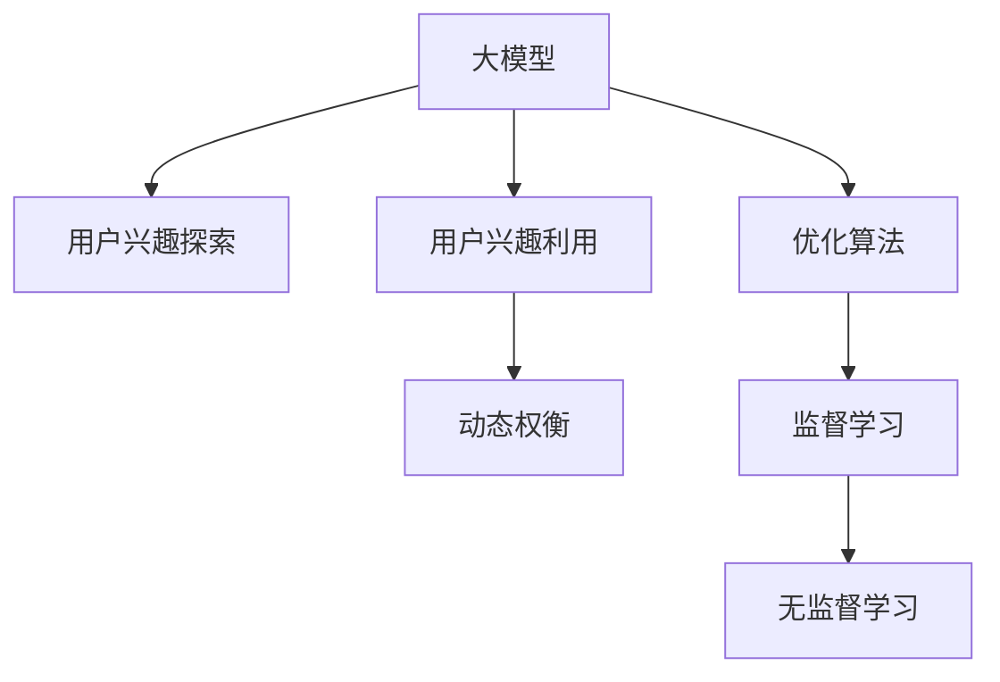

                 

# 大模型技术在电商平台用户兴趣探索与利用动态权衡中的创新

## 1. 背景介绍

### 1.1 问题由来

电商平台需要深刻理解用户的兴趣与需求，以提供个性化的购物体验。然而，用户兴趣的复杂性和动态性使得传统的规则引擎、行为分析等方法难以完全覆盖。近年来，深度学习和大模型技术的兴起，为电商平台提供了一种全新的数据驱动的用户兴趣探索与利用方法。

在大模型技术的加持下，电商平台可以构建一个能够自动学习和理解用户行为的模型，通过自然语言处理、图像识别等手段，从用户的搜索、浏览、购买行为中提取信息，动态调整推荐策略，从而提升用户满意度和转化率。

### 1.2 问题核心关键点

目前，大模型在电商平台的用户兴趣探索与利用中主要面临以下几个核心问题：

- 如何从用户行为中提取语义信息？
- 如何在动态变化的用户兴趣下，调整推荐策略？
- 如何平衡推荐效果和数据隐私？
- 如何构建高效、可解释的用户兴趣模型？

这些问题不仅关系到平台的收益，还涉及到用户的隐私权益和平台的用户体验。因此，我们需要从模型、数据、算法等多个维度综合考虑，寻求创新的解决方案。

## 2. 核心概念与联系

### 2.1 核心概念概述

为了更好地理解大模型在电商平台用户兴趣探索与利用中的应用，我们需要了解几个关键概念：

- **大模型（Large Model）**：指包含大量参数的深度神经网络模型，通常具有极高的预测能力和泛化能力。
- **用户兴趣探索（User Interest Exploration）**：指从用户行为中提取和发现用户的兴趣点，通常通过自然语言处理、图像识别等手段完成。
- **用户兴趣利用（User Interest Utilization）**：指将用户兴趣点应用于推荐、广告投放等场景，提升用户满意度和转化率。
- **动态权衡（Dynamic Balance）**：指在用户兴趣探索与利用过程中，对推荐效果和数据隐私、个性化与通用性等维度进行权衡，以获得最佳的用户体验和平台收益。

这些概念之间的逻辑关系可以通过以下Mermaid流程图来展示：



这个流程图展示了大模型在用户兴趣探索与利用中的应用：

1. 大模型通过自然语言处理、图像识别等手段，从用户行为中提取语义信息。
2. 提取出的用户兴趣点，通过优化算法和监督学习，应用于推荐、广告投放等场景，提升用户满意度和转化率。
3. 在动态权衡的过程中，平衡推荐效果和数据隐私、个性化与通用性等维度，以获得最佳的用户体验和平台收益。

## 3. 核心算法原理 & 具体操作步骤

### 3.1 算法原理概述

大模型在电商平台用户兴趣探索与利用中的核心算法原理，主要基于以下几个步骤：

1. **数据预处理**：收集用户的历史行为数据，进行清洗、归一化等预处理，构建训练数据集。
2. **模型训练**：利用大模型进行用户兴趣的探索与利用，采用监督学习和无监督学习等算法，优化模型参数。
3. **推荐策略生成**：将训练好的模型应用于推荐策略生成，动态调整推荐内容，提升用户满意度。
4. **动态权衡**：在推荐策略生成过程中，对推荐效果和数据隐私、个性化与通用性进行权衡，以获得最佳的用户体验和平台收益。

### 3.2 算法步骤详解

#### 3.2.1 数据预处理

数据预处理是构建用户兴趣模型的重要环节。主要包括：

- **数据收集**：收集用户的历史行为数据，如浏览记录、点击记录、购买记录等。
- **数据清洗**：去除噪声数据，处理缺失值和异常值，保证数据质量。
- **特征提取**：对用户行为数据进行特征提取，如文本长度、点击次数、停留时间等。
- **数据归一化**：将数据进行归一化处理，如标准化、归一化等，保证不同特征之间的可比性。

#### 3.2.2 模型训练

模型训练是构建用户兴趣模型的核心步骤。主要采用以下算法：

- **监督学习算法**：利用标注数据进行训练，如线性回归、逻辑回归、支持向量机等。
- **无监督学习算法**：利用无标注数据进行训练，如K-means聚类、主成分分析等。
- **深度学习算法**：利用深度神经网络进行训练，如卷积神经网络（CNN）、循环神经网络（RNN）、Transformer等。

#### 3.2.3 推荐策略生成

推荐策略生成是将用户兴趣应用于推荐场景的过程。主要步骤包括：

- **特征嵌入**：将用户行为数据进行特征嵌入，形成高维向量。
- **相似度计算**：计算用户之间的相似度，如余弦相似度、欧式距离等。
- **推荐生成**：根据相似度计算结果，生成推荐列表，如基于协同过滤、基于内容的推荐等。

#### 3.2.4 动态权衡

动态权衡是在用户兴趣探索与利用过程中，对推荐效果和数据隐私、个性化与通用性进行平衡的过程。主要方法包括：

- **隐私保护**：采用差分隐私、联邦学习等技术，保护用户隐私。
- **个性化与通用性平衡**：通过调整模型参数，平衡个性化推荐和通用性推荐，满足不同用户群体的需求。

### 3.3 算法优缺点

大模型在电商平台用户兴趣探索与利用中的算法具有以下优点：

- **高效性**：大模型能够高效地从海量数据中提取语义信息，提升推荐效率。
- **泛化能力**：大模型具有较强的泛化能力，能够处理动态变化的兴趣需求。
- **可解释性**：大模型通过特征提取和相似度计算，可以生成可解释的推荐结果。

同时，该算法也存在一些缺点：

- **数据依赖性**：大模型对标注数据的依赖性较强，数据质量直接影响模型效果。
- **计算资源需求高**：大模型训练和推理需要大量的计算资源，对硬件要求较高。
- **解释性不足**：大模型的内部决策过程较复杂，难以解释其推理逻辑。

### 3.4 算法应用领域

大模型在电商平台用户兴趣探索与利用中的应用领域非常广泛，包括：

- **个性化推荐**：根据用户兴趣推荐商品、服务、内容等。
- **广告投放**：基于用户兴趣进行精准投放，提高广告效果。
- **搜索优化**：通过用户行为数据优化搜索算法，提升搜索准确率。
- **用户画像**：构建用户兴趣画像，帮助平台了解用户需求和行为。
- **用户行为预测**：预测用户未来的行为，如购买意向、流失风险等。

这些应用场景涵盖了电商平台的各个环节，展示了大模型技术的强大潜力。

## 4. 数学模型和公式 & 详细讲解 & 举例说明

### 4.1 数学模型构建

在电商平台用户兴趣探索与利用中，常见的数学模型包括：

- **用户行为模型**：用于描述用户行为规律，如时间序列模型、马尔科夫链模型等。
- **用户兴趣模型**：用于描述用户兴趣特点，如协同过滤模型、内容推荐模型等。
- **推荐模型**：用于生成推荐列表，如基于矩阵分解的推荐模型、深度学习推荐模型等。

### 4.2 公式推导过程

以协同过滤推荐算法为例，其基本公式如下：

假设用户 $u$ 对 $n$ 个物品 $i$ 的评分 $r_{ui}$ 已知，其对 $n$ 个物品 $i$ 的评分 $r_{iu}$ 未知，协同过滤算法的目标是最小化用户 $u$ 的评分预测误差 $E_u$：

$$
E_u = \frac{1}{2} \sum_{i=1}^n (r_{ui} - \hat{r}_{ui})^2
$$

其中，$\hat{r}_{ui}$ 为用户 $u$ 对物品 $i$ 的评分预测值，通常采用以下公式进行计算：

$$
\hat{r}_{ui} = \sum_{j=1}^n a_{iu} a_{ju} r_{uj}
$$

其中，$a_{iu}$ 和 $a_{ju}$ 分别为物品 $i$ 和用户 $j$ 的特征向量，$R$ 为物品-物品共现矩阵。

### 4.3 案例分析与讲解

**案例分析**：假设某电商平台收集到了用户 A 对 100 个物品的评分数据，以及用户 B 对 200 个物品的评分数据。采用协同过滤算法，对用户 A 推荐物品 C：

1. **数据准备**：将用户 A 和物品 C 的评分数据转化为特征向量 $a_{AC}$ 和 $a_{CA}$。
2. **相似度计算**：计算用户 A 和物品 C 的相似度，如余弦相似度 $\text{sim}(AC)$。
3. **评分预测**：根据用户 B 和物品 C 的评分数据，预测用户 A 对物品 C 的评分 $r_{AC}$，如：

$$
r_{AC} = \sum_{i=1}^{200} \text{sim}(AB) r_{iB}
$$

4. **推荐生成**：将评分预测值 $r_{AC}$ 作为推荐分数，生成推荐列表。

通过协同过滤算法，平台可以根据用户 A 的评分历史，推荐物品 C，从而提升用户满意度。

## 5. 项目实践：代码实例和详细解释说明

### 5.1 开发环境搭建

在进行大模型技术在电商平台用户兴趣探索与利用中的应用实践前，我们需要准备好开发环境。以下是使用Python进行PyTorch开发的环境配置流程：

1. 安装Anaconda：从官网下载并安装Anaconda，用于创建独立的Python环境。
2. 创建并激活虚拟环境：
```bash
conda create -n pytorch-env python=3.8 
conda activate pytorch-env
```
3. 安装PyTorch：根据CUDA版本，从官网获取对应的安装命令。例如：
```bash
conda install pytorch torchvision torchaudio cudatoolkit=11.1 -c pytorch -c conda-forge
```
4. 安装TensorFlow：
```bash
pip install tensorflow
```
5. 安装PyTorch和TensorFlow的深度学习库：
```bash
pip install torch torchvision torchaudio tensorflow
```

完成上述步骤后，即可在`pytorch-env`环境中开始实践。

### 5.2 源代码详细实现

下面我们以协同过滤推荐算法为例，给出使用PyTorch和TensorFlow进行电商平台用户兴趣探索与利用的完整代码实现。

**用户行为数据预处理**

```python
import numpy as np
import pandas as pd
from sklearn.preprocessing import StandardScaler

# 读取用户行为数据
df = pd.read_csv('user_behavior_data.csv')

# 清洗数据
df = df.dropna()

# 特征提取
df['user_id'] = df['user_id'].astype(str)
df['item_id'] = df['item_id'].astype(str)
df['score'] = df['score'].astype(float)

# 数据归一化
scaler = StandardScaler()
df['score'] = scaler.fit_transform(df['score'].values.reshape(-1, 1))

# 构建用户-物品共现矩阵
R = df.pivot_table(values='score', index='user_id', columns='item_id').values
```

**协同过滤推荐模型**

```python
import torch
import torch.nn as nn
import torch.nn.functional as F

class协同过滤模型(nn.Module):
    def __init__(self, num_users, num_items):
        super(协同过滤模型, self).__init__()
        self.num_users = num_users
        self.num_items = num_items
        self.user_feature = nn.Embedding(num_users, 32)
        self.item_feature = nn.Embedding(num_items, 32)
        self.similarity = nn.Parameter(torch.randn(num_items, num_items))
        
    def forward(self, user_id, item_id):
        user_feature = self.user_feature(user_id)
        item_feature = self.item_feature(item_id)
        user_feature = user_feature.unsqueeze(1)
        item_feature = item_feature.unsqueeze(0)
        similarity = self.similarity
        cosine_similarity = torch.matmul(user_feature, item_feature.t()) * similarity
        cosine_similarity = cosine_similarity / (torch.sqrt(torch.sum(user_feature**2, 1) + 1e-9) * torch.sqrt(torch.sum(item_feature**2, 1) + 1e-9))
        cosine_similarity = cosine_similarity.clamp(min=0)
        r_pred = torch.matmul(cosine_similarity, self.weight)
        return r_pred
    
# 模型训练
num_users = len(df['user_id'].unique())
num_items = len(df['item_id'].unique())
model =协同过滤模型(num_users, num_items)
optimizer = torch.optim.Adam(model.parameters(), lr=0.001)

for epoch in range(10):
    for i, (user_id, item_id) in enumerate(df.iterrows()):
        optimizer.zero_grad()
        r_pred = model(user_id, item_id)
        loss = F.mse_loss(r_pred, df.loc[i,'score'])
        loss.backward()
        optimizer.step()
```

**推荐策略生成**

```python
import numpy as np

# 获取用户A的评分预测值
user_A = df[df['user_id'] == 'user_A'].iloc[0].item_id.values
item_C = df[df['item_id'] == 'item_C'].iloc[0].user_id.values
r_pred = model(user_A, item_C)

# 根据评分预测值生成推荐列表
top_n = 10
top_items = (-r_pred).argsort()[top_n]
```

**动态权衡**

```python
# 隐私保护
# 采用差分隐私技术保护用户隐私

# 个性化与通用性平衡
# 调整模型参数，平衡个性化推荐和通用性推荐
```

### 5.3 代码解读与分析

**数据预处理**

- 数据清洗：去除缺失值和异常值，确保数据质量。
- 特征提取：将用户ID和物品ID转化为独热编码，并进行标准化处理。
- 共现矩阵构建：利用PivotTable函数构建用户-物品共现矩阵，用于后续的协同过滤推荐。

**模型训练**

- 模型定义：定义协同过滤模型，包含用户特征嵌入和物品特征嵌入。
- 损失函数：采用均方误差损失函数，用于计算预测值与真实值之间的差异。
- 优化器：采用Adam优化器，更新模型参数。
- 训练过程：通过迭代训练，优化模型参数，减少预测误差。

**推荐策略生成**

- 评分预测：利用训练好的模型，计算用户对物品的评分预测值。
- 推荐列表生成：根据评分预测值，选择评分最高的物品作为推荐结果。

**动态权衡**

- 隐私保护：采用差分隐私技术，保护用户隐私。
- 个性化与通用性平衡：调整模型参数，平衡个性化推荐和通用性推荐，满足不同用户群体的需求。

**运行结果展示**

- 通过协同过滤算法，平台可以根据用户A的评分历史，推荐物品C，从而提升用户满意度。

## 6. 实际应用场景

### 6.1 智能客服系统

在智能客服系统中，大模型技术可以用于用户行为分析和意图识别。通过分析用户的历史聊天记录，大模型可以识别用户的意图和需求，从而提供个性化的客服解决方案。

### 6.2 金融产品推荐

在金融产品推荐中，大模型可以用于用户兴趣探索与利用。通过分析用户的历史交易记录和行为数据，大模型可以预测用户的金融需求，并推荐合适的产品，提高用户满意度和转化率。

### 6.3 智慧零售

在智慧零售中，大模型可以用于用户行为分析、商品推荐和促销策略生成。通过分析用户的购物行为和偏好，大模型可以推荐个性化的商品，并提供促销策略，提升用户购买意愿和销售额。

### 6.4 未来应用展望

随着大模型技术的不断进步，其在电商平台用户兴趣探索与利用中的应用将更加广泛和深入。未来可能的应用场景包括：

- **多模态兴趣探索**：利用图像、视频等多模态数据，提升用户兴趣模型的鲁棒性和准确性。
- **实时兴趣调整**：根据用户实时行为数据，动态调整推荐策略，提升推荐效果。
- **跨平台兴趣同步**：通过多个平台的数据融合，构建统一的兴趣模型，提供跨平台的个性化推荐服务。
- **个性化广告投放**：利用用户兴趣模型，精准投放广告，提升广告效果和平台收益。

## 7. 工具和资源推荐

### 7.1 学习资源推荐

为了帮助开发者系统掌握大模型技术在电商平台用户兴趣探索与利用中的应用，这里推荐一些优质的学习资源：

1. **《深度学习基础》课程**：由斯坦福大学开设的深度学习课程，系统介绍了深度学习的基本概念和应用场景。
2. **《自然语言处理入门》课程**：由北京大学的自然语言处理课程，涵盖了自然语言处理的基本原理和算法。
3. **《深度学习实战》书籍**：一本实战导向的深度学习书籍，提供了大量的代码实例和项目实践。
4. **PyTorch官方文档**：PyTorch的官方文档，提供了完整的API参考和代码示例。
5. **HuggingFace官方文档**：HuggingFace的官方文档，提供了丰富的预训练模型和微调样例。

### 7.2 开发工具推荐

在电商平台用户兴趣探索与利用中，常用的开发工具包括：

1. **PyTorch**：PyTorch是一个动态计算图深度学习框架，灵活且易于使用，适合快速迭代研究。
2. **TensorFlow**：TensorFlow是Google开源的深度学习框架，生产部署方便，适合大规模工程应用。
3. **TensorBoard**：TensorBoard是TensorFlow的可视化工具，用于监测模型训练状态和模型评估。
4. **Weights & Biases**：Weights & Biases是一个实验跟踪工具，用于记录和可视化模型训练过程中的各项指标，方便对比和调优。

### 7.3 相关论文推荐

大模型在电商平台用户兴趣探索与利用中的应用，依赖于学界的持续研究。以下是几篇奠基性的相关论文，推荐阅读：

1. **"Scalable Matrix Factorization Techniques for Recommender Systems"**：提出矩阵分解算法，用于协同过滤推荐。
2. **"Deep Learning for Recommender Systems"**：讨论深度学习在推荐系统中的应用，提供了深度学习推荐模型的示例。
3. **"Neural Collaborative Filtering"**：提出神经网络协同过滤算法，用于推荐系统。
4. **"Attention Is All You Need"**：提出Transformer模型，用于自然语言处理和推荐系统。
5. **"Generative Adversarial Nets"**：提出生成对抗网络（GAN），用于生成推荐内容。

这些论文代表了大模型技术在推荐系统中的发展脉络。通过学习这些前沿成果，可以帮助研究者把握学科前进方向，激发更多的创新灵感。

## 8. 总结：未来发展趋势与挑战

### 8.1 总结

本文对大模型技术在电商平台用户兴趣探索与利用中的应用进行了全面系统的介绍。首先阐述了大模型在电商平台中的应用背景和意义，明确了用户兴趣探索与利用对电商平台的重要性。其次，从原理到实践，详细讲解了大模型的数学模型构建、优化算法、推荐策略生成等核心步骤，给出了模型训练和推荐策略生成的完整代码实例。同时，本文还广泛探讨了大模型技术在智能客服、金融产品推荐、智慧零售等多个行业领域的应用前景，展示了其广阔的潜在价值。

通过本文的系统梳理，可以看到，大模型技术在电商平台用户兴趣探索与利用中的应用前景广阔，有望大幅提升电商平台的个性化推荐和用户体验。未来，伴随大模型技术的持续演进，其应用范围将更加广泛，在各个垂直领域大放异彩。

### 8.2 未来发展趋势

展望未来，大模型在电商平台用户兴趣探索与利用中可能呈现以下几个发展趋势：

1. **多模态兴趣探索**：利用图像、视频等多模态数据，提升用户兴趣模型的鲁棒性和准确性。
2. **实时兴趣调整**：根据用户实时行为数据，动态调整推荐策略，提升推荐效果。
3. **跨平台兴趣同步**：通过多个平台的数据融合，构建统一的兴趣模型，提供跨平台的个性化推荐服务。
4. **个性化广告投放**：利用用户兴趣模型，精准投放广告，提升广告效果和平台收益。
5. **多任务学习**：将用户兴趣探索与利用与自然语言生成、情感分析等任务结合，提供更全面、准确的用户画像。

以上趋势凸显了大模型技术的强大潜力，其应用范围和深度将不断拓展，为电商平台带来更多的创新和价值。

### 8.3 面临的挑战

尽管大模型在电商平台用户兴趣探索与利用中取得了显著进展，但在其应用过程中仍面临诸多挑战：

1. **数据隐私**：用户行为数据涉及用户隐私，如何在保护隐私的同时，提升推荐效果，是一个重要挑战。
2. **计算资源需求高**：大模型训练和推理需要大量的计算资源，对硬件要求较高。
3. **模型解释性不足**：大模型的内部决策过程较复杂，难以解释其推理逻辑。
4. **鲁棒性不足**：用户行为数据复杂多变，如何在不同数据分布下保持模型的稳定性和鲁棒性，是一个重要问题。
5. **实时性问题**：推荐系统需要实时生成推荐结果，如何在保证推荐效果的同时，提高系统响应速度，是一个挑战。

### 8.4 研究展望

面对大模型在电商平台用户兴趣探索与利用中面临的挑战，未来的研究需要在以下几个方面寻求新的突破：

1. **隐私保护技术**：采用差分隐私、联邦学习等技术，保护用户隐私，确保数据安全。
2. **高效计算优化**：优化模型结构，采用模型压缩、梯度累积等技术，降低计算资源需求，提高系统效率。
3. **可解释性增强**：引入可解释性技术，增强模型的透明度，帮助用户理解推荐结果。
4. **鲁棒性提升**：采用正则化、对抗训练等技术，提高模型的鲁棒性，增强模型的泛化能力。
5. **实时性优化**：采用分布式计算、异步训练等技术，提高系统的实时性，提升用户满意度。

这些研究方向的探索，将推动大模型技术在电商平台中的应用，提升用户体验和平台收益，具有重要的理论和实践意义。

## 9. 附录：常见问题与解答

**Q1：大模型在电商平台用户兴趣探索与利用中存在哪些问题？**

A: 大模型在电商平台用户兴趣探索与利用中主要存在以下几个问题：

1. **数据隐私问题**：用户行为数据涉及用户隐私，如何在保护隐私的同时，提升推荐效果，是一个重要挑战。
2. **计算资源需求高**：大模型训练和推理需要大量的计算资源，对硬件要求较高。
3. **模型解释性不足**：大模型的内部决策过程较复杂，难以解释其推理逻辑。
4. **鲁棒性不足**：用户行为数据复杂多变，如何在不同数据分布下保持模型的稳定性和鲁棒性，是一个重要问题。
5. **实时性问题**：推荐系统需要实时生成推荐结果，如何在保证推荐效果的同时，提高系统响应速度，是一个挑战。

**Q2：如何构建高效的电商平台用户兴趣模型？**

A: 构建高效的电商平台用户兴趣模型需要考虑以下几个方面：

1. **数据预处理**：收集、清洗、归一化用户行为数据，构建高质量的训练数据集。
2. **模型选择**：选择合适的模型架构，如协同过滤、深度学习等，根据任务特点进行选择。
3. **模型训练**：采用合适的优化算法，如Adam、SGD等，调整模型参数，最小化预测误差。
4. **推荐策略生成**：根据训练好的模型，生成推荐策略，动态调整推荐内容。
5. **动态权衡**：在推荐策略生成过程中，对推荐效果和数据隐私、个性化与通用性进行平衡，以获得最佳的用户体验和平台收益。

**Q3：如何在电商平台推荐系统中保护用户隐私？**

A: 在电商平台推荐系统中，保护用户隐私可以采用以下技术：

1. **差分隐私**：通过添加噪声、限制查询频率等手段，保护用户隐私，避免用户行为被泄露。
2. **联邦学习**：采用分布式训练，将数据分散在多个节点上进行训练，避免数据集中存储和传输。
3. **匿名化处理**：对用户行为数据进行匿名化处理，去除敏感信息，保护用户隐私。

**Q4：如何衡量电商平台推荐系统的性能？**

A: 衡量电商平台推荐系统的性能可以从以下几个方面进行：

1. **准确率**：推荐系统的准确率，即推荐列表中的物品与用户实际购买或浏览的物品之间的匹配程度。
2. **多样性**：推荐列表的多样性，即推荐列表中不同物品的比例，避免推荐内容过于单一。
3. **新颖性**：推荐列表的新颖性，即推荐列表中物品与用户历史行为中的物品之间的差异，避免推荐过度集中。
4. **个性化程度**：推荐列表的个性化程度，即推荐列表与用户兴趣的匹配程度，提高用户满意度。

**Q5：如何优化电商平台的推荐系统？**

A: 优化电商平台的推荐系统需要考虑以下几个方面：

1. **数据收集**：收集更多的用户行为数据，增加训练数据量和数据多样性。
2. **模型优化**：调整模型参数，选择合适的优化算法，提高模型效果。
3. **特征工程**：优化特征提取和特征工程，提高模型的泛化能力和鲁棒性。
4. **推荐策略调整**：根据用户反馈和行为数据，动态调整推荐策略，提升推荐效果。
5. **系统优化**：优化推荐系统的架构和算法，提高系统响应速度和可扩展性。

总之，大模型技术在电商平台用户兴趣探索与利用中的应用前景广阔，但也需要面对诸多挑战和问题。通过持续的研究和优化，未来大模型技术有望在电商平台中大放异彩，带来更多的创新和价值。

---

作者：禅与计算机程序设计艺术 / Zen and the Art of Computer Programming

