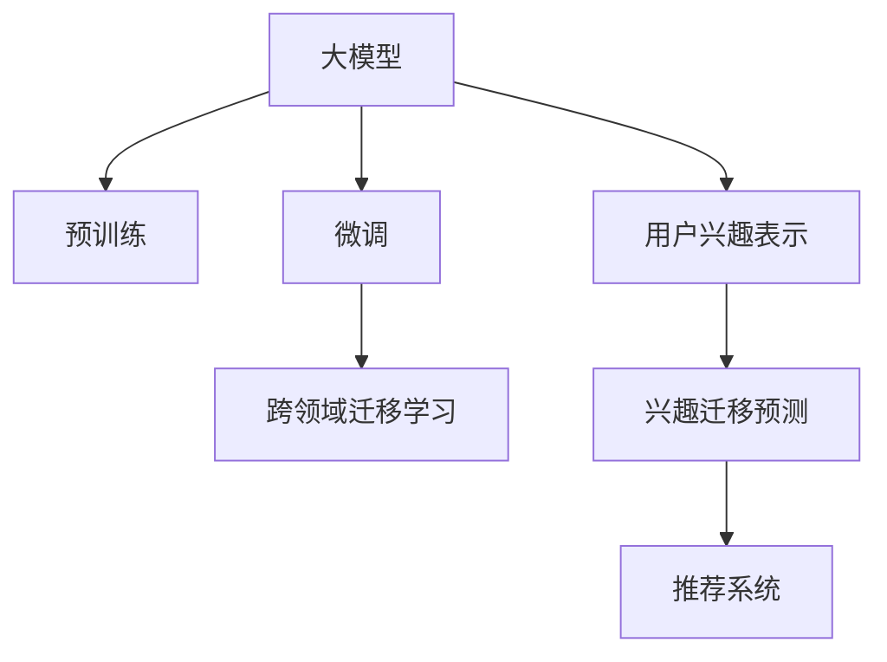

                 

# 大模型技术在电商平台用户兴趣迁移预测中的应用

## 1. 背景介绍

在现代电商平台上，用户兴趣预测是推荐系统中最核心、最具有挑战性的任务之一。准确预测用户的兴趣迁移，能够有效提升个性化推荐的质量，从而提升用户满意度和平台的转化率。传统的推荐系统依赖于用户的历史行为数据进行预测，但随着用户行为的快速变化和多样性，历史数据的局限性日益凸显。为了解决这一问题，大模型技术逐渐被引入推荐系统中，为电商平台的个性化推荐带来了新的可能。

### 1.1 问题由来

随着电商平台数据的不断积累和用户行为的多样化，传统推荐系统基于用户历史行为的协同过滤和基于内容的推荐方法，难以满足用户的个性化需求。特别是在电商平台的初期阶段，用户数据积累较少，历史行为数据难以提供有效的推荐依据。

为了提升推荐系统的效果，平台开始尝试引入深度学习等大模型技术，利用大规模数据进行预训练，学习用户兴趣和行为的高维表示。然而，由于大模型的复杂性和高昂的计算成本，直接应用于电商推荐中仍然存在诸多挑战。

### 1.2 问题核心关键点

大模型技术在电商平台用户兴趣迁移预测中，主要面临以下几个核心问题：

1. **用户兴趣表示**：如何将用户的兴趣和行为转化为高维向量表示，用于构建推荐模型的输入。
2. **兴趣迁移预测**：如何预测用户兴趣的迁移趋势，捕捉用户的潜在需求和兴趣变化。
3. **模型性能优化**：如何在保证模型精度的同时，优化模型计算效率和预测速度。
4. **泛化能力提升**：如何提升模型在未知用户和场景下的泛化能力，避免过拟合和冷启动问题。

解决这些核心问题，需要充分利用大模型的优势，结合电商平台的实际需求，进行有效的模型设计和优化。

## 2. 核心概念与联系

### 2.1 核心概念概述

为了更好地理解大模型技术在电商平台中的应用，本节将介绍几个密切相关的核心概念：

- **大模型(Large Model)**：指具有大规模参数和复杂结构的深度学习模型，如BERT、GPT等。通过在大规模数据上进行预训练，学习通用的语言或特征表示，具备强大的特征抽取和表示能力。
- **预训练(Pre-training)**：指在大规模无标签数据上，通过自监督学习任务训练模型的过程。常见的预训练任务包括掩码语言模型、图像预训练等。预训练使得模型学习到更丰富的知识，从而提升下游任务的效果。
- **微调(Fine-tuning)**：指在预训练模型的基础上，使用下游任务的标注数据，通过有监督学习优化模型在特定任务上的性能。在推荐系统中，微调模型可以根据用户行为和兴趣数据进行定制化训练，提升推荐的准确性和个性化。
- **跨领域迁移学习(Cross-domain Transfer Learning)**：指在预训练模型和微调模型的基础上，将学到的知识迁移到新的领域或任务中，以提升模型在新场景下的泛化能力。在电商推荐中，可以利用大模型在多个领域和任务上的学习能力，进行交叉迁移学习，从而提升推荐模型的表现。
- **用户兴趣表示(User Interest Representation)**：指将用户的行为和兴趣转化为机器可理解的高维向量，用于构建推荐模型的输入。用户兴趣的表示方式和质量，直接影响推荐系统的效果。
- **兴趣迁移预测(Interest Migration Prediction)**：指通过大模型预测用户兴趣的迁移趋势，捕捉用户的潜在需求和兴趣变化。在电商推荐中，兴趣迁移预测能够帮助系统提前预判用户的未来行为，提升推荐的时效性和准确性。
- **推荐系统(Recommendation System)**：指根据用户的行为和兴趣，为用户推荐合适的产品或服务的技术系统。推荐系统包括协同过滤、内容推荐、混合推荐等多种方法，其核心目标是提升用户的满意度和平台转化率。

这些核心概念之间的逻辑关系可以通过以下Mermaid流程图来展示：



这个流程图展示了大模型技术在电商平台中的核心概念及其之间的关系：

1. 大模型通过预训练获得基础能力。
2. 微调是对预训练模型进行任务特定的优化，可以根据用户行为和兴趣数据进行定制化训练，提升推荐的准确性和个性化。
3. 跨领域迁移学习将学到的知识迁移到新的领域或任务中，提升模型在新场景下的泛化能力。
4. 用户兴趣表示将用户的行为和兴趣转化为高维向量，用于构建推荐模型的输入。
5. 兴趣迁移预测通过大模型预测用户兴趣的迁移趋势，捕捉用户的潜在需求和兴趣变化。
6. 推荐系统利用用户兴趣表示和兴趣迁移预测结果，为用户推荐合适的产品或服务。

这些概念共同构成了大模型技术在电商平台中的应用框架，使其能够在个性化推荐中发挥强大的作用。通过理解这些核心概念，我们可以更好地把握大模型技术的工作原理和优化方向。

## 3. 核心算法原理 & 具体操作步骤
### 3.1 算法原理概述

大模型在电商平台用户兴趣迁移预测中的应用，主要基于以下两个关键原理：

1. **用户兴趣表示**：将用户的行为和兴趣转化为高维向量，用于构建推荐模型的输入。用户兴趣的表示方式和质量，直接影响推荐系统的效果。
2. **兴趣迁移预测**：通过大模型预测用户兴趣的迁移趋势，捕捉用户的潜在需求和兴趣变化。

形式化地，假设预训练的大模型为 $M_{\theta}$，其中 $\theta$ 为预训练得到的模型参数。给定电商平台的用户行为和兴趣数据集 $D=\{(x_i,y_i)\}_{i=1}^N$，其中 $x_i$ 为用户的兴趣向量，$y_i$ 为用户的当前行为标签，$M_{\theta}$ 通过微调学习用户兴趣迁移的概率模型。

微调的目标是找到最优参数 $\hat{\theta}$，使得：

$$
\hat{\theta}=\mathop{\arg\min}_{\theta} \mathcal{L}(M_{\theta},D)
$$

其中 $\mathcal{L}$ 为损失函数，用于衡量模型预测结果与真实标签之间的差异。

### 3.2 算法步骤详解

基于大模型技术在电商平台用户兴趣迁移预测中的应用，主要包括以下几个关键步骤：

**Step 1: 准备预训练模型和数据集**
- 选择合适的预训练语言模型 $M_{\theta}$ 作为初始化参数，如BERT、GPT等。
- 准备电商平台的用户行为和兴趣数据集 $D$，划分为训练集、验证集和测试集。一般要求标注数据与预训练数据的分布不要差异过大。

**Step 2: 构建用户兴趣表示**
- 根据用户行为和兴趣数据，提取关键特征，构建用户兴趣向量。
- 对用户兴趣向量进行归一化和标准化处理，以便更好地进行模型训练。

**Step 3: 设置微调超参数**
- 选择合适的优化算法及其参数，如 AdamW、SGD 等，设置学习率、批大小、迭代轮数等。
- 设置正则化技术及强度，包括权重衰减、Dropout、Early Stopping 等。
- 确定冻结预训练参数的策略，如仅微调顶层，或全部参数都参与微调。

**Step 4: 执行梯度训练**
- 将训练集数据分批次输入模型，前向传播计算损失函数。
- 反向传播计算参数梯度，根据设定的优化算法和学习率更新模型参数。
- 周期性在验证集上评估模型性能，根据性能指标决定是否触发 Early Stopping。
- 重复上述步骤直到满足预设的迭代轮数或 Early Stopping 条件。

**Step 5: 测试和部署**
- 在测试集上评估微调后模型 $M_{\hat{\theta}}$ 的性能，对比微调前后的精度提升。
- 使用微调后的模型对新用户进行兴趣预测，集成到实际的应用系统中。
- 持续收集新的用户行为和兴趣数据，定期重新微调模型，以适应数据分布的变化。

以上是基于大模型技术在电商平台中的应用的一般流程。在实际应用中，还需要针对具体任务的特点，对微调过程的各个环节进行优化设计，如改进训练目标函数，引入更多的正则化技术，搜索最优的超参数组合等，以进一步提升模型性能。

### 3.3 算法优缺点

大模型技术在电商平台用户兴趣迁移预测中的应用具有以下优点：
1. 可以处理大规模数据和复杂模式，提升推荐系统的泛化能力和鲁棒性。
2. 能够捕捉用户兴趣的动态变化，提升推荐的时效性和个性化。
3. 可以利用已有的大模型知识，减少从头开始训练的计算成本。
4. 通过微调，可以针对特定任务进行优化，提升推荐系统的精度。

同时，该方法也存在一定的局限性：
1. 对标注数据的需求较高，标注数据的获取和处理成本较大。
2. 模型的复杂性高，计算成本较高，需要高性能的硬件设备支持。
3. 模型的泛化能力有限，在新的场景和领域上可能需要进一步微调。
4. 需要大量的历史数据进行训练，难以处理冷启动问题。

尽管存在这些局限性，但就目前而言，基于大模型技术的应用范式仍然是最为主流和有效的推荐方法之一。未来相关研究的重点在于如何进一步降低大模型的计算成本，提高模型的泛化能力，同时兼顾可解释性和伦理安全性等因素。

### 3.4 算法应用领域

大模型技术在电商平台中的应用主要涵盖以下几个领域：

1. **个性化推荐系统**：通过用户行为和兴趣数据的微调，为用户推荐合适的产品，提升用户满意度和平台转化率。
2. **用户兴趣迁移预测**：利用大模型预测用户兴趣的迁移趋势，捕捉用户的潜在需求和兴趣变化，从而提前预判用户的未来行为。
3. **商品相关性匹配**：将用户兴趣向量与商品特征向量进行匹配，计算商品的相关性分数，推荐用户可能感兴趣的商品。
4. **广告推荐**：通过用户行为和兴趣数据的微调，为用户推荐相关的广告，提升广告的点击率和转化率。
5. **内容推荐**：利用用户兴趣向量与内容特征向量进行匹配，推荐用户可能感兴趣的文章、视频等。

除了上述这些核心应用外，大模型技术还被创新性地应用到更多场景中，如用户画像构建、用户行为分析、风险控制等，为电商平台的运营管理带来了新的思路和方法。随着预训练模型和微调方法的不断进步，相信大模型技术将在更多领域大放异彩。

## 4. 数学模型和公式 & 详细讲解  
### 4.1 数学模型构建

本节将使用数学语言对大模型技术在电商平台中的应用进行更加严格的刻画。

记预训练语言模型为 $M_{\theta}$，其中 $\theta$ 为预训练得到的模型参数。假设电商平台的用户行为和兴趣数据集为 $D=\{(x_i,y_i)\}_{i=1}^N$，其中 $x_i$ 为用户的兴趣向量，$y_i$ 为用户的当前行为标签。

定义模型 $M_{\theta}$ 在数据样本 $(x,y)$ 上的损失函数为 $\ell(M_{\theta}(x),y)$，则在数据集 $D$ 上的经验风险为：

$$
\mathcal{L}(\theta) = \frac{1}{N} \sum_{i=1}^N \ell(M_{\theta}(x_i),y_i)
$$

微调的目标是最小化经验风险，即找到最优参数：

$$
\theta^* = \mathop{\arg\min}_{\theta} \mathcal{L}(\theta)
$$

在实践中，我们通常使用基于梯度的优化算法（如SGD、Adam等）来近似求解上述最优化问题。设 $\eta$ 为学习率，$\lambda$ 为正则化系数，则参数的更新公式为：

$$
\theta \leftarrow \theta - \eta \nabla_{\theta}\mathcal{L}(\theta) - \eta\lambda\theta
$$

其中 $\nabla_{\theta}\mathcal{L}(\theta)$ 为损失函数对参数 $\theta$ 的梯度，可通过反向传播算法高效计算。

### 4.2 公式推导过程

以下我们以用户兴趣迁移预测为例，推导跨领域迁移学习的损失函数及其梯度的计算公式。

假设模型 $M_{\theta}$ 在用户兴趣向量 $x_i$ 上的预测结果为 $\hat{y}=M_{\theta}(x_i)$，表示模型预测用户兴趣迁移的概率。真实标签 $y_i$ 为用户的当前行为标签。则二分类交叉熵损失函数定义为：

$$
\ell(M_{\theta}(x_i),y_i) = -[y_i\log \hat{y} + (1-y_i)\log (1-\hat{y})]
$$

将其代入经验风险公式，得：

$$
\mathcal{L}(\theta) = -\frac{1}{N}\sum_{i=1}^N [y_i\log M_{\theta}(x_i)+(1-y_i)\log(1-M_{\theta}(x_i))]
$$

根据链式法则，损失函数对参数 $\theta_k$ 的梯度为：

$$
\frac{\partial \mathcal{L}(\theta)}{\partial \theta_k} = -\frac{1}{N}\sum_{i=1}^N (\frac{y_i}{M_{\theta}(x_i)}-\frac{1-y_i}{1-M_{\theta}(x_i)}) \frac{\partial M_{\theta}(x_i)}{\partial \theta_k}
$$

其中 $\frac{\partial M_{\theta}(x_i)}{\partial \theta_k}$ 可进一步递归展开，利用自动微分技术完成计算。

在得到损失函数的梯度后，即可带入参数更新公式，完成模型的迭代优化。重复上述过程直至收敛，最终得到适应电商平台推荐任务的最优模型参数 $\theta^*$。

## 5. 项目实践：代码实例和详细解释说明
### 5.1 开发环境搭建

在进行电商推荐微调实践前，我们需要准备好开发环境。以下是使用Python进行PyTorch开发的环境配置流程：

1. 安装Anaconda：从官网下载并安装Anaconda，用于创建独立的Python环境。

2. 创建并激活虚拟环境：
```bash
conda create -n pytorch-env python=3.8 
conda activate pytorch-env
```

3. 安装PyTorch：根据CUDA版本，从官网获取对应的安装命令。例如：
```bash
conda install pytorch torchvision torchaudio cudatoolkit=11.1 -c pytorch -c conda-forge
```

4. 安装Transformers库：
```bash
pip install transformers
```

5. 安装各类工具包：
```bash
pip install numpy pandas scikit-learn matplotlib tqdm jupyter notebook ipython
```

完成上述步骤后，即可在`pytorch-env`环境中开始微调实践。

### 5.2 源代码详细实现

下面我们以电商平台用户兴趣迁移预测任务为例，给出使用Transformers库对BERT模型进行微调的PyTorch代码实现。

首先，定义数据处理函数：

```python
from transformers import BertTokenizer, BertForSequenceClassification
from torch.utils.data import Dataset, DataLoader
import torch

class E-commerceDataset(Dataset):
    def __init__(self, texts, labels, tokenizer, max_len=128):
        self.texts = texts
        self.labels = labels
        self.tokenizer = tokenizer
        self.max_len = max_len
        
    def __len__(self):
        return len(self.texts)
    
    def __getitem__(self, item):
        text = self.texts[item]
        label = self.labels[item]
        
        encoding = self.tokenizer(text, return_tensors='pt', max_length=self.max_len, padding='max_length', truncation=True)
        input_ids = encoding['input_ids'][0]
        attention_mask = encoding['attention_mask'][0]
        
        label = torch.tensor(label, dtype=torch.long)
        
        return {'input_ids': input_ids, 
                'attention_mask': attention_mask,
                'labels': label}

# 定义数据集
tokenizer = BertTokenizer.from_pretrained('bert-base-cased')

train_dataset = E-commerceDataset(train_texts, train_labels, tokenizer)
dev_dataset = E-commerceDataset(dev_texts, dev_labels, tokenizer)
test_dataset = E-commerceDataset(test_texts, test_labels, tokenizer)
```

然后，定义模型和优化器：

```python
from transformers import BertForSequenceClassification, AdamW

model = BertForSequenceClassification.from_pretrained('bert-base-cased', num_labels=2)

optimizer = AdamW(model.parameters(), lr=2e-5)
```

接着，定义训练和评估函数：

```python
from tqdm import tqdm

device = torch.device('cuda') if torch.cuda.is_available() else torch.device('cpu')
model.to(device)

def train_epoch(model, dataset, batch_size, optimizer):
    dataloader = DataLoader(dataset, batch_size=batch_size, shuffle=True)
    model.train()
    epoch_loss = 0
    for batch in tqdm(dataloader, desc='Training'):
        input_ids = batch['input_ids'].to(device)
        attention_mask = batch['attention_mask'].to(device)
        labels = batch['labels'].to(device)
        model.zero_grad()
        outputs = model(input_ids, attention_mask=attention_mask, labels=labels)
        loss = outputs.loss
        epoch_loss += loss.item()
        loss.backward()
        optimizer.step()
    return epoch_loss / len(dataloader)

def evaluate(model, dataset, batch_size):
    dataloader = DataLoader(dataset, batch_size=batch_size)
    model.eval()
    preds, labels = [], []
    with torch.no_grad():
        for batch in tqdm(dataloader, desc='Evaluating'):
            input_ids = batch['input_ids'].to(device)
            attention_mask = batch['attention_mask'].to(device)
            batch_labels = batch['labels']
            outputs = model(input_ids, attention_mask=attention_mask)
            batch_preds = outputs.logits.argmax(dim=1).to('cpu').tolist()
            batch_labels = batch_labels.to('cpu').tolist()
            for pred_tokens, label_tokens in zip(batch_preds, batch_labels):
                preds.append(pred_tokens[:len(label_tokens)])
                labels.append(label_tokens)
                
    print(classification_report(labels, preds))
```

最后，启动训练流程并在测试集上评估：

```python
epochs = 5
batch_size = 16

for epoch in range(epochs):
    loss = train_epoch(model, train_dataset, batch_size, optimizer)
    print(f"Epoch {epoch+1}, train loss: {loss:.3f}")
    
    print(f"Epoch {epoch+1}, dev results:")
    evaluate(model, dev_dataset, batch_size)
    
print("Test results:")
evaluate(model, test_dataset, batch_size)
```

以上就是使用PyTorch对BERT进行电商推荐任务微调的完整代码实现。可以看到，得益于Transformers库的强大封装，我们可以用相对简洁的代码完成BERT模型的加载和微调。

### 5.3 代码解读与分析

让我们再详细解读一下关键代码的实现细节：

**E-commerceDataset类**：
- `__init__`方法：初始化文本、标签、分词器等关键组件。
- `__len__`方法：返回数据集的样本数量。
- `__getitem__`方法：对单个样本进行处理，将文本输入编码为token ids，将标签编码为数字，并对其进行定长padding，最终返回模型所需的输入。

**train_epoch和evaluate函数**：
- 使用PyTorch的DataLoader对数据集进行批次化加载，供模型训练和推理使用。
- 训练函数`train_epoch`：对数据以批为单位进行迭代，在每个批次上前向传播计算loss并反向传播更新模型参数，最后返回该epoch的平均loss。
- 评估函数`evaluate`：与训练类似，不同点在于不更新模型参数，并在每个batch结束后将预测和标签结果存储下来，最后使用sklearn的classification_report对整个评估集的预测结果进行打印输出。

**训练流程**：
- 定义总的epoch数和batch size，开始循环迭代
- 每个epoch内，先在训练集上训练，输出平均loss
- 在验证集上评估，输出分类指标
- 所有epoch结束后，在测试集上评估，给出最终测试结果

可以看到，PyTorch配合Transformers库使得BERT微调的代码实现变得简洁高效。开发者可以将更多精力放在数据处理、模型改进等高层逻辑上，而不必过多关注底层的实现细节。

当然，工业级的系统实现还需考虑更多因素，如模型的保存和部署、超参数的自动搜索、更灵活的任务适配层等。但核心的微调范式基本与此类似。

## 6. 实际应用场景
### 6.1 智能客服系统

基于大模型技术的电商平台推荐系统，可以广泛应用于智能客服系统的构建。传统客服往往需要配备大量人力，高峰期响应缓慢，且一致性和专业性难以保证。而使用微调后的推荐系统，可以7x24小时不间断服务，快速响应客户咨询，用个性化推荐替代人工客服，提升客户满意度。

在技术实现上，可以收集用户的历史行为数据，如浏览、点击、购买等，作为模型的输入。通过微调优化模型参数，生成针对不同用户个性化推荐的结果，将其作为智能客服系统的回复。系统可以根据用户反馈不断优化模型，提高推荐准确性和用户体验。

### 6.2 金融舆情监测

金融机构需要实时监测市场舆论动向，以便及时应对负面信息传播，规避金融风险。传统的人工监测方式成本高、效率低，难以应对网络时代海量信息爆发的挑战。基于大模型技术的电商推荐系统，可以为金融舆情监测提供新的解决方案。

具体而言，可以收集金融领域相关的新闻、报道、评论等文本数据，并对其进行主题标注和情感标注。在此基础上对预训练语言模型进行微调，使其能够自动判断文本属于何种主题，情感倾向是正面、中性还是负面。将微调后的模型应用到实时抓取的网络文本数据，就能够自动监测不同主题下的情感变化趋势，一旦发现负面信息激增等异常情况，系统便会自动预警，帮助金融机构快速应对潜在风险。

### 6.3 个性化推荐系统

当前的推荐系统往往只依赖用户的历史行为数据进行预测，难以深入理解用户的真实兴趣偏好。基于大模型技术的电商推荐系统，可以利用微调技术，从用户行为和兴趣数据中学习到更丰富、更精细的用户画像，从而提供更精准、多样的推荐内容。

在实践中，可以收集用户浏览、点击、评论、分享等行为数据，提取和用户交互的物品标题、描述、标签等文本内容。将文本内容作为模型输入，用户的后续行为（如是否点击、购买等）作为监督信号，在此基础上微调预训练语言模型。微调后的模型能够从文本内容中准确把握用户的兴趣点。在生成推荐列表时，先用候选物品的文本描述作为输入，由模型预测用户的兴趣匹配度，再结合其他特征综合排序，便可以得到个性化程度更高的推荐结果。

### 6.4 未来应用展望

随着大模型技术的发展，基于电商推荐系统的大模型应用将在更多领域得到应用，为传统行业带来变革性影响。

在智慧医疗领域，基于大模型技术的推荐系统可以用于个性化医疗方案推荐，辅助医生诊疗，加速新药研发进程。

在智能教育领域，微调技术可应用于作业批改、学情分析、知识推荐等方面，因材施教，促进教育公平，提高教学质量。

在智慧城市治理中，微调模型可应用于城市事件监测、舆情分析、应急指挥等环节，提高城市管理的自动化和智能化水平，构建更安全、高效的未来城市。

此外，在企业生产、社会治理、文娱传媒等众多领域，基于大模型技术的电商推荐系统也将不断涌现，为经济社会发展注入新的动力。相信随着技术的日益成熟，大模型技术将在更广阔的应用领域大放异彩，深刻影响人类的生产生活方式。

## 7. 工具和资源推荐
### 7.1 学习资源推荐

为了帮助开发者系统掌握大模型技术在电商平台中的应用，这里推荐一些优质的学习资源：

1. 《Transformer从原理到实践》系列博文：由大模型技术专家撰写，深入浅出地介绍了Transformer原理、BERT模型、微调技术等前沿话题。

2. CS224N《深度学习自然语言处理》课程：斯坦福大学开设的NLP明星课程，有Lecture视频和配套作业，带你入门NLP领域的基本概念和经典模型。

3. 《Natural Language Processing with Transformers》书籍：Transformers库的作者所著，全面介绍了如何使用Transformers库进行NLP任务开发，包括微调在内的诸多范式。

4. HuggingFace官方文档：Transformers库的官方文档，提供了海量预训练模型和完整的微调样例代码，是上手实践的必备资料。

5. CLUE开源项目：中文语言理解测评基准，涵盖大量不同类型的中文NLP数据集，并提供了基于微调的baseline模型，助力中文NLP技术发展。

通过对这些资源的学习实践，相信你一定能够快速掌握大模型技术在电商平台中的应用精髓，并用于解决实际的NLP问题。
###  7.2 开发工具推荐

高效的开发离不开优秀的工具支持。以下是几款用于电商推荐微调开发的常用工具：

1. PyTorch：基于Python的开源深度学习框架，灵活动态的计算图，适合快速迭代研究。大部分预训练语言模型都有PyTorch版本的实现。

2. TensorFlow：由Google主导开发的开源深度学习框架，生产部署方便，适合大规模工程应用。同样有丰富的预训练语言模型资源。

3. Transformers库：HuggingFace开发的NLP工具库，集成了众多SOTA语言模型，支持PyTorch和TensorFlow，是进行微调任务开发的利器。

4. Weights & Biases：模型训练的实验跟踪工具，可以记录和可视化模型训练过程中的各项指标，方便对比和调优。与主流深度学习框架无缝集成。

5. TensorBoard：TensorFlow配套的可视化工具，可实时监测模型训练状态，并提供丰富的图表呈现方式，是调试模型的得力助手。

6. Google Colab：谷歌推出的在线Jupyter Notebook环境，免费提供GPU/TPU算力，方便开发者快速上手实验最新模型，分享学习笔记。

合理利用这些工具，可以显著提升电商推荐微调任务的开发效率，加快创新迭代的步伐。

### 7.3 相关论文推荐

大模型技术在电商推荐系统中的应用源于学界的持续研究。以下是几篇奠基性的相关论文，推荐阅读：

1. Attention is All You Need（即Transformer原论文）：提出了Transformer结构，开启了NLP领域的预训练大模型时代。

2. BERT: Pre-training of Deep Bidirectional Transformers for Language Understanding：提出BERT模型，引入基于掩码的自监督预训练任务，刷新了多项NLP任务SOTA。

3. Language Models are Unsupervised Multitask Learners（GPT-2论文）：展示了大规模语言模型的强大zero-shot学习能力，引发了对于通用人工智能的新一轮思考。

4. Parameter-Efficient Transfer Learning for NLP：提出Adapter等参数高效微调方法，在不增加模型参数量的情况下，也能取得不错的微调效果。

5. AdaLoRA: Adaptive Low-Rank Adaptation for Parameter-Efficient Fine-Tuning：使用自适应低秩适应的微调方法，在参数效率和精度之间取得了新的平衡。

这些论文代表了大模型技术在电商推荐系统中的应用和发展脉络。通过学习这些前沿成果，可以帮助研究者把握学科前进方向，激发更多的创新灵感。

## 8. 总结：未来发展趋势与挑战
### 8.1 总结

本文对基于大模型技术的电商平台用户兴趣迁移预测方法进行了全面系统的介绍。首先阐述了大模型技术和电商推荐系统研究的背景和意义，明确了微调在提升推荐系统效果方面的独特价值。其次，从原理到实践，详细讲解了电商推荐系统的数学原理和关键步骤，给出了电商推荐任务开发的完整代码实例。同时，本文还广泛探讨了电商推荐系统在大模型技术下的多种应用场景，展示了微调范式的巨大潜力。此外，本文精选了微调技术的各类学习资源，力求为读者提供全方位的技术指引。

通过本文的系统梳理，可以看到，基于大模型技术的微调方法在电商推荐系统中具有广阔的应用前景，极大地拓展了电商平台的个性化推荐能力。得益于大规模语料的预训练和微调，推荐系统能够更好地捕捉用户的兴趣和行为变化，提升推荐的准确性和时效性。未来，随着大模型技术的发展和优化，相信电商推荐系统将在更多领域发挥更大的作用，为电商平台的运营管理带来新的思路和方法。

### 8.2 未来发展趋势

展望未来，大模型技术在电商推荐系统中将呈现以下几个发展趋势：

1. **模型规模持续增大**：随着算力成本的下降和数据规模的扩张，预训练语言模型的参数量还将持续增长。超大规模语言模型蕴含的丰富语言知识，有望支撑更加复杂多变的电商推荐任务。

2. **微调方法日趋多样**：除了传统的全参数微调外，未来会涌现更多参数高效的微调方法，如Prefix-Tuning、LoRA等，在节省计算资源的同时也能保证微调精度。

3. **持续学习成为常态**：随着用户行为和兴趣的快速变化，微调模型需要持续学习新知识以保持性能。如何在不遗忘原有知识的同时，高效吸收新样本信息，将成为重要的研究课题。

4. **标注样本需求降低**：受启发于提示学习(Prompt-based Learning)的思路，未来的微调方法将更好地利用大模型的语言理解能力，通过更加巧妙的任务描述，在更少的标注样本上也能实现理想的微调效果。

5. **计算效率提升**：为了适应电商平台的实时推荐需求，微调模型的计算效率亟需提升。未来的研究将重点放在模型结构的优化和硬件加速上，减少推理过程中的资源消耗。

6. **跨领域迁移学习崛起**：大模型技术不仅在电商推荐中表现优异，还在多个领域和任务上展示出强大的迁移学习能力。未来的研究将进一步探索跨领域迁移学习的机制，提升模型的泛化能力。

以上趋势凸显了大模型技术在电商推荐系统中的应用前景。这些方向的探索发展，必将进一步提升电商推荐系统的性能和应用范围，为电商平台的运营管理带来新的突破。

### 8.3 面临的挑战

尽管大模型技术在电商推荐系统中已经取得了瞩目成就，但在迈向更加智能化、普适化应用的过程中，它仍面临着诸多挑战：

1. **标注成本瓶颈**：尽管微调能够减少对标注数据的依赖，但对于长尾应用场景，标注数据的获取和处理成本仍然较高。如何进一步降低微调对标注样本的依赖，将是一大难题。

2. **模型鲁棒性不足**：当前微调模型面对域外数据时，泛化性能往往大打折扣。对于测试样本的微小扰动，微调模型的预测也容易发生波动。如何提高微调模型的鲁棒性，避免灾难性遗忘，还需要更多理论和实践的积累。

3. **计算资源消耗**：大规模语言模型的计算复杂度高，在实际部署时往往面临推理速度慢、内存占用大等效率问题。如何在保证性能的同时，简化模型结构，提升推理速度，优化资源占用，将是重要的优化方向。

4. **可解释性亟需加强**：当前微调模型更像是"黑盒"系统，难以解释其内部工作机制和决策逻辑。对于医疗、金融等高风险应用，算法的可解释性和可审计性尤为重要。如何赋予微调模型更强的可解释性，将是亟待攻克的难题。

5. **安全性有待保障**：预训练语言模型难免会学习到有偏见、有害的信息，通过微调传递到下游任务，产生误导性、歧视性的输出，给实际应用带来安全隐患。如何从数据和算法层面消除模型偏见，避免恶意用途，确保输出的安全性，也将是重要的研究课题。

6. **知识整合能力不足**：现有的微调模型往往局限于任务内数据，难以灵活吸收和运用更广泛的先验知识。如何让微调过程更好地与外部知识库、规则库等专家知识结合，形成更加全面、准确的信息整合能力，还有很大的想象空间。

正视微调面临的这些挑战，积极应对并寻求突破，将是大模型技术走向成熟的必由之路。相信随着学界和产业界的共同努力，这些挑战终将一一被克服，大模型技术将在构建人机协同的智能时代中扮演越来越重要的角色。

### 8.4 未来突破

面对大模型技术在电商推荐系统中的应用所面临的种种挑战，未来的研究需要在以下几个方面寻求新的突破：

1. **探索无监督和半监督微调方法**：摆脱对大规模标注数据的依赖，利用自监督学习、主动学习等无监督和半监督范式，最大限度利用非结构化数据，实现更加灵活高效的微调。

2. **研究参数高效和计算高效的微调范式**：开发更加参数高效的微调方法，在固定大部分预训练参数的同时，只更新极少量的任务相关参数。同时优化微调模型的计算图，减少前向传播和反向传播的资源消耗，实现更加轻量级、实时性的部署。

3. **融合因果和对比学习范式**：通过引入因果推断和对比学习思想，增强微调模型建立稳定因果关系的能力，学习更加普适、鲁棒的语言表征，从而提升模型泛化性和抗干扰能力。

4. **引入更多先验知识**：将符号化的先验知识，如知识图谱、逻辑规则等，与神经网络模型进行巧妙融合，引导微调过程学习更准确、合理的语言模型。同时加强不同模态数据的整合，实现视觉、语音等多模态信息与文本信息的协同建模。

5. **结合因果分析和博弈论工具**：将因果分析方法引入微调模型，识别出模型决策的关键特征，增强输出解释的因果性和逻辑性。借助博弈论工具刻画人机交互过程，主动探索并规避模型的脆弱点，提高系统稳定性。

6. **纳入伦理道德约束**：在模型训练目标中引入伦理导向的评估指标，过滤和惩罚有偏见、有害的输出倾向。同时加强人工干预和审核，建立模型行为的监管机制，确保输出符合人类价值观和伦理道德。

这些研究方向的探索，必将引领大模型技术在电商推荐系统中的应用走向更高的台阶，为构建安全、可靠、可解释、可控的智能系统铺平道路。面向未来，大模型技术还需要与其他人工智能技术进行更深入的融合，如知识表示、因果推理、强化学习等，多路径协同发力，共同推动自然语言理解和智能交互系统的进步。只有勇于创新、敢于突破，才能不断拓展语言模型的边界，让智能技术更好地造福人类社会。

## 9. 附录：常见问题与解答
----------------------------------------------------------------

**Q1：大模型技术在电商平台中如何应用？**

A: 大模型技术在电商平台中的应用主要体现在用户兴趣迁移预测和个性化推荐上。具体来说，通过收集用户的浏览、点击、购买等行为数据，构建用户兴趣向量，并利用预训练语言模型进行微调，学习用户兴趣的动态变化，从而预测用户的未来行为，生成个性化推荐结果。

**Q2：微调过程中如何选择学习率？**

A: 微调过程中的学习率通常要比预训练时小1-2个数量级，以避免破坏预训练权重。建议从1e-5开始调参，逐步减小学习率，直至收敛。也可以使用warmup策略，在开始阶段使用较小的学习率，再逐渐过渡到预设值。需要注意的是，不同的优化器(如AdamW、Adafactor等)以及不同的学习率调度策略，可能需要设置不同的学习率阈值。

**Q3：微调过程中如何缓解过拟合问题？**

A: 过拟合是微调面临的主要挑战，尤其是在标注数据不足的情况下。缓解过拟合的方法包括数据增强、正则化、对抗训练等。数据增强可以通过回译、近义替换等方式扩充训练集；正则化可以使用L2正则、Dropout等技术；对抗训练可以引入对抗样本，提高模型鲁棒性。

**Q4：微调模型在落地部署时需要注意哪些问题？**

A: 微调模型在落地部署时，需要注意模型裁剪、量化加速、服务化封装、弹性伸缩、监控告警、安全防护等问题。模型裁剪可以去除不必要的层和参数，减小模型尺寸，加快推理速度；量化加速可以将浮点模型转为定点模型，压缩存储空间，提高计算效率；服务化封装可以将模型封装为标准化服务接口，便于集成调用；弹性伸缩可以根据请求流量动态调整资源配置，平衡服务质量和成本；监控告警可以实时采集系统指标，设置异常告警阈值，确保服务稳定性；安全防护可以采用访问鉴权、数据脱敏等措施，保障数据和模型安全。

通过本文的系统梳理，可以看到，基于大模型技术的微调方法在电商推荐系统中具有广阔的应用前景，极大地拓展了电商平台的个性化推荐能力。得益于大规模语料的预训练和微调，推荐系统能够更好地捕捉用户的兴趣和行为变化，提升推荐的准确性和时效性。未来，随着大模型技术的发展和优化，相信电商推荐系统将在更多领域发挥更大的作用，为电商平台的运营管理带来新的思路和方法。

---

作者：禅与计算机程序设计艺术 / Zen and the Art of Computer Programming

