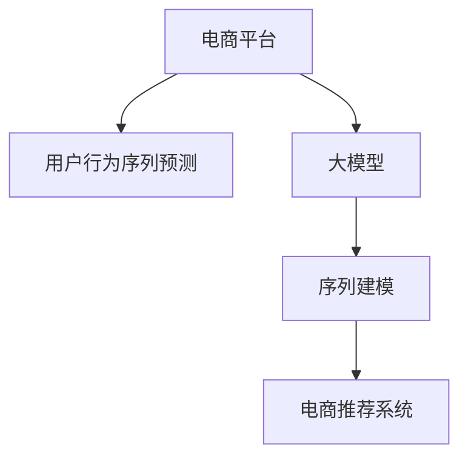
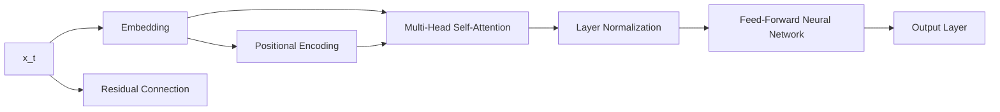

                 

# 大模型技术在电商平台用户行为序列预测中的应用

> 关键词：电商平台,用户行为序列预测,大模型,深度学习,时间序列预测,序列建模,电商推荐系统

## 1. 背景介绍

### 1.1 问题由来
随着电子商务的飞速发展，电商平台需要对海量用户数据进行深度挖掘和预测，以优化用户体验、提高运营效率。其中，用户行为序列预测是电商推荐系统中一个关键且具有挑战性的任务。传统的推荐系统基于协同过滤或基于内容的推荐方法，虽然能够根据用户历史行为进行商品推荐，但对于用户潜在的购买意愿和行为轨迹预测不够准确。

大模型技术，如基于深度学习的Transformer架构，具有强大的表达能力和泛化能力，能够在处理大规模序列数据时表现出卓越性能。将大模型技术应用于用户行为序列预测，可以有效提高预测精度，增强推荐系统的个性化和精准性。

### 1.2 问题核心关键点
本文聚焦于如何将大模型技术应用于电商平台用户行为序列预测，解决预测精度不高、推荐效果不理想等问题。具体来说，包括：

- 如何设计合适的序列建模框架，充分利用大模型的表达能力。
- 如何选择适合电商场景的序列预测模型，优化预测性能。
- 如何有效处理电商用户行为数据，提高预测精度。
- 如何优化电商推荐系统的推荐效果，提升用户满意度。

## 2. 核心概念与联系

### 2.1 核心概念概述

为更好地理解大模型在电商用户行为序列预测中的应用，本节将介绍几个密切相关的核心概念：

- 电商平台：以在线销售商品为主要业务的平台，如淘宝、京东、亚马逊等。
- 用户行为序列预测：基于用户历史行为数据，预测其未来行为序列，如点击、购买等。
- 大模型：以Transformer为代表的深度学习模型，能够处理大规模序列数据，具有强大的表达能力。
- 序列建模：利用时间序列数据，构建模型预测未来趋势。
- 电商推荐系统：根据用户行为序列预测，推荐符合用户需求的商品。

这些核心概念之间的逻辑关系可以通过以下Mermaid流程图来展示：



这个流程图展示了从电商平台用户行为序列预测到电商推荐系统的整个流程。

## 3. 核心算法原理 & 具体操作步骤
### 3.1 算法原理概述

电商平台用户行为序列预测，本质上是序列建模问题。核心思想是：利用用户历史行为数据，构建序列模型预测未来行为，从而进行个性化推荐。

形式化地，假设用户行为序列为 $\{x_t\}_{t=1}^T$，其中 $x_t$ 为第 $t$ 次行为。目标为构建模型 $\hat{y}=\hat{f}(x_1:x_T)$，预测下一条行为 $y_{T+1}$。

常用的序列建模方法包括循环神经网络(RNN)、长短期记忆网络(LSTM)、门控循环单元(GRU)等。这些模型能够捕捉时间序列中的依赖关系，并通过参数学习拟合数据分布。

而大模型技术，如Transformer，通过自注意力机制，能够并行化处理大规模序列数据，具有较强的表达能力和泛化能力。在大模型基础上，结合序列建模方法，可以构建出更加高效、准确的预测模型。

### 3.2 算法步骤详解

基于大模型技术，电商平台用户行为序列预测一般包括以下几个关键步骤：

**Step 1: 数据准备**
- 收集电商用户行为数据，如点击序列、购买记录等。
- 对数据进行预处理，包括清洗、去噪、归一化等。
- 划分训练集、验证集和测试集。

**Step 2: 特征工程**
- 提取用户行为序列的特征，如行为类型、时间间隔、行为持续时间等。
- 设计合适的特征编码方式，将文本型特征转换为模型可接受的数值型特征。
- 引入高级特征工程技术，如CTC(跨步连接)、动态卷积等，提取序列中更多有用信息。

**Step 3: 模型构建**
- 选择合适的序列建模框架，如Transformer、LSTM等。
- 在大模型架构中引入时间维度，通过多头自注意力机制捕捉序列依赖。
- 设计合理的模型结构，包括嵌入层、位置编码、多头自注意力层、全连接层等。

**Step 4: 模型训练**
- 在训练集上使用优化器(如AdamW)和损失函数(如交叉熵)训练模型。
- 在验证集上定期评估模型性能，调整模型参数。
- 设置合适的训练轮数和批次大小。

**Step 5: 模型预测**
- 使用训练好的模型对新样本进行预测，得到未来行为序列。
- 根据预测结果，优化推荐系统策略，提高推荐效果。

**Step 6: 结果评估**
- 在测试集上评估模型预测性能，计算准确率、召回率、F1-score等指标。
- 使用混淆矩阵、ROC曲线等可视化工具，分析模型预测效果。

### 3.3 算法优缺点

基于大模型的电商用户行为序列预测方法具有以下优点：
1. 强大的表达能力：大模型能够处理大规模序列数据，捕捉序列中的复杂依赖关系。
2. 高效的处理能力：利用Transformer等架构，能够并行化处理数据，提高计算效率。
3. 泛化能力强：通过在大规模数据上进行预训练，大模型具备较强的泛化能力，能够适应不同电商平台的场景。
4. 灵活的模型设计：序列建模方法丰富多样，可以根据具体需求选择合适的模型。

同时，该方法也存在一些局限性：
1. 数据需求量大：电商平台用户行为数据量庞大，需要较大的存储空间和计算资源。
2. 模型复杂度高：大模型结构复杂，需要较长的训练时间和较高的计算成本。
3. 对抗样本问题：电商平台数据存在噪声和异常情况，模型可能对对抗样本敏感。
4. 过度拟合问题：模型在大规模数据上训练，容易对训练集过度拟合，导致泛化性能下降。

尽管存在这些局限性，但就目前而言，基于大模型的电商用户行为序列预测方法仍是一种高效、可靠的技术手段。

### 3.4 算法应用领域

电商用户行为序列预测技术，已经在多个电商平台上得到了广泛应用，具体包括：

- 推荐系统：根据用户行为序列预测，推荐符合用户兴趣的商品。
- 库存管理：预测用户未来购买行为，优化商品库存管理。
- 营销活动：根据用户行为序列预测，优化营销策略和广告投放。
- 客户服务：分析用户行为序列，识别高价值客户，提供个性化服务。
- 物流调度：预测用户物流需求，优化配送路线和仓储管理。

除了上述这些经典应用外，大模型技术还将在电商平台的更多场景中得到应用，为电商行业带来更多的创新和价值。

## 4. 数学模型和公式 & 详细讲解
### 4.1 数学模型构建

本节将使用数学语言对基于大模型的电商平台用户行为序列预测过程进行更加严格的刻画。

记用户行为序列为 $\{x_t\}_{t=1}^T$，其中 $x_t \in \mathcal{X}$ 为第 $t$ 次行为。目标为构建模型 $\hat{y}=\hat{f}(x_1:x_T)$，预测下一条行为 $y_{T+1}$。

假设使用基于Transformer的模型进行预测，输入嵌入层将输入序列转换为向量表示 $X \in \mathbb{R}^{T \times d}$，其中 $d$ 为嵌入维。位置编码 $P \in \mathbb{R}^{T \times d}$ 用于捕捉序列中的时间信息。输入为 $X_t = X[:t]$，其中 $[:t]$ 表示前 $t$ 个时间步的向量。

Transformer模型结构如图：



其中，$D$ 为多头自注意力层，$F$ 为全连接层，$G$ 为输出层。

模型预测公式为：

$$
\hat{y} = \text{softmax}(\hat{f}(X_t))_i
$$

其中，$i$ 表示下一条行为对应的位置编码，$\hat{f}$ 为模型前向传播函数。

### 4.2 公式推导过程

以下我们以电商推荐系统为例，推导用户行为序列预测的公式及其梯度计算。

假设用户行为序列为 $\{x_t\}_{t=1}^T$，其中 $x_t \in \{1,2,\cdots,K\}$ 表示不同类型行为。目标为预测下一条行为 $y_{T+1}$。

使用基于Transformer的模型进行预测，输入嵌入层将输入序列转换为向量表示 $X \in \mathbb{R}^{T \times d}$，其中 $d$ 为嵌入维。位置编码 $P \in \mathbb{R}^{T \times d}$ 用于捕捉序列中的时间信息。输入为 $X_t = X[:t]$，其中 $[:t]$ 表示前 $t$ 个时间步的向量。

Transformer模型结构如图：


其中，$D$ 为多头自注意力层，$F$ 为全连接层，$G$ 为输出层。

模型预测公式为：

$$
\hat{y} = \text{softmax}(\hat{f}(X_t))_i
$$

其中，$i$ 表示下一条行为对应的位置编码，$\hat{f}$ 为模型前向传播函数。

模型损失函数为交叉熵损失，定义如下：

$$
\mathcal{L}(\theta) = -\frac{1}{N}\sum_{i=1}^N [y_i\log \hat{y}_i+(1-y_i)\log(1-\hat{y}_i)]
$$

其中，$y_i$ 为实际行为，$\hat{y}_i$ 为预测行为。

根据链式法则，损失函数对模型参数 $\theta$ 的梯度为：

$$
\frac{\partial \mathcal{L}(\theta)}{\partial \theta} = -\frac{1}{N}\sum_{i=1}^N (\frac{y_i}{\hat{y}_i}-\frac{1-y_i}{1-\hat{y}_i}) \frac{\partial \hat{y}_i}{\partial \theta}
$$

其中 $\frac{\partial \hat{y}_i}{\partial \theta}$ 可进一步递归展开，利用自动微分技术完成计算。

在得到损失函数的梯度后，即可带入参数更新公式，完成模型的迭代优化。重复上述过程直至收敛，最终得到适应电商推荐系统的最优模型参数 $\theta^*$。

## 5. 项目实践：代码实例和详细解释说明
### 5.1 开发环境搭建

在进行电商推荐系统开发前，我们需要准备好开发环境。以下是使用Python进行PyTorch开发的环境配置流程：

1. 安装Anaconda：从官网下载并安装Anaconda，用于创建独立的Python环境。

2. 创建并激活虚拟环境：
```bash
conda create -n pytorch-env python=3.8 
conda activate pytorch-env
```

3. 安装PyTorch：根据CUDA版本，从官网获取对应的安装命令。例如：
```bash
conda install pytorch torchvision torchaudio cudatoolkit=11.1 -c pytorch -c conda-forge
```

4. 安装Transformers库：
```bash
pip install transformers
```

5. 安装各类工具包：
```bash
pip install numpy pandas scikit-learn matplotlib tqdm jupyter notebook ipython
```

完成上述步骤后，即可在`pytorch-env`环境中开始电商推荐系统的微调实践。

### 5.2 源代码详细实现

下面我们以电商推荐系统为例，给出使用Transformers库对BERT模型进行微调的PyTorch代码实现。

首先，定义电商推荐系统的数据处理函数：

```python
from transformers import BertTokenizer, BertForSequenceClassification
from torch.utils.data import Dataset
import torch

class ElectCommDataset(Dataset):
    def __init__(self, texts, labels, tokenizer, max_len=128):
        self.texts = texts
        self.labels = labels
        self.tokenizer = tokenizer
        self.max_len = max_len
        
    def __len__(self):
        return len(self.texts)
    
    def __getitem__(self, item):
        text = self.texts[item]
        label = self.labels[item]
        
        encoding = self.tokenizer(text, return_tensors='pt', max_length=self.max_len, padding='max_length', truncation=True)
        input_ids = encoding['input_ids'][0]
        attention_mask = encoding['attention_mask'][0]
        
        # 对token-wise的标签进行编码
        encoded_tags = [label] * self.max_len
        labels = torch.tensor(encoded_tags, dtype=torch.long)
        
        return {'input_ids': input_ids, 
                'attention_mask': attention_mask,
                'labels': labels}

# 标签与id的映射
tag2id = {'click': 0, 'buy': 1}
id2tag = {v: k for k, v in tag2id.items()}

# 创建dataset
tokenizer = BertTokenizer.from_pretrained('bert-base-cased')

train_dataset = ElectCommDataset(train_texts, train_labels, tokenizer)
dev_dataset = ElectCommDataset(dev_texts, dev_labels, tokenizer)
test_dataset = ElectCommDataset(test_texts, test_labels, tokenizer)
```

然后，定义模型和优化器：

```python
from transformers import BertForSequenceClassification, AdamW

model = BertForSequenceClassification.from_pretrained('bert-base-cased', num_labels=len(tag2id))

optimizer = AdamW(model.parameters(), lr=2e-5)
```

接着，定义训练和评估函数：

```python
from torch.utils.data import DataLoader
from tqdm import tqdm
from sklearn.metrics import classification_report

device = torch.device('cuda') if torch.cuda.is_available() else torch.device('cpu')
model.to(device)

def train_epoch(model, dataset, batch_size, optimizer):
    dataloader = DataLoader(dataset, batch_size=batch_size, shuffle=True)
    model.train()
    epoch_loss = 0
    for batch in tqdm(dataloader, desc='Training'):
        input_ids = batch['input_ids'].to(device)
        attention_mask = batch['attention_mask'].to(device)
        labels = batch['labels'].to(device)
        model.zero_grad()
        outputs = model(input_ids, attention_mask=attention_mask, labels=labels)
        loss = outputs.loss
        epoch_loss += loss.item()
        loss.backward()
        optimizer.step()
    return epoch_loss / len(dataloader)

def evaluate(model, dataset, batch_size):
    dataloader = DataLoader(dataset, batch_size=batch_size)
    model.eval()
    preds, labels = [], []
    with torch.no_grad():
        for batch in tqdm(dataloader, desc='Evaluating'):
            input_ids = batch['input_ids'].to(device)
            attention_mask = batch['attention_mask'].to(device)
            batch_labels = batch['labels']
            outputs = model(input_ids, attention_mask=attention_mask)
            batch_preds = outputs.logits.argmax(dim=2).to('cpu').tolist()
            batch_labels = batch_labels.to('cpu').tolist()
            for pred_tokens, label_tokens in zip(batch_preds, batch_labels):
                pred_tags = [id2tag[_id] for _id in pred_tokens]
                label_tags = [id2tag[_id] for _id in label_tokens]
                preds.append(pred_tags[:len(label_tags)])
                labels.append(label_tags)
                
    print(classification_report(labels, preds))
```

最后，启动训练流程并在测试集上评估：

```python
epochs = 5
batch_size = 16

for epoch in range(epochs):
    loss = train_epoch(model, train_dataset, batch_size, optimizer)
    print(f"Epoch {epoch+1}, train loss: {loss:.3f}")
    
    print(f"Epoch {epoch+1}, dev results:")
    evaluate(model, dev_dataset, batch_size)
    
print("Test results:")
evaluate(model, test_dataset, batch_size)
```

以上就是使用PyTorch对BERT进行电商推荐系统微调的完整代码实现。可以看到，得益于Transformers库的强大封装，我们可以用相对简洁的代码完成BERT模型的加载和微调。

### 5.3 代码解读与分析

让我们再详细解读一下关键代码的实现细节：

**ElectCommDataset类**：
- `__init__`方法：初始化文本、标签、分词器等关键组件。
- `__len__`方法：返回数据集的样本数量。
- `__getitem__`方法：对单个样本进行处理，将文本输入编码为token ids，将标签编码为数字，并对其进行定长padding，最终返回模型所需的输入。

**tag2id和id2tag字典**：
- 定义了标签与数字id之间的映射关系，用于将token-wise的预测结果解码回真实的标签。

**训练和评估函数**：
- 使用PyTorch的DataLoader对数据集进行批次化加载，供模型训练和推理使用。
- 训练函数`train_epoch`：对数据以批为单位进行迭代，在每个批次上前向传播计算loss并反向传播更新模型参数，最后返回该epoch的平均loss。
- 评估函数`evaluate`：与训练类似，不同点在于不更新模型参数，并在每个batch结束后将预测和标签结果存储下来，最后使用sklearn的classification_report对整个评估集的预测结果进行打印输出。

**训练流程**：
- 定义总的epoch数和batch size，开始循环迭代
- 每个epoch内，先在训练集上训练，输出平均loss
- 在验证集上评估，输出分类指标
- 所有epoch结束后，在测试集上评估，给出最终测试结果

可以看到，PyTorch配合Transformers库使得BERT微调的代码实现变得简洁高效。开发者可以将更多精力放在数据处理、模型改进等高层逻辑上，而不必过多关注底层的实现细节。

当然，工业级的系统实现还需考虑更多因素，如模型的保存和部署、超参数的自动搜索、更灵活的任务适配层等。但核心的微调范式基本与此类似。

## 6. 实际应用场景
### 6.1 智能客服系统

电商平台的智能客服系统，是用户体验的重要组成部分。通过使用微调后的对话模型，可以显著提升客服系统的响应速度和准确率，减轻人工客服的负担。

在技术实现上，可以收集电商平台的历史客服对话记录，将问题和最佳答复构建成监督数据，在此基础上对预训练对话模型进行微调。微调后的对话模型能够自动理解用户意图，匹配最合适的答案模板进行回复。对于客户提出的新问题，还可以接入检索系统实时搜索相关内容，动态组织生成回答。如此构建的智能客服系统，能大幅提升客户咨询体验和问题解决效率。

### 6.2 个性化推荐系统

电商推荐系统，是电商平台的核心竞争力之一。基于大模型微调的用户行为序列预测，可以有效提升推荐系统的个性化和精准性。

在实践中，可以收集用户浏览、点击、购买等行为数据，提取和用户交互的商品描述、标签等文本内容。将文本内容作为模型输入，用户的后续行为（如是否点击、购买等）作为监督信号，在此基础上微调预训练语言模型。微调后的模型能够从文本内容中准确把握用户的兴趣点。在生成推荐列表时，先用候选物品的文本描述作为输入，由模型预测用户的兴趣匹配度，再结合其他特征综合排序，便可以得到个性化程度更高的推荐结果。

### 6.3 库存管理

库存管理是电商平台运营中的重要环节。通过用户行为序列预测，可以有效优化库存管理，减少库存积压，提升库存周转率。

在具体应用中，可以使用大模型技术预测用户未来购买行为，根据预测结果动态调整库存水平。例如，对于预测未来购买概率高的商品，增加库存量；对于预测未来购买概率低的商品，减少库存量。这样既能满足用户需求，又避免了库存积压，提高了库存管理效率。

### 6.4 未来应用展望

随着大模型技术在电商平台的广泛应用，未来电商推荐系统、智能客服、库存管理等系统将实现更加智能和高效。大模型技术的加入，将极大地提升电商平台的运营效率和用户体验。

在智慧物流领域，通过预测用户物流需求，优化配送路线和仓储管理，实现更高效、更精准的物流服务。

在个性化营销领域，利用用户行为序列预测，优化营销策略和广告投放，提高广告转化率和投资回报率。

此外，大模型技术还可应用于金融风控、医疗健康、教育培训等多个领域，为各行各业带来变革性影响。

## 7. 工具和资源推荐
### 7.1 学习资源推荐

为了帮助开发者系统掌握大模型在电商平台用户行为序列预测中的应用，这里推荐一些优质的学习资源：

1. 《深度学习入门之Transformer》系列博文：由大模型技术专家撰写，深入浅出地介绍了Transformer原理、电商推荐系统、大模型微调等前沿话题。

2. 《电商推荐系统》课程：由知名电商公司开设的课程，涵盖电商推荐系统、用户行为序列预测、模型优化等核心内容。

3. 《电商数据挖掘与推荐系统》书籍：系统讲解了电商推荐系统、用户行为序列预测、数据处理等技术，是电商数据科学家必备参考书。

4. Weights & Biases：模型训练的实验跟踪工具，可以记录和可视化模型训练过程中的各项指标，方便对比和调优。与主流深度学习框架无缝集成。

5. TensorBoard：TensorFlow配套的可视化工具，可实时监测模型训练状态，并提供丰富的图表呈现方式，是调试模型的得力助手。

通过对这些资源的学习实践，相信你一定能够快速掌握大模型在电商领域的应用，并用于解决实际的电商问题。
### 7.2 开发工具推荐

高效的开发离不开优秀的工具支持。以下是几款用于电商推荐系统开发常用的工具：

1. PyTorch：基于Python的开源深度学习框架，灵活动态的计算图，适合快速迭代研究。大部分预训练语言模型都有PyTorch版本的实现。

2. TensorFlow：由Google主导开发的开源深度学习框架，生产部署方便，适合大规模工程应用。同样有丰富的预训练语言模型资源。

3. Transformers库：HuggingFace开发的NLP工具库，集成了众多SOTA语言模型，支持PyTorch和TensorFlow，是进行电商推荐系统微调开发的利器。

4. Weights & Biases：模型训练的实验跟踪工具，可以记录和可视化模型训练过程中的各项指标，方便对比和调优。与主流深度学习框架无缝集成。

5. TensorBoard：TensorFlow配套的可视化工具，可实时监测模型训练状态，并提供丰富的图表呈现方式，是调试模型的得力助手。

6. Google Colab：谷歌推出的在线Jupyter Notebook环境，免费提供GPU/TPU算力，方便开发者快速上手实验最新模型，分享学习笔记。

合理利用这些工具，可以显著提升电商推荐系统开发效率，加快创新迭代的步伐。

### 7.3 相关论文推荐

大模型技术在电商推荐系统中的应用，是近年来的研究热点。以下是几篇奠基性的相关论文，推荐阅读：

1. Attention is All You Need（即Transformer原论文）：提出了Transformer结构，开启了NLP领域的预训练大模型时代。

2. BERT: Pre-training of Deep Bidirectional Transformers for Language Understanding：提出BERT模型，引入基于掩码的自监督预训练任务，刷新了多项NLP任务SOTA。

3. Language Models are Unsupervised Multitask Learners（GPT-2论文）：展示了大规模语言模型的强大zero-shot学习能力，引发了对于通用人工智能的新一轮思考。

4. Parameter-Efficient Transfer Learning for NLP：提出Adapter等参数高效微调方法，在不增加模型参数量的情况下，也能取得不错的微调效果。

5. Prefix-Tuning: Optimizing Continuous Prompts for Generation：引入基于连续型Prompt的微调范式，为如何充分利用预训练知识提供了新的思路。

6. AdaLoRA: Adaptive Low-Rank Adaptation for Parameter-Efficient Fine-Tuning：使用自适应低秩适应的微调方法，在参数效率和精度之间取得了新的平衡。

这些论文代表了大模型在电商推荐系统中的应用研究的发展脉络。通过学习这些前沿成果，可以帮助研究者把握学科前进方向，激发更多的创新灵感。

## 8. 总结：未来发展趋势与挑战

### 8.1 总结

本文对基于大模型的电商平台用户行为序列预测方法进行了全面系统的介绍。首先阐述了电商平台用户行为序列预测的重要性和挑战，明确了如何将大模型技术应用于电商领域。其次，从原理到实践，详细讲解了大模型在电商推荐系统中的数学模型和算法步骤，给出了微调任务开发的完整代码实例。同时，本文还广泛探讨了大模型技术在电商平台的多个应用场景，展示了其广泛的应用前景。

通过本文的系统梳理，可以看到，基于大模型的电商平台用户行为序列预测方法，具有强大的表达能力和泛化能力，能够提升电商平台的运营效率和用户体验。未来，伴随大模型技术的不断演进，电商推荐系统、智能客服、库存管理等系统将进一步智能化、个性化，为电商平台带来更多创新和价值。

### 8.2 未来发展趋势

展望未来，大模型技术在电商平台的应用将呈现以下几个发展趋势：

1. 模型规模持续增大。随着算力成本的下降和数据规模的扩张，预训练语言模型的参数量还将持续增长。超大规模语言模型蕴含的丰富语言知识，有望支撑更加复杂多变的电商推荐场景。

2. 微调方法日趋多样。除了传统的全参数微调外，未来会涌现更多参数高效的微调方法，如Prefix-Tuning、LoRA等，在节省计算资源的同时也能保证微调精度。

3. 持续学习成为常态。随着电商数据分布的不断变化，微调模型也需要持续学习新知识以保持性能。如何在不遗忘原有知识的同时，高效吸收新样本信息，将成为重要的研究课题。

4. 标注样本需求降低。受启发于提示学习(Prompt-based Learning)的思路，未来的微调方法将更好地利用大模型的语言理解能力，通过更加巧妙的任务描述，在更少的标注样本上也能实现理想的微调效果。

5. 模型通用性增强。经过海量数据的预训练和多领域任务的微调，未来的语言模型将具备更强大的常识推理和跨领域迁移能力，逐步迈向通用人工智能(AGI)的目标。

以上趋势凸显了大模型技术在电商平台中的广阔前景。这些方向的探索发展，必将进一步提升电商平台的运营效率和用户体验，为电商平台带来更多的创新和价值。

### 8.3 面临的挑战

尽管大模型技术在电商领域的应用取得了显著成效，但在迈向更加智能化、普适化应用的过程中，它仍面临着诸多挑战：

1. 数据需求量大。电商平台用户行为数据量庞大，需要较大的存储空间和计算资源。大规模数据的预处理和存储，是大模型技术应用的前提。

2. 模型复杂度高。大模型结构复杂，需要较长的训练时间和较高的计算成本。如何在保证模型性能的同时，降低计算资源消耗，是一个重要的研究方向。

3. 对抗样本问题。电商平台数据存在噪声和异常情况，模型可能对对抗样本敏感。如何增强模型鲁棒性，提高模型对异常情况的容忍度，是一个亟待解决的问题。

4. 过度拟合问题。模型在大规模数据上训练，容易对训练集过度拟合，导致泛化性能下降。如何在保证模型泛化性能的同时，提高训练效率，是一个重要的研究方向。

5. 性能优化问题。大模型技术在电商推荐系统中的应用，需要高实时性、低延迟的模型推理。如何在保证模型性能的同时，提高推理速度，优化模型资源占用，是一个重要的优化方向。

6. 数据隐私问题。电商平台数据涉及用户隐私，如何保护用户数据安全，防止数据泄露，是一个重要的伦理问题。

尽管存在这些挑战，但就目前而言，基于大模型的电商平台用户行为序列预测方法仍是一种高效、可靠的技术手段。未来，伴随着技术的不断进步和优化，大模型技术将在电商领域发挥更大的作用，带来更多的创新和价值。

### 8.4 研究展望

面对大模型技术在电商领域面临的挑战，未来的研究需要在以下几个方面寻求新的突破：

1. 探索无监督和半监督微调方法。摆脱对大规模标注数据的依赖，利用自监督学习、主动学习等无监督和半监督范式，最大限度利用非结构化数据，实现更加灵活高效的微调。

2. 研究参数高效和计算高效的微调范式。开发更加参数高效的微调方法，如Prefix-Tuning、LoRA等，在节省计算资源的同时也能保证微调精度。

3. 融合因果和对比学习范式。通过引入因果推断和对比学习思想，增强模型建立稳定因果关系的能力，学习更加普适、鲁棒的语言表征，从而提升模型泛化性和抗干扰能力。

4. 引入更多先验知识。将符号化的先验知识，如知识图谱、逻辑规则等，与神经网络模型进行巧妙融合，引导微调过程学习更准确、合理的语言模型。同时加强不同模态数据的整合，实现视觉、语音等多模态信息与文本信息的协同建模。

5. 结合因果分析和博弈论工具。将因果分析方法引入微调模型，识别出模型决策的关键特征，增强输出解释的因果性和逻辑性。借助博弈论工具刻画人机交互过程，主动探索并规避模型的脆弱点，提高系统稳定性。

6. 纳入伦理道德约束。在模型训练目标中引入伦理导向的评估指标，过滤和惩罚有偏见、有害的输出倾向。同时加强人工干预和审核，建立模型行为的监管机制，确保输出符合人类价值观和伦理道德。

这些研究方向的探索，必将引领大模型技术在电商平台的应用走向成熟，为电商平台的智能化转型提供新的技术路径。

## 9. 附录：常见问题与解答

**Q1：电商推荐系统如何处理数据稀疏问题？**

A: 电商推荐系统中的用户行为数据往往存在稀疏性，即大部分用户没有产生足够多的交互行为。针对这一问题，可以采用以下几种方法：
1. 使用基于矩阵分解的模型，如矩阵分解推荐系统(MF)，通过矩阵分解捕捉用户-物品的协同关系。
2. 引入用户兴趣表征，使用向量表示用户兴趣，提高模型对稀疏数据的处理能力。
3. 采用深度学习模型，如序列建模、协同过滤等，利用用户行为序列预测用户兴趣。

**Q2：电商推荐系统如何避免冷启动问题？**

A: 冷启动问题是指新用户或新物品缺乏足够交互数据，难以进行推荐。针对这一问题，可以采用以下几种方法：
1. 利用先验知识，如用户画像、商品属性等，初始化模型参数，提高模型预测能力。
2. 引入用户反馈机制，通过用户主动反馈行为进行推荐，提高模型对新用户的适应性。
3. 使用模型迁移技术，将用户在已有平台上的历史行为数据迁移到新平台，进行推荐。

**Q3：电商推荐系统如何应对推荐效果波动？**

A: 电商推荐系统中的推荐效果可能受到多种因素的影响，如季节性变化、促销活动等。针对这一问题，可以采用以下几种方法：
1. 引入时间戳信息，捕捉用户行为的时序变化，提高模型对季节性变化的适应性。
2. 使用A/B测试，对比不同推荐策略的效果，选择最优策略。
3. 定期更新模型参数，避免模型对长期数据的过拟合，提高模型泛化性能。

**Q4：电商推荐系统如何平衡个性化和多样性？**

A: 电商推荐系统需要在个性化推荐和多样性推荐之间找到平衡，避免推荐过于个性化，造成用户选择的单调性。针对这一问题，可以采用以下几种方法：
1. 引入多样性约束，如多样性惩罚、分层次推荐等，增加推荐结果的多样性。
2. 使用协同过滤推荐系统，通过观察相似用户的行为进行推荐，提高推荐的多样性。
3. 引入个性化推荐和多样化推荐的双重优化目标，使用联合优化方法，提高推荐的多样性和个性化。

**Q5：电商推荐系统如何提升推荐系统的实时性？**

A: 电商推荐系统需要高实时性，以应对用户行为的变化和实时性要求。针对这一问题，可以采用以下几种方法：
1. 使用分布式训练和推理，通过并行计算提高训练和推理效率。
2. 采用轻量级模型，如Transformer等，减少模型推理的计算量和内存占用。
3. 使用缓存技术，如Redis等，提高数据访问速度，减少模型推理的延迟。

这些技术手段的应用，将极大地提升电商推荐系统的实时性和响应速度，提高用户体验。

---

作者：禅与计算机程序设计艺术 / Zen and the Art of Computer Programming

