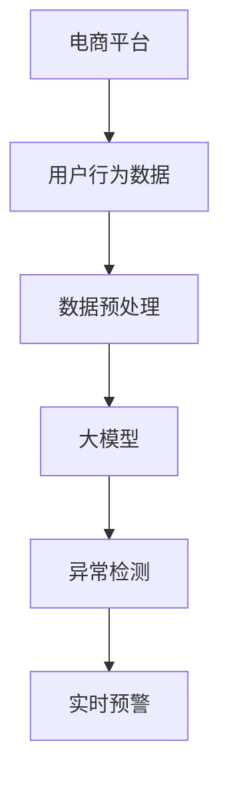

                 

# 大模型技术在电商平台用户行为异常检测中的应用

> 关键词：大模型技术,用户行为异常检测,电商平台,异常行为识别,深度学习,自然语言处理

## 1. 背景介绍

### 1.1 问题由来
电商平台（E-Commerce Platform）作为现代社会的交易重要平台，用户在平台上的行为数据在企业决策中扮演着越来越重要的角色。电商平台的健康运营离不开对用户行为数据的深入分析与异常检测。异常行为检测不仅是保证交易安全的重要手段，也是提升用户体验和业务效率的关键。

近年来，随着深度学习（Deep Learning）和大模型技术（Big Model Technology）的发展，自然语言处理（NLP）在电商平台用户行为异常检测中得到了广泛应用。在大模型的帮助下，电商平台的异常行为检测技术实现了从浅层特征学习向深度语义理解、从离线统计分析向实时异常检测的转变，大幅提升了检测的准确性和鲁棒性。

### 1.2 问题核心关键点
电商平台用户行为异常检测的核心关键点包括：
- 数据处理与特征提取：如何从原始的电商数据中提取有意义的特征，并建立有效的特征空间。
- 异常检测算法：基于大模型技术，设计适用于电商平台的异常行为识别算法。
- 模型训练与调优：利用电商平台标注数据，训练和调优检测模型。
- 模型应用与优化：将训练好的模型应用于实际电商平台的实时数据，进行异常检测和实时预警。

本文将深入探讨大模型技术在电商平台用户行为异常检测中的应用，从数据预处理、模型训练、模型应用等环节详细介绍异常检测的关键流程和算法优化策略。

## 2. 核心概念与联系

### 2.1 核心概念概述

为更好地理解大模型技术在电商平台用户行为异常检测中的应用，本节将介绍几个密切相关的核心概念：

- 大模型技术（Big Model Technology）：基于大模型（如BERT、GPT、T5等）的深度学习模型，在电商平台上用于处理和理解用户行为数据。大模型拥有海量参数和丰富语义，能够有效捕捉数据中的复杂模式。

- 用户行为数据（User Behavior Data）：用户在电商平台上的浏览、点击、购买、评价等操作数据。通过用户行为数据的分析，电商平台可以了解用户偏好、识别行为异常，从而优化用户体验和提升运营效率。

- 异常行为检测（Anomaly Detection）：通过算法识别和分类用户行为数据中的异常行为，如欺诈行为、恶意行为、异常点击等，帮助电商平台防范风险和提升服务质量。

- 电商交易风险（E-commerce Transaction Risk）：电商平台上用户行为异常可能引发的交易风险，如欺诈交易、恶意操作等。通过异常检测技术，电商平台可以有效降低交易风险，保障用户和平台安全。

- 实时预警（Real-time Alert）：在检测到异常行为后，立即生成预警信号，并通过通知系统迅速传递给电商平台管理者，进行快速响应和处理。

这些核心概念之间的逻辑关系可以通过以下Mermaid流程图来展示：



这个流程图展示了大模型技术在电商平台用户行为异常检测中的核心流程：
1. 电商平台的业务数据首先经过预处理，形成输入数据。
2. 预处理后的数据被输入到大模型中，进行深度语义理解。
3. 大模型分析数据并识别出异常行为。
4. 识别出的异常行为触发实时预警，及时通知电商平台管理者。

## 3. 核心算法原理 & 具体操作步骤
### 3.1 算法原理概述

电商平台用户行为异常检测，本质上是利用深度学习和大模型技术，在电商数据中识别出异常行为的模式。该过程分为以下步骤：

1. **数据预处理**：清洗原始用户行为数据，提取有意义的特征，构建有效的特征空间。
2. **模型训练**：利用电商平台标注数据，在大模型上训练异常检测模型。
3. **异常检测**：将实时电商数据输入训练好的模型，识别出异常行为。
4. **实时预警**：根据异常检测结果，生成实时预警信号，传递给电商平台管理者。

异常检测算法包括但不限于以下几种：
- 基于规则的异常检测：利用预定义的规则模板，匹配电商用户行为数据，识别出符合规则的异常行为。
- 基于统计的异常检测：通过统计分析用户行为数据的分布，识别出偏离正常行为模式的异常数据。
- 基于聚类的异常检测：通过聚类算法（如K-means、DBSCAN等），将电商用户行为数据划分到不同的簇中，识别出偏离主簇的异常行为。
- 基于深度学习的异常检测：利用大模型学习电商用户行为数据的语义和模式，自动识别出异常行为。

### 3.2 算法步骤详解

#### 数据预处理
电商用户行为数据通常包含多种类型，包括文本数据（如商品描述、用户评价）、数值数据（如点击次数、购买金额）和时序数据（如行为时间戳）。为了高效地在大模型上进行异常检测，需要对数据进行如下预处理：

1. **数据清洗**：去除噪音数据和无效数据，确保数据的完整性和一致性。
2. **特征提取**：将原始数据转化为数值型特征，方便在大模型中进行计算和分析。常用的特征提取方法包括词向量嵌入（如Word2Vec、GloVe）、时序特征提取（如滑动窗口、移动平均）等。
3. **数据归一化**：对特征值进行归一化处理，使其符合模型训练的要求。常用的归一化方法包括最大最小归一化、Z-score归一化等。
4. **数据增强**：通过数据增强技术，扩充训练集的多样性，提升模型的泛化能力。常用的数据增强方法包括数据重采样、数据扩充（如随机噪声、数据合成）等。

#### 模型训练
在大模型上进行异常检测训练时，通常需要如下步骤：

1. **选择模型**：选择适合电商数据异常检测任务的深度学习模型，如BERT、GPT、T5等。
2. **准备数据**：将预处理后的电商数据划分为训练集、验证集和测试集。
3. **设计损失函数**：设计适用于电商数据异常检测的损失函数，常用的损失函数包括交叉熵损失、对数损失、均方误差损失等。
4. **训练模型**：在电商平台的标注数据集上，利用大模型训练异常检测模型。常用的优化算法包括SGD、AdamW等。
5. **调优模型**：通过验证集对模型进行调优，调整超参数（如学习率、批大小），直到模型在测试集上达到最佳效果。

#### 异常检测
在训练好异常检测模型后，可以将其应用于实时电商数据，进行异常行为的检测。具体步骤包括：

1. **输入数据**：将实时电商数据输入训练好的模型，生成异常行为检测结果。
2. **识别异常**：根据模型输出结果，识别出异常行为数据。通常使用阈值分类方法，将检测结果分为异常和正常两类。
3. **生成预警**：根据异常检测结果，生成实时预警信号，传递给电商平台管理者。

#### 实时预警
在检测到异常行为后，电商平台需要进行及时响应和处理。具体步骤包括：

1. **通知管理者**：通过通知系统（如邮件、短信、告警系统），迅速传递异常行为预警信息。
2. **人工审核**：电商平台管理者对异常检测结果进行人工审核，确认异常行为的性质和处理方式。
3. **自动响应**：根据异常行为的严重程度，自动执行相应的处理措施，如冻结账户、关闭订单等。

### 3.3 算法优缺点

大模型技术在电商平台用户行为异常检测中具有以下优点：
- 语义理解能力强：大模型能够理解电商数据中的复杂语义，识别出更细微的异常行为模式。
- 泛化能力强：大模型拥有海量参数和丰富语义，能够有效应对不同场景下的异常检测任务。
- 实时预警高效：大模型能够实时处理电商数据，快速生成异常预警，缩短响应时间。

同时，该方法也存在一定的局限性：
- 数据依赖性强：异常检测的效果很大程度上依赖于电商平台的标注数据质量，标注数据不足可能导致检测效果不佳。
- 训练复杂度高：大模型训练需要较大的计算资源和较长的训练时间，存在一定的性能瓶颈。
- 模型解释性差：大模型的决策过程较为复杂，难以进行详细的解释和调试。
- 偏见问题：大模型可能学习到数据中的偏见和噪音，导致异常检测结果存在偏差。

尽管存在这些局限性，但大模型技术在电商平台用户行为异常检测中的应用前景依然广阔。未来相关研究的重点在于如何进一步降低数据依赖，提高模型鲁棒性和可解释性，同时兼顾算法效率和准确性。

### 3.4 算法应用领域

电商平台用户行为异常检测的应用领域广泛，涵盖了以下几个方面：

- 交易风险管理：通过异常检测技术，识别出电商平台上的欺诈交易、恶意行为，有效降低交易风险。
- 用户体验优化：通过分析用户行为数据，识别出异常行为，优化用户界面和交互体验，提升用户满意度。
- 业务运营分析：通过异常检测和实时预警，实时监控电商平台运营状态，发现和解决业务问题，提高运营效率。
- 异常行为识别：利用大模型技术，识别出用户行为中的异常操作、违规行为，辅助电商平台进行合规监管。
- 用户画像构建：通过对用户行为数据进行深度分析，构建用户画像，为个性化推荐和精准营销提供数据支撑。

除了上述这些经典应用外，大模型技术在电商平台用户行为异常检测中还有广泛创新，如可控文本生成、智能问答、动态定价等，为电商平台带来了新的业务模式和技术创新。

## 4. 数学模型和公式 & 详细讲解  
### 4.1 数学模型构建

在电商平台用户行为异常检测中，我们通常使用以下数学模型：

假设电商平台标注数据集为 $D=\{(x_i, y_i)\}_{i=1}^N$，其中 $x_i$ 为电商用户行为数据，$y_i$ 为标签（0/1表示正常/异常行为）。

定义异常检测模型为 $f(x; \theta)$，其中 $\theta$ 为模型参数。异常检测的目标是最小化损失函数 $\mathcal{L}$，即：

$$
\theta^* = \mathop{\arg\min}_{\theta} \mathcal{L}(f(x_i; \theta), y_i)
$$

常用的损失函数包括二元交叉熵损失函数（Binary Cross-Entropy Loss）：

$$
\mathcal{L}(f(x_i; \theta), y_i) = -y_i \log f(x_i; \theta) - (1-y_i) \log (1-f(x_i; \theta))
$$

其中 $f(x_i; \theta)$ 为异常检测模型的输出概率，$y_i$ 为标签。

### 4.2 公式推导过程

以基于大模型的异常检测为例，假设异常检测模型为 $f(x; \theta)$，其中 $x$ 为电商用户行为数据，$\theta$ 为模型参数。定义二元交叉熵损失函数为：

$$
\mathcal{L}(f(x_i; \theta), y_i) = -y_i \log f(x_i; \theta) - (1-y_i) \log (1-f(x_i; \theta))
$$

在训练过程中，通过反向传播算法计算梯度并更新模型参数：

$$
\frac{\partial \mathcal{L}}{\partial \theta} = -y_i \frac{\partial f(x_i; \theta)}{\partial \theta} - (1-y_i) \frac{\partial f(x_i; \theta)}{\partial \theta}
$$

其中 $\frac{\partial f(x_i; \theta)}{\partial \theta}$ 可以通过自动微分技术高效计算。

### 4.3 案例分析与讲解

以电商平台上的欺诈行为检测为例，我们通过大模型训练一个二元分类模型。具体步骤如下：

1. **数据准备**：收集电商平台上的交易数据，标注出其中的欺诈行为（标记为1）和正常行为（标记为0）。
2. **特征提取**：将交易数据转化为数值型特征，如商品价格、交易金额、用户行为等。
3. **模型训练**：在大模型上训练二元分类模型，使用二元交叉熵损失函数进行训练。
4. **模型评估**：在测试集上评估模型性能，使用准确率、召回率、F1值等指标衡量模型效果。
5. **实时检测**：将新交易数据输入训练好的模型，生成欺诈检测结果，并根据结果进行实时预警。

## 5. 项目实践：代码实例和详细解释说明
### 5.1 开发环境搭建

在进行电商平台用户行为异常检测的微调实践前，我们需要准备好开发环境。以下是使用Python进行PyTorch开发的环境配置流程：

1. 安装Anaconda：从官网下载并安装Anaconda，用于创建独立的Python环境。

2. 创建并激活虚拟环境：
```bash
conda create -n pytorch-env python=3.8 
conda activate pytorch-env
```

3. 安装PyTorch：根据CUDA版本，从官网获取对应的安装命令。例如：
```bash
conda install pytorch torchvision torchaudio cudatoolkit=11.1 -c pytorch -c conda-forge
```

4. 安装Transformers库：
```bash
pip install transformers
```

5. 安装各类工具包：
```bash
pip install numpy pandas scikit-learn matplotlib tqdm jupyter notebook ipython
```

完成上述步骤后，即可在`pytorch-env`环境中开始异常检测实践。

### 5.2 源代码详细实现

下面我们以电商平台上的欺诈行为检测为例，给出使用Transformers库对BERT模型进行微调的PyTorch代码实现。

首先，定义欺诈行为检测的数据处理函数：

```python
from transformers import BertTokenizer
from torch.utils.data import Dataset
import torch

class FraudDetectionDataset(Dataset):
    def __init__(self, texts, labels, tokenizer, max_len=128):
        self.texts = texts
        self.labels = labels
        self.tokenizer = tokenizer
        self.max_len = max_len
        
    def __len__(self):
        return len(self.texts)
    
    def __getitem__(self, item):
        text = self.texts[item]
        label = self.labels[item]
        
        encoding = self.tokenizer(text, return_tensors='pt', max_length=self.max_len, padding='max_length', truncation=True)
        input_ids = encoding['input_ids'][0]
        attention_mask = encoding['attention_mask'][0]
        
        # 将标签编码到[0, 1]的区间
        label = torch.tensor(label, dtype=torch.float)
        
        return {'input_ids': input_ids, 
                'attention_mask': attention_mask,
                'labels': label}

# 准备标注数据
tokenizer = BertTokenizer.from_pretrained('bert-base-cased')

train_dataset = FraudDetectionDataset(train_texts, train_labels, tokenizer)
dev_dataset = FraudDetectionDataset(dev_texts, dev_labels, tokenizer)
test_dataset = FraudDetectionDataset(test_texts, test_labels, tokenizer)
```

然后，定义模型和优化器：

```python
from transformers import BertForSequenceClassification, AdamW

model = BertForSequenceClassification.from_pretrained('bert-base-cased', num_labels=2)

optimizer = AdamW(model.parameters(), lr=2e-5)
```

接着，定义训练和评估函数：

```python
from torch.utils.data import DataLoader
from tqdm import tqdm
from sklearn.metrics import classification_report

device = torch.device('cuda') if torch.cuda.is_available() else torch.device('cpu')
model.to(device)

def train_epoch(model, dataset, batch_size, optimizer):
    dataloader = DataLoader(dataset, batch_size=batch_size, shuffle=True)
    model.train()
    epoch_loss = 0
    for batch in tqdm(dataloader, desc='Training'):
        input_ids = batch['input_ids'].to(device)
        attention_mask = batch['attention_mask'].to(device)
        labels = batch['labels'].to(device)
        model.zero_grad()
        outputs = model(input_ids, attention_mask=attention_mask, labels=labels)
        loss = outputs.loss
        epoch_loss += loss.item()
        loss.backward()
        optimizer.step()
    return epoch_loss / len(dataloader)

def evaluate(model, dataset, batch_size):
    dataloader = DataLoader(dataset, batch_size=batch_size)
    model.eval()
    preds, labels = [], []
    with torch.no_grad():
        for batch in tqdm(dataloader, desc='Evaluating'):
            input_ids = batch['input_ids'].to(device)
            attention_mask = batch['attention_mask'].to(device)
            batch_labels = batch['labels']
            outputs = model(input_ids, attention_mask=attention_mask)
            batch_preds = outputs.logits.argmax(dim=1).to('cpu').tolist()
            batch_labels = batch_labels.to('cpu').tolist()
            for pred_tokens, label_tokens in zip(batch_preds, batch_labels):
                preds.append(pred_tokens)
                labels.append(label_tokens)
                
    print(classification_report(labels, preds))
```

最后，启动训练流程并在测试集上评估：

```python
epochs = 5
batch_size = 16

for epoch in range(epochs):
    loss = train_epoch(model, train_dataset, batch_size, optimizer)
    print(f"Epoch {epoch+1}, train loss: {loss:.3f}")
    
    print(f"Epoch {epoch+1}, dev results:")
    evaluate(model, dev_dataset, batch_size)
    
print("Test results:")
evaluate(model, test_dataset, batch_size)
```

以上就是使用PyTorch对BERT进行电商平台欺诈行为检测的完整代码实现。可以看到，得益于Transformers库的强大封装，我们可以用相对简洁的代码完成BERT模型的加载和微调。

### 5.3 代码解读与分析

让我们再详细解读一下关键代码的实现细节：

**FraudDetectionDataset类**：
- `__init__`方法：初始化交易数据、标签、分词器等关键组件。
- `__len__`方法：返回数据集的样本数量。
- `__getitem__`方法：对单个交易样本进行处理，将交易描述输入编码为token ids，将标签编码为数字，并对其进行定长padding，最终返回模型所需的输入。

**标签与id的映射**：
- 将标签值映射到[0, 1]的区间，方便模型进行训练。

**训练和评估函数**：
- 使用PyTorch的DataLoader对数据集进行批次化加载，供模型训练和推理使用。
- 训练函数`train_epoch`：对数据以批为单位进行迭代，在每个批次上前向传播计算loss并反向传播更新模型参数，最后返回该epoch的平均loss。
- 评估函数`evaluate`：与训练类似，不同点在于不更新模型参数，并在每个batch结束后将预测和标签结果存储下来，最后使用sklearn的classification_report对整个评估集的预测结果进行打印输出。

**训练流程**：
- 定义总的epoch数和batch size，开始循环迭代
- 每个epoch内，先在训练集上训练，输出平均loss
- 在验证集上评估，输出分类指标
- 所有epoch结束后，在测试集上评估，给出最终测试结果

可以看到，PyTorch配合Transformers库使得BERT微调的代码实现变得简洁高效。开发者可以将更多精力放在数据处理、模型改进等高层逻辑上，而不必过多关注底层的实现细节。

当然，工业级的系统实现还需考虑更多因素，如模型的保存和部署、超参数的自动搜索、更灵活的任务适配层等。但核心的微调范式基本与此类似。

## 6. 实际应用场景
### 6.1 智能客服系统

基于大模型技术在电商平台用户行为异常检测中的应用，可以进一步扩展到大模型的其他领域，如智能客服系统。智能客服系统可以实时监控和分析用户行为，及时识别异常行为，提升客服响应速度和用户体验。

具体而言，可以收集企业内部的历史客服对话记录，将问题和最佳答复构建成监督数据，在此基础上对预训练大模型进行微调。微调后的智能客服系统能够自动理解用户意图，匹配最合适的答复，对于新问题，还可以接入检索系统实时搜索相关内容，动态组织生成回复。如此构建的智能客服系统，能大幅提升客服响应效率和客户满意度。

### 6.2 金融舆情监测

在大模型的帮助下，电商平台可以构建实时金融舆情监测系统。通过收集金融领域相关的新闻、报道、评论等文本数据，并对其进行主题标注和情感标注。在此基础上对预训练语言模型进行微调，使其能够自动判断文本属于何种主题，情感倾向是正面、中性还是负面。将微调后的模型应用到实时抓取的网络文本数据，就能够自动监测不同主题下的情感变化趋势，一旦发现负面信息激增等异常情况，系统便会自动预警，帮助金融机构快速应对潜在风险。

### 6.3 个性化推荐系统

在大模型的帮助下，电商平台可以构建个性化推荐系统。通过分析用户行为数据，识别出异常行为，如恶意点击、恶意购买等，对用户进行风险评估，从而提供更加精准、个性化的推荐服务。

在实践中，可以收集用户浏览、点击、购买、评价等行为数据，提取和用户交互的物品标题、描述、标签等文本内容。将文本内容作为模型输入，用户的后续行为（如是否点击、购买等）作为监督信号，在此基础上微调预训练语言模型。微调后的模型能够从文本内容中准确把握用户的兴趣点。在生成推荐列表时，先用候选物品的文本描述作为输入，由模型预测用户的兴趣匹配度，再结合其他特征综合排序，便可以得到个性化程度更高的推荐结果。

### 6.4 未来应用展望

随着大模型技术的不断发展，未来将有更多前沿应用场景涌现，大模型技术将在更广阔的领域发挥重要作用。

在智慧医疗领域，大模型技术可以用于医学文本的情感分析、药物研发等任务，辅助医生诊疗，加速新药开发进程。

在智能教育领域，大模型技术可以用于作业批改、学情分析、知识推荐等方面，因材施教，促进教育公平，提高教学质量。

在智慧城市治理中，大模型技术可以用于城市事件监测、舆情分析、应急指挥等环节，提高城市管理的自动化和智能化水平，构建更安全、高效的未来城市。

此外，在企业生产、社会治理、文娱传媒等众多领域，大模型技术的应用也将不断拓展，为传统行业数字化转型升级提供新的技术路径。

## 7. 工具和资源推荐
### 7.1 学习资源推荐

为了帮助开发者系统掌握大模型技术在电商平台用户行为异常检测中的应用，这里推荐一些优质的学习资源：

1. 《深度学习》系列书籍：深度学习领域的经典教材，全面介绍了深度学习的基本概念和算法，包括大模型技术。

2. 《Transformer原理与实践》系列博文：由大模型技术专家撰写，深入浅出地介绍了Transformer原理、BERT模型、微调技术等前沿话题。

3. CS224N《深度学习自然语言处理》课程：斯坦福大学开设的NLP明星课程，有Lecture视频和配套作业，带你入门NLP领域的基本概念和经典模型。

4. 《Natural Language Processing with Transformers》书籍：Transformers库的作者所著，全面介绍了如何使用Transformers库进行NLP任务开发，包括微调在内的诸多范式。

5. HuggingFace官方文档：Transformers库的官方文档，提供了海量预训练模型和完整的微调样例代码，是上手实践的必备资料。

通过对这些资源的学习实践，相信你一定能够快速掌握大模型技术在电商平台用户行为异常检测中的应用，并用于解决实际的NLP问题。
###  7.2 开发工具推荐

高效的开发离不开优秀的工具支持。以下是几款用于大模型技术在电商平台用户行为异常检测开发中常用的工具：

1. PyTorch：基于Python的开源深度学习框架，灵活动态的计算图，适合快速迭代研究。大部分预训练语言模型都有PyTorch版本的实现。

2. TensorFlow：由Google主导开发的开源深度学习框架，生产部署方便，适合大规模工程应用。同样有丰富的预训练语言模型资源。

3. Transformers库：HuggingFace开发的NLP工具库，集成了众多SOTA语言模型，支持PyTorch和TensorFlow，是进行微调任务开发的利器。

4. Weights & Biases：模型训练的实验跟踪工具，可以记录和可视化模型训练过程中的各项指标，方便对比和调优。与主流深度学习框架无缝集成。

5. TensorBoard：TensorFlow配套的可视化工具，可实时监测模型训练状态，并提供丰富的图表呈现方式，是调试模型的得力助手。

6. Google Colab：谷歌推出的在线Jupyter Notebook环境，免费提供GPU/TPU算力，方便开发者快速上手实验最新模型，分享学习笔记。

合理利用这些工具，可以显著提升大模型技术在电商平台用户行为异常检测的开发效率，加快创新迭代的步伐。

### 7.3 相关论文推荐

大模型技术在电商平台用户行为异常检测中的应用源于学界的持续研究。以下是几篇奠基性的相关论文，推荐阅读：

1. Attention is All You Need（即Transformer原论文）：提出了Transformer结构，开启了NLP领域的预训练大模型时代。

2. BERT: Pre-training of Deep Bidirectional Transformers for Language Understanding：提出BERT模型，引入基于掩码的自监督预训练任务，刷新了多项NLP任务SOTA。

3. Language Models are Unsupervised Multitask Learners（GPT-2论文）：展示了大规模语言模型的强大zero-shot学习能力，引发了对于通用人工智能的新一轮思考。

4. Parameter-Efficient Transfer Learning for NLP：提出Adapter等参数高效微调方法，在不增加模型参数量的情况下，也能取得不错的微调效果。

5. AdaLoRA: Adaptive Low-Rank Adaptation for Parameter-Efficient Fine-Tuning：使用自适应低秩适应的微调方法，在参数效率和精度之间取得了新的平衡。

这些论文代表了大模型技术在电商平台用户行为异常检测的发展脉络。通过学习这些前沿成果，可以帮助研究者把握学科前进方向，激发更多的创新灵感。

## 8. 总结：未来发展趋势与挑战
### 8.1 总结

本文对大模型技术在电商平台用户行为异常检测中的应用进行了全面系统的介绍。首先阐述了大模型技术和异常检测技术的背景和意义，明确了大模型技术在电商数据分析和行为异常检测中的独特价值。其次，从数据预处理、模型训练、模型应用等环节详细介绍异常检测的关键流程和算法优化策略。同时，本文还广泛探讨了大模型技术在电商平台用户行为异常检测中的实际应用场景，展示了技术的广阔前景。

通过本文的系统梳理，可以看到，大模型技术在电商平台用户行为异常检测中的应用前景广阔，能够显著提升电商平台的安全性和运营效率。未来，伴随大模型技术的持续演进和优化，异常检测的精度和实时性将进一步提升，为电商平台带来更加可靠的数据分析服务。

### 8.2 未来发展趋势

展望未来，大模型技术在电商平台用户行为异常检测中呈现以下几个发展趋势：

1. 模型规模持续增大。随着算力成本的下降和数据规模的扩张，预训练语言模型的参数量还将持续增长。超大规模语言模型蕴含的丰富语义，能够更好地理解电商数据中的复杂模式，进一步提升异常检测的准确性。

2. 微调方法日趋多样。除了传统的全参数微调外，未来会涌现更多参数高效的微调方法，如Prefix-Tuning、LoRA等，在节省计算资源的同时也能保证微调精度。

3. 实时预警效率提升。随着模型训练和推理速度的提升，大模型能够实时处理电商数据，快速生成异常预警，缩短响应时间，提高异常检测的实时性。

4. 多模态融合技术发展。当前的大模型技术主要聚焦于文本数据，未来将进一步拓展到图像、视频、语音等多模态数据微调。多模态信息的融合，将显著提升语言模型对现实世界的理解和建模能力。

5. 自动驾驶异常检测。大模型技术在自动驾驶领域将有广泛应用前景。通过分析驾驶数据，识别出异常行为，及时预警，保障驾驶安全。

6. 医疗健康异常检测。大模型技术在医疗领域的应用将进一步深入，用于分析医学文本、医疗影像等数据，识别出异常情况，辅助医生诊疗。

以上趋势凸显了大模型技术在电商平台用户行为异常检测中的广阔前景。这些方向的探索发展，必将进一步提升异常检测的精度和实时性，为电商平台带来更加可靠的数据分析服务。

### 8.3 面临的挑战

尽管大模型技术在电商平台用户行为异常检测中取得了显著进展，但在迈向更加智能化、普适化应用的过程中，它仍面临着诸多挑战：

1. 标注成本瓶颈。虽然大模型技术能够处理大规模无标注数据，但对于电商平台的标注数据质量仍需进一步提升。高质量标注数据的获取成本较高，如何降低标注成本，提升数据利用效率，将是未来研究的重要方向。

2. 模型鲁棒性不足。当前的大模型技术在处理小规模标注数据时，可能存在过拟合现象，导致异常检测效果不佳。如何提升模型的鲁棒性和泛化能力，将是大模型技术面临的挑战之一。

3. 模型训练复杂度高。大模型训练需要较大的计算资源和较长的训练时间，存在一定的性能瓶颈。如何优化训练流程，提高模型训练效率，将是未来研究的关键方向。

4. 模型解释性差。大模型的决策过程较为复杂，难以进行详细的解释和调试。如何赋予大模型更强的可解释性，将是未来研究的难点之一。

5. 安全性和隐私保护。电商平台用户行为数据通常包含敏感信息，如何在模型训练和应用过程中保障数据隐私和安全，将是未来研究的重要课题。

6. 知识整合能力不足。现有的异常检测模型往往局限于任务内数据，难以灵活吸收和运用更广泛的先验知识。如何让异常检测过程更好地与外部知识库、规则库等专家知识结合，形成更加全面、准确的信息整合能力，还有很大的想象空间。

正视大模型技术在电商平台用户行为异常检测中所面临的这些挑战，积极应对并寻求突破，将是大模型技术走向成熟的必由之路。相信随着学界和产业界的共同努力，这些挑战终将一一被克服，大模型技术必将在构建人机协同的智能系统中扮演越来越重要的角色。

### 8.4 未来突破

面对大模型技术在电商平台用户行为异常检测所面临的种种挑战，未来的研究需要在以下几个方面寻求新的突破：

1. 探索无监督和半监督微调方法。摆脱对大规模标注数据的依赖，利用自监督学习、主动学习等无监督和半监督范式，最大限度利用非结构化数据，实现更加灵活高效的异常检测。

2. 研究参数高效和计算高效的微调范式。开发更加参数高效的微调方法，在固定大部分预训练参数的同时，只更新极少量的任务相关参数。同时优化微调模型的计算图，减少前向传播和反向传播的资源消耗，实现更加轻量级、实时性的部署。

3. 融合因果和对比学习范式。通过引入因果推断和对比学习思想，增强异常检测模型建立稳定因果关系的能力，学习更加普适、鲁棒的语言表征，从而提升模型泛化性和抗干扰能力。

4. 引入更多先验知识。将符号化的先验知识，如知识图谱、逻辑规则等，与神经网络模型进行巧妙融合，引导异常检测过程学习更准确、合理的语言模型。同时加强不同模态数据的整合，实现视觉、语音等多模态信息与文本信息的协同建模。

5. 结合因果分析和博弈论工具。将因果分析方法引入异常检测模型，识别出模型决策的关键特征，增强输出解释的因果性和逻辑性。借助博弈论工具刻画人机交互过程，主动探索并规避模型的脆弱点，提高系统稳定性。

6. 纳入伦理道德约束。在模型训练目标中引入伦理导向的评估指标，过滤和惩罚有偏见、有害的输出倾向。同时加强人工干预和审核，建立模型行为的监管机制，确保输出符合人类价值观和伦理道德。

这些研究方向的探索，必将引领大模型技术在电商平台用户行为异常检测中迈向更高的台阶，为电商平台带来更加可靠的数据分析服务。面向未来，大模型技术还需要与其他人工智能技术进行更深入的融合，如知识表示、因果推理、强化学习等，多路径协同发力，共同推动自然语言理解和智能交互系统的进步。只有勇于创新、敢于突破，才能不断拓展大模型技术的边界，让智能技术更好地造福人类社会。

## 9. 附录：常见问题与解答
----------------------------------------------------------------

**Q1：电商平台用户行为异常检测与欺诈检测有何区别？**

A: 电商平台用户行为异常检测和欺诈检测是两个相关但不完全相同的概念。用户行为异常检测是一种更加广泛的应用，不仅包括欺诈检测，还包括恶意点击、恶意评价等异常行为检测。而欺诈检测则是指通过异常检测技术，识别出用户行为中的欺诈行为，如假冒账号、虚假交易等。在实际应用中，电商平台通常会根据自身业务需求，对用户行为异常检测进行细分，形成多个应用场景，涵盖各类异常行为。

**Q2：如何处理电商数据中的文本数据和数值数据？**

A: 电商平台用户行为数据通常包含文本数据（如商品描述、用户评价）和数值数据（如点击次数、购买金额）。对于文本数据，通常采用词向量嵌入（如Word2Vec、GloVe）进行特征提取和表示。对于数值数据，则可以直接使用原始数据或经过标准化处理的数据作为输入特征。此外，还可以引入时序特征提取方法（如滑动窗口、移动平均），将不同时间点的行为数据整合为特征，提升模型的泛化能力。

**Q3：大模型在电商平台异常检测中如何选择合适的大模型？**

A: 在选择电商平台异常检测的大模型时，需要综合考虑模型性能、数据分布、任务需求等因素。常用的大模型包括BERT、GPT、T5等，每个模型具有不同的优势和适用场景。例如，BERT模型适合处理文本数据，具有强大的语义理解能力，适合用于文本中的异常行为检测。GPT模型则适合处理序列数据，具有较好的时序特征捕捉能力，适合用于时序数据中的异常行为检测。T5模型则适合处理多模态数据，适合用于多种数据类型的异常行为检测。

**Q4：电商平台上用户行为异常检测的数据质量如何影响模型效果？**

A: 电商平台用户行为异常检测的数据质量对模型效果有着重要影响。高质量标注数据能够提供更多的训练信息，提升模型的泛化能力。标注数据的偏差或不完整也会导致模型学习到错误的特征，影响检测效果。因此，电商平台需要定期进行数据标注和清洗，确保标注数据的质量和一致性。

**Q5：电商平台用户行为异常检测中如何进行数据增强？**

A: 电商平台用户行为数据通常存在多种噪声和缺失，需要通过数据增强技术扩充训练集的多样性，提升模型的泛化能力。常用的数据增强方法包括数据重采样、数据扩充（如随机噪声、数据合成）等。例如，可以在训练集中引入噪声标签、进行数据合成等，模拟真实数据分布，提升模型对异常数据的识别能力。

**Q6：电商平台用户行为异常检测中如何进行异常行为的实时检测？**

A: 电商平台用户行为异常检测的实时检测需要使用高性能的硬件设备和高效的算法模型。通常将实时电商数据输入训练好的模型，生成异常行为检测结果，并根据结果进行实时预警。可以通过缓存机制、并行计算等技术手段提升检测速度，确保实时性。

**Q7：电商平台用户行为异常检测中的模型解释性如何实现？**

A: 电商平台用户行为异常检测中的模型解释性可以通过多种方法实现。例如，可以使用模型可视化工具（如TensorBoard、Weights & Biases），实时监测模型训练和推理过程中的各项指标，帮助开发者理解模型行为。还可以使用LIME、SHAP等可解释性方法，分析模型在不同特征上的权重，解释模型的决策过程。

通过上述常见问题的解答，可以看到，大模型技术在电商平台用户行为异常检测中具有广阔的应用前景和挑战。未来，伴随技术研究的不断深入和工程实践的不断优化，大模型技术将在更多领域发挥重要作用，推动人工智能技术的落地应用。

