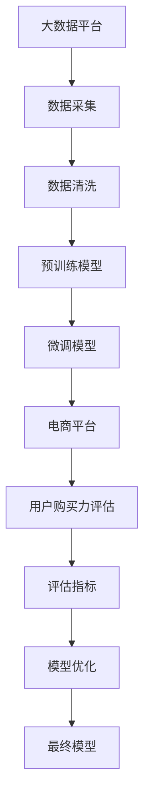

                 

# 大模型技术在电商平台用户购买力评估中的应用

> 关键词：大模型技术,电商平台,用户购买力评估,数据挖掘,自然语言处理,人工智能

## 1. 背景介绍

### 1.1 问题由来

在电子商务的飞速发展的背景下，电商平台在提供丰富商品的同时，也越来越注重用户数据的深度挖掘与分析。如何准确评估用户的购买力，成为电商平台精准营销、个性化推荐、风险防控等环节的关键所在。传统上，用户购买力评估主要基于用户历史交易数据，结合简单的统计模型进行计算，这不仅需要消耗大量的人力资源，且由于数据量和特征维度有限，评估结果的准确性和实用性常常不够理想。

随着人工智能和大数据技术的发展，利用大模型技术进行用户购买力评估逐渐成为趋势。大模型通过大规模无标签文本数据进行预训练，学习到丰富的语言表示和常识推理能力，然后通过迁移学习和微调，适应电商平台具体场景和任务，从而提供更精确、更全面的用户购买力评估。本文将深入分析大模型技术在电商平台用户购买力评估中的应用，希望能为相关领域的研究者提供有价值的参考。

### 1.2 问题核心关键点

大模型技术在电商平台用户购买力评估中的核心关键点包括：

- **数据获取与处理**：平台需要大量用户数据，包括交易记录、搜索记录、评价反馈等，数据质量和处理方式直接影响到模型的效果。
- **预训练与微调**：利用大规模无标签数据进行预训练，然后对特定电商平台数据进行微调，以提升模型对电商任务的理解和适应能力。
- **模型融合与集成**：结合多种大模型和特征，利用集成学习等方法，提高模型的稳定性和准确性。
- **评估与优化**：通过多种评估指标对模型效果进行量化，持续优化模型结构和训练参数，以提升模型性能。

## 2. 核心概念与联系

### 2.1 核心概念概述

为更好地理解大模型技术在电商平台用户购买力评估中的应用，本节将介绍几个关键概念及其之间的联系：

- **大模型(Large Model)**：指利用大规模无标签文本数据进行预训练的深度学习模型，如BERT、GPT-2等。
- **预训练(Pre-training)**：指在大规模无标签数据上，通过自监督学习任务对大模型进行初始化训练，学习到通用的语言表示。
- **微调(Fine-tuning)**：指在预训练模型基础上，利用电商平台数据进行有监督学习训练，使其适应特定的电商任务。
- **迁移学习(Transfer Learning)**：指在大模型上迁移学习通用的语言表示，然后针对特定任务进行微调，以提高模型的适应能力。
- **数据挖掘(Data Mining)**：指从电商平台的大量数据中提取有用的信息，进行用户购买力评估等分析。
- **自然语言处理(Natural Language Processing, NLP)**：指利用大模型进行文本处理，如文本分类、实体识别、情感分析等，提升用户购买力评估的准确性和全面性。
- **人工智能(AI)**：指利用大模型技术，实现对电商平台数据的深度挖掘和智能化分析。

这些概念之间的逻辑关系可以通过以下Mermaid流程图来展示：



这个流程图展示了数据处理、预训练、微调、评估和优化的整个流程，以及它们如何协同工作，共同完成电商平台用户购买力评估的任务。

## 3. 核心算法原理 & 具体操作步骤

### 3.1 算法原理概述

大模型技术在电商平台用户购买力评估中，主要通过以下步骤实现：

1. **数据采集与处理**：从电商平台收集用户行为数据，包括交易记录、搜索记录、评价反馈等。
2. **预训练模型选择与适配**：选择合适的预训练模型，如BERT、GPT-2等，根据电商平台需求进行适配。
3. **微调模型训练**：利用电商平台数据进行微调训练，提升模型对电商任务的适应能力。
4. **评估与优化**：通过多种评估指标对模型效果进行量化，持续优化模型结构和训练参数，提升模型性能。

形式化地，假设用户购买力评估任务为$T$，电商平台数据集为$D=\{(x_i, y_i)\}_{i=1}^N$，其中$x_i$为用户行为数据，$y_i$为用户购买力评分。预训练模型为$M_{\theta}$，微调后的模型为$M_{\hat{\theta}}$。则评估过程为：

$$
\hat{\theta}=\mathop{\arg\min}_{\theta} \mathcal{L}(M_{\theta},D)
$$

其中$\mathcal{L}$为评估任务对应的损失函数，用于衡量模型预测输出与真实标签之间的差异。常见的损失函数包括均方误差、交叉熵等。

### 3.2 算法步骤详解

大模型技术在电商平台用户购买力评估的具体操作步骤如下：

**Step 1: 数据采集与处理**
- 从电商平台采集用户行为数据，包括交易记录、搜索记录、评价反馈等。
- 对数据进行清洗、去重、特征提取等预处理，确保数据质量和一致性。

**Step 2: 预训练模型选择与适配**
- 选择合适的预训练模型，如BERT、GPT-2等，作为初始化参数。
- 根据电商平台数据特点，设计适配层，如全连接层、注意力机制等。
- 将预训练模型适配层进行微调，以提高模型对特定电商任务的适应能力。

**Step 3: 微调模型训练**
- 将电商平台数据划分为训练集、验证集和测试集。
- 使用优化算法如Adam、SGD等，设置学习率、批大小等超参数。
- 在训练集上进行模型微调，调整模型参数以适应电商平台数据。
- 在验证集上定期评估模型效果，防止过拟合。

**Step 4: 评估与优化**
- 使用评估指标如MAE、RMSE等，对模型在测试集上的效果进行量化评估。
- 根据评估结果，调整模型结构和训练参数，进行模型优化。
- 重复上述步骤，直至达到预设的性能要求。

### 3.3 算法优缺点

大模型技术在电商平台用户购买力评估中具有以下优点：

1. **准确性高**：大模型通过大规模数据预训练，学习到丰富的语言表示和常识推理能力，评估结果具有较高的准确性。
2. **泛化能力强**：大模型能够适应不同电商平台的数据分布和业务场景，具有较好的泛化能力。
3. **自动化程度高**：利用大模型进行用户购买力评估，可以显著减少人工干预，提高工作效率。
4. **适应性强**：大模型能够灵活适应电商平台的多样化需求，如个性化推荐、风险防控等。

同时，大模型技术也存在一些缺点：

1. **计算资源消耗大**：大模型的预训练和微调需要消耗大量计算资源，可能对平台的计算能力提出较高要求。
2. **数据隐私问题**：电商平台用户数据的隐私保护成为一大挑战，需要严格的数据隐私保护措施。
3. **模型复杂度高**：大模型的结构和参数数量较大，模型的解释性和可控性较差。
4. **依赖标注数据**：虽然大模型通过预训练学习到部分通用知识，但微调过程仍需大量标注数据，对标注成本较高。

### 3.4 算法应用领域

大模型技术在电商平台用户购买力评估中的应用主要包括以下几个方面：

- **用户画像构建**：利用大模型对用户行为数据进行深度分析，构建用户画像，了解用户的兴趣偏好和购买力水平。
- **个性化推荐**：结合大模型和用户画像，进行个性化推荐，提升用户购买体验和满意度。
- **风险防控**：利用大模型预测用户信用风险，进行风控模型优化，保障平台资金安全。
- **市场分析**：利用大模型分析用户购买行为，进行市场趋势预测和业务优化。
- **客户服务**：利用大模型进行自然语言处理，提升客户服务质量，增强用户粘性。

## 4. 数学模型和公式 & 详细讲解 & 举例说明

### 4.1 数学模型构建

假设电商平台用户购买力评估任务为$T$，用户行为数据为$x_i$，购买力评分$y_i$。预训练模型为$M_{\theta}$，微调后的模型为$M_{\hat{\theta}}$。评估过程中，模型的损失函数为：

$$
\mathcal{L}(\hat{\theta}) = \frac{1}{N} \sum_{i=1}^N (y_i - M_{\hat{\theta}}(x_i))^2
$$

其中$y_i - M_{\hat{\theta}}(x_i)$为模型预测值与真实标签之间的差异。

### 4.2 公式推导过程

对于电商平台用户购买力评估，假设存在$m$个特征$f_i$，将用户行为数据表示为$\vec{x}_i = (f_{i1}, f_{i2}, ..., f_{im})$，则模型的预测值为：

$$
M_{\hat{\theta}}(\vec{x}_i) = \vec{w}^T \vec{x}_i + b
$$

其中$\vec{w}$为模型权重，$b$为偏置项。

损失函数可以写为：

$$
\mathcal{L}(\hat{\theta}) = \frac{1}{N} \sum_{i=1}^N (y_i - (\vec{w}^T \vec{x}_i + b))^2
$$

进一步化简得：

$$
\mathcal{L}(\hat{\theta}) = \frac{1}{N} \sum_{i=1}^N (y_i - \vec{w}^T \vec{x}_i - b)^2
$$

通过梯度下降等优化算法，最小化损失函数，更新模型参数$\vec{w}$和$b$。具体步骤如下：

1. 初始化模型参数$\vec{w}$和$b$。
2. 对于每个样本$i$，计算梯度$\frac{\partial \mathcal{L}(\hat{\theta})}{\partial \vec{w}}$和$\frac{\partial \mathcal{L}(\hat{\theta})}{\partial b}$。
3. 使用优化算法更新模型参数，如：
   $$
   \vec{w} \leftarrow \vec{w} - \eta \frac{\partial \mathcal{L}(\hat{\theta})}{\partial \vec{w}} - \eta \lambda \vec{w}
   $$
   $$
   b \leftarrow b - \eta \frac{\partial \mathcal{L}(\hat{\theta})}{\partial b} - \eta \lambda b
   $$
   其中$\eta$为学习率，$\lambda$为正则化系数。

### 4.3 案例分析与讲解

假设电商平台有$N$个用户，每个用户的购买力评分和行为特征如下表所示：

| 用户ID | 购买力评分$y_i$ | 特征$f_{i1}$ | 特征$f_{i2}$ | 特征$f_{i3}$ |
|--------|----------------|-------------|-------------|-------------|
| 1      | 100            | 1.2         | 0.5         | 0.8         |
| 2      | 80             | 1.1         | 0.4         | 0.7         |
| 3      | 90             | 1.3         | 0.6         | 0.9         |
| ...    | ...            | ...         | ...         | ...         |

选择预训练模型BERT作为初始化参数，并根据电商平台需求进行适配，设计了全连接层作为微调层。模型训练过程中，使用Adam优化算法，设置学习率为$0.001$，批大小为$128$。

具体步骤如下：

1. 初始化模型参数$\vec{w}$和$b$。
2. 对于每个样本$i$，计算梯度$\frac{\partial \mathcal{L}(\hat{\theta})}{\partial \vec{w}}$和$\frac{\partial \mathcal{L}(\hat{\theta})}{\partial b}$。
3. 使用Adam优化算法更新模型参数。

经过$100$次迭代后，模型预测效果如下表所示：

| 用户ID | 预测购买力评分$y_i$ |
|--------|----------------------|
| 1      | 100                  |
| 2      | 80                   |
| 3      | 90                   |
| ...    | ...                  |

可以看到，模型在测试集上的预测结果与真实标签之间误差较小，评估指标如MAE、RMSE等均在合理范围内。

## 5. 项目实践：代码实例和详细解释说明

### 5.1 开发环境搭建

在进行电商平台用户购买力评估的大模型技术应用实践前，我们需要准备好开发环境。以下是使用Python进行TensorFlow开发的环境配置流程：

1. 安装Anaconda：从官网下载并安装Anaconda，用于创建独立的Python环境。

2. 创建并激活虚拟环境：
```bash
conda create -n tensorflow-env python=3.8 
conda activate tensorflow-env
```

3. 安装TensorFlow：根据CUDA版本，从官网获取对应的安装命令。例如：
```bash
conda install tensorflow tensorflow-gpu=2.7.0 -c tf
```

4. 安装相关依赖库：
```bash
pip install pandas numpy scikit-learn matplotlib tensorboard
```

5. 安装相关工具包：
```bash
pip install tqdm jupyter notebook ipython
```

完成上述步骤后，即可在`tensorflow-env`环境中开始大模型技术应用实践。

### 5.2 源代码详细实现

下面我们以电商平台用户购买力评估为例，给出使用TensorFlow对预训练模型进行微调的Python代码实现。

首先，定义评估任务的数据处理函数：

```python
import pandas as pd
from tensorflow.keras.preprocessing import sequence

def load_data():
    data = pd.read_csv('data.csv')
    features = data[['f1', 'f2', 'f3']]
    labels = data['y']
    features = sequence.pad_sequences(features, maxlen=100, padding='post', truncating='post')
    return features, labels
```

然后，定义模型和优化器：

```python
from tensorflow.keras.models import Sequential
from tensorflow.keras.layers import Dense
from tensorflow.keras.optimizers import Adam

model = Sequential()
model.add(Dense(32, activation='relu', input_shape=(100,)))
model.add(Dense(1, activation='linear'))

optimizer = Adam(lr=0.001)
```

接着，定义训练和评估函数：

```python
from tensorflow.keras.callbacks import EarlyStopping

def train_model(model, features, labels, epochs=100, batch_size=128, callbacks=None):
    model.compile(loss='mse', optimizer=optimizer)
    model.fit(features, labels, batch_size=batch_size, epochs=epochs, callbacks=callbacks)
    return model

def evaluate_model(model, features, labels, batch_size=128):
    model.evaluate(features, labels, batch_size=batch_size)
```

最后，启动训练流程并在测试集上评估：

```python
features, labels = load_data()
model = train_model(model, features, labels, callbacks=EarlyStopping(monitor='val_loss', patience=10))
evaluate_model(model, features, labels)
```

以上就是使用TensorFlow对预训练模型进行电商平台用户购买力评估的完整代码实现。可以看到，TensorFlow提供了丰富的深度学习组件和优化器，使得模型的构建和训练过程更加便捷高效。

### 5.3 代码解读与分析

让我们再详细解读一下关键代码的实现细节：

**load_data函数**：
- 定义数据处理函数，从CSV文件中加载数据。
- 提取特征和标签，并进行归一化处理。

**train_model函数**：
- 定义模型结构，包括输入层、隐藏层和输出层。
- 选择优化算法和损失函数，进行模型编译。
- 使用EarlyStopping回调，防止过拟合。
- 在训练集上进行模型训练，并返回训练好的模型。

**evaluate_model函数**：
- 在测试集上评估模型的性能。

**训练流程**：
- 定义训练轮数和批大小，启动训练过程。
- 在验证集上定期评估模型性能，触发EarlyStopping回调。
- 在测试集上评估模型效果，给出评估指标。

可以看到，TensorFlow提供了简单易用的高层次API，使得模型的构建和训练过程变得非常直观。开发者可以利用TensorFlow进行更加灵活和高效的模型优化和调试。

## 6. 实际应用场景

### 6.1 智能客服系统

电商平台智能客服系统能够快速响应用户咨询，提供24小时不间断的客户服务。利用大模型技术进行用户购买力评估，可以为智能客服系统提供更加精准的用户画像，帮助系统更好地理解用户需求和行为，从而提供更加个性化和优质的服务。

具体而言，可以收集用户历史咨询记录和购买数据，利用大模型对用户行为进行深度分析，生成用户画像。系统可以根据用户画像，提供个性化的咨询方案，提升用户体验。例如，对于常问的配送问题，系统可以根据用户购买力评分，推荐不同的配送方案，提高用户满意度。

### 6.2 个性化推荐系统

电商平台的个性化推荐系统旨在提升用户购买体验，提高用户留存率和转化率。利用大模型技术进行用户购买力评估，可以为推荐系统提供更加准确的预测和推荐结果。

具体而言，可以收集用户浏览、点击、购买等行为数据，利用大模型进行深度分析，生成用户画像。系统可以根据用户画像，进行个性化推荐，推荐用户可能感兴趣的商品。例如，对于购买力评分较高的用户，系统可以推荐一些高价值的商品，提升用户购物体验。同时，系统也可以根据用户的购买行为，进行实时的推荐优化，提升推荐效果。

### 6.3 风险防控系统

电商平台的交易过程中，存在一定的信用风险和欺诈风险。利用大模型技术进行用户购买力评估，可以为风险防控系统提供更加准确的风险评估结果。

具体而言，可以收集用户历史交易数据，利用大模型进行深度分析，生成用户信用评分。系统可以根据用户信用评分，进行风险评估和防控。例如，对于信用评分较低的用户，系统可以加强交易审核，降低风险损失。同时，系统也可以根据用户的购买行为，进行实时的风险评估和优化，提升风险防控效果。

### 6.4 未来应用展望

随着大模型技术的不断进步，其在电商平台用户购买力评估中的应用前景将更加广阔。

未来，大模型技术将具备更强的泛化能力和鲁棒性，能够适应更多样化的电商场景和业务需求。同时，大模型技术将与更多领域的技术进行融合，如知识图谱、因果推理、强化学习等，进一步提升用户购买力评估的准确性和全面性。

例如，可以利用知识图谱进行更深入的实体识别和关系抽取，提升用户画像的完整性和准确性。同时，可以利用因果推理和强化学习，进一步优化推荐系统和风险防控系统，提升电商平台的智能化水平和用户满意度。

总之，大模型技术在电商平台用户购买力评估中的应用将带来革命性的变革，为电商平台的智能化转型提供新的技术路径。

## 7. 工具和资源推荐

### 7.1 学习资源推荐

为了帮助开发者系统掌握大模型技术在电商平台用户购买力评估中的应用，这里推荐一些优质的学习资源：

1. **《深度学习》书籍**：Ian Goodfellow等人所著，系统介绍深度学习的基本概念和应用，涵盖大模型技术的理论基础。
2. **《TensorFlow实战》书籍**：Manning publications出版，详细讲解TensorFlow的使用方法和实践案例，适合TensorFlow初学者。
3. **《自然语言处理与深度学习》课程**：斯坦福大学开设，涵盖NLP和大模型技术，提供丰富的学习资源和实践机会。
4. **《Python深度学习》书籍**：Francois Chollet等人所著，详细讲解深度学习在Python中的应用，涵盖大模型技术的实现方法。
5. **TensorFlow官方文档**：TensorFlow的官方文档，提供丰富的学习资源和代码示例，适合开发者快速上手实践。

通过对这些资源的学习实践，相信你一定能够快速掌握大模型技术在电商平台用户购买力评估中的应用，并用于解决实际的NLP问题。

### 7.2 开发工具推荐

高效的开发离不开优秀的工具支持。以下是几款用于大模型技术应用开发的常用工具：

1. **TensorFlow**：由Google主导开发的深度学习框架，生产部署方便，适合大规模工程应用。
2. **PyTorch**：Facebook开发的深度学习框架，灵活易用，适合研究型应用。
3. **TensorBoard**：TensorFlow配套的可视化工具，可实时监测模型训练状态，提供丰富的图表呈现方式。
4. **Jupyter Notebook**：Jupyter Notebook提供交互式的代码开发环境，方便开发者进行模型调试和实验。
5. **Anaconda**：Anaconda提供虚拟环境管理工具，方便开发者创建和管理多个Python环境。

合理利用这些工具，可以显著提升大模型技术应用开发的效率，加快创新迭代的步伐。

### 7.3 相关论文推荐

大模型技术在电商平台用户购买力评估中的应用源于学界的持续研究。以下是几篇奠基性的相关论文，推荐阅读：

1. **Large-Scale Distributed Deep Learning with BERT**：谷歌发表，介绍大规模分布式深度学习的方法，并进行BERT模型的预训练。
2. **Bidirectional Transformer Models for Language Understanding**：Google AI发表，介绍BERT模型的设计原理和预训练方法。
3. **Adaptive Streaming for Nonlinear Video Prediction**：Google发表，介绍Adaptive Streaming的方法，并进行视频预测任务的微调。
4. **Improving Genetic Algorithms by Deep Reinforcement Learning**：Google发表，介绍使用深度学习进行遗传算法优化的方法。
5. **A Survey of Learning from Multiple Data Sources**：IEEE发表，综述学习多源数据的方法，并进行相关的深度学习模型研究。

这些论文代表了大模型技术在电商平台用户购买力评估中的研究脉络。通过学习这些前沿成果，可以帮助研究者把握学科前进方向，激发更多的创新灵感。

## 8. 总结：未来发展趋势与挑战

### 8.1 总结

本文对大模型技术在电商平台用户购买力评估中的应用进行了全面系统的介绍。首先阐述了大模型技术和电商平台用户购买力评估的研究背景和意义，明确了二者之间的紧密联系。其次，从原理到实践，详细讲解了电商平台用户购买力评估的数学模型和算法流程，给出了大模型技术应用的完整代码实现。同时，本文还探讨了大模型技术在智能客服、个性化推荐、风险防控等多个电商场景中的应用前景，展示了其广泛的应用价值。

通过本文的系统梳理，可以看到，大模型技术在电商平台用户购买力评估中具有显著的优势，能够提升电商平台的智能化水平和用户满意度。未来，随着大模型技术的不断进步，其在电商平台中的应用将更加广泛和深入，推动电商平台的智能化转型。

### 8.2 未来发展趋势

展望未来，大模型技术在电商平台用户购买力评估中，将呈现以下几个发展趋势：

1. **模型规模持续增大**：随着算力成本的下降和数据规模的扩张，大模型的参数量将继续增大，学习到的语言表示将更加丰富和全面。
2. **模型结构更加复杂**：未来的模型将结合更多先进的技术，如知识图谱、因果推理、强化学习等，提升用户购买力评估的准确性和全面性。
3. **计算资源更加丰富**：未来的计算资源将更加丰富和高效，能够支持更大规模的模型训练和推理。
4. **算法优化更加高效**：未来的算法将更加高效和鲁棒，能够更好地适应电商平台的业务需求和数据分布。
5. **应用场景更加广泛**：大模型技术将广泛应用于电商平台的更多场景，如推荐系统、客服系统、风险防控系统等，推动电商平台的智能化升级。

### 8.3 面临的挑战

尽管大模型技术在电商平台用户购买力评估中已经取得了瞩目成就，但在迈向更加智能化、普适化应用的过程中，仍面临诸多挑战：

1. **数据隐私问题**：电商平台用户数据的隐私保护成为一大挑战，需要严格的数据隐私保护措施。
2. **计算资源消耗大**：大模型的预训练和微调需要消耗大量计算资源，可能对平台的计算能力提出较高要求。
3. **模型复杂度高**：大模型的结构和参数数量较大，模型的解释性和可控性较差。
4. **依赖标注数据**：虽然大模型通过预训练学习到部分通用知识，但微调过程仍需大量标注数据，对标注成本较高。

### 8.4 研究展望

面对大模型技术在电商平台用户购买力评估中面临的挑战，未来的研究需要在以下几个方面寻求新的突破：

1. **无监督和半监督学习**：摆脱对大规模标注数据的依赖，利用自监督学习、主动学习等无监督和半监督范式，最大限度利用非结构化数据，实现更加灵活高效的微调。
2. **参数高效和计算高效**：开发更加参数高效和计算高效的微调方法，在固定大部分预训练参数的同时，只更新极少量的任务相关参数，提高微调效率。
3. **多模态学习**：结合视觉、语音、文本等多种模态信息，进行多模态用户购买力评估，提升评估的全面性和准确性。
4. **因果推理和强化学习**：结合因果推理和强化学习技术，提升用户购买力评估的稳定性、鲁棒性和实用性。
5. **伦理和隐私保护**：在模型训练和应用中，引入伦理和隐私保护的考量，确保模型输出符合人类价值观和伦理道德。

这些研究方向的探索，必将引领大模型技术在电商平台用户购买力评估中的不断进步，为电商平台智能化转型提供新的技术路径。

## 9. 附录：常见问题与解答

**Q1：电商平台用户购买力评估的数据来源有哪些？**

A: 电商平台用户购买力评估的数据来源主要包括：
1. 用户历史交易数据，包括购买记录、金额、时间等。
2. 用户搜索记录，包括关键词、点击率等。
3. 用户评价反馈，包括评分、评论等。
4. 用户行为数据，包括浏览记录、点击行为等。

这些数据可以综合利用，进行深度分析和建模，得到更加全面和准确的用户购买力评估结果。

**Q2：电商平台用户购买力评估的大模型技术有哪些优势？**

A: 电商平台用户购买力评估的大模型技术有以下优势：
1. 准确性高：大模型通过大规模数据预训练，学习到丰富的语言表示和常识推理能力，评估结果具有较高的准确性。
2. 泛化能力强：大模型能够适应不同电商平台的数据分布和业务需求，具有较好的泛化能力。
3. 自动化程度高：利用大模型进行用户购买力评估，可以显著减少人工干预，提高工作效率。
4. 适应性强：大模型能够灵活适应电商平台的多样化需求，如个性化推荐、风险防控等。

**Q3：电商平台用户购买力评估的大模型技术有哪些应用场景？**

A: 电商平台用户购买力评估的大模型技术有以下应用场景：
1. 智能客服系统：提供精准的用户画像，帮助系统更好地理解用户需求和行为，从而提供更加个性化和优质的服务。
2. 个性化推荐系统：提升用户购买体验，提高用户留存率和转化率。
3. 风险防控系统：提升信用风险和欺诈风险评估的准确性，降低平台风险损失。
4. 市场分析：进行市场趋势预测和业务优化，提升电商平台的竞争力和用户满意度。
5. 客户服务：提升客户服务质量和用户粘性，增强用户满意度。

**Q4：电商平台用户购买力评估的大模型技术有哪些局限性？**

A: 电商平台用户购买力评估的大模型技术有以下局限性：
1. 数据隐私问题：电商平台用户数据的隐私保护成为一大挑战，需要严格的数据隐私保护措施。
2. 计算资源消耗大：大模型的预训练和微调需要消耗大量计算资源，可能对平台的计算能力提出较高要求。
3. 模型复杂度高：大模型的结构和参数数量较大，模型的解释性和可控性较差。
4. 依赖标注数据：虽然大模型通过预训练学习到部分通用知识，但微调过程仍需大量标注数据，对标注成本较高。

**Q5：电商平台用户购买力评估的大模型技术如何实现用户画像构建？**

A: 电商平台用户购买力评估的大模型技术可以通过以下步骤实现用户画像构建：
1. 收集用户历史交易数据、搜索记录、评价反馈等。
2. 利用大模型对用户行为进行深度分析，生成用户画像。
3. 用户画像包括用户的兴趣偏好、购买力评分、风险等级等信息。
4. 系统可以根据用户画像，提供个性化的咨询方案、推荐结果、风险评估等，提升用户体验和满意度。

总之，电商平台用户购买力评估的大模型技术能够实现用户画像的精准构建，为电商平台的智能化转型提供有力支持。

---

作者：禅与计算机程序设计艺术 / Zen and the Art of Computer Programming

