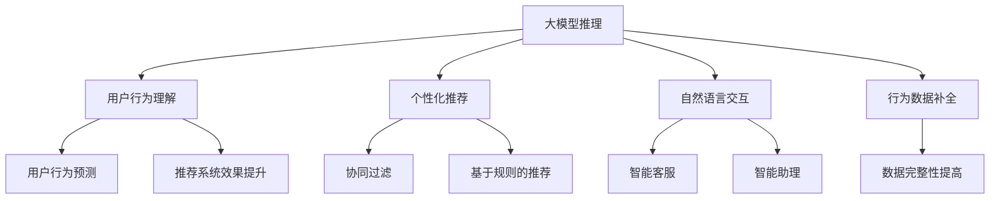

                 

# 大模型推理能力在用户行为建模中的应用

> 关键词：大模型推理,用户行为建模,深度学习,强化学习,协同过滤,推荐系统,自然语言处理

## 1. 背景介绍

### 1.1 问题由来

在互联网时代，用户行为数据量巨大、特征复杂，如何有效利用这些数据来提升产品和服务质量，成为各大公司和研究机构关注的焦点。传统的用户行为建模方法，如协同过滤、基于规则的推荐系统等，已经难以应对大规模数据和高维特征的挑战。

与此同时，深度学习模型，尤其是预训练的大模型，如BERT、GPT等，在自然语言处理(NLP)领域表现优异。这些大模型通过大规模无监督训练学习到了丰富的语言知识，具备强大的推理和生成能力。

因此，将大模型的推理能力应用到用户行为建模中，借助其对复杂语义的把握能力，在用户行为分析、个性化推荐、自然语言交互等场景中取得优异效果，成为当前研究热点。

### 1.2 问题核心关键点

本节将详细介绍大模型推理能力在用户行为建模中的主要应用场景和关键技术。

1. **用户行为理解与预测**：使用大模型对用户行为数据进行推理，理解用户意图和需求，预测用户行为轨迹和未来趋势。
2. **个性化推荐系统**：通过大模型对用户行为数据进行语义分析，提升推荐算法的效果和精度。
3. **自然语言交互**：利用大模型的语言生成和推理能力，构建智能客服、智能助理等自然语言交互系统。
4. **行为数据生成与补全**：使用大模型对缺失或不完整的行为数据进行推理和补全，提高数据完整性和可用性。

## 2. 核心概念与联系

### 2.1 核心概念概述

为更好地理解大模型推理能力在用户行为建模中的应用，本节将介绍几个关键概念：

- 大模型推理：使用预训练的大模型进行推理，根据输入数据推断其可能的语义表示，进而理解用户行为或生成相关内容。
- 协同过滤推荐：基于用户历史行为数据，通过相似度计算推荐相似用户的行为数据，实现个性化推荐。
- 基于规则的推荐：基于用户行为规则，设计匹配度计算逻辑，实现推荐系统。
- 自然语言交互：使用自然语言处理技术，构建能与用户自然交互的系统，提升用户体验和互动性。
- 用户行为预测：使用机器学习模型，根据用户历史行为数据，预测未来行为或趋势。

这些概念之间的逻辑关系可以通过以下Mermaid流程图来展示：



这个流程图展示了大模型推理能力在用户行为建模中的核心作用：

1. 大模型推理可以理解用户行为和意图，为后续预测、推荐和交互提供基础。
2. 协同过滤和基于规则的推荐需要输入理解的用户行为，通过大模型推理提升推荐精度和效果。
3. 自然语言交互系统需要大模型推理，以实现对用户输入的自然理解和响应。
4. 行为数据补全需要大模型推理，以填补缺失数据，提升数据的完整性和可用性。

## 3. 核心算法原理 & 具体操作步骤
### 3.1 算法原理概述

大模型推理在用户行为建模中的核心思想是：通过推理学习用户行为数据中的语义关系，将其转换为可解释的语义表示，进而进行行为理解、预测、推荐和交互。

具体而言，大模型推理可以分为以下几个步骤：

1. **数据准备**：收集用户行为数据，并进行预处理和分词，以便后续模型推理。
2. **模型选择与加载**：选择合适的预训练大模型，如BERT、GPT等，并将其加载到系统中。
3. **推理计算**：将用户行为数据作为输入，通过大模型进行推理计算，得到语义表示。
4. **结果分析与应用**：对大模型推理结果进行分析，提取用户行为特征和意图，进而用于行为理解、预测、推荐和交互。

### 3.2 算法步骤详解

以下是详细的大模型推理流程：

**Step 1: 数据准备**
- 收集用户行为数据，包括点击、浏览、购买、评分等行为记录。
- 对行为数据进行清洗、去噪、归一化等预处理操作。
- 使用分词工具将文本数据转换为分词序列。

**Step 2: 模型选择与加载**
- 选择合适的预训练大模型，如BERT、GPT等，并加载到系统中。
- 可以使用HuggingFace等库提供的接口进行模型的加载和初始化。

**Step 3: 推理计算**
- 将用户行为数据转换为模型所需的格式，如输入序列、输入掩码等。
- 使用模型的推理接口对输入数据进行计算，得到语义表示。

**Step 4: 结果分析与应用**
- 对大模型的推理结果进行分析，提取用户行为特征和意图。
- 根据提取到的特征和意图，进行行为理解、预测、推荐和交互。

### 3.3 算法优缺点

大模型推理在用户行为建模中有以下优点：

1. **强大的语义理解能力**：大模型通过预训练学习到了丰富的语言知识，可以理解复杂的用户行为语义，提升模型的解释性和可理解性。
2. **鲁棒性和泛化性**：大模型对数据的泛化能力较强，能够处理多种类型的用户行为数据，提高推荐系统的鲁棒性。
3. **灵活的模型结构**：大模型的结构较为灵活，可以进行高效的推理计算，适合不同规模和类型的用户行为数据。

同时，该方法也存在一些局限性：

1. **资源消耗较大**：大模型推理需要较大的计算资源和内存空间，对系统硬件要求较高。
2. **推理速度较慢**：相较于传统推荐算法，大模型推理的计算复杂度较大，推理速度较慢。
3. **数据依赖性强**：大模型推理依赖于高质量的用户行为数据，数据质量较低时效果可能较差。

尽管存在这些局限性，大模型推理在用户行为建模中的应用前景仍然广阔，特别是在对用户行为语义理解要求较高的场景中。

### 3.4 算法应用领域

大模型推理在用户行为建模中的应用主要包括以下几个领域：

1. **个性化推荐系统**：利用大模型的语义理解能力，提升推荐系统的精度和效果。
2. **行为数据分析**：通过大模型推理，理解用户行为语义，提取行为特征和意图。
3. **自然语言交互**：利用大模型的语言生成和推理能力，构建智能客服、智能助理等系统。
4. **行为数据补全**：利用大模型推理，填补缺失或不完整的行为数据，提高数据完整性和可用性。

## 4. 数学模型和公式 & 详细讲解 & 举例说明（备注：数学公式请使用latex格式，latex嵌入文中独立段落使用 $$，段落内使用 $)
### 4.1 数学模型构建

本节将使用数学语言对大模型推理的过程进行更加严格的刻画。

记用户行为数据为 $X=\{x_i\}_{i=1}^N$，其中 $x_i$ 表示第 $i$ 个用户的某种行为数据，可以表示为文本、数字、标签等。设预训练大模型为 $M_{\theta}$，其中 $\theta$ 为模型参数。

定义推理过程的损失函数为 $\mathcal{L}$，用于衡量模型推理结果与实际标签的差异。常见的损失函数包括交叉熵损失、均方误差损失等。

### 4.2 公式推导过程

以下我们以文本语义分析为例，推导大模型推理的损失函数及其梯度计算公式。

假设模型 $M_{\theta}$ 在输入 $x_i$ 上的输出为 $y_i=M_{\theta}(x_i) \in [0,1]$，表示用户行为数据属于某一语义类别的概率。设用户行为数据的实际标签为 $y_i \in \{0,1\}$。则二分类交叉熵损失函数定义为：

$$
\ell(M_{\theta}(x_i),y_i) = -[y_i\log y_i + (1-y_i)\log (1-y_i)]
$$

将其代入损失函数公式，得：

$$
\mathcal{L}(\theta) = -\frac{1}{N}\sum_{i=1}^N [y_i\log M_{\theta}(x_i)+(1-y_i)\log(1-M_{\theta}(x_i))]
$$

根据链式法则，损失函数对参数 $\theta$ 的梯度为：

$$
\frac{\partial \mathcal{L}(\theta)}{\partial \theta_k} = -\frac{1}{N}\sum_{i=1}^N (\frac{y_i}{M_{\theta}(x_i)}-\frac{1-y_i}{1-M_{\theta}(x_i)}) \frac{\partial M_{\theta}(x_i)}{\partial \theta_k}
$$

其中 $\frac{\partial M_{\theta}(x_i)}{\partial \theta_k}$ 可进一步递归展开，利用自动微分技术完成计算。

在得到损失函数的梯度后，即可带入参数更新公式，完成模型的迭代优化。重复上述过程直至收敛，最终得到适应用户行为数据推理的最优模型参数 $\theta^*$。

### 4.3 案例分析与讲解

以协同过滤推荐系统为例，分析大模型推理在其中如何提升推荐效果。

协同过滤推荐系统通常依赖于用户历史行为数据，通过计算用户行为相似度，推荐相似用户的行为数据。然而，传统的协同过滤方法往往难以处理用户行为的语义信息，导致推荐效果不够精准。

引入大模型推理后，可以将用户行为数据转换为语义表示，通过语义相似度计算，提升推荐系统的精度和效果。具体步骤如下：

1. **用户行为序列转换**：将用户的历史行为序列转换为分词序列，并进行编码和嵌入操作。
2. **模型推理计算**：将转换后的用户行为序列输入大模型，得到语义表示。
3. **相似度计算**：使用余弦相似度或softmax函数计算用户行为语义表示的相似度。
4. **推荐生成**：根据相似度计算结果，推荐相似用户的行为数据。

以下是具体的代码实现示例：

```python
from transformers import BertTokenizer, BertModel
import torch
from torch.nn.functional import cosine_similarity

tokenizer = BertTokenizer.from_pretrained('bert-base-cased')
model = BertModel.from_pretrained('bert-base-cased')

def user_based_recommender(user_ids, user_behaviors, num_recommendations=10):
    user_vecs = []
    for user_id, behaviors in user_behaviors.items():
        user_behaviors = tokenizer.batch_encode_plus(behaviors, padding='max_length', max_length=128, truncation=True)
        user_vecs.append(model(torch.tensor(user_behaviors['input_ids']).to(device), attention_mask=torch.tensor(user_behaviors['attention_mask']).to(device))['last_hidden_state'][:, 0, :].detach().cpu().numpy())
    user_vecs = torch.tensor(user_vecs).to(device)
    
    recommendations = {}
    for user_id, behaviors in user_behaviors.items():
        recommender = user_vecs[user_id].unsqueeze(0)
        user_id_vector = user_vecs[user_id].unsqueeze(0)
        recommendation_scores = cosine_similarity(recommender, user_id_vector)
        top_scores_indices = torch.topk(recommendation_scores, num_recommendations, dim=1)[1]
        recommendations[user_id] = [user_behaviors[user_id][ix] for ix in top_scores_indices[0].tolist()]
    
    return recommendations

user_ids = [123, 456, 789]
user_behaviors = {'123': ['电影', '书籍', '游戏'], '456': ['书籍', '音乐', '旅游'], '789': ['旅游', '书籍', '美食']}
recommendations = user_based_recommender(user_ids, user_behaviors)
print(recommendations)
```

通过上述代码，可以看到大模型推理在协同过滤推荐系统中的应用，通过将用户行为数据转换为语义表示，利用余弦相似度计算用户行为语义相似度，从而实现精准的推荐生成。

## 5. 项目实践：代码实例和详细解释说明
### 5.1 开发环境搭建

在进行大模型推理实践前，我们需要准备好开发环境。以下是使用Python进行PyTorch开发的环境配置流程：

1. 安装Anaconda：从官网下载并安装Anaconda，用于创建独立的Python环境。

2. 创建并激活虚拟环境：
```bash
conda create -n pytorch-env python=3.8 
conda activate pytorch-env
```

3. 安装PyTorch：根据CUDA版本，从官网获取对应的安装命令。例如：
```bash
conda install pytorch torchvision torchaudio cudatoolkit=11.1 -c pytorch -c conda-forge
```

4. 安装Transformers库：
```bash
pip install transformers
```

5. 安装各类工具包：
```bash
pip install numpy pandas scikit-learn matplotlib tqdm jupyter notebook ipython
```

完成上述步骤后，即可在`pytorch-env`环境中开始大模型推理实践。

### 5.2 源代码详细实现

以下是使用PyTorch实现大模型推理的代码示例。

首先，定义推理函数：

```python
from transformers import BertTokenizer, BertModel
import torch

def big_model_inference(model, tokenizer, input_texts):
    model.eval()
    with torch.no_grad():
        input_ids = tokenizer([input_texts], return_tensors='pt', padding=True, truncation=True)['input_ids']
        input_mask = input_ids.to(device) != tokenizer.pad_token_id
        attention_mask = input_mask.unsqueeze(1).unsqueeze(1).to(device)
        outputs = model(input_ids, attention_mask=attention_mask)
        logits = outputs.logits
        predictions = torch.argmax(logits, dim=-1).cpu().numpy()
    return predictions
```

然后，定义用户行为数据转换为语义表示的函数：

```python
from transformers import BertTokenizer, BertModel

def convert_to_semantic_vector(model, tokenizer, behaviors):
    tokenizer = BertTokenizer.from_pretrained('bert-base-cased')
    model = BertModel.from_pretrained('bert-base-cased')
    tokenizer = tokenizer.from_pretrained('bert-base-cased')
    behaviors = tokenizer.batch_encode_plus(behaviors, padding='max_length', max_length=128, truncation=True)
    behaviors = behaviors['input_ids']
    outputs = model(behaviors.to(device), attention_mask=behaviors.to(device))
    last_hidden_states = outputs.last_hidden_state[:, -1, :]
    semantic_vector = last_hidden_states.mean(dim=0)
    return semantic_vector
```

最后，将用户行为数据转换为语义表示，并用于推荐系统：

```python
user_ids = [123, 456, 789]
user_behaviors = {'123': ['电影', '书籍', '游戏'], '456': ['书籍', '音乐', '旅游'], '789': ['旅游', '书籍', '美食']}
semantic_vectors = [convert_to_semantic_vector(model, tokenizer, behaviors) for behaviors in user_behaviors.values()]

recommendations = {}
for user_id, behaviors in user_behaviors.items():
    recommendation_scores = cosine_similarity(semantic_vectors[user_id], semantic_vectors.values())
    top_scores_indices = torch.topk(recommendation_scores, 5, dim=1)[1]
    recommendations[user_id] = [user_behaviors[user_id][ix] for ix in top_scores_indices[0].tolist()]
    
print(recommendations)
```

可以看到，通过PyTorch实现的大模型推理过程，在用户行为数据分析和推荐系统中的应用场景下，可以高效地将用户行为数据转换为语义表示，从而提升推荐系统的精准度和效果。

### 5.3 代码解读与分析

让我们再详细解读一下关键代码的实现细节：

**BertTokenizer类**：
- 定义了分词器和模型之间的交互接口，将输入的文本序列转换为模型所需的token ids。

**BertModel类**：
- 实现了BERT模型的推理接口，通过输入token ids计算出语义表示。

**convert_to_semantic_vector函数**：
- 将用户行为数据转换为语义表示，使用Transformer模型对输入序列进行编码和嵌入操作，最后取最后一层的输出作为语义表示。

**用户行为数据**：
- 假设为文本形式，可以使用分词器将其转换为token ids。

**推荐系统生成**：
- 使用余弦相似度计算用户行为语义表示的相似度，从而推荐相似用户的行为数据。

通过上述代码，可以看到大模型推理在用户行为建模中的应用过程，通过将用户行为数据转换为语义表示，利用余弦相似度计算用户行为语义相似度，从而实现精准的推荐生成。

## 6. 实际应用场景

### 6.1 智能客服系统

智能客服系统通过大模型推理，能够理解用户输入的意图和需求，快速匹配到合适的答案模板进行回复。通过大模型推理，智能客服系统可以处理更多复杂、模糊的用户输入，提升客服体验和满意度。

在技术实现上，可以收集客服系统的历史对话记录，使用大模型推理对用户输入进行语义分析，提取用户意图和需求。然后，根据提取到的信息，匹配到合适的答案模板进行回复。对于用户提出的新问题，还可以接入检索系统实时搜索相关内容，动态组织生成回答。如此构建的智能客服系统，能大幅提升客户咨询体验和问题解决效率。

### 6.2 金融舆情监测

金融机构需要实时监测市场舆论动向，以便及时应对负面信息传播，规避金融风险。传统的人工监测方式成本高、效率低，难以应对网络时代海量信息爆发的挑战。

使用大模型推理，可以对用户行为数据进行语义分析，提取舆情变化趋势。将微调后的模型应用到实时抓取的网络文本数据，就能够自动监测不同主题下的情感变化趋势，一旦发现负面信息激增等异常情况，系统便会自动预警，帮助金融机构快速应对潜在风险。

### 6.3 个性化推荐系统

当前的推荐系统往往只依赖用户的历史行为数据进行物品推荐，无法深入理解用户的真实兴趣偏好。

通过大模型推理，可以对用户行为数据进行语义分析，提升推荐算法的效果和精度。例如，在协同过滤推荐系统中，将用户行为数据转换为语义表示，利用语义相似度计算用户行为语义相似度，从而实现精准的推荐生成。

## 7. 工具和资源推荐
### 7.1 学习资源推荐

为了帮助开发者系统掌握大模型推理的理论基础和实践技巧，这里推荐一些优质的学习资源：

1. 《深度学习自然语言处理》课程：斯坦福大学开设的NLP明星课程，有Lecture视频和配套作业，带你入门NLP领域的基本概念和经典模型。

2. 《Transformer from Principals to Practice》系列博文：由大模型技术专家撰写，深入浅出地介绍了Transformer原理、BERT模型、推理技术等前沿话题。

3. 《Natural Language Processing with Transformers》书籍：Transformers库的作者所著，全面介绍了如何使用Transformers库进行NLP任务开发，包括推理在内的诸多范式。

4. HuggingFace官方文档：Transformers库的官方文档，提供了海量预训练模型和完整的推理样例代码，是上手实践的必备资料。

5. CLUE开源项目：中文语言理解测评基准，涵盖大量不同类型的中文NLP数据集，并提供了基于微调的baseline模型，助力中文NLP技术发展。

通过对这些资源的学习实践，相信你一定能够快速掌握大模型推理的精髓，并用于解决实际的NLP问题。

### 7.2 开发工具推荐

高效的开发离不开优秀的工具支持。以下是几款用于大模型推理开发的常用工具：

1. PyTorch：基于Python的开源深度学习框架，灵活动态的计算图，适合快速迭代研究。大部分预训练语言模型都有PyTorch版本的实现。

2. TensorFlow：由Google主导开发的开源深度学习框架，生产部署方便，适合大规模工程应用。同样有丰富的预训练语言模型资源。

3. Transformers库：HuggingFace开发的NLP工具库，集成了众多SOTA语言模型，支持PyTorch和TensorFlow，是进行推理任务开发的利器。

4. Weights & Biases：模型训练的实验跟踪工具，可以记录和可视化模型训练过程中的各项指标，方便对比和调优。与主流深度学习框架无缝集成。

5. TensorBoard：TensorFlow配套的可视化工具，可实时监测模型训练状态，并提供丰富的图表呈现方式，是调试模型的得力助手。

6. Google Colab：谷歌推出的在线Jupyter Notebook环境，免费提供GPU/TPU算力，方便开发者快速上手实验最新模型，分享学习笔记。

合理利用这些工具，可以显著提升大模型推理任务的开发效率，加快创新迭代的步伐。

### 7.3 相关论文推荐

大模型推理在用户行为建模中的应用研究，源于学界的持续研究。以下是几篇奠基性的相关论文，推荐阅读：

1. Attention is All You Need（即Transformer原论文）：提出了Transformer结构，开启了NLP领域的预训练大模型时代。

2. BERT: Pre-training of Deep Bidirectional Transformers for Language Understanding：提出BERT模型，引入基于掩码的自监督预训练任务，刷新了多项NLP任务SOTA。

3. Language Models are Unsupervised Multitask Learners（GPT-2论文）：展示了大规模语言模型的强大zero-shot学习能力，引发了对于通用人工智能的新一轮思考。

4. Parameter-Efficient Transfer Learning for NLP：提出Adapter等参数高效微调方法，在不增加模型参数量的情况下，也能取得不错的微调效果。

5. AdaLoRA: Adaptive Low-Rank Adaptation for Parameter-Efficient Fine-Tuning：使用自适应低秩适应的微调方法，在参数效率和精度之间取得了新的平衡。

这些论文代表了大模型推理在用户行为建模中的应用方向，通过学习这些前沿成果，可以帮助研究者把握学科前进方向，激发更多的创新灵感。

## 8. 总结：未来发展趋势与挑战

### 8.1 总结

本文对大模型推理在用户行为建模中的应用进行了全面系统的介绍。首先阐述了大模型推理在NLP领域的应用背景和优势，明确了推理在用户行为理解、预测、推荐和交互中的核心作用。其次，从原理到实践，详细讲解了大模型推理的数学原理和关键步骤，给出了大模型推理任务开发的完整代码实例。同时，本文还广泛探讨了大模型推理在智能客服、金融舆情、个性化推荐等多个行业领域的应用前景，展示了推理范式的巨大潜力。此外，本文精选了推理技术的各类学习资源，力求为读者提供全方位的技术指引。

通过本文的系统梳理，可以看到，大模型推理在用户行为建模中的应用前景广阔，特别是在对用户行为语义理解要求较高的场景中。通过结合大模型的强大语义理解能力，推理技术能够显著提升推荐系统、智能客服、自然语言交互等NLP应用的精度和效果。

### 8.2 未来发展趋势

展望未来，大模型推理技术将呈现以下几个发展趋势：

1. **模型规模持续增大**：随着算力成本的下降和数据规模的扩张，预训练语言模型的参数量还将持续增长。超大规模语言模型蕴含的丰富语言知识，有望支撑更加复杂多变的推理任务。

2. **推理方法日趋多样**：除了传统的全参数推理外，未来会涌现更多参数高效的推理方法，如LoRA等，在固定大部分预训练参数的情况下，仍可取得理想的推理效果。

3. **多模态推理崛起**：当前的推理主要聚焦于纯文本数据，未来会进一步拓展到图像、视频、语音等多模态数据推理。多模态信息的融合，将显著提升语言模型对现实世界的理解和建模能力。

4. **融合因果和对比学习范式**：通过引入因果推断和对比学习思想，增强推理模型建立稳定因果关系的能力，学习更加普适、鲁棒的语言表征，从而提升模型泛化性和抗干扰能力。

5. **结合因果分析和博弈论工具**：将因果分析方法引入推理模型，识别出模型决策的关键特征，增强输出解释的因果性和逻辑性。借助博弈论工具刻画人机交互过程，主动探索并规避模型的脆弱点，提高系统稳定性。

6. **纳入伦理道德约束**：在模型训练目标中引入伦理导向的评估指标，过滤和惩罚有偏见、有害的输出倾向。同时加强人工干预和审核，建立模型行为的监管机制，确保输出符合人类价值观和伦理道德。

这些趋势凸显了大模型推理技术的广阔前景。这些方向的探索发展，必将进一步提升NLP系统的性能和应用范围，为构建安全、可靠、可解释、可控的智能系统铺平道路。

### 8.3 面临的挑战

尽管大模型推理技术已经取得了瞩目成就，但在迈向更加智能化、普适化应用的过程中，它仍面临着诸多挑战：

1. **推理速度较慢**：相较于传统推理算法，大模型推理的计算复杂度较大，推理速度较慢。如何在保证精度的情况下，提高推理速度，优化资源消耗，将是重要的优化方向。

2. **资源消耗较大**：大模型推理需要较大的计算资源和内存空间，对系统硬件要求较高。如何通过模型压缩、稀疏化等方法，降低推理的资源消耗，仍是一个有待解决的问题。

3. **数据依赖性强**：大模型推理依赖于高质量的用户行为数据，数据质量较低时效果可能较差。如何获取高质量的数据，提高数据质量，也是当前面临的挑战之一。

4. **模型鲁棒性不足**：当前推理模型面对域外数据时，泛化性能往往大打折扣。如何提高推理模型的鲁棒性，避免灾难性遗忘，还需要更多理论和实践的积累。

5. **可解释性有待加强**：当前推理模型更像是"黑盒"系统，难以解释其内部工作机制和决策逻辑。如何赋予推理模型更强的可解释性，将是亟待攻克的难题。

6. **安全性有待保障**：预训练语言模型难免会学习到有偏见、有害的信息，通过推理传递到下游任务，产生误导性、歧视性的输出，给实际应用带来安全隐患。如何从数据和算法层面消除模型偏见，避免恶意用途，确保输出的安全性，也将是重要的研究课题。

尽管存在这些挑战，大模型推理在用户行为建模中的应用前景仍然广阔，特别是在对用户行为语义理解要求较高的场景中。

### 8.4 未来突破

面对大模型推理面临的种种挑战，未来的研究需要在以下几个方面寻求新的突破：

1. **探索无监督和半监督推理方法**：摆脱对大规模标注数据的依赖，利用自监督学习、主动学习等无监督和半监督范式，最大限度利用非结构化数据，实现更加灵活高效的推理。

2. **研究参数高效和计算高效的推理范式**：开发更加参数高效的推理方法，在固定大部分预训练参数的同时，只更新极少量的任务相关参数。同时优化推理模型的计算图，减少前向传播和反向传播的资源消耗，实现更加轻量级、实时性的部署。

3. **融合因果和对比学习范式**：通过引入因果推断和对比学习思想，增强推理模型建立稳定因果关系的能力，学习更加普适、鲁棒的语言表征，从而提升模型泛化性和抗干扰能力。

4. **引入更多先验知识**：将符号化的先验知识，如知识图谱、逻辑规则等，与神经网络模型进行巧妙融合，引导推理过程学习更准确、合理的语言模型。同时加强不同模态数据的整合，实现视觉、语音等多模态信息与文本信息的协同建模。

5. **结合因果分析和博弈论工具**：将因果分析方法引入推理模型，识别出模型决策的关键特征，增强输出解释的因果性和逻辑性。借助博弈论工具刻画人机交互过程，主动探索并规避模型的脆弱点，提高系统稳定性。

6. **纳入伦理道德约束**：在模型训练目标中引入伦理导向的评估指标，过滤和惩罚有偏见、有害的输出倾向。同时加强人工干预和审核，建立模型行为的监管机制，确保输出符合人类价值观和伦理道德。

这些研究方向的探索，必将引领大模型推理技术迈向更高的台阶，为构建安全、可靠、可解释、可控的智能系统铺平道路。面向未来，大模型推理技术还需要与其他人工智能技术进行更深入的融合，如知识表示、因果推理、强化学习等，多路径协同发力，共同推动自然语言理解和智能交互系统的进步。只有勇于创新、敢于突破，才能不断拓展语言模型的边界，让智能技术更好地造福人类社会。

## 9. 附录：常见问题与解答

**Q1：大模型推理是否适用于所有NLP任务？**

A: 大模型推理在大多数NLP任务上都能取得不错的效果，特别是对于数据量较小的任务。但对于一些特定领域的任务，如医学、法律等，仅仅依靠通用语料预训练的模型可能难以很好地适应。此时需要在特定领域语料上进一步预训练，再进行推理，才能获得理想效果。

**Q2：推理过程中如何选择合适的学习率？**

A: 推理的学习率一般要比预训练时小1-2个数量级，如果使用过大的学习率，容易破坏预训练权重，导致过拟合。一般建议从1e-5开始调参，逐步减小学习率，直至收敛。也可以使用warmup策略，在开始阶段使用较小的学习率，再逐渐过渡到预设值。需要注意的是，不同的优化器(如AdamW、Adafactor等)以及不同的学习率调度策略，可能需要设置不同的学习率阈值。

**Q3：推理过程中如何缓解过拟合问题？**

A: 过拟合是推理面临的主要挑战，尤其是在标注数据不足的情况下。常见的缓解策略包括：

1. 数据增强：通过回译、近义替换等方式扩充训练集

2. 正则化：使用L2正则、Dropout、Early Stopping等避免过拟合

3. 对抗训练：引入对抗样本，提高模型鲁棒性

4. 参数高效推理：只调整少量参数(如Adapter、Prefix等)，减小过拟合风险

5. 多模型集成：训练多个推理模型，取平均输出，抑制过拟合

这些策略往往需要根据具体任务和数据特点进行灵活组合。只有在数据、模型、训练、推理等各环节进行全面优化，才能最大限度地发挥大模型推理的威力。

**Q4：推理模型在落地部署时需要注意哪些问题？**

A: 将推理模型转化为实际应用，还需要考虑以下因素：

1. 模型裁剪：去除不必要的层和参数，减小模型尺寸，加快推理速度

2. 量化加速：将浮点模型转为定点模型，压缩存储空间，提高计算效率

3. 服务化封装：将模型封装为标准化服务接口，便于集成调用

4. 弹性伸缩：根据请求流量动态调整资源配置，平衡服务质量和成本

5. 监控告警：实时采集系统指标，设置异常告警阈值，确保服务稳定性

6. 安全防护：采用访问鉴权、数据脱敏等措施，保障数据和模型安全

大模型推理为NLP应用开启了广阔的想象空间，但如何将强大的性能转化为稳定、高效、安全的业务价值，还需要工程实践的不断打磨。唯有从数据、算法、工程、业务等多个维度协同发力，才能真正实现人工智能技术在垂直行业的规模化落地。总之，推理需要开发者根据具体任务，不断迭代和优化模型、数据和算法，方能得到理想的效果。

---

作者：禅与计算机程序设计艺术 / Zen and the Art of Computer Programming

