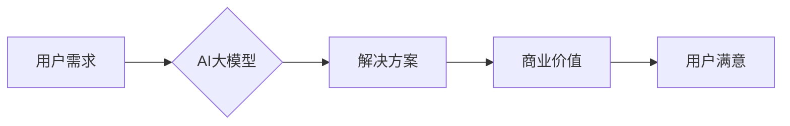

> AI大模型，用户需求，创业，技术趋势，应用场景，未来发展

## 1. 背景介绍

人工智能（AI）技术近年来发展迅速，特别是大模型的涌现，为各行各业带来了前所未有的机遇。AI大模型，是指拥有海量参数和强大的计算能力的深度学习模型，能够在自然语言处理、图像识别、语音合成等领域展现出惊人的能力。

然而，AI大模型的应用并非一帆风顺。如何将这些强大的技术转化为实际的商业价值，并满足不断变化的用户需求，是摆在创业者面前的重大挑战。

## 2. 核心概念与联系

**2.1 AI大模型的定义与特点**

AI大模型是指参数规模庞大、训练数据海量、计算资源消耗巨大的深度学习模型。其特点包括：

* **规模化：** 参数数量通常在数十亿甚至数千亿级别，远超传统机器学习模型。
* **泛化能力强：** 由于训练数据量大，能够学习到更丰富的知识和模式，在不同任务上表现出较强的泛化能力。
* **多模态处理：** 一些大模型能够处理多种数据类型，例如文本、图像、音频等，实现跨模态的理解和生成。

**2.2 用户需求与AI大模型的匹配**

用户需求是AI大模型应用的核心驱动力。不同行业、不同用户群体对AI大模型的需求各不相同。

* **企业级用户：** 寻求提高效率、降低成本、个性化服务的解决方案，例如智能客服、自动化流程、数据分析等。
* **个人用户：** 追求便捷、智能、个性化的体验，例如智能助手、内容创作、娱乐休闲等。

**2.3 创业机会与挑战**

AI大模型的应用为创业者提供了广阔的市场空间，但也面临着诸多挑战：

* **技术门槛高：** 训练和部署大模型需要强大的计算资源和专业技术。
* **数据安全与隐私：** 大模型的训练需要大量数据，如何保障数据安全和用户隐私是一个重要问题。
* **伦理与社会影响：** AI大模型的应用可能带来伦理和社会问题，例如算法偏见、信息操控等。

**2.4 Mermaid 流程图**



## 3. 核心算法原理 & 具体操作步骤

**3.1 算法原理概述**

AI大模型的训练主要基于深度学习算法，例如Transformer、BERT、GPT等。这些算法通过多层神经网络结构，学习数据中的复杂模式和关系。

**3.2 算法步骤详解**

1. **数据预处理：** 将原始数据清洗、格式化、编码等，使其适合模型训练。
2. **模型构建：** 根据任务需求选择合适的深度学习架构，并设置模型参数。
3. **模型训练：** 使用训练数据，通过反向传播算法，调整模型参数，使其能够准确预测或生成目标输出。
4. **模型评估：** 使用测试数据评估模型的性能，例如准确率、召回率、F1-score等。
5. **模型部署：** 将训练好的模型部署到实际应用场景中，提供服务。

**3.3 算法优缺点**

* **优点：** 泛化能力强、学习能力强、能够处理复杂数据。
* **缺点：** 训练成本高、数据依赖性强、解释性差。

**3.4 算法应用领域**

* **自然语言处理：** 文本分类、情感分析、机器翻译、对话系统等。
* **计算机视觉：** 图像识别、物体检测、图像生成等。
* **语音识别：** 语音转文本、语音合成等。
* **推荐系统：** 商品推荐、内容推荐等。

## 4. 数学模型和公式 & 详细讲解 & 举例说明

**4.1 数学模型构建**

AI大模型的训练过程本质上是一个优化问题，目标是找到最优的模型参数，使得模型的预测或生成结果与真实值之间的误差最小。

**4.2 公式推导过程**

常用的损失函数包括均方误差（MSE）、交叉熵损失（Cross-Entropy Loss）等。

* **均方误差（MSE）：**

$$
MSE = \frac{1}{N} \sum_{i=1}^{N} (y_i - \hat{y}_i)^2
$$

其中，$y_i$ 是真实值，$\hat{y}_i$ 是模型预测值，$N$ 是样本数量。

* **交叉熵损失（Cross-Entropy Loss）：**

$$
Cross-Entropy Loss = - \sum_{i=1}^{N} y_i \log(\hat{y}_i)
$$

其中，$y_i$ 是真实标签，$\hat{y}_i$ 是模型预测概率。

**4.3 案例分析与讲解**

例如，在图像分类任务中，可以使用交叉熵损失函数来衡量模型预测结果与真实标签之间的差异。

## 5. 项目实践：代码实例和详细解释说明

**5.1 开发环境搭建**

使用Python语言和深度学习框架TensorFlow或PyTorch搭建开发环境。

**5.2 源代码详细实现**

```python
import tensorflow as tf

# 定义模型结构
model = tf.keras.models.Sequential([
    tf.keras.layers.Conv2D(32, (3, 3), activation='relu', input_shape=(28, 28, 1)),
    tf.keras.layers.MaxPooling2D((2, 2)),
    tf.keras.layers.Flatten(),
    tf.keras.layers.Dense(10, activation='softmax')
])

# 定义损失函数和优化器
model.compile(loss='sparse_categorical_crossentropy', optimizer='adam', metrics=['accuracy'])

# 训练模型
model.fit(x_train, y_train, epochs=10)

# 评估模型
loss, accuracy = model.evaluate(x_test, y_test)
print('Test loss:', loss)
print('Test accuracy:', accuracy)
```

**5.3 代码解读与分析**

这段代码定义了一个简单的卷积神经网络模型，用于手写数字识别任务。

* `tf.keras.models.Sequential` 创建一个顺序模型，层级结构清晰。
* `tf.keras.layers.Conv2D` 定义卷积层，提取图像特征。
* `tf.keras.layers.MaxPooling2D` 定义最大池化层，降低特征维度。
* `tf.keras.layers.Flatten` 将多维特征转换为一维向量。
* `tf.keras.layers.Dense` 定义全连接层，进行分类。
* `model.compile` 配置模型训练参数，包括损失函数、优化器和评价指标。
* `model.fit` 训练模型，使用训练数据进行迭代更新模型参数。
* `model.evaluate` 评估模型性能，使用测试数据计算损失和准确率。

**5.4 运行结果展示**

训练完成后，模型能够对新的手写数字图像进行识别，并输出预测结果。

## 6. 实际应用场景

**6.1 智能客服**

AI大模型可以用于构建智能客服系统，自动回答用户常见问题，提高客户服务效率。

**6.2 内容创作**

AI大模型可以辅助内容创作，例如生成文章、诗歌、剧本等，提高创作效率和灵感。

**6.3 个性化推荐**

AI大模型可以根据用户的兴趣和行为数据，提供个性化的商品、内容、服务推荐。

**6.4 未来应用展望**

AI大模型的应用场景还在不断扩展，未来可能在医疗诊断、教育培训、科学研究等领域发挥重要作用。

## 7. 工具和资源推荐

**7.1 学习资源推荐**

* **书籍：**
    * 《深度学习》
    * 《动手学深度学习》
* **在线课程：**
    * Coursera
    * edX
    * fast.ai

**7.2 开发工具推荐**

* **深度学习框架：** TensorFlow、PyTorch、Keras
* **云计算平台：** AWS、Azure、Google Cloud

**7.3 相关论文推荐**

* **BERT：** Devlin et al. (2018)
* **GPT：** Radford et al. (2019)
* **Transformer：** Vaswani et al. (2017)

## 8. 总结：未来发展趋势与挑战

**8.1 研究成果总结**

近年来，AI大模型取得了显著进展，在多个领域展现出强大的应用潜力。

**8.2 未来发展趋势**

* **模型规模化：** 模型参数规模将继续扩大，提升模型能力。
* **多模态融合：** 模型将能够处理多种数据类型，实现跨模态理解和生成。
* **可解释性增强：** 研究将更加注重模型的可解释性和透明度。

**8.3 面临的挑战**

* **计算资源需求：** 训练大型模型需要大量的计算资源，成本高昂。
* **数据安全与隐私：** 大模型的训练需要大量数据，如何保障数据安全和用户隐私是一个重要问题。
* **伦理与社会影响：** AI大模型的应用可能带来伦理和社会问题，需要谨慎应对。

**8.4 研究展望**

未来研究将重点关注模型效率、可解释性、安全性和伦理问题，推动AI大模型的健康发展。

## 9. 附录：常见问题与解答

**9.1 如何选择合适的AI大模型？**

选择合适的AI大模型需要根据具体任务需求、数据规模、计算资源等因素进行综合考虑。

**9.2 如何训练和部署AI大模型？**

训练和部署AI大模型需要一定的技术基础，可以参考相关教程和文档进行学习。

**9.3 AI大模型的伦理问题有哪些？**

AI大模型的应用可能带来算法偏见、信息操控、隐私泄露等伦理问题，需要引起重视并采取相应的措施。


作者：禅与计算机程序设计艺术 / Zen and the Art of Computer Programming 
<end_of_turn>