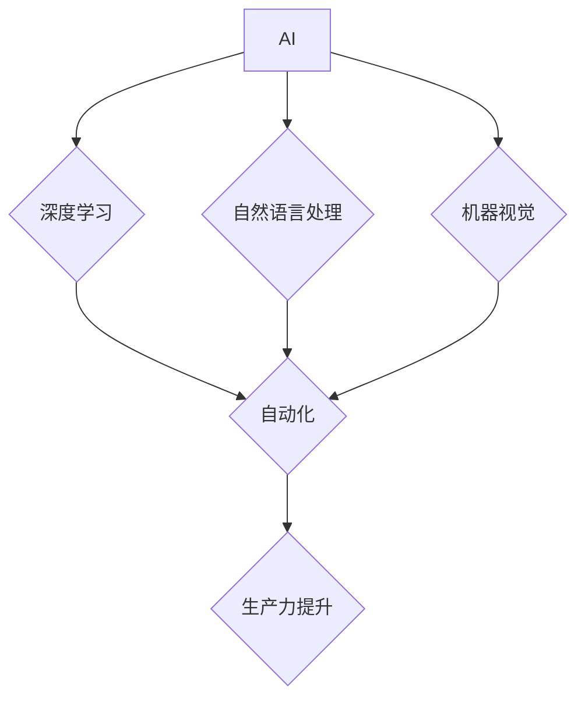

> 人工智能 (AI)
> 生产力
> 深度学习
> 自然语言处理
> 机器视觉
> 自动化
> 效率提升

## 1. 背景介绍

在信息时代，科技进步的步伐从未如此之快。人工智能 (AI) 作为科技发展的重要驱动力，正在深刻地改变着我们的生活和工作方式。从智能手机的语音助手到自动驾驶汽车，AI 的应用场景日益广泛，其带来的生产力革命正在悄然发生。

传统的生产力提升主要依靠人力、资本和技术投入，而 AI 的出现为生产力提升带来了全新的思路和方法。AI 能够通过学习和分析海量数据，自动完成许多重复性、复杂性任务，从而解放人力，提高工作效率。

## 2. 核心概念与联系

**2.1  人工智能 (AI)**

人工智能是指模拟人类智能行为的计算机系统。AI 的目标是让机器能够像人类一样学习、思考、解决问题和做出决策。

**2.2  深度学习 (Deep Learning)**

深度学习是人工智能领域的一个重要分支，它利用多层神经网络来模拟人类大脑的学习过程。深度学习算法能够从海量数据中自动提取特征，并进行复杂的模式识别和预测。

**2.3  自然语言处理 (NLP)**

自然语言处理是指让计算机能够理解和处理人类语言的技术。NLP 涉及到许多子领域，例如文本分类、机器翻译、情感分析等。

**2.4  机器视觉 (Computer Vision)**

机器视觉是指让计算机能够“看”和理解图像的技术。机器视觉应用广泛，例如图像识别、物体检测、视频分析等。

**2.5  自动化 (Automation)**

自动化是指利用技术手段代替人工完成重复性、规则性任务的过程。AI 可以大大提高自动化的效率和智能化水平。

**2.6  生产力 (Productivity)**

生产力是指单位时间内创造的价值。AI 可以通过提高工作效率、优化资源配置等方式，显著提升生产力。

**2.7  AI 与生产力提升的关系**

AI 通过深度学习、NLP、机器视觉等技术手段，实现自动化、智能化，从而提高工作效率、优化资源配置，最终提升生产力。



## 3. 核心算法原理 & 具体操作步骤

### 3.1  算法原理概述

深度学习算法的核心是多层神经网络。神经网络由许多相互连接的神经元组成，每个神经元接收输入信号，进行处理，并输出信号。通过调整神经元之间的连接权重，深度学习算法能够学习数据中的模式和规律。

### 3.2  算法步骤详解

1. **数据预处理:** 将原始数据进行清洗、转换和格式化，使其适合深度学习算法的训练。
2. **网络结构设计:** 根据任务需求设计神经网络的结构，包括神经元的数量、连接方式和激活函数等。
3. **参数初始化:** 为神经网络中的参数（权重和偏置）进行随机初始化。
4. **前向传播:** 将输入数据通过神经网络进行一次传播，得到输出结果。
5. **损失函数计算:** 计算输出结果与真实值的差异，即损失函数的值。
6. **反向传播:** 根据损失函数的梯度，调整神经网络的参数，使损失函数的值最小化。
7. **迭代训练:** 重复前向传播、损失函数计算和反向传播的过程，直到模型达到预期的性能。

### 3.3  算法优缺点

**优点:**

* 能够从海量数据中自动提取特征，无需人工特征工程。
* 能够学习复杂非线性关系，解决传统机器学习算法难以处理的问题。
* 性能优异，在许多领域取得了突破性进展。

**缺点:**

* 训练数据量大，需要大量的计算资源和时间。
* 模型解释性差，难以理解模型的决策过程。
* 对数据质量要求高，数据噪声和偏差会影响模型性能。

### 3.4  算法应用领域

深度学习算法广泛应用于图像识别、语音识别、自然语言处理、机器翻译、推荐系统、医疗诊断等领域。

## 4. 数学模型和公式 & 详细讲解 & 举例说明

### 4.1  数学模型构建

深度学习模型通常采用多层感知机 (MLP) 或卷积神经网络 (CNN) 等结构。

**4.1.1  多层感知机 (MLP)**

MLP 由多个全连接层组成，每个层的神经元都与上一层的每个神经元连接。

**4.1.2  卷积神经网络 (CNN)**

CNN 利用卷积层和池化层来提取图像特征。卷积层通过卷积核对图像进行卷积运算，提取图像局部特征。池化层对卷积层的输出进行降维，减少计算量。

### 4.2  公式推导过程

深度学习算法的训练过程基于梯度下降优化算法。

**4.2.1  损失函数:**

$$
L = \frac{1}{N} \sum_{i=1}^{N} \mathcal{L}(y_i, \hat{y}_i)
$$

其中，$L$ 是损失函数，$N$ 是样本数量，$\mathcal{L}$ 是单个样本的损失函数，$y_i$ 是真实值，$\hat{y}_i$ 是预测值。

**4.2.2  梯度下降:**

$$
\theta = \theta - \alpha \nabla L(\theta)
$$

其中，$\theta$ 是模型参数，$\alpha$ 是学习率，$\nabla L(\theta)$ 是损失函数对参数的梯度。

### 4.3  案例分析与讲解

**4.3.1  图像分类:**

使用 CNN 模型对图像进行分类。训练数据包括许多标记好的图像，模型学习图像特征，并预测图像所属的类别。

**4.3.2  机器翻译:**

使用 RNN 模型进行机器翻译。训练数据包括许多语言对的文本对，模型学习语言之间的映射关系，并翻译文本。

## 5. 项目实践：代码实例和详细解释说明

### 5.1  开发环境搭建

使用 Python 语言和 TensorFlow 或 PyTorch 深度学习框架进行开发。

### 5.2  源代码详细实现

```python
import tensorflow as tf

# 定义模型结构
model = tf.keras.models.Sequential([
    tf.keras.layers.Conv2D(32, (3, 3), activation='relu', input_shape=(28, 28, 1)),
    tf.keras.layers.MaxPooling2D((2, 2)),
    tf.keras.layers.Conv2D(64, (3, 3), activation='relu'),
    tf.keras.layers.MaxPooling2D((2, 2)),
    tf.keras.layers.Flatten(),
    tf.keras.layers.Dense(10, activation='softmax')
])

# 编译模型
model.compile(optimizer='adam',
              loss='sparse_categorical_crossentropy',
              metrics=['accuracy'])

# 训练模型
model.fit(x_train, y_train, epochs=5)

# 评估模型
loss, accuracy = model.evaluate(x_test, y_test)
print('Test loss:', loss)
print('Test accuracy:', accuracy)
```

### 5.3  代码解读与分析

* 代码定义了一个简单的 CNN 模型，用于手写数字识别任务。
* 模型包含两个卷积层、两个池化层、一个全连接层和一个输出层。
* 模型使用 Adam 优化器、交叉熵损失函数和准确率作为评估指标。
* 模型使用训练数据进行训练，并使用测试数据进行评估。

### 5.4  运行结果展示

训练完成后，模型能够准确识别手写数字。

## 6. 实际应用场景

### 6.1  智能客服

AI 驱动的智能客服能够自动回答客户常见问题，提高客户服务效率。

### 6.2  个性化推荐

AI 可以分析用户的行为数据，提供个性化的商品或内容推荐。

### 6.3  医疗诊断

AI 可以辅助医生进行疾病诊断，提高诊断准确率。

### 6.4  未来应用展望

AI 将在更多领域得到应用，例如自动驾驶、机器人、金融、教育等。

## 7. 工具和资源推荐

### 7.1  学习资源推荐

* **在线课程:** Coursera, edX, Udacity
* **书籍:** 深度学习，机器学习

### 7.2  开发工具推荐

* **深度学习框架:** TensorFlow, PyTorch
* **编程语言:** Python

### 7.3  相关论文推荐

* **ImageNet Classification with Deep Convolutional Neural Networks**
* **Attention Is All You Need**

## 8. 总结：未来发展趋势与挑战

### 8.1  研究成果总结

AI 技术取得了显著进展，在图像识别、语音识别、自然语言处理等领域取得了突破性成果。

### 8.2  未来发展趋势

* **模型规模和复杂度提升:** 模型参数数量和层数将继续增加，模型能力将进一步增强。
* **跨模态学习:** 模型将能够处理多种模态数据，例如文本、图像、音频等。
* **可解释性增强:** 研究将更加注重模型的解释性和透明度。

### 8.3  面临的挑战

* **数据获取和隐私保护:** 训练高质量的 AI 模型需要大量数据，如何获取和保护数据隐私是一个重要挑战。
* **计算资源需求:** 训练大型 AI 模型需要大量的计算资源，如何降低计算成本是一个关键问题。
* **伦理和社会影响:** AI 技术的应用可能带来伦理和社会问题，需要进行深入研究和探讨。

### 8.4  研究展望

未来 AI 研究将更加注重模型的泛化能力、鲁棒性、可解释性和安全性，并探索 AI 与人类的协同合作模式。

## 9. 附录：常见问题与解答

**9.1  什么是深度学习？**

深度学习是一种机器学习方法，它利用多层神经网络来模拟人类大脑的学习过程。

**9.2  深度学习有哪些应用场景？**

深度学习应用广泛，例如图像识别、语音识别、自然语言处理、机器翻译、推荐系统等。

**9.3  如何学习深度学习？**

可以学习在线课程、阅读书籍、参加培训等方式。

**9.4  深度学习需要哪些工具和资源？**

需要 Python 语言、深度学习框架 (例如 TensorFlow, PyTorch) 和计算资源。


作者：禅与计算机程序设计艺术 / Zen and the Art of Computer Programming 
<end_of_turn>