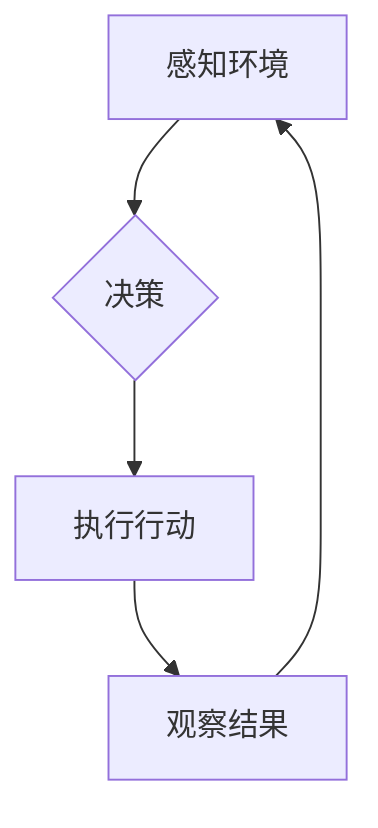

>  * 智能代理
>  * 投资策略
>  * 机器学习
>  * 深度强化学习
>  * 算法创新
>  * 风险评估
>  * 投资回报

## 1. 背景介绍

近年来，人工智能（AI）技术取得了飞速发展，其中智能代理（Agent）作为AI的核心应用之一，展现出巨大的潜力。智能代理是指能够感知环境、做出决策并与环境交互的智能体。它们广泛应用于各个领域，例如游戏、机器人、金融、医疗等。

智能代理的爆火与投资人态度密切相关。投资人对智能代理技术的投资热情不断升温，这主要源于以下几个方面：

* **技术突破:** 深度强化学习（Deep Reinforcement Learning）等算法的突破，使得智能代理能够学习更复杂的行为策略，并取得更优的性能。
* **市场需求:** 智能代理能够自动化完成许多任务，提高效率和降低成本，满足了市场对智能化解决方案的日益增长的需求。
* **投资回报:** 智能代理技术的应用潜力巨大，有望带来丰厚的投资回报。

## 2. 核心概念与联系

智能代理的核心概念包括：

* **感知:** 智能代理需要感知周围环境的信息，例如传感器数据、文本信息、图像信息等。
* **决策:** 智能代理需要根据感知到的信息做出决策，选择最优的行动。
* **执行:** 智能代理需要执行决策，与环境交互，改变环境状态。
* **学习:** 智能代理需要通过学习，不断改进决策策略，提高性能。

**Mermaid 流程图:**



## 3. 核心算法原理 & 具体操作步骤

### 3.1  算法原理概述

深度强化学习（Deep Reinforcement Learning）是智能代理的核心算法之一。它结合了深度学习和强化学习的优势，能够学习复杂的行为策略。

深度强化学习的核心思想是：智能代理通过与环境交互，获得奖励信号，并根据奖励信号调整行为策略，最终学习到最优的策略。

### 3.2  算法步骤详解

1. **环境建模:** 建立智能代理与环境的交互模型，定义状态空间、动作空间和奖励函数。
2. **神经网络构建:** 使用深度神经网络作为策略网络，将状态映射到动作概率分布。
3. **训练过程:**
    * 智能代理从初始状态开始，随机选择动作并与环境交互。
    * 环境返回状态更新和奖励信号。
    * 智能代理根据奖励信号更新策略网络参数，提高策略的优劣。
4. **策略评估:** 在训练完成后，评估策略网络的性能，例如在测试环境中获得的平均奖励。

### 3.3  算法优缺点

**优点:**

* 能够学习复杂的行为策略。
* 适应性强，能够应对动态变化的环境。

**缺点:**

* 训练过程复杂，需要大量的数据和计算资源。
* 容易陷入局部最优解。

### 3.4  算法应用领域

* **游戏:** 训练智能代理玩游戏，例如围棋、Go、Dota 2 等。
* **机器人:** 训练智能代理控制机器人完成任务，例如导航、抓取、组装等。
* **金融:** 训练智能代理进行交易策略优化、风险管理等。
* **医疗:** 训练智能代理辅助医生诊断疾病、制定治疗方案等。

## 4. 数学模型和公式 & 详细讲解 & 举例说明

### 4.1  数学模型构建

智能代理的决策过程可以用马尔可夫决策过程（Markov Decision Process，MDP）来建模。

MDP 由以下几个要素组成：

* **状态空间 (S):** 智能代理可能处于的所有状态的集合。
* **动作空间 (A):** 智能代理可以执行的所有动作的集合。
* **转移概率 (P):** 从一个状态执行一个动作后转移到另一个状态的概率。
* **奖励函数 (R):** 智能代理在某个状态执行某个动作后获得的奖励。
* **折扣因子 (γ):** 用于权衡未来奖励和当前奖励的因子。

### 4.2  公式推导过程

智能代理的目标是学习一个策略 π，该策略能够最大化其累积奖励。

累积奖励可以用以下公式表示：

$$
R_t = r_t + \gamma r_{t+1} + \gamma^2 r_{t+2} + ...
$$

其中：

* $R_t$ 是从时间步 t 开始的累积奖励。
* $r_t$ 是时间步 t 获得的奖励。
* $\gamma$ 是折扣因子。

策略 π 的价值函数 $V^\pi(s)$ 表示智能代理在状态 s 下执行策略 π 的累积奖励期望。

价值函数可以用以下公式表示：

$$
V^\pi(s) = E_{\pi}[R_t | S_t = s]
$$

其中：

* $E_{\pi}$ 表示根据策略 π 采样的期望。

### 4.3  案例分析与讲解

例如，在玩游戏时，智能代理的目标是获得尽可能高的分数。

状态空间可以是游戏中的场景，动作空间可以是游戏中的操作，奖励函数可以是获得的分数。

智能代理可以通过深度强化学习算法学习到一个策略，该策略能够最大化其在游戏中的分数。

## 5. 项目实践：代码实例和详细解释说明

### 5.1  开发环境搭建

* Python 3.x
* TensorFlow 或 PyTorch
* OpenAI Gym

### 5.2  源代码详细实现

```python
import gym
import tensorflow as tf

# 定义神经网络模型
model = tf.keras.Sequential([
    tf.keras.layers.Dense(128, activation='relu'),
    tf.keras.layers.Dense(64, activation='relu'),
    tf.keras.layers.Dense(env.action_space.n, activation='softmax')
])

# 定义损失函数和优化器
loss_fn = tf.keras.losses.CategoricalCrossentropy()
optimizer = tf.keras.optimizers.Adam()

# 训练循环
for episode in range(num_episodes):
    state = env.reset()
    done = False
    while not done:
        # 选择动作
        action_probs = model(state)
        action = tf.random.categorical(tf.math.log(action_probs), num_samples=1)[0, 0]

        # 执行动作
        next_state, reward, done, _ = env.step(action)

        # 更新状态
        state = next_state

        # 计算损失
        with tf.GradientTape() as tape:
            loss = loss_fn(action_probs, tf.one_hot(action, depth=env.action_space.n))

        # 反向传播
        gradients = tape.gradient(loss, model.trainable_variables)
        optimizer.apply_gradients(zip(gradients, model.trainable_variables))

# 保存模型
model.save('agent_model.h5')
```

### 5.3  代码解读与分析

* 代码首先定义了神经网络模型，该模型使用深度神经网络来学习智能代理的行为策略。
* 然后定义了损失函数和优化器，用于训练神经网络模型。
* 训练循环中，智能代理与环境交互，根据环境反馈更新模型参数。
* 最后，保存训练好的模型。

### 5.4  运行结果展示

训练完成后，可以将训练好的模型应用于实际场景，例如玩游戏、控制机器人等。

## 6. 实际应用场景

### 6.1  金融领域

* **投资策略优化:** 智能代理可以分析市场数据，学习有效的投资策略，并自动进行交易。
* **风险管理:** 智能代理可以识别潜在的风险，并采取措施降低风险。
* **欺诈检测:** 智能代理可以分析交易数据，识别异常交易行为，防止欺诈。

### 6.2  医疗领域

* **疾病诊断:** 智能代理可以分析患者的病历、检查结果等信息，辅助医生诊断疾病。
* **治疗方案制定:** 智能代理可以根据患者的病情和个人特征，制定个性化的治疗方案。
* **药物研发:** 智能代理可以加速药物研发过程，例如筛选潜在的药物候选物。

### 6.3  其他领域

* **物流配送:** 智能代理可以优化物流配送路线，提高效率和降低成本。
* **客户服务:** 智能代理可以提供自动化的客户服务，例如回答常见问题、处理订单等。
* **教育:** 智能代理可以提供个性化的学习辅导，帮助学生提高学习效率。

### 6.4  未来应用展望

随着人工智能技术的不断发展，智能代理的应用场景将更加广泛。

未来，智能代理有望在以下领域发挥更大的作用：

* **自动驾驶:** 智能代理可以控制自动驾驶汽车，实现无人驾驶。
* **机器人协作:** 智能代理可以协同工作，完成复杂的任务。
* **个性化服务:** 智能代理可以提供更加个性化的服务，满足用户的个性化需求。

## 7. 工具和资源推荐

### 7.1  学习资源推荐

* **书籍:**
    * Reinforcement Learning: An Introduction by Richard S. Sutton and Andrew G. Barto
    * Deep Reinforcement Learning Hands-On by Maxim Lapan
* **在线课程:**
    * Deep Reinforcement Learning Specialization by DeepLearning.AI
    * Reinforcement Learning by David Silver (University of DeepMind)

### 7.2  开发工具推荐

* **TensorFlow:** 开源深度学习框架
* **PyTorch:** 开源深度学习框架
* **OpenAI Gym:** 机器学习算法测试环境

### 7.3  相关论文推荐

* **Deep Q-Network (DQN):** Mnih et al. (2015)
* **Proximal Policy Optimization (PPO):** Schulman et al. (2017)
* **Trust Region Policy Optimization (TRPO):** Schulman et al. (2015)

## 8. 总结：未来发展趋势与挑战

### 8.1  研究成果总结

近年来，智能代理技术取得了显著进展，例如在游戏、机器人等领域取得了突破性成果。

深度强化学习算法的突破，使得智能代理能够学习更复杂的行为策略，并取得更优的性能。

### 8.2  未来发展趋势

* **更强大的算法:** 研究更强大的深度强化学习算法，例如结合强化学习和迁移学习、进化算法等。
* **更复杂的场景:** 将智能代理应用于更复杂的场景，例如自动驾驶、机器人协作等。
* **更安全的代理:** 研究更安全的智能代理，避免代理行为出现不可预知或有害的结果。

### 8.3  面临的挑战

* **数据需求:** 深度强化学习算法需要大量的数据进行训练，获取高质量的数据仍然是一个挑战。
* **计算资源:** 训练深度强化学习模型需要大量的计算资源，成本较高。
* **伦理问题:** 智能代理的应用可能会带来伦理问题，例如代理的决策是否公平、透明、可解释等。

### 8.4  研究展望

未来，智能代理技术将继续发展，并对社会产生深远的影响。

研究人员需要不断探索新的算法、新的应用场景，并解决技术和伦理方面的挑战，推动智能代理技术朝着更加安全、可靠、可持续的方向发展。

## 9. 附录：常见问题与解答

**Q1: 智能代理和传统程序有什么区别？**

**A1:** 传统程序是按照预先定义的规则执行任务，而智能代理能够学习和适应环境，并根据环境变化调整行为策略。

**Q2: 深度强化学习算法是如何工作的？**

**A2:** 深度强化学习算法通过与环境交互，获得奖励信号，并根据奖励信号调整行为策略，最终学习到最优的策略。

**Q3: 智能代理的应用场景有哪些？**

**A3:** 智能代理的应用场景非常广泛，例如游戏、机器人、金融、医疗等。

**作者：禅与计算机程序设计艺术 / Zen and the Art of Computer Programming**


<end_of_turn>