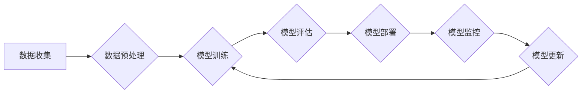

>  持续性、深度学习、模型训练、模型部署、人工智能、机器学习

## 1. 背景介绍

在人工智能领域，模型的持续性一直是一个重要的议题。随着深度学习技术的快速发展，我们构建了越来越复杂的模型，这些模型在各个领域都取得了令人瞩目的成果。然而，这些模型的部署和维护却面临着诸多挑战。

Andrej Karpathy，一位享誉全球的深度学习专家，曾多次强调模型持续性的重要性。他指出，仅仅训练出一个优秀的模型并不能保证其长期有效，我们需要关注模型在部署环境中的持续性能，并采取措施确保模型能够随着时间推移保持其效能。

## 2. 核心概念与联系

模型持续性是指模型在部署环境中，能够持续保持其预期性能的能力。它涵盖了多个方面，包括：

* **数据漂移:**  随着时间推移，输入数据的分布可能会发生变化，导致模型性能下降。
* **概念漂移:**  现实世界中的概念可能会随着时间推移而发生变化，导致模型无法准确理解新的输入。
* **模型更新:**  我们需要定期更新模型以适应新的数据和概念。
* **资源限制:**  部署环境可能存在资源限制，例如计算能力和存储空间，这可能会影响模型的性能。

**Mermaid 流程图:**



## 3. 核心算法原理 & 具体操作步骤

### 3.1  算法原理概述

模型持续性是一个复杂的问题，没有单一的解决方案。不同的场景需要采用不同的策略。一些常用的方法包括：

* **在线学习:**  在线学习允许模型在部署环境中不断学习新的数据，从而适应数据分布的变化。
* **迁移学习:**  迁移学习利用预训练模型的知识，在新的任务上进行训练，可以减少训练数据和时间。
* **联邦学习:**  联邦学习允许模型在多个设备上进行训练，而无需将数据集中到一个中心服务器，可以保护用户隐私。

### 3.2  算法步骤详解

**在线学习:**

1. 收集新的数据。
2. 更新模型参数，以适应新的数据分布。
3. 评估模型性能。
4. 重复步骤 1-3。

**迁移学习:**

1. 在一个大规模数据集上预训练一个模型。
2. 将预训练模型迁移到新的任务上。
3. 使用新的任务数据进行微调。

**联邦学习:**

1. 将模型参数分发到多个设备。
2. 在每个设备上进行本地训练。
3. 将模型更新发送回中央服务器。
4. 在中央服务器上聚合模型更新。
5. 将聚合后的模型参数分发回每个设备。

### 3.3  算法优缺点

| 算法 | 优点 | 缺点 |
|---|---|---|
| 在线学习 | 可以实时适应数据分布变化 | 需要持续收集和处理数据 |
| 迁移学习 | 可以减少训练数据和时间 | 需要一个合适的预训练模型 |
| 联邦学习 | 可以保护用户隐私 | 需要协调多个设备的训练 |

### 3.4  算法应用领域

* **在线广告:**  在线广告平台需要实时调整广告投放策略，以适应用户的行为变化。
* **推荐系统:**  推荐系统需要不断学习用户的偏好，以提供更精准的推荐。
* **医疗诊断:**  医疗诊断系统需要能够识别新的疾病和症状。
* **自动驾驶:**  自动驾驶系统需要能够适应不同的道路和交通状况。

## 4. 数学模型和公式 & 详细讲解 & 举例说明

### 4.1  数学模型构建

在线学习可以使用贝叶斯更新公式来更新模型参数。假设模型参数为 θ，新的数据为 (x, y)，则贝叶斯更新公式为：

$$
\theta' = \frac{\theta \cdot P(\theta) + y \cdot P(y|x, \theta)}{\frac{\theta \cdot P(\theta) + y \cdot P(y|x, \theta)}{P(y|x, \theta)}}
$$

其中：

* θ' 是更新后的模型参数。
* θ 是之前的模型参数。
* P(θ) 是先验概率分布。
* P(y|x, θ) 是似然函数。

### 4.2  公式推导过程

贝叶斯更新公式的推导过程基于贝叶斯定理：

$$
P(A|B) = \frac{P(B|A) \cdot P(A)}{P(B)}
$$

在在线学习中，我们想要更新模型参数 θ 的后验概率分布 P(θ|D)，其中 D 是训练数据。根据贝叶斯定理，我们可以得到：

$$
P(\theta|D) = \frac{P(D|\theta) \cdot P(\theta)}{P(D)}
$$

其中：

* P(D|θ) 是似然函数，表示在给定模型参数 θ 的情况下观察到训练数据 D 的概率。
* P(θ) 是先验概率分布，表示在没有观察到训练数据之前对模型参数 θ 的信念。
* P(D) 是边缘概率，表示观察到训练数据 D 的概率。

### 4.3  案例分析与讲解

假设我们有一个简单的线性回归模型，模型参数为 θ = (w, b)，其中 w 是权重，b 是偏差。我们使用贝叶斯更新公式来更新模型参数。

* 先验概率分布 P(θ) 可以设置为高斯分布。
* 似然函数 P(D|θ) 可以设置为高斯分布，其均值和方差由训练数据决定。
* 边缘概率 P(D) 可以通过积分计算得到。

通过贝叶斯更新公式，我们可以根据新的数据更新模型参数，从而使模型能够更好地拟合数据。

## 5. 项目实践：代码实例和详细解释说明

### 5.1  开发环境搭建

* Python 3.x
* TensorFlow 或 PyTorch
* Jupyter Notebook

### 5.2  源代码详细实现

```python
import tensorflow as tf

# 定义模型
model = tf.keras.models.Sequential([
    tf.keras.layers.Dense(10, activation='relu', input_shape=(10,)),
    tf.keras.layers.Dense(1)
])

# 定义损失函数和优化器
loss_fn = tf.keras.losses.MeanSquaredError()
optimizer = tf.keras.optimizers.Adam(learning_rate=0.01)

# 定义训练步骤
@tf.function
def train_step(images, labels):
    with tf.GradientTape() as tape:
        predictions = model(images)
        loss = loss_fn(labels, predictions)
    gradients = tape.gradient(loss, model.trainable_variables)
    optimizer.apply_gradients(zip(gradients, model.trainable_variables))
    return loss

# 训练模型
epochs = 10
for epoch in range(epochs):
    for batch in dataset:
        images, labels = batch
        loss = train_step(images, labels)
        print(f'Epoch: {epoch+1}, Loss: {loss.numpy()}')

# 保存模型
model.save('my_model.h5')
```

### 5.3  代码解读与分析

* 代码首先定义了一个简单的线性回归模型。
* 然后定义了损失函数和优化器。
* 训练步骤使用 `tf.function` 进行装饰，以提高训练效率。
* 训练模型时，循环遍历数据集，并使用训练步骤更新模型参数。
* 最后，将训练好的模型保存为 `.h5` 文件。

### 5.4  运行结果展示

训练完成后，我们可以使用保存的模型进行预测。

## 6. 实际应用场景

模型持续性在各个领域都有着重要的应用场景：

* **金融领域:**  金融模型需要能够适应不断变化的市场环境，例如股票价格预测、欺诈检测等。
* **医疗领域:**  医疗模型需要能够识别新的疾病和症状，例如癌症诊断、药物研发等。
* **制造业:**  制造业模型需要能够适应生产过程中的变化，例如设备故障预测、质量控制等。

### 6.4  未来应用展望

随着人工智能技术的不断发展，模型持续性将变得越来越重要。未来，我们将看到更多新的方法和技术用于解决模型持续性问题，例如：

* **自适应学习:**  模型能够根据环境变化自动调整其学习策略。
* **可解释性:**  模型能够解释其决策过程，以便我们更好地理解其行为。
* **联邦学习:**  模型能够在多个设备上进行训练，而无需将数据集中到一个中心服务器，可以保护用户隐私。

## 7. 工具和资源推荐

### 7.1  学习资源推荐

* **书籍:**
    * "Deep Learning" by Ian Goodfellow, Yoshua Bengio, and Aaron Courville
    * "Hands-On Machine Learning with Scikit-Learn, Keras & TensorFlow" by Aurélien Géron
* **在线课程:**
    * Coursera: Deep Learning Specialization
    * Udacity: Deep Learning Nanodegree

### 7.2  开发工具推荐

* **TensorFlow:**  一个开源的机器学习框架。
* **PyTorch:**  一个开源的机器学习框架。
* **Scikit-learn:**  一个用于机器学习的 Python 库。

### 7.3  相关论文推荐

* "Continual Learning: A Review" by  Zenon Christodoulatos, et al.
* "Federated Learning: Strategies for Improving Communication Efficiency" by  Timothy K. Mount, et al.

## 8. 总结：未来发展趋势与挑战

### 8.1  研究成果总结

模型持续性是一个重要的研究方向，已经取得了一些进展。在线学习、迁移学习和联邦学习等方法为解决模型持续性问题提供了新的思路。

### 8.2  未来发展趋势

未来，模型持续性研究将朝着以下方向发展：

* **更有效的持续学习算法:**  开发能够更有效地适应数据分布变化的算法。
* **更强大的可解释性:**  使模型能够更好地解释其决策过程，以便我们更好地理解其行为。
* **更广泛的应用场景:**  将模型持续性技术应用到更多领域，例如医疗、金融、制造业等。

### 8.3  面临的挑战

模型持续性研究还面临着一些挑战：

* **数据漂移:**  数据分布变化的速度和方向难以预测。
* **概念漂移:**  现实世界中的概念可能会发生变化，导致模型无法准确理解新的输入。
* **资源限制:**  部署环境可能存在资源限制，例如计算能力和存储空间。

### 8.4  研究展望

尽管面临着挑战，但模型持续性研究的前景依然光明。随着人工智能技术的不断发展，我们相信将能够开发出更有效的解决方案，使模型能够持续保持其效能，为我们带来更多价值。

## 9. 附录：常见问题与解答

* **Q: 如何应对数据漂移？**

* **A:**  可以使用在线学习、迁移学习等方法来应对数据漂移。

* **Q: 如何应对概念漂移？**

* **A:**  可以使用迁移学习、知识蒸馏等方法来应对概念漂移。

* **Q: 如何在资源有限的部署环境中部署模型？**

* **A:**  可以使用模型压缩、量化等方法来减小模型大小，提高模型效率。


作者：禅与计算机程序设计艺术 / Zen and the Art of Computer Programming 
<end_of_turn>