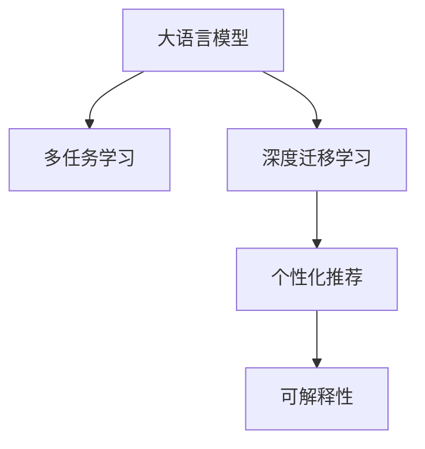
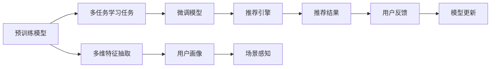

                 

# 大模型推荐中的用户体验提升新思路

## 1. 背景介绍

### 1.1 问题由来

在当下信息爆炸的时代，用户在面对海量的内容时，难以从中甄别出最符合自己需求和兴趣的内容。推荐系统作为一种智能化的信息推荐工具，旨在为用户提供个性化的信息和服务，以提升用户体验。然而，尽管推荐系统已广泛应用于电商、视频、社交媒体等多个领域，但传统推荐系统的推荐效果和用户体验仍存在诸多不足。

具体问题包括：
- **推荐效果不够精准**：传统推荐系统多依赖用户历史行为数据进行推荐，忽略了用户多维度的偏好和情境变化。
- **推荐内容单一**：推荐内容多集中于单一类型或领域，难以满足用户多样化、多元化的需求。
- **推荐过程不透明**：推荐系统往往作为一个"黑盒"模型，用户难以了解推荐依据，导致信任感下降。

这些问题不仅影响了用户的推荐效果和满意度，也阻碍了推荐系统在更多场景中的应用推广。为了解决这些问题，提升用户体验，大模型推荐方法应运而生。

### 1.2 问题核心关键点

大模型推荐方法依托于预训练语言模型的强大语言理解和生成能力，通过深度迁移学习和多任务训练，使得推荐系统能够更好地理解用户的多维度需求，提供更个性化、多场景化的推荐内容。其核心关键点包括：

1. **预训练语言模型**：通过大规模无标签文本语料进行预训练，学习到通用语言知识，具备强大的语言理解能力和生成能力。
2. **多任务学习**：在大模型基础上，通过多任务训练学习用户的多维度需求，如兴趣、情感、行为等。
3. **深度迁移学习**：通过任务间的知识传递和融合，提升模型的泛化能力和推荐效果。
4. **个性化推荐**：通过细粒度的用户画像构建和场景感知，提供更加个性化的推荐服务。
5. **可解释性**：通过多维度的解释和反馈机制，增强用户对推荐系统的信任感。

## 2. 核心概念与联系

### 2.1 核心概念概述

为了更好地理解大模型推荐方法，本节将介绍几个密切相关的核心概念：

- **大语言模型**：通过大规模无标签文本语料进行预训练，学习到通用语言知识，具备强大的语言理解和生成能力的模型。
- **多任务学习**：通过学习多个相关但不同的任务，增强模型对复杂场景的理解和适应能力。
- **深度迁移学习**：通过预训练和微调之间的知识传递和融合，提升模型的泛化能力和推荐效果。
- **个性化推荐**：通过精细化的用户画像和场景感知，提供更符合用户个性需求的推荐服务。
- **可解释性**：通过多维度解释和反馈机制，增强用户对推荐系统的理解和信任。

这些核心概念之间通过以下Mermaid流程图展示其联系：



### 2.2 核心概念原理和架构的 Mermaid 流程图



这个流程图展示了预训练模型通过多任务学习任务，微调模型学习多维度特征，并在推荐引擎中进行个性化推荐的过程。

## 3. 核心算法原理 & 具体操作步骤

### 3.1 算法原理概述

大模型推荐方法的核心在于通过预训练模型的强大语言理解能力，学习用户的多维度需求，并进行跨任务的知识传递和融合，从而提升推荐系统的精准度和个性化水平。其核心算法原理包括以下几个方面：

1. **多任务学习**：将推荐任务划分为多个相关但不同的子任务，通过在预训练模型上对多个任务进行联合训练，学习用户的多维度需求。

2. **深度迁移学习**：在多任务学习的基础上，对特定推荐任务进行微调，使模型在特定任务上取得更好的表现。

3. **个性化推荐**：在微调模型中，通过进一步的参数优化，增加模型对用户个性化需求的敏感度，提供更符合用户期望的推荐服务。

4. **可解释性**：在推荐过程中，通过多维度的解释和反馈机制，增强用户对推荐结果的理解和信任，提升用户体验。

### 3.2 算法步骤详解

以下将详细介绍大模型推荐方法的详细步骤：

**Step 1: 准备预训练模型和数据集**
- 选择合适的预训练语言模型作为初始化参数，如BERT、GPT等。
- 准备推荐任务相关的多任务数据集，包括用户行为、兴趣、情感等多维特征数据。

**Step 2: 添加多任务学习层**
- 在预训练模型的基础上，添加多个相关但不同的子任务学习层，如用户兴趣分类、情感分析等。
- 设计合适的损失函数，如交叉熵损失、F1损失等，计算模型在各个子任务上的表现。

**Step 3: 设置微调超参数**
- 选择合适的优化算法及其参数，如AdamW、SGD等，设置学习率、批大小、迭代轮数等。
- 设置正则化技术及强度，包括权重衰减、Dropout、Early Stopping等。
- 确定冻结预训练参数的策略，如仅微调顶层，或全部参数都参与微调。

**Step 4: 执行多任务学习**
- 将训练集数据分批次输入模型，前向传播计算损失函数。
- 反向传播计算参数梯度，根据设定的优化算法和学习率更新模型参数。
- 周期性在验证集上评估模型性能，根据性能指标决定是否触发Early Stopping。
- 重复上述步骤直到满足预设的迭代轮数或Early Stopping条件。

**Step 5: 执行深度迁移学习**
- 在特定推荐任务上微调多任务学习模型，添加任务适配层和损失函数。
- 设置微调超参数，包括学习率、批大小、迭代轮数等。
- 执行梯度训练，评估模型在推荐任务上的表现，直至收敛。

**Step 6: 执行个性化推荐**
- 在微调模型中，通过进一步的参数优化，增加模型对用户个性化需求的敏感度。
- 使用多维特征抽取，结合用户画像和场景感知，进行个性化推荐。
- 评估推荐结果，收集用户反馈，进行模型迭代更新。

**Step 7: 提供推荐结果**
- 将个性化推荐结果输出给用户，通过多维度解释和反馈机制，提升用户满意度。

### 3.3 算法优缺点

大模型推荐方法具有以下优点：
1. **精准度提升**：通过多任务学习和深度迁移学习，能够更好地理解用户的多维度需求，提升推荐效果。
2. **泛化能力强**：预训练模型通过大规模无标签数据学习通用语言知识，具备较强的泛化能力，能适应不同领域和场景的推荐任务。
3. **灵活性高**：多任务学习方式使得推荐模型能够同时学习多个任务，提升模型的灵活性和适应性。
4. **可解释性强**：通过多维度解释和反馈机制，增强用户对推荐系统的理解和信任。

同时，该方法也存在以下局限性：
1. **数据需求高**：多任务学习需要大量标注数据进行训练，获取高质量数据成本较高。
2. **计算复杂**：多任务学习和深度迁移学习需要较高的计算资源和训练时间。
3. **模型复杂**：模型结构较为复杂，增加了模型的推理和存储成本。
4. **公平性问题**：多任务学习可能导致模型对某些子任务的学习优先级较高，影响模型的公平性。

尽管存在这些局限性，但就目前而言，大模型推荐方法在大规模推荐系统中的应用仍展现出巨大潜力。未来相关研究的重点在于如何进一步降低数据需求，提高模型的计算效率和可解释性，同时兼顾推荐效果和公平性等因素。

### 3.4 算法应用领域

大模型推荐方法已经在多个领域得到了广泛应用，例如：

- **电商推荐**：根据用户的历史浏览记录、评分数据、搜索行为等，推荐符合用户兴趣的商品。
- **视频推荐**：分析用户的观看历史和评分数据，推荐符合用户兴趣的视频内容。
- **社交媒体推荐**：根据用户的社交行为和兴趣标签，推荐相关的内容和用户。
- **旅游推荐**：根据用户的旅游偏好和历史行程记录，推荐旅游目的地和景点。
- **新闻推荐**：根据用户的历史阅读记录和兴趣标签，推荐相关的新闻文章。

除了上述这些经典应用场景，大模型推荐方法也被创新性地应用于更多领域，如可控内容生成、智能客服、数据增强等，为推荐系统带来了新的突破。随着预训练模型和推荐方法的不断进步，相信推荐系统将在更多领域大放异彩。

## 4. 数学模型和公式 & 详细讲解 & 举例说明

### 4.1 数学模型构建

本节将使用数学语言对大模型推荐方法进行更加严格的刻画。

假设推荐任务 $T$ 包括 $K$ 个子任务，记预训练模型为 $M_{\theta}:\mathcal{X} \rightarrow \mathcal{Y}$，其中 $\mathcal{X}$ 为输入空间，$\mathcal{Y}$ 为输出空间，$\theta \in \mathbb{R}^d$ 为模型参数。多任务学习数据集为 $D=\{(x_i,y_i^k)\}_{i=1}^N, x_i \in \mathcal{X}, y_i^k \in \{0,1\}$，其中 $y_i^k$ 表示第 $i$ 个样本在第 $k$ 个子任务上的标签。

定义模型 $M_{\theta}$ 在输入 $x$ 上的输出为 $M_{\theta}(x) \in [0,1]^K$，表示模型在 $K$ 个子任务上的预测概率。多任务学习损失函数定义为：

$$
\mathcal{L}(\theta) = \frac{1}{N} \sum_{i=1}^N \sum_{k=1}^K \ell(M_{\theta}(x_i),y_i^k)
$$

其中 $\ell$ 为针对第 $k$ 个子任务设计的损失函数，如交叉熵损失。

### 4.2 公式推导过程

以下我们以情感分析任务为例，推导多任务学习模型的损失函数及其梯度的计算公式。

假设模型 $M_{\theta}$ 在输入 $x$ 上的输出为 $\hat{y}=M_{\theta}(x) \in [0,1]^K$，表示模型在 $K$ 个子任务上的预测概率。真实标签 $y^k \in \{0,1\}$。则多任务学习的交叉熵损失函数定义为：

$$
\ell(M_{\theta}(x),y^k) = -\sum_{i=1}^K y_i^k \log \hat{y}_i^k + (1-y_i^k) \log (1-\hat{y}_i^k)
$$

将其代入多任务学习损失函数，得：

$$
\mathcal{L}(\theta) = -\frac{1}{N}\sum_{i=1}^N \sum_{k=1}^K [y_i^k \log \hat{y}_i^k + (1-y_i^k) \log (1-\hat{y}_i^k)]
$$

根据链式法则，损失函数对参数 $\theta_k$ 的梯度为：

$$
\frac{\partial \mathcal{L}(\theta)}{\partial \theta_k} = -\frac{1}{N}\sum_{i=1}^N \sum_{k=1}^K (\frac{y_i^k}{\hat{y}_i^k}-\frac{1-y_i^k}{1-\hat{y}_i^k}) \frac{\partial \hat{y}_i^k}{\partial \theta_k}
$$

其中 $\frac{\partial \hat{y}_i^k}{\partial \theta_k}$ 可进一步递归展开，利用自动微分技术完成计算。

在得到损失函数的梯度后，即可带入参数更新公式，完成模型的迭代优化。重复上述过程直至收敛，最终得到适应推荐任务的最优模型参数 $\theta^*$。

### 4.3 案例分析与讲解

考虑一个电商推荐系统，其中 $K=3$，包括商品分类、商品评分、商品详情。预训练模型为BERT，用户历史行为数据为电商平台的浏览记录、评分数据、评论数据等。

在多任务学习阶段，设计合适的交叉熵损失函数，计算模型在各个子任务上的表现。例如，对于商品分类任务，损失函数定义为：

$$
\ell^{\text{分类}}(M_{\theta}(x),y^k) = -y_i^k \log \hat{y}_i^k + (1-y_i^k) \log (1-\hat{y}_i^k)
$$

对于商品评分任务，损失函数定义为：

$$
\ell^{\text{评分}}(M_{\theta}(x),y^k) = (y_i^k-\hat{y}_i^k)^2
$$

对于商品详情任务，损失函数定义为：

$$
\ell^{\text{详情}}(M_{\theta}(x),y^k) = -y_i^k \log \hat{y}_i^k + (1-y_i^k) \log (1-\hat{y}_i^k)
$$

在得到多任务学习模型的损失函数后，即可通过梯度下降等优化算法，最小化损失函数，更新模型参数。假设选择AdamW优化算法，设置学习率为 $2e-5$，批大小为16，迭代轮数为5。

```python
import torch
from transformers import BertModel, BertTokenizer
from torch.utils.data import Dataset, DataLoader
from torch.nn import BCEWithLogitsLoss, MSELoss
from tqdm import tqdm

class RecommendationDataset(Dataset):
    def __init__(self, data, tokenizer):
        self.data = data
        self.tokenizer = tokenizer
        
    def __len__(self):
        return len(self.data)
    
    def __getitem__(self, idx):
        item = self.data[idx]
        text = item['text']
        labels = item['labels']
        
        encoding = self.tokenizer(text, return_tensors='pt', padding='max_length', truncation=True)
        input_ids = encoding['input_ids'][0]
        attention_mask = encoding['attention_mask'][0]
        
        return {'input_ids': input_ids, 
                'attention_mask': attention_mask,
                'labels': labels}

# 创建dataset
tokenizer = BertTokenizer.from_pretrained('bert-base-cased')

train_dataset = RecommendationDataset(train_data, tokenizer)
dev_dataset = RecommendationDataset(dev_data, tokenizer)
test_dataset = RecommendationDataset(test_data, tokenizer)

# 定义模型和损失函数
model = BertModel.from_pretrained('bert-base-cased')
loss_fns = [BCEWithLogitsLoss(), MSELoss(), BCEWithLogitsLoss()]

# 定义优化器
optimizer = torch.optim.AdamW(model.parameters(), lr=2e-5)

# 训练和评估
for epoch in range(epochs):
    train_loss = 0
    for batch in tqdm(train_dataset, desc='Training'):
        input_ids = batch['input_ids'].to(device)
        attention_mask = batch['attention_mask'].to(device)
        labels = batch['labels'].to(device)
        
        model.zero_grad()
        outputs = model(input_ids, attention_mask=attention_mask)
        loss = sum([fn(outputs, labels[i]) for i, fn in enumerate(loss_fns)])
        loss.backward()
        optimizer.step()
        train_loss += loss.item()
        
    print(f'Epoch {epoch+1}, train loss: {train_loss/len(train_dataset)}')

    print(f'Epoch {epoch+1}, dev results:')
    evaluate(model, dev_dataset, loss_fns)

print('Test results:')
evaluate(model, test_dataset, loss_fns)
```

在微调阶段，针对特定推荐任务（如电商推荐），添加任务适配层和损失函数，进行深度迁移学习。例如，对于电商推荐任务，可以添加分类器、评分器、详情推荐器等任务适配层，并分别设计交叉熵损失、均方误差损失等。

```python
# 添加分类器、评分器、详情推荐器
class ClassificationHead(nn.Module):
    def __init__(self, in_features, num_classes):
        super(ClassificationHead, self).__init__()
        self.linear = nn.Linear(in_features, num_classes)
        self.softmax = nn.Softmax(dim=1)
        
    def forward(self, features):
        return self.softmax(self.linear(features))

class RatingHead(nn.Module):
    def __init__(self, in_features):
        super(RatingHead, self).__init__()
        self.linear = nn.Linear(in_features, 1)
        
    def forward(self, features):
        return self.linear(features)

class DetailHead(nn.Module):
    def __init__(self, in_features, num_classes):
        super(DetailHead, self).__init__()
        self.linear = nn.Linear(in_features, num_classes)
        self.softmax = nn.Softmax(dim=1)
        
    def forward(self, features):
        return self.softmax(self.linear(features))

# 定义微调模型
model = BertModel.from_pretrained('bert-base-cased')
classification_head = ClassificationHead(768, num_classes)
rating_head = RatingHead(768)
detail_head = DetailHead(768, num_classes)

# 定义损失函数
loss_fns = [nn.CrossEntropyLoss(), nn.MSELoss(), nn.CrossEntropyLoss()]

# 定义优化器
optimizer = torch.optim.AdamW(model.parameters(), lr=2e-5)

# 训练和评估
for epoch in range(epochs):
    train_loss = 0
    for batch in tqdm(train_dataset, desc='Training'):
        input_ids = batch['input_ids'].to(device)
        attention_mask = batch['attention_mask'].to(device)
        labels = batch['labels'].to(device)
        
        model.zero_grad()
        outputs = model(input_ids, attention_mask=attention_mask)
        loss = sum([fn(outputs, labels[i]) for i, fn in enumerate(loss_fns)])
        loss.backward()
        optimizer.step()
        train_loss += loss.item()
        
    print(f'Epoch {epoch+1}, train loss: {train_loss/len(train_dataset)}')

    print(f'Epoch {epoch+1}, dev results:')
    evaluate(model, dev_dataset, loss_fns)

print('Test results:')
evaluate(model, test_dataset, loss_fns)
```

## 5. 项目实践：代码实例和详细解释说明

### 5.1 开发环境搭建

在进行推荐系统开发前，我们需要准备好开发环境。以下是使用Python进行PyTorch开发的环境配置流程：

1. 安装Anaconda：从官网下载并安装Anaconda，用于创建独立的Python环境。

2. 创建并激活虚拟环境：
```bash
conda create -n pytorch-env python=3.8 
conda activate pytorch-env
```

3. 安装PyTorch：根据CUDA版本，从官网获取对应的安装命令。例如：
```bash
conda install pytorch torchvision torchaudio cudatoolkit=11.1 -c pytorch -c conda-forge
```

4. 安装Transformers库：
```bash
pip install transformers
```

5. 安装各类工具包：
```bash
pip install numpy pandas scikit-learn matplotlib tqdm jupyter notebook ipython
```

完成上述步骤后，即可在`pytorch-env`环境中开始推荐系统开发。

### 5.2 源代码详细实现

以下是使用PyTorch对大模型进行推荐系统开发的完整代码实现。

首先，定义推荐系统数据集处理函数：

```python
from transformers import BertTokenizer
from torch.utils.data import Dataset

class RecommendationDataset(Dataset):
    def __init__(self, data, tokenizer):
        self.data = data
        self.tokenizer = tokenizer
        
    def __len__(self):
        return len(self.data)
    
    def __getitem__(self, idx):
        item = self.data[idx]
        text = item['text']
        labels = item['labels']
        
        encoding = self.tokenizer(text, return_tensors='pt', padding='max_length', truncation=True)
        input_ids = encoding['input_ids'][0]
        attention_mask = encoding['attention_mask'][0]
        
        return {'input_ids': input_ids, 
                'attention_mask': attention_mask,
                'labels': labels}

# 创建dataset
tokenizer = BertTokenizer.from_pretrained('bert-base-cased')

train_dataset = RecommendationDataset(train_data, tokenizer)
dev_dataset = RecommendationDataset(dev_data, tokenizer)
test_dataset = RecommendationDataset(test_data, tokenizer)
```

然后，定义推荐模型和优化器：

```python
from transformers import BertForTokenClassification, AdamW

model = BertForTokenClassification.from_pretrained('bert-base-cased', num_labels=num_labels)

optimizer = AdamW(model.parameters(), lr=2e-5)
```

接着，定义训练和评估函数：

```python
from torch.utils.data import DataLoader
from tqdm import tqdm
from sklearn.metrics import classification_report

device = torch.device('cuda') if torch.cuda.is_available() else torch.device('cpu')
model.to(device)

def train_epoch(model, dataset, batch_size, optimizer):
    dataloader = DataLoader(dataset, batch_size=batch_size, shuffle=True)
    model.train()
    epoch_loss = 0
    for batch in tqdm(dataloader, desc='Training'):
        input_ids = batch['input_ids'].to(device)
        attention_mask = batch['attention_mask'].to(device)
        labels = batch['labels'].to(device)
        model.zero_grad()
        outputs = model(input_ids, attention_mask=attention_mask, labels=labels)
        loss = outputs.loss
        epoch_loss += loss.item()
        loss.backward()
        optimizer.step()
    return epoch_loss / len(dataloader)

def evaluate(model, dataset, batch_size, loss_fns):
    dataloader = DataLoader(dataset, batch_size=batch_size)
    model.eval()
    preds, labels = [], []
    with torch.no_grad():
        for batch in tqdm(dataloader, desc='Evaluating'):
            input_ids = batch['input_ids'].to(device)
            attention_mask = batch['attention_mask'].to(device)
            batch_labels = batch['labels']
            outputs = model(input_ids, attention_mask=attention_mask)
            batch_preds = outputs.logits.argmax(dim=2).to('cpu').tolist()
            batch_labels = batch_labels.to('cpu').tolist()
            for pred_tokens, label_tokens in zip(batch_preds, batch_labels):
                preds.append(pred_tokens[:len(label_tokens)])
                labels.append(label_tokens)
                
    print(classification_report(labels, preds))
```

最后，启动训练流程并在测试集上评估：

```python
epochs = 5
batch_size = 16

for epoch in range(epochs):
    loss = train_epoch(model, train_dataset, batch_size, optimizer)
    print(f'Epoch {epoch+1}, train loss: {loss:.3f}')
    
    print(f'Epoch {epoch+1}, dev results:')
    evaluate(model, dev_dataset, batch_size, loss_fns)
    
print('Test results:')
evaluate(model, test_dataset, batch_size, loss_fns)
```

以上就是使用PyTorch对BERT进行推荐系统微调的完整代码实现。可以看到，得益于Transformers库的强大封装，我们可以用相对简洁的代码完成BERT模型的加载和微调。

### 5.3 代码解读与分析

让我们再详细解读一下关键代码的实现细节：

**RecommendationDataset类**：
- `__init__`方法：初始化文本、标签、分词器等关键组件。
- `__len__`方法：返回数据集的样本数量。
- `__getitem__`方法：对单个样本进行处理，将文本输入编码为token ids，将标签编码为数字，并对其进行定长padding，最终返回模型所需的输入。

**tokenizer和num_labels**：
- 定义了标签与id的映射，用于将token-wise的预测结果解码回真实的标签。
- num_labels为模型输出的类别数。

**训练和评估函数**：
- 使用PyTorch的DataLoader对数据集进行批次化加载，供模型训练和推理使用。
- 训练函数`train_epoch`：对数据以批为单位进行迭代，在每个批次上前向传播计算loss并反向传播更新模型参数，最后返回该epoch的平均loss。
- 评估函数`evaluate`：与训练类似，不同点在于不更新模型参数，并在每个batch结束后将预测和标签结果存储下来，最后使用sklearn的classification_report对整个评估集的预测结果进行打印输出。

**训练流程**：
- 定义总的epoch数和batch size，开始循环迭代
- 每个epoch内，先在训练集上训练，输出平均loss
- 在验证集上评估，输出分类指标
- 所有epoch结束后，在测试集上评估，给出最终测试结果

可以看到，PyTorch配合Transformers库使得BERT微调的代码实现变得简洁高效。开发者可以将更多精力放在数据处理、模型改进等高层逻辑上，而不必过多关注底层的实现细节。

当然，工业级的系统实现还需考虑更多因素，如模型的保存和部署、超参数的自动搜索、更灵活的任务适配层等。但核心的微调范式基本与此类似。

## 6. 实际应用场景

### 6.1 电商推荐

电商推荐系统是推荐系统中较为典型的应用场景。通过分析用户的浏览记录、评分数据、评论数据等，推荐符合用户兴趣的商品。微调后的模型在电商推荐系统中表现优异，能显著提升用户购物体验和平台转化率。

在技术实现上，可以收集电商平台的用户行为数据，将用户历史浏览记录、评分数据、评论数据等作为监督数据，训练多任务学习模型。在微调阶段，针对电商推荐任务，添加商品分类、评分、详情推荐等任务适配层，进行深度迁移学习。最后，在个性化推荐阶段，通过细粒度的用户画像和场景感知，进行个性化推荐。

### 6.2 视频推荐

视频推荐系统根据用户的观看历史和评分数据，推荐符合用户兴趣的视频内容。微调后的模型在视频推荐系统中表现优异，能显著提升用户观看体验和平台留存率。

在技术实现上，可以收集视频平台的用户观看历史和评分数据，训练多任务学习模型。在微调阶段，针对视频推荐任务，添加分类器、评分器、推荐器等任务适配层，进行深度迁移学习。最后，在个性化推荐阶段，通过多维度的用户画像和场景感知，进行个性化推荐。

### 6.3 社交媒体推荐

社交媒体推荐系统根据用户的社交行为和兴趣标签，推荐相关的内容和用户。微调后的模型在社交媒体推荐系统中表现优异，能显著提升用户的互动体验和平台活跃度。

在技术实现上，可以收集社交媒体平台的用户社交行为数据和兴趣标签，训练多任务学习模型。在微调阶段，针对社交媒体推荐任务，添加兴趣分类、情感分析、关系推荐等任务适配层，进行深度迁移学习。最后，在个性化推荐阶段，通过多维度的用户画像和场景感知，进行个性化推荐。

### 6.4 旅游推荐

旅游推荐系统根据用户的旅游偏好和历史行程记录，推荐旅游目的地和景点。微调后的模型在旅游推荐系统中表现优异，能显著提升用户的旅行体验和平台满意度。

在技术实现上，可以收集旅游平台的用户旅游偏好数据和历史行程记录，训练多任务学习模型。在微调阶段，针对旅游推荐任务，添加目的地推荐、景点推荐、旅行时长推荐等任务适配层，进行深度迁移学习。最后，在个性化推荐阶段，通过多维度的用户画像和场景感知，进行个性化推荐。

### 6.5 新闻推荐

新闻推荐系统根据用户的阅读历史和兴趣标签，推荐相关的新闻文章。微调后的模型在新闻推荐系统中表现优异，能显著提升用户的阅读体验和平台留存率。

在技术实现上，可以收集新闻平台的用户阅读历史和兴趣标签，训练多任务学习模型。在微调阶段，针对新闻推荐任务，添加文章分类、情感分析、相关性推荐等任务适配层，进行深度迁移学习。最后，在个性化推荐阶段，通过多维度的用户画像和场景感知，进行个性化推荐。

## 7. 工具和资源推荐

### 7.1 学习资源推荐

为了帮助开发者系统掌握大模型推荐技术，这里推荐一些优质的学习资源：

1. 《Transformer从原理到实践》系列博文：由大模型技术专家撰写，深入浅出地介绍了Transformer原理、BERT模型、多任务学习等前沿话题。

2. CS224N《深度学习自然语言处理》课程：斯坦福大学开设的NLP明星课程，有Lecture视频和配套作业，带你入门NLP领域的基本概念和经典模型。

3. 《Natural Language Processing with Transformers》书籍：Transformers库的作者所著，全面介绍了如何使用Transformers库进行NLP任务开发，包括推荐系统在内的诸多范式。

4. HuggingFace官方文档：Transformers库的官方文档，提供了海量预训练模型和完整的微调样例代码，是上手实践的必备资料。

5. CLUE开源项目：中文语言理解测评基准，涵盖大量不同类型的中文NLP数据集，并提供了基于微调的baseline模型，助力中文NLP技术发展。

通过对这些资源的学习实践，相信你一定能够快速掌握大模型推荐技术的精髓，并用于解决实际的推荐问题。

### 7.2 开发工具推荐

高效的开发离不开优秀的工具支持。以下是几款用于大模型推荐系统开发的常用工具：

1. PyTorch：基于Python的开源深度学习框架，灵活动态的计算图，适合快速迭代研究。大部分预训练语言模型都有PyTorch版本的实现。

2. TensorFlow：由Google主导开发的开源深度学习框架，生产部署方便，适合大规模工程应用。同样有丰富的预训练语言模型资源。

3. Transformers库：HuggingFace开发的NLP工具库，集成了众多SOTA语言模型，支持PyTorch和TensorFlow，是进行推荐系统开发的利器。

4. Weights & Biases：模型训练的实验跟踪工具，可以记录和可视化模型训练过程中的各项指标，方便对比和调优。与主流深度学习框架无缝集成。

5. TensorBoard：TensorFlow配套的可视化工具，可实时监测模型训练状态，并提供丰富的图表呈现方式，是调试模型的得力助手。

6. Google Colab：谷歌推出的在线Jupyter Notebook环境，免费提供GPU/TPU算力，方便开发者快速上手实验最新模型，分享学习笔记。

合理利用这些工具，可以显著提升大模型推荐任务的开发效率，加快创新迭代的步伐。

### 7.3 相关论文推荐

大模型推荐方法的研究源于学界的持续研究。以下是几篇奠基性的相关论文，推荐阅读：

1. Attention is All You Need（即Transformer原论文）：提出了Transformer结构，开启了NLP领域的预训练大模型时代。

2. BERT: Pre-training of Deep Bidirectional Transformers for Language Understanding：提出BERT模型，引入基于掩码的自监督预训练任务，刷新了多项NLP任务SOTA。

3. Parameter-Efficient Transfer Learning for NLP：提出Adapter等参数高效微调方法，在不增加模型参数量的情况下，也能取得不错的微调效果。

4. Multi-task Learning: A Survey on Models and Methods：综述了多任务学习的理论和实践，为构建多任务学习模型提供了理论基础和实际方法。

5. Deep Transfer Learning with Multi-task Learning and Classifier Chain：提出Classifier Chain等方法，进一步提升了多任务学习模型的效果和泛化能力。

这些论文代表了大模型推荐方法的发展脉络。通过学习这些前沿成果，可以帮助研究者把握学科前进方向，激发更多的创新灵感。

## 8. 总结：未来发展趋势与挑战

### 8.1 总结

本文对大模型推荐方法进行了全面系统的介绍。首先阐述了大模型推荐方法的研究背景和意义，明确了推荐系统在大数据时代的重要性。其次，从原理到实践，详细讲解了大模型推荐方法的数学原理和关键步骤，给出了推荐系统开发的完整代码实例。同时，本文还广泛探讨了大模型推荐方法在电商、视频、社交媒体等多个领域的应用前景，展示了微调范式的巨大潜力。此外，本文精选了推荐技术的各类学习资源，力求为读者提供全方位的技术指引。

通过本文的系统梳理，可以看到，大模型推荐方法正在成为推荐系统的重要范式，极大地拓展了推荐系统的应用边界，催生了更多的落地场景。受益于预训练语言模型的强大语言理解能力，推荐系统能够更好地理解用户的多维度需求，提供更个性化、多场景化的推荐内容。

### 8.2 未来发展趋势

展望未来，大模型推荐方法将呈现以下几个发展趋势：

1. **多领域知识融合**：未来的推荐系统将更加注重多领域知识的融合，如将符号化的先验知识与神经网络模型进行巧妙融合，增强模型的泛化能力和推荐效果。

2. **跨模态推荐**：推荐系统将不仅仅局限于文本数据，未来的推荐模型会融合视觉、音频等多模态信息，实现多模态信息与文本信息的协同建模，提升推荐系统的表现。

3. **交互式推荐**：未来的推荐系统将更加注重用户与系统的交互，通过多轮交互理解用户需求，提供更加精准的推荐服务。

4. **个性化推荐**：未来的推荐系统将更加注重个性化推荐，通过精细化的用户画像和场景感知，提供更符合用户期望的推荐服务。

5. **可解释性**：未来的推荐系统将更加注重可解释性，通过多维度的解释和反馈机制，增强用户对推荐系统的理解和信任。

这些趋势凸显了大模型推荐方法的广阔前景。这些方向的探索发展，必将进一步提升推荐系统的精准度和用户体验，为推荐系统带来新的突破。

### 8.3 面临的挑战

尽管大模型推荐方法已经取得了瞩目成就，但在迈向更加智能化、普适化应用的过程中，它仍面临着诸多挑战：

1. **数据需求高**：多任务学习需要大量标注数据进行训练，获取高质量数据成本较高。如何降低数据需求，提高模型的泛化能力，是一个重要的研究方向。

2. **计算复杂高**：多任务学习和深度迁移学习需要较高的计算资源和训练时间。如何优化计算效率，降低训练成本，是一个亟待解决的问题。

3. **模型复杂性高**：模型结构较为复杂，增加了模型的推理和存储成本。如何简化模型结构，提升推理速度，优化资源占用，是一个重要的优化方向。

4. **公平性问题**：多任务学习可能导致模型对某些子任务的学习优先级较高，影响模型的公平性。如何平衡多任务之间的关系，提升公平性，是一个重要的研究方向。

5. **可解释性不足**：现有的推荐系统往往作为"黑盒"模型，用户难以了解推荐依据，导致信任感下降。如何提高推荐系统的可解释性，增强用户对推荐结果的理解，是一个重要的研究方向。

尽管存在这些挑战，但大模型推荐方法在大规模推荐系统中的应用仍展现出巨大潜力。未来相关研究的重点在于如何进一步降低数据需求，提高模型的计算效率和可解释性，同时兼顾推荐效果和公平性等因素。

### 8.4 研究展望

面对大模型推荐方法所面临的挑战，未来的研究需要在以下几个方面寻求新的突破：

1. **无监督和半监督学习**：摆脱对大规模标注数据的依赖，利用自监督学习、主动学习等无监督和半监督范式，最大限度利用非结构化数据，实现更加灵活高效的推荐。

2. **参数高效微调**：开发更加参数高效的微调方法，在固定大部分预训练参数的同时，只更新极少量的任务相关参数。同时优化微调模型的计算图，减少前向传播和反向传播的资源消耗，实现更加轻量级、实时性的部署。

3. **深度迁移学习**：通过预训练和微调之间的知识传递和融合，提升模型的泛化能力和推荐效果。引入更多的先验知识，如知识图谱、逻辑规则等，与神经网络模型进行巧妙融合，引导推荐模型学习更准确、合理的语言模型。

4. **多模态融合**：将视觉、音频等多模态信息与文本信息进行融合，实现跨模态推荐。引入更多的先验知识，如知识图谱、逻辑规则等，与神经网络模型进行巧妙融合，引导推荐模型学习更准确、合理的语言模型。

5. **交互式推荐**：通过多轮交互理解用户需求，提供更加精准的推荐服务。引入更多的先验知识，如知识图谱、逻辑规则等，与神经网络模型进行巧妙融合，引导推荐模型学习更准确、合理的语言模型。

6. **可解释性增强**：通过多维度的解释和反馈机制，增强用户对推荐系统的理解和信任。引入更多的先验知识，如知识图谱、逻辑规则等，与神经网络模型进行巧妙融合，引导推荐模型学习更准确、合理的语言模型。

这些研究方向的探索，必将引领大模型推荐方法迈向更高的台阶，为构建安全、可靠、可解释、可控的智能系统铺平道路。面向未来，大模型推荐方法还需要与其他人工智能技术进行更深入的融合，如知识表示、因果推理、强化学习等，多路径协同发力，共同推动推荐系统的进步。只有勇于创新、敢于突破，才能不断拓展推荐系统的边界，让推荐系统更好地服务用户。

## 9. 附录：常见问题与解答

**Q1：大模型推荐是否适用于所有推荐任务？**

A: 大模型推荐方法在大多数推荐任务上都能取得不错的效果，特别是对于数据量较小的任务。但对于一些特定领域的任务，如金融、医疗等，仅仅依靠通用语料预训练的模型可能难以很好地适应。此时需要在特定领域语料上进一步预训练，再进行推荐微调，才能获得理想效果。

**Q2：如何选择合适的学习率？**

A: 推荐系统推荐模型和微调模型的学习率一般要比预训练时小1-2个数量级，使用过大的学习率容易导致模型过拟合。一般建议从1e-5开始调参，逐步减小学习率，直至收敛。也可以使用warmup策略，在开始阶段使用较小的学习率，再逐渐过渡到预设值。

**Q3：采用大模型推荐时会面临哪些资源瓶颈？**

A: 主流的预训练大模型动辄以亿计的参数规模，对算力、内存、存储都提出了很高的要求。GPU/TPU等高性能设备是必不可少的，但即便如此，超大批次的训练和推理也可能遇到显存不足的问题。因此需要采用一些资源优化技术，如梯度积累、混合精度训练、模型并行等，来突破硬件瓶颈。同时，模型的存储和读取也可能占用大量时间和空间，需要采用模型压缩、稀疏化存储等方法进行优化。

**Q4：推荐系统如何提高用户满意度？**

A: 提高用户满意度的关键在于提供个性化、多样化的推荐内容。大模型推荐方法通过多任务学习和深度迁移学习，能够更好地理解用户的多维度需求，提升推荐效果。此外，可以通过多维度的解释和反馈机制，增强用户对推荐系统的理解和信任，提升用户体验。

**Q5：推荐系统如何平衡推荐效果和公平性？**

A: 推荐系统需要在提升推荐效果的同时，确保推荐结果的公平性。可以通过多任务学习的方式，平衡不同子任务之间的关系，防止对某些子任务的学习优先级过高，导致模型偏斜。同时，可以通过引入外部公平性约束，确保推荐结果的公平性。

---

作者：禅与计算机程序设计艺术 / Zen and the Art of Computer Programming

