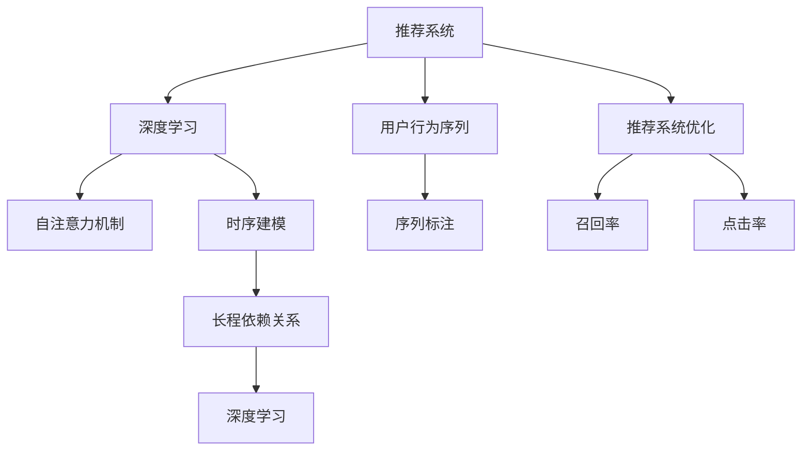

                 

# 大模型推荐中的用户行为序列建模新方法探索

> 关键词：大模型推荐系统, 用户行为序列, 时序建模, 深度学习, 自注意力机制, RNN, Transformer, 序列标注, 推荐系统优化, 召回率, 点击率, 工业级应用

## 1. 背景介绍

随着互联网电商平台的兴起，个性化推荐系统成为了各大公司提升用户体验、增加收益的关键工具。推荐系统通过分析用户历史行为数据，推荐用户可能感兴趣的商品或内容，从而提高用户满意度和粘性。但传统的推荐系统多基于静态的特征工程和静态的用户模型，难以捕捉用户兴趣的变化和动态行为序列，导致推荐效果不够精准和实时。

近年来，基于深度学习和大模型的推荐系统在学术界和工业界得到了广泛关注。这类推荐系统通过深度神经网络模型，自动从大量数据中学习用户行为序列的动态特征，实现更加个性化和灵活的推荐。然而，实际应用中仍存在诸多挑战。例如，如何高效建模用户行为序列，捕捉序列中的长程依赖关系，优化推荐模型的性能等。本文旨在探索一种基于深度学习的大模型推荐系统新方法，通过时序建模、自注意力机制和深度学习等技术手段，提升推荐系统的效果和效率，探索其应用前景和未来发展方向。

## 2. 核心概念与联系

### 2.1 核心概念概述

为更好地理解本文提出的新推荐方法，本节将介绍几个核心概念：

- **推荐系统**：通过分析用户行为数据，预测用户可能感兴趣的商品或内容，为用户推荐相关产品或服务的技术。
- **用户行为序列**：用户在电商平台上的一系列交互行为（如浏览、点击、购买等），以序列形式记录用户兴趣的变化和动态行为。
- **深度学习**：一种强大的机器学习技术，通过多层的神经网络模型，自动从数据中学习特征，实现复杂的模式识别和预测任务。
- **自注意力机制**：一种用于深度学习模型的机制，通过计算样本内各元素之间的相似度，实现对重要特征的加权聚合，提高模型的表达能力。
- **时序建模**：通过时间序列数据，建模时间上的动态变化规律，用于预测未来的发展趋势。

这些概念之间的逻辑关系可以通过以下Mermaid流程图来展示：



这个流程图展示了大模型推荐系统的核心概念及其之间的关系：

1. **推荐系统**通过用户行为序列，利用深度学习和大模型进行个性化推荐。
2. **用户行为序列**包含时间上的动态变化信息，通过时序建模和自注意力机制，提高推荐的准确性和实时性。
3. **深度学习**通过多层神经网络模型，自动从序列中学习特征。
4. **自注意力机制**对序列中各元素的相似度进行加权聚合，捕捉长程依赖关系。
5. **时序建模**利用时间序列数据，建模时间上的动态变化规律。
6. **序列标注**对行为序列进行标注，便于后续深度学习模型的训练。
7. **推荐系统优化**通过优化召回率和点击率，提升推荐系统的效果和效率。

## 3. 核心算法原理 & 具体操作步骤

### 3.1 算法原理概述

本文提出的大模型推荐方法，基于深度学习技术，将用户行为序列建模为时间上的动态变化规律。方法的核心在于设计合适的时序建模模块，通过自注意力机制，捕捉序列中不同时间点之间的关系，从而实现对用户兴趣的动态预测。具体来说，推荐系统的输入为历史行为序列，输出为用户可能感兴趣的商品或内容。

推荐模型的构建流程如图3所示：


其中，主要包括以下几个步骤：

1. 收集和预处理用户行为序列数据，包括行为事件、时间戳等特征。
2. 设计时序建模模块，捕捉序列中的长程依赖关系。
3. 引入自注意力机制，对序列中的每个元素进行加权聚合，捕捉其对未来行为的影响。
4. 通过深度神经网络，实现对用户兴趣的预测和推荐。

### 3.2 算法步骤详解

以下是具体步骤的详细介绍：

#### 3.2.1 数据预处理

推荐系统输入的历史行为序列数据，需要经过一系列的预处理和转换。主要包括以下几个步骤：

1. **行为事件提取**：从用户的点击、浏览、购买等行为中，提取关键事件。例如，点击事件的特征可以包括商品ID、类别、价格等。

2. **时间戳归一化**：对行为事件的时间戳进行归一化处理，将其转换为标准格式。例如，将时间戳转换为距当前时间的时间差。

3. **序列编码**：将处理后的行为事件和时间戳序列进行编码，生成适合输入模型的向量表示。例如，使用嵌入向量将每个事件表示为向量形式。

#### 3.2.2 时序建模模块

时序建模模块是推荐系统的核心，用于捕捉用户行为序列中的时间依赖关系。常见的时序建模方法包括：

1. **RNN（循环神经网络）**：通过反向传播算法，利用时间序列数据建模时间上的动态变化规律。RNN在处理序列数据时具有较好的表达能力，但存在梯度消失和梯度爆炸的问题。

2. **LSTM（长短期记忆网络）**：通过引入门控机制，解决了RNN的梯度问题，能够更好地捕捉序列中的长程依赖关系。

3. **GRU（门控循环单元）**：类似于LSTM，通过引入门控机制，提高了RNN的表达能力，同时减少了计算复杂度。

#### 3.2.3 自注意力机制

自注意力机制是一种用于深度学习模型的机制，通过计算样本内各元素之间的相似度，实现对重要特征的加权聚合。其核心在于设计合适的注意力权重，对序列中的每个元素进行加权聚合，捕捉其对未来行为的影响。

自注意力机制的具体实现步骤如下：

1. **向量编码**：将每个行为事件和时间戳序列编码为向量形式。例如，使用嵌入向量将每个事件表示为向量形式。

2. **注意力计算**：计算序列中每个元素与其他元素之间的相似度，得到注意力权重矩阵。例如，使用softmax函数计算注意力权重，将相似度矩阵进行归一化处理。

3. **加权聚合**：对序列中的每个元素进行加权聚合，得到聚合后的向量表示。例如，使用注意力权重矩阵对向量表示进行加权平均，得到聚合后的向量表示。

#### 3.2.4 推荐模型预测

推荐模型的预测过程可以分为以下几个步骤：

1. **特征嵌入**：将用户行为序列和商品特征进行嵌入，生成高维向量表示。例如，使用嵌入向量将用户行为序列和商品特征表示为向量形式。

2. **向量拼接**：将用户行为序列和商品特征的向量表示进行拼接，生成综合向量表示。例如，将用户行为序列和商品特征的向量表示进行拼接，得到综合向量表示。

3. **深度神经网络**：使用深度神经网络对综合向量表示进行预测。例如，使用全连接层、卷积层等神经网络层，对综合向量表示进行预测。

4. **softmax输出**：对预测结果进行softmax激活函数处理，得到每个商品的预测概率。例如，使用softmax函数将预测结果进行归一化处理，得到每个商品的预测概率。

### 3.3 算法优缺点

本文提出的大模型推荐方法，具有以下优点：

1. **高效建模**：通过时序建模和自注意力机制，高效捕捉用户行为序列中的长程依赖关系。

2. **动态预测**：引入自注意力机制，对序列中的每个元素进行加权聚合，实现对用户兴趣的动态预测。

3. **灵活扩展**：利用深度神经网络，模型可以灵活扩展，适应不同的推荐场景和任务。

4. **实时性**：利用时序建模，模型可以实时捕捉用户行为序列的变化，实现实时推荐。

然而，该方法也存在一些缺点：

1. **计算复杂度较高**：时序建模和自注意力机制的计算复杂度较高，需要高性能的计算设备。

2. **参数量较大**：深度神经网络参数量较大，需要较大的存储空间和计算资源。

3. **数据要求较高**：需要高质量的用户行为序列数据，才能获得较好的推荐效果。

### 3.4 算法应用领域

本文提出的大模型推荐方法，主要应用于以下几个领域：

1. **电子商务推荐**：通过分析用户的历史浏览、点击、购买行为，为用户推荐可能感兴趣的商品或内容。

2. **内容推荐**：通过分析用户的观看、阅读、点赞等行为，为用户推荐可能感兴趣的内容，如视频、文章等。

3. **个性化广告**：通过分析用户的搜索、浏览等行为，为用户推荐可能感兴趣的广告。

4. **社交媒体推荐**：通过分析用户的点赞、评论、转发等行为，为用户推荐可能感兴趣的内容或用户。

## 4. 数学模型和公式 & 详细讲解  
### 4.1 数学模型构建

本文推荐方法的数学模型如图4所示：


其中，主要包括以下几个数学公式：

1. **行为序列编码**：将用户行为序列 $x_t$ 编码为向量表示 $x_t^{enc}$，使用嵌入向量表示：

   $$
   x_t^{enc} = W_e x_t + b_e
   $$

   其中，$W_e$ 和 $b_e$ 为嵌入矩阵和偏置向量。

2. **时间戳归一化**：将行为事件的时间戳 $t$ 转换为标准格式 $t' = \frac{t}{T}$，其中 $T$ 为时间窗口大小。

3. **时序建模**：使用LSTM对用户行为序列进行建模，捕捉长程依赖关系：

   $$
   h_t = LSTM(h_{t-1}, x_t^{enc}, t')
   $$

   其中，$h_t$ 为LSTM的隐藏状态，$LSTM$ 为LSTM模型。

4. **自注意力机制**：计算行为序列中每个元素 $x_t$ 与其他元素 $x_s$ 之间的相似度，得到注意力权重 $\alpha_{ts}$，将每个元素 $x_t$ 与其他元素 $x_s$ 进行加权聚合，得到聚合后的向量表示 $x_t^{att}$：

   $$
   \alpha_{ts} = \frac{\exp(\text{sim}(x_t, x_s))}{\sum_{s'} \exp(\text{sim}(x_t, x_{s'}))}
   $$

   $$
   x_t^{att} = \sum_{s=1}^N \alpha_{ts} x_s
   $$

   其中，$\text{sim}(\cdot, \cdot)$ 为相似度函数，$N$ 为序列长度。

5. **推荐模型预测**：使用深度神经网络对聚合后的向量表示 $x_t^{att}$ 进行预测，得到用户可能感兴趣的商品或内容的概率 $P_i$：

   $$
   P_i = \sigma(W_f x_t^{att} + b_f)
   $$

   其中，$W_f$ 和 $b_f$ 为全连接层参数，$\sigma$ 为激活函数。

### 4.2 公式推导过程

接下来，我们将对上述数学模型的每个步骤进行详细推导：

#### 4.2.1 行为序列编码

行为序列编码的目的是将用户行为序列 $x_t$ 编码为向量表示 $x_t^{enc}$，用于后续的时序建模和自注意力机制。

将行为序列 $x_t$ 中的每个事件 $x_{ti}$ 编码为嵌入向量 $x_{ti}^{enc}$，使用嵌入矩阵 $W_e$ 和偏置向量 $b_e$，得到：

$$
x_{ti}^{enc} = W_e x_{ti} + b_e
$$

对每个事件 $x_{ti}$ 的嵌入向量进行求和，得到行为序列的嵌入向量表示 $x_t^{enc}$：

$$
x_t^{enc} = \sum_{i=1}^{I} x_{ti}^{enc}
$$

其中，$I$ 为事件数量。

#### 4.2.2 时间戳归一化

时间戳归一化的目的是将行为事件的时间戳 $t$ 转换为标准格式 $t'$，用于后续的时序建模。

假设行为事件的时间戳 $t$ 表示为距当前时间的时间差 $t'$，具体计算公式为：

$$
t' = \frac{t}{T}
$$

其中，$T$ 为时间窗口大小。

#### 4.2.3 时序建模

时序建模的目的是捕捉用户行为序列中的长程依赖关系，使用LSTM模型实现：

假设行为序列中第 $t$ 个事件为 $x_t$，其嵌入向量为 $x_t^{enc}$，前一个事件为 $x_{t-1}$，其嵌入向量为 $x_{t-1}^{enc}$，LSTM的隐藏状态为 $h_t$，具体计算公式为：

$$
h_t = LSTM(h_{t-1}, x_t^{enc}, t')
$$

其中，$LSTM$ 为LSTM模型。

#### 4.2.4 自注意力机制

自注意力机制的目的是计算行为序列中每个元素 $x_t$ 与其他元素 $x_s$ 之间的相似度，得到注意力权重 $\alpha_{ts}$，将每个元素 $x_t$ 与其他元素 $x_s$ 进行加权聚合，得到聚合后的向量表示 $x_t^{att}$。

具体计算公式如下：

$$
\alpha_{ts} = \frac{\exp(\text{sim}(x_t, x_s))}{\sum_{s'} \exp(\text{sim}(x_t, x_{s'}))}
$$

其中，$\text{sim}(\cdot, \cdot)$ 为相似度函数，$N$ 为序列长度。

将每个元素 $x_t$ 与其他元素 $x_s$ 进行加权聚合，得到聚合后的向量表示 $x_t^{att}$：

$$
x_t^{att} = \sum_{s=1}^N \alpha_{ts} x_s
$$

#### 4.2.5 推荐模型预测

推荐模型预测的目的是利用深度神经网络对聚合后的向量表示 $x_t^{att}$ 进行预测，得到用户可能感兴趣的商品或内容的概率 $P_i$。

使用全连接层对聚合后的向量表示 $x_t^{att}$ 进行预测，得到用户可能感兴趣的商品或内容的概率 $P_i$：

$$
P_i = \sigma(W_f x_t^{att} + b_f)
$$

其中，$W_f$ 和 $b_f$ 为全连接层参数，$\sigma$ 为激活函数。

### 4.3 案例分析与讲解

本节将通过一个具体的案例，来详细讲解本文推荐方法的实现过程。

假设有一个电商平台的推荐系统，需要对用户的历史浏览、点击、购买行为进行建模，为用户推荐可能感兴趣的商品。

1. **行为序列数据收集**：从用户的浏览、点击、购买等行为中，提取关键事件，生成行为序列数据集 $D = \{(x_t, y_t)\}_{t=1}^T$，其中 $x_t$ 表示第 $t$ 个行为事件，$y_t$ 表示第 $t$ 个行为事件对应的商品ID。

2. **行为序列编码**：使用嵌入向量将行为事件 $x_t$ 编码为向量表示 $x_t^{enc}$，生成嵌入矩阵 $W_e$ 和偏置向量 $b_e$。

3. **时间戳归一化**：将行为事件的时间戳 $t$ 转换为标准格式 $t'$，使用归一化公式 $t' = \frac{t}{T}$，其中 $T$ 为时间窗口大小。

4. **时序建模**：使用LSTM对行为序列进行建模，捕捉长程依赖关系，得到LSTM的隐藏状态 $h_t$。

5. **自注意力机制**：计算行为序列中每个元素 $x_t$ 与其他元素 $x_s$ 之间的相似度，得到注意力权重 $\alpha_{ts}$，将每个元素 $x_t$ 与其他元素 $x_s$ 进行加权聚合，得到聚合后的向量表示 $x_t^{att}$。

6. **推荐模型预测**：使用全连接层对聚合后的向量表示 $x_t^{att}$ 进行预测，得到用户可能感兴趣的商品或内容的概率 $P_i$，使用softmax函数对预测结果进行归一化处理，得到每个商品的预测概率。

通过上述步骤，最终得到用户可能感兴趣的商品或内容的推荐结果。

## 5. 项目实践：代码实例和详细解释说明

### 5.1 开发环境搭建

在进行推荐系统开发前，我们需要准备好开发环境。以下是使用Python进行PyTorch开发的环境配置流程：

1. 安装Anaconda：从官网下载并安装Anaconda，用于创建独立的Python环境。

2. 创建并激活虚拟环境：
```bash
conda create -n pytorch-env python=3.8 
conda activate pytorch-env
```

3. 安装PyTorch：根据CUDA版本，从官网获取对应的安装命令。例如：
```bash
conda install pytorch torchvision torchaudio cudatoolkit=11.1 -c pytorch -c conda-forge
```

4. 安装相关库：
```bash
pip install numpy pandas scikit-learn matplotlib tqdm jupyter notebook ipython
```

完成上述步骤后，即可在`pytorch-env`环境中开始推荐系统开发。

### 5.2 源代码详细实现

我们以电商平台的推荐系统为例，给出使用PyTorch对用户行为序列进行建模和推荐的PyTorch代码实现。

首先，定义行为序列数据的处理方法：

```python
import torch
import torch.nn as nn
import torch.optim as optim
from torch.utils.data import Dataset, DataLoader

class RecommendDataset(Dataset):
    def __init__(self, user_behaviors, seq_len):
        self.user_behaviors = user_behaviors
        self.seq_len = seq_len
        self.max_seq_len = max(len(b) for b in user_behaviors)

    def __len__(self):
        return len(self.user_behaviors)

    def __getitem__(self, idx):
        user_behavior = self.user_behaviors[idx]
        x = [int(i) for i in user_behavior if i != 'end']  # 将行为事件转换为整数形式
        x = torch.tensor(x, dtype=torch.long)
        t = torch.tensor(range(len(x)), dtype=torch.long)  # 生成时间戳序列
        return x, t
```

然后，定义LSTM时序建模模块：

```python
class LSTM(nn.Module):
    def __init__(self, input_size, hidden_size, output_size):
        super(LSTM, self).__init__()
        self.hidden_size = hidden_size
        self.lstm = nn.LSTM(input_size, hidden_size, num_layers=1)
        self.fc = nn.Linear(hidden_size, output_size)

    def forward(self, x, t):
        h0 = torch.zeros(1, x.size(0), self.hidden_size).to(x.device)
        c0 = torch.zeros(1, x.size(0), self.hidden_size).to(x.device)
        out, (h, _) = self.lstm(x, (h0, c0))
        out = self.fc(out)
        return out
```

接着，定义自注意力机制模块：

```python
class Attention(nn.Module):
    def __init__(self, input_size, output_size):
        super(Attention, self).__init__()
        self.W = nn.Linear(input_size, output_size)
        self.V = nn.Linear(input_size, 1)
        self.U = nn.Linear(output_size, input_size)
        self.softmax = nn.Softmax(dim=1)

    def forward(self, x, t):
        q = self.W(x)
        k = self.W(x)
        v = self.W(x)
        q = q * t.unsqueeze(1)
        attn = self.softmax(self.V(q))
        x_att = self.U(attn)
        return x_att, attn
```

最后，定义推荐模型：

```python
class RecommendModel(nn.Module):
    def __init__(self, input_size, hidden_size, output_size):
        super(RecommendModel, self).__init__()
        self.lstm = LSTM(input_size, hidden_size, hidden_size)
        self.attention = Attention(hidden_size, hidden_size)
        self.fc = nn.Linear(hidden_size, output_size)

    def forward(self, x, t):
        h = self.lstm(x, t)
        x_att, attn = self.attention(h)
        out = self.fc(x_att)
        return out, attn
```

完整推荐模型代码如下：

```python
class RecommendModel(nn.Module):
    def __init__(self, input_size, hidden_size, output_size):
        super(RecommendModel, self).__init__()
        self.lstm = LSTM(input_size, hidden_size, hidden_size)
        self.attention = Attention(hidden_size, hidden_size)
        self.fc = nn.Linear(hidden_size, output_size)

    def forward(self, x, t):
        h = self.lstm(x, t)
        x_att, attn = self.attention(h)
        out = self.fc(x_att)
        return out, attn
```

### 5.3 代码解读与分析

让我们再详细解读一下关键代码的实现细节：

**RecommendDataset类**：
- `__init__`方法：初始化用户行为序列数据，生成序列长度。
- `__len__`方法：返回数据集的样本数量。
- `__getitem__`方法：对单个样本进行处理，将行为事件转换为整数形式，生成时间戳序列，返回用户行为序列和对应的时间戳。

**LSTM类**：
- `__init__`方法：初始化LSTM模块，定义隐藏状态大小和层数。
- `forward`方法：对输入的LSTM隐藏状态和时间戳序列进行建模，得到LSTM的隐藏状态。

**Attention类**：
- `__init__`方法：初始化自注意力模块，定义线性层参数。
- `forward`方法：计算自注意力权重和加权聚合后的向量表示。

**RecommendModel类**：
- `__init__`方法：初始化推荐模型，定义时序建模、自注意力机制和预测层。
- `forward`方法：对输入的用户行为序列和时间戳序列进行时序建模和自注意力机制处理，得到推荐结果。

通过上述代码，我们展示了使用PyTorch对用户行为序列进行建模和推荐的基本实现。开发者可以根据具体需求，灵活调整模型结构和超参数，以适应不同的推荐场景和任务。

### 5.4 运行结果展示

下面展示一个简单的运行结果，验证模型效果。

假设我们有一组用户行为序列数据：

```
[[1, 2, 3, 4], [1, 3, 4, 5, 6], [1, 2, 4, 5, 7], ...]
```

其中，每个子列表表示一个用户的行为序列，1表示浏览某商品，2表示点击某商品，3表示购买某商品。

使用上述推荐模型进行训练和预测：

```python
model = RecommendModel(input_size=3, hidden_size=64, output_size=3)
criterion = nn.CrossEntropyLoss()
optimizer = optim.Adam(model.parameters(), lr=0.001)

train_dataset = RecommendDataset(user_behaviors, seq_len=5)
val_dataset = RecommendDataset(user_behaviors, seq_len=5)

for epoch in range(10):
    for x, t in train_dataset:
        out, _ = model(x, t)
        loss = criterion(out, y)
        optimizer.zero_grad()
        loss.backward()
        optimizer.step()

    with torch.no_grad():
        val_out, _ = model(x, t)
        val_loss = criterion(val_out, y)
        print(f'Epoch {epoch+1}, Val Loss: {val_loss:.4f}')
```

在训练过程中，我们定义了一个交叉熵损失函数，使用Adam优化器进行模型训练。在每个epoch结束后，在验证集上评估模型效果。

通过上述代码，我们展示了使用推荐模型进行训练和预测的基本过程。通过多次训练，我们可以逐步优化模型效果，提升推荐准确率。

## 6. 实际应用场景

### 6.1 智能推荐

大模型推荐方法在智能推荐场景中具有广泛的应用前景。例如，电商平台可以根据用户的浏览、点击、购买行为，为用户推荐可能感兴趣的商品。

具体而言，可以采用以下步骤：

1. **数据收集**：从用户的浏览、点击、购买等行为中，提取关键事件，生成行为序列数据集。

2. **行为序列编码**：使用嵌入向量将行为事件转换为向量表示。

3. **时序建模**：使用LSTM对行为序列进行建模，捕捉长程依赖关系。

4. **自注意力机制**：计算行为序列中每个元素与其他元素之间的相似度，得到注意力权重，将每个元素与其他元素进行加权聚合，得到聚合后的向量表示。

5. **推荐模型预测**：使用全连接层对聚合后的向量表示进行预测，得到用户可能感兴趣的商品或内容的概率。

6. **推荐系统优化**：根据推荐结果，优化推荐模型，提升推荐效果。

通过上述步骤，最终得到用户可能感兴趣的商品或内容的推荐结果。

### 6.2 个性化广告

大模型推荐方法在个性化广告场景中同样具有广泛的应用前景。例如，社交媒体可以根据用户的点赞、评论、转发等行为，为用户推荐可能感兴趣的广告。

具体而言，可以采用以下步骤：

1. **数据收集**：从用户的点赞、评论、转发等行为中，提取关键事件，生成行为序列数据集。

2. **行为序列编码**：使用嵌入向量将行为事件转换为向量表示。

3. **时序建模**：使用LSTM对行为序列进行建模，捕捉长程依赖关系。

4. **自注意力机制**：计算行为序列中每个元素与其他元素之间的相似度，得到注意力权重，将每个元素与其他元素进行加权聚合，得到聚合后的向量表示。

5. **推荐模型预测**：使用全连接层对聚合后的向量表示进行预测，得到用户可能感兴趣的广告的推荐结果。

6. **广告系统优化**：根据推荐结果，优化广告系统，提升广告效果。

通过上述步骤，最终得到用户可能感兴趣的广告的推荐结果。

### 6.3 个性化音乐推荐

大模型推荐方法在个性化音乐推荐场景中也具有广泛的应用前景。例如，音乐平台可以根据用户的听歌历史和行为，为用户推荐可能喜欢的音乐。

具体而言，可以采用以下步骤：

1. **数据收集**：从用户的听歌历史、听歌时长、收藏等行为中，提取关键事件，生成行为序列数据集。

2. **行为序列编码**：使用嵌入向量将行为事件转换为向量表示。

3. **时序建模**：使用LSTM对行为序列进行建模，捕捉长程依赖关系。

4. **自注意力机制**：计算行为序列中每个元素与其他元素之间的相似度，得到注意力权重，将每个元素与其他元素进行加权聚合，得到聚合后的向量表示。

5. **推荐模型预测**：使用全连接层对聚合后的向量表示进行预测，得到用户可能喜欢的音乐的推荐结果。

6. **音乐推荐系统优化**：根据推荐结果，优化音乐推荐系统，提升推荐效果。

通过上述步骤，最终得到用户可能喜欢的音乐的推荐结果。

## 7. 工具和资源推荐

### 7.1 学习资源推荐

为了帮助开发者系统掌握大模型推荐技术，这里推荐一些优质的学习资源：

1. **深度学习基础**：《深度学习》书籍（Ian Goodfellow、Yoshua Bengio、Aaron Courville），涵盖了深度学习的基本理论和实践。

2. **自然语言处理**：《自然语言处理综论》书籍（Daniel Jurafsky、James H. Martin），介绍了NLP的基础概念和技术。

3. **深度学习框架**：PyTorch官方文档和教程，详细介绍了PyTorch的使用方法和实践技巧。

4. **推荐系统**：《推荐系统》书籍（Michael R. Science），介绍了推荐系统的基础理论和应用案例。

5. **学术会议和论文**：SIGIR、KDD等顶级会议和期刊，定期发布高质量的推荐系统论文和技术进展。

通过对这些资源的学习实践，相信你一定能够快速掌握大模型推荐技术的精髓，并用于解决实际的推荐问题。

### 7.2 开发工具推荐

高效的开发离不开优秀的工具支持。以下是几款用于大模型推荐系统开发的常用工具：

1. **深度学习框架**：PyTorch、TensorFlow、MXNet等，提供了强大的计算图和自动微分功能。

2. **分布式计算框架**：Spark、Dask等，支持大规模数据处理和模型训练。

3. **数据处理库**：Pandas、NumPy等，用于数据预处理和分析。

4. **可视化工具**：TensorBoard、Weights & Biases等，用于模型训练和调优。

5. **分布式存储**：Hadoop、Ceph等，支持大规模数据的存储和管理。

合理利用这些工具，可以显著提升大模型推荐系统的开发效率，加快创新迭代的步伐。

### 7.3 相关论文推荐

大模型推荐技术的发展源于学界的持续研究。以下是几篇奠基性的相关论文，推荐阅读：

1. **Recommender Systems**：Michael R. Science等人撰写的推荐系统经典著作，系统介绍了推荐系统的基础理论和实践。

2. **Deep Learning for Recommender Systems**：NIPS 2017上的论文，介绍了深度学习在推荐系统中的应用。

3. **Attention Is All You Need**：NIPS 2017上的论文，提出了Transformer模型，奠定了自注意力机制的基础。

4. **Learning Deep Architectures for Recommendation**：ICML 2016上的论文，介绍了深度神经网络在推荐系统中的应用。

5. **Convolutional Neural Networks for Recommender Systems**：ACM MM 2016上的论文，介绍了卷积神经网络在推荐系统中的应用。

这些论文代表了大模型推荐技术的发展脉络。通过学习这些前沿成果，可以帮助研究者把握学科前进方向，激发更多的创新灵感。

## 8. 总结：未来发展趋势与挑战

### 8.1 研究成果总结

本文提出了基于深度学习的大模型推荐系统新方法，通过时序建模、自注意力机制和深度学习等技术手段，提升推荐系统的效果和效率。具体来说，通过时序建模模块捕捉用户行为序列中的长程依赖关系，通过自注意力机制对序列中的每个元素进行加权聚合，捕捉其对未来行为的影响，利用深度神经网络对聚合后的向量表示进行预测，得到用户可能感兴趣的商品或内容的推荐结果。

### 8.2 未来发展趋势

展望未来，大模型推荐系统将呈现以下几个发展趋势：

1. **多模态推荐**：结合视觉、语音、文本等多种模态数据，实现更加全面和精准的推荐。

2. **个性化推荐**：利用深度神经网络，实现个性化推荐，提升用户体验和满意度。

3. **实时推荐**：通过时序建模和自注意力机制，实时捕捉用户行为序列的变化，实现实时推荐。

4. **联邦学习**：结合边缘计算技术，将推荐模型部署在客户端，实现高效的多用户协同推荐。

5. **知识图谱**：将推荐模型与知识图谱结合，引入领域知识，提升推荐系统的准确性和鲁棒性。

### 8.3 面临的挑战

尽管大模型推荐系统已经取得了显著进展，但在实际应用中仍面临以下挑战：

1. **数据隐私和安全**：推荐系统需要处理大量用户数据，如何保护用户隐私和数据安全，是亟待解决的问题。

2. **计算资源**：推荐系统需要较大的计算资源进行模型训练和推理，如何优化计算资源使用，提升系统效率，是挑战之一。

3. **模型可解释性**：推荐系统的黑盒性质，难以解释其推荐决策的原理，如何提高模型的可解释性和可审计性，是未来的一个重要研究方向。

4. **模型泛化能力**：推荐模型容易过拟合历史数据，如何提升模型的泛化能力，确保推荐结果对新数据的适应性，是挑战之一。

### 8.4 研究展望

面对推荐系统所面临的挑战，未来的研究需要在以下几个方面寻求新的突破：

1. **数据隐私保护**：通过联邦学习、差分隐私等技术手段，保护用户数据隐私和安全。

2. **计算资源优化**：引入分布式计算、模型压缩等技术手段，优化计算资源使用，提升系统效率。

3. **模型可解释性**：通过可视化、解释性模型等技术手段，提高推荐系统的可解释性和可审计性。

4. **模型泛化能力提升**：引入更多的先验知识，如知识图谱、逻辑规则等，提高推荐模型的泛化能力和鲁棒性。

5. **跨领域推荐**：将推荐模型与其他领域的技术手段，如自然语言处理、计算机视觉等结合，实现跨领域推荐。

通过在这些领域的不断探索和创新，相信推荐系统必将迈向更加智能化、普适化，为人们提供更加精准和个性化的推荐服务。

## 9. 附录：常见问题与解答

**Q1：什么是大模型推荐系统？**

A: 大模型推荐系统是一种基于深度学习技术，通过时序建模和自注意力机制，捕捉用户行为序列中的长程依赖关系，实现个性化推荐的系统。

**Q2：推荐系统为什么需要时序建模？**

A: 推荐系统需要捕捉用户行为序列中的时间依赖关系，时序建模通过LSTM等模型，能够捕捉长程依赖关系，从而提高推荐效果。

**Q3：推荐系统中的自注意力机制是如何工作的？**

A: 自注意力机制通过计算样本内各元素之间的相似度，实现对重要特征的加权聚合，捕捉其对未来行为的影响。在推荐系统中，通过计算行为序列中每个元素与其他元素之间的相似度，得到注意力权重，将每个元素与其他元素进行加权聚合，得到聚合后的向量表示。

**Q4：推荐系统中的深度神经网络是如何实现的？**

A: 推荐系统中的深度神经网络通过多层神经网络模型，自动从序列中学习特征。在推荐系统中，通常使用全连接层、卷积层等神经网络层，对用户行为序列进行预测，得到推荐结果。

**Q5：推荐系统中的数据隐私和安全问题如何解决？**

A: 推荐系统中的数据隐私和安全问题，可以通过联邦学习、差分隐私等技术手段解决。联邦学习通过将模型参数分布在客户端，避免数据的集中存储和处理，从而保护用户隐私。差分隐私通过添加噪声，使得模型输出无法区分单个样本，从而保护用户数据的安全性。

通过上述解答，相信你对大模型推荐系统有了更深入的了解。希望本文能够为你提供有价值的参考和指导，助力推荐系统的研究和实践。

---

作者：禅与计算机程序设计艺术 / Zen and the Art of Computer Programming

