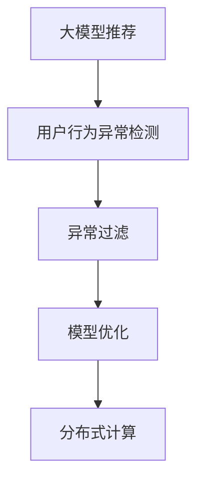

                 

# 大模型推荐中的用户行为异常检测与过滤方法

## 1. 背景介绍

在数字化时代，推荐系统已经成为了各大平台为用户提供个性化服务的关键。无论是电商、新闻、视频还是社交平台，推荐系统都在无形中影响着用户的决策和体验。然而，随着数据量的激增和推荐算法的复杂性提升，推荐系统也面临着新的挑战。其中，用户行为异常检测与过滤，即识别和去除可能导致推荐效果恶化的用户行为，成为了保障推荐系统高质量运行的重要手段。

本文档将从核心概念、算法原理、项目实践和实际应用场景等多个方面，深入探讨大模型推荐中的用户行为异常检测与过滤方法，希望能为从事相关领域的研究和开发者提供有益的参考。

## 2. 核心概念与联系

### 2.1 核心概念概述

为了更好地理解大模型推荐中的用户行为异常检测与过滤方法，本节将介绍几个密切相关的核心概念：

- **大模型推荐**：基于深度学习模型的推荐系统，通过预训练的大规模无监督数据，学习用户行为与物品属性之间的复杂关系，实现高效的推荐。

- **用户行为异常**：指用户的浏览、点击、评分、评论等行为异常，如点击重复、恶意点击、异常评分等，这些异常行为可能影响推荐模型的训练和效果。

- **异常检测**：通过构建数学模型和算法，识别出用户行为中的异常模式，通常分为无监督学习和有监督学习两种方法。

- **行为过滤**：在异常检测的基础上，筛选并移除异常行为样本，从而保证推荐系统训练和预测的准确性和公平性。

- **模型优化**：通过优化算法和超参数设置，提升异常检测与过滤的效果，实现更高质量的推荐服务。

- **分布式计算**：在大规模数据集上执行异常检测与过滤操作，通常需要分布式计算框架如Apache Spark等，才能高效处理。

### 2.2 核心概念原理和架构的 Mermaid 流程图



## 3. 核心算法原理 & 具体操作步骤

### 3.1 算法原理概述

用户行为异常检测与过滤的基本流程包括数据预处理、异常模式识别和行为过滤三个环节。其核心思想是：通过构建合适的数学模型，识别出用户行为中的异常样本，并通过适当的算法和工具，对这些异常样本进行筛选和去除，从而提升推荐系统的稳定性和准确性。

### 3.2 算法步骤详解

**Step 1: 数据预处理**

1. **数据收集**：收集用户在推荐系统中的各类行为数据，包括浏览记录、点击行为、评分数据、评论内容等。
2. **数据清洗**：去除无效数据和噪声数据，如用户ID缺失、数据格式错误等。
3. **数据标准化**：对不同类型的数据进行标准化处理，确保数据的一致性和可比性。

**Step 2: 异常模式识别**

1. **特征工程**：设计合适的特征表示方法，将原始行为数据转化为模型可处理的特征向量。
2. **异常检测算法**：选择合适的异常检测算法，如孤立森林、LSTM、SVM等，构建用户行为异常的检测模型。
3. **模型训练**：使用历史行为数据训练异常检测模型，学习识别异常行为的特征。

**Step 3: 行为过滤**

1. **行为筛选**：根据异常检测模型的输出，筛选出可能存在异常行为的用户样本。
2. **行为验证**：通过人工验证或半自动验证的方式，确认异常行为的真实性。
3. **行为过滤**：将确定的异常行为样本从训练数据中移除，保证后续模型训练的纯净度。

### 3.3 算法优缺点

基于大模型推荐的用户行为异常检测与过滤方法具有以下优点：
1. **自动化程度高**：通过机器学习算法自动化识别异常行为，减少人工干预，提高效率。
2. **处理能力强**：适用于大规模数据集，能够处理海量用户行为数据。
3. **预测准确**：通过深度学习模型学习用户行为特征，提高异常检测的准确性和召回率。

同时，该方法也存在以下局限性：
1. **数据依赖性强**：异常检测模型的效果依赖于历史行为数据的质量和多样性。
2. **模型复杂度较高**：深度学习模型通常需要较长的训练时间和较高的计算资源。
3. **可解释性差**：异常检测模型内部机制复杂，难以解释异常行为的生成原因。

### 3.4 算法应用领域

基于大模型推荐的用户行为异常检测与过滤方法，在电子商务、社交媒体、新闻推荐等多个领域都有广泛的应用。具体包括：

1. **电商平台**：检测用户恶意刷单、重复购买等异常行为，保护平台正常运营秩序。
2. **社交平台**：识别恶意评论、虚假账号等行为，保障社区安全和用户互动质量。
3. **新闻媒体**：检测虚假新闻、广告刷量等行为，提升内容质量和平台信誉。
4. **视频平台**：识别观看重复、点赞欺诈等行为，优化用户体验和推荐效果。

## 4. 数学模型和公式 & 详细讲解 & 举例说明

### 4.1 数学模型构建

构建异常检测模型的核心在于选择合适的特征表示和算法。常用的特征表示方法包括向量化、时间序列、深度学习等。这里以LSTM为例，构建用户行为异常检测的数学模型。

设用户行为数据序列为 $X = \{x_1, x_2, ..., x_n\}$，其中 $x_i$ 表示第 $i$ 个时间点的行为数据。异常检测模型的目标是最小化模型输出 $y$ 与真实标签 $z$ 的误差，即：

$$
\min_{\theta} \frac{1}{N} \sum_{i=1}^N \ell(y_i, z_i)
$$

其中 $\ell$ 为损失函数，$z_i \in \{0, 1\}$ 表示 $x_i$ 是否为异常行为。

### 4.2 公式推导过程

以LSTM模型为例，假设模型输入为行为数据序列 $X$，输出为异常行为预测序列 $y$。模型的训练过程可以概括为以下几个步骤：

1. **前向传播**：将行为数据序列 $X$ 输入LSTM模型，得到隐藏状态 $h_t$ 和预测结果 $y_t$。
2. **损失计算**：计算预测结果 $y_t$ 与真实标签 $z_t$ 之间的交叉熵损失。
3. **反向传播**：根据损失函数对模型参数 $\theta$ 进行反向传播，更新模型权重。
4. **参数更新**：使用优化算法（如Adam、SGD等），更新模型参数 $\theta$。

通过上述步骤，异常检测模型不断优化，提升对用户行为异常的识别能力。

### 4.3 案例分析与讲解

以电商平台为例，假设用户在一天内多次点击同一款商品页面，且浏览时长远超平均水平，这种行为可能被视为异常。通过LSTM模型，可以将用户行为数据序列转化为隐藏状态，从而检测到这种行为异常。具体步骤如下：

1. **数据预处理**：将用户点击、浏览、评分等行为数据标准化为数值型数据。
2. **模型训练**：使用历史用户行为数据训练LSTM模型，学习用户行为特征。
3. **异常检测**：将用户新一天的行为数据输入训练好的LSTM模型，得到异常检测结果。
4. **行为过滤**：将检测出的异常行为数据从推荐系统中移除，重新训练推荐模型。

通过以上流程，电商平台可以有效识别并过滤异常行为，保护正常用户利益，提升推荐系统效果。

## 5. 项目实践：代码实例和详细解释说明

### 5.1 开发环境搭建

在进行异常检测与过滤项目实践前，需要准备好开发环境。以下是使用Python进行TensorFlow开发的常见环境配置流程：

1. 安装Anaconda：从官网下载并安装Anaconda，用于创建独立的Python环境。
2. 创建并激活虚拟环境：
```bash
conda create -n tf-env python=3.8 
conda activate tf-env
```

3. 安装TensorFlow：根据CUDA版本，从官网获取对应的安装命令。例如：
```bash
conda install tensorflow=2.6 -c tf -c conda-forge
```

4. 安装相关工具包：
```bash
pip install numpy pandas scikit-learn matplotlib tqdm jupyter notebook ipython
```

完成上述步骤后，即可在`tf-env`环境中开始项目实践。

### 5.2 源代码详细实现

下面以电商平台用户行为异常检测为例，给出使用TensorFlow实现LSTM模型的代码实现。

首先，定义LSTM模型的输入和输出：

```python
import tensorflow as tf

# 定义LSTM模型的输入和输出
def build_lstm_model(input_shape, output_size):
    model = tf.keras.models.Sequential([
        tf.keras.layers.LSTM(128, return_sequences=True, input_shape=input_shape),
        tf.keras.layers.Dropout(0.2),
        tf.keras.layers.LSTM(64),
        tf.keras.layers.Dropout(0.2),
        tf.keras.layers.Dense(output_size, activation='sigmoid')
    ])
    return model
```

然后，加载数据并进行预处理：

```python
import numpy as np

# 加载用户行为数据
def load_data():
    # 加载行为数据
    data = np.loadtxt('user_behavior.csv', delimiter=',')
    
    # 数据预处理
    data = (data - data.mean()) / data.std()  # 标准化处理
    data = data.reshape(-1, 1, data.shape[1])  # 转换为三维数组
    
    # 划分训练集和测试集
    train_size = int(0.8 * data.shape[0])
    train_data = data[:train_size]
    test_data = data[train_size:]
    
    # 将标签转换为数值型
    train_labels = (train_data[:, -1] >= 0.5).astype(int)  # 异常标记为1，正常标记为0
    test_labels = (test_data[:, -1] >= 0.5).astype(int)
    
    return train_data, train_labels, test_data, test_labels

# 加载数据
train_data, train_labels, test_data, test_labels = load_data()
```

接着，构建LSTM模型并进行训练：

```python
# 构建LSTM模型
model = build_lstm_model(train_data.shape[1], output_size=1)

# 编译模型
model.compile(optimizer='adam', loss='binary_crossentropy', metrics=['accuracy'])

# 训练模型
model.fit(train_data, train_labels, epochs=50, batch_size=32, validation_data=(test_data, test_labels))
```

最后，进行异常检测和行为过滤：

```python
# 进行异常检测
predictions = model.predict(test_data)
test_labels = (test_labels >= 0.5).astype(int)
predictions = (predictions >= 0.5).astype(int)

# 打印异常检测结果
print('True Labels:', test_labels)
print('Predictions:', predictions)

# 行为过滤
# 过滤掉所有异常行为样本
filtered_data = test_data[test_labels == 0]
filtered_labels = test_labels[test_labels == 0]

# 重新训练推荐模型
# 在过滤后的数据上重新训练推荐模型
```

以上就是使用TensorFlow对LSTM模型进行用户行为异常检测的完整代码实现。可以看到，TensorFlow提供了便捷的API和工具，使得模型构建、训练和评估过程变得非常直观。

### 5.3 代码解读与分析

让我们再详细解读一下关键代码的实现细节：

**load_data函数**：
- 加载原始的用户行为数据。
- 对数据进行标准化处理，使其符合LSTM模型的输入要求。
- 将数据划分为训练集和测试集，并根据最后的标签值（0或1）生成对应的标签。

**build_lstm_model函数**：
- 定义LSTM模型的架构，包括输入层、隐藏层和输出层。
- 使用`return_sequences=True`参数，使得LSTM模型输出每个时间点的隐藏状态。

**model.fit函数**：
- 编译模型，指定优化器、损失函数和评价指标。
- 使用`fit`函数训练模型，指定训练集、测试集、批次大小和迭代轮数。
- 在训练过程中，模型会在训练集上进行训练，并在验证集上进行评估，以避免过拟合。

**模型预测和过滤**：
- 使用`predict`函数对测试集进行预测，得到每个样本的异常概率。
- 根据阈值（0.5）将预测结果转换为异常标记（0或1）。
- 根据异常标记过滤掉所有异常行为样本，确保后续训练和推荐模型能够基于纯净的数据进行训练。

可以看到，TensorFlow提供了强大的工具链和丰富的API，使得异常检测与过滤的实现变得简单高效。开发者可以更多地关注算法细节和业务逻辑，而不必过多关注底层实现。

## 6. 实际应用场景

### 6.1 电商平台

电商平台通过用户行为异常检测与过滤，可以有效地保护平台正常运营秩序，避免用户恶意行为对推荐系统的负面影响。例如，识别出恶意刷单、重复购买等异常行为，并将其过滤掉，从而保证推荐系统训练的纯净度，提升推荐效果。

### 6.2 社交平台

社交平台通过行为异常检测与过滤，可以保障社区安全和用户互动质量。例如，识别出虚假账号、恶意评论等行为，并将其移除，从而维护良好的社区环境，提升用户互动体验。

### 6.3 新闻媒体

新闻媒体通过行为异常检测与过滤，可以提升内容质量和平台信誉。例如，识别出虚假新闻、广告刷量等行为，并将其过滤掉，从而保障内容的真实性和平台的公正性，增强用户信任度。

### 6.4 未来应用展望

随着大模型推荐技术的不断进步，用户行为异常检测与过滤方法也在不断演进。未来，该方法将在以下几个方向上取得突破：

1. **多模态数据融合**：将文本、图像、音频等多模态数据结合，提升异常检测的全面性和准确性。
2. **实时异常检测**：利用分布式计算和大数据技术，实现实时行为检测和过滤，保障推荐系统的高效运行。
3. **自适应学习**：引入自适应学习机制，根据用户行为和环境变化动态调整异常检测模型，提升模型鲁棒性。
4. **隐私保护**：在异常检测过程中，确保用户隐私和数据安全，避免侵犯用户隐私。

这些方向的研究和发展，将进一步提升推荐系统的稳定性和准确性，为用户提供更优质的个性化服务。

## 7. 工具和资源推荐

### 7.1 学习资源推荐

为了帮助开发者系统掌握大模型推荐中的用户行为异常检测与过滤方法，这里推荐一些优质的学习资源：

1. TensorFlow官方文档：提供全面的API和工具使用指南，帮助开发者快速上手TensorFlow开发。
2. Keras官方文档：提供简单易用的高级API，适合初学者入门。
3. PyTorch官方文档：提供灵活的动态计算图和强大的研究工具，适合深度学习研究。
4. 《深度学习》书籍：由Ian Goodfellow等人所著，全面介绍深度学习原理和应用，包括异常检测与过滤等内容。
5. 《Python机器学习》书籍：由Sebastian Raschka等人所著，详细介绍Python在机器学习中的应用，包括TensorFlow和Keras的使用。

通过对这些资源的学习实践，相信你一定能够快速掌握大模型推荐中的用户行为异常检测与过滤方法，并用于解决实际的推荐问题。

### 7.2 开发工具推荐

高效的开发离不开优秀的工具支持。以下是几款用于大模型推荐开发的常用工具：

1. TensorFlow：由Google主导开发的开源深度学习框架，支持多平台部署，适合大规模工程应用。
2. PyTorch：基于Python的开源深度学习框架，灵活动态的计算图，适合快速迭代研究。
3. Keras：提供简单易用的高级API，适合快速原型开发和部署。
4. Jupyter Notebook：免费的交互式开发环境，支持Python、R、SQL等多种语言。
5. Scikit-learn：提供强大的数据处理和模型评估工具，适合机器学习项目开发。

合理利用这些工具，可以显著提升大模型推荐中的用户行为异常检测与过滤任务的开发效率，加快创新迭代的步伐。

### 7.3 相关论文推荐

大模型推荐中的用户行为异常检测与过滤技术的发展源于学界的持续研究。以下是几篇奠基性的相关论文，推荐阅读：

1. 《A Survey on Anomaly Detection in Recommendation Systems》：系统综述了推荐系统中的异常检测方法，包含深度学习、统计方法等多种技术。
2. 《Anomaly Detection in Recommendation Systems: A Survey》：详细介绍了推荐系统中的异常检测算法和应用场景。
3. 《Anomaly Detection with Deep Learning for Recommender Systems》：利用深度学习模型进行推荐系统中的异常检测，展示了其优越性。
4. 《Real-time Anomaly Detection for Recommendation Systems》：利用实时异常检测技术，提升推荐系统的响应速度和准确性。

这些论文代表了大模型推荐中的用户行为异常检测与过滤技术的发展脉络。通过学习这些前沿成果，可以帮助研究者把握学科前进方向，激发更多的创新灵感。

## 8. 总结：未来发展趋势与挑战

### 8.1 研究成果总结

本文对大模型推荐中的用户行为异常检测与过滤方法进行了全面系统的介绍。首先阐述了异常检测与过滤在大模型推荐中的重要性和应用场景，明确了异常检测与过滤在提升推荐系统质量和用户体验方面的独特价值。其次，从原理到实践，详细讲解了异常检测与过滤的数学原理和关键步骤，给出了实际应用中的代码实现。同时，本文还广泛探讨了异常检测与过滤方法在电商平台、社交平台、新闻媒体等多个行业领域的应用前景，展示了异常检测与过滤范式的巨大潜力。此外，本文精选了异常检测与过滤技术的各类学习资源，力求为读者提供全方位的技术指引。

通过本文的系统梳理，可以看到，基于大模型推荐中的用户行为异常检测与过滤方法正在成为推荐系统高质量运行的重要手段，极大地提升了推荐系统的稳定性和准确性。未来，伴随深度学习模型的不断进步，异常检测与过滤方法也将不断演进，为推荐系统带来更多的创新和发展。

### 8.2 未来发展趋势

展望未来，大模型推荐中的用户行为异常检测与过滤技术将呈现以下几个发展趋势：

1. **多模态数据融合**：将文本、图像、音频等多种数据融合，提升异常检测的全面性和准确性。
2. **实时异常检测**：利用分布式计算和大数据技术，实现实时行为检测和过滤，保障推荐系统的高效运行。
3. **自适应学习**：根据用户行为和环境变化动态调整异常检测模型，提升模型鲁棒性。
4. **隐私保护**：在异常检测过程中，确保用户隐私和数据安全，避免侵犯用户隐私。

这些方向的研究和发展，将进一步提升推荐系统的稳定性和准确性，为用户提供更优质的个性化服务。

### 8.3 面临的挑战

尽管大模型推荐中的用户行为异常检测与过滤技术已经取得了瞩目成就，但在迈向更加智能化、普适化应用的过程中，它仍面临着诸多挑战：

1. **数据依赖性强**：异常检测模型的效果依赖于历史行为数据的质量和多样性。
2. **模型复杂度较高**：深度学习模型通常需要较长的训练时间和较高的计算资源。
3. **可解释性差**：异常检测模型内部机制复杂，难以解释异常行为的生成原因。

### 8.4 研究展望

面对大模型推荐中用户行为异常检测与过滤所面临的种种挑战，未来的研究需要在以下几个方面寻求新的突破：

1. **无监督和半监督异常检测**：探索无监督和半监督异常检测方法，摆脱对大规模标注数据的依赖，利用自监督学习、主动学习等技术，最大化利用数据信息。
2. **参数高效和计算高效的异常检测**：开发更加参数高效和计算高效的异常检测方法，如基于自适应权重、稀疏化技术等，提高异常检测效率和效果。
3. **模型优化与融合**：结合多种异常检测方法，利用集成学习技术，提升异常检测模型的综合性能和鲁棒性。
4. **多模态数据融合与融合**：将文本、图像、音频等多种数据结合，实现更加全面和准确的异常检测。
5. **实时异常检测与过滤**：利用分布式计算技术，实现实时异常检测与过滤，提升推荐系统的响应速度和准确性。

这些研究方向的研究和发展，将进一步提升大模型推荐中的用户行为异常检测与过滤技术的水平，为用户推荐系统带来更多的创新和突破。

## 9. 附录：常见问题与解答

**Q1：什么是用户行为异常检测与过滤？**

A: 用户行为异常检测与过滤是指通过构建数学模型和算法，识别出用户行为中的异常模式，并通过适当的算法和工具，将这些异常行为筛选并去除，从而提升推荐系统的稳定性和准确性。

**Q2：大模型推荐中的用户行为异常检测与过滤有哪些应用场景？**

A: 用户行为异常检测与过滤在大模型推荐中的应用场景包括电商平台、社交平台、新闻媒体等多个领域。例如，电商平台可以通过行为检测与过滤，识别并移除恶意刷单、重复购买等异常行为，保护平台正常运营秩序；社交平台可以通过行为检测与过滤，保障社区安全和用户互动质量；新闻媒体可以通过行为检测与过滤，提升内容质量和平台信誉。

**Q3：如何进行用户行为异常检测与过滤？**

A: 用户行为异常检测与过滤一般包括以下几个步骤：
1. 数据预处理：收集用户行为数据，并进行数据清洗和标准化处理。
2. 特征工程：设计合适的特征表示方法，将原始行为数据转化为模型可处理的特征向量。
3. 异常检测算法：选择合适的异常检测算法，如LSTM、孤立森林等，构建用户行为异常的检测模型。
4. 模型训练：使用历史行为数据训练异常检测模型，学习识别异常行为的特征。
5. 行为筛选：根据异常检测模型的输出，筛选出可能存在异常行为的用户样本。
6. 行为验证：通过人工验证或半自动验证的方式，确认异常行为的真实性。
7. 行为过滤：将确定的异常行为样本从训练数据中移除，保证后续模型训练的纯净度。

**Q4：用户行为异常检测与过滤需要考虑哪些因素？**

A: 用户行为异常检测与过滤需要考虑以下几个因素：
1. 数据依赖性：异常检测模型的效果依赖于历史行为数据的质量和多样性。
2. 模型复杂度：深度学习模型通常需要较长的训练时间和较高的计算资源。
3. 可解释性：异常检测模型内部机制复杂，难以解释异常行为的生成原因。

这些因素需要在实际应用中综合考虑，以实现最佳的异常检测与过滤效果。

通过本文的系统梳理，可以看到，基于大模型推荐中的用户行为异常检测与过滤方法正在成为推荐系统高质量运行的重要手段，极大地提升了推荐系统的稳定性和准确性。未来，伴随深度学习模型的不断进步，异常检测与过滤方法也将不断演进，为推荐系统带来更多的创新和发展。相信随着学界和产业界的共同努力，这些挑战终将一一被克服，异常检测与过滤技术必将在构建人机协同的智能时代中扮演越来越重要的角色。

