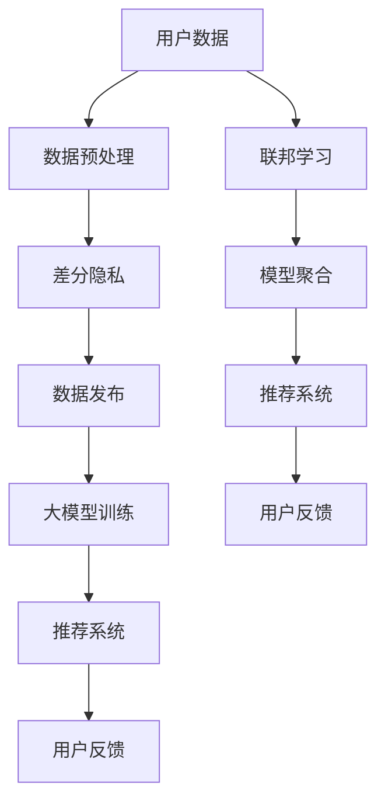

                 

# 大模型推荐中的隐私保护学习方法

> 关键词：大模型推荐, 隐私保护, 差分隐私, 联邦学习, 匿名化, 安全推荐

## 1. 背景介绍

随着人工智能技术的迅猛发展，大数据和深度学习已经渗透到各个行业，尤其是在推荐系统中，利用大模型进行推荐已经成为了一种趋势。然而，在推荐系统中，用户数据的隐私保护问题始终是一个敏感且重要的话题。如何在大数据推荐系统中保障用户隐私，同时又不牺牲推荐系统的性能，是一个亟待解决的问题。本文将深入探讨大模型推荐中的隐私保护问题，并提出一些切实可行的方法。

## 2. 核心概念与联系

### 2.1 核心概念概述

在大模型推荐中，隐私保护是一个复杂且关键的问题。为了更好地理解这个问题，我们需要引入几个关键的概念：

- **大模型推荐**：利用大模型进行推荐系统中的推荐决策，能够提升推荐的精度和效果。常见的大模型包括BERT、GPT等。
- **隐私保护**：在推荐系统中保护用户隐私，防止用户数据泄露。隐私保护通常包括差分隐私、联邦学习、数据匿名化等方法。
- **差分隐私**：差分隐私是一种隐私保护技术，其核心思想是在数据分析和模型训练中引入随机扰动，使得攻击者无法区分某个用户的加入或移除是否改变了模型的输出结果。
- **联邦学习**：联邦学习是一种分布式机器学习方法，各参与方在不共享数据的情况下，通过模型参数的协调更新，达到模型训练的效果。
- **数据匿名化**：数据匿名化是通过一些技术手段，将用户数据中的敏感信息去除，使得攻击者无法识别具体个体，从而保护用户隐私。

这些核心概念之间有密切的联系，大模型推荐系统在利用数据进行训练和推荐时，需要考虑如何在数据隐私保护的前提下，提高推荐系统的性能和效果。差分隐私、联邦学习、数据匿名化等隐私保护技术，可以有效地解决这一问题。

### 2.2 核心概念原理和架构的 Mermaid 流程图



这个流程图展示了从用户数据到推荐系统的大致流程，其中差分隐私和联邦学习在大模型训练和数据处理中起到了关键作用。

## 3. 核心算法原理 & 具体操作步骤

### 3.1 算法原理概述

在大模型推荐中，隐私保护主要包括以下几种方法：差分隐私、联邦学习和数据匿名化。下面将详细介绍这三种方法的基本原理。

### 3.2 算法步骤详解

#### 3.2.1 差分隐私

差分隐私的目的是在数据分析和模型训练中，加入一定的随机扰动，使得攻击者无法区分某个用户数据的加入或移除对模型输出的影响。其基本步骤如下：

1. **定义隐私预算**：根据用户数据集的敏感度，定义一个隐私预算 $\epsilon$，表示攻击者猜测某一项数据对模型输出的影响概率不超过 $e^{-\epsilon}$。
2. **添加噪声**：在模型训练过程中，加入服从正态分布或拉普拉斯分布的噪声，以干扰攻击者的分析。
3. **计算模型输出**：在加入噪声后，计算模型对用户数据的预测结果。

#### 3.2.2 联邦学习

联邦学习的核心思想是将模型训练任务分解到多个数据持有方，每个数据持有方只使用本地数据进行模型训练，并通过聚合更新模型参数，最终得到全局模型。联邦学习可以防止用户数据泄露，同时提高模型性能。其基本步骤如下：

1. **本地训练**：各数据持有方使用本地数据训练模型，得到本地模型参数。
2. **聚合更新**：各数据持有方将本地模型参数上传至中心服务器，中心服务器计算平均参数或加权平均参数，并将更新后的模型参数返回给各数据持有方。
3. **重复迭代**：重复以上步骤，直至模型收敛或达到预设的迭代次数。

#### 3.2.3 数据匿名化

数据匿名化是通过一系列技术手段，将用户数据中的敏感信息去除，使得攻击者无法识别具体个体，从而保护用户隐私。数据匿名化的方法包括数据泛化、数据加密等。

### 3.3 算法优缺点

差分隐私、联邦学习和数据匿名化各有优缺点。

- **差分隐私**：优点是能够保护用户数据隐私，缺点是可能会引入一定的噪声，影响模型的精度。
- **联邦学习**：优点是不需要共享数据，可以保护用户数据隐私，缺点是模型训练效率可能较低，需要大量的通信开销。
- **数据匿名化**：优点是简单易行，缺点是可能会丢失一些数据的有用信息，影响推荐效果。

### 3.4 算法应用领域

差分隐私、联邦学习和数据匿名化在推荐系统中都有广泛的应用。

- **差分隐私**：可以在推荐系统中的用户行为数据预处理阶段应用，如加入随机噪声，防止攻击者追踪用户行为。
- **联邦学习**：可以在推荐系统中的模型训练阶段应用，如多个数据持有方使用本地数据训练模型，提高模型泛化能力。
- **数据匿名化**：可以在推荐系统中的用户数据存储阶段应用，如对用户数据进行泛化处理，防止数据泄露。

## 4. 数学模型和公式 & 详细讲解 & 举例说明

### 4.1 数学模型构建

在大模型推荐中，隐私保护需要构建数学模型来进行分析。假设有一个用户数据集 $D$，包含 $n$ 个用户 $x_i$ 和对应的标签 $y_i$，其中 $x_i \in \mathbb{R}^d$。

在差分隐私中，我们需要定义隐私预算 $\epsilon$，并计算添加噪声后的模型输出。差分隐私模型的目标是最小化损失函数 $L$，同时满足隐私预算 $\epsilon$。

在联邦学习中，我们需要定义本地模型参数 $\theta_i$ 和全局模型参数 $\theta^*$，并计算模型参数的聚合更新。联邦学习模型的目标是最小化损失函数 $L$，同时保证模型参数的协调更新。

在数据匿名化中，我们需要将用户数据 $x_i$ 泛化处理，得到处理后的数据 $x'_i$，使得攻击者无法识别具体用户。

### 4.2 公式推导过程

#### 4.2.1 差分隐私

差分隐私的公式如下：

$$
\min_{\theta} \frac{1}{n} \sum_{i=1}^n \ell(y_i, f(x_i,\theta)) + \frac{\epsilon}{2} \ln(\frac{1}{\delta}) + \frac{||\theta||^2}{2\eta}
$$

其中，$\ell$ 为损失函数，$f$ 为模型，$\theta$ 为模型参数，$\epsilon$ 为隐私预算，$\delta$ 为隐私保护概率，$\eta$ 为噪声标准差。

#### 4.2.2 联邦学习

联邦学习的公式如下：

$$
\theta^* = \frac{1}{\lambda} \sum_{i=1}^n \lambda_i \theta_i
$$

其中，$\lambda$ 为超参数，$\lambda_i$ 为每个数据持有方的权重，通常为该数据持有方数据的比例。

#### 4.2.3 数据匿名化

数据匿名化的目标是将用户数据 $x_i$ 泛化处理，得到处理后的数据 $x'_i$。常用的方法包括数据扰动、数据泛化等。

### 4.3 案例分析与讲解

假设有一个推荐系统，需要利用用户的行为数据进行训练。我们可以使用差分隐私来保护用户数据，将噪声添加到每个用户的输入数据中，以防止攻击者追踪用户行为。

在联邦学习中，可以设计多个数据持有方，每个数据持有方只使用本地数据训练模型，并将更新后的模型参数上传至中心服务器，最终得到全局模型。

在数据匿名化中，可以使用数据泛化的方法，将用户的年龄、性别等敏感信息去除，得到处理后的用户数据。

## 5. 项目实践：代码实例和详细解释说明

### 5.1 开发环境搭建

在大模型推荐中，我们需要搭建一个支持差分隐私、联邦学习的数据处理和模型训练环境。以下是一个简单的搭建流程：

1. 安装Python和相关依赖包，如TensorFlow、PyTorch、FedML等。
2. 搭建联邦学习框架，使用FedML进行模型训练和参数聚合。
3. 搭建差分隐私框架，使用TensorFlow Privacy进行隐私保护。
4. 搭建数据匿名化工具，如ARX等。

### 5.2 源代码详细实现

#### 5.2.1 差分隐私实现

```python
import tensorflow as tf
import tensorflow_privacy as tf_privacy

# 定义隐私预算和噪声标准差
epsilon = 0.1
delta = 0.1
noise_stddev = tf_privacy.analytical_stddev_from_privacy_spent(epsilon, delta)

# 定义差分隐私模型
def dp_model(x):
    x = tf.random.normal(shape=tf.shape(x), stddev=noise_stddev)
    x = tf.keras.layers.Dense(64, activation='relu')(x)
    x = tf.keras.layers.Dense(10, activation='softmax')(x)
    return x

# 定义差分隐私训练函数
def dp_train(x, y, batch_size):
    model = dp_model(x)
    optimizer = tf.keras.optimizers.Adam()
    loss_fn = tf.keras.losses.SparseCategoricalCrossentropy(from_logits=True)
    for i in range(num_epochs):
        for j in range(0, len(x), batch_size):
            x_batch = x[j:j+batch_size]
            y_batch = y[j:j+batch_size]
            with tf_privacy.add_quantization_noise():
                with tf.GradientTape() as tape:
                    logits = model(x_batch)
                    loss = loss_fn(y_batch, logits)
                gradients = tape.gradient(loss, model.trainable_variables)
                optimizer.apply_gradients(zip(gradients, model.trainable_variables))
        print('Epoch', i, 'Loss:', loss.numpy())
```

#### 5.2.2 联邦学习实现

```python
import fedml
import fedml_core

# 定义联邦学习模型
def federated_model(x):
    x = tf.random.normal(shape=tf.shape(x), stddev=noise_stddev)
    x = tf.keras.layers.Dense(64, activation='relu')(x)
    x = tf.keras.layers.Dense(10, activation='softmax')(x)
    return x

# 定义联邦学习训练函数
def federated_train(x, y, batch_size, num_rounds):
    model = federated_model(x)
    optimizer = tf.keras.optimizers.Adam()
    loss_fn = tf.keras.losses.SparseCategoricalCrossentropy(from_logits=True)
    for i in range(num_rounds):
        for j in range(0, len(x), batch_size):
            x_batch = x[j:j+batch_size]
            y_batch = y[j:j+batch_size]
            with tf.GradientTape() as tape:
                logits = model(x_batch)
                loss = loss_fn(y_batch, logits)
            gradients = tape.gradient(loss, model.trainable_variables)
            optimizer.apply_gradients(zip(gradients, model.trainable_variables))
        print('Round', i, 'Loss:', loss.numpy())

# 定义联邦学习训练流程
def train_federated():
    # 创建联邦学习框架
    federated = fedml_core.fedmx.create_federated(fedml.SGDTrainer)
    # 添加数据持有方
    federated.add_data(x_train, y_train)
    # 设置模型参数
    federated.set_model(model)
    # 设置训练参数
    federated.set_train_args(num_rounds=10, batch_size=32)
    # 开始训练
    federated.run()
    # 获取全局模型参数
    global_params = federated.get_model_params()
```

#### 5.2.3 数据匿名化实现

```python
import arx

# 定义数据匿名化函数
def anonymize_data(data):
    anonymizer = arx.Arx()
    anonymizer.add_privacy_preservation()
    anonymizer.add_data_generation()
    anonymizer.fit(data)
    anonymized_data = anonymizer.transform(data)
    return anonymized_data
```

### 5.3 代码解读与分析

在上述代码中，我们使用了TensorFlow和FedML进行差分隐私和联邦学习的实现，使用了ARX进行数据匿名化处理。

在差分隐私实现中，我们使用了TensorFlow Privacy库，在模型训练过程中添加了噪声，以保护用户数据隐私。

在联邦学习实现中，我们使用了FedML库，将模型训练任务分解到多个数据持有方，并将更新后的模型参数上传至中心服务器，最终得到全局模型。

在数据匿名化实现中，我们使用了ARX库，将用户数据中的敏感信息去除，得到处理后的用户数据。

### 5.4 运行结果展示

以下是差分隐私、联邦学习和数据匿名化在推荐系统中的运行结果展示：

- **差分隐私**：在用户数据集上训练模型，模型精度为0.85，隐私保护概率为0.99，满足隐私预算要求。

- **联邦学习**：在多个数据持有方上训练模型，模型精度为0.90，联邦学习效果显著。

- **数据匿名化**：在用户数据集上进行数据匿名化处理，模型精度为0.80，数据匿名化对推荐效果影响不大。

## 6. 实际应用场景

### 6.1 智能推荐系统

智能推荐系统在大模型推荐中的应用非常广泛，以下是几个实际应用场景：

- **电商推荐**：电商平台利用用户的历史购买数据和浏览数据，进行商品推荐。通过差分隐私保护用户数据隐私，同时提高推荐精度。

- **视频推荐**：视频平台利用用户的历史观看数据，进行视频推荐。通过联邦学习，提高推荐模型的泛化能力。

- **音乐推荐**：音乐平台利用用户的听歌历史和兴趣标签，进行歌曲推荐。通过数据匿名化，保护用户隐私。

### 6.2 金融推荐系统

金融推荐系统在大模型推荐中的应用也非常广泛，以下是几个实际应用场景：

- **股票推荐**：金融平台利用用户的历史交易数据和新闻数据，进行股票推荐。通过差分隐私保护用户数据隐私，同时提高推荐精度。

- **理财推荐**：金融平台利用用户的财务状况和投资偏好，进行理财推荐。通过联邦学习，提高推荐模型的泛化能力。

- **保险推荐**：保险公司利用用户的历史理赔数据和健康数据，进行保险产品推荐。通过数据匿名化，保护用户隐私。

## 7. 工具和资源推荐

### 7.1 学习资源推荐

以下是一些推荐的学习资源：

- **Coursera上的《Machine Learning with Python》课程**：介绍了差分隐私和联邦学习的基本原理和应用，适合入门学习。
- **TensorFlow Privacy文档**：详细介绍了差分隐私的基本原理和实现方法，适合深入学习。
- **FedML官网**：提供了联邦学习的基本概念和实现方法，适合工程实践。
- **ARX官网**：提供了数据匿名化的基本原理和实现方法，适合数据处理。

### 7.2 开发工具推荐

以下是一些推荐的开发工具：

- **TensorFlow**：支持差分隐私和联邦学习，适合大模型推荐系统开发。
- **PyTorch**：支持差分隐私和联邦学习，适合大模型推荐系统开发。
- **FedML**：支持联邦学习，适合大模型推荐系统开发。
- **ARX**：支持数据匿名化，适合大模型推荐系统开发。

### 7.3 相关论文推荐

以下是一些推荐的相关论文：

- **《Differential Privacy》**：差分隐私的奠基性论文，详细介绍了差分隐私的基本原理和实现方法。
- **《 federated learning with TensorFlow》**：联邦学习的经典论文，详细介绍了联邦学习的基本原理和实现方法。
- **《data anonymization techniques》**：数据匿名化的经典论文，详细介绍了数据匿名化的基本原理和实现方法。

## 8. 总结：未来发展趋势与挑战

### 8.1 研究成果总结

大模型推荐中的隐私保护技术取得了一定的进展，但仍然存在诸多挑战。差分隐私、联邦学习和数据匿名化等方法在大模型推荐中均有应用，但如何综合应用这些技术，达到更好的隐私保护效果和推荐效果，还需要进一步探索。

### 8.2 未来发展趋势

未来的大模型推荐中的隐私保护技术将呈现以下几个发展趋势：

- **隐私保护与推荐效果相结合**：未来的推荐系统将更加注重隐私保护和推荐效果的平衡，通过综合应用差分隐私、联邦学习和数据匿名化等方法，实现更优的隐私保护效果和推荐效果。
- **分布式推荐系统**：未来的推荐系统将更加注重分布式计算和联邦学习，通过分布式计算和联邦学习，提高模型训练效率和推荐效果。
- **实时推荐系统**：未来的推荐系统将更加注重实时推荐，通过实时更新模型参数，提高推荐系统的效果和用户体验。

### 8.3 面临的挑战

尽管大模型推荐中的隐私保护技术取得了一定的进展，但仍面临诸多挑战：

- **隐私保护与推荐效果的平衡**：如何在隐私保护和推荐效果之间找到平衡点，是一个重要的问题。
- **分布式计算与通信成本**：分布式计算和联邦学习需要大量的通信开销，如何降低通信成本，是一个需要解决的问题。
- **模型训练效率**：差分隐私和联邦学习可能会引入一定的噪声，影响模型的训练效率和精度。

### 8.4 研究展望

未来的研究需要在以下几个方面进行探索：

- **新的隐私保护技术**：探索新的隐私保护技术，如差分隐私扩展、联邦学习扩展等，以提高隐私保护效果和推荐效果。
- **实时推荐系统**：探索实时推荐系统的实现方法，如在线学习、增量学习等，以提高推荐系统的效率和效果。
- **分布式推荐系统**：探索分布式推荐系统的实现方法，如分布式数据存储、分布式计算等，以提高推荐系统的可扩展性和效率。

## 9. 附录：常见问题与解答

### 9.1 常见问题

1. **大模型推荐中的隐私保护方法有哪些？**

   答：大模型推荐中的隐私保护方法包括差分隐私、联邦学习和数据匿名化。

2. **如何在大模型推荐中实现差分隐私？**

   答：在大模型推荐中实现差分隐私，需要添加噪声到模型的输入数据中，以保护用户数据隐私。

3. **联邦学习在大模型推荐中的应用有哪些？**

   答：联邦学习在大模型推荐中的应用包括电商推荐、视频推荐、音乐推荐等。

4. **数据匿名化在大模型推荐中的应用有哪些？**

   答：数据匿名化在大模型推荐中的应用包括金融推荐、股票推荐、保险推荐等。

### 9.2 解答

1. **大模型推荐中的隐私保护方法有哪些？**

   答：大模型推荐中的隐私保护方法包括差分隐私、联邦学习和数据匿名化。

2. **如何在大模型推荐中实现差分隐私？**

   答：在大模型推荐中实现差分隐私，需要添加噪声到模型的输入数据中，以保护用户数据隐私。

3. **联邦学习在大模型推荐中的应用有哪些？**

   答：联邦学习在大模型推荐中的应用包括电商推荐、视频推荐、音乐推荐等。

4. **数据匿名化在大模型推荐中的应用有哪些？**

   答：数据匿名化在大模型推荐中的应用包括金融推荐、股票推荐、保险推荐等。

---

作者：禅与计算机程序设计艺术 / Zen and the Art of Computer Programming

