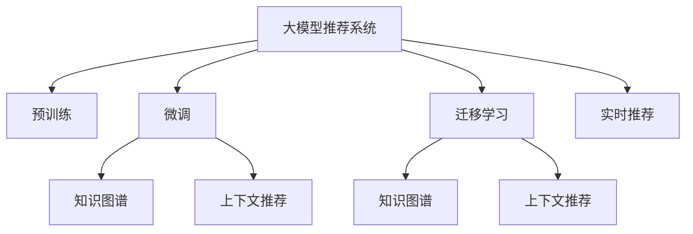

                 

# 大模型推荐系统的商业化落地

## 1. 背景介绍

### 1.1 问题由来

推荐系统是现代互联网应用的重要组成部分，从电商平台的商品推荐，到社交媒体的兴趣推荐，再到视频网站的个性化播放，推荐技术无处不在。然而，随着用户需求日益多样化和个性化，传统的推荐系统已难以满足这些需求。

当前，推荐系统面临着数据稀疏性、冷启动、多场景适配等诸多挑战。这些问题需要通过更高效、更智能、更灵活的推荐方法来解决。特别是近年来，大模型技术的发展，为推荐系统的商业化落地带来了新的契机。

### 1.2 问题核心关键点

大模型推荐系统的核心在于如何将通用预训练语言模型（Large Language Model, LLM）引入推荐过程，从而提升推荐系统的性能和效果。

1. **数据适配**：预训练语言模型在通用领域预训练，如何将这些模型适配到具体推荐任务上，是关键问题之一。
2. **泛化能力**：如何利用大模型的泛化能力，对不同场景、不同用户需求进行精准推荐。
3. **实时性**：推荐系统需要快速响应用户行为，如何在保持模型性能的同时提升推荐实时性。
4. **可解释性**：推荐系统决策应具备可解释性，便于用户理解推荐依据。
5. **隐私保护**：如何在推荐过程中保护用户隐私，避免数据泄露和滥用。

### 1.3 问题研究意义

大模型推荐系统为推荐技术带来了新的突破，可以显著提升推荐系统的个性化程度和用户满意度，推动电商、社交、视频等领域的数字化转型升级。

- **降低推荐成本**：大模型推荐系统能够自动学习用户偏好，减少了手工标注和人工干预，降低推荐成本。
- **提高推荐精度**：大模型的泛化能力有助于发现更多潜在的相关项，提升推荐的准确性和多样性。
- **增强系统鲁棒性**：大模型推荐系统通过自监督学习获得广泛的领域知识，能够更好地抵抗噪音和异常数据的影响。
- **提升用户体验**：个性化的推荐服务能够显著提升用户的购物体验和满意度，增加用户粘性。

## 2. 核心概念与联系

### 2.1 核心概念概述

为了更好地理解大模型推荐系统的实现过程，本节将介绍几个密切相关的核心概念：

- **大模型推荐系统(Large Model Recommendation System)**：基于预训练语言模型的推荐系统，通过在大规模数据上预训练，学习到通用的知识表征，并根据不同推荐任务进行微调，从而提升推荐性能。
- **预训练(Pre-training)**：指在大规模无标签数据上进行自监督学习任务训练通用语言模型的过程。常见的预训练任务包括掩码语言模型、下一句预测等。
- **微调(Fine-tuning)**：指在预训练模型的基础上，使用推荐任务的数据，通过有监督学习优化模型在推荐任务上的性能。
- **迁移学习(Transfer Learning)**：指将一个领域学习到的知识，迁移应用到另一个不同但相关的领域的学习范式。大模型的预训练-微调过程即是一种典型的迁移学习方式。
- **知识图谱(Knowledge Graph)**：用于存储和管理结构化知识的工具，常用于推荐系统中增加用户与物品间的语义关联。
- **上下文推荐(Context-based Recommendation)**：在推荐过程中，考虑用户的历史行为、当前上下文、个性化特征等，生成更精准的推荐结果。

这些概念之间的逻辑关系可以通过以下Mermaid流程图来展示：



这个流程图展示了大模型推荐系统的核心概念及其之间的关系：

1. 大模型推荐系统通过预训练获得基础能力。
2. 微调是对预训练模型进行任务特定的优化，可以通过有监督学习调整模型参数。
3. 知识图谱用于存储和管理结构化知识，增强推荐系统的语义理解能力。
4. 上下文推荐考虑用户当前上下文信息，提升推荐精度。
5. 迁移学习是连接预训练模型与推荐任务的桥梁，可以通过微调或知识图谱融合来实现。
6. 实时推荐要求快速响应用户行为，实时生成推荐结果。

## 3. 核心算法原理 & 具体操作步骤

### 3.1 算法原理概述

大模型推荐系统基于预训练语言模型的微调方法，核心思想是：将预训练语言模型作为基础特征提取器，通过微调学习目标任务的具体特征，从而提升推荐效果。

形式化地，假设预训练语言模型为 $M_{\theta}$，其中 $\theta$ 为预训练得到的模型参数。给定推荐任务 $T$ 的标注数据集 $D=\{(x_i, y_i)\}_{i=1}^N, x_i \in \mathcal{X}, y_i \in \mathcal{Y}$，推荐目标是通过微调使模型输出接近真实标签。

数学上，我们可以将推荐任务建模为回归问题，即：

$$
\hat{y}_i = M_{\theta}(x_i)
$$

其中 $\hat{y}_i$ 为模型预测的用户对物品 $x_i$ 的评分，$y_i$ 为真实标签。

推荐系统的目标是最大化预测评分与真实评分之间的相似度，可以通过最小化如下损失函数实现：

$$
\mathcal{L}(\theta) = \frac{1}{N} \sum_{i=1}^N (y_i - \hat{y}_i)^2
$$

通过梯度下降等优化算法，微调过程不断更新模型参数 $\theta$，最小化损失函数 $\mathcal{L}$，使得模型输出逼近真实标签。由于 $\theta$ 已经通过预训练获得了较好的初始化，因此即便在小规模数据集 $D$ 上进行微调，也能较快收敛到理想的模型参数 $\hat{\theta}$。

### 3.2 算法步骤详解

基于监督学习的大模型推荐系统一般包括以下几个关键步骤：

**Step 1: 准备预训练模型和数据集**
- 选择合适的预训练语言模型 $M_{\theta}$ 作为初始化参数，如 BERT、GPT 等。
- 准备推荐任务 $T$ 的标注数据集 $D$，划分为训练集、验证集和测试集。一般要求标注数据与预训练数据的分布不要差异过大。

**Step 2: 添加任务适配层**
- 根据推荐任务类型，在预训练模型顶层设计合适的输出层和损失函数。
- 对于评分预测任务，通常在顶层添加线性分类器和均方误差损失函数。
- 对于排序任务，通常使用基于排名损失函数。

**Step 3: 设置微调超参数**
- 选择合适的优化算法及其参数，如 AdamW、SGD 等，设置学习率、批大小、迭代轮数等。
- 设置正则化技术及强度，包括权重衰减、Dropout、Early Stopping等。
- 确定冻结预训练参数的策略，如仅微调顶层，或全部参数都参与微调。

**Step 4: 执行梯度训练**
- 将训练集数据分批次输入模型，前向传播计算损失函数。
- 反向传播计算参数梯度，根据设定的优化算法和学习率更新模型参数。
- 周期性在验证集上评估模型性能，根据性能指标决定是否触发 Early Stopping。
- 重复上述步骤直到满足预设的迭代轮数或 Early Stopping 条件。

**Step 5: 测试和部署**
- 在测试集上评估微调后模型 $M_{\hat{\theta}}$ 的性能，对比微调前后的精度提升。
- 使用微调后的模型对新样本进行推理预测，集成到实际的应用系统中。
- 持续收集新的数据，定期重新微调模型，以适应数据分布的变化。

以上是基于监督学习微调大模型推荐系统的一般流程。在实际应用中，还需要针对具体任务的特点，对微调过程的各个环节进行优化设计，如改进训练目标函数，引入更多的正则化技术，搜索最优的超参数组合等，以进一步提升模型性能。

### 3.3 算法优缺点

基于监督学习的大模型推荐系统具有以下优点：

1. 简单高效。只需准备少量标注数据，即可对预训练模型进行快速适配，获得较大的性能提升。
2. 通用适用。适用于各种推荐任务，包括评分预测、排序、召回等，设计简单的任务适配层即可实现微调。
3. 参数高效。利用参数高效微调技术，在固定大部分预训练权重不变的情况下，仍可取得不错的提升。
4. 效果显著。在学术界和工业界的诸多任务上，基于微调的方法已经刷新了最先进的性能指标。

同时，该方法也存在一定的局限性：

1. 依赖标注数据。推荐系统的微调效果很大程度上取决于标注数据的质量和数量，获取高质量标注数据的成本较高。
2. 迁移能力有限。当目标任务与预训练数据的分布差异较大时，微调的性能提升有限。
3. 负面效果传递。预训练模型的固有偏见、有害信息等，可能通过微调传递到推荐任务，造成负面影响。
4. 可解释性不足。推荐系统的决策过程通常缺乏可解释性，难以对其推理逻辑进行分析和调试。

尽管存在这些局限性，但就目前而言，基于监督学习的微调方法仍是大模型推荐系统应用的最主流范式。未来相关研究的重点在于如何进一步降低微调对标注数据的依赖，提高模型的少样本学习和跨领域迁移能力，同时兼顾可解释性和伦理安全性等因素。

### 3.4 算法应用领域

基于大模型推荐系统的监督学习方法，在推荐系统领域已经得到了广泛的应用，覆盖了几乎所有常见任务，例如：

- 电商推荐：根据用户浏览、购买历史，推荐相关商品。通过微调使模型学习用户-商品相关性。
- 视频推荐：根据用户观看历史，推荐相关视频。通过微调使模型学习视频-用户相关性。
- 音乐推荐：根据用户听歌历史，推荐相关歌曲。通过微调使模型学习歌曲-用户相关性。
- 新闻推荐：根据用户阅读历史，推荐相关新闻。通过微调使模型学习新闻-用户相关性。
- 广告推荐：根据用户搜索历史，推荐相关广告。通过微调使模型学习广告-用户相关性。

除了上述这些经典任务外，大模型推荐系统还被创新性地应用到更多场景中，如用户画像构建、跨域推荐、广告投放优化等，为推荐技术带来了全新的突破。随着预训练模型和微调方法的不断进步，相信推荐技术将在更广阔的应用领域大放异彩。

## 4. 数学模型和公式 & 详细讲解 & 举例说明

### 4.1 数学模型构建

本节将使用数学语言对基于监督学习的大模型推荐系统进行更加严格的刻画。

记预训练语言模型为 $M_{\theta}$，其中 $\theta$ 为预训练得到的模型参数。假设推荐任务为评分预测，训练集为 $D=\{(x_i, y_i)\}_{i=1}^N, x_i \in \mathcal{X}, y_i \in \mathcal{Y}$。

定义模型 $M_{\theta}$ 在输入 $x$ 上的输出为 $\hat{y}=M_{\theta}(x)$，即为用户对物品 $x$ 的评分预测。推荐系统的目标是最大化预测评分与真实评分之间的相似度，可以通过最小化如下损失函数实现：

$$
\mathcal{L}(\theta) = \frac{1}{N} \sum_{i=1}^N (y_i - \hat{y}_i)^2
$$

通过梯度下降等优化算法，微调过程不断更新模型参数 $\theta$，最小化损失函数 $\mathcal{L}$，使得模型输出逼近真实标签。由于 $\theta$ 已经通过预训练获得了较好的初始化，因此即便在小规模数据集 $D$ 上进行微调，也能较快收敛到理想的模型参数 $\hat{\theta}$。

### 4.2 公式推导过程

以下我们以评分预测任务为例，推导均方误差损失函数及其梯度的计算公式。

假设模型 $M_{\theta}$ 在输入 $x$ 上的输出为 $\hat{y}=M_{\theta}(x)$，则评分预测任务的目标为最小化预测评分与真实评分之间的均方误差，即：

$$
\mathcal{L}(\theta) = \frac{1}{N} \sum_{i=1}^N (y_i - \hat{y}_i)^2
$$

根据链式法则，损失函数对参数 $\theta_k$ 的梯度为：

$$
\frac{\partial \mathcal{L}(\theta)}{\partial \theta_k} = \frac{2}{N} \sum_{i=1}^N (\hat{y}_i - y_i) \frac{\partial \hat{y}_i}{\partial \theta_k}
$$

其中 $\frac{\partial \hat{y}_i}{\partial \theta_k}$ 可进一步递归展开，利用自动微分技术完成计算。

在得到损失函数的梯度后，即可带入参数更新公式，完成模型的迭代优化。重复上述过程直至收敛，最终得到适应推荐任务的最优模型参数 $\theta^*$。

## 5. 项目实践：代码实例和详细解释说明

### 5.1 开发环境搭建

在进行推荐系统微调实践前，我们需要准备好开发环境。以下是使用Python进行PyTorch开发的环境配置流程：

1. 安装Anaconda：从官网下载并安装Anaconda，用于创建独立的Python环境。

2. 创建并激活虚拟环境：
```bash
conda create -n pytorch-env python=3.8 
conda activate pytorch-env
```

3. 安装PyTorch：根据CUDA版本，从官网获取对应的安装命令。例如：
```bash
conda install pytorch torchvision torchaudio cudatoolkit=11.1 -c pytorch -c conda-forge
```

4. 安装Transformers库：
```bash
pip install transformers
```

5. 安装各类工具包：
```bash
pip install numpy pandas scikit-learn matplotlib tqdm jupyter notebook ipython
```

完成上述步骤后，即可在`pytorch-env`环境中开始微调实践。

### 5.2 源代码详细实现

下面我们以电商推荐任务为例，给出使用Transformers库对BERT模型进行评分预测任务的微调PyTorch代码实现。

首先，定义评分预测任务的数据处理函数：

```python
from transformers import BertTokenizer
from torch.utils.data import Dataset
import torch

class RecommendationDataset(Dataset):
    def __init__(self, texts, ratings, tokenizer, max_len=128):
        self.texts = texts
        self.ratings = ratings
        self.tokenizer = tokenizer
        self.max_len = max_len
        
    def __len__(self):
        return len(self.texts)
    
    def __getitem__(self, item):
        text = self.texts[item]
        rating = self.ratings[item]
        
        encoding = self.tokenizer(text, return_tensors='pt', max_length=self.max_len, padding='max_length', truncation=True)
        input_ids = encoding['input_ids'][0]
        attention_mask = encoding['attention_mask'][0]
        
        # 将评分转化为数字标签
        label = torch.tensor(rating, dtype=torch.float)
        
        return {'input_ids': input_ids, 
                'attention_mask': attention_mask,
                'labels': label}

# 创建dataset
tokenizer = BertTokenizer.from_pretrained('bert-base-cased')

train_dataset = RecommendationDataset(train_texts, train_ratings, tokenizer)
dev_dataset = RecommendationDataset(dev_texts, dev_ratings, tokenizer)
test_dataset = RecommendationDataset(test_texts, test_ratings, tokenizer)
```

然后，定义模型和优化器：

```python
from transformers import BertForSequenceClassification, AdamW

model = BertForSequenceClassification.from_pretrained('bert-base-cased', num_labels=1)

optimizer = AdamW(model.parameters(), lr=2e-5)
```

接着，定义训练和评估函数：

```python
from torch.utils.data import DataLoader
from tqdm import tqdm
from sklearn.metrics import mean_squared_error

device = torch.device('cuda') if torch.cuda.is_available() else torch.device('cpu')
model.to(device)

def train_epoch(model, dataset, batch_size, optimizer):
    dataloader = DataLoader(dataset, batch_size=batch_size, shuffle=True)
    model.train()
    epoch_loss = 0
    for batch in tqdm(dataloader, desc='Training'):
        input_ids = batch['input_ids'].to(device)
        attention_mask = batch['attention_mask'].to(device)
        labels = batch['labels'].to(device)
        model.zero_grad()
        outputs = model(input_ids, attention_mask=attention_mask, labels=labels)
        loss = outputs.loss
        epoch_loss += loss.item()
        loss.backward()
        optimizer.step()
    return epoch_loss / len(dataloader)

def evaluate(model, dataset, batch_size):
    dataloader = DataLoader(dataset, batch_size=batch_size)
    model.eval()
    mse = mean_squared_error([label.item() for label in labels], [output.item() for output in outputs])
    print(f"Mean Squared Error: {mse:.3f}")
```

最后，启动训练流程并在测试集上评估：

```python
epochs = 5
batch_size = 16

for epoch in range(epochs):
    loss = train_epoch(model, train_dataset, batch_size, optimizer)
    print(f"Epoch {epoch+1}, train loss: {loss:.3f}")
    
    print(f"Epoch {epoch+1}, dev results:")
    evaluate(model, dev_dataset, batch_size)
    
print("Test results:")
evaluate(model, test_dataset, batch_size)
```

以上就是使用PyTorch对BERT进行电商推荐任务评分预测的微调完整代码实现。可以看到，得益于Transformers库的强大封装，我们可以用相对简洁的代码完成BERT模型的加载和微调。

### 5.3 代码解读与分析

让我们再详细解读一下关键代码的实现细节：

**RecommendationDataset类**：
- `__init__`方法：初始化文本、评分、分词器等关键组件。
- `__len__`方法：返回数据集的样本数量。
- `__getitem__`方法：对单个样本进行处理，将文本输入编码为token ids，将评分转化为数字标签，并对其进行定长padding，最终返回模型所需的输入。

**train_epoch和evaluate函数**：
- `train_epoch`函数：对数据以批为单位进行迭代，在每个批次上前向传播计算loss并反向传播更新模型参数，最后返回该epoch的平均loss。
- `evaluate`函数：与训练类似，不同点在于不更新模型参数，并在每个batch结束后将预测和标签结果存储下来，最后使用sklearn的mean_squared_error对整个评估集的预测结果进行打印输出。

**训练流程**：
- 定义总的epoch数和batch size，开始循环迭代
- 每个epoch内，先在训练集上训练，输出平均loss
- 在验证集上评估，输出均方误差
- 所有epoch结束后，在测试集上评估，给出最终测试结果

可以看到，PyTorch配合Transformers库使得BERT微调的代码实现变得简洁高效。开发者可以将更多精力放在数据处理、模型改进等高层逻辑上，而不必过多关注底层的实现细节。

当然，工业级的系统实现还需考虑更多因素，如模型的保存和部署、超参数的自动搜索、更灵活的任务适配层等。但核心的微调范式基本与此类似。

## 6. 实际应用场景

### 6.1 电商推荐系统

电商推荐系统是推荐系统的重要应用之一，通过分析用户的历史行为和偏好，推荐相关商品，提升用户体验和购买率。

在技术实现上，可以收集用户的历史浏览、购买、评分数据，将商品标题、描述、图片等作为模型输入，利用微调后的BERT模型预测用户对不同商品的评分，生成推荐列表。推荐系统可以根据评分预测结果，综合排序算法和推荐算法，生成个性化推荐结果。

### 6.2 视频推荐系统

视频推荐系统通过分析用户的历史观看行为和评分，推荐相关视频内容，提升用户体验和视频平台收益。

在技术实现上，可以收集用户的历史观看记录和评分，将视频标题、描述、标签等作为模型输入，利用微调后的BERT模型预测用户对不同视频的评分，生成推荐列表。推荐系统可以根据评分预测结果，结合用户当前状态和上下文信息，动态调整推荐策略，提升推荐效果。

### 6.3 音乐推荐系统

音乐推荐系统通过分析用户的历史听歌行为和评分，推荐相关音乐内容，提升用户体验和平台收益。

在技术实现上，可以收集用户的历史听歌记录和评分，将歌曲标题、歌词、艺人信息等作为模型输入，利用微调后的BERT模型预测用户对不同歌曲的评分，生成推荐列表。推荐系统可以根据评分预测结果，综合考虑用户当前状态和推荐场景，动态调整推荐策略，提升推荐效果。

### 6.4 未来应用展望

随着大模型推荐系统的发展，未来的推荐系统将具备更强的个性化、多样性和实时性，能够更好地满足用户需求，提升用户体验和平台收益。

在智慧零售领域，基于大模型推荐系统的个性化推荐，将提升电商平台的商品推荐效果，提升用户满意度和购买转化率。

在智慧医疗领域，基于大模型推荐系统的个性化推荐，将提升医疗服务的专业化和精准度，帮助医生进行精准诊断和诊疗建议。

在智慧旅游领域，基于大模型推荐系统的个性化推荐，将提升旅游产品的推荐效果，提升用户满意度和旅游体验。

未来，大模型推荐系统将在更多领域得到应用，为各行各业带来变革性影响。

## 7. 工具和资源推荐

### 7.1 学习资源推荐

为了帮助开发者系统掌握大模型推荐系统的理论基础和实践技巧，这里推荐一些优质的学习资源：

1. 《Recommender Systems: Text Mining and Statistical Learning》书籍：全面介绍了推荐系统的理论基础和经典算法，并结合深度学习技术进行介绍。
2. 《Practical Recommender Systems with Python》书籍：结合Python和机器学习技术，介绍了推荐系统的实现方法和案例。
3. CS880《Advanced Machine Learning》课程：斯坦福大学开设的深度学习高级课程，介绍了深度学习在推荐系统中的应用。
4. Kaggle推荐系统竞赛：参加Kaggle上的推荐系统竞赛，积累实际应用经验，提升实战能力。
5. Apache Mahout：Apache基金会开源的推荐系统框架，提供了丰富的推荐算法和实现。

通过对这些资源的学习实践，相信你一定能够快速掌握大模型推荐系统的精髓，并用于解决实际的推荐问题。
###  7.2 开发工具推荐

高效的开发离不开优秀的工具支持。以下是几款用于大模型推荐系统开发的工具：

1. PyTorch：基于Python的开源深度学习框架，灵活动态的计算图，适合快速迭代研究。大部分预训练语言模型都有PyTorch版本的实现。
2. TensorFlow：由Google主导开发的开源深度学习框架，生产部署方便，适合大规模工程应用。同样有丰富的预训练语言模型资源。
3. Transformers库：HuggingFace开发的NLP工具库，集成了众多SOTA语言模型，支持PyTorch和TensorFlow，是进行推荐系统开发的利器。
4. Weights & Biases：模型训练的实验跟踪工具，可以记录和可视化模型训练过程中的各项指标，方便对比和调优。与主流深度学习框架无缝集成。
5. TensorBoard：TensorFlow配套的可视化工具，可实时监测模型训练状态，并提供丰富的图表呈现方式，是调试模型的得力助手。

合理利用这些工具，可以显著提升大模型推荐系统的开发效率，加快创新迭代的步伐。

### 7.3 相关论文推荐

大模型推荐系统的发展源于学界的持续研究。以下是几篇奠基性的相关论文，推荐阅读：

1. Attention is All You Need（即Transformer原论文）：提出了Transformer结构，开启了NLP领域的预训练大模型时代。
2. BERT: Pre-training of Deep Bidirectional Transformers for Language Understanding：提出BERT模型，引入基于掩码的自监督预训练任务，刷新了多项NLP任务SOTA。
3. Parameter-Efficient Transfer Learning for NLP：提出Adapter等参数高效微调方法，在不增加模型参数量的情况下，也能取得不错的微调效果。
4. Self-Attentive Neural Collaborative Filtering：提出基于自注意力机制的协同过滤推荐模型，在推荐系统中取得了很好的效果。
5. Knowledge-aware Collaborative Filtering with Self-attention：结合知识图谱和自注意力机制，进一步提升了推荐系统的精度和泛化能力。

这些论文代表了大模型推荐系统的发展脉络。通过学习这些前沿成果，可以帮助研究者把握学科前进方向，激发更多的创新灵感。

## 8. 总结：未来发展趋势与挑战

### 8.1 总结

本文对基于监督学习的大模型推荐系统进行了全面系统的介绍。首先阐述了大模型推荐系统的研究背景和意义，明确了微调在拓展预训练模型应用、提升推荐系统性能方面的独特价值。其次，从原理到实践，详细讲解了监督微调的数学原理和关键步骤，给出了推荐系统开发的完整代码实例。同时，本文还广泛探讨了微调方法在电商、视频、音乐等多个推荐领域的应用前景，展示了微调范式的巨大潜力。此外，本文精选了微调技术的各类学习资源，力求为读者提供全方位的技术指引。

通过本文的系统梳理，可以看到，基于大模型推荐系统的微调方法正在成为推荐技术的重要范式，极大地提升了推荐系统的个性化程度和用户满意度，推动电商、视频、音乐等领域的数字化转型升级。

### 8.2 未来发展趋势

展望未来，大模型推荐系统将呈现以下几个发展趋势：

1. **多模态融合**：未来的推荐系统将融合视觉、语音、文本等多种模态数据，提升推荐系统的综合理解和决策能力。
2. **实时推荐引擎**：实时推荐引擎将能够快速响应用户行为，实现动态推荐，提升用户体验。
3. **跨领域推荐**：跨领域推荐将跨越电商、视频、音乐等多个领域，构建更加全面的推荐网络。
4. **个性化推荐**：个性化推荐将根据用户的历史行为、兴趣、上下文等多维数据，提供更加精准和多样化的推荐内容。
5. **自适应推荐**：自适应推荐将根据用户的实时行为和反馈，动态调整推荐策略，提升推荐效果。
6. **知识图谱辅助**：知识图谱将辅助推荐系统，提供更丰富的语义信息，提升推荐的准确性和多样性。

以上趋势凸显了大模型推荐系统的广阔前景。这些方向的探索发展，必将进一步提升推荐系统的性能和应用范围，为电商、视频、音乐等领域的数字化转型升级带来新的动力。

### 8.3 面临的挑战

尽管大模型推荐系统已经取得了瞩目成就，但在迈向更加智能化、普适化应用的过程中，它仍面临着诸多挑战：

1. **数据隐私和安全**：推荐系统需要处理大量用户数据，如何保护用户隐私，避免数据泄露和滥用，将是重要问题。
2. **计算资源消耗**：大模型的预训练和微调需要大量计算资源，如何高效利用计算资源，优化模型训练和推理速度，将是关键挑战。
3. **模型鲁棒性**：推荐系统需要在各种场景下保持稳定和鲁棒，如何避免过拟合和灾难性遗忘，提升模型泛化能力，将是重要研究方向。
4. **可解释性和透明度**：推荐系统的决策过程应具备可解释性，便于用户理解推荐依据，如何增强推荐系统的透明度，将是重要挑战。
5. **模型高效性**：推荐系统需要在保证推荐效果的前提下，提升模型的效率，如何平衡性能和效率，将是重要研究方向。

正视推荐系统面临的这些挑战，积极应对并寻求突破，将是大模型推荐系统走向成熟的必由之路。相信随着学界和产业界的共同努力，这些挑战终将一一被克服，大模型推荐系统必将在推荐技术落地应用中发挥更大的作用。

### 8.4 研究展望

面向未来，大模型推荐系统的研究需要在以下几个方面寻求新的突破：

1. **多模态融合技术**：开发更加高效的多模态融合方法，提升推荐系统的综合理解和决策能力。
2. **实时推荐引擎优化**：优化实时推荐引擎，提升其处理速度和效率，实现更加精准的动态推荐。
3. **自适应推荐算法**：开发自适应推荐算法，根据用户的实时行为和反馈，动态调整推荐策略，提升推荐效果。
4. **知识图谱与推荐系统融合**：结合知识图谱和推荐系统，提供更丰富的语义信息，提升推荐的准确性和多样性。
5. **个性化推荐算法优化**：优化个性化推荐算法，提升推荐系统的推荐效果和用户体验。
6. **推荐系统安全性研究**：研究推荐系统中的安全性问题，保护用户隐私，提升系统的可信度和可靠性。

这些研究方向将推动大模型推荐系统向更加智能化、普适化方向发展，为推荐技术带来新的突破和创新。

## 9. 附录：常见问题与解答

**Q1：大模型推荐系统是否适用于所有推荐任务？**

A: 大模型推荐系统在大多数推荐任务上都能取得不错的效果，特别是对于数据量较小的任务。但对于一些特定领域的任务，如医学、法律等，仅仅依靠通用语料预训练的模型可能难以很好地适应。此时需要在特定领域语料上进一步预训练，再进行微调，才能获得理想效果。此外，对于一些需要时效性、个性化很强的任务，如对话、推荐等，微调方法也需要针对性的改进优化。

**Q2：推荐系统微调过程中如何选择合适的学习率？**

A: 推荐系统的微调学习率一般要比预训练时小1-2个数量级，如果使用过大的学习率，容易破坏预训练权重，导致过拟合。一般建议从1e-5开始调参，逐步减小学习率，直至收敛。也可以使用warmup策略，在开始阶段使用较小的学习率，再逐渐过渡到预设值。需要注意的是，不同的优化器(如AdamW、Adafactor等)以及不同的学习率调度策略，可能需要设置不同的学习率阈值。

**Q3：采用大模型推荐系统会面临哪些资源瓶颈？**

A: 目前主流的预训练大模型动辄以亿计的参数规模，对算力、内存、存储都提出了很高的要求。GPU/TPU等高性能设备是必不可少的，但即便如此，超大批次的训练和推理也可能遇到显存不足的问题。因此需要采用一些资源优化技术，如梯度积累、混合精度训练、模型并行等，来突破硬件瓶颈。同时，模型的存储和读取也可能占用大量时间和空间，需要采用模型压缩、稀疏化存储等方法进行优化。

**Q4：如何缓解推荐系统中的过拟合问题？**

A: 过拟合是推荐系统面临的主要挑战，尤其是在标注数据不足的情况下。常见的缓解策略包括：
1. 数据增强：通过回译、近义替换等方式扩充训练集
2. 正则化：使用L2正则、Dropout、Early Stopping等避免过拟合
3. 对抗训练：引入对抗样本，提高模型鲁棒性
4. 参数高效微调：只调整少量参数(如Adapter、Prefix等)，减小过拟合风险
5. 多模型集成：训练多个推荐模型，取平均输出，抑制过拟合

这些策略往往需要根据具体任务和数据特点进行灵活组合。只有在数据、模型、训练、推理等各环节进行全面优化，才能最大限度地发挥大模型推荐系统的威力。

**Q5：推荐系统在落地部署时需要注意哪些问题？**

A: 将推荐系统转化为实际应用，还需要考虑以下因素：
1. 模型裁剪：去除不必要的层和参数，减小模型尺寸，加快推理速度
2. 量化加速：将浮点模型转为定点模型，压缩存储空间，提高计算效率
3. 服务化封装：将模型封装为标准化服务接口，便于集成调用
4. 弹性伸缩：根据请求流量动态调整资源配置，平衡服务质量和成本
5. 监控告警：实时采集系统指标，设置异常告警阈值，确保服务稳定性
6. 安全防护：采用访问鉴权、数据脱敏等措施，保障数据和模型安全

大模型推荐系统为推荐技术带来了新的突破，但如何将强大的性能转化为稳定、高效、安全的业务价值，还需要工程实践的不断打磨。唯有从数据、算法、工程、业务等多个维度协同发力，才能真正实现人工智能技术在垂直行业的规模化落地。总之，微调需要开发者根据具体任务，不断迭代和优化模型、数据和算法，方能得到理想的效果。

---

作者：禅与计算机程序设计艺术 / Zen and the Art of Computer Programming

