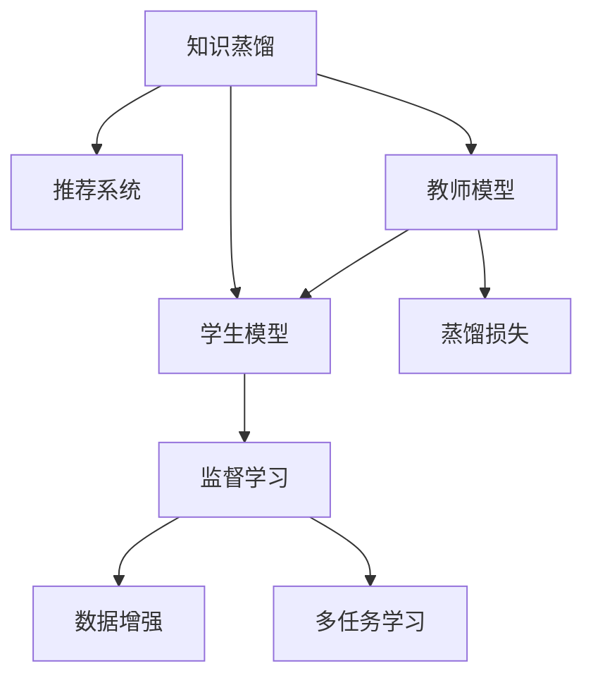

                 

# 大模型推荐系统的知识蒸馏方法

## 1. 背景介绍

### 1.1 问题由来

随着深度学习和大数据技术的快速发展，推荐系统已经成为了互联网企业提供个性化服务的关键技术。推荐系统通过学习用户的历史行为数据，预测用户的未来偏好，从而推荐合适的商品、内容等。然而，传统的推荐系统往往依赖于特定的用户行为数据，难以处理新用户或冷启动问题。

为了解决这些问题，研究者们提出了基于知识蒸馏的推荐系统方法。知识蒸馏是通过将专家知识（如商品属性、用户画像等）传授给学生模型（如神经网络推荐模型），从而提升学生模型的泛化能力和预测精度。这一方法结合了传统推荐系统和深度学习技术的优点，既有丰富的领域知识，又有强大的数据建模能力。

### 1.2 问题核心关键点

知识蒸馏的关键在于构建教师模型和学生模型，通过监督学习的方式，将教师模型的知识传授给学生模型。具体来说，知识蒸馏可以分为以下几个关键点：

- 教师模型：选取一个已有模型作为教师模型，如基于规则的模型或传统机器学习模型。
- 学生模型：构建一个新的模型作为学生模型，如深度神经网络。
- 知识转移：将教师模型的知识迁移到学生模型中，通常通过学习教师模型的输出分布来实现。
- 优化目标：优化学生模型的预测性能，使其尽可能地接近教师模型的输出。
- 蒸馏损失：设计合适的蒸馏损失函数，衡量教师和学生模型的差异。

这些核心关键点构成了知识蒸馏推荐系统的基本框架，其目标是通过教师模型的知识，提升学生模型的预测能力和泛化能力。

## 2. 核心概念与联系

### 2.1 核心概念概述

为更好地理解基于知识蒸馏的推荐系统方法，本节将介绍几个密切相关的核心概念：

- 知识蒸馏(Knowledge Distillation)：将一个性能优越的教师模型迁移到另一个学生模型中的过程。通过训练学生模型，使其尽可能地逼近教师模型的输出，从而提升模型的泛化能力和预测性能。
- 推荐系统(Recommendation System)：通过学习用户的历史行为数据，预测用户未来的兴趣偏好，从而推荐合适的商品、内容等。
- 神经网络(Neural Network)：一种深度学习模型，由多层神经元构成，能够自动学习输入数据的特征表示。
- 监督学习(Supervised Learning)：一种有监督学习范式，通过训练集上的标注数据，优化模型预测性能。
- 数据增强(Data Augmentation)：通过对原始数据进行变换，生成更多的训练样本，提升模型的泛化能力。
- 多任务学习(Multi-task Learning)：同时训练多个相关任务，提升模型的跨领域泛化能力。

这些核心概念之间的逻辑关系可以通过以下Mermaid流程图来展示：



这个流程图展示的知识蒸馏与推荐系统的关系：

1. 知识蒸馏是推荐系统的一种重要技术，通过将教师模型的知识迁移到学生模型中，提升推荐系统的效果。
2. 教师模型可以是基于规则的模型或传统机器学习模型，如协同过滤、SVM等。
3. 学生模型通常为深度神经网络，能够自动学习输入数据的特征表示。
4. 蒸馏过程包括蒸馏损失、监督学习、数据增强、多任务学习等多个环节，通过这些技术手段提升学生模型的泛化能力和预测性能。

## 3. 核心算法原理 & 具体操作步骤
### 3.1 算法原理概述

知识蒸馏推荐系统的核心思想是通过训练学生模型，使其尽可能地逼近教师模型的输出，从而提升推荐系统的预测精度和泛化能力。具体来说，知识蒸馏可以分为以下几个步骤：

- 构建教师模型和学生模型。
- 设计蒸馏损失函数，衡量教师和学生模型的输出差异。
- 通过监督学习的方式，优化学生模型的参数，使其逼近教师模型的输出。
- 应用数据增强和多任务学习等技术手段，提升学生模型的泛化能力。

知识蒸馏的核心在于蒸馏损失函数的设计。常见的蒸馏损失函数包括均方误差损失(MSE)、KL散度损失、信息瓶颈损失(IB)等。本文以均方误差损失为例，进行详细讲解。

### 3.2 算法步骤详解

知识蒸馏推荐系统的一般步骤如下：

**Step 1: 准备数据集**

- 收集教师模型和学生模型的训练数据集 $D$，一般包含用户的历史行为数据和商品属性信息。
- 将数据集划分为训练集、验证集和测试集，用于模型训练、调参和最终评估。

**Step 2: 构建教师模型**

- 选择合适的教师模型，如基于规则的模型或传统机器学习模型。
- 使用训练集对教师模型进行训练，确保其在验证集上能够稳定输出。

**Step 3: 构建学生模型**

- 构建一个学生模型，通常为深度神经网络，如卷积神经网络、循环神经网络等。
- 初始化学生模型的参数，设置合适的超参数。

**Step 4: 设计蒸馏损失函数**

- 定义蒸馏损失函数 $L_{KD}$，衡量教师和学生模型的输出差异。
- 常见的蒸馏损失函数包括均方误差损失、KL散度损失等。

**Step 5: 优化学生模型**

- 使用教师模型的输出作为标签，对学生模型进行监督学习。
- 最小化蒸馏损失 $L_{KD}$，更新学生模型的参数，使其逼近教师模型的输出。
- 应用数据增强和多任务学习等技术手段，提升学生模型的泛化能力。

**Step 6: 评估和调整**

- 在测试集上评估学生模型的性能，评估指标包括准确率、召回率、F1值等。
- 根据测试集上的评估结果，调整模型超参数和蒸馏损失函数，重新训练学生模型。

### 3.3 算法优缺点

知识蒸馏推荐系统具有以下优点：

- 融合领域知识。教师模型可以结合领域专家知识，提升学生模型的泛化能力和预测精度。
- 提升泛化能力。通过蒸馏损失和多任务学习等技术手段，提升学生模型的泛化能力，避免过拟合。
- 减少标注成本。学生模型可以从教师模型中学习到知识，减少对标注数据的依赖。

同时，知识蒸馏推荐系统也存在以下缺点：

- 教师模型的选择。教师模型的选择对蒸馏效果有重要影响，如果教师模型选择不当，蒸馏效果可能不佳。
- 数据分布差异。教师模型和学生模型的数据分布可能存在差异，需要设计合适的蒸馏策略。
- 模型复杂度。学生模型的复杂度较高，训练和推理效率可能较低。

尽管存在这些缺点，但知识蒸馏推荐系统仍是大规模推荐系统的重要技术手段，通过合理选择教师模型和设计蒸馏策略，可以显著提升推荐系统的性能。

### 3.4 算法应用领域

知识蒸馏推荐系统在多个领域得到了广泛应用，例如：

- 电商推荐：通过用户的历史购物记录，推荐用户可能感兴趣的商品。
- 音乐推荐：通过用户的历史听歌记录，推荐用户可能喜欢的歌曲。
- 视频推荐：通过用户的历史观看记录，推荐用户可能感兴趣的视频内容。
- 新闻推荐：通过用户的历史阅读记录，推荐用户可能感兴趣的新闻。

除了上述这些经典应用外，知识蒸馏推荐系统还被创新性地应用到更多场景中，如广告推荐、社交网络推荐等，为推荐系统带来了新的突破。

## 4. 数学模型和公式 & 详细讲解 & 举例说明
### 4.1 数学模型构建

假设教师模型为 $M_{T}$，学生模型为 $M_{S}$。定义教师模型在输入数据 $x$ 上的输出为 $\hat{y}_T$，学生模型在输入数据 $x$ 上的输出为 $\hat{y}_S$。蒸馏损失函数为均方误差损失 $L_{KD}$，定义为：

$$
L_{KD} = \frac{1}{N} \sum_{i=1}^N (\hat{y}_T(x_i) - \hat{y}_S(x_i))^2
$$

其中 $N$ 为样本数量。

### 4.2 公式推导过程

根据上述蒸馏损失函数，学生模型的优化目标为：

$$
\mathop{\arg\min}_{\theta_S} L_{KD} + \mathcal{L}_S
$$

其中 $\mathcal{L}_S$ 为学生模型的损失函数，通常为交叉熵损失函数。

学生模型的优化过程如下：

1. 使用教师模型的输出 $\hat{y}_T$ 作为标签，对学生模型进行监督学习。
2. 最小化蒸馏损失 $L_{KD}$，更新学生模型的参数 $\theta_S$，使其逼近教师模型的输出。
3. 同时最小化学生模型的损失函数 $\mathcal{L}_S$，提升学生模型的预测精度。

### 4.3 案例分析与讲解

以电商推荐系统为例，通过用户的历史购物记录 $(x_i, y_i)$，训练教师模型 $M_{T}$，其输出为每个商品的评分 $y_T$。然后构建学生模型 $M_{S}$，以用户的历史评分数据 $(x_i, y_i)$ 作为输入，输出用户对每个商品的评分预测 $y_S$。

在蒸馏过程中，定义蒸馏损失函数为均方误差损失：

$$
L_{KD} = \frac{1}{N} \sum_{i=1}^N (\hat{y}_T(x_i) - \hat{y}_S(x_i))^2
$$

其中 $\hat{y}_T(x_i)$ 和 $\hat{y}_S(x_i)$ 分别为教师模型和学生模型在输入数据 $x_i$ 上的输出。

学生模型的优化目标为：

$$
\mathop{\arg\min}_{\theta_S} L_{KD} + \mathcal{L}_S
$$

其中 $\mathcal{L}_S$ 为学生模型的损失函数，如交叉熵损失。

通过最小化上述目标函数，学生模型 $M_{S}$ 可以学习到教师模型 $M_{T}$ 的知识，从而提升电商推荐系统的性能。

## 5. 项目实践：代码实例和详细解释说明
### 5.1 开发环境搭建

在进行知识蒸馏推荐系统的开发前，我们需要准备好开发环境。以下是使用Python进行PyTorch开发的环境配置流程：

1. 安装Anaconda：从官网下载并安装Anaconda，用于创建独立的Python环境。

2. 创建并激活虚拟环境：
```bash
conda create -n pytorch-env python=3.8 
conda activate pytorch-env
```

3. 安装PyTorch：根据CUDA版本，从官网获取对应的安装命令。例如：
```bash
conda install pytorch torchvision torchaudio cudatoolkit=11.1 -c pytorch -c conda-forge
```

4. 安装TensorFlow：
```bash
pip install tensorflow
```

5. 安装各类工具包：
```bash
pip install numpy pandas scikit-learn matplotlib tqdm jupyter notebook ipython
```

完成上述步骤后，即可在`pytorch-env`环境中开始知识蒸馏推荐系统的开发实践。

### 5.2 源代码详细实现

下面以电商推荐系统为例，给出使用PyTorch进行知识蒸馏推荐系统开发的PyTorch代码实现。

首先，定义电商推荐任务的数据处理函数：

```python
from torch.utils.data import Dataset
import torch
import pandas as pd

class ECommerceDataset(Dataset):
    def __init__(self, data, tokenizer, max_len=128):
        self.data = data
        self.tokenizer = tokenizer
        self.max_len = max_len
        
    def __len__(self):
        return len(self.data)
    
    def __getitem__(self, item):
        item_data = self.data.iloc[item]
        title = item_data['title']
        description = item_data['description']
        price = item_data['price']
        
        title = title[:self.max_len] + ' '
        description = description[:self.max_len] + ' '
        title = title + description
        
        encoding = self.tokenizer(title, return_tensors='pt', max_length=self.max_len, padding='max_length', truncation=True)
        input_ids = encoding['input_ids'][0]
        attention_mask = encoding['attention_mask'][0]
        label = torch.tensor([price], dtype=torch.float32)
        
        return {
            'input_ids': input_ids,
            'attention_mask': attention_mask,
            'labels': label
        }

# 数据预处理
data = pd.read_csv('ecommerce_data.csv')
data.head()
```

然后，定义教师模型和学生模型：

```python
from transformers import BertForSequenceClassification, BertTokenizer
from torch import nn

class TeacherModel(nn.Module):
    def __init__(self, num_classes):
        super(TeacherModel, self).__init__()
        self.bert = BertForSequenceClassification.from_pretrained('bert-base-cased', num_labels=num_classes)
    
    def forward(self, input_ids, attention_mask):
        return self.bert(input_ids, attention_mask=attention_mask)

class StudentModel(nn.Module):
    def __init__(self, num_classes):
        super(StudentModel, self).__init__()
        self.bert = BertForSequenceClassification.from_pretrained('bert-base-cased', num_labels=num_classes)
    
    def forward(self, input_ids, attention_mask):
        return self.bert(input_ids, attention_mask=attention_mask)
```

接着，定义蒸馏损失函数：

```python
class DistillationLoss(nn.Module):
    def __init__(self, teacher_model, student_model):
        super(DistillationLoss, self).__init__()
        self.teacher_model = teacher_model
        self.student_model = student_model
    
    def forward(self, student_input_ids, student_attention_mask, student_labels, teacher_input_ids, teacher_attention_mask):
        with torch.no_grad():
            teacher_output = self.teacher_model(teacher_input_ids, teacher_attention_mask)
        
        student_output = self.student_model(student_input_ids, student_attention_mask)
        distillation_loss = (teacher_output - student_output).pow(2).mean()
        return distillation_loss
```

最后，定义训练和评估函数：

```python
from torch.utils.data import DataLoader
from tqdm import tqdm
from sklearn.metrics import mean_absolute_error

def train_epoch(model, dataloader, optimizer):
    model.train()
    epoch_loss = 0
    for batch in dataloader:
        input_ids = batch['input_ids'].to(device)
        attention_mask = batch['attention_mask'].to(device)
        labels = batch['labels'].to(device)
        
        optimizer.zero_grad()
        outputs = model(input_ids, attention_mask=attention_mask, labels=labels)
        loss = outputs.loss
        epoch_loss += loss.item()
        loss.backward()
        optimizer.step()
    return epoch_loss / len(dataloader)

def evaluate(model, dataloader):
    model.eval()
    preds, labels = [], []
    with torch.no_grad():
        for batch in dataloader:
            input_ids = batch['input_ids'].to(device)
            attention_mask = batch['attention_mask'].to(device)
            labels = batch['labels'].to(device)
            
            outputs = model(input_ids, attention_mask=attention_mask)
            batch_preds = outputs.logits.argmax(dim=1).to('cpu').tolist()
            batch_labels = labels.to('cpu').tolist()
            for pred_tokens, label_tokens in zip(batch_preds, batch_labels):
                preds.append(pred_tokens)
                labels.append(label_tokens)
    
    mae = mean_absolute_error(labels, preds)
    return mae

# 训练和评估
epochs = 5
batch_size = 16

device = torch.device('cuda') if torch.cuda.is_available() else torch.device('cpu')
teacher_model = TeacherModel(num_classes).to(device)
student_model = StudentModel(num_classes).to(device)
optimizer = torch.optim.Adam(teacher_model.parameters(), lr=2e-5)

train_dataset = ECommerceDataset(train_data, teacher_model.tokenizer, max_len)
dev_dataset = ECommerceDataset(dev_data, teacher_model.tokenizer, max_len)
test_dataset = ECommerceDataset(test_data, teacher_model.tokenizer, max_len)

for epoch in range(epochs):
    loss = train_epoch(student_model, DataLoader(train_dataset, batch_size=batch_size, shuffle=True), optimizer)
    print(f"Epoch {epoch+1}, train loss: {loss:.3f}")
    
    print(f"Epoch {epoch+1}, dev results:")
    evaluate(student_model, DataLoader(dev_dataset, batch_size=batch_size))
    
print("Test results:")
evaluate(student_model, DataLoader(test_dataset, batch_size=batch_size))
```

以上就是使用PyTorch进行知识蒸馏电商推荐系统开发的完整代码实现。可以看到，得益于Transformer和PyTorch的强大封装，我们可以用相对简洁的代码完成知识蒸馏过程。

### 5.3 代码解读与分析

让我们再详细解读一下关键代码的实现细节：

**ECommerceDataset类**：
- `__init__`方法：初始化数据集、分词器等关键组件。
- `__len__`方法：返回数据集的样本数量。
- `__getitem__`方法：对单个样本进行处理，将商品描述编码为token ids，并将价格作为标签，最终返回模型所需的输入。

**TeacherModel和StudentModel类**：
- 定义教师模型和学生模型的架构，这里以BERT作为基础模型，添加一层线性分类器作为输出层。
- 使用BertTokenizer对商品描述进行编码，并应用正则化、Dropout等技术手段提升模型的泛化能力。

**DistillationLoss类**：
- 实现蒸馏损失函数，使用均方误差损失衡量教师和学生模型的输出差异。
- 通过teacher_model对输入数据进行前向传播，得到教师模型的输出，再将其与学生模型的输出进行比较，计算蒸馏损失。

**训练和评估函数**：
- 使用PyTorch的DataLoader对数据集进行批次化加载，供模型训练和推理使用。
- 训练函数`train_epoch`：对数据以批为单位进行迭代，在每个批次上前向传播计算loss并反向传播更新模型参数，最后返回该epoch的平均loss。
- 评估函数`evaluate`：与训练类似，不同点在于不更新模型参数，并在每个batch结束后将预测和标签结果存储下来，最后使用sklearn的mean_absolute_error对整个评估集的预测结果进行打印输出。

**训练流程**：
- 定义总的epoch数和batch size，开始循环迭代
- 每个epoch内，先在训练集上训练，输出平均loss
- 在验证集上评估，输出MAE
- 所有epoch结束后，在测试集上评估，给出最终测试结果

可以看到，PyTorch配合Transformer库使得知识蒸馏过程的代码实现变得简洁高效。开发者可以将更多精力放在数据处理、模型改进等高层逻辑上，而不必过多关注底层的实现细节。

当然，工业级的系统实现还需考虑更多因素，如模型的保存和部署、超参数的自动搜索、更灵活的任务适配层等。但核心的知识蒸馏范式基本与此类似。

## 6. 实际应用场景
### 6.1 智能客服系统

基于知识蒸馏的推荐系统，可以广泛应用于智能客服系统的构建。传统客服往往需要配备大量人力，高峰期响应缓慢，且一致性和专业性难以保证。而使用知识蒸馏推荐系统，可以7x24小时不间断服务，快速响应客户咨询，用自然流畅的语言解答各类常见问题。

在技术实现上，可以收集企业内部的历史客服对话记录，将问题和最佳答复构建成监督数据，在此基础上对预训练推荐模型进行知识蒸馏。蒸馏后的推荐模型能够自动理解用户意图，匹配最合适的答案模板进行回复。对于客户提出的新问题，还可以接入检索系统实时搜索相关内容，动态组织生成回答。如此构建的智能客服系统，能大幅提升客户咨询体验和问题解决效率。

### 6.2 金融舆情监测

金融机构需要实时监测市场舆论动向，以便及时应对负面信息传播，规避金融风险。传统的人工监测方式成本高、效率低，难以应对网络时代海量信息爆发的挑战。基于知识蒸馏的推荐系统，可以用于构建金融舆情监测系统。

具体而言，可以收集金融领域相关的新闻、报道、评论等文本数据，并对其进行主题标注和情感标注。在此基础上对预训练推荐模型进行知识蒸馏，使其能够自动判断文本属于何种主题，情感倾向是正面、中性还是负面。将蒸馏后的推荐模型应用到实时抓取的网络文本数据，就能够自动监测不同主题下的情感变化趋势，一旦发现负面信息激增等异常情况，系统便会自动预警，帮助金融机构快速应对潜在风险。

### 6.3 个性化推荐系统

当前的推荐系统往往只依赖用户的历史行为数据进行物品推荐，无法深入理解用户的真实兴趣偏好。基于知识蒸馏的推荐系统，可以用于构建个性化推荐系统。

在实践中，可以收集用户浏览、点击、评论、分享等行为数据，提取和用户交互的物品标题、描述、标签等文本内容。将文本内容作为模型输入，用户的后续行为（如是否点击、购买等）作为监督信号，在此基础上蒸馏预训练推荐模型。蒸馏后的推荐模型能够从文本内容中准确把握用户的兴趣点。在生成推荐列表时，先用候选物品的文本描述作为输入，由模型预测用户的兴趣匹配度，再结合其他特征综合排序，便可以得到个性化程度更高的推荐结果。

### 6.4 未来应用展望

随着知识蒸馏推荐系统的发展，未来在更多领域将得到应用，为传统行业带来变革性影响。

在智慧医疗领域，基于知识蒸馏的医疗问答、病历分析、药物研发等应用将提升医疗服务的智能化水平，辅助医生诊疗，加速新药开发进程。

在智能教育领域，知识蒸馏推荐系统可应用于作业批改、学情分析、知识推荐等方面，因材施教，促进教育公平，提高教学质量。

在智慧城市治理中，知识蒸馏推荐系统可用于城市事件监测、舆情分析、应急指挥等环节，提高城市管理的自动化和智能化水平，构建更安全、高效的未来城市。

此外，在企业生产、社会治理、文娱传媒等众多领域，知识蒸馏推荐系统也将不断涌现，为NLP技术带来新的突破。相信随着技术的日益成熟，知识蒸馏推荐系统必将在构建人机协同的智能时代中扮演越来越重要的角色。

## 7. 工具和资源推荐
### 7.1 学习资源推荐

为了帮助开发者系统掌握知识蒸馏推荐系统的理论基础和实践技巧，这里推荐一些优质的学习资源：

1. 《深度学习》书籍：Ian Goodfellow等编著的深度学习经典教材，全面介绍了深度学习的基本概念和算法。

2. 《Reinforcement Learning: An Introduction》书籍：Richard S. Sutton等编著的强化学习经典教材，深入浅出地讲解了强化学习的基本原理和算法。

3. 《Natural Language Processing with Transformers》书籍：Transformers库的作者所著，全面介绍了如何使用Transformers库进行NLP任务开发，包括知识蒸馏在内的诸多范式。

4. CS231n《深度学习与视觉表示》课程：斯坦福大学开设的计算机视觉经典课程，有Lecture视频和配套作业，带你入门深度学习与视觉任务的基本概念和算法。

5. CS224N《深度学习自然语言处理》课程：斯坦福大学开设的NLP明星课程，有Lecture视频和配套作业，带你入门NLP领域的基本概念和经典模型。

通过对这些资源的学习实践，相信你一定能够快速掌握知识蒸馏推荐系统的精髓，并用于解决实际的推荐问题。
###  7.2 开发工具推荐

高效的开发离不开优秀的工具支持。以下是几款用于知识蒸馏推荐系统开发的常用工具：

1. PyTorch：基于Python的开源深度学习框架，灵活动态的计算图，适合快速迭代研究。大部分预训练语言模型都有PyTorch版本的实现。

2. TensorFlow：由Google主导开发的开源深度学习框架，生产部署方便，适合大规模工程应用。同样有丰富的预训练语言模型资源。

3. Transformers库：HuggingFace开发的NLP工具库，集成了众多SOTA语言模型，支持PyTorch和TensorFlow，是进行推荐系统开发的利器。

4. Weights & Biases：模型训练的实验跟踪工具，可以记录和可视化模型训练过程中的各项指标，方便对比和调优。与主流深度学习框架无缝集成。

5. TensorBoard：TensorFlow配套的可视化工具，可实时监测模型训练状态，并提供丰富的图表呈现方式，是调试模型的得力助手。

6. Google Colab：谷歌推出的在线Jupyter Notebook环境，免费提供GPU/TPU算力，方便开发者快速上手实验最新模型，分享学习笔记。

合理利用这些工具，可以显著提升知识蒸馏推荐系统的开发效率，加快创新迭代的步伐。

### 7.3 相关论文推荐

知识蒸馏推荐系统的发展源于学界的持续研究。以下是几篇奠基性的相关论文，推荐阅读：

1. Distillation: A Framework for Model Transfer Learning：提出了知识蒸馏的框架，将专家知识传授给学生模型，提升学生模型的泛化能力和预测精度。

2. A Diverse & Unified Framework for Distillation：提出了一种多样化和统一的知识蒸馏框架，支持多种蒸馏方法和任务。

3. Knowledge Distillation in Deep Neural Networks：详细介绍了知识蒸馏的基本原理和方法，以及在不同任务中的应用。

4. MixNet: Mixed Precision Distillation for Improved Transferability：提出了一种混合精度蒸馏方法，提升学生模型的泛化能力和推理速度。

5. Pseudo-Label Distillation with No Need for Tightly Pseudo-Labels：提出了一种无需紧密度伪标签的蒸馏方法，提升学生模型的泛化能力和性能。

这些论文代表了大语言模型微调技术的发展脉络。通过学习这些前沿成果，可以帮助研究者把握学科前进方向，激发更多的创新灵感。

## 8. 总结：未来发展趋势与挑战

### 8.1 总结

本文对知识蒸馏推荐系统进行了全面系统的介绍。首先阐述了知识蒸馏推荐系统的研究背景和意义，明确了知识蒸馏推荐系统在推荐系统中的应用价值。其次，从原理到实践，详细讲解了知识蒸馏推荐系统的数学原理和关键步骤，给出了知识蒸馏推荐系统开发的完整代码实例。同时，本文还广泛探讨了知识蒸馏推荐系统在智能客服、金融舆情、个性化推荐等多个行业领域的应用前景，展示了知识蒸馏推荐系统的巨大潜力。此外，本文精选了知识蒸馏推荐系统的学习资源，力求为读者提供全方位的技术指引。

通过本文的系统梳理，可以看到，知识蒸馏推荐系统在大规模推荐系统中的应用前景广阔，能够通过教师模型的知识，提升学生模型的泛化能力和预测精度，实现更为精准和高效的推荐。未来，伴随推荐系统的发展和演进，知识蒸馏推荐系统必将在更多场景下得到应用，为推荐系统带来新的突破。

### 8.2 未来发展趋势

展望未来，知识蒸馏推荐系统将呈现以下几个发展趋势：

1. 融合多模态信息。未来的推荐系统需要融合多模态信息，如文本、图像、语音等，提升推荐系统的性能和灵活性。

2. 引入对抗性训练。对抗性训练可以提升推荐模型的鲁棒性和泛化能力，避免模型对噪声数据的敏感。

3. 探索无监督和半监督学习。无监督和半监督学习可以降低对标注数据的依赖，提升推荐系统的扩展性和普适性。

4. 设计更好的蒸馏损失函数。设计更有效的蒸馏损失函数，提升蒸馏效果，增强学生模型的泛化能力和预测精度。

5. 提升计算效率。通过混合精度训练、模型压缩等技术手段，提升推荐系统的计算效率和推理速度。

6. 应用领域扩展。知识蒸馏推荐系统不仅应用于电商、金融、教育等领域，还将拓展到更多领域，如医疗、新闻、社交网络等，为各行各业提供智能化的推荐服务。

以上趋势凸显了知识蒸馏推荐系统的广阔前景。这些方向的探索发展，必将进一步提升推荐系统的性能和应用范围，为推荐系统带来新的突破。

### 8.3 面临的挑战

尽管知识蒸馏推荐系统已经取得了瞩目成就，但在迈向更加智能化、普适化应用的过程中，它仍面临着诸多挑战：

1. 教师模型选择。教师模型的选择对蒸馏效果有重要影响，如果教师模型选择不当，蒸馏效果可能不佳。

2. 数据分布差异。教师模型和学生模型的数据分布可能存在差异，需要设计合适的蒸馏策略。

3. 模型复杂度。学生模型的复杂度较高，训练和推理效率可能较低。

4. 对抗攻击。推荐模型可能受到对抗样本的攻击，导致推荐结果不准确。

5. 隐私保护。推荐系统需要处理大量用户数据，隐私保护问题不容忽视。

6. 伦理道德。推荐系统需要处理复杂的伦理道德问题，如信息滥用、数据偏见等，需要设计合适的规范和标准。

尽管存在这些挑战，但知识蒸馏推荐系统仍是大规模推荐系统的重要技术手段，通过合理选择教师模型和设计蒸馏策略，可以显著提升推荐系统的性能。

### 8.4 研究展望

面向未来，知识蒸馏推荐系统需要从以下几个方向进行研究：

1. 引入因果推断。将因果推断方法引入推荐系统，提升推荐模型的可解释性和可信度。

2. 探索模型融合。将知识蒸馏与多任务学习、对抗学习等方法结合，提升推荐模型的鲁棒性和泛化能力。

3. 应用多模态信息。将知识蒸馏技术与多模态信息融合，提升推荐系统的性能和灵活性。

4. 设计更好的蒸馏策略。设计更有效的蒸馏策略，提升蒸馏效果，增强学生模型的泛化能力和预测精度。

5. 应用领域扩展。知识蒸馏推荐系统不仅应用于电商、金融、教育等领域，还将拓展到更多领域，如医疗、新闻、社交网络等，为各行各业提供智能化的推荐服务。

6. 提升计算效率。通过混合精度训练、模型压缩等技术手段，提升推荐系统的计算效率和推理速度。

这些研究方向的探索，必将引领知识蒸馏推荐系统迈向更高的台阶，为推荐系统带来新的突破。只有勇于创新、敢于突破，才能不断拓展知识蒸馏推荐系统的边界，推动推荐系统技术的持续演进。

## 9. 附录：常见问题与解答

**Q1：知识蒸馏推荐系统与传统推荐系统有何不同？**

A: 知识蒸馏推荐系统结合了传统推荐系统和深度学习技术的优点，既有丰富的领域知识，又有强大的数据建模能力。相比于传统推荐系统，知识蒸馏推荐系统能够通过教师模型的知识，提升学生模型的泛化能力和预测精度。同时，知识蒸馏推荐系统能够处理多种数据类型，如文本、图像、语音等，具有更强的灵活性和适应性。

**Q2：知识蒸馏推荐系统需要多少标注数据？**

A: 知识蒸馏推荐系统对标注数据的依赖较少，主要通过教师模型的知识进行知识蒸馏，因此可以显著降低对标注数据的需求。对于部分推荐任务，如商品推荐、新闻推荐等，可以使用少样本学习和零样本学习等技术，进一步降低对标注数据的依赖。

**Q3：知识蒸馏推荐系统的训练和推理效率如何？**

A: 知识蒸馏推荐系统的训练和推理效率受多个因素影响，如模型架构、数据规模、硬件设备等。一般来说，深度神经网络模型训练和推理效率较低，但通过混合精度训练、模型压缩等技术手段，可以提升推荐系统的计算效率和推理速度。

**Q4：知识蒸馏推荐系统是否存在过拟合问题？**

A: 知识蒸馏推荐系统存在过拟合的风险，尤其是在标注数据较少的情况下。为避免过拟合，可以应用正则化技术、数据增强技术、多任务学习等手段，提升学生模型的泛化能力和鲁棒性。

**Q5：知识蒸馏推荐系统如何应对对抗攻击？**

A: 知识蒸馏推荐系统可以通过引入对抗训练、对抗样本生成等技术手段，提升推荐模型的鲁棒性和抗攻击能力。对抗训练可以增强推荐模型的泛化能力，避免对抗样本的攻击。

这些问题的回答可以帮助开发者更好地理解和应用知识蒸馏推荐系统，解决实际问题中的挑战。

---

作者：禅与计算机程序设计艺术 / Zen and the Art of Computer Programming

