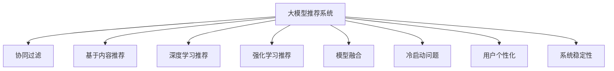

                 

# 大模型推荐系统的统一化趋势

> 关键词：大模型推荐系统、统一化趋势、协同过滤、深度学习、强化学习、模型融合、冷启动问题

## 1. 背景介绍

### 1.1 问题由来
推荐系统作为互联网企业的重要应用，旨在为用户提供个性化信息，极大地提升了用户体验。传统的推荐算法主要分为基于协同过滤和基于内容的推荐两种。协同过滤算法主要利用用户之间的行为相似性进行推荐，而基于内容的推荐则侧重于分析物品的属性特征，以预测用户偏好。

然而，这些算法都存在一定的局限性：协同过滤算法难以处理冷启动问题和新物品推荐；基于内容的推荐则需要人工提取和构建物品属性特征，繁琐且低效。近年来，大模型推荐系统逐渐兴起，利用预训练语言模型（如BERT、GPT-3等）在自然语言处理领域取得的优势，对推荐系统进行深度学习优化，在处理大规模数据和复杂推荐场景上取得了显著成效。

## 2. 核心概念与联系

### 2.1 核心概念概述

为更好地理解大模型推荐系统的统一化趋势，本节将介绍几个密切相关的核心概念：

- 大模型推荐系统：利用预训练语言模型，如BERT、GPT-3等，对推荐系统进行深度学习优化，实现更加准确和个性化的推荐效果。

- 协同过滤：基于用户行为数据进行推荐，通过计算用户之间的相似度，预测用户的潜在兴趣。

- 基于内容推荐：利用物品的属性特征，如评分、标签、文本描述等，计算用户对物品的兴趣。

- 深度学习推荐：利用深度神经网络，对用户和物品进行表征学习，进行推荐预测。

- 强化学习推荐：通过学习用户交互数据，构建推荐策略，最大化用户满意度。

- 模型融合：将不同算法、模型、特征等进行融合，提升推荐系统性能。

- 冷启动问题：新用户或新物品加入推荐系统时，无法利用历史行为数据进行推荐，导致推荐效果不理想。

- 用户个性化：根据用户历史行为和偏好，提供个性化推荐，提升用户体验。

- 系统稳定性：保证推荐系统在长时间运行中，性能稳定可靠，不出现大幅波动。

这些核心概念之间的逻辑关系可以通过以下Mermaid流程图来展示：



这个流程图展示了大模型推荐系统的核心概念及其之间的关系：

1. 大模型推荐系统综合了协同过滤、基于内容推荐、深度学习推荐、强化学习推荐等多种推荐技术。
2. 协同过滤和基于内容推荐是传统推荐方法的基础，但在大模型推荐系统中，通过深度学习优化，可以实现更加高效和准确的推荐。
3. 强化学习推荐和大模型推荐系统结合，可以实现动态调整推荐策略，提升用户满意度。
4. 模型融合可以充分利用不同推荐方法的优点，提升整体系统性能。
5. 冷启动问题和大模型推荐系统结合，可以通过预训练语言模型进行用户兴趣预测，缓解冷启动问题。
6. 用户个性化和大模型推荐系统结合，可以实现更加精准的个性化推荐。
7. 系统稳定性和大模型推荐系统结合，可以通过多种策略保障推荐系统运行平稳。

## 3. 核心算法原理 & 具体操作步骤

### 3.1 算法原理概述

大模型推荐系统的统一化趋势，本质上是通过深度学习技术，将传统的推荐方法进行优化和整合，实现更加高效和精确的推荐。其核心思想是：利用大模型对用户和物品进行表示学习，建立用户兴趣和物品特征的关联模型，从而进行推荐预测。

形式化地，假设用户集为 $U$，物品集为 $I$，用户对物品的评分矩阵为 $R$，用户行为序列为 $S$，大模型为 $M_{\theta}$，其中 $\theta$ 为模型参数。推荐系统通过预训练语言模型对用户和物品进行表征学习，得到用户兴趣表示 $u_i \in \mathbb{R}^d$ 和物品特征表示 $v_j \in \mathbb{R}^d$，则推荐模型 $P_{\theta}$ 为：

$$
P_{\theta}(u_i,v_j) = \sigma(\langle u_i, v_j \rangle)
$$

其中 $\sigma$ 为激活函数，$\langle \cdot, \cdot \rangle$ 为向量内积。推荐系统的主要任务是最大化预测评分与实际评分之间的差距，即：

$$
\min_{\theta} \sum_{i,j} (R_{ij} - P_{\theta}(u_i, v_j))^2
$$

### 3.2 算法步骤详解

大模型推荐系统的主要操作步骤如下：

**Step 1: 数据准备与预处理**

- 收集用户行为数据、物品属性数据等，并进行清洗和预处理。
- 构建用户行为序列、物品属性向量等特征。
- 对大模型进行微调或训练，得到用户兴趣表示和物品特征表示。

**Step 2: 特征工程与表示学习**

- 对用户和物品进行特征工程，提取有用的特征，如用户年龄、职业、历史评分等。
- 利用大模型对用户和物品进行表征学习，得到高维向量表示。
- 将用户和物品的向量表示进行拼接或融合，得到综合向量表示。

**Step 3: 推荐模型构建与训练**

- 构建推荐模型，如基于点积的评分预测模型，或基于神经网络的预测模型。
- 使用用户和物品的综合向量表示作为输入，训练推荐模型。
- 通过交叉验证或早期停止等策略，调整训练超参数。

**Step 4: 推荐结果生成**

- 将新用户或物品输入推荐模型，得到预测评分。
- 对预测评分进行排序，生成推荐结果。
- 根据业务需求，进行推荐结果的呈现和展示。

**Step 5: 系统优化与维护**

- 利用模型融合、对抗训练等技术，提升推荐系统性能。
- 定期更新大模型和推荐模型，以适应数据分布的变化。
- 监控推荐系统运行状态，及时进行故障诊断和修复。

### 3.3 算法优缺点

大模型推荐系统的统一化趋势具有以下优点：

1. 高效性：利用深度学习和大模型，可以在短时间内处理大量数据，提供实时推荐。
2. 准确性：通过语言模型和大模型，可以实现更准确的用户兴趣和物品特征表示。
3. 泛化性：大模型具有较强的泛化能力，可以适应各种推荐场景。
4. 可解释性：深度学习模型可以通过特征可视化、梯度图等方式，提供一定程度的可解释性。

但同时，该方法也存在一定的局限性：

1. 资源需求高：大模型推荐系统需要大量的计算资源和存储空间，可能面临资源瓶颈。
2. 冷启动问题：大模型推荐系统在处理冷启动问题时，仍需要一些初始化措施。
3. 数据质量要求高：推荐系统需要高质量的标注数据和行为数据，数据质量会影响推荐效果。
4. 可解释性不足：深度学习模型难以解释其内部决策过程，存在一定的不透明性。

尽管存在这些局限性，但就目前而言，大模型推荐系统的统一化趋势，仍然是大数据推荐技术的重要方向。未来相关研究将继续致力于提升模型的效率、准确性和可解释性，同时降低资源需求，解决冷启动问题，提高系统的可靠性。

### 3.4 算法应用领域

大模型推荐系统的统一化趋势，已经在多个领域得到了应用，包括但不限于：

- 电子商务：如淘宝、京东等电商平台，利用大模型进行商品推荐，提升用户购买体验。
- 视频网站：如Netflix、Bilibili等平台，利用大模型推荐视频内容，提高用户粘性。
- 音乐平台：如Spotify、网易云音乐等，利用大模型推荐音乐内容，优化个性化推荐。
- 社交网络：如Facebook、微信等，利用大模型推荐好友关系、兴趣内容，增强社交互动。
- 新闻网站：如今日头条、Google News等，利用大模型推荐新闻内容，提升用户阅读体验。

此外，大模型推荐系统还被创新性地应用到更多场景中，如智能家居、智慧医疗、智慧交通等，为各行各业提供个性化推荐服务。随着预训练语言模型和推荐技术的不断进步，相信大模型推荐系统将在更广阔的应用领域得到广泛应用。

## 4. 数学模型和公式 & 详细讲解 & 举例说明

### 4.1 数学模型构建

本节将使用数学语言对大模型推荐系统的统一化趋势进行更加严格的刻画。

假设推荐系统用户集为 $U=\{u_1, u_2, \dots, u_n\}$，物品集为 $I=\{i_1, i_2, \dots, i_m\}$，用户对物品的评分矩阵为 $R \in \mathbb{R}^{n \times m}$，用户行为序列为 $S=\{s_1, s_2, \dots, s_t\}$。

定义大模型 $M_{\theta}$ 对用户 $u_i$ 和物品 $i_j$ 的表示为：

$$
u_i = M_{\theta}(s_i), \quad v_j = M_{\theta}(i_j)
$$

其中 $s_i$ 为用户行为序列，$i_j$ 为物品属性向量。推荐模型的预测评分为：

$$
\hat{R}_{ij} = \sigma(\langle u_i, v_j \rangle)
$$

目标是最小化预测评分与实际评分之间的差距：

$$
\min_{\theta} \sum_{i,j} (\hat{R}_{ij} - R_{ij})^2
$$

在实践中，我们通常使用基于梯度的优化算法（如Adam、SGD等）来近似求解上述最优化问题。设 $\eta$ 为学习率，$\lambda$ 为正则化系数，则参数的更新公式为：

$$
\theta \leftarrow \theta - \eta \nabla_{\theta}\mathcal{L}(\theta) - \eta\lambda\theta
$$

其中 $\nabla_{\theta}\mathcal{L}(\theta)$ 为损失函数对参数 $\theta$ 的梯度，可通过反向传播算法高效计算。

### 4.2 公式推导过程

以下我们以协同过滤推荐系统为例，推导评分预测模型的梯度更新公式。

假设协同过滤模型使用用户 $u_i$ 和物品 $i_j$ 的评分矩阵 $R$ 作为输入，则推荐模型 $P_{\theta}$ 的损失函数为：

$$
\mathcal{L}(\theta) = \frac{1}{2}\sum_{i,j} (\hat{R}_{ij} - R_{ij})^2
$$

根据链式法则，损失函数对参数 $\theta$ 的梯度为：

$$
\frac{\partial \mathcal{L}(\theta)}{\partial \theta} = -\frac{1}{N}\sum_{i,j} \frac{\partial \hat{R}_{ij}}{\partial \theta}(\hat{R}_{ij} - R_{ij})
$$

其中 $\frac{\partial \hat{R}_{ij}}{\partial \theta} = \frac{\partial \sigma(\langle u_i, v_j \rangle)}{\partial \theta}$，可由链式法则和链条规则计算得到。

在得到损失函数的梯度后，即可带入参数更新公式，完成模型的迭代优化。重复上述过程直至收敛，最终得到适应推荐任务的最优模型参数 $\theta^*$。

## 5. 项目实践：代码实例和详细解释说明

### 5.1 开发环境搭建

在进行大模型推荐系统的开发前，我们需要准备好开发环境。以下是使用Python进行PyTorch开发的环境配置流程：

1. 安装Anaconda：从官网下载并安装Anaconda，用于创建独立的Python环境。

2. 创建并激活虚拟环境：
```bash
conda create -n pytorch-env python=3.8 
conda activate pytorch-env
```

3. 安装PyTorch：根据CUDA版本，从官网获取对应的安装命令。例如：
```bash
conda install pytorch torchvision torchaudio cudatoolkit=11.1 -c pytorch -c conda-forge
```

4. 安装TensorFlow：从官网下载安装包，进行安装。
```bash
pip install tensorflow
```

5. 安装各类工具包：
```bash
pip install numpy pandas scikit-learn matplotlib tqdm jupyter notebook ipython
```

完成上述步骤后，即可在`pytorch-env`环境中开始开发实践。

### 5.2 源代码详细实现

下面我们以协同过滤推荐系统为例，给出使用TensorFlow进行推荐模型训练的PyTorch代码实现。

首先，定义协同过滤推荐模型的输入输出：

```python
import tensorflow as tf
from tensorflow.keras.layers import Input, Embedding, Dot, Flatten
from tensorflow.keras.models import Model

# 定义输入
user_input = Input(shape=(max_length,), name='user')
item_input = Input(shape=(max_length,), name='item')

# 定义嵌入层
user_embedding = Embedding(num_users, emb_size, name='user_embedding')
item_embedding = Embedding(num_items, emb_size, name='item_embedding')

# 定义点积层
dot_product = Dot(axes=1, name='dot_product')
dot_output = dot_product([user_embedding(user_input), item_embedding(item_input)])

# 定义输出层
output = Flatten(name='output')
output = Dense(1, activation='sigmoid', name='prediction')(output)

# 定义模型
model = Model(inputs=[user_input, item_input], outputs=[output])
model.compile(loss='binary_crossentropy', optimizer='adam', metrics=['accuracy'])
```

然后，定义数据加载和模型训练函数：

```python
from tensorflow.keras.preprocessing.sequence import pad_sequences
from tensorflow.keras.utils import to_categorical

# 定义数据加载函数
def load_data(file_path):
    with open(file_path, 'r') as f:
        lines = f.readlines()
    data = []
    for line in lines:
        user, item, rating = line.strip().split(',')
        user, item = int(user), int(item)
        rating = float(rating)
        data.append([user, item, rating])
    return data

# 加载数据
data = load_data('ratings.txt')

# 对数据进行预处理
max_length = 20
X_user = []
X_item = []
Y = []
for user, item, rating in data:
    X_user.append([user])
    X_item.append([item])
    Y.append(rating)
X_user = pad_sequences(X_user, maxlen=max_length)
X_item = pad_sequences(X_item, maxlen=max_length)
Y = to_categorical(Y, num_classes=num_classes)

# 定义训练函数
def train_model(model, X_train, X_item_train, Y_train, epochs, batch_size):
    model.fit([X_train, X_item_train], Y_train, batch_size=batch_size, epochs=epochs, validation_split=0.2)

# 训练模型
train_model(model, X_user, X_item, Y, 10, 32)
```

接着，定义评估函数：

```python
# 定义评估函数
def evaluate_model(model, X_test, X_item_test, Y_test):
    loss, accuracy = model.evaluate([X_test, X_item_test], Y_test, batch_size=batch_size)
    print('Test loss:', loss)
    print('Test accuracy:', accuracy)

# 加载测试数据
X_test, X_item_test, Y_test = load_data('ratings_test.txt')
X_test = pad_sequences(X_test, maxlen=max_length)
X_item_test = pad_sequences(X_item_test, maxlen=max_length)

# 评估模型
evaluate_model(model, X_test, X_item_test, Y_test)
```

最后，启动训练流程：

```python
# 加载数据
data = load_data('ratings.txt')

# 对数据进行预处理
max_length = 20
X_user = []
X_item = []
Y = []
for user, item, rating in data:
    X_user.append([user])
    X_item.append([item])
    Y.append(rating)
X_user = pad_sequences(X_user, maxlen=max_length)
X_item = pad_sequences(X_item, maxlen=max_length)
Y = to_categorical(Y, num_classes=num_classes)

# 定义训练函数
def train_model(model, X_train, X_item_train, Y_train, epochs, batch_size):
    model.fit([X_train, X_item_train], Y_train, batch_size=batch_size, epochs=epochs, validation_split=0.2)

# 训练模型
train_model(model, X_user, X_item, Y, 10, 32)

# 加载测试数据
X_test, X_item_test, Y_test = load_data('ratings_test.txt')
X_test = pad_sequences(X_test, maxlen=max_length)
X_item_test = pad_sequences(X_item_test, maxlen=max_length)

# 评估模型
evaluate_model(model, X_test, X_item_test, Y_test)
```

以上就是使用PyTorch对协同过滤推荐系统进行训练的完整代码实现。可以看到，借助TensorFlow和Keras框架，推荐系统的构建变得十分便捷高效。

### 5.3 代码解读与分析

让我们再详细解读一下关键代码的实现细节：

**Model类**：
- `Input`层：定义模型的输入，包括用户ID和物品ID。
- `Embedding`层：将用户ID和物品ID映射为高维向量表示。
- `Dot`层：计算用户和物品向量的点积，得到预测评分。
- `Flatten`层：将点积结果展开成一维向量。
- `Dense`层：输出二分类概率，进行评分预测。

**load_data函数**：
- 从文件中读取数据，将其转换为可用的格式。
- 对数据进行预处理，包括填充、标签转换等操作。

**train_model函数**：
- 对模型进行训练，设置超参数和学习率。
- 使用交叉验证或早期停止等策略，调整训练过程。

**evaluate_model函数**：
- 对模型进行评估，输出预测评分和准确率。

可以看到，利用TensorFlow和Keras框架，推荐系统的开发变得十分简便，开发者可以更多关注模型的优化和算法的设计，而无需过多关注底层实现细节。

当然，工业级的系统实现还需考虑更多因素，如模型的保存和部署、超参数的自动搜索、更灵活的任务适配层等。但核心的微调范式基本与此类似。

## 6. 实际应用场景
### 6.1 智能客服系统

基于大模型推荐系统的智能客服系统，可以显著提升客服服务质量和用户体验。传统客服需要配备大量人力，高峰期响应缓慢，且服务质量难以保证。而利用推荐系统，可以根据用户历史行为和当前状态，动态生成最优的回答策略，实现7x24小时不间断服务。

在技术实现上，可以收集客服对话历史数据，将问题-回答对作为推荐系统训练样本，训练大模型推荐系统。推荐系统根据用户输入的咨询问题，输出最合适的回答模板，通过调用预训练语言模型，生成自然流畅的回复。对于用户提出的新问题，推荐系统可以快速匹配已知模板，生成相应回答，极大地提升客服响应效率和准确性。

### 6.2 金融舆情监测

金融机构需要实时监测市场舆论动向，以便及时应对负面信息传播，规避金融风险。传统的人工监测方式成本高、效率低，难以应对网络时代海量信息爆发的挑战。利用推荐系统，可以构建金融舆情监测系统，自动监测各类财经新闻、评论等文本数据，实时获取舆情变化趋势，一旦发现负面信息激增等异常情况，系统便会自动预警，帮助金融机构快速应对潜在风险。

在技术实现上，可以收集金融领域相关的新闻、报道、评论等文本数据，并对其进行主题标注和情感标注。在此基础上对预训练语言模型进行微调，使其能够自动判断文本属于何种主题，情感倾向是正面、中性还是负面。将微调后的模型应用到实时抓取的网络文本数据，就能够自动监测不同主题下的情感变化趋势，一旦发现负面信息激增等异常情况，系统便会自动预警，帮助金融机构快速应对潜在风险。

### 6.3 个性化推荐系统

当前的推荐系统往往只依赖用户的历史行为数据进行物品推荐，无法深入理解用户的真实兴趣偏好。利用推荐系统，可以深度学习用户兴趣和物品特征，进行个性化的推荐。

在技术实现上，可以收集用户浏览、点击、评论、分享等行为数据，提取和用户交互的物品标题、描述、标签等文本内容。将文本内容作为模型输入，用户的后续行为（如是否点击、购买等）作为监督信号，在此基础上微调预训练语言模型。微调后的模型能够从文本内容中准确把握用户的兴趣点。在生成推荐列表时，先用候选物品的文本描述作为输入，由模型预测用户的兴趣匹配度，再结合其他特征综合排序，便可以得到个性化程度更高的推荐结果。

### 6.4 未来应用展望

随着大模型推荐系统的不断发展，基于微调范式将在更多领域得到应用，为传统行业带来变革性影响。

在智慧医疗领域，利用推荐系统，可以构建医疗问答、病历分析、药物研发等应用，提升医疗服务的智能化水平，辅助医生诊疗，加速新药开发进程。

在智能教育领域，利用推荐系统，可以构建作业批改、学情分析、知识推荐等应用，因材施教，促进教育公平，提高教学质量。

在智慧城市治理中，利用推荐系统，可以构建城市事件监测、舆情分析、应急指挥等环节，提高城市管理的自动化和智能化水平，构建更安全、高效的未来城市。

此外，在企业生产、社会治理、文娱传媒等众多领域，利用推荐系统，可以提供个性化的服务，提升用户体验，优化运营效率，为传统行业数字化转型升级提供新的技术路径。相信随着技术的日益成熟，推荐系统必将在更广阔的应用领域大放异彩。

## 7. 工具和资源推荐
### 7.1 学习资源推荐

为了帮助开发者系统掌握大模型推荐系统的理论基础和实践技巧，这里推荐一些优质的学习资源：

1. 《深度学习理论与实践》系列博文：由深度学习领域专家撰写，深入浅出地介绍了深度学习原理、模型训练、推荐系统等前沿话题。

2. 《TensorFlow实战》书籍：TensorFlow官方出品，全面介绍了TensorFlow框架的搭建和应用，包括推荐系统的开发。

3. 《Python机器学习》书籍：Python数据科学领域的经典之作，介绍了机器学习算法、数据处理、模型评估等基础知识。

4. CS331《推荐系统》课程：斯坦福大学开设的推荐系统课程，有Lecture视频和配套作业，带你系统学习推荐系统的理论和实践。

5. Kaggle推荐系统竞赛：Kaggle平台上的推荐系统竞赛，提供了丰富的训练数据集和基线模型，让你在实践中学习推荐系统技术。

通过对这些资源的学习实践，相信你一定能够快速掌握大模型推荐系统的精髓，并用于解决实际的推荐问题。
###  7.2 开发工具推荐

高效的开发离不开优秀的工具支持。以下是几款用于大模型推荐系统开发的常用工具：

1. TensorFlow：由Google主导开发的开源深度学习框架，生产部署方便，适合大规模工程应用。推荐系统可以借助TensorFlow进行快速迭代和优化。

2. PyTorch：基于Python的开源深度学习框架，灵活动态的计算图，适合快速迭代研究。TensorFlow和PyTorch都是当前深度学习领域的主流框架，推荐系统可以在两者中选择适合自己的工具。

3. Keras：Keras是一个高级神经网络API，可以在TensorFlow、Theano和CNTK等后端框架上运行。Keras简化了模型构建和训练过程，使得推荐系统开发更加便捷。

4. Weights & Biases：模型训练的实验跟踪工具，可以记录和可视化模型训练过程中的各项指标，方便对比和调优。与主流深度学习框架无缝集成。

5. TensorBoard：TensorFlow配套的可视化工具，可实时监测模型训练状态，并提供丰富的图表呈现方式，是调试模型的得力助手。

6. Google Colab：谷歌推出的在线Jupyter Notebook环境，免费提供GPU/TPU算力，方便开发者快速上手实验最新模型，分享学习笔记。

合理利用这些工具，可以显著提升大模型推荐系统的开发效率，加快创新迭代的步伐。

### 7.3 相关论文推荐

大模型推荐系统的不断发展源于学界的持续研究。以下是几篇奠基性的相关论文，推荐阅读：

1. "Warp-Driving the Netflix Prize": 论文介绍了Netflix推荐系统中的设计理念和技术实现，被推荐系统领域广泛引用。

2. "A Neural Collaborative Filtering Approach"：提出了神经协同过滤算法，将协同过滤和深度学习结合起来，实现了更高效的推荐。

3. "Learning Deep Architectures for Recommendation"：利用深度神经网络进行推荐预测，展示了深度学习在推荐系统中的潜力。

4. "Fast Matrix Factorization for Large-Scale Recommendation"：提出了基于矩阵分解的推荐算法，能够有效处理大规模数据，提升推荐效果。

5. "A Unified Approach for Mining Hierarchical Item-Item Similarity for Recommender Systems"：提出了基于图神经网络的推荐算法，能够更好地捕捉物品之间的复杂关系。

这些论文代表了大模型推荐系统的技术演进，通过学习这些前沿成果，可以帮助研究者把握学科前进方向，激发更多的创新灵感。

## 8. 总结：未来发展趋势与挑战

### 8.1 总结

本文对大模型推荐系统的统一化趋势进行了全面系统的介绍。首先阐述了大模型推荐系统的研究背景和意义，明确了推荐系统在大数据时代的重要性。其次，从原理到实践，详细讲解了大模型推荐系统的数学模型和核心算法，给出了推荐系统开发的完整代码实例。同时，本文还广泛探讨了大模型推荐系统在智能客服、金融舆情、个性化推荐等多个领域的应用前景，展示了微调范式的巨大潜力。此外，本文精选了推荐系统的各类学习资源，力求为读者提供全方位的技术指引。

通过本文的系统梳理，可以看到，大模型推荐系统的统一化趋势，正在成为推荐系统的重要方向，极大地拓展了推荐系统的应用边界，催生了更多的落地场景。得益于深度学习和大模型的优势，推荐系统在处理大规模数据和复杂推荐场景上取得了显著成效，能够提供更精准、更个性化的推荐服务，大幅提升用户体验。未来，伴随预训练语言模型和推荐技术的不断进步，相信推荐系统必将在更广阔的应用领域得到广泛应用。

### 8.2 未来发展趋势

展望未来，大模型推荐系统的统一化趋势将呈现以下几个发展趋势：

1. 模型规模持续增大。随着算力成本的下降和数据规模的扩张，预训练语言模型的参数量还将持续增长。超大规模语言模型蕴含的丰富语言知识，有望支撑更加复杂多变的推荐场景。

2. 推荐方法日趋多样。除了传统的协同过滤、基于内容推荐外，未来会涌现更多深度学习、强化学习等推荐方法，在个性化推荐上取得更大的突破。

3. 融合跨模态数据。当前推荐系统多聚焦于文本数据，未来将进一步拓展到图像、视频、语音等多模态数据融合，提升推荐效果。

4. 动态推荐。推荐系统需要应对实时数据，动态生成推荐结果，提高系统的响应速度和用户体验。

5. 可解释性和安全性。推荐系统需要提供一定的可解释性，帮助用户理解推荐结果的生成过程。同时，需要保障推荐系统的安全性，避免潜在风险。

6. 多任务学习。推荐系统可以同时进行多种推荐任务，提高整体性能和用户满意度。

以上趋势凸显了大模型推荐系统的广阔前景。这些方向的探索发展，必将进一步提升推荐系统的性能和应用范围，为传统行业带来新的变革。

### 8.3 面临的挑战

尽管大模型推荐系统的统一化趋势取得了显著成效，但在迈向更加智能化、普适化应用的过程中，它仍面临诸多挑战：

1. 数据质量要求高。推荐系统需要高质量的标注数据和行为数据，数据质量会影响推荐效果。

2. 资源需求高。大模型推荐系统需要大量的计算资源和存储空间，可能面临资源瓶颈。

3. 冷启动问题。新用户或新物品加入推荐系统时，无法利用历史行为数据进行推荐，导致推荐效果不理想。

4. 用户隐私保护。推荐系统需要收集用户行为数据，如何保护用户隐私成为重要课题。

5. 可解释性不足。推荐系统难以解释其内部决策过程，存在一定的不透明性。

6. 公平性和偏见。推荐系统需要避免生成不公平或有偏见的推荐结果，如何保证系统公平性也是一大挑战。

尽管存在这些挑战，但就目前而言，大模型推荐系统的统一化趋势，仍然是大数据推荐技术的重要方向。未来相关研究将继续致力于提升模型的效率、准确性和可解释性，同时降低资源需求，解决冷启动问题，提高系统的可靠性。

### 8.4 研究展望

面对大模型推荐系统所面临的种种挑战，未来的研究需要在以下几个方面寻求新的突破：

1. 探索无监督和半监督推荐方法。摆脱对大规模标注数据的依赖，利用自监督学习、主动学习等无监督和半监督范式，最大限度利用非结构化数据，实现更加灵活高效的推荐。

2. 研究参数高效和计算高效的推荐方法。开发更加参数高效的推荐方法，在固定大部分预训练参数的情况下，只更新极少量的任务相关参数。同时优化推荐模型的计算图，减少前向传播和反向传播的资源消耗，实现更加轻量级、实时性的部署。

3. 引入更多先验知识。将符号化的先验知识，如知识图谱、逻辑规则等，与神经网络模型进行巧妙融合，引导推荐过程学习更准确、合理的语言模型。同时加强不同模态数据的整合，实现视觉、语音等多模态信息与文本信息的协同建模。

4. 结合因果分析和博弈论工具。将因果分析方法引入推荐系统，识别出系统决策的关键特征，增强推荐结果的因果性和逻辑性。借助博弈论工具刻画人机交互过程，主动探索并规避系统的脆弱点，提高系统稳定性。

5. 纳入伦理道德约束。在推荐系统训练目标中引入伦理导向的评估指标，过滤和惩罚不公平或有偏见的输出倾向。同时加强人工干预和审核，建立推荐系统的监管机制，确保推荐结果符合用户价值观和伦理道德。

这些研究方向的探索，必将引领大模型推荐系统走向更高的台阶，为构建安全、可靠、可解释、可控的智能系统铺平道路。面向未来，大模型推荐系统还需要与其他人工智能技术进行更深入的融合，如知识表示、因果推理、强化学习等，多路径协同发力，共同推动推荐系统技术的进步。只有勇于创新、敢于突破，才能不断拓展推荐系统的边界，让智能技术更好地服务于人类社会。

## 9. 附录：常见问题与解答

**Q1：大模型推荐系统与传统推荐系统有何区别？**

A: 大模型推荐系统与传统推荐系统最大的区别在于，它利用深度学习和大模型，对用户和物品进行表征学习，建立用户兴趣和物品特征的关联模型，从而进行推荐预测。相比传统推荐系统，大模型推荐系统能够更好地处理大规模数据和复杂推荐场景，提供更精准、更个性化的推荐服务。

**Q2：大模型推荐系统是否适用于所有推荐场景？**

A: 大模型推荐系统适用于大多数推荐场景，尤其是对数据质量要求较高的场景。但对于一些特殊场景，如在线广告、电商推荐等，传统推荐算法仍然具有竞争力。因此，选择合适的推荐算法需要根据具体的业务需求和技术条件进行综合考虑。

**Q3：大模型推荐系统在处理冷启动问题时，有何解决方案？**

A: 大模型推荐系统在处理冷启动问题时，通常会采用以下解决方案：

1. 利用用户已有行为数据进行冷启动，如通过点击、搜索等行为预测用户兴趣。

2. 利用物品属性进行冷启动，如通过物品标题、标签等信息预测用户兴趣。

3. 利用知识图谱进行冷启动，如通过物品之间的语义关系预测用户兴趣。

4. 利用生成模型进行冷启动，如通过生成式模型预测用户兴趣。

这些方法可以有效缓解冷启动问题，提高推荐系统的初始推荐效果。

**Q4：大模型推荐系统在处理推荐数据时，有何注意事项？**

A: 大模型推荐系统在处理推荐数据时，有以下注意事项：

1. 数据质量要求高：推荐系统需要高质量的标注数据和行为数据，数据质量会影响推荐效果。

2. 数据分布均衡：推荐系统需要确保数据分布均衡，避免某些类别的物品或用户被过度推荐或忽略。

3. 数据隐私保护：推荐系统需要收集用户行为数据，如何保护用户隐私成为重要课题。

4. 数据格式统一：推荐系统需要处理不同格式的数据，如文本、图像、视频等，确保数据格式一致。

5. 数据预处理：推荐系统需要对数据进行预处理，如去重、归一化等操作，提升数据质量。

6. 数据实时更新：推荐系统需要定期更新数据，保证推荐结果的时效性。

这些注意事项需要开发者在数据处理和系统设计时予以考虑，以确保推荐系统的稳定性和可靠性。

**Q5：如何评估大模型推荐系统的性能？**

A: 大模型推荐系统的性能评估主要包括以下几个方面：

1. 准确率：推荐系统预测评分与实际评分的差异程度。

2. 召回率：推荐系统能够召回的目标物品数量。

3. F1分数：准确率和召回率的调和平均数，综合评估推荐系统的性能。

4. AUC曲线：评估推荐系统在不同阈值下的性能表现。

5. 用户满意度：用户对推荐结果的满意度，可以通过用户反馈、点击率等指标进行评估。

6. 多样性：推荐结果的多样性，可以通过推荐物品的多样性指数等指标进行评估。

这些指标需要根据具体的业务需求和推荐场景进行综合考虑，选择最适合的评估指标。

通过本文的系统梳理，可以看到，大模型推荐系统的统一化趋势正在成为推荐系统的重要方向，极大地拓展了推荐系统的应用边界，催生了更多的落地场景。得益于深度学习和大模型的优势，推荐系统在处理大规模数据和复杂推荐场景上取得了显著成效，能够提供更精准、更个性化的推荐服务，大幅提升用户体验。未来，伴随预训练语言模型和推荐技术的不断进步，相信推荐系统必将在更广阔的应用领域得到广泛应用。

---
作者：禅与计算机程序设计艺术 / Zen and the Art of Computer Programming

