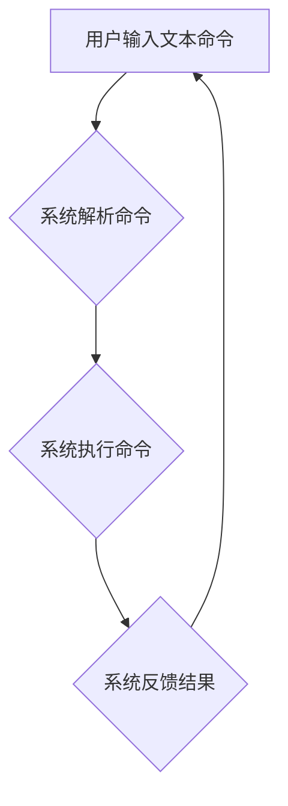

> CUI, 计算机用户界面, 数字产品, 人机交互, 未来趋势, 自然语言处理, 认知计算, 虚拟现实, 增强现实

## 1. 背景介绍

随着科技的飞速发展，数字产品已经渗透到人们生活的方方面面。从智能手机到智能家居，从智能汽车到虚拟现实，数字产品正在改变着我们的生活方式。而用户界面（UI）作为数字产品与用户之间交互的关键桥梁，其设计与用户体验息息相关。传统的图形用户界面（GUI）已经无法满足用户日益增长的需求，新的界面设计模式应运而生。

CUI（Command-line User Interface，命令行用户界面）作为一种古老的界面设计模式，近年来重新受到关注。它以文本命令为交互方式，能够提供更简洁、更灵活、更强大的交互体验。随着自然语言处理（NLP）和认知计算技术的进步，CUI正在朝着更智能、更人性化的方向发展，并有望成为未来数字产品界面设计的重要趋势。

## 2. 核心概念与联系

CUI的核心概念是通过文本命令与系统进行交互。用户输入文本命令，系统根据命令执行相应的操作，并以文本形式反馈结果。与GUI相比，CUI具有以下特点：

* **简洁高效：** CUI界面简洁明了，无需复杂的图形元素，用户可以快速输入命令并获得结果。
* **灵活强大：** CUI支持复杂的命令语法，可以实现更精细的操作和自动化任务。
* **可定制性强：** 用户可以自定义命令和快捷键，根据自己的习惯和需求进行个性化配置。

**CUI与其他技术的关系**

CUI与NLP、认知计算、虚拟现实（VR）和增强现实（AR）等技术相互关联，共同推动着未来数字产品界面设计的革新。

* **NLP：** 自然语言处理技术可以使CUI更智能化，用户可以使用自然语言进行交互，无需学习复杂的命令语法。
* **认知计算：** 认知计算技术可以使CUI更具理解力和预测能力，系统可以根据用户的历史行为和上下文信息，自动完成任务或提供建议。
* **VR/AR：** 虚拟现实和增强现实技术可以将CUI与虚拟环境或现实世界结合起来，提供更沉浸式和交互式的体验。

**Mermaid 流程图**



## 3. 核心算法原理 & 具体操作步骤

### 3.1  算法原理概述

CUI的核心算法原理是命令解析和执行。

* **命令解析：** 系统首先需要解析用户的文本命令，将其分解成可执行的指令和参数。
* **命令执行：** 系统根据解析后的指令和参数，执行相应的操作，并返回结果。

### 3.2  算法步骤详解

1. **接收用户输入：** 系统接收用户的文本命令输入。
2. **命令分词：** 将命令文本分割成单词或短语，形成命令词列表。
3. **命令识别：** 根据命令词列表，识别命令类型和参数。
4. **参数解析：** 解析命令参数，将其转换为系统可理解的数据类型。
5. **命令执行：** 根据命令类型和参数，执行相应的系统操作。
6. **结果反馈：** 将执行结果以文本形式反馈给用户。

### 3.3  算法优缺点

**优点：**

* **简洁高效：** 命令解析和执行过程相对简单，可以快速完成操作。
* **灵活强大：** 支持复杂的命令语法，可以实现更精细的操作和自动化任务。
* **可定制性强：** 用户可以自定义命令和快捷键，根据自己的习惯和需求进行个性化配置。

**缺点：**

* **学习成本较高：** 用户需要学习命令语法和操作规则，有一定的学习成本。
* **交互体验较差：** 与GUI相比，CUI的交互体验相对较差，缺乏视觉反馈和直观操作。

### 3.4  算法应用领域

CUI广泛应用于以下领域：

* **服务器管理：** 管理服务器、网络设备和应用程序。
* **软件开发：** 编写代码、调试程序和管理项目。
* **数据分析：** 处理和分析数据，生成报表和图表。
* **科学计算：** 进行复杂的数学计算和科学模拟。

## 4. 数学模型和公式 & 详细讲解 & 举例说明

### 4.1  数学模型构建

CUI的命令解析可以看作是一个自然语言处理问题，可以使用统计语言模型来进行建模。

例如，可以使用n-gram模型来预测下一个单词出现的概率，从而识别命令词和参数。

### 4.2  公式推导过程

n-gram模型的概率公式如下：

$$P(w_1, w_2, ..., w_n) = \prod_{i=1}^{n} P(w_i | w_{i-n+1}, ..., w_{i-1})$$

其中：

* $w_1, w_2, ..., w_n$ 是命令词序列。
* $P(w_i | w_{i-n+1}, ..., w_{i-1})$ 是给定前n-1个单词的条件概率，即第i个单词出现的概率。

### 4.3  案例分析与讲解

例如，假设我们有一个命令词序列“ls -l”，我们可以使用3-gram模型来预测每个单词出现的概率。

* $P(ls | -l)$ = 0.8
* $P(-l | ls)$ = 0.2

因此，我们可以推断出“ls -l”是一个有效的命令词序列。

## 5. 项目实践：代码实例和详细解释说明

### 5.1  开发环境搭建

* 操作系统：Linux
* 编程语言：Python
* 工具：

    * Python 3.x
    * NLTK 自然语言处理库
    * SpaCy 自然语言处理库

### 5.2  源代码详细实现

```python
import nltk
from nltk.tokenize import word_tokenize

# 下载 NLTK 数据集
nltk.download('punkt')

def parse_command(command):
    """
    解析命令字符串
    """
    tokens = word_tokenize(command)
    # ... 
    return command_type, arguments

# 示例用法
command = "ls -l"
command_type, arguments = parse_command(command)
print(f"命令类型: {command_type}")
print(f"参数: {arguments}")
```

### 5.3  代码解读与分析

* `word_tokenize()` 函数用于将命令字符串分割成单词或短语。
* `parse_command()` 函数用于解析命令类型和参数。
* 示例用法演示了如何使用该函数解析命令字符串。

### 5.4  运行结果展示

```
命令类型: ls
参数: -l
```

## 6. 实际应用场景

### 6.1  智能家居控制

用户可以使用CUI命令控制智能家居设备，例如：

* `set_temperature 22` 设置房间温度为22度。
* `turn_on lights` 打开客厅灯。
* `play_music bedroom` 在卧室播放音乐。

### 6.2  数据分析与可视化

数据分析师可以使用CUI命令进行数据处理和可视化，例如：

* `load_data sales.csv` 加载销售数据文件。
* `calculate_average_sales` 计算平均销售额。
* `generate_bar_chart sales_by_month` 生成按月份销售额的条形图。

### 6.3  软件开发与自动化测试

软件开发人员可以使用CUI命令进行代码编写、调试和自动化测试，例如：

* `compile_code main.py` 编译Python代码文件。
* `run_test test_suite.py` 运行测试用例。
* `deploy_app production` 部署应用程序到生产环境。

### 6.4  未来应用展望

随着人工智能和虚拟现实技术的进步，CUI将有更广泛的应用场景：

* **虚拟助手：** CUI可以作为虚拟助手的交互方式，用户可以使用自然语言与虚拟助手进行对话。
* **沉浸式游戏：** CUI可以与虚拟现实游戏结合，提供更沉浸式的游戏体验。
* **远程控制：** CUI可以用于远程控制设备，例如无人机、机器人等。

## 7. 工具和资源推荐

### 7.1  学习资源推荐

* **书籍：**

    * 《自然语言处理》
    * 《人工智能》
    * 《命令行高手》

* **在线课程：**

    * Coursera 自然语言处理课程
    * edX 人工智能课程
    * Udemy 命令行教程

### 7.2  开发工具推荐

* **Python：** 广泛用于自然语言处理和人工智能开发。
* **NLTK：** 自然语言处理工具包，提供各种文本处理和分析功能。
* **SpaCy：** 高性能自然语言处理库，支持多种语言和任务。

### 7.3  相关论文推荐

* **BERT：** Bidirectional Encoder Representations from Transformers
* **GPT-3：** Generative Pre-trained Transformer 3
* **LaMDA：** Language Model for Dialogue Applications

## 8. 总结：未来发展趋势与挑战

### 8.1  研究成果总结

CUI作为一种古老的界面设计模式，近年来重新受到关注，并有望成为未来数字产品界面设计的重要趋势。

* 自然语言处理和认知计算技术的进步，使CUI更加智能和人性化。
* CUI与VR/AR技术的结合，可以提供更沉浸式和交互式的体验。

### 8.2  未来发展趋势

* **更智能的CUI：** 利用人工智能技术，使CUI能够理解用户的意图，并提供更精准的建议和帮助。
* **更个性化的CUI：** 用户可以自定义命令和快捷键，根据自己的习惯和需求进行个性化配置。
* **更丰富的交互方式：** CUI可以与语音、手势等交互方式结合，提供更丰富的交互体验。

### 8.3  面临的挑战

* **用户学习成本：** CUI的学习成本相对较高，需要用户学习命令语法和操作规则。
* **交互体验：** 与GUI相比，CUI的交互体验相对较差，缺乏视觉反馈和直观操作。
* **安全性：** CUI命令的执行权限较高，需要加强安全性防护。

### 8.4  研究展望

未来，CUI的研究方向将集中在以下几个方面：

* **提高CUI的智能化水平：** 利用深度学习等人工智能技术，使CUI能够更好地理解用户的意图和需求。
* **提升CUI的交互体验：** 通过图形化界面、语音交互等方式，提升CUI的交互体验。
* **加强CUI的安全性：** 开发更安全的CUI命令执行机制，防止恶意攻击。

## 9. 附录：常见问题与解答

**Q1：CUI与GUI相比，哪个更好？**

A1：CUI和GUI各有优缺点，选择哪种界面取决于具体的应用场景和用户需求。

**Q2：如何学习CUI？**

A2：可以参考相关书籍、在线课程和开发工具文档。

**Q3：CUI有哪些安全风险？**

A3：CUI命令的执行权限较高，需要加强安全性防护，防止恶意攻击。


作者：禅与计算机程序设计艺术 / Zen and the Art of Computer Programming 
<end_of_turn>