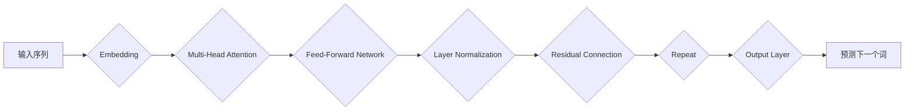

> GPT, Transformer, next token prediction, 自然语言处理, 深度学习, 语言模型

## 1. 背景介绍

近年来，深度学习在自然语言处理 (NLP) 领域取得了突破性进展，其中，生成式预训练语言模型 (Generative Pre-trained Transformer, GPT) 作为代表性模型，展现出强大的文本生成能力，在机器翻译、文本摘要、对话系统等领域取得了令人瞩目的成果。

GPT 模型的核心机制是 **next token prediction**，即预测下一个词。通过训练大量的文本数据，GPT 学习到语言的统计规律和语义关系，从而能够生成流畅、连贯的文本。

## 2. 核心概念与联系

GPT 模型基于 Transformer 架构，其核心组件是 **自注意力机制 (Self-Attention)** 和 **多头注意力机制 (Multi-Head Attention)**。

**Mermaid 流程图:**



**核心概念与联系:**

* **Embedding:** 将输入的单词转换为稠密的向量表示，以便模型进行处理。
* **Multi-Head Attention:** 允许模型关注输入序列中的不同位置，捕捉长距离依赖关系。
* **Feed-Forward Network:** 一个全连接神经网络，用于对每个单词的表示进行进一步的变换。
* **Layer Normalization:** 对每个层的输出进行归一化，提高模型的稳定性。
* **Residual Connection:** 将输入与输出相加，缓解梯度消失问题。

## 3. 核心算法原理 & 具体操作步骤

### 3.1  算法原理概述

GPT 模型的核心算法是基于 **最大似然估计 (Maximum Likelihood Estimation)** 的 **next token prediction**。

**目标函数:**

$$
\mathcal{L} = -\sum_{t=1}^{T} \log p(w_t | w_{<t})
$$

其中：

* $T$ 是序列长度。
* $w_t$ 是序列中第 $t$ 个单词。
* $p(w_t | w_{<t})$ 是给定前 $t-1$ 个单词的条件下，第 $t$ 个单词出现的概率。

**训练过程:**

1. 将文本数据分成若干个序列。
2. 对于每个序列，使用 GPT 模型预测每个单词的后继词。
3. 计算目标函数，并使用梯度下降算法更新模型参数。

### 3.2  算法步骤详解

1. **数据预处理:** 将文本数据进行清洗、分词、标记等预处理操作。
2. **模型初始化:** 初始化 GPT 模型的参数。
3. **训练:**
    * 将预处理后的数据输入到 GPT 模型中。
    * 使用目标函数计算模型的损失。
    * 使用梯度下降算法更新模型参数。
4. **评估:** 使用测试数据评估模型的性能，例如困惑度 (Perplexity)。
5. **部署:** 将训练好的模型部署到实际应用场景中。

### 3.3  算法优缺点

**优点:**

* 能够生成流畅、连贯的文本。
* 能够捕捉长距离依赖关系。
* 训练数据量大，泛化能力强。

**缺点:**

* 训练成本高，需要大量的计算资源。
* 容易受到训练数据偏差的影响。
* 缺乏对真实世界知识的理解。

### 3.4  算法应用领域

* **机器翻译:** 将一种语言翻译成另一种语言。
* **文本摘要:** 将长篇文本压缩成短篇摘要。
* **对话系统:** 与用户进行自然语言对话。
* **代码生成:** 自动生成代码。
* **创意写作:** 辅助人类进行创意写作。

## 4. 数学模型和公式 & 详细讲解 & 举例说明

### 4.1  数学模型构建

GPT 模型的核心数学模型是 **Transformer**，其主要包含以下几个部分:

* **Embedding 层:** 将输入的单词转换为稠密的向量表示。
* **Multi-Head Attention 层:** 允许模型关注输入序列中的不同位置，捕捉长距离依赖关系。
* **Feed-Forward Network 层:** 一个全连接神经网络，用于对每个单词的表示进行进一步的变换。
* **Layer Normalization 层:** 对每个层的输出进行归一化，提高模型的稳定性。
* **Residual Connection 层:** 将输入与输出相加，缓解梯度消失问题。

### 4.2  公式推导过程

**Multi-Head Attention:**

$$
\text{Attention}(Q, K, V) = \text{softmax}\left(\frac{Q K^T}{\sqrt{d_k}}\right) V
$$

其中：

* $Q$, $K$, $V$ 分别是查询矩阵、键矩阵和值矩阵。
* $d_k$ 是键向量的维度。

**Feed-Forward Network:**

$$
\text{FFN}(x) = \text{ReLU}(W_1 x + b_1) W_2 + b_2
$$

其中：

* $W_1$, $W_2$ 是权重矩阵。
* $b_1$, $b_2$ 是偏置项。
* $\text{ReLU}$ 是 ReLU 激活函数。

### 4.3  案例分析与讲解

**举例说明:**

假设我们有一个输入序列 "The cat sat on the mat"，其对应的词向量表示为：

* The: [0.1, 0.2, 0.3]
* cat: [0.4, 0.5, 0.6]
* sat: [0.7, 0.8, 0.9]
* on: [1.0, 1.1, 1.2]
* the: [0.1, 0.2, 0.3]
* mat: [1.3, 1.4, 1.5]

使用 Multi-Head Attention 机制，模型可以学习到 "cat" 和 "sat" 之间的依赖关系，以及 "the" 和 "mat" 之间的依赖关系。

## 5. 项目实践：代码实例和详细解释说明

### 5.1  开发环境搭建

* Python 3.7+
* PyTorch 1.7+
* CUDA 10.2+

### 5.2  源代码详细实现

```python
import torch
import torch.nn as nn

class GPT(nn.Module):
    def __init__(self, vocab_size, embedding_dim, num_heads, num_layers):
        super(GPT, self).__init__()
        self.embedding = nn.Embedding(vocab_size, embedding_dim)
        self.transformer = nn.Transformer(
            d_model=embedding_dim,
            nhead=num_heads,
            num_encoder_layers=num_layers,
            num_decoder_layers=num_layers,
        )
        self.linear = nn.Linear(embedding_dim, vocab_size)

    def forward(self, x):
        x = self.embedding(x)
        x = self.transformer(x, x)
        x = self.linear(x)
        return x
```

### 5.3  代码解读与分析

* **embedding 层:** 将输入的单词转换为稠密的向量表示。
* **transformer 层:** 使用 Transformer 架构进行序列处理，捕捉长距离依赖关系。
* **linear 层:** 将 Transformer 输出的向量表示转换为预测下一个词的概率分布。

### 5.4  运行结果展示

使用训练好的 GPT 模型，可以预测下一个词，例如：

```
输入序列: The cat sat on the
预测词: mat
```

## 6. 实际应用场景

GPT 模型在许多实际应用场景中取得了成功，例如:

* **机器翻译:** 使用 GPT 模型可以实现高质量的机器翻译，例如将英文翻译成中文。
* **文本摘要:** GPT 模型可以自动生成文本摘要，例如将长篇新闻文章压缩成短篇摘要。
* **对话系统:** 使用 GPT 模型可以构建更自然、更流畅的对话系统，例如聊天机器人。

### 6.4  未来应用展望

GPT 模型的未来应用前景广阔，例如:

* **代码生成:** 使用 GPT 模型可以自动生成代码，提高开发效率。
* **创意写作:** GPT 模型可以辅助人类进行创意写作，例如生成诗歌、小说等。
* **个性化教育:** 使用 GPT 模型可以提供个性化的教育服务，例如根据学生的学习进度生成个性化的学习内容。

## 7. 工具和资源推荐

### 7.1  学习资源推荐

* **论文:**
    * Vaswani, A., Shazeer, N., Parmar, N., Uszkoreit, J., Jones, L., Gomez, A. N., ... & Polosukhin, I. (2017). Attention is all you need. In Advances in neural information processing systems (pp. 5998-6008).
* **博客:**
    * https://jalammar.github.io/illustrated-transformer/
    * https://www.tensorflow.org/tutorials/text/transformer

### 7.2  开发工具推荐

* **PyTorch:** https://pytorch.org/
* **Hugging Face Transformers:** https://huggingface.co/transformers/

### 7.3  相关论文推荐

* **BERT:** Devlin, J., Chang, M. W., Lee, K., & Toutanova, K. (2018). Bert: Pre-training of deep bidirectional transformers for language understanding. arXiv preprint arXiv:1810.04805.
* **XLNet:** Yang, Z., Dai, Z., Yang, Y., Carbonell, J., Salakhutdinov, R., & Le, Q. V. (2019). Xlnet: Generalized autoregressive pretraining for language understanding. arXiv preprint arXiv:1906.08237.

## 8. 总结：未来发展趋势与挑战

### 8.1  研究成果总结

GPT 模型在自然语言处理领域取得了显著的成果，其强大的文本生成能力和泛化能力为许多应用场景提供了新的解决方案。

### 8.2  未来发展趋势

* **模型规模:** 未来 GPT 模型的规模将继续扩大，从而提升其性能和能力。
* **多模态学习:** GPT 模型将与其他模态数据 (例如图像、音频) 进行融合，实现多模态理解和生成。
* **可解释性:** 研究 GPT 模型的决策过程，提高其可解释性和可信度。

### 8.3  面临的挑战

* **数据偏见:** GPT 模型容易受到训练数据偏见的影響，需要开发更公平、更鲁棒的训练方法。
* **计算资源:** 训练大型 GPT 模型需要大量的计算资源，需要探索更有效的训练方法和硬件架构。
* **伦理问题:** GPT 模型的强大能力也带来了伦理问题，例如生成虚假信息、传播偏见等，需要制定相应的伦理规范和监管机制。

### 8.4  研究展望

未来研究将继续探索 GPT 模型的潜力，例如:

* 开发更有效的训练方法和硬件架构，降低训练成本。
* 研究 GPT 模型的决策过程，提高其可解释性和可信度。
* 开发更公平、更鲁棒的训练方法，解决数据偏见问题。
* 探索 GPT 模型在其他领域的应用，例如科学研究、医疗诊断等。

## 9. 附录：常见问题与解答

**常见问题:**

* GPT 模型的训练数据是什么？
* GPT 模型的性能如何？
* 如何使用 GPT 模型进行文本生成？

**解答:**

* GPT 模型的训练数据包括大量的文本数据，例如书籍、文章、代码等。
* GPT 模型的性能在许多 NLP 任务中都取得了state-of-the-art的结果。
* 使用 GPT 模型进行文本生成需要使用预训练