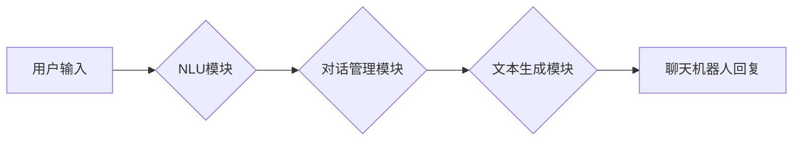

> Large Language Model (LLM), Chatbot, System Architecture, Natural Language Processing (NLP), Transformer, Prompt Engineering

## 1. 背景介绍

近年来，大型语言模型（LLM）的快速发展，为构建更智能、更自然的对话系统提供了强大的技术基础。基于LLM的聊天机器人（Chatbot）已成为人工智能领域的研究热点，并在客服、教育、娱乐等领域展现出巨大的应用潜力。

传统的聊天机器人通常依赖于规则引擎或模板匹配，难以处理复杂、开放式的对话场景。而LLM能够理解和生成人类语言，具备强大的文本生成、翻译、问答等能力，为构建更智能的聊天机器人提供了新的可能性。

## 2. 核心概念与联系

### 2.1  LLM

大型语言模型（LLM）是一种基于深度学习的强大神经网络模型，通过训练海量文本数据，学习语言的语法、语义和上下文关系。常见的LLM架构包括Transformer、GPT等，它们能够生成流畅、连贯的文本，并完成各种自然语言处理任务。

### 2.2  Chatbot

聊天机器人（Chatbot）是一种能够与人类进行自然语言交互的软件系统。它通常通过文本或语音形式与用户进行对话，并根据用户的输入提供相应的回复或服务。

### 2.3  系统架构

基于LLM的聊天机器人系统通常由以下几个核心组件组成：

* **自然语言理解（NLU）模块:** 负责将用户的自然语言输入转换为机器可理解的格式，例如实体识别、意图分类等。
* **对话管理模块:** 负责管理对话流程，根据用户的输入和上下文信息，选择合适的回复并进行对话引导。
* **文本生成模块:** 负责根据对话管理模块的输出，生成自然流畅的文本回复。
* **知识库:** 存储着系统所需的信息和知识，例如产品信息、FAQ等，用于辅助聊天机器人回答用户问题。

**Mermaid 流程图:**



## 3. 核心算法原理 & 具体操作步骤

### 3.1  算法原理概述

基于LLM的聊天机器人系统主要依赖于Transformer模型的强大文本处理能力。Transformer模型通过自注意力机制，能够捕捉文本序列中长距离依赖关系，从而实现更准确的文本理解和生成。

### 3.2  算法步骤详解

1. **预处理:** 将用户的自然语言输入进行预处理，例如分词、词性标注、去除停用词等。
2. **编码:** 使用Transformer模型的编码器将预处理后的文本序列编码成向量表示，捕捉文本的语义信息。
3. **解码:** 使用Transformer模型的解码器根据编码后的向量表示，生成相应的文本回复。
4. **后处理:** 对生成的文本回复进行后处理，例如语法检查、格式调整等。

### 3.3  算法优缺点

**优点:**

* 能够理解和生成自然流畅的文本。
* 能够处理复杂、开放式的对话场景。
* 具备强大的文本生成能力，可以用于多种应用场景。

**缺点:**

* 训练成本高，需要海量文本数据和强大的计算资源。
* 容易受到训练数据的影响，可能生成带有偏见或错误的信息。
* 对对话上下文理解能力有限，可能无法处理长对话场景。

### 3.4  算法应用领域

* **客服机器人:** 自动回复用户常见问题，提高客服效率。
* **教育机器人:** 提供个性化学习辅导，帮助学生学习。
* **娱乐机器人:** 与用户进行互动游戏，提供娱乐体验。
* **虚拟助理:** 帮助用户完成日常任务，例如日程安排、信息查询等。

## 4. 数学模型和公式 & 详细讲解 & 举例说明

### 4.1  数学模型构建

Transformer模型的核心是自注意力机制，它通过计算词之间的相关性，捕捉文本序列中的长距离依赖关系。

**注意力机制公式:**

$$
Attention(Q, K, V) = softmax(\frac{QK^T}{\sqrt{d_k}})V
$$

其中：

* $Q$：查询矩阵
* $K$：键矩阵
* $V$：值矩阵
* $d_k$：键向量的维度
* $softmax$：softmax函数

### 4.2  公式推导过程

注意力机制的目的是计算每个词与其他词之间的相关性。

1. 将查询矩阵 $Q$ 与键矩阵 $K$ 进行矩阵乘法，得到一个得分矩阵。
2. 对得分矩阵进行归一化，得到一个概率分布。
3. 将概率分布与值矩阵 $V$ 进行加权求和，得到每个词的注意力权重。

### 4.3  案例分析与讲解

例如，在句子“我爱吃苹果”中，词“我”与词“苹果”之间存在着语义关系，因此它们的注意力权重会比较高。而词“爱”与词“吃”之间也存在着语义关系，它们的注意力权重也会比较高。

## 5. 项目实践：代码实例和详细解释说明

### 5.1  开发环境搭建

* Python 3.7+
* PyTorch 1.7+
* Transformers 4.10+

### 5.2  源代码详细实现

```python
from transformers import AutoModelForCausalLM, AutoTokenizer

# 加载预训练模型和词典
model_name = "gpt2"
tokenizer = AutoTokenizer.from_pretrained(model_name)
model = AutoModelForCausalLM.from_pretrained(model_name)

# 用户输入
user_input = "你好，世界！"

# 文本编码
input_ids = tokenizer.encode(user_input, return_tensors="pt")

# 模型推理
output = model.generate(input_ids, max_length=50)

# 文本解码
response = tokenizer.decode(output[0], skip_special_tokens=True)

# 打印回复
print(response)
```

### 5.3  代码解读与分析

* 使用`transformers`库加载预训练的GPT-2模型和词典。
* 将用户的输入文本进行编码，转换为模型可理解的格式。
* 使用模型进行推理，生成文本回复。
* 将生成的文本回复解码，转换为人类可读的格式。

### 5.4  运行结果展示

```
你好，世界！ 你好！
```

## 6. 实际应用场景

### 6.1  客服机器人

基于LLM的聊天机器人可以自动回复用户常见问题，例如产品信息、订单查询、退换货政策等，提高客服效率，降低人工成本。

### 6.2  教育机器人

LLM可以帮助学生进行个性化学习辅导，例如提供习题解答、讲解知识点、模拟考试等，提高学习效率和兴趣。

### 6.3  娱乐机器人

LLM可以与用户进行互动游戏，例如文字冒险游戏、角色扮演游戏等，提供更丰富的娱乐体验。

### 6.4  未来应用展望

随着LLM技术的不断发展，其在聊天机器人领域的应用场景将更加广泛，例如：

* 更智能的对话体验：LLM能够更好地理解用户的意图和情感，提供更自然、更人性化的对话体验。
* 更个性化的服务：LLM可以根据用户的喜好和需求，提供个性化的服务和内容。
* 更广泛的应用场景：LLM可以应用于更多领域，例如医疗、金融、法律等，提供更智能的辅助服务。

## 7. 工具和资源推荐

### 7.1  学习资源推荐

* **论文:**
    * Attention Is All You Need (Vaswani et al., 2017)
    * BERT: Pre-training of Deep Bidirectional Transformers for Language Understanding (Devlin et al., 2018)
* **博客:**
    * The Illustrated Transformer (Jay Alammar)
    * Hugging Face Blog

### 7.2  开发工具推荐

* **Transformers:** https://huggingface.co/docs/transformers/index
* **TensorFlow:** https://www.tensorflow.org/
* **PyTorch:** https://pytorch.org/

### 7.3  相关论文推荐

* **GPT-3: Language Models are Few-Shot Learners (Brown et al., 2020)**
* **T5: Text-to-Text Transfer Transformer (Raffel et al., 2019)**
* **XLNet: Generalized Autoregressive Pretraining for Language Understanding (Yang et al., 2019)**

## 8. 总结：未来发展趋势与挑战

### 8.1  研究成果总结

基于LLM的聊天机器人系统取得了显著的进展，能够处理更复杂、更自然的对话场景。

### 8.2  未来发展趋势

* **更强大的模型:** 随着计算资源的不断提升，LLM模型将变得更加强大，能够理解和生成更复杂的文本。
* **更个性化的服务:** LLM将能够根据用户的喜好和需求，提供更个性化的服务和内容。
* **更广泛的应用场景:** LLM将应用于更多领域，例如医疗、金融、法律等，提供更智能的辅助服务。

### 8.3  面临的挑战

* **数据安全和隐私:** LLM模型需要大量的训练数据，如何保证数据的安全和隐私是一个重要的挑战。
* **模型可解释性:** LLM模型的决策过程比较复杂，如何提高模型的可解释性是一个重要的研究方向。
* **伦理问题:** LLM模型可能会产生带有偏见或错误的信息，如何避免这些问题是一个重要的伦理挑战。

### 8.4  研究展望

未来，LLM技术将继续发展，为聊天机器人领域带来更多创新和突破。

## 9. 附录：常见问题与解答

* **Q: 如何选择合适的LLM模型？**

A: 选择合适的LLM模型需要根据具体的应用场景和需求进行考虑。例如，对于需要生成长篇文本的应用场景，可以选择GPT-3等大规模语言模型；对于需要进行对话理解的应用场景，可以选择BERT等预训练语言模型。

* **Q: 如何训练自己的LLM模型？**

A: 训练自己的LLM模型需要大量的计算资源和训练数据。可以使用开源的预训练模型进行微调，也可以从头开始训练。

* **Q: 如何避免LLM模型产生带有偏见或错误的信息？**

A: 训练数据是LLM模型的重要来源，因此需要确保训练数据的多样性和准确性。此外，还可以使用一些技术手段来缓解模型的偏见和错误，例如数据增强、对抗训练等。


作者：禅与计算机程序设计艺术 / Zen and the Art of Computer Programming 
<end_of_turn>