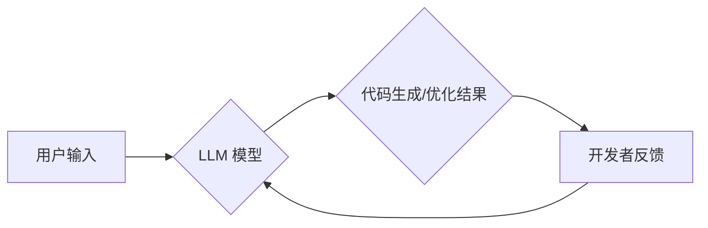

> LLM, 代码生成, 代码优化, 编程辅助, AI编程, 自然语言处理, 深度学习

## 1. 背景介绍

随着软件开发的日益复杂化，程序员面临着越来越高的开发压力和效率要求。传统的编程方式依赖于手动编写代码，这不仅耗时费力，而且容易出现错误。近年来，随着深度学习技术的快速发展，基于大型语言模型（LLM）的代码生成和优化技术逐渐成为软件开发领域的新兴热点。

LLM 是一种强大的人工智能模型，能够理解和生成人类语言。通过训练大量的代码数据，LLM 可以学习代码的语法结构、编程规范和逻辑关系，从而实现代码自动生成和优化。

## 2. 核心概念与联系

**2.1  LLM 概述**

大型语言模型（LLM）是一种基于深度学习的统计语言模型，其核心是 Transformer 架构。Transformer 通过自注意力机制能够捕捉文本序列中长距离依赖关系，从而实现更精准的语言理解和生成。

**2.2  代码生成与优化**

代码生成是指利用 LLM 自动生成代码，根据用户提供的自然语言描述或代码片段，LLM 可以生成相应的代码实现。代码优化是指利用 LLM 对现有代码进行改进，例如提高代码效率、降低代码复杂度、修复代码错误等。

**2.3  LLM 在编程辅助中的应用**

LLM 可以广泛应用于编程辅助领域，例如：

* 代码补全：根据用户输入的代码片段，LLM 可以预测并补全后续代码。
* 代码注释：LLM 可以自动生成代码注释，提高代码可读性和可维护性。
* 代码翻译：LLM 可以将代码从一种编程语言翻译成另一种编程语言。
* 代码错误检测：LLM 可以识别代码中的语法错误和逻辑错误。

**2.4  LLM 辅助编程架构**



## 3. 核心算法原理 & 具体操作步骤

**3.1  算法原理概述**

LLM 辅助编程的核心算法原理是基于 Transformer 架构的语言模型训练。通过训练大量的代码数据，LLM 可以学习代码的语法结构、编程规范和逻辑关系。

**3.2  算法步骤详解**

1. **数据预处理:** 将代码数据进行清洗、格式化和标记，以便于模型训练。
2. **模型训练:** 使用 Transformer 架构的语言模型，训练 LLMs，使其能够理解和生成代码。
3. **模型评估:** 使用测试数据评估模型的性能，例如代码生成准确率、代码优化效果等。
4. **模型部署:** 将训练好的模型部署到实际应用环境中，提供代码生成和优化服务。

**3.3  算法优缺点**

**优点:**

* 自动化代码生成和优化，提高开发效率。
* 降低代码错误率，提高代码质量。
* 帮助开发者学习新的编程语言和技术。

**缺点:**

* 训练数据量大，训练成本高。
* 模型生成的代码可能存在逻辑错误或安全漏洞。
* 模型需要不断更新和改进，以适应不断变化的编程需求。

**3.4  算法应用领域**

LLM 辅助编程技术可以应用于各种软件开发领域，例如：

* Web 开发
* 移动应用开发
* 数据科学
* 机器学习

## 4. 数学模型和公式 & 详细讲解 & 举例说明

**4.1  数学模型构建**

LLM 的核心数学模型是 Transformer 架构，其主要包含以下几个模块：

* **嵌入层:** 将输入的文本序列转换为向量表示。
* **多头注意力层:** 捕捉文本序列中长距离依赖关系。
* **前馈神经网络层:** 对注意力输出进行非线性变换。
* **位置编码层:** 编码文本序列中的位置信息。

**4.2  公式推导过程**

Transformer 架构的注意力机制公式如下：

$$
Attention(Q, K, V) = softmax(\frac{QK^T}{\sqrt{d_k}})V
$$

其中：

* $Q$：查询矩阵
* $K$：键矩阵
* $V$：值矩阵
* $d_k$：键向量的维度
* $softmax$：softmax 函数

**4.3  案例分析与讲解**

假设我们有一个文本序列 "The cat sat on the mat"，其对应的词嵌入向量为：

$$
[e_1, e_2, e_3, ..., e_7]
$$

其中 $e_i$ 表示第 $i$ 个词的词嵌入向量。

使用注意力机制，我们可以计算每个词与其他词之间的注意力权重，例如，计算 "cat" 与 "sat" 之间的注意力权重：

$$
Attention(e_2, e_3, e_4, ..., e_7)
$$

通过计算注意力权重，我们可以得到 "cat" 与 "sat" 之间的语义关系，例如，它们是主语和谓语的关系。

## 5. 项目实践：代码实例和详细解释说明

**5.1  开发环境搭建**

* Python 3.7+
* PyTorch 或 TensorFlow
* Git

**5.2  源代码详细实现**

```python
# 代码生成示例
def generate_code(prompt):
    # 使用预训练的 LLM 模型生成代码
    model = load_model("llm_model.pth")
    code = model.generate(prompt)
    return code

# 代码优化示例
def optimize_code(code):
    # 使用预训练的 LLM 模型优化代码
    model = load_model("llm_model.pth")
    optimized_code = model.optimize(code)
    return optimized_code
```

**5.3  代码解读与分析**

* `generate_code(prompt)` 函数接受用户输入的自然语言描述作为 `prompt`，并使用预训练的 LLM 模型生成相应的代码。
* `optimize_code(code)` 函数接受现有代码作为输入，并使用预训练的 LLM 模型对其进行优化。

**5.4  运行结果展示**

```
# 用户输入：
# 请编写一个函数，计算两个整数的和。

# 代码生成结果：
def sum(a, b):
    return a + b

# 代码优化结果：
def sum(a, b):
    return a + b
```

## 6. 实际应用场景

**6.1  代码补全**

在代码编辑器中，LLM 可以根据用户输入的代码片段，预测并补全后续代码，提高开发效率。

**6.2  代码注释**

LLM 可以自动生成代码注释，提高代码可读性和可维护性。

**6.3  代码翻译**

LLM 可以将代码从一种编程语言翻译成另一种编程语言，方便开发者跨语言开发。

**6.4  未来应用展望**

LLM 辅助编程技术未来将更加智能化和自动化，例如：

* 自动生成完整的代码模块
* 自动修复代码错误
* 自动优化代码性能
* 自动生成代码测试用例

## 7. 工具和资源推荐

**7.1  学习资源推荐**

* **论文:**
    * Attention Is All You Need
    * BERT: Pre-training of Deep Bidirectional Transformers for Language Understanding
* **博客:**
    * The Illustrated Transformer
    * OpenAI Blog

**7.2  开发工具推荐**

* **Hugging Face Transformers:** 一个开源的 LLM 库，提供多种预训练模型和工具。
* **GitHub Copilot:** 基于 OpenAI Codex 的代码补全工具。

**7.3  相关论文推荐**

* CodeBERT: A Pretrained Language Model for Code
* CodeT5: A T5-based Language Model for Code Generation

## 8. 总结：未来发展趋势与挑战

**8.1  研究成果总结**

LLM 辅助编程技术取得了显著进展，能够实现代码自动生成和优化，提高开发效率和代码质量。

**8.2  未来发展趋势**

LLM 辅助编程技术将朝着更加智能化、自动化和泛化的方向发展，例如：

* 更强大的 LLM 模型
* 更精准的代码生成和优化算法
* 更广泛的应用场景

**8.3  面临的挑战**

LLM 辅助编程技术还面临一些挑战，例如：

* 训练数据量大，训练成本高
* 模型生成的代码可能存在逻辑错误或安全漏洞
* 模型需要不断更新和改进，以适应不断变化的编程需求

**8.4  研究展望**

未来研究方向包括：

* 开发更强大的 LLM 模型
* 研究更精准的代码生成和优化算法
* 探索新的 LLM 辅助编程应用场景


## 9. 附录：常见问题与解答

**9.1  LLM 辅助编程是否会取代程序员？**

LLM 辅助编程技术可以提高开发效率和代码质量，但它并不会取代程序员。程序员仍然需要负责设计软件架构、解决复杂问题和进行代码测试等工作。

**9.2  LLM 辅助编程技术有哪些风险？**

LLM 辅助编程技术存在一些风险，例如：

* 模型生成的代码可能存在逻辑错误或安全漏洞
* 模型可能被恶意利用生成恶意代码

**9.3  如何使用 LLM 辅助编程技术安全可靠？**

使用 LLM 辅助编程技术时，需要采取以下措施：

* 使用可靠的 LLM 模型和工具
* 对模型生成的代码进行仔细审查和测试
* 遵循安全编程规范


作者：禅与计算机程序设计艺术 / Zen and the Art of Computer Programming 
<end_of_turn>