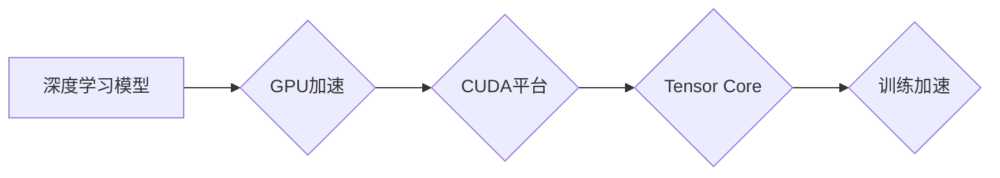

> Nvidia, GPU, 深度学习, AI芯片, CUDA, Tensor Core, Transformer, 训练加速, 

## 1. 背景介绍

人工智能（AI）正以惊人的速度发展，其应用领域不断扩展，从自动驾驶到医疗诊断，再到自然语言处理，AI正在改变着我们的世界。在这个快速发展的领域中，Nvidia 凭借其强大的GPU技术和对AI的深刻理解，已经成为AI领域的领导者。

Nvidia的GPU（图形处理单元）最初被设计用于处理图形渲染，但其并行计算能力使其也成为深度学习训练的理想平台。深度学习是AI领域的核心技术之一，它利用多层神经网络来模拟人类大脑的学习过程。由于深度学习模型的规模庞大，训练过程需要大量的计算资源，而Nvidia的GPU能够提供所需的强大计算能力。

## 2. 核心概念与联系

### 2.1 深度学习与GPU

深度学习的核心是多层神经网络，这些网络由大量的节点组成，每个节点都执行简单的数学运算。由于神经网络的规模庞大，训练过程需要大量的计算资源。GPU的并行计算能力使其能够高效地处理这些计算，从而加速深度学习模型的训练。

### 2.2 CUDA与Tensor Core

Nvidia为其GPU开发了CUDA（Compute Unified Device Architecture）平台，它允许程序员将代码移植到GPU上进行加速计算。CUDA提供了丰富的编程工具和库，使得开发人员能够轻松地利用GPU的强大计算能力。

为了进一步提升深度学习的训练效率，Nvidia推出了Tensor Core，这是专门为深度学习设计的计算单元。Tensor Core能够高效地执行矩阵乘法和累加等深度学习算法所需的运算，从而大幅度提高训练速度。

**Mermaid 流程图**



## 3. 核心算法原理 & 具体操作步骤

### 3.1 算法原理概述

深度学习算法的核心是神经网络，它由多个层组成，每层包含多个神经元。每个神经元接收来自上一层的输入，并通过权重进行加权求和，然后通过激活函数进行非线性变换，最后输出到下一层。

训练深度学习模型的过程就是通过调整神经网络的权重，使得模型的输出与实际目标值尽可能接近。常用的训练算法包括梯度下降法和其变种算法。

### 3.2 算法步骤详解

1. **初始化模型参数:** 随机初始化神经网络的权重和偏置。
2. **前向传播:** 将输入数据通过神经网络进行前向传播，计算输出结果。
3. **计算损失函数:** 计算模型输出与实际目标值之间的差异，即损失函数的值。
4. **反向传播:** 计算损失函数对模型参数的梯度，即参数更新的方向。
5. **更新模型参数:** 根据梯度更新模型参数，使得损失函数值减小。
6. **重复步骤2-5:** 重复上述步骤，直到损失函数值达到预设的阈值或训练次数达到上限。

### 3.3 算法优缺点

**优点:**

* 能够学习复杂的数据模式。
* 能够处理大规模的数据集。
* 能够实现端到端的学习。

**缺点:**

* 训练过程需要大量的计算资源和时间。
* 模型的解释性较差。
* 对训练数据的质量要求较高。

### 3.4 算法应用领域

深度学习算法已广泛应用于各个领域，包括：

* **计算机视觉:** 图像识别、物体检测、图像分割、人脸识别等。
* **自然语言处理:** 文本分类、机器翻译、情感分析、对话系统等。
* **语音识别:** 语音转文本、语音合成等。
* **推荐系统:** 商品推荐、内容推荐等。
* **医疗诊断:** 疾病诊断、影像分析等。

## 4. 数学模型和公式 & 详细讲解 & 举例说明

### 4.1 数学模型构建

深度学习模型的核心是神经网络，它可以看作是一个多层感知机（MLP）。每个神经元接收来自上一层的输入，并通过权重进行加权求和，然后通过激活函数进行非线性变换，最后输出到下一层。

**公式:**

* **线性变换:**  $z = W x + b$
* **激活函数:** $a = f(z)$

其中：

* $z$ 是神经元的输入值。
* $W$ 是权重矩阵。
* $x$ 是上一层的输出值。
* $b$ 是偏置项。
* $f(z)$ 是激活函数。

### 4.2 公式推导过程

损失函数用于衡量模型的预测结果与实际目标值之间的差异。常用的损失函数包括均方误差（MSE）和交叉熵损失（Cross-Entropy Loss）。

**均方误差（MSE）:**

$L = \frac{1}{N} \sum_{i=1}^{N} (y_i - \hat{y}_i)^2$

其中：

* $L$ 是损失函数值。
* $N$ 是样本数量。
* $y_i$ 是第 $i$ 个样本的实际目标值。
* $\hat{y}_i$ 是模型预测的第 $i$ 个样本的目标值。

**交叉熵损失（Cross-Entropy Loss）:**

$L = -\frac{1}{N} \sum_{i=1}^{N} \sum_{j=1}^{C} y_{ij} \log(\hat{y}_{ij})$

其中：

* $C$ 是类别数量。
* $y_{ij}$ 是第 $i$ 个样本的第 $j$ 个类别的真实标签。
* $\hat{y}_{ij}$ 是模型预测的第 $i$ 个样本的第 $j$ 个类别的概率。

### 4.3 案例分析与讲解

假设我们有一个图像分类任务，目标是将图像分类为猫或狗。我们可以使用卷积神经网络（CNN）来解决这个问题。CNN是一种专门用于处理图像数据的深度学习模型，它能够学习图像的特征。

在训练CNN模型的过程中，我们会使用大量的猫和狗的图像数据。模型会通过前向传播和反向传播的过程，不断调整自己的参数，使得模型能够准确地将图像分类为猫或狗。

## 5. 项目实践：代码实例和详细解释说明

### 5.1 开发环境搭建

为了使用Nvidia的GPU加速深度学习训练，我们需要搭建一个合适的开发环境。

* **操作系统:** Linux 或 Windows
* **CUDA Toolkit:** Nvidia为其GPU开发的软件开发工具包。
* **cuDNN:** Nvidia为深度学习开发的库，提供高效的深度学习算法实现。
* **深度学习框架:** TensorFlow、PyTorch等。

### 5.2 源代码详细实现

以下是一个使用TensorFlow框架在Nvidia GPU上训练一个简单的线性回归模型的代码示例：

```python
import tensorflow as tf

# 定义模型
model = tf.keras.Sequential([
    tf.keras.layers.Dense(units=1, input_shape=[1])
])

# 定义损失函数和优化器
model.compile(loss='mean_squared_error', optimizer='adam')

# 训练模型
model.fit(x=tf.constant([[1.0], [2.0], [3.0]]), y=tf.constant([[2.0], [4.0], [6.0]]), epochs=100)

# 评估模型
loss = model.evaluate(x=tf.constant([[4.0]]), y=tf.constant([[8.0]]))
print('Loss:', loss)
```

### 5.3 代码解读与分析

这段代码定义了一个简单的线性回归模型，它只有一个全连接层。模型的输入是一个单一的特征，输出是一个预测值。

代码使用TensorFlow框架的`Sequential` API定义模型，并使用`compile`方法指定损失函数和优化器。

`fit`方法用于训练模型，它接受训练数据和标签作为输入，并训练模型直到达到预设的 epochs 数。

`evaluate`方法用于评估模型的性能，它接受测试数据和标签作为输入，并计算模型的损失值。

### 5.4 运行结果展示

运行这段代码后，模型将训练完成，并输出模型的损失值。

## 6. 实际应用场景

Nvidia的GPU和深度学习技术已广泛应用于各个领域，以下是一些实际应用场景：

### 6.1 自动驾驶

Nvidia的DRIVE平台提供了一套完整的自动驾驶解决方案，包括硬件、软件和云服务。Nvidia的GPU能够处理自动驾驶车辆所需的复杂视觉处理和决策任务。

### 6.2 医疗诊断

Nvidia的Clara平台提供了一套医疗影像分析解决方案，利用深度学习技术帮助医生更快、更准确地诊断疾病。

### 6.3 游戏开发

Nvidia的GeForce RTX系列显卡支持光线追踪技术，能够为游戏玩家提供更逼真的游戏体验。

### 6.4 未来应用展望

随着人工智能技术的不断发展，Nvidia的GPU和深度学习技术将在更多领域得到应用，例如：

* **个性化教育:** 根据学生的学习进度和风格提供个性化的学习内容。
* **智能制造:** 利用机器视觉和深度学习技术提高生产效率和产品质量。
* **金融科技:** 利用机器学习技术进行风险评估、欺诈检测和投资决策。

## 7. 工具和资源推荐

### 7.1 学习资源推荐

* **Nvidia Deep Learning Institute (DLI):** 提供深度学习相关的在线课程和培训。
* **TensorFlow官方文档:** https://www.tensorflow.org/
* **PyTorch官方文档:** https://pytorch.org/

### 7.2 开发工具推荐

* **CUDA Toolkit:** https://developer.nvidia.com/cuda-toolkit
* **cuDNN:** https://developer.nvidia.com/cudnn

### 7.3 相关论文推荐

* **ImageNet Classification with Deep Convolutional Neural Networks:** https://arxiv.org/abs/1202.1409
* **Attention Is All You Need:** https://arxiv.org/abs/1706.03762

## 8. 总结：未来发展趋势与挑战

### 8.1 研究成果总结

Nvidia在AI领域取得了显著的成就，其GPU技术和深度学习平台为AI的发展做出了重要贡献。

### 8.2 未来发展趋势

未来，Nvidia将继续在以下方面进行研究和发展：

* **更高效的GPU架构:** 提升GPU的计算性能和能效比。
* **更强大的深度学习算法:** 开发更先进的深度学习算法，例如Transformer变体和强化学习算法。
* **更广泛的应用场景:** 将AI技术应用于更多领域，例如医疗、教育和金融。

### 8.3 面临的挑战

Nvidia也面临着一些挑战，例如：

* **竞争加剧:** 其他芯片厂商也在积极布局AI芯片市场。
* **数据隐私和安全:** 深度学习模型需要大量的训练数据，如何保护数据隐私和安全是一个重要问题。
* **算法可解释性:** 深度学习模型的决策过程往往难以解释，如何提高算法的可解释性是一个重要的研究方向。

### 8.4 研究展望

Nvidia将继续致力于推动AI技术的进步，并将其应用于解决世界性问题。


## 9. 附录：常见问题与解答

### 9.1 如何使用Nvidia GPU加速深度学习训练？

可以使用CUDA Toolkit和cuDNN库将深度学习代码移植到Nvidia GPU上进行加速训练。

### 9.2 Nvidia的GPU有哪些？

Nvidia提供多种类型的GPU，包括GeForce系列、Tesla系列和Jetson系列。

### 9.3 如何选择合适的Nvidia GPU？

选择合适的Nvidia GPU需要考虑以下因素：

* **计算性能:** 不同的GPU具有不同的计算性能，需要根据模型的规模和训练需求选择合适的GPU。
* **内存容量:** 深度学习模型需要大量的内存来存储数据和模型参数，需要选择内存容量足够的GPU。
* **功耗:** 不同的GPU具有不同的功耗，需要根据实际应用场景选择合适的GPU。


作者：禅与计算机程序设计艺术 / Zen and the Art of Computer Programming 
<end_of_turn>