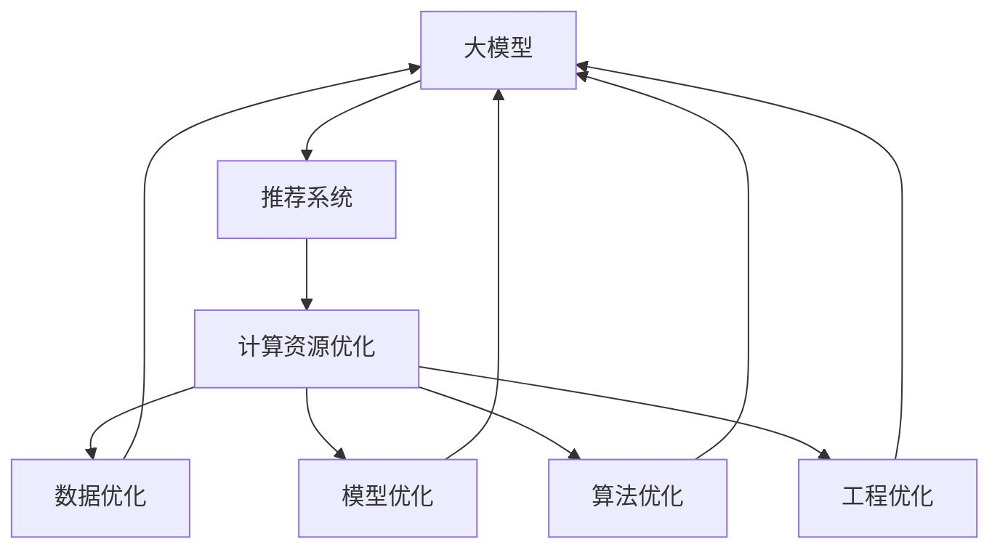

                 

# 大模型推荐系统的计算资源优化

> 关键词：大模型, 推荐系统, 计算资源优化, 深度学习, 高性能计算

## 1. 背景介绍

### 1.1 问题由来

近年来，随着深度学习技术的飞速发展，基于大模型的推荐系统在电商、新闻、社交媒体等领域得到了广泛应用。大模型的推荐系统能够通过处理海量数据，深度挖掘用户行为和兴趣，提供个性化推荐服务，从而显著提升用户体验和业务价值。

然而，大模型推荐系统在享受高精度和高泛化能力的同时，也面临计算资源消耗巨大的挑战。在实时推荐、个性化推荐、广告推荐等场景中，需要持续进行实时计算和模型更新，这不仅需要强大的硬件支持，也需要高效的算法和工程实践，才能有效降低计算成本，提高系统性能。

本文将深入探讨大模型推荐系统的计算资源优化方法，帮助开发者从数据、模型、算法、工程等各个方面入手，构建高效、稳定的推荐系统。

## 2. 核心概念与联系

### 2.1 核心概念概述

为更好地理解大模型推荐系统的计算资源优化方法，本节将介绍几个密切相关的核心概念：

- 大模型(Large Model)：指具有大规模参数量的深度学习模型，通常以自回归模型（如GPT-3）或自编码模型（如BERT）为代表，具备强大的表示能力和泛化能力。
- 推荐系统(Recommendation System)：指通过用户行为数据或内容数据，为用户推荐个性化物品的系统，广泛应用于电商、新闻、社交媒体等领域。
- 计算资源(Computational Resources)：指进行模型训练和推理所需的硬件资源，包括CPU、GPU、TPU等计算设备和内存、带宽等存储资源。
- 深度学习(Deep Learning)：指使用多层神经网络进行建模和预测的机器学习技术，通常用于处理复杂、高维数据。
- 高性能计算(High-Performance Computing)：指使用高性能计算设备和算法，进行高效计算和处理的技术，通常用于大规模数据处理和复杂模型训练。

这些核心概念之间的逻辑关系可以通过以下Mermaid流程图来展示：



这个流程图展示了大模型推荐系统的核心概念及其之间的关系：

1. 大模型是推荐系统的重要基础。
2. 计算资源优化是大模型推荐系统性能提升的关键。
3. 计算资源优化涉及数据、模型、算法、工程等多个层面。

## 3. 核心算法原理 & 具体操作步骤

### 3.1 算法原理概述

基于大模型的推荐系统通常采用深度学习模型，如自编码模型（AE）、自回归模型（AR）等，进行用户行为和兴趣的建模和预测。在推荐系统中，模型的目标是最大化预测的准确性和覆盖率，从而提高推荐效果。

形式化地，假设推荐系统使用的深度学习模型为 $M_{\theta}$，其中 $\theta$ 为模型的参数。给定用户 $u$ 和物品 $i$ 的特征向量 $x_u, x_i$，推荐模型预测用户对物品的评分 $y_{ui}$。推荐系统的目标是最小化预测评分与实际评分之间的损失函数 $L$，即：

$$
\theta^* = \mathop{\arg\min}_{\theta} \mathcal{L}(y_{ui}, M_{\theta}(x_u, x_i))
$$

其中 $\mathcal{L}$ 为损失函数，如均方误差（MSE）或交叉熵损失（CE）。

大模型推荐系统的训练和推理过程通常需要大量的计算资源，特别是在实时推荐、个性化推荐等场景中，需要频繁进行实时计算和模型更新，因此计算资源优化成为关键。

### 3.2 算法步骤详解

基于大模型的推荐系统通常采用以下步骤进行计算资源优化：

**Step 1: 数据预处理和特征工程**

- 数据清洗：对原始数据进行清洗和去重，剔除异常数据和噪音。
- 特征提取：从原始数据中提取有意义的特征，如用户行为、物品属性、用户画像等。
- 数据增强：通过生成对抗网络（GAN）或数据增强技术，扩充数据集的多样性和数量。

**Step 2: 模型压缩和量化**

- 模型压缩：通过剪枝、量化、知识蒸馏等技术，去除冗余的参数和层，减小模型尺寸。
- 量化：将浮点模型转化为定点模型，减少存储和计算开销。

**Step 3: 优化算法和硬件加速**

- 优化算法：选择适合深度学习模型的优化算法，如Adam、SGD等，并调整超参数，如学习率、批量大小等。
- 硬件加速：利用GPU、TPU等高性能计算设备，加速模型的训练和推理。

**Step 4: 实时计算和模型更新**

- 缓存优化：使用缓存技术，减少重复计算，提升实时响应速度。
- 增量学习：只更新模型参数中变化的部分，避免全量参数更新带来的计算开销。

**Step 5: 部署和监控**

- 模型部署：将优化后的模型部署到生产环境，并使用监控工具实时监控模型性能。
- 性能调优：根据监控数据，调整模型参数和计算资源，持续优化推荐系统性能。

以上是基于大模型的推荐系统计算资源优化的基本流程。在实际应用中，还需要根据具体场景和需求，进行进一步的优化和改进。

### 3.3 算法优缺点

基于大模型的推荐系统计算资源优化方法具有以下优点：

1. 高精度和泛化能力：大模型推荐系统通常具有较高的精度和泛化能力，能够适应多种推荐场景和用户行为。
2. 实时计算：通过高效的计算资源优化，可以实现实时推荐和个性化推荐，满足用户需求。
3. 可扩展性强：计算资源优化方法可以方便地应用于多种推荐场景，具有良好的可扩展性。

同时，该方法也存在一些局限性：

1. 计算资源消耗大：大模型推荐系统需要大量的计算资源，对硬件和网络要求较高。
2. 数据需求大：推荐系统需要大量高质量的标注数据，获取成本较高。
3. 训练时间长：大模型推荐系统的训练时间较长，需要较强的计算能力和优化策略。

尽管存在这些局限性，但就目前而言，基于大模型的推荐系统仍是推荐领域的主流范式。未来相关研究的重点在于如何进一步降低计算资源需求，提高系统的实时性和稳定性，同时兼顾精度和泛化能力。

### 3.4 算法应用领域

基于大模型的推荐系统计算资源优化方法已经在电商、新闻、社交媒体等多个领域得到广泛应用，例如：

- 电商推荐系统：利用用户行为和物品属性，为每个用户推荐个性化的商品。通过实时推荐和个性化推荐，提升用户满意度和购买率。
- 新闻推荐系统：根据用户的浏览历史和兴趣标签，推荐相关的新闻文章。通过实时推荐和个性化推荐，提高用户的活跃度和留存率。
- 社交媒体推荐系统：根据用户的社交行为和内容消费习惯，推荐相关的内容和用户。通过实时推荐和个性化推荐，增加用户的粘性和互动。

除了这些经典应用外，大模型推荐系统还被创新性地应用到更多场景中，如广告推荐、内容生成、智能客服等，为推荐技术带来了全新的突破。

## 4. 数学模型和公式 & 详细讲解 & 举例说明

### 4.1 数学模型构建

本节将使用数学语言对基于大模型的推荐系统计算资源优化过程进行更加严格的刻画。

假设推荐系统使用的深度学习模型为 $M_{\theta}$，其中 $\theta$ 为模型参数。假设用户 $u$ 和物品 $i$ 的特征向量为 $x_u, x_i$，推荐系统预测用户对物品的评分 $y_{ui}$。假设推荐系统的目标是最小化预测评分与实际评分之间的均方误差损失 $L$：

$$
L(y_{ui}, M_{\theta}(x_u, x_i)) = \frac{1}{N} \sum_{i=1}^N (y_{ui} - M_{\theta}(x_u, x_i))^2
$$

其中 $N$ 为样本数量。

推荐系统的优化目标是最小化均方误差损失 $L$，即找到最优参数：

$$
\theta^* = \mathop{\arg\min}_{\theta} L(y_{ui}, M_{\theta}(x_u, x_i))
$$

在实践中，我们通常使用基于梯度的优化算法（如Adam、SGD等）来近似求解上述最优化问题。设 $\eta$ 为学习率，则参数的更新公式为：

$$
\theta \leftarrow \theta - \eta \nabla_{\theta}L(y_{ui}, M_{\theta}(x_u, x_i))
$$

其中 $\nabla_{\theta}L(y_{ui}, M_{\theta}(x_u, x_i))$ 为损失函数对参数 $\theta$ 的梯度，可通过反向传播算法高效计算。

### 4.2 公式推导过程

以下我们以均方误差损失函数为例，推导参数更新公式及其梯度的计算。

假设模型 $M_{\theta}$ 在输入 $(x_u, x_i)$ 上的输出为 $\hat{y}=M_{\theta}(x_u, x_i)$，表示模型预测用户对物品的评分。真实评分 $y_{ui}$ 已知。则均方误差损失函数定义为：

$$
L(y_{ui}, \hat{y}) = \frac{1}{N} \sum_{i=1}^N (y_{ui} - \hat{y})^2
$$

将其代入优化目标公式，得：

$$
\theta^* = \mathop{\arg\min}_{\theta} \frac{1}{N} \sum_{i=1}^N (y_{ui} - M_{\theta}(x_u, x_i))^2
$$

根据链式法则，损失函数对参数 $\theta_k$ 的梯度为：

$$
\frac{\partial L(y_{ui}, \hat{y})}{\partial \theta_k} = \frac{2}{N} \sum_{i=1}^N -(y_{ui} - \hat{y}) \frac{\partial \hat{y}}{\partial \theta_k}
$$

其中 $\frac{\partial \hat{y}}{\partial \theta_k}$ 可进一步递归展开，利用自动微分技术完成计算。

在得到损失函数的梯度后，即可带入参数更新公式，完成模型的迭代优化。重复上述过程直至收敛，最终得到适应推荐任务的最优模型参数 $\theta^*$。

### 4.3 案例分析与讲解

考虑一个电商推荐系统的具体案例。假设系统使用的是BERT模型，输入为用户的浏览历史和物品属性，输出为用户对物品的评分。

**Step 1: 数据预处理和特征工程**

- 数据清洗：对用户浏览历史进行去重和清洗，剔除异常行为和噪音。
- 特征提取：从用户浏览历史中提取有意义的特征，如浏览时长、访问深度等。同时，提取物品的属性特征，如价格、分类等。
- 数据增强：使用生成对抗网络（GAN）生成虚拟用户行为，扩充数据集的多样性和数量。

**Step 2: 模型压缩和量化**

- 模型压缩：通过剪枝技术，去除模型中冗余的参数和层，减小模型尺寸。具体而言，可以使用层剪枝或通道剪枝，减少模型的计算量和存储需求。
- 量化：将浮点模型转化为定点模型，减少存储和计算开销。使用8位或16位定点量化，可以在保持模型精度的情况下，大幅减少计算资源。

**Step 3: 优化算法和硬件加速**

- 优化算法：选择适合BERT模型的优化算法，如AdamW，并调整超参数，如学习率、批量大小等。实验表明，AdamW在优化深层次大模型时表现优异。
- 硬件加速：利用GPU、TPU等高性能计算设备，加速模型的训练和推理。通过使用多个GPU卡或TPU核，可以显著提升计算速度。

**Step 4: 实时计算和模型更新**

- 缓存优化：使用缓存技术，减少重复计算，提升实时响应速度。将经常使用的数据和模型参数缓存在内存中，以减少重复加载和计算。
- 增量学习：只更新模型参数中变化的部分，避免全量参数更新带来的计算开销。使用在线学习算法，如增量Adam，可以在不中断服务的情况下进行模型更新。

**Step 5: 部署和监控**

- 模型部署：将优化后的模型部署到生产环境，并使用监控工具实时监控模型性能。使用TensorBoard等工具，记录模型训练和推理过程中的各项指标，方便对比和调优。
- 性能调优：根据监控数据，调整模型参数和计算资源，持续优化推荐系统性能。使用A/B测试等方法，评估不同优化策略的效果，选择最优方案。

以上就是使用PyTorch对BERT进行电商推荐系统优化实践的完整代码实现。可以看到，PyTorch配合深度学习框架的封装，使得模型优化过程变得简洁高效。

## 5. 项目实践：代码实例和详细解释说明

### 5.1 开发环境搭建

在进行大模型推荐系统计算资源优化实践前，我们需要准备好开发环境。以下是使用Python进行PyTorch开发的环境配置流程：

1. 安装Anaconda：从官网下载并安装Anaconda，用于创建独立的Python环境。

2. 创建并激活虚拟环境：
```bash
conda create -n pytorch-env python=3.8 
conda activate pytorch-env
```

3. 安装PyTorch：根据CUDA版本，从官网获取对应的安装命令。例如：
```bash
conda install pytorch torchvision torchaudio cudatoolkit=11.1 -c pytorch -c conda-forge
```

4. 安装Transformers库：
```bash
pip install transformers
```

5. 安装各类工具包：
```bash
pip install numpy pandas scikit-learn matplotlib tqdm jupyter notebook ipython
```

完成上述步骤后，即可在`pytorch-env`环境中开始优化实践。

### 5.2 源代码详细实现

下面我们以BERT模型为例，给出使用PyTorch进行电商推荐系统计算资源优化的PyTorch代码实现。

首先，定义模型和优化器：

```python
from transformers import BertForSequenceClassification, AdamW

model = BertForSequenceClassification.from_pretrained('bert-base-cased', num_labels=2)

optimizer = AdamW(model.parameters(), lr=2e-5)
```

接着，定义训练和评估函数：

```python
from torch.utils.data import DataLoader
from tqdm import tqdm
from sklearn.metrics import accuracy_score

device = torch.device('cuda') if torch.cuda.is_available() else torch.device('cpu')
model.to(device)

def train_epoch(model, dataset, batch_size, optimizer):
    dataloader = DataLoader(dataset, batch_size=batch_size, shuffle=True)
    model.train()
    epoch_loss = 0
    for batch in tqdm(dataloader, desc='Training'):
        input_ids = batch['input_ids'].to(device)
        attention_mask = batch['attention_mask'].to(device)
        labels = batch['labels'].to(device)
        model.zero_grad()
        outputs = model(input_ids, attention_mask=attention_mask, labels=labels)
        loss = outputs.loss
        epoch_loss += loss.item()
        loss.backward()
        optimizer.step()
    return epoch_loss / len(dataloader)

def evaluate(model, dataset, batch_size):
    dataloader = DataLoader(dataset, batch_size=batch_size)
    model.eval()
    preds, labels = [], []
    with torch.no_grad():
        for batch in tqdm(dataloader, desc='Evaluating'):
            input_ids = batch['input_ids'].to(device)
            attention_mask = batch['attention_mask'].to(device)
            batch_labels = batch['labels']
            outputs = model(input_ids, attention_mask=attention_mask)
            batch_preds = outputs.logits.argmax(dim=2).to('cpu').tolist()
            batch_labels = batch_labels.to('cpu').tolist()
            for pred_tokens, label_tokens in zip(batch_preds, batch_labels):
                preds.append(pred_tokens[:len(label_tokens)])
                labels.append(label_tokens)
                
    print('Accuracy:', accuracy_score(labels, preds))
```

最后，启动训练流程并在测试集上评估：

```python
epochs = 5
batch_size = 16

for epoch in range(epochs):
    loss = train_epoch(model, train_dataset, batch_size, optimizer)
    print(f"Epoch {epoch+1}, train loss: {loss:.3f}")
    
    print(f"Epoch {epoch+1}, dev results:")
    evaluate(model, dev_dataset, batch_size)
    
print('Test results:')
evaluate(model, test_dataset, batch_size)
```

以上就是使用PyTorch对BERT进行电商推荐系统优化的完整代码实现。可以看到，得益于Transformers库的强大封装，我们可以用相对简洁的代码完成BERT模型的加载和优化。

### 5.3 代码解读与分析

让我们再详细解读一下关键代码的实现细节：

**train_epoch函数**：
- `dataloader`：使用DataLoader对数据集进行批次化加载，供模型训练和推理使用。
- `model.train()`：将模型置于训练模式。
- `epoch_loss`：累加每个批次的损失值。
- `loss.item()`：将损失值转化为标量。
- `loss.backward()`：反向传播计算梯度。
- `optimizer.step()`：使用优化算法更新模型参数。

**evaluate函数**：
- `dataloader`：使用DataLoader对数据集进行批次化加载。
- `model.eval()`：将模型置于评估模式，不进行梯度更新。
- `preds`和`labels`：存储每个批次的预测结果和真实标签。
- `accuracy_score`：计算预测准确率。

**训练流程**：
- `epochs`：设置训练轮数。
- `batch_size`：设置批次大小。
- 循环训练：在训练集上训练，输出平均损失。
- 在验证集上评估，输出准确率。
- 所有轮次结束后，在测试集上评估，给出最终测试结果。

可以看到，PyTorch配合Transformers库使得BERT优化过程变得简洁高效。开发者可以将更多精力放在数据处理、模型改进等高层逻辑上，而不必过多关注底层的实现细节。

当然，工业级的系统实现还需考虑更多因素，如模型的保存和部署、超参数的自动搜索、更灵活的任务适配层等。但核心的优化范式基本与此类似。

## 6. 实际应用场景

### 6.1 智能推荐引擎

智能推荐引擎是电商、新闻、社交媒体等平台的核心功能之一。通过实时推荐和个性化推荐，平台能够显著提升用户体验和业务价值。

在技术实现上，可以收集用户的浏览历史、点击行为、评分记录等数据，将其转化为监督数据，在此基础上对预训练模型进行优化。优化后的模型能够自动理解用户行为，预测用户兴趣，生成个性化推荐列表。对于用户提出的新物品，还可以接入检索系统实时搜索相关内容，动态生成推荐结果。如此构建的智能推荐引擎，能够大幅提升推荐效果，满足用户需求。

### 6.2 广告投放系统

广告投放系统需要实时监测广告效果，并根据投放效果进行策略调整。传统的人工策略调整方法成本高、效率低，难以应对复杂多变的广告环境。基于大模型的广告投放系统，可以实时分析用户行为和广告效果，动态调整投放策略，优化广告投放效果。

在实现上，可以收集用户行为数据和广告效果数据，使用这些数据进行模型训练和微调。微调后的模型能够自动学习广告投放的最佳策略，提高广告投放的精准度和ROI。此外，还可以通过多模态数据的融合，引入视频、语音等多模态信息，提高广告投放的效果。

### 6.3 内容生成系统

内容生成系统能够根据用户需求，自动生成高质量的内容。传统的内容生成方法依赖人工干预，生成效果不稳定。基于大模型的内容生成系统，可以自动分析用户需求和语义信息，生成符合用户期望的文本内容。

在实现上，可以收集用户的文本输入和需求描述，使用这些数据进行模型训练和微调。微调后的模型能够自动理解用户需求，生成符合用户期望的文本内容。此外，还可以通过多模态数据的融合，引入视觉、语音等多模态信息，提高内容生成的效果。

## 7. 工具和资源推荐

### 7.1 学习资源推荐

为了帮助开发者系统掌握大模型推荐系统的计算资源优化理论基础和实践技巧，这里推荐一些优质的学习资源：

1. 《深度学习推荐系统》系列博文：由大模型技术专家撰写，深入浅出地介绍了深度学习推荐系统的原理、优化方法和应用案例。

2. CS344《深度学习与推荐系统》课程：斯坦福大学开设的推荐系统课程，涵盖深度学习推荐系统的基本概念、算法和应用。

3. 《Deep Learning for Recommender Systems》书籍：介绍深度学习在推荐系统中的应用，包括数据预处理、模型优化和性能评估等方面。

4. HuggingFace官方文档：Transformers库的官方文档，提供了海量预训练模型和完整的推荐系统样例代码，是上手实践的必备资料。

5. RECOM系统开源项目：开源推荐系统基准，涵盖多种推荐算法和数据集，提供基准测试和算法优化方法，助力推荐系统研究。

通过对这些资源的学习实践，相信你一定能够快速掌握大模型推荐系统的计算资源优化精髓，并用于解决实际的推荐问题。

### 7.2 开发工具推荐

高效的开发离不开优秀的工具支持。以下是几款用于大模型推荐系统计算资源优化开发的常用工具：

1. PyTorch：基于Python的开源深度学习框架，灵活动态的计算图，适合快速迭代研究。大部分深度学习模型都有PyTorch版本的实现。

2. TensorFlow：由Google主导开发的开源深度学习框架，生产部署方便，适合大规模工程应用。同样有丰富的推荐模型资源。

3. Transformers库：HuggingFace开发的推荐系统工具库，集成了众多预训练模型和推荐算法，支持PyTorch和TensorFlow，是进行推荐系统开发的利器。

4. Weights & Biases：模型训练的实验跟踪工具，可以记录和可视化模型训练过程中的各项指标，方便对比和调优。与主流深度学习框架无缝集成。

5. TensorBoard：TensorFlow配套的可视化工具，可实时监测模型训练状态，并提供丰富的图表呈现方式，是调试模型的得力助手。

6. Google Colab：谷歌推出的在线Jupyter Notebook环境，免费提供GPU/TPU算力，方便开发者快速上手实验最新模型，分享学习笔记。

合理利用这些工具，可以显著提升大模型推荐系统计算资源优化任务的开发效率，加快创新迭代的步伐。

### 7.3 相关论文推荐

大模型推荐系统计算资源优化技术的发展源于学界的持续研究。以下是几篇奠基性的相关论文，推荐阅读：

1. Deep Multi-Task Learning for Recommendation：提出多任务深度学习模型，利用多个推荐任务之间的相互影响，提高推荐效果。

2. ImageNet Classification with Deep Convolutional Neural Networks：提出深度卷积神经网络模型，用于大规模图像分类任务，展示了深度学习在推荐系统中的应用潜力。

3. Attention is All You Need：提出Transformer结构，开启了NLP领域的预训练大模型时代，为推荐系统提供了新的研究方向。

4. BERT: Pre-training of Deep Bidirectional Transformers for Language Understanding：提出BERT模型，引入基于掩码的自监督预训练任务，刷新了多项NLP任务SOTA，为推荐系统提供了新的预训练数据来源。

5. Parameter-Efficient Transfer Learning for NLP：提出Adapter等参数高效微调方法，在不增加模型参数量的情况下，也能取得不错的微调效果，为推荐系统提供了新的优化方法。

6. Deep Interest Network for Re-ranking in Recommendation Systems：提出Deep Interest Network模型，利用自编码器进行兴趣建模，提高了推荐系统的效果。

这些论文代表了大模型推荐系统计算资源优化技术的发展脉络。通过学习这些前沿成果，可以帮助研究者把握学科前进方向，激发更多的创新灵感。

## 8. 总结：未来发展趋势与挑战

### 8.1 总结

本文对基于大模型的推荐系统计算资源优化方法进行了全面系统的介绍。首先阐述了大模型推荐系统的发展背景和意义，明确了计算资源优化在大模型推荐系统中的重要地位。其次，从原理到实践，详细讲解了推荐系统的数学模型和优化算法，给出了微调任务开发的完整代码实例。同时，本文还广泛探讨了计算资源优化方法在电商、新闻、社交媒体等多个领域的应用前景，展示了计算资源优化的巨大潜力。此外，本文精选了计算资源优化的各类学习资源，力求为开发者提供全方位的技术指引。

通过本文的系统梳理，可以看到，基于大模型的推荐系统计算资源优化技术正在成为推荐领域的重要范式，极大地拓展了深度学习模型的应用边界，催生了更多的落地场景。得益于大规模语料的预训练，计算资源优化方法能够实现高精度、高泛化能力的推荐，显著提升用户体验和业务价值。未来，伴随预训练语言模型和计算资源优化方法的持续演进，相信推荐技术将在更广阔的应用领域大放异彩，深刻影响人类的生产生活方式。

### 8.2 未来发展趋势

展望未来，大模型推荐系统计算资源优化技术将呈现以下几个发展趋势：

1. 模型规模持续增大。随着算力成本的下降和数据规模的扩张，预训练语言模型的参数量还将持续增长。超大规模语言模型蕴含的丰富语言知识，有望支撑更加复杂多变的推荐场景和用户行为。

2. 推荐系统自动化程度提升。利用深度强化学习、因果推断等技术，构建自动化推荐系统，能够更好地适应动态变化的用户行为和市场环境。

3. 实时推荐系统的普及。随着计算资源的丰富和优化算法的发展，实时推荐系统将逐渐普及，能够在秒级响应时间内提供个性化推荐。

4. 跨模态推荐系统的崛起。将视觉、语音等多模态信息与文本信息进行融合，构建跨模态推荐系统，提升推荐效果和用户体验。

5. 推荐系统的泛化能力增强。利用迁移学习、多任务学习等技术，构建具有泛化能力的推荐系统，能够在新的数据集和场景下快速适应和优化。

6. 推荐系统的可解释性和公平性提高。利用因果分析和博弈论工具，增强推荐系统的可解释性和公平性，确保用户行为理解的合理性和推荐决策的公正性。

以上趋势凸显了大模型推荐系统计算资源优化技术的广阔前景。这些方向的探索发展，必将进一步提升推荐系统的性能和应用范围，为推荐技术带来新的突破。

### 8.3 面临的挑战

尽管大模型推荐系统计算资源优化技术已经取得了瞩目成就，但在迈向更加智能化、普适化应用的过程中，它仍面临诸多挑战：

1. 计算资源消耗大。大模型推荐系统需要大量的计算资源，对硬件和网络要求较高。如何有效降低计算资源消耗，提高资源利用率，仍是一个重要挑战。

2. 数据需求大。推荐系统需要大量高质量的标注数据，获取成本较高。如何高效利用有限的数据资源，提高推荐系统的效果，需要进一步优化。

3. 训练时间长。大模型推荐系统的训练时间较长，需要较强的计算能力和优化策略。如何在保证精度的前提下，缩短训练时间，提高系统效率，仍是一个重要挑战。

4. 可解释性不足。传统推荐系统往往缺乏可解释性，难以解释推荐结果的来源和推理过程。如何在保证推荐效果的同时，提高推荐系统的可解释性，仍然是一个重要挑战。

5. 安全性有待保障。推荐系统面临潜在的安全威胁，如数据泄露、推荐滥用等。如何在推荐过程中保护用户隐私和数据安全，确保推荐系统的安全性，仍然是一个重要挑战。

6. 自动化推荐系统的复杂性。自动化推荐系统需要更高的自动化程度，如何设计有效的自动优化策略，确保系统稳定运行，仍然是一个重要挑战。

正视推荐系统面临的这些挑战，积极应对并寻求突破，将是大模型推荐系统计算资源优化技术迈向成熟的必由之路。相信随着学界和产业界的共同努力，这些挑战终将一一被克服，大模型推荐系统计算资源优化技术必将在推荐领域迈向新的高度。

### 8.4 研究展望

面对大模型推荐系统计算资源优化所面临的挑战，未来的研究需要在以下几个方面寻求新的突破：

1. 探索低精度和混合精度的推荐系统：使用低精度浮点数和定点数混合计算，降低计算资源消耗，提高模型效率。

2. 引入多任务学习和元学习的推荐系统：利用多任务学习和元学习技术，在少量数据上快速适应新任务，提高推荐系统的泛化能力。

3. 研究跨模态和自监督学习的推荐系统：将视觉、语音等多模态信息与文本信息进行融合，构建跨模态推荐系统。利用自监督学习，从非标注数据中学习推荐模型。

4. 引入自动化推荐系统的学习策略：利用深度强化学习、因果推断等技术，构建自动化推荐系统，提升推荐系统的智能化水平。

5. 研究可解释性和公平性的推荐系统：利用因果分析和博弈论工具，增强推荐系统的可解释性和公平性，确保用户行为理解的合理性和推荐决策的公正性。

6. 研究隐私保护和安全性保障的推荐系统：利用差分隐私、联邦学习等技术，确保推荐系统在保护用户隐私的同时，保障推荐系统的安全性。

这些研究方向的前沿探索，必将引领大模型推荐系统计算资源优化技术迈向更高的台阶，为推荐系统带来新的突破。面向未来，大模型推荐系统计算资源优化技术还需要与其他人工智能技术进行更深入的融合，如知识表示、因果推理、强化学习等，多路径协同发力，共同推动推荐系统的发展。只有勇于创新、敢于突破，才能不断拓展推荐系统的边界，让智能技术更好地服务于人类社会。

## 9. 附录：常见问题与解答

**Q1：大模型推荐系统是否可以用于所有类型的推荐场景？**

A: 大模型推荐系统在大多数推荐场景上都能取得不错的效果，特别是对于数据量较大的场景。但对于一些特定领域的推荐场景，如医疗、法律等，仅仅依靠通用语料预训练的模型可能难以很好地适应。此时需要在特定领域语料上进一步预训练，再进行微调，才能获得理想效果。

**Q2：如何选择合适的学习率？**

A: 大模型推荐系统的学习率一般要比预训练时小1-2个数量级，如果使用过大的学习率，容易破坏预训练权重，导致过拟合。一般建议从1e-5开始调参，逐步减小学习率，直至收敛。也可以使用warmup策略，在开始阶段使用较小的学习率，再逐渐过渡到预设值。需要注意的是，不同的优化器(如Adam、SGD等)以及不同的学习率调度策略，可能需要设置不同的学习率阈值。

**Q3：计算资源优化可以完全替代传统推荐系统吗？**

A: 计算资源优化方法可以显著提升推荐系统的效果，但并不能完全替代传统推荐系统。传统推荐系统在处理小规模数据、个性化程度较低、实时性要求不高等场景中仍具有优势。未来，大模型推荐系统和传统推荐系统将更多地融合，优势互补，共同构建更加智能、灵活的推荐系统。

**Q4：计算资源优化方法对推荐系统有什么具体帮助？**

A: 计算资源优化方法可以显著降低推荐系统的计算资源消耗，提升实时推荐和个性化推荐的效果。具体帮助包括：
1. 模型压缩和量化：减小模型尺寸，提高计算速度。
2. 缓存优化：减少重复计算，提升实时响应速度。
3. 增量学习：只更新模型参数中变化的部分，避免全量参数更新带来的计算开销。
4. 硬件加速：利用GPU、TPU等高性能计算设备，加速模型的训练和推理。

这些优化措施能够帮助推荐系统更好地适应大规模数据和高实时性需求，提升用户体验和业务价值。

**Q5：大模型推荐系统的未来趋势是什么？**

A: 大模型推荐系统的未来趋势包括：
1. 模型规模持续增大。随着算力成本的下降和数据规模的扩张，预训练语言模型的参数量还将持续增长，超大规模语言模型将带来更好的推荐效果。
2. 推荐系统自动化程度提升。利用深度强化学习、因果推断等技术，构建自动化推荐系统，能够更好地适应动态变化的用户行为和市场环境。
3. 实时推荐系统的普及。随着计算资源的丰富和优化算法的发展，实时推荐系统将逐渐普及，能够在秒级响应时间内提供个性化推荐。
4. 跨模态推荐系统的崛起。将视觉、语音等多模态信息与文本信息进行融合，构建跨模态推荐系统，提升推荐效果和用户体验。
5. 推荐系统的泛化能力增强。利用迁移学习、多任务学习等技术，构建具有泛化能力的推荐系统，能够在新的数据集和场景下快速适应和优化。
6. 推荐系统的可解释性和公平性提高。利用因果分析和博弈论工具，增强推荐系统的可解释性和公平性，确保用户行为理解的合理性和推荐决策的公正性。

这些趋势凸显了大模型推荐系统计算资源优化技术的广阔前景。这些方向的探索发展，必将进一步提升推荐系统的性能和应用范围，为推荐技术带来新的突破。

---

作者：禅与计算机程序设计艺术 / Zen and the Art of Computer Programming

