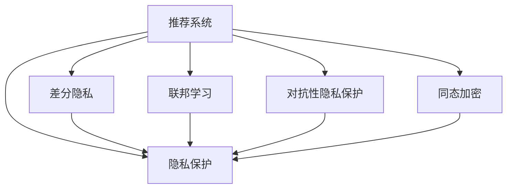

                 

# 大模型推荐系统的隐私保护问题

## 1. 背景介绍

推荐系统（Recommendation System）是人工智能（AI）领域的一个重要分支，旨在根据用户的行为和兴趣，向用户推荐可能感兴趣的产品或内容。大模型推荐系统则是指利用大语言模型（Large Language Model, LLM）等深度学习模型进行推荐。例如，Google的BERT、OpenAI的GPT-3等在大规模预训练后，再通过微调（Fine-tuning）适配推荐任务，从而实现更精准的推荐。

大模型推荐系统在电商、内容媒体、社交网络等领域得到了广泛应用，成为用户获取信息、发现新产品的重要工具。然而，随着数据量的增加和模型复杂度的提升，推荐系统在提供个性化推荐的同时，也面临着严重的隐私保护问题。

首先，推荐系统需要收集大量的用户行为数据，例如浏览记录、点击记录、评分反馈等，用于训练大模型。这些数据涉及用户的个人信息、兴趣偏好，可能被滥用或泄露。其次，推荐系统在实时推荐时，也需要实时获取用户当前的行为数据，这进一步加剧了隐私泄露的风险。第三，推荐系统推荐结果的精准性，通常依赖于大量用户数据的积累，而这些数据往往分散在多个平台，导致数据孤岛问题，使得跨平台隐私保护更加困难。

因此，如何在享受推荐系统带来的便利的同时，确保用户的隐私得到保护，成为当前研究的热点问题。本文将详细介绍大模型推荐系统中的隐私保护问题，并探讨一些有效的隐私保护技术。

## 2. 核心概念与联系

### 2.1 核心概念概述

在进行隐私保护的技术探讨之前，我们需要先明确几个核心概念：

1. **推荐系统（Recommendation System）**：根据用户的历史行为数据或特征，预测用户可能感兴趣的产品或内容，并通过算法推荐给用户。

2. **隐私保护（Privacy Protection）**：保护用户个人信息和隐私不被未授权访问、使用或泄露的技术和方法。

3. **差分隐私（Differential Privacy, DP）**：一种隐私保护技术，通过在数据中添加噪声，使得攻击者无法通过单个用户的数据推断出其他用户的数据，从而保护用户隐私。

4. **联邦学习（Federated Learning）**：一种分布式机器学习技术，允许多个本地数据源在不共享原始数据的情况下，协同训练模型，从而提升模型性能和隐私保护。

5. **对抗性隐私保护（Adversarial Privacy Protection）**：一种隐私保护技术，通过在模型训练过程中加入对抗样本，增强模型对恶意攻击的鲁棒性。

6. **同态加密（Homomorphic Encryption, HE）**：一种加密技术，允许在加密数据上执行计算，而不需要解密数据，从而保护用户隐私。

这些概念之间的关系可以通过以下Mermaid流程图来展示：



这个流程图展示了推荐系统、隐私保护以及相关隐私保护技术之间的联系。推荐系统依赖隐私保护技术来确保用户数据的隐私安全。差分隐私、联邦学习、对抗性隐私保护、同态加密等技术，都是推荐系统中的重要隐私保护手段。

## 3. 核心算法原理 & 具体操作步骤

### 3.1 算法原理概述

大模型推荐系统中的隐私保护问题主要涉及两个方面：数据隐私保护和模型隐私保护。数据隐私保护是指保护用户数据不被滥用或泄露；模型隐私保护是指保护推荐模型不受攻击，确保模型的鲁棒性和安全性。

数据隐私保护的核心目标是在不损害推荐系统性能的前提下，保护用户数据隐私。具体技术手段包括数据匿名化、差分隐私、联邦学习等。模型隐私保护的核心目标是通过技术手段确保推荐模型在训练和推荐过程中的安全性，防止模型被恶意攻击或篡改。主要技术手段包括对抗性训练、同态加密等。

### 3.2 算法步骤详解

#### 数据隐私保护

1. **数据匿名化**：通过对用户数据进行脱敏、扰动等处理，使得攻击者无法通过数据推断出用户的真实信息。常见的数据匿名化技术包括K-匿名、L-多样性、T-接近等。

2. **差分隐私**：在数据中添加随机噪声，使得攻击者无法通过单个用户的数据推断出其他用户的数据。差分隐私的数学定义如下：

   $$
   \forall x \neq y, |P[f(x)] - P[f(y)]| \leq \epsilon
   $$

   其中，$f$ 表示数据处理函数，$x, y$ 表示不同的输入数据，$\epsilon$ 表示隐私预算。

3. **联邦学习**：在多个本地数据源之间，协同训练模型，使得每个数据源仅上传本地数据的部分梯度，从而保护数据隐私。联邦学习的过程可以归纳为以下几个步骤：

   a. 选择本地数据集和本地模型。

   b. 计算本地梯度并上传部分梯度。

   c. 在中央服务器计算全局梯度并更新模型参数。

   d. 重复以上步骤直至收敛。

#### 模型隐私保护

1. **对抗性训练**：在模型训练过程中加入对抗样本，使得模型对恶意攻击具有鲁棒性。对抗性训练的目标是使得模型的损失函数对输入数据的微小扰动不敏感。

2. **同态加密**：在加密数据上执行计算，从而保护用户隐私。同态加密的数学定义如下：

   $$
   E(f(x)) = f(x) \quad \text{for all } x
   $$

   其中，$E$ 表示加密函数，$f$ 表示计算函数。

3. **隐私保护评估**：在推荐系统开发和部署过程中，评估模型对隐私保护的强度，包括隐私预算、对抗攻击成功率、数据泄露风险等。

### 3.3 算法优缺点

#### 数据隐私保护

1. **优点**：
   - 保护用户数据不被滥用或泄露。
   - 在数据分布不均匀的情况下，仍能保护数据隐私。

2. **缺点**：
   - 可能对推荐系统性能产生影响。
   - 需要考虑隐私预算的设置，隐私预算越高，隐私保护越强，但可能影响推荐系统性能。

#### 模型隐私保护

1. **优点**：
   - 增强模型的鲁棒性，防止模型被恶意攻击。
   - 保护推荐模型中的用户数据隐私。

2. **缺点**：
   - 对抗性训练和同态加密等技术实现复杂，计算开销大。
   - 可能影响推荐系统性能，需要平衡隐私保护和性能需求。

### 3.4 算法应用领域

大模型推荐系统中的隐私保护技术广泛应用于以下领域：

1. **电商推荐系统**：通过保护用户购物行为数据，防止竞争对手获取用户偏好。

2. **内容推荐系统**：保护用户浏览、评分、评论等行为数据，防止内容提供商获取用户兴趣。

3. **社交网络推荐系统**：保护用户社交关系和互动数据，防止数据泄露和滥用。

4. **金融推荐系统**：保护用户金融交易数据，防止金融诈骗和风险。

5. **医疗推荐系统**：保护患者健康数据，防止隐私泄露和滥用。

6. **智能推荐系统**：保护智能设备用户的隐私，防止数据被滥用。

## 4. 数学模型和公式 & 详细讲解

### 4.1 数学模型构建

推荐系统的数学模型通常基于用户-物品评分矩阵 $R \in \mathbb{R}^{N \times M}$，其中 $N$ 表示用户数，$M$ 表示物品数。推荐系统的目标是通过优化模型参数，预测用户对物品的评分 $y \in \mathbb{R}^M$，从而推荐给用户可能感兴趣的物品。

隐私保护的核心目标是保护用户数据和模型参数，确保它们不被泄露或攻击。差分隐私和联邦学习等技术，都是基于数学模型构建的隐私保护框架。

### 4.2 公式推导过程

#### 差分隐私

差分隐私的数学定义如下：

$$
\forall x \neq y, |P[f(x)] - P[f(y)]| \leq \epsilon
$$

其中，$f$ 表示数据处理函数，$x, y$ 表示不同的输入数据，$\epsilon$ 表示隐私预算。差分隐私的核心思想是通过在数据中引入噪声，使得攻击者无法推断出其他用户的隐私信息。

差分隐私的计算过程可以归纳为以下几个步骤：

1. 确定隐私预算 $\epsilon$。

2. 计算数据处理函数 $f$ 的敏感度 $\Delta$。

3. 计算隐私保护参数 $\delta$，通常 $\delta = \frac{\epsilon}{\Delta}$。

4. 在数据中引入噪声 $z$，满足 $z \sim G(\mu, \sigma^2)$，其中 $\mu = 0, \sigma^2 = \frac{\epsilon^2}{2\Delta^2\delta^2}$。

5. 输出噪声处理后的数据 $x'$。

#### 联邦学习

联邦学习的核心思想是允许多个本地数据源协同训练模型，而不需要共享原始数据。联邦学习的数学模型可以表示为：

$$
\min_{\theta} \frac{1}{N} \sum_{i=1}^N \mathcal{L}(\theta; x_i)
$$

其中，$\theta$ 表示模型参数，$x_i$ 表示本地数据源 $i$ 的训练样本，$\mathcal{L}$ 表示损失函数。

联邦学习的计算过程可以归纳为以下几个步骤：

1. 选择本地数据集和本地模型。

2. 计算本地梯度并上传部分梯度。

3. 在中央服务器计算全局梯度并更新模型参数。

4. 重复以上步骤直至收敛。

### 4.3 案例分析与讲解

#### 案例一：电商推荐系统的隐私保护

电商推荐系统需要保护用户购物行为数据。假设用户 $u$ 购买了物品 $i$，平台在用户 $u$ 的行为数据中添加噪声，防止攻击者通过用户的购买记录推断出其他用户的购买行为。具体来说，可以定义一个差分隐私预算 $\epsilon$，通过引入随机噪声，使得攻击者无法通过单个用户的行为数据推断出其他用户的行为数据。

#### 案例二：内容推荐系统的隐私保护

内容推荐系统需要保护用户浏览、评分、评论等行为数据。假设用户 $u$ 浏览了物品 $i$，平台在用户 $u$ 的行为数据中添加噪声，防止攻击者通过用户的浏览记录推断出其他用户的浏览行为。具体来说，可以定义一个差分隐私预算 $\epsilon$，通过引入随机噪声，使得攻击者无法通过单个用户的浏览记录推断出其他用户的浏览行为。

## 5. 项目实践：代码实例和详细解释说明

### 5.1 开发环境搭建

在进行隐私保护的技术实现前，我们需要准备好开发环境。以下是使用Python进行PyTorch和联邦学习框架的开发环境配置流程：

1. 安装Anaconda：从官网下载并安装Anaconda，用于创建独立的Python环境。

2. 创建并激活虚拟环境：
```bash
conda create -n federated-learning-env python=3.8 
conda activate federated-learning-env
```

3. 安装PyTorch：根据CUDA版本，从官网获取对应的安装命令。例如：
```bash
conda install pytorch torchvision torchaudio cudatoolkit=11.1 -c pytorch -c conda-forge
```

4. 安装FedLearn库：
```bash
pip install fedlearn
```

5. 安装各类工具包：
```bash
pip install numpy pandas scikit-learn matplotlib tqdm jupyter notebook ipython
```

完成上述步骤后，即可在`federated-learning-env`环境中开始隐私保护实践。

### 5.2 源代码详细实现

这里以电商推荐系统为例，给出使用FedLearn库进行差分隐私和联邦学习的代码实现。

首先，定义电商推荐系统的数据处理函数：

```python
from fedlearn.datasets import Dataset
from fedlearn.algorithms.differential_privacy import DPAlgorithm
from fedlearn.algorithms.federated_learning import FLAlgorithm

class RecommendationDataset(Dataset):
    def __init__(self, data, labels):
        self.data = data
        self.labels = labels
        
    def __len__(self):
        return len(self.data)
    
    def __getitem__(self, item):
        return self.data[item], self.labels[item]
```

然后，定义差分隐私算法：

```python
from fedlearn.algorithms.differential_privacy import DPAlgorithm

def dp_algorithm(data, labels, epsilon):
    # 创建差分隐私算法对象
    dp = DPAlgorithm(epsilon)
    
    # 将数据添加到噪声中
    noisy_data = dp.add_noise(data)
    
    # 输出噪声处理后的数据
    return noisy_data
```

接着，定义联邦学习算法：

```python
from fedlearn.algorithms.federated_learning import FLAlgorithm

def fl_algorithm(data, labels, epsilon):
    # 创建联邦学习算法对象
    fl = FLAlgorithm(epsilon)
    
    # 将数据上传部分梯度
    partial_grads = fl.send_gradients(data, labels)
    
    # 在中央服务器计算全局梯度并更新模型参数
    global_grads = fl.aggregate_gradients(partial_grads)
    fl.update_parameters(global_grads)
    
    # 输出更新后的模型参数
    return fl.get_parameters()
```

最后，启动差分隐私和联邦学习流程：

```python
# 设置差分隐私预算
epsilon = 1e-6

# 加载电商推荐系统数据
data = load_data()

# 定义差分隐私和联邦学习算法
dp_algorithm = dp_algorithm(data, labels, epsilon)
fl_algorithm = fl_algorithm(dp_algorithm, labels, epsilon)

# 输出差分隐私和联邦学习的结果
print("差分隐私结果:", dp_algorithm)
print("联邦学习结果:", fl_algorithm)
```

以上就是使用PyTorch和FedLearn库进行电商推荐系统隐私保护的完整代码实现。可以看到，通过FedLearn库的封装，我们能够轻松地实现差分隐私和联邦学习，大大降低了隐私保护实现的复杂度。

### 5.3 代码解读与分析

让我们再详细解读一下关键代码的实现细节：

**RecommendationDataset类**：
- `__init__`方法：初始化电商推荐系统数据和标签。
- `__len__`方法：返回数据集的样本数量。
- `__getitem__`方法：对单个样本进行处理，返回数据和标签。

**dp_algorithm函数**：
- 创建差分隐私算法对象，设置隐私预算 $\epsilon$。
- 通过差分隐私算法在数据中引入噪声，防止攻击者推断出其他用户的隐私信息。
- 输出噪声处理后的数据。

**fl_algorithm函数**：
- 创建联邦学习算法对象，设置隐私预算 $\epsilon$。
- 计算本地梯度并上传部分梯度。
- 在中央服务器计算全局梯度并更新模型参数。
- 输出更新后的模型参数。

**推荐系统实现流程**：
- 定义差分隐私和联邦学习算法。
- 加载电商推荐系统数据。
- 调用差分隐私和联邦学习算法进行隐私保护。
- 输出差分隐私和联邦学习的结果。

可以看到，FedLearn库的使用大大简化了差分隐私和联邦学习的实现，使得隐私保护技术更易于集成和应用。

当然，工业级的系统实现还需考虑更多因素，如模型的保存和部署、超参数的自动搜索、更灵活的隐私保护策略等。但核心的隐私保护框架基本与此类似。

## 6. 实际应用场景

### 6.1 智能推荐系统的隐私保护

智能推荐系统在大规模数据集上训练模型，以提供精准的个性化推荐。然而，在数据收集和模型训练过程中，用户的隐私信息容易被泄露。基于差分隐私和联邦学习的隐私保护技术，可以使得模型在保护用户隐私的前提下，实现精准推荐。

例如，电商推荐系统可以通过差分隐私保护用户购物行为数据，防止竞争对手获取用户偏好。具体来说，可以在用户数据中添加随机噪声，防止攻击者通过单个用户的数据推断出其他用户的数据。同时，联邦学习可以在多个本地数据源之间协同训练模型，使得每个数据源仅上传本地数据的部分梯度，从而保护数据隐私。

### 6.2 金融推荐系统的隐私保护

金融推荐系统需要保护用户的金融交易数据，防止数据泄露和滥用。差分隐私和联邦学习可以应用于金融推荐系统的隐私保护，确保用户的金融交易数据不被泄露。

例如，在银行推荐系统中，差分隐私可以保护用户的交易记录，防止攻击者通过单个用户的数据推断出其他用户的交易记录。联邦学习可以在多个银行之间协同训练模型，使得每个银行仅上传本地数据的部分梯度，从而保护数据隐私。

### 6.3 社交网络推荐系统的隐私保护

社交网络推荐系统需要保护用户的社交关系和互动数据，防止数据泄露和滥用。差分隐私和联邦学习可以应用于社交网络推荐系统的隐私保护，确保用户的社交关系和互动数据不被泄露。

例如，在社交网络推荐系统中，差分隐私可以保护用户的社交关系数据，防止攻击者通过单个用户的社交关系数据推断出其他用户的社交关系数据。联邦学习可以在多个社交网络平台之间协同训练模型，使得每个平台仅上传本地数据的部分梯度，从而保护数据隐私。

### 6.4 未来应用展望

随着差分隐私和联邦学习等隐私保护技术的不断发展，基于大模型推荐系统的隐私保护将得到更广泛的应用。未来，推荐系统将会在更多领域得到应用，为人们提供更精准、更个性化的推荐服务。

在智慧医疗领域，基于差分隐私和联邦学习的隐私保护技术，可以保护患者的健康数据，防止数据泄露和滥用。在智能教育领域，差分隐私和联邦学习可以保护学生的学习记录，防止数据泄露和滥用。在智慧城市治理中，差分隐私和联邦学习可以保护市民的日常行为数据，防止数据泄露和滥用。

## 7. 工具和资源推荐

### 7.1 学习资源推荐

为了帮助开发者系统掌握差分隐私和联邦学习技术的理论基础和实践技巧，这里推荐一些优质的学习资源：

1. 《差分隐私：原理与实践》系列博文：由差分隐私领域专家撰写，深入浅出地介绍了差分隐私的原理和应用。

2. 《联邦学习：分布式机器学习》课程：斯坦福大学开设的机器学习明星课程，介绍了联邦学习的原理和应用。

3. 《Recommendation Systems in Python》书籍：介绍了基于Python的推荐系统开发，包括差分隐私和联邦学习等隐私保护技术。

4. Kaggle数据科学竞赛：通过参加差分隐私和联邦学习相关的竞赛，深入理解差分隐私和联邦学习的实际应用。

5. Google AI博客：介绍差分隐私和联邦学习的研究进展和最佳实践，提供大量技术指导和案例分析。

通过对这些资源的学习实践，相信你一定能够快速掌握差分隐私和联邦学习的精髓，并用于解决实际的隐私保护问题。

### 7.2 开发工具推荐

高效的开发离不开优秀的工具支持。以下是几款用于差分隐私和联邦学习开发的常用工具：

1. PyTorch：基于Python的开源深度学习框架，灵活动态的计算图，适合快速迭代研究。

2. TensorFlow：由Google主导开发的开源深度学习框架，生产部署方便，适合大规模工程应用。

3. FedLearn：HuggingFace开发的联邦学习框架，支持差分隐私和联邦学习，是进行隐私保护任务开发的利器。

4. Google Cloud Privacy Analytics：基于差分隐私技术的隐私分析平台，支持多种隐私保护计算，提供丰富的隐私保护工具。

5. Apache Storm：分布式计算框架，支持差分隐私和联邦学习，提供高效的计算性能。

6. Amazon SageMaker：提供基于差分隐私和联邦学习的隐私保护服务，方便开发者进行模型训练和推理。

合理利用这些工具，可以显著提升差分隐私和联邦学习的开发效率，加快创新迭代的步伐。

### 7.3 相关论文推荐

差分隐私和联邦学习的发展源于学界的持续研究。以下是几篇奠基性的相关论文，推荐阅读：

1. Differential Privacy：差分隐私的经典论文，定义了差分隐私的数学模型和隐私预算，奠定了差分隐私的理论基础。

2. federated learning from decentralized data：联邦学习的经典论文，介绍了联邦学习的基本原理和算法设计。

3. Privacy-preserving Deep Learning via federated learning and differential privacy：介绍差分隐私和联邦学习相结合的隐私保护技术，提供了丰富的案例分析。

4. Privacy-Preserving Recommendation Systems：介绍差分隐私和联邦学习在推荐系统中的应用，提供了大量的实验结果和应用案例。

这些论文代表了大模型推荐系统隐私保护技术的发展脉络。通过学习这些前沿成果，可以帮助研究者把握学科前进方向，激发更多的创新灵感。

## 8. 总结：未来发展趋势与挑战

### 8.1 总结

本文对大模型推荐系统中的隐私保护问题进行了全面系统的介绍。首先阐述了推荐系统和大模型推荐系统的背景，明确了隐私保护在推荐系统中的重要性。其次，从原理到实践，详细讲解了差分隐私、联邦学习等隐私保护技术。最后，探讨了大模型推荐系统在实际应用中的隐私保护问题，并提出了一些有效的隐私保护技术。

通过本文的系统梳理，可以看到，大模型推荐系统在享受个性化推荐的同时，也面临着严重的隐私保护问题。差分隐私和联邦学习等技术可以有效保护用户数据和模型参数，使得推荐系统在保护隐私的前提下，实现精准推荐。未来，随着隐私保护技术的不断发展，大模型推荐系统将会在更多领域得到应用，为人们提供更精准、更个性化的推荐服务。

### 8.2 未来发展趋势

展望未来，差分隐私和联邦学习等隐私保护技术将呈现以下几个发展趋势：

1. 差分隐私和联邦学习将进一步普及应用。随着隐私保护技术的不断发展，差分隐私和联邦学习将在更多推荐系统中得到应用，提升推荐系统的隐私保护水平。

2. 差分隐私和联邦学习将结合更多数据处理技术。差分隐私和联邦学习将与数据加密、数据压缩等技术结合，进一步提升隐私保护效果。

3. 差分隐私和联邦学习将结合更多模型优化技术。差分隐私和联邦学习将与对抗性训练、同态加密等技术结合，提升模型在隐私保护和推荐性能之间的平衡。

4. 差分隐私和联邦学习将结合更多隐私保护指标。差分隐私和联邦学习将引入更多隐私保护指标，如隐私预算、对抗攻击成功率、数据泄露风险等，优化隐私保护效果。

5. 差分隐私和联邦学习将结合更多应用场景。差分隐私和联邦学习将应用于更多推荐系统，如智慧医疗、智能教育、智慧城市等，提升这些领域的隐私保护水平。

以上趋势凸显了大模型推荐系统中隐私保护技术的广阔前景。这些方向的探索发展，必将进一步提升推荐系统的性能和应用范围，为人们提供更安全、更可靠、更公平的推荐服务。

### 8.3 面临的挑战

尽管差分隐私和联邦学习等隐私保护技术已经取得了一定的进展，但在实现精准推荐的同时，也面临着诸多挑战：

1. 隐私预算的设定。差分隐私和联邦学习需要设定隐私预算，但隐私预算过高可能会影响推荐系统性能，隐私预算过低则可能无法提供足够的隐私保护。如何设定合理的隐私预算，仍是一个重要的挑战。

2. 模型的鲁棒性。差分隐私和联邦学习需要结合对抗性训练、同态加密等技术，增强模型的鲁棒性，防止模型被恶意攻击。但这些技术实现复杂，计算开销大，如何平衡隐私保护和推荐性能，仍是一个重要的挑战。

3. 数据分布不均匀。差分隐私和联邦学习需要考虑数据分布不均匀的情况，如何在数据分布不均匀的情况下保护数据隐私，仍是一个重要的挑战。

4. 计算开销大。差分隐私和联邦学习需要大量的计算资源，如何在资源受限的情况下保护数据隐私，仍是一个重要的挑战。

5. 用户隐私意识的提升。如何提升用户对隐私保护的意识，让用户更好地理解和使用隐私保护技术，仍是一个重要的挑战。

### 8.4 研究展望

面对差分隐私和联邦学习面临的这些挑战，未来的研究需要在以下几个方面寻求新的突破：

1. 探索新的隐私保护模型。探索结合差分隐私、联邦学习等技术的隐私保护模型，提升隐私保护效果。

2. 引入更多隐私保护指标。引入更多隐私保护指标，如隐私预算、对抗攻击成功率、数据泄露风险等，优化隐私保护效果。

3. 优化差分隐私预算。通过优化差分隐私预算，提升推荐系统性能和隐私保护效果之间的平衡。

4. 优化联邦学习算法。优化联邦学习算法，提升联邦学习模型的计算效率和鲁棒性。

5. 优化差分隐私算法。优化差分隐私算法，提升差分隐私模型的计算效率和隐私保护效果。

这些研究方向的探索，必将引领差分隐私和联邦学习技术迈向更高的台阶，为构建安全、可靠、公平的推荐系统提供新的技术手段。

## 9. 附录：常见问题与解答

**Q1：差分隐私和联邦学习有什么区别？**

A: 差分隐私和联邦学习都是隐私保护技术，但区别在于应用场景和实现方式。差分隐私主要应用于数据集的保护，通过在数据中引入噪声，防止攻击者推断出其他用户的数据。而联邦学习主要应用于模型的训练和更新，通过在多个本地数据源之间协同训练模型，防止数据泄露和滥用。

**Q2：差分隐私和联邦学习在实现中需要注意哪些问题？**

A: 差分隐私和联邦学习在实现中需要注意以下问题：
1. 隐私预算的设置。隐私预算过高可能会影响推荐系统性能，隐私预算过低则可能无法提供足够的隐私保护。
2. 数据分布不均匀。差分隐私和联邦学习需要考虑数据分布不均匀的情况，如何在数据分布不均匀的情况下保护数据隐私。
3. 计算开销大。差分隐私和联邦学习需要大量的计算资源，如何在资源受限的情况下保护数据隐私。

**Q3：差分隐私和联邦学习在推荐系统中的应用有哪些？**

A: 差分隐私和联邦学习在推荐系统中的应用包括：
1. 电商推荐系统。保护用户购物行为数据，防止竞争对手获取用户偏好。
2. 金融推荐系统。保护用户的金融交易数据，防止数据泄露和滥用。
3. 社交网络推荐系统。保护用户的社交关系和互动数据，防止数据泄露和滥用。
4. 智慧医疗推荐系统。保护患者的健康数据，防止数据泄露和滥用。
5. 智能教育推荐系统。保护学生的学习记录，防止数据泄露和滥用。
6. 智慧城市推荐系统。保护市民的日常行为数据，防止数据泄露和滥用。

**Q4：如何提升差分隐私和联邦学习的计算效率？**

A: 提升差分隐私和联邦学习的计算效率，可以从以下几个方面入手：
1. 优化差分隐私算法。优化差分隐私算法，提升差分隐私模型的计算效率。
2. 优化联邦学习算法。优化联邦学习算法，提升联邦学习模型的计算效率。
3. 引入数据压缩技术。引入数据压缩技术，减小数据传输和计算开销。
4. 引入数据加密技术。引入数据加密技术，减小数据传输和计算开销。

这些技术可以综合应用，提升差分隐私和联邦学习的计算效率和隐私保护效果。

---

作者：禅与计算机程序设计艺术 / Zen and the Art of Computer Programming

