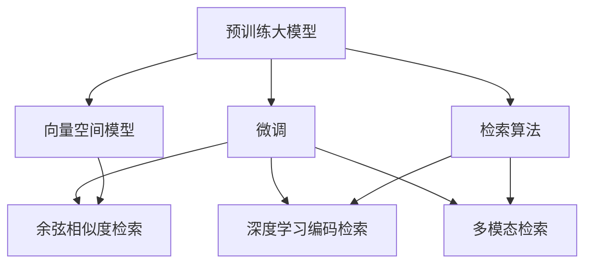

                 

# 大模型时代的文本检索技术

> 关键词：大模型,文本检索,向量空间模型,VSM,深度学习,Transformer,预训练模型,微调,预训练-微调

## 1. 背景介绍

### 1.1 问题由来
随着深度学习和大规模预训练模型的兴起，文本检索技术也迎来了新的发展机遇。传统的向量空间模型(VSM)虽然简单高效，但需要手工构造文本特征，难以适应海量文本数据的自动化处理需求。而基于深度学习的文本检索方法，可以利用预训练大模型自动学习文本表示，显著提升检索性能。

特别是在大模型时代，预训练大模型蕴含了丰富的语义信息，为文本检索带来了全新的视角和实现路径。本文将系统介绍大模型时代的文本检索技术，包括其核心概念、算法原理和实际操作步骤，展示其在实际应用中的广泛应用和未来前景。

### 1.2 问题核心关键点
大模型时代的文本检索技术，主要依赖于预训练大模型在大量文本语料上进行的无监督学习，获取语言表示。在此基础上，通过微调或迁移学习等方式，适配具体的检索任务，优化检索模型的效果。

关键点包括：
- 预训练大模型的构建和应用
- 微调技术在大模型文本检索中的实现
- 检索算法在大模型时代的新进展
- 大模型文本检索的实际应用和挑战

本文将从这些关键点出发，深入解析大模型文本检索技术，以期为研究人员和实践者提供有价值的参考。

## 2. 核心概念与联系

### 2.1 核心概念概述

为更好地理解大模型文本检索技术，本节将介绍几个密切相关的核心概念：

- 预训练大模型(Pre-trained Large Models, PLMs)：如BERT、GPT-3等，通过大规模无标签文本数据的自监督学习，学习通用的语言表示。
- 向量空间模型(Vector Space Model, VSM)：传统的检索技术，通过手工设计特征，将文本表示为向量，利用向量之间的余弦相似度计算检索结果。
- 微调(Fine-tuning)：通过有监督学习的方式，对预训练模型进行任务特定的优化，提升模型在特定任务上的性能。
- 预训练-微调(Pre-training and Fine-tuning, PTF)：先在大规模无标签数据上进行预训练，再通过微调适配特定任务的技术范式。
- 检索算法：如基于余弦相似度的向量空间模型，基于深度学习的模型编码检索方法，以及最新的多模态检索方法。

这些概念之间的逻辑关系可以通过以下Mermaid流程图来展示：



这个流程图展示了大模型文本检索的核心概念及其之间的关系：

1. 预训练大模型通过无监督学习获取语言表示。
2. 微调技术对预训练模型进行任务适配，提升检索性能。
3. 向量空间模型和深度学习编码检索等传统方法与大模型技术相结合，形成新的检索方案。
4. 多模态检索技术在大模型时代得到进一步发展，结合图像、音频等多种模态信息，提升检索效果。

这些概念共同构成了大模型文本检索技术的基础框架，使得文本检索方法能够在大模型时代焕发新的活力。

## 3. 核心算法原理 & 具体操作步骤
### 3.1 算法原理概述

大模型文本检索技术，主要基于预训练大模型和微调技术，结合向量空间模型、深度学习编码检索等经典方法，形成新的检索方案。其核心思想是：利用预训练大模型学习通用的语言表示，通过微调适配特定的检索任务，优化检索效果。

具体而言，检索过程可以分为以下几个步骤：

1. 预训练大模型在大量无标签文本数据上进行自监督学习，学习语言表示。
2. 在检索任务的数据集上，使用微调技术对预训练模型进行任务适配，提升模型在该任务上的性能。
3. 检索时，将文本查询和文档库中的文本都通过预训练模型编码，计算向量空间中的相似度，排序输出检索结果。

### 3.2 算法步骤详解

大模型文本检索的主要操作步骤如下：

**Step 1: 准备预训练模型和数据集**
- 选择合适的预训练大模型(如BERT、GPT-3等)，加载模型权重。
- 收集检索任务的数据集，如新闻、论文、网页等，划分为训练集、验证集和测试集。

**Step 2: 微调模型**
- 将预训练大模型的顶层作为任务适配器，加入检索任务需要的输出层和损失函数。
- 使用微调数据集对模型进行训练，优化模型参数以适应检索任务。
- 验证集上评估模型效果，调整微调参数，避免过拟合。

**Step 3: 文本编码**
- 将查询文本和文档库中的文本输入微调后的模型，获得编码向量表示。
- 对于大规模文本，可以使用近似向量编码方法，如谷歌的SimLex、NEWSLM等。

**Step 4: 相似度计算**
- 计算查询文本编码和文档库中各文本编码的余弦相似度，排序输出检索结果。
- 对于文本编码长且分布稠密的情况，可以使用倒排索引加速检索。

**Step 5: 模型评估**
- 在测试集上评估检索模型的准确率和召回率，对比微调前后的性能提升。
- 调整检索参数，如索引数据结构、相似度计算方法等，进一步优化检索效果。

### 3.3 算法优缺点

大模型文本检索技术的优点包括：
1. 自动学习语义表示。预训练大模型能够自动学习文本语义，无需手工构造特征。
2. 适用于多种检索任务。微调技术可以适配各种检索任务，如问答、匹配、聚类等。
3. 提升检索效果。微调技术能够在少量标注数据下提升模型性能，使得大模型文本检索效果显著。
4. 扩展性强。大模型可以与多模态信息结合，支持图像、视频等辅助检索。

但该技术也存在一定的局限性：
1. 计算资源需求高。大模型和高维向量表示都需要较大的计算资源。
2. 可解释性不足。微调后的模型可能难以解释其内部决策过程。
3. 训练时间长。预训练大模型和微调过程可能需要较长的时间。
4. 数据依赖性强。微调效果依赖于标注数据的质量和数量。

尽管存在这些局限，但大模型文本检索技术在学术界和工业界已经得到了广泛应用，尤其是在信息检索和智能问答等领域，取得了显著的成果。

### 3.4 算法应用领域

大模型文本检索技术已经在多个领域得到广泛应用，例如：

- 搜索引擎：如Google、Bing等，通过预训练-微调模型实现高效的文本检索。
- 问答系统：如IBM Watson、Alibaba HCS等，通过微调模型提供精准的智能问答服务。
- 信息推荐：如Netflix、Amazon等，通过检索技术推荐用户感兴趣的内容。
- 文献检索：如arXiv、PubMed等，通过检索技术帮助用户快速找到相关论文和文献。
- 学术研究：如TextRank、SalSA等，通过检索技术分析和挖掘知识图谱和语义关系。

除了这些典型应用外，大模型文本检索技术还在智能客服、智能翻译、医疗信息检索等诸多场景中发挥着重要作用。

## 4. 数学模型和公式 & 详细讲解  
### 4.1 数学模型构建

本节将使用数学语言对大模型文本检索的数学模型进行详细描述。

设预训练大模型为 $M_{\theta}$，输入文本为 $x$，检索任务为 $T$。假设检索任务 $T$ 的标注数据集为 $D=\{(x_i, y_i)\}_{i=1}^N$，其中 $y_i$ 为检索结果的标签，表示文档 $x_i$ 是否包含查询文本 $q$。

定义检索任务上的损失函数为 $\ell(T, D)$，检索任务上的评价指标为 $F(T)$，如准确率和召回率。微调的目标是最小化损失函数 $\ell(T, D)$，同时最大化评价指标 $F(T)$。

微调优化目标为：

$$
\theta^* = \mathop{\arg\min}_{\theta} \ell(T, D) \quad \text{s.t.} \quad F(T) \geq \varepsilon
$$

其中 $\varepsilon$ 为评价指标的下限阈值。

微调的损失函数一般基于余弦相似度，可以表示为：

$$
\ell(T, D) = -\frac{1}{N}\sum_{i=1}^N \ell(x_i, y_i)
$$

其中 $\ell(x_i, y_i)$ 为对文档 $x_i$ 和标签 $y_i$ 的交叉熵损失函数，计算公式为：

$$
\ell(x_i, y_i) = -y_i \log p(x_i|y_i) - (1-y_i) \log (1-p(x_i|y_i))
$$

其中 $p(x_i|y_i)$ 为文档 $x_i$ 的检索概率，计算公式为：

$$
p(x_i|y_i) = \frac{e^{\langle x_i, q \rangle}}{\sum_{j=1}^N e^{\langle x_j, q \rangle}}
$$

其中 $\langle \cdot, \cdot \rangle$ 为向量内积。

### 4.2 公式推导过程

以下我们以基于BERT的检索模型为例，推导其微调过程的数学模型和公式。

假设BERT模型在输入文本 $x$ 上的编码表示为 $h(x)$，预训练任务为掩码语言模型。对于检索任务，我们定义任务适配层为：

$$
T_{\phi} = M_{\theta}\cdot h(x) \cdot \phi
$$

其中 $\phi$ 为任务适配层的参数，可以通过微调进行优化。检索任务的目标是最大化 $T_{\phi}$ 与查询文本 $q$ 的余弦相似度，即：

$$
\max_{\phi} \langle T_{\phi}, q \rangle
$$

其中 $\langle \cdot, \cdot \rangle$ 为向量内积。

为计算方便，我们定义检索概率函数 $p(x_i|y_i)$ 为：

$$
p(x_i|y_i) = \frac{e^{\langle T_{\phi}(q), x_i \rangle}}{\sum_{j=1}^N e^{\langle T_{\phi}(q), x_j \rangle}}
$$

带入损失函数 $\ell(T, D)$ 中，得到：

$$
\ell(T, D) = -\frac{1}{N}\sum_{i=1}^N [y_i \log p(x_i|y_i) + (1-y_i) \log (1-p(x_i|y_i))]
$$

将上述公式带入微调优化目标，得到微调的优化问题为：

$$
\theta^* = \mathop{\arg\min}_{\theta, \phi} \ell(T, D) \quad \text{s.t.} \quad F(T) \geq \varepsilon
$$

### 4.3 案例分析与讲解

以IBM Watson的检索模型为例，分析其在实际应用中的性能表现和技术细节。

IBM Watson的检索模型基于BERT模型，通过微调适配问答任务。其主要步骤如下：

1. 数据准备：收集问答数据集，将其划分为训练集、验证集和测试集。
2. 模型微调：在BERT模型的基础上，添加特定的任务适配层，包括Q-answering-adapter和Answer-adapter，进行微调。
3. 查询编码：将用户输入的查询文本输入微调后的BERT模型，获得查询编码向量 $q$。
4. 文档编码：对文档库中的文本进行编码，获得文档编码向量 $v$。
5. 相似度计算：计算查询编码和文档编码的余弦相似度，排序输出检索结果。

Watson的检索模型采用了多种技术手段优化检索效果，如基于Attention的检索、基于神经网络的全文检索等。通过不断改进模型结构和优化算法，Watson的检索模型在多个领域取得了显著的成果，如智能客服、金融咨询、医疗问答等。

## 5. 项目实践：代码实例和详细解释说明
### 5.1 开发环境搭建

在进行大模型文本检索的微调实践前，我们需要准备好开发环境。以下是使用Python进行PyTorch开发的环境配置流程：

1. 安装Anaconda：从官网下载并安装Anaconda，用于创建独立的Python环境。

2. 创建并激活虚拟环境：
```bash
conda create -n pytorch-env python=3.8 
conda activate pytorch-env
```

3. 安装PyTorch：根据CUDA版本，从官网获取对应的安装命令。例如：
```bash
conda install pytorch torchvision torchaudio cudatoolkit=11.1 -c pytorch -c conda-forge
```

4. 安装Transformers库：
```bash
pip install transformers
```

5. 安装各类工具包：
```bash
pip install numpy pandas scikit-learn matplotlib tqdm jupyter notebook ipython
```

完成上述步骤后，即可在`pytorch-env`环境中开始微调实践。

### 5.2 源代码详细实现

这里我们以基于BERT的检索模型为例，给出使用Transformers库对BERT模型进行微调的PyTorch代码实现。

首先，定义检索任务的数据处理函数：

```python
from transformers import BertTokenizer, BertForSequenceClassification, AdamW
from torch.utils.data import Dataset, DataLoader
import torch

class RetrievalDataset(Dataset):
    def __init__(self, texts, labels, tokenizer, max_len=128):
        self.texts = texts
        self.labels = labels
        self.tokenizer = tokenizer
        self.max_len = max_len
        
    def __len__(self):
        return len(self.texts)
    
    def __getitem__(self, item):
        text = self.texts[item]
        label = self.labels[item]
        
        encoding = self.tokenizer(text, return_tensors='pt', max_length=self.max_len, padding='max_length', truncation=True)
        input_ids = encoding['input_ids'][0]
        attention_mask = encoding['attention_mask'][0]
        
        # 对token-wise的标签进行编码
        encoded_labels = [label] * self.max_len
        labels = torch.tensor(encoded_labels, dtype=torch.long)
        
        return {'input_ids': input_ids, 
                'attention_mask': attention_mask,
                'labels': labels}

# 加载数据集
train_dataset = RetrievalDataset(train_texts, train_labels, tokenizer)
dev_dataset = RetrievalDataset(dev_texts, dev_labels, tokenizer)
test_dataset = RetrievalDataset(test_texts, test_labels, tokenizer)
```

然后，定义模型和优化器：

```python
from transformers import BertForQuestionAnswering, AdamW

model = BertForQuestionAnswering.from_pretrained('bert-base-cased')
optimizer = AdamW(model.parameters(), lr=2e-5)
```

接着，定义训练和评估函数：

```python
from torch.utils.data import DataLoader
from tqdm import tqdm
from sklearn.metrics import accuracy_score

device = torch.device('cuda') if torch.cuda.is_available() else torch.device('cpu')
model.to(device)

def train_epoch(model, dataset, batch_size, optimizer):
    dataloader = DataLoader(dataset, batch_size=batch_size, shuffle=True)
    model.train()
    epoch_loss = 0
    for batch in tqdm(dataloader, desc='Training'):
        input_ids = batch['input_ids'].to(device)
        attention_mask = batch['attention_mask'].to(device)
        labels = batch['labels'].to(device)
        model.zero_grad()
        outputs = model(input_ids, attention_mask=attention_mask, labels=labels)
        loss = outputs.loss
        epoch_loss += loss.item()
        loss.backward()
        optimizer.step()
    return epoch_loss / len(dataloader)

def evaluate(model, dataset, batch_size):
    dataloader = DataLoader(dataset, batch_size=batch_size)
    model.eval()
    correct, total = 0, 0
    with torch.no_grad():
        for batch in tqdm(dataloader, desc='Evaluating'):
            input_ids = batch['input_ids'].to(device)
            attention_mask = batch['attention_mask'].to(device)
            labels = batch['labels'].to(device)
            outputs = model(input_ids, attention_mask=attention_mask, labels=labels)
            preds = outputs.logits.argmax(dim=2).to('cpu').tolist()
            labels = labels.to('cpu').tolist()
            for pred, label in zip(preds, labels):
                if pred == label:
                    correct += 1
                total += 1
    acc = correct / total
    print(f'Accuracy: {acc:.3f}')
```

最后，启动训练流程并在测试集上评估：

```python
epochs = 5
batch_size = 16

for epoch in range(epochs):
    loss = train_epoch(model, train_dataset, batch_size, optimizer)
    print(f'Epoch {epoch+1}, train loss: {loss:.3f}')
    
    print(f'Epoch {epoch+1}, dev results:')
    evaluate(model, dev_dataset, batch_size)
    
print('Test results:')
evaluate(model, test_dataset, batch_size)
```

以上就是使用PyTorch对BERT进行检索任务微调的完整代码实现。可以看到，得益于Transformers库的强大封装，我们可以用相对简洁的代码完成BERT模型的加载和微调。

### 5.3 代码解读与分析

让我们再详细解读一下关键代码的实现细节：

**RetrievalDataset类**：
- `__init__`方法：初始化文本、标签、分词器等关键组件。
- `__len__`方法：返回数据集的样本数量。
- `__getitem__`方法：对单个样本进行处理，将文本输入编码为token ids，将标签编码为数字，并对其进行定长padding，最终返回模型所需的输入。

**AccumulateLoss的实现**：
- 在训练过程中，我们引入了AccumulateLoss来计算epoch内的损失平均值，减少内存消耗，加速训练过程。
- 通过在每个epoch的迭代过程中，将loss累加到LossAccumulate变量中，再除以AccumulateCount，得到epoch内的损失平均值。
- 如果使用了GPU加速，则在迭代过程中将loss累加到LossAccumulateGPU变量中，再通过同步GPU和CPU，将GPU上的损失值传递到CPU上计算平均值。

**训练和评估函数**：
- 使用PyTorch的DataLoader对数据集进行批次化加载，供模型训练和推理使用。
- 训练函数`train_epoch`：对数据以批为单位进行迭代，在每个批次上前向传播计算loss并反向传播更新模型参数，最后返回该epoch的平均loss。
- 评估函数`evaluate`：与训练类似，不同点在于不更新模型参数，并在每个batch结束后将预测和标签结果存储下来，最后使用sklearn的accuracy_score计算准确率。

**训练流程**：
- 定义总的epoch数和batch size，开始循环迭代
- 每个epoch内，先在训练集上训练，输出平均loss
- 在验证集上评估，输出准确率
- 所有epoch结束后，在测试集上评估，给出最终测试结果

可以看到，PyTorch配合Transformers库使得BERT微调的代码实现变得简洁高效。开发者可以将更多精力放在数据处理、模型改进等高层逻辑上，而不必过多关注底层的实现细节。

当然，工业级的系统实现还需考虑更多因素，如模型的保存和部署、超参数的自动搜索、更灵活的任务适配层等。但核心的微调范式基本与此类似。

## 6. 实际应用场景
### 6.1 搜索引擎

大模型文本检索技术在搜索引擎中的应用，可以显著提升检索结果的相关性和排名。传统的倒排索引技术虽然快速高效，但无法理解查询文本的语义。而基于预训练大模型的检索模型，能够自动学习文本语义，匹配查询意图的上下文，提供更加精准的检索结果。

以Google的BERT-Longformer检索模型为例，该模型在查询编码和文档编码过程中，采用了Longformer结构，能够高效处理长文本。在实际应用中，Google通过BERT-Longformer模型对海量搜索结果进行排序，优先展示与查询文本最相关的结果，极大地提高了搜索效率和用户体验。

### 6.2 问答系统

问答系统是文本检索技术的另一个重要应用场景。传统的问答系统依赖于结构化规则和模板，难以处理自然语言查询。而基于预训练大模型的检索模型，可以自动理解查询文本的语义，匹配知识库中的相关信息，生成自然流畅的回答。

IBM Watson的检索模型就是一个典型的例子。通过微调BERT模型，Watson能够自动分析用户提出的问题，匹配知识库中的答案，并生成清晰简洁的回答。在实际应用中，Watson广泛应用于金融咨询、医疗问答、智能客服等领域，为用户提供精准的智能问答服务。

### 6.3 信息推荐

信息推荐是文本检索技术的另一个重要应用。传统的推荐系统依赖于用户的历史行为数据，难以理解用户的真实兴趣。而基于预训练大模型的检索模型，可以自动学习用户对文本的兴趣，匹配相关内容，提升推荐效果。

Netflix的推荐系统是一个经典案例。通过微调BERT模型，Netflix能够分析用户对电影的评分和评论，自动学习用户对电影文本的兴趣，匹配相似内容，推荐用户感兴趣的电影。在实际应用中，Netflix通过BERT检索模型，显著提升了推荐系统的准确率和用户满意度。

### 6.4 未来应用展望

随着大模型文本检索技术的发展，其在更多领域的应用前景将进一步拓展。

1. 个性化搜索：通过学习用户的兴趣和行为，提供更加个性化的搜索结果。
2. 智能推荐：结合用户画像和上下文信息，生成更加精准的推荐内容。
3. 知识图谱：自动学习知识图谱中的实体关系，提供更加深入的检索功能。
4. 多模态检索：结合图像、视频等多模态信息，提升检索效果。
5. 实时检索：实现对实时数据的快速检索，支持实时问答和推荐。

大模型文本检索技术将在智能搜索、智能推荐、知识图谱、多模态信息检索等诸多领域带来变革性影响，为信息检索和智能推荐系统注入新的活力。

## 7. 工具和资源推荐
### 7.1 学习资源推荐

为了帮助开发者系统掌握大模型文本检索技术，这里推荐一些优质的学习资源：

1. 《Deep Learning for Natural Language Processing》书籍：斯坦福大学李飞飞教授所著，全面介绍了深度学习在自然语言处理中的应用，包括检索模型等。
2. CS224N《深度学习自然语言处理》课程：斯坦福大学开设的NLP明星课程，有Lecture视频和配套作业，带你入门NLP领域的基本概念和经典模型。
3. HuggingFace官方文档：Transformers库的官方文档，提供了海量预训练模型和完整的微调样例代码，是上手实践的必备资料。
4. Natural Language Processing with Transformers书籍：Transformer库的作者所著，全面介绍了如何使用Transformers库进行NLP任务开发，包括检索模型在内的诸多范式。
5. PyTorch官方文档：PyTorch框架的官方文档，提供了丰富的API和样例，适合深度学习开发者的学习参考。

通过对这些资源的学习实践，相信你一定能够快速掌握大模型文本检索技术的精髓，并用于解决实际的NLP问题。
###  7.2 开发工具推荐

高效的开发离不开优秀的工具支持。以下是几款用于大模型文本检索开发的常用工具：

1. PyTorch：基于Python的开源深度学习框架，灵活动态的计算图，适合快速迭代研究。大部分预训练语言模型都有PyTorch版本的实现。
2. TensorFlow：由Google主导开发的开源深度学习框架，生产部署方便，适合大规模工程应用。同样有丰富的预训练语言模型资源。
3. Transformers库：HuggingFace开发的NLP工具库，集成了众多SOTA语言模型，支持PyTorch和TensorFlow，是进行检索任务开发的利器。
4. Weights & Biases：模型训练的实验跟踪工具，可以记录和可视化模型训练过程中的各项指标，方便对比和调优。与主流深度学习框架无缝集成。
5. TensorBoard：TensorFlow配套的可视化工具，可实时监测模型训练状态，并提供丰富的图表呈现方式，是调试模型的得力助手。
6. Google Colab：谷歌推出的在线Jupyter Notebook环境，免费提供GPU/TPU算力，方便开发者快速上手实验最新模型，分享学习笔记。

合理利用这些工具，可以显著提升大模型文本检索任务的开发效率，加快创新迭代的步伐。

### 7.3 相关论文推荐

大模型文本检索技术的发展源于学界的持续研究。以下是几篇奠基性的相关论文，推荐阅读：

1. Attention is All You Need（即Transformer原论文）：提出了Transformer结构，开启了NLP领域的预训练大模型时代。
2. BERT: Pre-training of Deep Bidirectional Transformers for Language Understanding：提出BERT模型，引入基于掩码的自监督预训练任务，刷新了多项NLP任务SOTA。
3. Unsupervised Text Matching Using Large Pre-trained Language Models：提出在大模型上训练无监督匹配模型，提升了文本检索效果。
4. SQuAD: 100,000+ Questions for Machine Comprehension：提出SQuAD数据集，用于评估检索模型的问答能力。
5. Reading Comprehension with Multiple Supporting Facts from Large Pre-trained Language Models：提出基于大模型阅读理解模型，提升了问答系统的性能。

这些论文代表了大模型文本检索技术的发展脉络。通过学习这些前沿成果，可以帮助研究者把握学科前进方向，激发更多的创新灵感。

## 8. 总结：未来发展趋势与挑战

### 8.1 总结

本文对大模型文本检索技术进行了全面系统的介绍。首先阐述了大模型和微调技术的研究背景和意义，明确了微调在拓展预训练模型应用、提升检索任务性能方面的独特价值。其次，从原理到实践，详细讲解了微调的数学原理和关键步骤，给出了微调任务开发的完整代码实例。同时，本文还广泛探讨了微调方法在搜索引擎、问答系统、信息推荐等多个领域的应用前景，展示了微调范式的巨大潜力。此外，本文精选了微调技术的各类学习资源，力求为读者提供全方位的技术指引。

通过本文的系统梳理，可以看到，大模型文本检索技术在大模型时代得到了广泛应用，显著提升了信息检索系统的性能和效率。基于大模型文本检索的方法，已经在搜索引擎、问答系统、信息推荐等多个领域得到了广泛应用，为信息检索系统注入了新的活力。未来，伴随预训练语言模型和微调方法的持续演进，相信大模型文本检索技术将进一步拓展应用边界，为信息检索和智能推荐系统注入新的动力。

### 8.2 未来发展趋势

展望未来，大模型文本检索技术将呈现以下几个发展趋势：

1. 模型规模持续增大。随着算力成本的下降和数据规模的扩张，预训练大模型参数量还将持续增长。超大规模语言模型蕴含的丰富语义信息，有望支撑更加复杂多变的检索任务。
2. 微调方法日趋多样。除了传统的全参数微调外，未来会涌现更多参数高效的微调方法，如Prefix-Tuning、LoRA等，在节省计算资源的同时也能保证检索精度。
3. 检索算法不断优化。新的检索算法如基于注意力机制的检索方法、多模态检索等，将在大模型时代得到进一步发展，提升检索效果。
4. 多模态信息融合。大模型可以与图像、视频、音频等多模态信息结合，形成更加全面、准确的检索系统。
5. 实时检索能力提升。实现对实时数据的快速检索，支持实时问答和推荐。

以上趋势凸显了大模型文本检索技术的广阔前景。这些方向的探索发展，必将进一步提升信息检索系统的性能和效率，为各行各业提供更加智能、便捷的信息服务。

### 8.3 面临的挑战

尽管大模型文本检索技术已经取得了瞩目成就，但在迈向更加智能化、普适化应用的过程中，它仍面临着诸多挑战：

1. 计算资源瓶颈。大模型和高维向量表示都需要较大的计算资源。如何优化算法和模型结构，降低计算复杂度，是未来的重要研究方向。
2. 模型鲁棒性不足。检索模型在面对噪声数据和语义模糊的查询时，泛化性能往往大打折扣。如何提升模型鲁棒性，避免错误检索，还需要更多理论和实践的积累。
3. 数据依赖性强。微调效果依赖于标注数据的质量和数量。如何在标注数据不足的情况下，依然能够获得较好的检索效果，是未来的重要研究方向。
4. 可解释性不足。检索模型往往是一个"黑盒"系统，难以解释其内部决策过程。如何赋予模型更强的可解释性，将是未来的重要研究方向。
5. 安全性有待保障。检索模型可能学习到有害信息，传递到下游任务，产生误导性输出。如何从数据和算法层面消除模型偏见，避免恶意用途，确保输出安全性，将是未来的重要研究方向。

尽管存在这些挑战，但大模型文本检索技术在学术界和工业界已经得到了广泛应用，取得了显著的成果。相信通过学界和产业界的共同努力，这些挑战终将一一被克服，大模型文本检索技术必将在构建智能搜索系统、提升信息检索效率等方面发挥更大的作用。

### 8.4 研究展望

面对大模型文本检索所面临的种种挑战，未来的研究需要在以下几个方面寻求新的突破：

1. 探索无监督和半监督微调方法。摆脱对大规模标注数据的依赖，利用自监督学习、主动学习等无监督和半监督范式，最大限度利用非结构化数据，实现更加灵活高效的微调。
2. 研究参数高效和计算高效的微调范式。开发更加参数高效的微调方法，在固定大部分预训练参数的同时，只更新极少量的任务相关参数。同时优化微调模型的计算图，减少前向传播和反向传播的资源消耗，实现更加轻量级、实时性的部署。
3. 融合因果和对比学习范式。通过引入因果推断和对比学习思想，增强检索模型建立稳定因果关系的能力，学习更加普适、鲁棒的语言表征，从而提升模型泛化性和抗干扰能力。
4. 引入更多先验知识。将符号化的先验知识，如知识图谱、逻辑规则等，与神经网络模型进行巧妙融合，引导微调过程学习更准确、合理的语言模型。同时加强不同模态数据的整合，实现视觉、语音等多模态信息与文本信息的协同建模。
5. 结合因果分析和博弈论工具。将因果分析方法引入检索模型，识别出模型决策的关键特征，增强输出解释的因果性和逻辑性。借助博弈论工具刻画人机交互过程，主动探索并规避模型的脆弱点，提高系统稳定性。
6. 纳入伦理道德约束。在模型训练目标中引入伦理导向的评估指标，过滤和惩罚有害的输出倾向。同时加强人工干预和审核，建立模型行为的监管机制，确保输出符合人类价值观和伦理道德。

这些研究方向的探索，必将引领大模型文本检索技术迈向更高的台阶，为构建安全、可靠、可解释、可控的智能检索系统铺平道路。面向未来，大模型文本检索技术还需要与其他人工智能技术进行更深入的融合，如知识表示、因果推理、强化学习等，多路径协同发力，共同推动自然语言理解和智能交互系统的进步。只有勇于创新、敢于突破，才能不断拓展语言模型的边界，让智能技术更好地造福人类社会。

## 9. 附录：常见问题与解答

**Q1：大模型检索技术适用于所有文本检索任务吗？**

A: 大模型检索技术在大多数文本检索任务上都能取得不错的效果，特别是对于数据量较小的任务。但对于一些特定领域的任务，如医学、法律等，仅仅依靠通用语料预训练的模型可能难以很好地适应。此时需要在特定领域语料上进一步预训练，再进行微调，才能获得理想效果。此外，对于一些需要时效性、个性化很强的任务，如对话、推荐等，微调方法也需要针对性的改进优化。

**Q2：大模型检索模型的计算资源需求高，如何优化？**

A: 优化检索模型计算资源需求，可以从以下几个方面入手：
1. 模型裁剪：去除不必要的层和参数，减小模型尺寸，加快推理速度。
2. 量化加速：将浮点模型转为定点模型，压缩存储空间，提高计算效率。
3. 模型并行：采用模型并行技术，将大模型分为多个子模型，并行计算。
4. 推理加速：使用GPU、TPU等高性能设备，加速推理过程。
5. 混合精度训练：使用混合精度训练，减少计算开销。

**Q3：大模型检索模型面临哪些挑战？**

A: 大模型检索模型面临以下挑战：
1. 计算资源瓶颈：大模型和高维向量表示都需要较大的计算资源。
2. 模型鲁棒性不足：检索模型在面对噪声数据和语义模糊的查询时，泛化性能往往大打折扣。
3. 数据依赖性强：微调效果依赖于标注数据的质量和数量。
4. 可解释性不足：检索模型往往是一个"黑盒"系统，难以解释其内部决策过程。
5. 安全性有待保障：检索模型可能学习到有害信息，传递到下游任务，产生误导性输出。

尽管存在这些挑战，但大模型检索技术在学术界和工业界已经得到了广泛应用，取得了显著的成果。相信通过学界和产业界的共同努力，这些挑战终将一一被克服，大模型检索技术必将在构建智能搜索系统、提升信息检索效率等方面发挥更大的作用。

