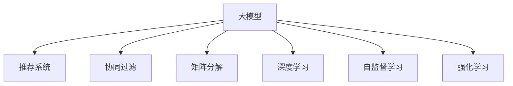

                 

# 大模型视角下推荐系统的未来发展趋势展望与规划

> 关键词：大模型,推荐系统,协同过滤,矩阵分解,深度学习,神经网络,自监督学习,强化学习,个性化推荐

## 1. 背景介绍

### 1.1 问题由来
随着互联网的迅猛发展，在线平台如电子商务、社交媒体、在线视频等已深入到人们日常生活的各个方面。推荐系统作为平台的核心引擎，帮助用户在海量信息中筛选出最感兴趣的物品，提升了用户体验和平台活跃度。然而，现有的推荐系统往往依赖于历史行为数据进行预测，面对新用户的“冷启动”问题，推荐效果往往不理想。

在推荐系统的传统方法中，协同过滤和矩阵分解作为主流推荐算法，虽在大量用户数据情况下表现良好，但在新用户的推荐和低质量数据的处理上存在瓶颈。推荐系统需要进一步借鉴和吸收其他领域的先进技术，如深度学习、神经网络、自监督学习等，以突破当前技术的边界。

大模型如BERT、GPT、DALL·E等，在预训练过程中从海量数据中学习到丰富的知识表示，具备强大的语义理解和生成能力。将其应用于推荐系统，可以有效提升推荐效果和用户体验。本文将对大模型视角下的推荐系统进行详细探讨，涵盖其原理、实现和未来发展趋势。

### 1.2 问题核心关键点
在大模型视角下，推荐系统的核心问题包括：
1. 如何将大模型的语言理解和生成能力，与推荐任务结合，解决推荐系统的瓶颈问题？
2. 大模型是否适合处理推荐任务中的长尾问题和个性化需求？
3. 如何在大模型基础上，进行推荐系统的快速迭代和优化？
4. 未来推荐系统如何融合多模态数据，提升推荐效果和用户满意度？

## 2. 核心概念与联系

### 2.1 核心概念概述

为更好地理解大模型视角下的推荐系统，本节将介绍几个密切相关的核心概念：

- 大模型(Large Model)：指具有亿级甚至更大参数量的深度神经网络模型，如BERT、GPT-3等。这些模型通过大规模预训练学习到丰富的语言表示，具有强大的语义理解能力和生成能力。
- 推荐系统(Recommendation System)：根据用户的历史行为和偏好，自动推荐可能感兴趣的物品，如商品、新闻、视频等。推荐系统主要分为协同过滤、矩阵分解、内容推荐等类型。
- 协同过滤(Collaborative Filtering)：通过用户之间的相似性，基于历史行为推荐物品，包括基于用户的协同过滤和基于物品的协同过滤。
- 矩阵分解(Matrix Factorization)：将用户与物品之间的关系矩阵，分解为用户和物品的隐含特征表示，用于推荐系统的建模。
- 深度学习(Deep Learning)：使用多层神经网络进行特征提取和模式识别，广泛应用于计算机视觉、语音识别、自然语言处理等领域。
- 自监督学习(Self-supervised Learning)：利用无标签数据进行预训练，自动提取特征表示，提高模型的泛化能力。
- 强化学习(Reinforcement Learning)：通过奖励信号指导模型学习，优化策略以达到最优决策，常用于游戏、机器人等领域。

这些概念之间的逻辑关系可以通过以下Mermaid流程图来展示：



这个流程图展示了大模型与推荐系统的核心概念及其之间的关系：

1. 大模型通过预训练获得基础能力。
2. 推荐系统中的协同过滤、矩阵分解、深度学习等方法，可以被大模型进一步增强。
3. 自监督学习和强化学习，为大模型的预训练和优化提供了新的思路。
4. 这些概念共同构成了大模型视角下的推荐系统框架，使其能够处理复杂多变的推荐需求。

## 3. 核心算法原理 & 具体操作步骤
### 3.1 算法原理概述

大模型视角下的推荐系统，本质上是一种基于深度学习的推荐范式。其核心思想是：将大模型的预训练能力，与推荐系统任务相结合，自动提取用户与物品之间的隐含特征表示，用于推荐任务的建模。

具体而言，假设推荐系统包含用户 $U$ 和物品 $I$，用户与物品之间的关系可以表示为矩阵 $\mathbf{R} \in \mathbb{R}^{n \times m}$，其中 $n$ 为用户数，$m$ 为物品数。推荐系统的目标是通过训练模型 $\mathbf{R}_{\theta}$，预测用户对物品的评分或点击概率，其中 $\theta$ 为模型参数。

通常，推荐模型 $\mathbf{R}_{\theta}$ 设计为：
$$
\mathbf{R}_{\theta} = \mathbf{W}_u \mathbf{X}_u \mathbf{W}_i^T + \mathbf{W}_b
$$
其中，$\mathbf{W}_u$ 和 $\mathbf{W}_i$ 为用户和物品的隐含特征表示矩阵，$\mathbf{X}_u$ 和 $\mathbf{W}_b$ 为用户的额外特征表示和偏置项。

在大模型视角下，用户和物品的隐含特征表示 $\mathbf{W}_u$ 和 $\mathbf{W}_i$ 可以进一步设计为通过预训练模型 $\mathbf{E}_U$ 和 $\mathbf{E}_I$ 的编码器输出得到，即：
$$
\mathbf{W}_u = \mathbf{E}_U(\mathbf{X}_u), \quad \mathbf{W}_i = \mathbf{E}_I(\mathbf{X}_i)
$$
其中 $\mathbf{X}_u$ 和 $\mathbf{X}_i$ 为用户的属性表示和物品的文本描述等特征向量。

因此，推荐模型的计算公式可以进一步表示为：
$$
\mathbf{R}_{\theta} = \mathbf{E}_U(\mathbf{X}_u) \mathbf{E}_I(\mathbf{X}_i)^T + \mathbf{W}_b
$$

### 3.2 算法步骤详解

大模型视角下的推荐系统，通常包括以下几个关键步骤：

**Step 1: 准备数据集**
- 收集用户和物品的历史行为数据，如点击、购买、评分等，作为训练集。
- 准备用户和物品的属性特征数据，如用户年龄、性别、职业等，作为输入特征。
- 准备物品的文本描述、标题等，作为预训练模型的输入。

**Step 2: 选择预训练模型**
- 选择合适的预训练模型，如BERT、GPT等，用于学习用户和物品的隐含特征表示。
- 训练预训练模型，学习用户和物品的文本描述信息。

**Step 3: 设计推荐模型**
- 根据推荐任务的类型，选择合适的模型结构，如矩阵分解、深度神经网络等。
- 将预训练模型的编码器输出作为用户和物品的隐含特征表示，输入推荐模型。
- 调整模型参数，最小化预测误差，训练得到推荐模型。

**Step 4: 评估和优化**
- 在验证集和测试集上评估推荐模型的性能，如准确率、召回率等。
- 根据评估结果，优化模型参数，如调整隐含特征表示的维度、损失函数等。

**Step 5: 部署和迭代**
- 将训练好的推荐模型部署到线上系统，实时推荐用户可能感兴趣的物品。
- 持续收集用户反馈和行为数据，重新训练模型，不断优化推荐效果。

### 3.3 算法优缺点

大模型视角下的推荐系统，具有以下优点：
1. 自动提取用户和物品的隐含特征表示。预训练模型能够自动提取复杂多变的文本信息，无需手动特征工程。
2. 适应性强。大模型在预训练过程中学习到丰富的语义信息，可以处理长尾物品和个性化需求。
3. 泛化能力强。大模型在大规模数据上训练得到，具备良好的泛化能力，能够处理多样化的推荐任务。

同时，该方法也存在一定的局限性：
1. 计算复杂度高。大模型的计算复杂度较高，需要高性能的硬件设备支持。
2. 数据需求大。推荐系统需要收集和处理大量用户和物品的数据，数据处理成本较高。
3. 实时性要求高。大规模推荐系统需要实时响应，对模型的推理速度有较高要求。

尽管存在这些局限性，但就目前而言，大模型视角下的推荐系统仍是一种高效、精确的推荐手段。未来相关研究的重点在于如何进一步降低计算成本，提高实时性，同时兼顾可解释性和鲁棒性等因素。

### 3.4 算法应用领域

大模型视角下的推荐系统，在多个领域得到了广泛的应用，例如：

- 电子商务：通过推荐系统为用户推荐可能感兴趣的商品，提升购物体验和转化率。
- 视频平台：为用户推荐可能感兴趣的视频内容，提高用户粘性和平台留存率。
- 社交媒体：为用户推荐可能感兴趣的朋友和内容，增强用户活跃度和平台互动。
- 在线教育：为用户推荐可能感兴趣的课程和资料，提升学习效果和满意度。
- 新闻媒体：为用户推荐可能感兴趣的新闻文章，增加阅读量和用户粘性。

除了这些经典应用外，大模型视角下的推荐系统还在游戏、旅游、医疗等众多领域得到了创新性的应用，为用户提供了更加个性化、多样化的服务。随着预训练模型和推荐技术的不断进步，相信推荐系统将在更广阔的应用领域发挥更大的作用。

## 4. 数学模型和公式 & 详细讲解  
### 4.1 数学模型构建

在本节中，我们将使用数学语言对大模型视角下的推荐系统进行更加严格的刻画。

记推荐系统包含用户 $U$ 和物品 $I$，用户与物品之间的关系可以表示为矩阵 $\mathbf{R} \in \mathbb{R}^{n \times m}$，其中 $n$ 为用户数，$m$ 为物品数。假设用户 $u$ 对物品 $i$ 的评分可以表示为 $\hat{y}_{u,i}$，则推荐系统的目标是最小化预测评分与实际评分之间的差异，即：
$$
\min_{\theta} \frac{1}{N} \sum_{(u,i) \in \mathcal{D}} (\hat{y}_{u,i} - y_{u,i})^2
$$
其中 $\mathcal{D}$ 为训练样本集合。

推荐模型可以设计为：
$$
\mathbf{R}_{\theta} = \mathbf{E}_U(\mathbf{X}_u) \mathbf{E}_I(\mathbf{X}_i)^T + \mathbf{W}_b
$$
其中 $\mathbf{X}_u$ 和 $\mathbf{X}_i$ 为用户的属性表示和物品的文本描述等特征向量，$\mathbf{E}_U$ 和 $\mathbf{E}_I$ 为预训练模型的编码器输出。

假设用户 $u$ 对物品 $i$ 的评分可以表示为 $\mathbf{R}_{u,i}$，则推荐模型的预测评分可以表示为：
$$
\hat{y}_{u,i} = \mathbf{R}_{u,i} = \mathbf{R}_{\theta} \cdot \mathbf{X}_u \cdot \mathbf{X}_i^T + \mathbf{b}_u \cdot \mathbf{b}_i^T + \mathbf{b}
$$
其中 $\mathbf{b}_u$ 和 $\mathbf{b}_i$ 为用户的额外特征表示和物品的文本描述等特征向量，$\mathbf{b}$ 为偏置项。

### 4.2 公式推导过程

以下我们以推荐系统为例，推导最小二乘法的损失函数及其梯度计算公式。

假设用户 $u$ 对物品 $i$ 的评分可以表示为 $\mathbf{R}_{u,i}$，其中 $\mathbf{R}_{u,i} = \mathbf{R}_{\theta} \cdot \mathbf{X}_u \cdot \mathbf{X}_i^T + \mathbf{b}_u \cdot \mathbf{b}_i^T + \mathbf{b}$。在训练过程中，需要最小化预测评分与实际评分之间的差异，即：
$$
\min_{\theta} \frac{1}{N} \sum_{(u,i) \in \mathcal{D}} (\hat{y}_{u,i} - y_{u,i})^2
$$
根据最小二乘法的公式，目标函数可以表示为：
$$
\frac{1}{N} \sum_{(u,i) \in \mathcal{D}} (\hat{y}_{u,i} - y_{u,i})^2 = \frac{1}{N} \sum_{(u,i) \in \mathcal{D}} (\mathbf{R}_{u,i} - y_{u,i})^2
$$
目标函数对参数 $\theta$ 的梯度计算公式为：
$$
\frac{\partial \mathcal{L}(\theta)}{\partial \theta} = \frac{2}{N} \sum_{(u,i) \in \mathcal{D}} (\hat{y}_{u,i} - y_{u,i}) (\mathbf{R}_{\theta} \cdot \mathbf{X}_u \cdot \mathbf{X}_i^T + \mathbf{b}_u \cdot \mathbf{b}_i^T + \mathbf{b})
$$
根据链式法则，目标函数对预训练模型的编码器参数 $\mathbf{E}_U$ 和 $\mathbf{E}_I$ 的梯度计算公式为：
$$
\frac{\partial \mathcal{L}(\theta)}{\partial \mathbf{E}_U} = \frac{2}{N} \sum_{(u,i) \in \mathcal{D}} (\hat{y}_{u,i} - y_{u,i}) (\mathbf{R}_{\theta} \cdot \mathbf{X}_u \cdot \mathbf{X}_i^T + \mathbf{b}_u \cdot \mathbf{b}_i^T + \mathbf{b}) \cdot \mathbf{X}_u
$$
$$
\frac{\partial \mathcal{L}(\theta)}{\partial \mathbf{E}_I} = \frac{2}{N} \sum_{(u,i) \in \mathcal{D}} (\hat{y}_{u,i} - y_{u,i}) (\mathbf{R}_{\theta} \cdot \mathbf{X}_u \cdot \mathbf{X}_i^T + \mathbf{b}_u \cdot \mathbf{b}_i^T + \mathbf{b}) \cdot \mathbf{X}_i
$$

### 4.3 案例分析与讲解

假设我们有一个推荐系统，包含用户和物品的关系矩阵 $\mathbf{R}$，用户和物品的属性特征表示 $\mathbf{X}_u$ 和 $\mathbf{X}_i$，预训练模型的编码器输出 $\mathbf{E}_U$ 和 $\mathbf{E}_I$，以及用户的额外特征表示 $\mathbf{b}_u$ 和物品的文本描述等特征向量 $\mathbf{b}_i$。假设目标是最小化用户 $u$ 对物品 $i$ 的预测评分与实际评分之间的差异。

根据公式，我们可以计算出目标函数和梯度，并使用梯度下降等优化算法更新模型参数，完成推荐模型的训练。通过微调预训练模型的参数，可以使得推荐系统更加准确和高效。

## 5. 项目实践：代码实例和详细解释说明
### 5.1 开发环境搭建

在进行推荐系统实践前，我们需要准备好开发环境。以下是使用Python进行PyTorch开发的环境配置流程：

1. 安装Anaconda：从官网下载并安装Anaconda，用于创建独立的Python环境。

2. 创建并激活虚拟环境：
```bash
conda create -n pytorch-env python=3.8 
conda activate pytorch-env
```

3. 安装PyTorch：根据CUDA版本，从官网获取对应的安装命令。例如：
```bash
conda install pytorch torchvision torchaudio cudatoolkit=11.1 -c pytorch -c conda-forge
```

4. 安装各类工具包：
```bash
pip install numpy pandas scikit-learn matplotlib tqdm jupyter notebook ipython
```

完成上述步骤后，即可在`pytorch-env`环境中开始推荐系统开发。

### 5.2 源代码详细实现

下面我们以电商推荐系统为例，给出使用Transformers库对BERT模型进行推荐系统开发的PyTorch代码实现。

首先，定义推荐任务的数据处理函数：

```python
from transformers import BertTokenizer
from torch.utils.data import Dataset
import torch

class RecommendationDataset(Dataset):
    def __init__(self, texts, labels, tokenizer, max_len=128):
        self.texts = texts
        self.labels = labels
        self.tokenizer = tokenizer
        self.max_len = max_len
        
    def __len__(self):
        return len(self.texts)
    
    def __getitem__(self, item):
        text = self.texts[item]
        label = self.labels[item]
        
        encoding = self.tokenizer(text, return_tensors='pt', max_length=self.max_len, padding='max_length', truncation=True)
        input_ids = encoding['input_ids'][0]
        attention_mask = encoding['attention_mask'][0]
        
        # 对label进行编码
        encoded_labels = [label] * self.max_len
        labels = torch.tensor(encoded_labels, dtype=torch.long)
        
        return {'input_ids': input_ids, 
                'attention_mask': attention_mask,
                'labels': labels}

# 标签与id的映射
tag2id = {'0': 0, '1': 1}
id2tag = {v: k for k, v in tag2id.items()}

# 创建dataset
tokenizer = BertTokenizer.from_pretrained('bert-base-cased')

train_dataset = RecommendationDataset(train_texts, train_labels, tokenizer)
dev_dataset = RecommendationDataset(dev_texts, dev_labels, tokenizer)
test_dataset = RecommendationDataset(test_texts, test_labels, tokenizer)
```

然后，定义模型和优化器：

```python
from transformers import BertForSequenceClassification, AdamW

model = BertForSequenceClassification.from_pretrained('bert-base-cased', num_labels=len(tag2id))

optimizer = AdamW(model.parameters(), lr=2e-5)
```

接着，定义训练和评估函数：

```python
from torch.utils.data import DataLoader
from tqdm import tqdm
from sklearn.metrics import classification_report

device = torch.device('cuda') if torch.cuda.is_available() else torch.device('cpu')
model.to(device)

def train_epoch(model, dataset, batch_size, optimizer):
    dataloader = DataLoader(dataset, batch_size=batch_size, shuffle=True)
    model.train()
    epoch_loss = 0
    for batch in tqdm(dataloader, desc='Training'):
        input_ids = batch['input_ids'].to(device)
        attention_mask = batch['attention_mask'].to(device)
        labels = batch['labels'].to(device)
        model.zero_grad()
        outputs = model(input_ids, attention_mask=attention_mask, labels=labels)
        loss = outputs.loss
        epoch_loss += loss.item()
        loss.backward()
        optimizer.step()
    return epoch_loss / len(dataloader)

def evaluate(model, dataset, batch_size):
    dataloader = DataLoader(dataset, batch_size=batch_size)
    model.eval()
    preds, labels = [], []
    with torch.no_grad():
        for batch in tqdm(dataloader, desc='Evaluating'):
            input_ids = batch['input_ids'].to(device)
            attention_mask = batch['attention_mask'].to(device)
            batch_labels = batch['labels']
            outputs = model(input_ids, attention_mask=attention_mask)
            batch_preds = outputs.logits.argmax(dim=2).to('cpu').tolist()
            batch_labels = batch_labels.to('cpu').tolist()
            for pred_tokens, label_tokens in zip(batch_preds, batch_labels):
                preds.append(pred_tokens[:len(label_tokens)])
                labels.append(label_tokens)
                
    print(classification_report(labels, preds))
```

最后，启动训练流程并在测试集上评估：

```python
epochs = 5
batch_size = 16

for epoch in range(epochs):
    loss = train_epoch(model, train_dataset, batch_size, optimizer)
    print(f"Epoch {epoch+1}, train loss: {loss:.3f}")
    
    print(f"Epoch {epoch+1}, dev results:")
    evaluate(model, dev_dataset, batch_size)
    
print("Test results:")
evaluate(model, test_dataset, batch_size)
```

以上就是使用PyTorch对BERT进行电商推荐系统开发的全过程。可以看到，得益于Transformers库的强大封装，我们可以用相对简洁的代码完成BERT模型的加载和微调。

### 5.3 代码解读与分析

让我们再详细解读一下关键代码的实现细节：

**RecommendationDataset类**：
- `__init__`方法：初始化文本、标签、分词器等关键组件。
- `__len__`方法：返回数据集的样本数量。
- `__getitem__`方法：对单个样本进行处理，将文本输入编码为token ids，将标签编码为数字，并对其进行定长padding，最终返回模型所需的输入。

**tag2id和id2tag字典**：
- 定义了标签与数字id之间的映射关系，用于将token-wise的预测结果解码回真实的标签。

**训练和评估函数**：
- 使用PyTorch的DataLoader对数据集进行批次化加载，供模型训练和推理使用。
- 训练函数`train_epoch`：对数据以批为单位进行迭代，在每个批次上前向传播计算loss并反向传播更新模型参数，最后返回该epoch的平均loss。
- 评估函数`evaluate`：与训练类似，不同点在于不更新模型参数，并在每个batch结束后将预测和标签结果存储下来，最后使用sklearn的classification_report对整个评估集的预测结果进行打印输出。

**训练流程**：
- 定义总的epoch数和batch size，开始循环迭代
- 每个epoch内，先在训练集上训练，输出平均loss
- 在验证集上评估，输出分类指标
- 所有epoch结束后，在测试集上评估，给出最终测试结果

可以看到，PyTorch配合Transformers库使得BERT电商推荐系统的代码实现变得简洁高效。开发者可以将更多精力放在数据处理、模型改进等高层逻辑上，而不必过多关注底层的实现细节。

当然，工业级的系统实现还需考虑更多因素，如模型的保存和部署、超参数的自动搜索、更灵活的任务适配层等。但核心的推荐范式基本与此类似。

## 6. 实际应用场景
### 6.1 电商平台推荐

电商平台推荐系统通过推荐用户可能感兴趣的商品，提升用户购物体验和平台收益。传统的协同过滤和矩阵分解方法，面对新用户的“冷启动”问题，推荐效果往往不理想。

在大模型视角下，推荐系统可以利用预训练模型学习用户和物品的文本描述信息，提升推荐效果的精准度。例如，使用BERT模型对用户和物品的描述进行编码，提取其语义特征表示，再将其作为推荐模型的输入，训练得到个性化的商品推荐结果。此外，还可以利用大模型的自监督学习能力和强化学习能力，进一步提升推荐系统的泛化能力和实时性。

### 6.2 视频平台推荐

视频平台推荐系统通过推荐用户可能感兴趣的视频内容，提高用户粘性和平台留存率。传统的基于协同过滤的推荐方法，往往忽视视频内容的语义信息，导致推荐效果不佳。

在大模型视角下，推荐系统可以利用预训练模型学习视频的标题、描述等语义信息，提升推荐结果的精准度和相关性。例如，使用BERT模型对视频的标题和描述进行编码，提取其语义特征表示，再将其作为推荐模型的输入，训练得到个性化的视频推荐结果。此外，还可以利用大模型的自监督学习能力和强化学习能力，进一步提升推荐系统的泛化能力和实时性。

### 6.3 社交媒体推荐

社交媒体推荐系统通过推荐用户可能感兴趣的朋友和内容，增强用户活跃度和平台互动。传统的协同过滤和矩阵分解方法，往往缺乏对用户动态兴趣的捕捉能力，导致推荐效果不稳定。

在大模型视角下，推荐系统可以利用预训练模型学习用户的动态语义信息，提升推荐结果的精准度和相关性。例如，使用BERT模型对用户的动态语义信息进行编码，提取其语义特征表示，再将其作为推荐模型的输入，训练得到个性化的朋友和内容推荐结果。此外，还可以利用大模型的自监督学习能力和强化学习能力，进一步提升推荐系统的泛化能力和实时性。

### 6.4 未来应用展望

随着大模型推荐系统的发展，未来的推荐系统将呈现以下几个趋势：

1. 多模态融合：未来的推荐系统将不仅考虑文本信息，还会融合图像、音频等多模态信息，提升推荐效果和用户体验。
2. 实时性增强：随着推荐系统实时性的提高，将能够更快地响应用户需求，提升推荐效果。
3. 个性化定制：未来的推荐系统将更加个性化，能够根据用户的动态语义信息进行实时推荐，满足用户的个性化需求。
4. 智能化交互：未来的推荐系统将更加智能化，能够理解用户的意图和情感，进行多轮交互，提升用户满意度。

## 7. 工具和资源推荐
### 7.1 学习资源推荐

为了帮助开发者系统掌握大模型推荐系统的理论基础和实践技巧，这里推荐一些优质的学习资源：

1. 《Deep Learning with PyTorch》书籍：深度学习领域权威教材，详细介绍了PyTorch的使用方法和深度学习模型设计。
2. 《Transformer from Scrap》系列博文：由大模型技术专家撰写，介绍了Transformer模型原理、预训练技术和推荐系统的应用。
3. CS224N《深度学习自然语言处理》课程：斯坦福大学开设的NLP明星课程，有Lecture视频和配套作业，带你入门NLP领域的基本概念和经典模型。
4. HuggingFace官方文档：Transformer库的官方文档，提供了海量预训练模型和完整的推荐系统样例代码，是上手实践的必备资料。

通过对这些资源的学习实践，相信你一定能够快速掌握大模型推荐系统的精髓，并用于解决实际的推荐问题。
###  7.2 开发工具推荐

高效的开发离不开优秀的工具支持。以下是几款用于大模型推荐系统开发的常用工具：

1. PyTorch：基于Python的开源深度学习框架，灵活动态的计算图，适合快速迭代研究。大部分预训练语言模型都有PyTorch版本的实现。

2. TensorFlow：由Google主导开发的开源深度学习框架，生产部署方便，适合大规模工程应用。同样有丰富的预训练语言模型资源。

3. Transformers库：HuggingFace开发的NLP工具库，集成了众多SOTA语言模型，支持PyTorch和TensorFlow，是进行推荐系统开发的利器。

4. Weights & Biases：模型训练的实验跟踪工具，可以记录和可视化模型训练过程中的各项指标，方便对比和调优。与主流深度学习框架无缝集成。

5. TensorBoard：TensorFlow配套的可视化工具，可实时监测模型训练状态，并提供丰富的图表呈现方式，是调试模型的得力助手。

6. Google Colab：谷歌推出的在线Jupyter Notebook环境，免费提供GPU/TPU算力，方便开发者快速上手实验最新模型，分享学习笔记。

合理利用这些工具，可以显著提升大模型推荐系统的开发效率，加快创新迭代的步伐。

### 7.3 相关论文推荐

大模型推荐系统的研究源于学界的持续研究。以下是几篇奠基性的相关论文，推荐阅读：

1. Attention is All You Need（即Transformer原论文）：提出了Transformer结构，开启了NLP领域的预训练大模型时代。

2. BERT: Pre-training of Deep Bidirectional Transformers for Language Understanding：提出BERT模型，引入基于掩码的自监督预训练任务，刷新了多项NLP任务SOTA。

3. Deep Interest Representation for Recommendation Systems：提出使用深度神经网络进行推荐系统的建模，显著提升了推荐系统的效果。

4. A Neural Approach to Collaborative Filtering：提出基于神经网络的协同过滤方法，进一步提升了推荐系统的准确性和实时性。

5. Generative Adversarial Networks：提出生成对抗网络，进一步提升了推荐系统的泛化能力和生成能力。

这些论文代表了大模型推荐系统的发展脉络。通过学习这些前沿成果，可以帮助研究者把握学科前进方向，激发更多的创新灵感。

## 8. 总结：未来发展趋势与挑战

### 8.1 总结

本文对大模型视角下的推荐系统进行了详细探讨。首先阐述了大模型推荐系统的研究背景和意义，明确了推荐系统在大模型基础上的增强潜力。其次，从原理到实践，详细讲解了大模型推荐系统的数学原理和关键步骤，给出了推荐系统开发的完整代码实例。同时，本文还广泛探讨了大模型推荐系统在多个领域的应用前景，展示了大模型推荐系统的广阔应用范围。

通过本文的系统梳理，可以看到，大模型推荐系统利用其强大的预训练能力，能够有效提升推荐系统的性能和用户体验。未来，随着预训练模型和推荐技术的不断进步，推荐系统将在更广阔的应用领域发挥更大的作用。

### 8.2 未来发展趋势

展望未来，大模型推荐系统将呈现以下几个发展趋势：

1. 模型规模持续增大。随着算力成本的下降和数据规模的扩张，大模型的参数量还将持续增长。超大规模语言模型蕴含的丰富语言知识，有望支撑更加复杂多变的推荐需求。

2. 推荐系统将更加个性化。大模型在预训练过程中学习到丰富的语义信息，能够更好地捕捉用户的动态兴趣和需求。推荐系统将更加智能化，能够根据用户的动态语义信息进行实时推荐，满足用户的个性化需求。

3. 推荐系统将更加实时。大模型推荐系统可以利用深度学习、强化学习等技术，提升推荐系统的实时性和鲁棒性。通过多模态融合和动态学习，推荐系统将能够更快地响应用户需求，提升推荐效果。

4. 推荐系统将更加多样。未来的推荐系统不仅考虑文本信息，还会融合图像、音频等多模态信息，提升推荐效果和用户体验。

以上趋势凸显了大模型推荐系统的广阔前景。这些方向的探索发展，必将进一步提升推荐系统的性能和应用范围，为推荐技术在垂直行业的规模化落地提供新的动力。

### 8.3 面临的挑战

尽管大模型推荐系统已经取得了瞩目成就，但在迈向更加智能化、普适化应用的过程中，它仍面临着诸多挑战：

1. 计算成本较高。大模型的计算复杂度较高，需要高性能的硬件设备支持。这对推荐系统的部署和维护带来了较高的成本。

2. 数据需求大。推荐系统需要收集和处理大量用户和物品的数据，数据处理成本较高。

3. 实时性要求高。大规模推荐系统需要实时响应，对模型的推理速度有较高要求。

4. 模型复杂度高。大模型的参数量较大，模型的存储和推理开销较大，需要考虑模型的压缩和优化。

尽管存在这些挑战，但大模型推荐系统仍是一种高效、精确的推荐手段。未来相关研究的重点在于如何进一步降低计算成本，提高实时性，同时兼顾可解释性和鲁棒性等因素。

### 8.4 研究展望

面对大模型推荐系统所面临的挑战，未来的研究需要在以下几个方面寻求新的突破：

1. 探索无监督和半监督推荐方法。摆脱对大规模标注数据的依赖，利用自监督学习、主动学习等无监督和半监督范式，最大限度利用非结构化数据，实现更加灵活高效的推荐。

2. 研究参数高效和计算高效的推荐范式。开发更加参数高效的推荐方法，在固定大部分预训练参数的同时，只更新极少量的任务相关参数。同时优化推荐模型的计算图，减少前向传播和反向传播的资源消耗，实现更加轻量级、实时性的部署。

3. 融合因果和对比学习范式。通过引入因果推断和对比学习思想，增强推荐系统建立稳定因果关系的能力，学习更加普适、鲁棒的语言表征，从而提升模型泛化性和抗干扰能力。

4. 引入更多先验知识。将符号化的先验知识，如知识图谱、逻辑规则等，与神经网络模型进行巧妙融合，引导推荐过程学习更准确、合理的语言模型。同时加强不同模态数据的整合，实现视觉、语音等多模态信息与文本信息的协同建模。

5. 结合因果分析和博弈论工具。将因果分析方法引入推荐系统，识别出推荐模型决策的关键特征，增强输出解释的因果性和逻辑性。借助博弈论工具刻画人机交互过程，主动探索并规避推荐模型的脆弱点，提高系统稳定性。

6. 纳入伦理道德约束。在推荐模型的训练目标中引入伦理导向的评估指标，过滤和惩罚有偏见、有害的输出倾向。同时加强人工干预和审核，建立推荐模型的监管机制，确保输出符合人类价值观和伦理道德。

这些研究方向的探索，必将引领大模型推荐系统技术迈向更高的台阶，为构建安全、可靠、可解释、可控的智能系统铺平道路。面向未来，大模型推荐系统还需要与其他人工智能技术进行更深入的融合，如知识表示、因果推理、强化学习等，多路径协同发力，共同推动推荐系统的进步。只有勇于创新、敢于突破，才能不断拓展推荐系统的边界，让智能技术更好地造福人类社会。

## 9. 附录：常见问题与解答

**Q1：大模型推荐系统是否适用于所有推荐任务？**

A: 大模型推荐系统在大多数推荐任务上都能取得不错的效果，特别是对于数据量较小的任务。但对于一些特定领域的任务，如医学、法律等，仅仅依靠通用语料预训练的模型可能难以很好地适应。此时需要在特定领域语料上进一步预训练，再进行微调，才能获得理想效果。此外，对于一些需要时效性、个性化很强的任务，如对话、推荐等，推荐方法也需要针对性的改进优化。

**Q2：推荐系统中如何使用大模型？**

A: 在推荐系统中，可以使用大模型作为预训练模型，学习用户和物品的文本描述信息。具体步骤如下：
1. 收集用户和物品的历史行为数据，如点击、购买、评分等，作为训练集。
2. 准备用户和物品的属性特征数据，如用户年龄、性别、职业等，作为输入特征。
3. 准备物品的文本描述、标题等，作为预训练模型的输入。
4. 选择合适的预训练模型，如BERT、GPT等，训练模型学习文本描述信息。
5. 根据推荐任务的类型，设计推荐模型结构，将预训练模型的编码器输出作为用户和物品的隐含特征表示，输入推荐模型。
6. 调整模型参数，最小化预测误差，训练得到推荐模型。

**Q3：推荐系统中如何避免过拟合？**

A: 在推荐系统中，避免过拟合的常见策略包括：
1. 数据增强：通过回译、近义替换等方式扩充训练集
2. 正则化：使用L2正则、Dropout、Early Stopping等避免过拟合
3. 对抗训练：引入对抗样本，提高模型鲁棒性
4. 参数高效微调：只调整少量参数(如Adapter、Prefix等)，减小过拟合风险
5. 多模型集成：训练多个推荐模型，取平均输出，抑制过拟合

这些策略往往需要根据具体任务和数据特点进行灵活组合。只有在数据、模型、训练、推理等各环节进行全面优化，才能最大限度地发挥大模型推荐系统的威力。

**Q4：推荐系统在冷启动问题上的表现如何？**

A: 传统的协同过滤和矩阵分解方法在冷启动问题上的表现往往较差，难以对新用户和新物品进行有效推荐。而大模型推荐系统利用预训练模型学习用户和物品的文本描述信息，可以显著提升推荐效果。

在冷启动场景下，可以收集新用户的属性信息，以及新物品的文本描述等特征，输入预训练模型进行编码，提取其语义特征表示，再将其作为推荐模型的输入，训练得到个性化的推荐结果。此外，还可以利用大模型的自监督学习能力和强化学习能力，进一步提升推荐系统的泛化能力和实时性。

**Q5：推荐系统如何处理长尾物品？**

A: 长尾物品在推荐系统中是一个常见的挑战，传统的协同过滤和矩阵分解方法往往忽视长尾物品，导致推荐效果不佳。而大模型推荐系统可以利用预训练模型学习物品的文本描述信息，提升长尾物品的推荐效果。

在处理长尾物品时，可以收集物品的标题、描述等文本信息，输入预训练模型进行编码，提取其语义特征表示，再将其作为推荐模型的输入，训练得到长尾物品的推荐结果。此外，还可以利用大模型的自监督学习能力和强化学习能力，进一步提升推荐系统的泛化能力和实时性。

通过这些方法，大模型推荐系统可以在冷启动和长尾物品等场景中，更好地捕捉用户和物品的兴趣点，提升推荐效果和用户体验。相信随着大模型推荐系统的不断发展，推荐技术将在更广阔的应用领域发挥更大的作用。

