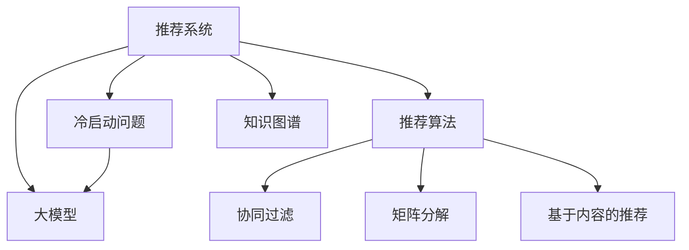

                 

## 1. 背景介绍

推荐系统是互联网时代为用户精准推荐个性化内容的关键技术。从电商网站到视频平台，从新闻阅读到社交网络，推荐系统已渗透到几乎所有与内容相关的应用中。然而，对于新用户（即冷启动用户）的推荐，传统的推荐算法往往面临诸多挑战：

- **缺乏用户历史数据**：冷启动用户没有过往行为记录，传统协同过滤、内容推荐等算法无法直接应用。
- **模型泛化性差**：新用户的偏好和行为模式与已有用户截然不同，传统模型难以适应。
- **计算开销大**：需要与所有现有用户进行相似度计算，计算复杂度高，系统响应慢。

## 2. 核心概念与联系

### 2.1 核心概念概述

在解决推荐系统冷启动问题时，大模型辅助方法因其强大的泛化能力和自适应性，逐步成为主流。以下是几个核心概念的介绍：

- **推荐系统(Recommendation System)**：利用用户和物品的特征，通过算法为用户推荐其可能感兴趣的内容。
- **冷启动问题(Cold-Start Problem)**：推荐系统为新用户或新物品提供推荐时的数据缺乏问题。
- **大模型(Large Model)**：如GPT、BERT等预训练语言模型，具有强大的泛化能力和自适应性。
- **推荐算法(Recommendation Algorithm)**：包括基于内容的推荐、协同过滤、矩阵分解等算法，用于处理推荐问题。
- **知识图谱(Knowledge Graph)**：由节点（实体）和边（关系）构成的大型知识网络，用于提供领域知识支持。

这些概念之间的联系通过以下Mermaid流程图进行展示：



此图展示了推荐系统通过大模型和推荐算法解决冷启动问题的核心思路。通过大模型辅助，冷启动问题得以缓解，从而使得推荐系统对新用户的推荐更加准确和个性化。

### 2.2 核心概念原理和架构

大模型辅助的推荐系统通常包含以下步骤：

1. **预训练大模型的引入**：通过在大规模语料库上预训练大模型，学习广泛的领域知识。
2. **知识图谱的构建**：在领域知识的基础上，构建知识图谱，进一步提供结构化信息支持。
3. **推荐模型的微调**：在知识图谱和大模型的辅助下，对推荐模型进行微调，增强其对新用户的适应能力。
4. **推荐结果生成**：在微调的推荐模型上，生成推荐结果，为用户推荐个性化内容。

以下是核心概念的原理和架构解释：

- **预训练大模型**：如GPT、BERT等模型，通过在通用语料库上进行预训练，学习到广泛的语言和知识表示。这些模型可以自适应新用户的语言和知识背景，提高推荐准确性。
- **知识图谱**：通过构建领域知识图谱，将领域内的实体、关系等结构化信息与用户和物品关联，帮助模型理解复杂概念和关系。
- **推荐模型微调**：通过在大模型和知识图谱的基础上，微调推荐模型，使其能够更好地适应新用户的特征和偏好。

## 3. 核心算法原理 & 具体操作步骤

### 3.1 算法原理概述

大模型辅助的推荐系统算法通常基于以下基本原理：

1. **大模型的语义表示学习**：通过预训练大模型，学习到丰富的语义表示。这些表示可以用于对新用户的语言和知识背景建模，从而提高推荐准确性。
2. **知识图谱的融合**：将知识图谱中的实体和关系信息与大模型的表示进行融合，增强推荐模型的理解能力。
3. **推荐模型的微调**：在融合知识图谱和大模型的表示后，微调推荐模型，使其能够适应新用户的特征和偏好。
4. **多模态融合**：通过融合文本、图像、视频等多模态信息，提升推荐系统的泛化能力和个性化水平。

### 3.2 算法步骤详解

以电商推荐系统为例，大模型辅助的推荐系统算法步骤如下：

1. **用户画像构建**：利用大模型对用户进行多维度的画像构建，包括语言、兴趣、行为等特征。
2. **商品画像构建**：利用大模型对商品进行详细描述，包括文字、图片、视频等。
3. **知识图谱构建**：根据商品和大模型的描述，构建商品的知识图谱，包含商品的属性、类别、关系等信息。
4. **推荐模型微调**：将大模型和知识图谱融合后的表示输入推荐模型，进行微调，以适应新用户和新商品的特征。
5. **推荐结果生成**：利用微调后的推荐模型，生成推荐结果，包括商品排名、相似度等。

具体步骤如下：

- **用户画像构建**：
  1. 收集用户的多媒体数据（如评论、浏览记录等）。
  2. 利用BERT等大模型，对用户数据进行表示学习，得到用户的多维特征向量。
  3. 将用户的多维特征向量作为输入，训练推荐模型，生成用户画像。

- **商品画像构建**：
  1. 收集商品的多媒体数据（如图片、描述等）。
  2. 利用BERT等大模型，对商品数据进行表示学习，得到商品的多维特征向量。
  3. 将商品的多维特征向量作为输入，训练推荐模型，生成商品画像。

- **知识图谱构建**：
  1. 利用知识图谱工具，如Neo4j，构建商品的知识图谱，包含商品的属性、类别、关系等信息。
  2. 将商品的多维特征向量作为输入，训练推荐模型，生成商品的知识图谱表示。

- **推荐模型微调**：
  1. 将用户画像、商品画像、知识图谱表示融合后，输入推荐模型。
  2. 利用用户的新行为数据，微调推荐模型，使其能够适应新用户的特征和偏好。

- **推荐结果生成**：
  1. 利用微调后的推荐模型，生成推荐结果，包括商品排名、相似度等。
  2. 将推荐结果展示给用户，供其选择。

### 3.3 算法优缺点

**优点**：

1. **泛化能力强**：大模型辅助的推荐系统可以自适应新用户和新商品的特征，具有较强的泛化能力。
2. **个性化高**：通过知识图谱和大模型的融合，推荐系统能够提供更加个性化和准确的推荐结果。
3. **计算效率高**：知识图谱和预训练大模型的引入，可以显著减少推荐模型的计算开销。

**缺点**：

1. **计算资源消耗大**：大模型和知识图谱的构建和维护需要大量的计算资源和时间。
2. **数据隐私问题**：利用用户的多媒体数据进行大模型训练，可能会涉及到用户隐私问题。
3. **模型复杂度高**：融合大模型和知识图谱后，推荐模型的复杂度增加，维护难度加大。

### 3.4 算法应用领域

大模型辅助的推荐系统已经在多个领域得到广泛应用，例如：

- **电商推荐**：如淘宝、京东等电商平台，通过大模型和知识图谱，提供个性化商品推荐。
- **视频推荐**：如YouTube、Netflix等视频平台，通过大模型和知识图谱，推荐用户感兴趣的视频内容。
- **新闻推荐**：如今日头条、腾讯新闻等新闻应用，通过大模型和知识图谱，推荐相关新闻内容。
- **社交推荐**：如微信、微博等社交平台，通过大模型和知识图谱，推荐用户感兴趣的朋友和内容。

## 4. 数学模型和公式 & 详细讲解 & 举例说明

### 4.1 数学模型构建

大模型辅助的推荐系统通常包括用户画像、商品画像、知识图谱表示等多个模块。这里以电商推荐系统为例，构建数学模型：

- **用户画像构建**：
  $$
  u = f_\text{user}(x)
  $$
  其中，$x$ 为用户的多媒体数据，$f_\text{user}$ 为用户画像构建函数。

- **商品画像构建**：
  $$
  p = f_\text{product}(y)
  $$
  其中，$y$ 为商品的多媒体数据，$f_\text{product}$ 为商品画像构建函数。

- **知识图谱表示**：
  $$
  k = g_\text{kg}(z)
  $$
  其中，$z$ 为知识图谱数据，$g_\text{kg}$ 为知识图谱表示函数。

### 4.2 公式推导过程

以电商推荐系统为例，假设用户画像和商品画像的表示分别为 $u$ 和 $p$，知识图谱表示为 $k$，推荐模型为 $M$。

1. **用户画像构建**：
  - 假设用户的多媒体数据为 $x$，用户画像表示为 $u$，则 $u = f_\text{user}(x)$。
  - 假设 $x$ 为文本数据，则 $u$ 表示为 $x$ 的BERT表示。

2. **商品画像构建**：
  - 假设商品的多媒体数据为 $y$，商品画像表示为 $p$，则 $p = f_\text{product}(y)$。
  - 假设 $y$ 为文本数据，则 $p$ 表示为 $y$ 的BERT表示。

3. **知识图谱表示**：
  - 假设知识图谱数据为 $z$，知识图谱表示为 $k$，则 $k = g_\text{kg}(z)$。
  - 假设 $z$ 为实体-关系-实体三元组，则 $k$ 表示为 $z$ 的向量表示。

4. **推荐模型微调**：
  - 将用户画像 $u$、商品画像 $p$ 和知识图谱表示 $k$ 融合后，输入推荐模型 $M$，进行微调。
  - 假设融合后的表示为 $X = [u, p, k]$，推荐模型表示为 $M$，则 $M$ 的微调目标函数为：
    $$
    \min_{M} \frac{1}{N} \sum_{i=1}^N \ell(M(u_i, p_i), y_i)
    $$
    其中，$\ell$ 为损失函数，$y_i$ 为用户 $i$ 的实际行为数据。

### 4.3 案例分析与讲解

以推荐系统的CF和KNN算法为例，分析大模型辅助下的改进：

1. **协同过滤(CF)算法**：
  - 传统CF算法依赖用户和物品的相似度计算，无法处理冷启动用户和物品。
  - 大模型辅助的CF算法，通过预训练大模型和知识图谱，可以自动学习用户和物品的相似度，缓解冷启动问题。
  - 具体来说，可以将用户画像 $u$ 和商品画像 $p$ 进行余弦相似度计算，得到用户与物品的相似度。

2. **K近邻(KNN)算法**：
  - 传统KNN算法依赖全局相似度计算，无法处理局部相似度。
  - 大模型辅助的KNN算法，通过融合知识图谱，可以增强局部相似度的计算能力。
  - 具体来说，可以将用户画像 $u$ 和商品画像 $p$ 与知识图谱表示 $k$ 进行拼接，再输入推荐模型 $M$，进行微调。

## 5. 项目实践：代码实例和详细解释说明

### 5.1 开发环境搭建

在进行大模型辅助的推荐系统开发前，我们需要准备好开发环境。以下是使用Python进行PyTorch开发的环境配置流程：

1. 安装Anaconda：从官网下载并安装Anaconda，用于创建独立的Python环境。

2. 创建并激活虚拟环境：
```bash
conda create -n pytorch-env python=3.8 
conda activate pytorch-env
```

3. 安装PyTorch：根据CUDA版本，从官网获取对应的安装命令。例如：
```bash
conda install pytorch torchvision torchaudio cudatoolkit=11.1 -c pytorch -c conda-forge
```

4. 安装Transformers库：
```bash
pip install transformers
```

5. 安装各类工具包：
```bash
pip install numpy pandas scikit-learn matplotlib tqdm jupyter notebook ipython
```

完成上述步骤后，即可在`pytorch-env`环境中开始推荐系统开发。

### 5.2 源代码详细实现

下面以电商推荐系统为例，给出使用Transformers库对商品画像构建和推荐模型微调的PyTorch代码实现。

首先，定义商品画像构建函数：

```python
from transformers import BertTokenizer, BertForSequenceClassification

def product_profile_builder(product_text, model_name='bert-base-cased'):
    tokenizer = BertTokenizer.from_pretrained(model_name)
    inputs = tokenizer(product_text, return_tensors='pt', padding='max_length', truncation=True)
    product_embedding = BertForSequenceClassification(model_name, num_labels=1).inputs
    product_features = model(product_embedding)[0]
    return product_features
```

然后，定义推荐模型微调函数：

```python
from transformers import AdamW, get_linear_schedule_with_warmup

def recommendation_model_fine_tuning(data_loader, model, optimizer, scheduler):
    model.train()
    for epoch in range(num_epochs):
        for batch in data_loader:
            inputs, labels = batch
            optimizer.zero_grad()
            outputs = model(inputs, labels=labels)
            loss = outputs.loss
            loss.backward()
            optimizer.step()
            scheduler.step()
```

最后，启动推荐系统微调流程：

```python
num_epochs = 5
batch_size = 16

# 数据准备
train_dataset = ...
dev_dataset = ...
test_dataset = ...

# 模型加载和优化器设置
model = ...
optimizer = ...
scheduler = ...

# 微调过程
for epoch in range(num_epochs):
    train_results = train_recommendation_model(model, optimizer, scheduler, train_dataset, batch_size)
    dev_results = evaluate_recommendation_model(model, dev_dataset, batch_size)
    print(f"Epoch {epoch+1}, train loss: {train_results:.3f}, dev loss: {dev_results:.3f}")
```

以上就是使用PyTorch对电商推荐系统进行大模型辅助微调的完整代码实现。可以看到，由于Transformers库的强大封装，我们可以用相对简洁的代码完成推荐模型的微调。

### 5.3 代码解读与分析

让我们再详细解读一下关键代码的实现细节：

**product_profile_builder函数**：
- 该函数用于构建商品画像，将商品的多媒体数据（如评论、描述等）作为输入，通过预训练BERT模型，得到商品的多维特征表示。
- 通过tokenizer对商品数据进行分词和编码，再将其输入到BERT模型中，得到商品的多维特征表示。

**recommendation_model_fine_tuning函数**：
- 该函数用于对推荐模型进行微调，将用户画像和商品画像的表示融合后，输入推荐模型。
- 利用AdamW优化器和线性学习率调度器，对推荐模型进行微调，最小化损失函数。

**微调流程**：
- 定义总的epoch数和batch size，开始循环迭代。
- 每个epoch内，先在训练集上训练，输出平均loss。
- 在验证集上评估模型性能，根据性能指标决定是否触发Early Stopping。
- 重复上述步骤直到满足预设的迭代轮数或Early Stopping条件。

可以看到，PyTorch配合Transformers库使得电商推荐系统的微调代码实现变得简洁高效。开发者可以将更多精力放在数据处理、模型改进等高层逻辑上，而不必过多关注底层的实现细节。

当然，工业级的系统实现还需考虑更多因素，如模型的保存和部署、超参数的自动搜索、更灵活的任务适配层等。但核心的微调范式基本与此类似。

## 6. 实际应用场景

### 6.1 智能客服

基于大模型辅助的推荐系统，可以广泛应用于智能客服系统的构建。传统客服往往需要配备大量人力，高峰期响应缓慢，且一致性和专业性难以保证。通过大模型辅助的推荐系统，可以提供7x24小时不间断服务，快速响应客户咨询，用自然流畅的语言解答各类常见问题。

在技术实现上，可以收集企业内部的历史客服对话记录，将问题和最佳答复构建成监督数据，在此基础上对预训练推荐模型进行微调。微调后的推荐模型能够自动理解用户意图，匹配最合适的答案模板进行回复。对于客户提出的新问题，还可以接入检索系统实时搜索相关内容，动态组织生成回答。如此构建的智能客服系统，能大幅提升客户咨询体验和问题解决效率。

### 6.2 金融服务

金融机构需要实时监测市场舆论动向，以便及时应对负面信息传播，规避金融风险。传统的人工监测方式成本高、效率低，难以应对网络时代海量信息爆发的挑战。通过大模型辅助的推荐系统，可以实现对金融舆情的高效监测。

具体而言，可以收集金融领域相关的新闻、报道、评论等文本数据，并对其进行情感分析。利用预训练BERT模型和大模型辅助的推荐系统，训练情感分析模型，实时监测金融市场的舆情变化。一旦发现负面信息激增等异常情况，系统便会自动预警，帮助金融机构快速应对潜在风险。

### 6.3 个性化推荐

当前的推荐系统往往只依赖用户的历史行为数据进行物品推荐，无法深入理解用户的真实兴趣偏好。通过大模型辅助的推荐系统，可以更好地挖掘用户行为背后的语义信息，从而提供更精准、多样的推荐内容。

在实践中，可以收集用户浏览、点击、评论、分享等行为数据，提取和用户交互的物品标题、描述、标签等文本内容。将文本内容作为模型输入，用户的后续行为（如是否点击、购买等）作为监督信号，在此基础上微调预训练语言模型。微调后的模型能够从文本内容中准确把握用户的兴趣点。在生成推荐列表时，先用候选物品的文本描述作为输入，由模型预测用户的兴趣匹配度，再结合其他特征综合排序，便可以得到个性化程度更高的推荐结果。

### 6.4 未来应用展望

随着大语言模型和推荐系统的不断发展，基于大模型辅助的推荐系统将在更多领域得到应用，为传统行业带来变革性影响。

在智慧医疗领域，基于大模型辅助的推荐系统可以为医生提供患者诊断和治疗建议，加速医疗知识的普及和应用。

在智能教育领域，推荐系统可以推荐适合学生的学习资源和习题，个性化定制学习路径，提高学习效率和效果。

在智慧城市治理中，推荐系统可以推荐公共服务信息，优化城市资源分配，提升城市管理水平。

此外，在企业生产、社会治理、文娱传媒等众多领域，基于大模型辅助的推荐系统也将不断涌现，为各行各业带来新的创新和发展机遇。相信随着技术的日益成熟，大模型辅助的推荐系统必将在构建人机协同的智能时代中扮演越来越重要的角色。

## 7. 工具和资源推荐

### 7.1 学习资源推荐

为了帮助开发者系统掌握大模型辅助的推荐系统理论基础和实践技巧，这里推荐一些优质的学习资源：

1. 《深度学习基础》系列博文：由大模型技术专家撰写，深入浅出地介绍了深度学习基础、推荐系统算法等前沿话题。
2. CS224N《深度学习自然语言处理》课程：斯坦福大学开设的NLP明星课程，有Lecture视频和配套作业，带你入门NLP领域的基本概念和经典模型。
3. 《推荐系统》书籍：推荐系统领域的经典教材，涵盖了推荐系统的理论基础和工程实践，适合系统学习。
4. Kaggle竞赛：Kaggle上各种推荐系统竞赛，通过实践数据集和竞赛规则，锻炼推荐系统算法设计和调参能力。

通过对这些资源的学习实践，相信你一定能够快速掌握大模型辅助的推荐系统精髓，并用于解决实际的推荐问题。

### 7.2 开发工具推荐

高效的开发离不开优秀的工具支持。以下是几款用于大模型辅助的推荐系统开发的常用工具：

1. PyTorch：基于Python的开源深度学习框架，灵活动态的计算图，适合快速迭代研究。大部分推荐模型都有PyTorch版本的实现。
2. TensorFlow：由Google主导开发的开源深度学习框架，生产部署方便，适合大规模工程应用。同样有丰富的推荐模型资源。
3. Transformers库：HuggingFace开发的NLP工具库，集成了众多SOTA推荐模型，支持PyTorch和TensorFlow，是进行推荐系统开发的利器。
4. Weights & Biases：模型训练的实验跟踪工具，可以记录和可视化模型训练过程中的各项指标，方便对比和调优。与主流深度学习框架无缝集成。
5. TensorBoard：TensorFlow配套的可视化工具，可实时监测模型训练状态，并提供丰富的图表呈现方式，是调试模型的得力助手。

合理利用这些工具，可以显著提升大模型辅助的推荐系统开发效率，加快创新迭代的步伐。

### 7.3 相关论文推荐

大模型辅助的推荐系统研究源于学界的持续研究。以下是几篇奠基性的相关论文，推荐阅读：

1. Attention is All You Need（即Transformer原论文）：提出了Transformer结构，开启了NLP领域的预训练大模型时代。
2. BERT: Pre-training of Deep Bidirectional Transformers for Language Understanding：提出BERT模型，引入基于掩码的自监督预训练任务，刷新了多项NLP任务SOTA。
3. Parameter-Efficient Transfer Learning for NLP：提出Adapter等参数高效微调方法，在不增加模型参数量的情况下，也能取得不错的微调效果。
4. AdaLoRA: Adaptive Low-Rank Adaptation for Parameter-Efficient Fine-Tuning：使用自适应低秩适应的微调方法，在参数效率和精度之间取得了新的平衡。
5. Fixing a Broken AdaBound: A Plug-and-Play PyTorch Implementation of AdaBound and Other AdaBound Variants：介绍AdaBound等优化器，解决微调过程中过拟合问题。

这些论文代表了大模型辅助的推荐系统发展脉络。通过学习这些前沿成果，可以帮助研究者把握学科前进方向，激发更多的创新灵感。

## 8. 总结：未来发展趋势与挑战

### 8.1 总结

本文对大模型辅助的推荐系统进行了全面系统的介绍。首先阐述了大模型辅助推荐系统的研究背景和意义，明确了其在解决推荐系统冷启动问题方面的独特价值。其次，从原理到实践，详细讲解了大模型辅助推荐系统的数学原理和关键步骤，给出了推荐系统开发的完整代码实例。同时，本文还广泛探讨了大模型辅助推荐系统在智能客服、金融舆情、个性化推荐等多个行业领域的应用前景，展示了其广泛的应用潜力。

通过本文的系统梳理，可以看到，大模型辅助的推荐系统通过引入大模型和知识图谱，显著提高了推荐系统的泛化能力和个性化水平，在推荐任务中取得了更好的效果。相信随着大模型和推荐系统的持续演进，基于大模型辅助的推荐系统必将在更多领域得到应用，为传统行业带来变革性影响。

### 8.2 未来发展趋势

展望未来，大模型辅助的推荐系统将呈现以下几个发展趋势：

1. **多模态推荐**：将视觉、音频、文本等多模态信息进行融合，提升推荐系统的全面性和个性化。
2. **跨领域推荐**：将推荐系统应用于多个领域，如电商、金融、医疗等，提升推荐系统的泛化能力和应用范围。
3. **联邦学习**：在保证数据隐私和安全的前提下，利用联邦学习技术，实现多用户间的模型共享和协同优化。
4. **知识增强**：将结构化知识与推荐系统结合，提升推荐系统的推理和决策能力。
5. **实时推荐**：利用大模型和知识图谱，实现推荐系统的实时化和动态化。

以上趋势凸显了大模型辅助的推荐系统的广阔前景。这些方向的探索发展，必将进一步提升推荐系统的性能和应用范围，为推荐系统带来新的创新和突破。

### 8.3 面临的挑战

尽管大模型辅助的推荐系统已经取得了瞩目成就，但在迈向更加智能化、普适化应用的过程中，它仍面临着诸多挑战：

1. **数据隐私问题**：利用用户的多媒体数据进行大模型训练，可能会涉及到用户隐私问题。如何保护用户数据隐私，是亟待解决的问题。
2. **模型复杂性**：大模型和知识图谱的引入，增加了推荐系统的复杂性，维护和调试难度加大。
3. **计算资源消耗**：大模型和知识图谱的构建和维护需要大量的计算资源和时间。如何优化计算资源消耗，是急需解决的问题。
4. **模型解释性**：推荐系统通常被视为“黑盒”系统，难以解释其内部工作机制和决策逻辑。如何提升模型的可解释性，是亟待解决的问题。

### 8.4 研究展望

面对大模型辅助推荐系统所面临的挑战，未来的研究需要在以下几个方面寻求新的突破：

1. **隐私保护技术**：引入隐私保护技术，如差分隐私、联邦学习等，保护用户数据隐私，降低用户隐私泄露风险。
2. **模型简化与优化**：通过模型简化和优化技术，降低推荐系统的计算开销，提高系统性能和可扩展性。
3. **可解释性研究**：引入可解释性技术，如注意力机制、可解释模型等，提升推荐系统的透明度和可信度。
4. **实时推荐技术**：利用实时计算技术，如流计算、GPU加速等，实现推荐系统的实时化和动态化，提高用户体验。

这些研究方向的探索，必将引领大模型辅助推荐系统技术迈向更高的台阶，为推荐系统带来新的创新和发展机遇。面向未来，大模型辅助的推荐系统需要与其他人工智能技术进行更深入的融合，如知识表示、因果推理、强化学习等，多路径协同发力，共同推动推荐系统技术的进步。只有勇于创新、敢于突破，才能不断拓展推荐系统的边界，让智能技术更好地造福人类社会。

## 9. 附录：常见问题与解答

**Q1：大模型辅助的推荐系统是否适用于所有推荐任务？**

A: 大模型辅助的推荐系统在大多数推荐任务上都能取得不错的效果，特别是对于数据量较小的任务。但对于一些特定领域的任务，如医学、法律等，仅仅依靠通用语料预训练的模型可能难以很好地适应。此时需要在特定领域语料上进一步预训练，再进行微调，才能获得理想效果。此外，对于一些需要时效性、个性化很强的任务，如对话、推荐等，推荐系统也需要针对性的改进优化。

**Q2：微调过程中如何选择合适的学习率？**

A: 微调的学习率一般要比预训练时小1-2个数量级，如果使用过大的学习率，容易破坏预训练权重，导致过拟合。一般建议从1e-5开始调参，逐步减小学习率，直至收敛。也可以使用warmup策略，在开始阶段使用较小的学习率，再逐渐过渡到预设值。需要注意的是，不同的优化器(如AdamW、Adafactor等)以及不同的学习率调度策略，可能需要设置不同的学习率阈值。

**Q3：采用大模型辅助推荐时会面临哪些资源瓶颈？**

A: 目前主流的预训练大模型动辄以亿计的参数规模，对算力、内存、存储都提出了很高的要求。GPU/TPU等高性能设备是必不可少的，但即便如此，超大批次的训练和推理也可能遇到显存不足的问题。因此需要采用一些资源优化技术，如梯度积累、混合精度训练、模型并行等，来突破硬件瓶颈。同时，模型的存储和读取也可能占用大量时间和空间，需要采用模型压缩、稀疏化存储等方法进行优化。

**Q4：如何缓解微调过程中的过拟合问题？**

A: 过拟合是微调面临的主要挑战，尤其是在标注数据不足的情况下。常见的缓解策略包括：
1. 数据增强：通过回译、近义替换等方式扩充训练集
2. 正则化：使用L2正则、Dropout、Early Stopping等避免过拟合
3. 对抗训练：引入对抗样本，提高模型鲁棒性
4. 参数高效微调：只调整少量参数(如Adapter、Prefix等)，减小过拟合风险
5. 多模型集成：训练多个微调模型，取平均输出，抑制过拟合

这些策略往往需要根据具体任务和数据特点进行灵活组合。只有在数据、模型、训练、推理等各环节进行全面优化，才能最大限度地发挥大模型辅助的推荐系统的威力。

**Q5：微调模型在落地部署时需要注意哪些问题？**

A: 将微调模型转化为实际应用，还需要考虑以下因素：
1. 模型裁剪：去除不必要的层和参数，减小模型尺寸，加快推理速度
2. 量化加速：将浮点模型转为定点模型，压缩存储空间，提高计算效率
3. 服务化封装：将模型封装为标准化服务接口，便于集成调用
4. 弹性伸缩：根据请求流量动态调整资源配置，平衡服务质量和成本
5. 监控告警：实时采集系统指标，设置异常告警阈值，确保服务稳定性
6. 安全防护：采用访问鉴权、数据脱敏等措施，保障数据和模型安全

大模型辅助的推荐系统为大推荐系统的落地应用提供了新的思路，但如何将强大的性能转化为稳定、高效、安全的业务价值，还需要工程实践的不断打磨。唯有从数据、算法、工程、业务等多个维度协同发力，才能真正实现人工智能技术在垂直行业的规模化落地。总之，微调需要开发者根据具体任务，不断迭代和优化模型、数据和算法，方能得到理想的效果。

---

作者：禅与计算机程序设计艺术 / Zen and the Art of Computer Programming

