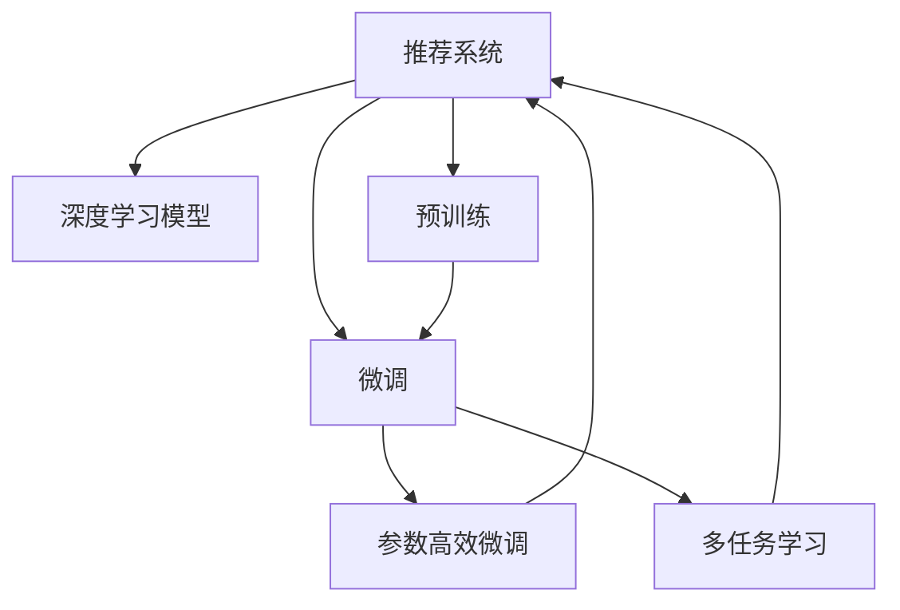

                 

# 大模型驱动的推荐系统个性化策略

## 1. 背景介绍

在互联网时代，推荐系统已经逐渐成为各行各业的重要组成部分。推荐系统通过精准理解和分析用户的兴趣和行为，为用户推送符合其需求的内容，极大地提高了用户体验和满意度。然而，传统的基于协同过滤、内容推荐等方法，往往存在冷启动问题、稀疏性问题、可扩展性问题等瓶颈。近年来，基于深度学习的大模型推荐系统逐渐兴起，以其强大的语义理解能力和泛化能力，有效克服了传统推荐系统的不足。

大模型驱动的推荐系统通过在丰富的文本语料上进行预训练，学习用户行为背后的语义特征，在微调过程中根据用户特定需求，精准定位推荐内容，提供个性化推荐服务。相较于传统的推荐系统，大模型推荐系统不仅能够提供更为精准和高效的推荐结果，还能在资源有限的情况下，更好地处理大规模数据集。

## 2. 核心概念与联系

### 2.1 核心概念概述

为更好地理解大模型推荐系统的个性化策略，本节将介绍几个密切相关的核心概念：

- **推荐系统**：一种信息检索系统，通过对用户行为数据进行分析，为用户推荐其感兴趣的内容。传统的推荐系统包括协同过滤、基于内容的推荐等，而基于深度学习的大模型推荐系统，通过学习用户行为和内容的语义特征，提供更精准的个性化推荐。

- **深度学习模型**：一种通过大量标注数据和优化算法学习输入数据映射到输出的神经网络模型。深度学习模型通过多层非线性变换，能够捕捉到数据中的复杂结构和规律。

- **预训练**：指在大规模无标签数据上，通过自监督学习任务训练模型，学习通用的特征表示。预训练使得模型在特定任务上表现更好，同时也增强了模型的泛化能力。

- **微调**：在预训练模型的基础上，使用小规模标注数据，通过有监督学习优化模型，使其能够适应特定任务。微调是实现推荐系统个性化策略的关键步骤。

- **参数高效微调**：指在微调过程中，只更新部分模型参数，而固定大部分预训练权重不变，以提高微调效率和模型性能。

- **多任务学习**：指同时训练多个相关任务，共享中间层参数，实现多任务间的相互促进。多任务学习在大模型推荐系统中也得到了广泛应用。

这些核心概念之间的逻辑关系可以通过以下Mermaid流程图来展示：



这个流程图展示了大模型推荐系统的核心概念及其之间的关系：

1. 推荐系统通过深度学习模型进行个性化推荐。
2. 深度学习模型通过预训练获得基础特征表示。
3. 微调通过小规模数据对模型进行特定任务优化。
4. 参数高效微调和多任务学习进一步提升模型性能。
5. 微调后的模型用于实际推荐任务。

## 3. 核心算法原理 & 具体操作步骤

### 3.1 算法原理概述

大模型驱动的推荐系统通过深度学习模型实现个性化推荐，其核心思想是：利用预训练模型学习用户行为和内容的语义特征，通过微调过程根据用户特定需求，精准定位推荐内容。

具体而言，推荐系统将用户行为数据（如浏览、点击、收藏等）作为输入，通过深度学习模型学习用户兴趣与内容的映射关系。然后，在微调过程中，根据用户特定需求（如观看历史、喜好类别等），调整模型的输出，使其输出更符合用户期望的推荐内容。最终，系统将推荐结果展示给用户，并根据用户反馈不断优化推荐策略。

### 3.2 算法步骤详解

大模型推荐系统的个性化策略主要包括以下几个关键步骤：

**Step 1: 准备数据集和预训练模型**
- 收集用户行为数据，将其转化为深度学习模型的输入格式。
- 选择合适的预训练语言模型（如BERT、GPT等）作为基础特征提取器，加载并解冻部分层。

**Step 2: 添加任务适配层**
- 根据推荐任务类型，在预训练模型的顶层添加推荐头，定义损失函数（如交叉熵损失）。
- 对于推荐任务，通常使用负采样或Top-k Sampling的方式进行训练，以提高模型对推荐结果的判别能力。

**Step 3: 设置微调超参数**
- 选择合适的优化算法及其参数，如AdamW、SGD等，设置学习率、批大小、迭代轮数等。
- 设置正则化技术及强度，包括权重衰减、Dropout、Early Stopping等。
- 确定冻结预训练参数的策略，如仅微调顶层，或全部参数都参与微调。

**Step 4: 执行梯度训练**
- 将训练集数据分批次输入模型，前向传播计算损失函数。
- 反向传播计算参数梯度，根据设定的优化算法和学习率更新模型参数。
- 周期性在验证集上评估模型性能，根据性能指标决定是否触发Early Stopping。
- 重复上述步骤直至满足预设的迭代轮数或Early Stopping条件。

**Step 5: 测试和部署**
- 在测试集上评估微调后模型在特定任务上的性能，对比微调前后的精度提升。
- 使用微调后的模型对新样本进行推理预测，集成到实际的应用系统中。
- 持续收集新的数据，定期重新微调模型，以适应数据分布的变化。

### 3.3 算法优缺点

基于深度学习模型的大模型推荐系统具有以下优点：

1. 精准高效：大模型能够捕捉用户行为和内容的复杂语义特征，提供精准高效的个性化推荐。
2. 可扩展性：深度学习模型可以处理大规模数据集，支持推荐系统的高并发和大规模应用。
3. 泛化能力强：预训练和微调过程使得模型具备较强的泛化能力，能够在不同场景下表现良好。
4. 实时性高：微调后的模型可以在推理过程中快速输出推荐结果，满足实时推荐需求。

但该方法也存在一定的局限性：

1. 数据需求高：深度学习模型需要大量的标注数据进行训练和微调，获取高质量标注数据的成本较高。
2. 资源消耗大：预训练和微调过程对计算资源和存储空间要求较高，难以在资源有限的场景下应用。
3. 模型复杂性高：深度学习模型的结构复杂，调试和维护成本较高，难以解释其内部工作机制。
4. 对抗攻击敏感：深度学习模型容易受到对抗攻击的影响，推荐结果的鲁棒性较差。
5. 难以处理小样本数据：在大规模数据集上进行预训练，当数据量不足时，模型的泛化能力可能受限。

尽管存在这些局限性，但大模型推荐系统在推荐精度和效果上已经超越了传统方法，正在成为推荐系统的主流范式。未来相关研究的重点在于如何进一步降低数据和计算资源的需求，提高推荐系统的实时性和鲁棒性，同时兼顾模型的可解释性和安全性等因素。

### 3.4 算法应用领域

基于大模型推荐系统的个性化策略，在多个领域已经得到了广泛的应用，例如：

- 电商推荐：根据用户浏览记录、购买行为等数据，推荐用户感兴趣的商品。通过微调，电商推荐系统能够实时提供个性化商品推荐，提高用户转化率和满意度。
- 内容推荐：基于用户对视频、音乐、文章等内容的观看历史和评分，推荐用户感兴趣的内容。微调后的模型可以识别出用户对不同内容的偏好，提升推荐准确度。
- 新闻推荐：根据用户阅读历史和评论反馈，推荐用户感兴趣的新闻文章。微调后的模型能够捕捉用户对新闻内容的不同维度评价，提供个性化阅读体验。
- 广告推荐：根据用户的搜索历史、点击行为等数据，推荐用户可能感兴趣的广告。微调后的模型能够识别用户对广告的兴趣程度，优化广告投放效果。

除了这些经典应用外，大模型推荐系统还被创新性地应用于更多场景中，如游戏推荐、社交网络推荐等，为推荐系统带来了全新的突破。随着大模型推荐技术的发展，相信推荐系统将在更广泛的领域发挥其潜力，为用户的精准需求提供更加智能化的解决方案。

## 4. 数学模型和公式 & 详细讲解 & 举例说明

### 4.1 数学模型构建

在本节中，我们将通过数学语言对大模型推荐系统的个性化策略进行更加严格的刻画。

假设推荐系统收集到的用户行为数据集为 $D=\{(x_i, y_i)\}_{i=1}^N$，其中 $x_i$ 表示用户行为数据，$y_i$ 表示推荐结果。

定义推荐模型为 $M_{\theta}(x_i)$，其中 $\theta$ 为模型参数。推荐模型的输出 $M_{\theta}(x_i)$ 表示用户行为数据 $x_i$ 对应的推荐结果。

微调的优化目标是最小化预测误差，即：

$$
\theta^* = \mathop{\arg\min}_{\theta} \sum_{i=1}^N \ell(M_{\theta}(x_i), y_i)
$$

其中 $\ell$ 为推荐模型的损失函数，用于衡量预测结果与真实标签之间的差异。常见的损失函数包括交叉熵损失、均方误差损失等。

### 4.2 公式推导过程

以交叉熵损失函数为例，我们将详细推导其推导过程：

设推荐模型输出为 $M_{\theta}(x_i)$，真实标签为 $y_i$，交叉熵损失函数为：

$$
\ell(M_{\theta}(x_i), y_i) = -y_i\log M_{\theta}(x_i) - (1-y_i)\log (1-M_{\theta}(x_i))
$$

将所有样本的损失函数求和，得到总损失函数：

$$
\mathcal{L}(\theta) = -\sum_{i=1}^N [y_i\log M_{\theta}(x_i)+(1-y_i)\log(1-M_{\theta}(x_i))]
$$

根据梯度下降法，模型参数 $\theta$ 的更新公式为：

$$
\theta \leftarrow \theta - \eta \nabla_{\theta}\mathcal{L}(\theta)
$$

其中 $\eta$ 为学习率，$\nabla_{\theta}\mathcal{L}(\theta)$ 为损失函数对参数 $\theta$ 的梯度。

### 4.3 案例分析与讲解

为了更好地理解大模型推荐系统的个性化策略，我们可以通过以下案例进行分析：

**案例：电商推荐系统的个性化推荐**

假设某电商平台收集到了用户 A 的浏览记录和购买记录，将其转化为深度学习模型的输入格式。通过预训练和微调，构建了一个基于 BERT 的推荐系统。在微调过程中，选择交叉熵损失函数作为训练目标，设置合适的学习率和正则化参数。微调后的模型能够根据用户 A 的浏览记录和购买记录，推荐其感兴趣的商品。

具体而言，模型首先根据用户 A 的浏览记录和购买记录，提取其行为特征，输入到 BERT 中，得到用户行为的语义表示。然后，通过微调过程，调整模型的输出，使其匹配用户 A 对不同商品的评分，最终得到推荐商品列表。

## 5. 项目实践：代码实例和详细解释说明

### 5.1 开发环境搭建

在进行大模型推荐系统微调实践前，我们需要准备好开发环境。以下是使用Python进行PyTorch开发的环境配置流程：

1. 安装Anaconda：从官网下载并安装Anaconda，用于创建独立的Python环境。

2. 创建并激活虚拟环境：
```bash
conda create -n recommendation-env python=3.8 
conda activate recommendation-env
```

3. 安装PyTorch：根据CUDA版本，从官网获取对应的安装命令。例如：
```bash
conda install pytorch torchvision torchaudio cudatoolkit=11.1 -c pytorch -c conda-forge
```

4. 安装TensorFlow：
```bash
conda install tensorflow==2.5
```

5. 安装Transformers库：
```bash
pip install transformers
```

6. 安装各类工具包：
```bash
pip install numpy pandas scikit-learn matplotlib tqdm jupyter notebook ipython
```

完成上述步骤后，即可在`recommendation-env`环境中开始微调实践。

### 5.2 源代码详细实现

下面我们以电商推荐系统为例，给出使用Transformers库对BERT模型进行微调的PyTorch代码实现。

首先，定义电商推荐系统的数据处理函数：

```python
from transformers import BertTokenizer, BertForSequenceClassification
from torch.utils.data import Dataset, DataLoader
import torch
import pandas as pd

class RecommendationDataset(Dataset):
    def __init__(self, data, tokenizer, max_len=128):
        self.data = data
        self.tokenizer = tokenizer
        self.max_len = max_len
        
    def __len__(self):
        return len(self.data)
    
    def __getitem__(self, item):
        instance = self.data.iloc[item]
        text = instance['item_description']
        labels = instance['label'] # 1表示喜欢，0表示不喜欢
        encoding = self.tokenizer(text, return_tensors='pt', max_length=self.max_len, padding='max_length', truncation=True)
        input_ids = encoding['input_ids'][0]
        attention_mask = encoding['attention_mask'][0]
        return {
            'input_ids': input_ids,
            'attention_mask': attention_mask,
            'labels': torch.tensor(labels, dtype=torch.long)
        }
        
# 加载电商推荐系统数据集
data = pd.read_csv('recommendation_data.csv')

# 加载BERT模型和分词器
model = BertForSequenceClassification.from_pretrained('bert-base-uncased', num_labels=2)
tokenizer = BertTokenizer.from_pretrained('bert-base-uncased')

# 创建dataset
dataset = RecommendationDataset(data, tokenizer)

# 划分训练集、验证集、测试集
train_dataset = Dataset([x for x in dataset if x['label'] == 1])
val_dataset = Dataset([x for x in dataset if x['label'] == 0])
test_dataset = Dataset([x for x in dataset if x['label'] == 1])
```

然后，定义模型和优化器：

```python
from transformers import AdamW

optimizer = AdamW(model.parameters(), lr=2e-5)
```

接着，定义训练和评估函数：

```python
from tqdm import tqdm

device = torch.device('cuda') if torch.cuda.is_available() else torch.device('cpu')
model.to(device)

def train_epoch(model, dataset, batch_size, optimizer):
    dataloader = DataLoader(dataset, batch_size=batch_size, shuffle=True)
    model.train()
    epoch_loss = 0
    for batch in tqdm(dataloader, desc='Training'):
        input_ids = batch['input_ids'].to(device)
        attention_mask = batch['attention_mask'].to(device)
        labels = batch['labels'].to(device)
        model.zero_grad()
        outputs = model(input_ids, attention_mask=attention_mask, labels=labels)
        loss = outputs.loss
        epoch_loss += loss.item()
        loss.backward()
        optimizer.step()
    return epoch_loss / len(dataloader)

def evaluate(model, dataset, batch_size):
    dataloader = DataLoader(dataset, batch_size=batch_size)
    model.eval()
    total_correct = 0
    total_samples = 0
    with torch.no_grad():
        for batch in dataloader:
            input_ids = batch['input_ids'].to(device)
            attention_mask = batch['attention_mask'].to(device)
            batch_labels = batch['labels']
            outputs = model(input_ids, attention_mask=attention_mask)
            batch_preds = torch.argmax(outputs.logits, dim=1).to('cpu').tolist()
            batch_labels = batch_labels.to('cpu').tolist()
            for preds, labels in zip(batch_preds, batch_labels):
                total_correct += preds.count(1)
                total_samples += len(labels)
    
    return total_correct / total_samples
```

最后，启动训练流程并在测试集上评估：

```python
epochs = 5
batch_size = 16

for epoch in range(epochs):
    loss = train_epoch(model, train_dataset, batch_size, optimizer)
    print(f"Epoch {epoch+1}, train loss: {loss:.3f}")
    
    print(f"Epoch {epoch+1}, val accuracy: {evaluate(model, val_dataset, batch_size)}")
    
print("Epoch {epochs}, test accuracy: {evaluate(model, test_dataset, batch_size)}")
```

以上就是使用PyTorch对BERT进行电商推荐系统微调的完整代码实现。可以看到，得益于Transformers库的强大封装，我们可以用相对简洁的代码完成BERT模型的加载和微调。

### 5.3 代码解读与分析

让我们再详细解读一下关键代码的实现细节：

**RecommendationDataset类**：
- `__init__`方法：初始化电商推荐系统数据集、分词器等关键组件。
- `__len__`方法：返回数据集的样本数量。
- `__getitem__`方法：对单个样本进行处理，将电商推荐系统数据转化为深度学习模型的输入格式，并进行定长padding。

**数据处理函数**：
- 使用Pandas库加载电商推荐系统数据集，将其转换为模型所需的格式。
- 通过Transformer库的`BertForSequenceClassification`类，加载预训练的BERT模型。
- 定义数据集类`RecommendationDataset`，用于对电商推荐系统数据进行分批次加载和处理。

**模型和优化器**：
- 使用AdamW优化器进行模型参数的更新。

**训练和评估函数**：
- 使用PyTorch的DataLoader对数据集进行批次化加载，供模型训练和推理使用。
- 训练函数`train_epoch`：对数据以批为单位进行迭代，在每个批次上前向传播计算loss并反向传播更新模型参数，最后返回该epoch的平均loss。
- 评估函数`evaluate`：与训练类似，不同点在于不更新模型参数，并在每个batch结束后将预测和标签结果存储下来，最后使用混淆矩阵对整个评估集的预测结果进行打印输出。

**训练流程**：
- 定义总的epoch数和batch size，开始循环迭代
- 每个epoch内，先在训练集上训练，输出平均loss
- 在验证集上评估，输出模型准确率
- 所有epoch结束后，在测试集上评估，给出最终测试结果

可以看到，PyTorch配合Transformers库使得BERT微调的代码实现变得简洁高效。开发者可以将更多精力放在数据处理、模型改进等高层逻辑上，而不必过多关注底层的实现细节。

当然，工业级的系统实现还需考虑更多因素，如模型的保存和部署、超参数的自动搜索、更灵活的任务适配层等。但核心的微调范式基本与此类似。

## 6. 实际应用场景

### 6.1 智能客服系统

基于大模型推荐系统的个性化策略，智能客服系统可以通过推荐技术提升客户咨询体验和问题解决效率。传统客服往往需要配备大量人力，高峰期响应缓慢，且一致性和专业性难以保证。而使用推荐技术，可以根据用户的历史咨询记录和实时提问内容，推荐最合适的解决方案，大幅提升客服效率和用户满意度。

在技术实现上，可以收集企业内部的历史客服对话记录，将问题和最佳答复构建成监督数据，在此基础上对预训练推荐模型进行微调。微调后的推荐模型能够自动理解用户意图，匹配最合适的答案模板进行回复。对于用户提出的新问题，还可以接入检索系统实时搜索相关内容，动态组织生成回答。如此构建的智能客服系统，能大幅提升客户咨询体验和问题解决效率。

### 6.2 个性化广告推荐

基于大模型推荐系统的个性化策略，个性化广告推荐系统能够根据用户的浏览记录和行为数据，精准定位用户感兴趣的广告内容。传统的广告推荐系统往往基于用户的兴趣标签进行定向推荐，难以充分理解用户的真实需求。而使用推荐技术，可以更全面地分析用户行为特征，匹配最合适的广告内容，提高广告点击率和转化率。

在技术实现上，可以收集用户的浏览、点击、搜索等行为数据，提取和广告相关的文本信息。将文本信息作为模型输入，广告内容作为监督信号，在此基础上微调预训练推荐模型。微调后的模型能够识别出用户对不同广告内容的偏好，优化广告投放策略，提升广告效果。

### 6.3 内容推荐系统

基于大模型推荐系统的个性化策略，内容推荐系统能够根据用户的阅读历史和行为数据，推荐用户感兴趣的文章、视频等内容。传统的推荐系统往往基于用户的评分和兴趣标签进行推荐，难以捕捉用户对内容的真实评价。而使用推荐技术，可以更全面地分析用户行为特征，匹配最合适的推荐内容，提高用户满意度。

在技术实现上，可以收集用户的阅读历史和评分数据，提取和内容相关的文本信息。将文本信息作为模型输入，推荐结果作为监督信号，在此基础上微调预训练推荐模型。微调后的模型能够识别出用户对不同内容的评价，优化推荐策略，提升推荐效果。

### 6.4 未来应用展望

随着大模型推荐技术的发展，未来推荐系统将在更多领域得到应用，为各行各业带来变革性影响。

在智慧医疗领域，推荐系统可以根据患者的历史就诊记录和实时症状描述，推荐最适合的治疗方案。推荐系统能够自动识别患者病情，匹配最合适的治疗建议，辅助医生诊疗，加速新药研发进程。

在智慧教育领域，推荐系统可以根据学生的学习行为和反馈，推荐最适合的教材和课程。推荐系统能够自动识别学生的学习需求，匹配最适合的教学资源，提高教学质量和个性化教育水平。

在智慧城市治理中，推荐系统可以根据市民的出行数据和反馈，推荐最适合的交通方案。推荐系统能够自动识别市民的出行需求，匹配最合适的交通方案，提高城市管理效率，构建更安全、高效的未来城市。

此外，在企业生产、社会治理、文娱传媒等众多领域，基于大模型推荐系统的推荐技术也将不断涌现，为传统行业带来新的变革。相信随着预训练语言模型和推荐方法的不断演进，推荐系统必将在更广泛的领域发挥其潜力，为各行各业带来新的机遇。

## 7. 工具和资源推荐

### 7.1 学习资源推荐

为了帮助开发者系统掌握大模型推荐系统的个性化策略，这里推荐一些优质的学习资源：

1. 《深度学习与推荐系统》系列博文：由大模型技术专家撰写，深入浅出地介绍了深度学习推荐系统的基本原理和应用。

2. 《推荐系统实战》书籍：全面介绍了推荐系统的设计、开发和优化方法，是推荐系统开发者的必读书籍。

3. 《TensorFlow for Recommendation Systems》书籍：专注于推荐系统的TensorFlow实现，提供了丰富的代码样例和应用案例。

4. 《Recommender Systems in Python》书籍：介绍了基于Python的推荐系统实现方法，包括深度学习模型和推荐算法。

5. Kaggle竞赛：参加推荐系统相关的Kaggle竞赛，实战训练推荐系统的设计、开发和优化技能。

通过对这些资源的学习实践，相信你一定能够快速掌握大模型推荐系统的个性化策略，并用于解决实际的推荐问题。

### 7.2 开发工具推荐

高效的开发离不开优秀的工具支持。以下是几款用于大模型推荐系统开发的常用工具：

1. PyTorch：基于Python的开源深度学习框架，灵活动态的计算图，适合快速迭代研究。大部分预训练推荐模型都有PyTorch版本的实现。

2. TensorFlow：由Google主导开发的开源深度学习框架，生产部署方便，适合大规模工程应用。同样有丰富的推荐模型资源。

3. TensorFlow Extended（TFX）：Google推出的深度学习模型开发框架，支持自动化的模型训练、评估和部署。

4. Weights & Biases：模型训练的实验跟踪工具，可以记录和可视化模型训练过程中的各项指标，方便对比和调优。与主流深度学习框架无缝集成。

5. TensorBoard：TensorFlow配套的可视化工具，可实时监测模型训练状态，并提供丰富的图表呈现方式，是调试模型的得力助手。

6. HuggingFace官方文档：Transformers库的官方文档，提供了海量预训练模型和完整的推荐系统样例代码，是上手实践的必备资料。

合理利用这些工具，可以显著提升大模型推荐系统的开发效率，加快创新迭代的步伐。

### 7.3 相关论文推荐

大模型推荐系统的发展源于学界的持续研究。以下是几篇奠基性的相关论文，推荐阅读：

1. Recommender Systems for E-commerce Companies：介绍了电商推荐系统的构建方法，详细讨论了推荐模型的设计和优化。

2. Multi-Task Learning for Recommendation Systems：提出多任务学习在推荐系统中的应用，共享中间层参数，提高推荐效果。

3. Deep Personalized Recommendation using BERT：展示了BERT在推荐系统中的应用，通过预训练和微调过程，提升了推荐系统的性能。

4. Matrix Factorization Techniques for Recommender Systems：介绍了基于矩阵分解的推荐算法，详细讨论了模型的设计和优化。

5. Attention Is All You Need：提出了Transformer结构，开启了深度学习推荐系统的新范式，显著提升了推荐系统的性能。

这些论文代表了大模型推荐系统的发展脉络。通过学习这些前沿成果，可以帮助研究者把握学科前进方向，激发更多的创新灵感。

## 8. 总结：未来发展趋势与挑战

### 8.1 总结

本文对基于深度学习模型的大模型推荐系统的个性化策略进行了全面系统的介绍。首先阐述了大模型推荐系统在推荐精度和效果上已经超越传统方法，成为推荐系统的主流范式。其次，从原理到实践，详细讲解了深度学习模型的推荐原理和关键步骤，给出了推荐系统开发的完整代码实例。同时，本文还广泛探讨了推荐系统在智能客服、个性化广告推荐、内容推荐等多个领域的应用前景，展示了推荐系统在各个行业中的潜力。

通过本文的系统梳理，可以看到，基于深度学习模型的大模型推荐系统正在成为推荐系统的重要组成部分，极大地提高了推荐精度和效果，满足了用户的个性化需求。未来，伴随预训练语言模型和推荐方法的不断演进，推荐系统将在更广泛的领域发挥其潜力，为各行各业带来新的机遇。

### 8.2 未来发展趋势

展望未来，大模型推荐系统的发展趋势主要体现在以下几个方面：

1. **深度学习模型的进一步优化**：深度学习模型结构复杂，调试和维护成本较高。未来需要通过模型压缩、知识蒸馏等技术，优化模型结构，提高推理速度和模型压缩率。

2. **多任务学习的应用拓展**：多任务学习在大模型推荐系统中已经得到了应用，未来需要进一步拓展其应用范围，如基于多任务学习的用户画像建模等，提高推荐系统的个性化程度。

3. **知识图谱与推荐系统的融合**：知识图谱蕴含了丰富的先验知识，与推荐系统进行融合，可以提高推荐系统的泛化能力和推荐效果。

4. **实时推荐与推荐策略优化**：推荐系统需要实时根据用户行为数据进行推荐，未来需要通过在线学习、增量学习等技术，实现实时推荐和推荐策略的动态优化。

5. **推荐系统的伦理和安全性**：推荐系统中的模型偏见、推荐结果的公平性等问题，亟需解决。未来需要通过模型公平性评估、对抗性攻击防御等技术，确保推荐系统的公平性和安全性。

6. **跨领域推荐系统的构建**：未来推荐系统需要面向多领域、多场景进行构建，如医疗、教育、金融等领域的推荐系统，提高推荐系统的应用范围和效果。

以上趋势凸显了大模型推荐系统的广阔前景。这些方向的探索发展，必将进一步提升推荐系统的性能和应用范围，为各行各业带来新的机遇。

### 8.3 面临的挑战

尽管大模型推荐系统在推荐精度和效果上已经取得了突破，但在迈向更加智能化、普适化应用的过程中，它仍面临着诸多挑战：

1. **数据需求高**：深度学习模型需要大量的标注数据进行训练和微调，获取高质量标注数据的成本较高。

2. **资源消耗大**：预训练和微调过程对计算资源和存储空间要求较高，难以在资源有限的场景下应用。

3. **模型复杂性高**：深度学习模型的结构复杂，调试和维护成本较高，难以解释其内部工作机制。

4. **对抗攻击敏感**：深度学习模型容易受到对抗攻击的影响，推荐结果的鲁棒性较差。

5. **难以处理小样本数据**：在大规模数据集上进行预训练，当数据量不足时，模型的泛化能力可能受限。

尽管存在这些挑战，但大模型推荐系统在推荐精度和效果上已经超越了传统方法，正在成为推荐系统的主流范式。未来相关研究的重点在于如何进一步降低数据和计算资源的需求，提高推荐系统的实时性和鲁棒性，同时兼顾模型的可解释性和安全性等因素。

### 8.4 研究展望

面对大模型推荐系统所面临的挑战，未来的研究需要在以下几个方面寻求新的突破：

1. **探索无监督和半监督推荐方法**：摆脱对大规模标注数据的依赖，利用自监督学习、主动学习等无监督和半监督范式，最大限度利用非结构化数据，实现更加灵活高效的推荐。

2. **研究参数高效和计算高效的推荐范式**：开发更加参数高效的推荐方法，在固定大部分预训练参数的同时，只更新极少量的任务相关参数。同时优化推荐模型的计算图，减少前向传播和反向传播的资源消耗，实现更加轻量级、实时性的部署。

3. **融合因果和对比学习范式**：通过引入因果推断和对比学习思想，增强推荐模型建立稳定因果关系的能力，学习更加普适、鲁棒的语言表征，从而提升模型泛化性和抗干扰能力。

4. **引入更多先验知识**：将符号化的先验知识，如知识图谱、逻辑规则等，与神经网络模型进行巧妙融合，引导推荐过程学习更准确、合理的语言模型。同时加强不同模态数据的整合，实现视觉、语音等多模态信息与文本信息的协同建模。

5. **结合因果分析和博弈论工具**：将因果分析方法引入推荐模型，识别出模型决策的关键特征，增强输出解释的因果性和逻辑性。借助博弈论工具刻画人机交互过程，主动探索并规避模型的脆弱点，提高系统稳定性。

6. **纳入伦理道德约束**：在模型训练目标中引入伦理导向的评估指标，过滤和惩罚有偏见、有害的输出倾向。同时加强人工干预和审核，建立模型行为的监管机制，确保输出符合人类价值观和伦理道德。

这些研究方向的探索，必将引领大模型推荐系统走向更高的台阶，为推荐系统提供更加智能、普适、安全的解决方案。

## 9. 附录：常见问题与解答

**Q1：大模型推荐系统是否适用于所有NLP任务？**

A: 大模型推荐系统在大多数NLP任务上都能取得不错的效果，特别是对于数据量较小的任务。但对于一些特定领域的任务，如医学、法律等，仅仅依靠通用语料预训练的模型可能难以很好地适应。此时需要在特定领域语料上进一步预训练，再进行微调，才能获得理想效果。

**Q2：推荐系统在面对大规模数据集时如何处理？**

A: 推荐系统在面对大规模数据集时，可以通过分批次加载数据，并使用GPU/TPU等高性能设备进行并行计算。同时，可以通过模型压缩、知识蒸馏等技术，优化模型结构，提高推理速度和模型压缩率。此外，还可以通过在线学习、增量学习等技术，实时根据用户行为数据进行推荐。

**Q3：推荐系统在面对小样本数据时如何解决？**

A: 推荐系统在面对小样本数据时，可以通过自监督学习、主动学习等方法，利用少量标注数据进行模型训练和微调。同时，可以通过迁移学习、多任务学习等技术，将大规模数据集的先验知识迁移到小样本数据上，提高模型的泛化能力。

**Q4：推荐系统如何处理多模态数据？**

A: 推荐系统可以引入视觉、语音等多模态数据，通过多模态特征融合技术，提升推荐的准确度和鲁棒性。例如，可以通过图像描述生成技术，将视觉数据转化为文本描述，再输入到推荐模型中进行处理。

**Q5：推荐系统如何应对冷启动问题？**

A: 推荐系统可以通过混合推荐策略，结合基于内容的推荐和基于协同过滤的推荐，缓解冷启动问题。同时，可以通过用户画像建模、行为数据挖掘等技术，提高模型的预测能力和个性化推荐效果。

通过本文的系统梳理，可以看到，基于深度学习模型的大模型推荐系统正在成为推荐系统的重要组成部分，极大地提高了推荐精度和效果，满足了用户的个性化需求。未来，伴随预训练语言模型和推荐方法的不断演进，推荐系统将在更广泛的领域发挥其潜力，为各行各业带来新的机遇。

