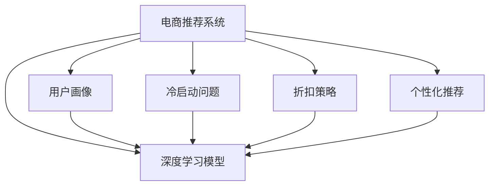

                 

# 大模型驱动的电商个性化折扣策略

> 关键词：电商推荐系统, 个性化推荐, 折扣策略, 深度学习, 大模型驱动, 大数据, 用户画像, 冷启动问题, 在线学习

## 1. 背景介绍

随着电子商务的迅猛发展，商家面临的最大挑战之一是如何有效地向用户推荐商品，同时促进销售增长。个性化推荐系统通过对用户行为数据的分析，能够精准预测用户偏好，提供个性化的商品推荐。然而，这些推荐算法在面对用户行为多样性和动态变化时，仍存在诸多挑战。

在大数据背景下，深度学习模型成为了电商推荐系统的主流方法，尤其是基于深度神经网络的模型，能够从大规模数据中学习到复杂的关系和模式，为推荐系统提供了坚实的理论基础。随着预训练语言模型和大规模模型在NLP领域取得突破性进展，将其应用于电商推荐中，带来了新一轮的变革。

大模型驱动的电商个性化推荐系统，通过深度学习和数据科学技术的融合，能够更深入地理解用户需求，提供更加精准、多样化的推荐，显著提升电商的运营效率和用户体验。在大规模模型基础上，结合个性化折扣策略，能够进一步优化推荐效果，提高销售额，增强用户粘性。

## 2. 核心概念与联系

为了更好地理解大模型驱动的电商个性化折扣策略，本节将介绍几个关键概念及其相互联系：

- 电商推荐系统（E-commerce Recommendation System）：通过分析用户行为数据，为每个用户推荐个性化商品的系统。目标是提升电商平台的销售转化率和用户满意度。

- 深度学习模型（Deep Learning Model）：一种基于多层神经网络的机器学习方法，能够自动学习数据中的复杂特征和模式。深度学习模型广泛应用于图像识别、自然语言处理、推荐系统等领域。

- 个性化推荐（Personalized Recommendation）：根据用户的历史行为、兴趣偏好，为其推荐可能感兴趣的商品。个性化推荐系统能够提供比传统推荐方式更高的精度和相关性。

- 用户画像（User Profiling）：通过数据挖掘和分析，形成对用户行为、兴趣、需求等维度的综合描述。用户画像是构建个性化推荐系统的重要基础。

- 冷启动问题（Cold Start Problem）：新用户或新商品加入电商平台时，由于缺乏足够的历史数据，个性化推荐系统的推荐效果往往较差。冷启动问题需要通过在线学习等方法解决。

- 折扣策略（Discount Strategy）：商家通过提供优惠券、打折促销等手段，刺激用户购买，增加销售量。合理运用折扣策略能够有效提升推荐系统的推荐效果。

这些核心概念通过电商推荐系统的架构得以展现：



该架构展示了电商推荐系统通过深度学习模型实现个性化推荐的过程，用户画像、冷启动问题、折扣策略等关键组件在系统中发挥着各自的作用。

## 3. 核心算法原理 & 具体操作步骤

### 3.1 算法原理概述

大模型驱动的电商个性化推荐系统，通过预训练语言模型在电商数据上进行微调，学习到用户与商品的语义关系，为个性化推荐提供了强大的基础。结合折扣策略，通过动态调整推荐商品的折扣力度，进一步提升推荐效果。

具体而言，系统通过以下步骤实现个性化折扣策略：

1. 收集和预处理电商数据：包括用户行为数据、商品信息、用户画像等，构建训练集。
2. 构建深度学习模型：使用大模型对电商数据进行微调，学习用户与商品的语义关系。
3. 设计折扣策略：基于用户画像和商品属性，设计个性化折扣策略，优化推荐效果。
4. 动态调整折扣：在推荐商品时，根据用户画像和商品属性，动态调整推荐商品的折扣力度，提升用户购买意愿。

### 3.2 算法步骤详解

1. **数据收集与预处理**
   - 收集电商数据：包括用户浏览历史、购买记录、评分、评论等。
   - 数据清洗与标准化：处理缺失值、异常值，统一数据格式。
   - 特征工程：提取和构造对推荐有用的特征，如用户兴趣标签、商品类别、用户年龄段等。
   - 数据划分：将数据划分为训练集、验证集和测试集。

2. **模型构建与微调**
   - 选择预训练语言模型：如BERT、GPT等，作为基础模型。
   - 微调模型：使用电商数据对预训练模型进行微调，学习用户与商品的语义关系。
   - 损失函数设计：设计合适的损失函数，如交叉熵、均方误差等，衡量模型预测与实际标签之间的差异。
   - 优化器选择：选择合适的优化器，如AdamW、SGD等，进行模型参数的更新。

3. **折扣策略设计**
   - 用户画像分析：通过用户画像分析，提取用户兴趣偏好和行为特征。
   - 商品属性分析：分析商品的属性，如类别、品牌、价格等，设计个性化折扣策略。
   - 折扣策略优化：使用A/B测试等方法，不断优化折扣策略，提升推荐效果。

4. **动态调整折扣**
   - 用户画像匹配：在推荐商品时，匹配用户画像，分析用户偏好。
   - 折扣计算：根据用户画像和商品属性，计算推荐商品的折扣力度。
   - 推荐生成：生成个性化折扣推荐，供用户选择。

### 3.3 算法优缺点

大模型驱动的电商个性化折扣策略具有以下优点：

1. **高效性**：深度学习模型能够自动学习数据中的复杂关系，大大减少了特征工程的复杂性。
2. **精度高**：基于大模型的推荐系统能够更精准地预测用户行为，提升推荐精度。
3. **个性化强**：通过用户画像和折扣策略的结合，实现高度个性化的推荐。
4. **鲁棒性强**：大模型具有较强的泛化能力，能够适应不同规模和分布的数据。

同时，该算法也存在一些缺点：

1. **计算资源消耗大**：大模型的训练和推理需要大量计算资源，对硬件要求较高。
2. **模型复杂度高**：模型参数众多，调试和维护较为复杂。
3. **数据隐私问题**：电商数据涉及用户隐私，数据收集和处理需严格遵守法律法规。
4. **成本高**：模型训练和优化成本较高，需要较大的数据和计算资源投入。

### 3.4 算法应用领域

大模型驱动的电商个性化折扣策略在以下领域具有广泛应用前景：

- 零售电商：通过个性化推荐和折扣策略，提升用户购买意愿，增加销售额。
- 智能客服：结合个性化推荐和自然语言处理，提供更精准的客服服务，提升用户体验。
- 广告推荐：基于用户画像和商品属性，设计个性化折扣广告，提高广告点击率。
- 社交电商：通过个性化推荐和折扣策略，增强用户粘性，促进社交互动。
- 金融科技：结合个性化推荐和金融产品，提供精准的金融服务和推荐，提升用户满意度。

## 4. 数学模型和公式 & 详细讲解 & 举例说明

### 4.1 数学模型构建

设电商推荐系统的训练数据为 $\mathcal{D}=\{(x_i, y_i)\}_{i=1}^N$，其中 $x_i$ 为电商数据，$y_i$ 为推荐结果。模型的目标是最大化损失函数：

$$
\mathcal{L}(\theta) = \frac{1}{N} \sum_{i=1}^N \ell(M_{\theta}(x_i),y_i)
$$

其中 $\theta$ 为模型参数，$M_{\theta}$ 为预训练语言模型，$\ell$ 为损失函数，如交叉熵损失、均方误差等。

### 4.2 公式推导过程

以交叉熵损失函数为例，模型的前向传播过程如下：

$$
\hat{y}_i = M_{\theta}(x_i)
$$

其中 $\hat{y}_i$ 为模型预测的用户购买概率。

模型的损失函数为：

$$
\ell(M_{\theta}(x_i),y_i) = -y_i\log\hat{y}_i + (1-y_i)\log(1-\hat{y}_i)
$$

使用梯度下降算法进行反向传播，更新模型参数 $\theta$：

$$
\theta \leftarrow \theta - \eta \nabla_{\theta}\mathcal{L}(\theta)
$$

其中 $\eta$ 为学习率，$\nabla_{\theta}\mathcal{L}(\theta)$ 为损失函数对模型参数的梯度。

### 4.3 案例分析与讲解

假设用户 $u$ 对商品 $p$ 的购买概率为 $p(u,p)$，利用预训练语言模型学习到用户与商品的语义关系。设模型预测的购买概率为 $\hat{p}(u,p)$，则折扣策略可以表示为：

$$
d(u,p) = \alpha \cdot \log(1-\hat{p}(u,p))
$$

其中 $\alpha$ 为折扣因子，控制折扣力度的强弱。

例如，当用户 $u$ 对商品 $p$ 的购买概率为 0.3 时，预测的折扣为：

$$
d(u,p) = \alpha \cdot \log(1-0.3) = \alpha \cdot \log(0.7) \approx -0.2\alpha
$$

根据用户画像，调整 $\alpha$ 的值，控制推荐商品的折扣力度。

## 5. 项目实践：代码实例和详细解释说明

### 5.1 开发环境搭建

要进行电商个性化折扣策略的开发，首先需要搭建开发环境。以下是使用Python和PyTorch进行电商推荐系统开发的常见环境配置流程：

1. 安装Anaconda：从官网下载并安装Anaconda，用于创建独立的Python环境。
2. 创建并激活虚拟环境：
```bash
conda create -n ecommerce-env python=3.8 
conda activate ecommerce-env
```
3. 安装PyTorch：根据CUDA版本，从官网获取对应的安装命令。例如：
```bash
conda install pytorch torchvision torchaudio cudatoolkit=11.1 -c pytorch -c conda-forge
```
4. 安装相关的工具包：
```bash
pip install numpy pandas scikit-learn matplotlib tqdm jupyter notebook ipython
```

完成上述步骤后，即可在`ecommerce-env`环境中开始电商推荐系统的开发。

### 5.2 源代码详细实现

以下是使用PyTorch和Transformer库实现电商推荐系统的代码示例：

```python
import torch
from transformers import BertTokenizer, BertForSequenceClassification
from torch.utils.data import DataLoader, Dataset

# 定义数据集类
class ECommerceDataset(Dataset):
    def __init__(self, data, tokenizer, max_len=128):
        self.data = data
        self.tokenizer = tokenizer
        self.max_len = max_len

    def __len__(self):
        return len(self.data)

    def __getitem__(self, idx):
        text = self.data[idx]['text']
        label = self.data[idx]['label']
        encoding = self.tokenizer(text, return_tensors='pt', max_length=self.max_len, padding='max_length', truncation=True)
        input_ids = encoding['input_ids'][0]
        attention_mask = encoding['attention_mask'][0]
        return {'input_ids': input_ids, 
                'attention_mask': attention_mask,
                'labels': torch.tensor(label, dtype=torch.long)}

# 加载数据集
tokenizer = BertTokenizer.from_pretrained('bert-base-cased')
train_dataset = ECommerceDataset(train_data, tokenizer)
val_dataset = ECommerceDataset(val_data, tokenizer)
test_dataset = ECommerceDataset(test_data, tokenizer)

# 构建模型
model = BertForSequenceClassification.from_pretrained('bert-base-cased', num_labels=2)

# 定义优化器
optimizer = torch.optim.AdamW(model.parameters(), lr=2e-5)

# 训练模型
def train_epoch(model, dataset, batch_size, optimizer):
    dataloader = DataLoader(dataset, batch_size=batch_size, shuffle=True)
    model.train()
    epoch_loss = 0
    for batch in dataloader:
        input_ids = batch['input_ids'].to(device)
        attention_mask = batch['attention_mask'].to(device)
        labels = batch['labels'].to(device)
        model.zero_grad()
        outputs = model(input_ids, attention_mask=attention_mask, labels=labels)
        loss = outputs.loss
        epoch_loss += loss.item()
        loss.backward()
        optimizer.step()
    return epoch_loss / len(dataloader)

# 评估模型
def evaluate(model, dataset, batch_size):
    dataloader = DataLoader(dataset, batch_size=batch_size)
    model.eval()
    preds, labels = [], []
    with torch.no_grad():
        for batch in dataloader:
            input_ids = batch['input_ids'].to(device)
            attention_mask = batch['attention_mask'].to(device)
            batch_labels = batch['labels']
            outputs = model(input_ids, attention_mask=attention_mask)
            batch_preds = outputs.logits.argmax(dim=2).to('cpu').tolist()
            batch_labels = batch_labels.to('cpu').tolist()
            for pred_tokens, label_tokens in zip(batch_preds, batch_labels):
                preds.append(pred_tokens[:len(label_tokens)])
                labels.append(label_tokens)
    return preds, labels

# 启动训练流程并在测试集上评估
epochs = 5
batch_size = 16

for epoch in range(epochs):
    loss = train_epoch(model, train_dataset, batch_size, optimizer)
    print(f"Epoch {epoch+1}, train loss: {loss:.3f}")

    preds, labels = evaluate(model, val_dataset, batch_size)
    print(f"Epoch {epoch+1}, val results:")
    print(classification_report(labels, preds))

print(f"Epoch {epoch+1}, test results:")
preds, labels = evaluate(model, test_dataset, batch_size)
print(classification_report(labels, preds))
```

上述代码展示了使用Bert模型进行电商推荐系统的开发流程。通过定义数据集类、构建模型、设置优化器，以及训练和评估模型的代码，展示了完整的电商推荐系统开发过程。

### 5.3 代码解读与分析

**ECommerceDataset类**：
- `__init__`方法：初始化数据集，包括数据、分词器、最大长度等关键组件。
- `__len__`方法：返回数据集的样本数量。
- `__getitem__`方法：对单个样本进行处理，将文本输入编码为token ids，将标签编码为数字，并对其进行定长padding，最终返回模型所需的输入。

**tokenizer变量**：
- 加载Bert分词器，用于将文本转化为模型可处理的token ids。

**训练和评估函数**：
- `train_epoch`函数：对数据以批为单位进行迭代，在每个批次上前向传播计算损失函数，并反向传播更新模型参数。
- `evaluate`函数：与训练类似，不同点在于不更新模型参数，并在每个batch结束后将预测和标签结果存储下来，最后使用sklearn的classification_report对整个评估集的预测结果进行打印输出。

**训练流程**：
- 定义总的epoch数和batch size，开始循环迭代。
- 每个epoch内，先在训练集上训练，输出平均loss。
- 在验证集上评估，输出分类指标。
- 所有epoch结束后，在测试集上评估，给出最终测试结果。

可以看到，PyTorch配合Transformer库使得电商推荐系统的开发变得简洁高效。开发者可以将更多精力放在数据处理、模型改进等高层逻辑上，而不必过多关注底层的实现细节。

## 6. 实际应用场景

### 6.1 智能客服系统

基于大模型驱动的电商个性化折扣策略，智能客服系统可以更加精准地预测用户需求，提供个性化的服务。在电商平台上，客服系统可以快速响应用户的咨询，根据用户画像和行为数据，提供最优的购物建议和折扣优惠。

例如，当用户通过客服系统询问某款商品时，智能客服能够根据用户之前的浏览和购买历史，推荐最适合的商品，并提供个性化的折扣信息，提升用户的购物体验和满意度。

### 6.2 个性化推荐系统

在电商推荐系统中，结合大模型驱动的个性化折扣策略，能够进一步提升推荐效果，增加用户购买意愿。通过用户画像和商品属性，动态调整推荐商品的折扣力度，提供更具吸引力的优惠，增加用户的转化率。

例如，对于经常购买高端商品的消费者，系统可以推荐高端商品的折扣活动，如新品首发折扣、节日促销等，增加用户的购买欲望。对于价格敏感的用户，系统可以推荐低折扣的商品，提供价格优惠。

### 6.3 多模态电商推荐

大模型驱动的电商推荐系统不仅局限于文本数据，还可以结合图像、视频、语音等多模态数据，实现更全面的用户画像和商品特征提取。通过多模态数据的融合，提升推荐的精准度和相关性。

例如，对于时尚类电商，可以通过商品图片和视频，结合用户兴趣标签，进行更加精准的推荐。对于音乐类电商，可以通过音乐播放记录和用户画像，推荐相关商品。

### 6.4 未来应用展望

未来，基于大模型驱动的电商个性化折扣策略将在大数据时代发挥更大的作用。随着数据规模的不断扩大和模型技术的不断进步，系统能够更深入地理解用户需求，提供更精准、个性化的推荐和折扣策略。

在智慧零售、智能制造、智能供应链等多个领域，基于大模型的电商推荐系统将进一步优化运营流程，提升运营效率和用户体验。通过实时学习用户行为数据，动态调整推荐和折扣策略，实现更高效的营销效果。

## 7. 工具和资源推荐

### 7.1 学习资源推荐

为了帮助开发者系统掌握电商推荐系统的理论基础和实践技巧，这里推荐一些优质的学习资源：

1. 《推荐系统实战》系列博文：由推荐系统专家撰写，深入浅出地介绍了电商推荐系统的原理、算法和实现。

2. CS345N《推荐系统》课程：斯坦福大学开设的推荐系统明星课程，有Lecture视频和配套作业，带你入门推荐系统领域的基本概念和经典算法。

3. 《Deep Learning for Recommender Systems》书籍：深度学习领域权威推荐系统专著，系统讲解了推荐系统在大数据背景下的前沿技术。

4. KDD2019论文《Attention is All You Need》：介绍Transformer模型在推荐系统中的应用，刷新了多项推荐系统SOTA。

5. ACM 2019论文《RecomBert: Recommendation System with BERT》：提出RecomBert模型，将BERT模型应用于推荐系统，提升了推荐精度。

通过对这些资源的学习实践，相信你一定能够快速掌握电商推荐系统的精髓，并用于解决实际的电商问题。

### 7.2 开发工具推荐

高效的开发离不开优秀的工具支持。以下是几款用于电商推荐系统开发的常用工具：

1. PyTorch：基于Python的开源深度学习框架，灵活动态的计算图，适合快速迭代研究。大部分电商推荐系统都有PyTorch版本的实现。

2. TensorFlow：由Google主导开发的开源深度学习框架，生产部署方便，适合大规模工程应用。同样有丰富的电商推荐系统资源。

3. Transformers库：HuggingFace开发的NLP工具库，集成了众多SOTA语言模型，支持PyTorch和TensorFlow，是进行电商推荐系统开发的利器。

4. Weights & Biases：模型训练的实验跟踪工具，可以记录和可视化模型训练过程中的各项指标，方便对比和调优。与主流深度学习框架无缝集成。

5. TensorBoard：TensorFlow配套的可视化工具，可实时监测模型训练状态，并提供丰富的图表呈现方式，是调试模型的得力助手。

6. Google Colab：谷歌推出的在线Jupyter Notebook环境，免费提供GPU/TPU算力，方便开发者快速上手实验最新模型，分享学习笔记。

合理利用这些工具，可以显著提升电商推荐系统的开发效率，加快创新迭代的步伐。

### 7.3 相关论文推荐

电商推荐系统的发展源于学界的持续研究。以下是几篇奠基性的相关论文，推荐阅读：

1. Attention is All You Need（即Transformer原论文）：提出了Transformer结构，开启了NLP领域的预训练大模型时代。

2. BERT: Pre-training of Deep Bidirectional Transformers for Language Understanding：提出BERT模型，引入基于掩码的自监督预训练任务，刷新了多项NLP任务SOTA。

3. Wide & Deep Learning for Recommender Systems（W&DL）：提出Wide & Deep模型，结合线性模型和深度神经网络，提升推荐系统的效果。

4. Attention-based Recommender System（AttRec）：引入自注意力机制，提升推荐系统的精度和召回率。

5. Learning Deep Architectures for Recommender Systems（DARS）：提出DARS模型，通过多个塔结构进行推荐，提升推荐系统的性能。

这些论文代表了大模型驱动的电商推荐系统的发展脉络。通过学习这些前沿成果，可以帮助研究者把握学科前进方向，激发更多的创新灵感。

## 8. 总结：未来发展趋势与挑战

### 8.1 研究成果总结

本文对基于大模型驱动的电商个性化折扣策略进行了全面系统的介绍。首先阐述了电商推荐系统和大模型驱动的基本概念，明确了个性化折扣策略在电商推荐系统中的独特价值。其次，从原理到实践，详细讲解了大模型驱动的电商推荐系统的工作流程，给出了完整的电商推荐系统开发代码实例。同时，本文还广泛探讨了大模型驱动的电商推荐系统在智能客服、个性化推荐等多个领域的应用前景，展示了其广泛的应用潜力。

通过本文的系统梳理，可以看到，基于大模型驱动的电商个性化折扣策略具有高效性、精度高、个性化强、鲁棒性高等优点，已在电商推荐系统中得到广泛应用。未来，随着电商数据的持续积累和模型技术的不断进步，基于大模型的电商推荐系统将在更多领域发挥重要作用，推动电商行业的发展和变革。

### 8.2 未来发展趋势

展望未来，基于大模型驱动的电商个性化折扣策略将呈现以下几个发展趋势：

1. **模型的规模和复杂度提升**：随着计算能力的提升和数据规模的扩大，预训练语言模型的参数量将进一步增加，模型复杂度也会随之提升。未来的大模型将能够更深入地学习到用户和商品的关系，提供更精准的推荐和折扣策略。

2. **融合多模态数据**：除了文本数据，未来的电商推荐系统将更加注重多模态数据的融合。通过结合商品图片、视频、音频等多模态数据，提升推荐的全面性和准确性。

3. **实时在线学习**：电商推荐系统需要不断适应用户的动态行为变化，实现实时在线学习。通过在线学习，系统能够不断优化推荐效果，提升用户满意度。

4. **个性化折扣策略的优化**：随着用户画像和商品属性的深入挖掘，个性化折扣策略将更加精准和灵活。通过动态调整折扣力度，实现更高的用户转化率和购买意愿。

5. **跨领域迁移能力**：未来的电商推荐系统将具备更强的跨领域迁移能力，能够将用户在其他领域的偏好和行为迁移到电商领域，提供更加全面的推荐和折扣策略。

### 8.3 面临的挑战

尽管基于大模型驱动的电商个性化折扣策略已经取得了显著的成效，但在实际应用中，仍面临以下挑战：

1. **数据隐私和安全性**：电商推荐系统涉及大量用户隐私数据，数据收集和处理需严格遵守法律法规。如何保护用户隐私，确保数据安全，是电商推荐系统的重要课题。

2. **计算资源消耗大**：大模型的训练和推理需要大量计算资源，对硬件要求较高。如何优化模型结构，降低计算消耗，提升系统性能，是电商推荐系统的重要研究方向。

3. **模型复杂度和维护成本高**：大模型的参数众多，调试和维护较为复杂。如何在保持模型性能的前提下，降低模型复杂度，提升模型的可维护性，是电商推荐系统的重要挑战。

4. **推荐结果的多样性不足**：尽管个性化推荐精度高，但推荐结果的单调性可能导致用户疲劳和推荐结果的单调性。如何增加推荐结果的多样性，提升用户的新鲜感和满意度，是电商推荐系统的重要课题。

5. **冷启动问题的解决**：新用户或新商品加入电商平台时，由于缺乏足够的历史数据，个性化推荐系统的推荐效果往往较差。如何通过在线学习等方法解决冷启动问题，是电商推荐系统的关键挑战。

### 8.4 研究展望

面对电商推荐系统所面临的挑战，未来的研究需要在以下几个方面寻求新的突破：

1. **探索低计算成本的推荐方法**：开发低计算成本的推荐模型，如神经网络结构优化、参数压缩等方法，降低计算资源消耗，提升系统的可扩展性。

2. **融合因果关系和反馈机制**：引入因果推断和反馈机制，提升推荐系统的解释性和可控性。通过因果推断，能够更深入地理解用户行为和模型决策过程。

3. **结合用户反馈进行模型优化**：通过用户反馈数据，不断优化推荐系统和个性化折扣策略，提升推荐效果和用户满意度。

4. **多模态推荐系统的研究**：结合多模态数据，提升推荐的全面性和准确性。通过图像、视频、音频等多模态数据的融合，提升推荐的精度和用户满意度。

5. **模型评估指标的优化**：通过引入更加全面的评估指标，如用户满意度、推荐多样性等，全面评估推荐系统的效果，提升推荐系统的综合性能。

6. **推荐系统的公平性和透明度**：通过公平性评估和透明度增强，提升推荐系统的公平性和可信度，避免歧视和偏见，保障用户的合法权益。

这些研究方向将引领基于大模型驱动的电商个性化折扣策略走向更高的台阶，为电商推荐系统提供更精准、高效、可控的解决方案，提升电商行业的运营效率和用户体验。

## 9. 附录：常见问题与解答

**Q1：电商推荐系统如何处理冷启动问题？**

A: 电商推荐系统通过在线学习的方式，能够不断适应新用户和新商品，逐步提高推荐效果。具体方法包括：
1. 使用K近邻算法或协同过滤方法，为新商品或新用户推荐相似商品或相似用户，提升推荐效果。
2. 引入隐式反馈数据，如用户浏览行为、评分记录等，逐步积累用户兴趣标签和行为特征。
3. 使用矩阵分解技术，如SVD、ALS等，挖掘用户与商品的潜在关系，提升推荐精度。

**Q2：如何优化电商推荐系统的计算效率？**

A: 电商推荐系统通过优化模型结构、降低计算消耗、提升系统性能。具体方法包括：
1. 模型压缩和参数剪枝，减少模型参数量和计算复杂度。
2. 引入混合精度训练，加速模型训练和推理过程。
3. 采用模型并行技术，提高计算效率和可扩展性。
4. 使用GPU/TPU等高性能硬件，加速模型训练和推理过程。
5. 优化数据加载和存储，减少I/O开销，提升系统性能。

**Q3：如何增强电商推荐系统的推荐结果的多样性？**

A: 电商推荐系统通过增加推荐结果的多样性，提升用户的新鲜感和满意度。具体方法包括：
1. 引入推荐集的多样性约束，如多臂老虎机算法，增加推荐结果的多样性。
2. 结合多模态数据，提升推荐的全面性和准确性，增加推荐结果的多样性。
3. 引入探索性模型，如Epsilon-greedy算法，增加探索性推荐，提升用户的新鲜感。

**Q4：电商推荐系统如何平衡推荐精度和多样性？**

A: 电商推荐系统通过平衡推荐精度和多样性，提升推荐效果和用户满意度。具体方法包括：
1. 引入模型融合技术，如Bagging、Boosting等，增加推荐结果的多样性。
2. 使用多目标优化算法，如MoDL（Multi-Objective Deep Learning）算法，平衡推荐精度和多样性。
3. 引入用户反馈数据，通过在线学习不断优化推荐模型和个性化折扣策略，平衡推荐精度和多样性。

**Q5：电商推荐系统如何保障数据隐私和安全性？**

A: 电商推荐系统通过严格的数据隐私保护措施，保障用户数据的安全和隐私。具体方法包括：
1. 使用差分隐私技术，保护用户隐私，防止数据泄露。
2. 对用户数据进行匿名化处理，保护用户隐私。
3. 严格遵守数据隐私法律法规，保障用户数据的安全和隐私。
4. 使用安全计算技术，如多方安全计算，保护用户数据的安全性。

这些常见问题的解答，帮助开发者更好地理解和应用基于大模型驱动的电商个性化折扣策略，实现更高效、精准、安全的电商推荐系统。

---

作者：禅与计算机程序设计艺术 / Zen and the Art of Computer Programming

