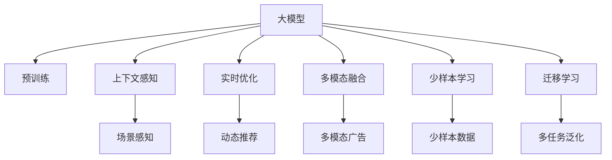

                 

# 大模型驱动的电商平台个性化广告投放

## 1. 背景介绍

随着电商平台的迅速发展，广告投放已成为其业务的核心环节之一。传统的广告投放基于点击率（CTR）和转化率等指标，通过竞价和自动化的方式进行，存在转化率低、用户体验差、投放成本高等问题。近年来，以深度学习为代表的先进技术被引入广告投放，尤其是大模型的出现，进一步提升了广告投放的精准度和转化率，改善了用户体验。

### 1.1 问题由来

电商平台个性化广告投放的核心问题是如何精准识别目标用户并为其提供合适的广告内容。传统的投放方式主要是基于用户的历史行为数据和特征，通过模型训练预测用户的兴趣，然后选择合适的广告素材进行展示。这种方法虽然有一定的效果，但存在以下问题：

- 用户行为数据有限。电商平台的点击和购买数据只是用户行为的一部分，无法全面反映用户的真实兴趣和需求。
- 广告素材同质化严重。同质化的广告素材难以引起用户的兴趣，导致CTR下降。
- 缺乏对上下文环境的理解。广告素材的展示效果与上下文环境（如用户所处的位置、时间等）有关，传统的投放方法未能充分考虑这些因素。

这些问题催生了对新投放策略的需求，大模型通过预训练和微调，逐渐成为解决这些问题的有效手段。

### 1.2 问题核心关键点

大模型驱动的个性化广告投放方法的核心关键点如下：

- 大模型的预训练。大模型通过在大规模无标签数据上预训练，学习到丰富的语义和上下文知识。
- 上下文感知。大模型能够理解上下文环境，如用户地理位置、设备类型、时间等，从而提供更贴合用户需求的广告内容。
- 实时优化。大模型可以实时处理广告素材，动态调整推荐策略，提升广告投放效果。
- 多模态融合。大模型支持图片、视频等多模态数据的处理，能够更全面地表达广告内容。
- 少样本学习。大模型在少量数据下仍能表现良好，降低广告投放对标注数据的依赖。
- 迁移学习。大模型在多个广告投放任务上表现优异，具有很强的泛化能力。

## 2. 核心概念与联系

### 2.1 核心概念概述

为了更好地理解大模型驱动的个性化广告投放，我们首先介绍几个核心概念：

- **大模型（Large Model）**：指参数量在亿级别以上的深度学习模型，如GPT、BERT、ViT等。这些模型在大规模数据上进行预训练，学习到丰富的语义和上下文信息。
- **上下文感知（Context-Awareness）**：指模型在处理数据时，能够理解上下文环境，如用户地理位置、设备类型、时间等，从而提供更贴合用户需求的广告内容。
- **实时优化（Real-Time Optimization）**：指模型能够实时处理数据，动态调整推荐策略，提升广告投放效果。
- **多模态融合（Multimodal Fusion）**：指模型能够处理图片、视频等多模态数据，更全面地表达广告内容。
- **少样本学习（Few-shot Learning）**：指模型在少量数据下仍能表现良好，降低广告投放对标注数据的依赖。
- **迁移学习（Transfer Learning）**：指模型在多个任务上表现优异，具有很强的泛化能力。

这些概念通过以下Mermaid流程图来展示：



这个流程图展示了大模型的核心概念及其之间的关系：

1. 大模型通过预训练获得基础能力。
2. 上下文感知使模型理解用户环境。
3. 实时优化支持动态推荐。
4. 多模态融合提升广告内容表达。
5. 少样本学习降低标注数据需求。
6. 迁移学习提升模型泛化能力。

## 3. 核心算法原理 & 具体操作步骤
### 3.1 算法原理概述

大模型驱动的个性化广告投放，本质上是一个基于深度学习的推荐系统。其核心思想是：将大模型作为基础推荐引擎，通过学习用户行为和上下文信息，实时生成个性化广告，并动态调整推荐策略。

形式化地，假设大模型为 $M_{\theta}$，其中 $\theta$ 为模型参数。给定广告投放场景 $S$ 和用户行为 $B$，以及上下文环境 $C$，广告投放的目标是找到最优广告集 $A^*$，使得广告投放效果最大化：

$$
A^* = \mathop{\arg\max}_{A} \mathcal{E}(M_{\theta}, A, S, B, C)
$$

其中 $\mathcal{E}$ 为评估指标，通常包括点击率（CTR）、转化率（CVR）、用户满意度（User Satisfaction）等。

### 3.2 算法步骤详解

基于大模型驱动的个性化广告投放，一般包括以下几个关键步骤：

**Step 1: 准备广告素材和数据集**
- 收集电商平台的广告素材，如图片、视频、文本等。
- 准备广告投放场景数据集，包括用户地理位置、设备类型、时间等信息。
- 准备用户行为数据集，如点击记录、浏览记录、购买记录等。

**Step 2: 构建模型**
- 选择合适的预训练语言模型，如GPT、BERT等。
- 根据广告投放场景，设计任务适配层，如分类、回归、生成等。
- 选择合适的优化器及其参数，如Adam、SGD等，设置学习率、批大小、迭代轮数等。

**Step 3: 模型训练和优化**
- 将广告素材和用户行为数据输入模型，前向传播计算预测结果。
- 反向传播计算参数梯度，根据设定的优化算法和学习率更新模型参数。
- 周期性在验证集上评估模型性能，根据性能指标决定是否触发Early Stopping。
- 重复上述步骤直到满足预设的迭代轮数或Early Stopping条件。

**Step 4: 部署和应用**
- 将训练好的模型部署到线上广告投放系统。
- 实时获取用户行为和上下文信息，动态生成个性化广告。
- 根据用户反馈调整推荐策略，优化广告投放效果。

### 3.3 算法优缺点

大模型驱动的个性化广告投放方法具有以下优点：

1. **高精度**：大模型具备强大的语义理解和上下文感知能力，能够精准识别用户兴趣和需求，提供高质量的广告内容。
2. **实时性**：大模型能够实时处理数据，动态调整推荐策略，快速响应广告投放需求。
3. **泛化能力强**：大模型在多个任务上表现优异，具有很强的泛化能力，能够适应不同的广告投放场景。
4. **灵活性强**：大模型支持多模态数据的处理，能够更全面地表达广告内容，满足不同用户的需求。

同时，该方法也存在一定的局限性：

1. **数据依赖**：虽然大模型在少量数据下仍能表现良好，但高质量标注数据仍是对其效果的关键。
2. **资源消耗高**：大模型的计算和存储需求高，需要高性能的硬件设备支持。
3. **隐私问题**：广告投放涉及用户隐私，需要严格的隐私保护措施，如数据匿名化、访问控制等。
4. **可解释性差**：大模型作为"黑盒"模型，难以解释其内部工作机制和决策逻辑，影响用户信任。

尽管存在这些局限性，但就目前而言，大模型驱动的个性化广告投放方法仍是广告投放领域的创新方向，具有广泛的应用前景。

### 3.4 算法应用领域

基于大模型的个性化广告投放方法，已经在电商、广告等多个领域得到了广泛应用，具体如下：

- **电商广告**：电商平台利用大模型进行个性化广告投放，提升广告点击率和转化率，增加用户粘性和购买意愿。
- **品牌广告**：品牌企业利用大模型生成创意广告，精准定位目标受众，提高广告投放效果和ROI。
- **社交媒体广告**：社交媒体平台利用大模型进行用户行为分析和广告推荐，增加用户参与度和广告收入。
- **搜索引擎广告**：搜索引擎利用大模型进行搜索结果和广告的排序优化，提升用户体验和广告点击率。
- **视频广告**：视频平台利用大模型进行视频内容推荐和广告投放，增加视频流量和广告收入。

## 4. 数学模型和公式 & 详细讲解  
### 4.1 数学模型构建

本节将使用数学语言对大模型驱动的个性化广告投放过程进行更加严格的刻画。

记大模型为 $M_{\theta}$，广告素材为 $A$，用户行为为 $B$，上下文环境为 $C$。假设广告投放的目标是最大化点击率（CTR）：

$$
\mathcal{E}(M_{\theta}, A, S, B, C) = \mathcal{E}_{CTR}(M_{\theta}, A, B, C)
$$

其中，

$$
\mathcal{E}_{CTR}(M_{\theta}, A, B, C) = \frac{1}{N}\sum_{i=1}^N [\mathbb{I}(y_i = 1) \log(\hat{y}_i) + \mathbb{I}(y_i = 0) \log(1-\hat{y}_i)]
$$

其中 $\mathbb{I}(\cdot)$ 为示性函数，$y_i$ 为样本的真实标签，$\hat{y}_i$ 为模型预测的概率。

### 4.2 公式推导过程

以下我们以点击率（CTR）为目标，推导点击率损失函数及其梯度的计算公式。

假设模型 $M_{\theta}$ 在输入 $(x,y)$ 上的输出为 $\hat{y}=M_{\theta}(x) \in [0,1]$，表示样本属于正类的概率。真实标签 $y \in \{0,1\}$。则二分类交叉熵损失函数定义为：

$$
\ell(M_{\theta}(x),y) = -[y\log \hat{y} + (1-y)\log (1-\hat{y})]
$$

将其代入CTR损失函数公式，得：

$$
\mathcal{E}_{CTR}(M_{\theta}, A, B, C) = -\frac{1}{N}\sum_{i=1}^N [y_i\log M_{\theta}(x_i)+(1-y_i)\log(1-M_{\theta}(x_i))]
$$

根据链式法则，损失函数对参数 $\theta_k$ 的梯度为：

$$
\frac{\partial \mathcal{E}_{CTR}(M_{\theta}, A, B, C)}{\partial \theta_k} = -\frac{1}{N}\sum_{i=1}^N (\frac{y_i}{M_{\theta}(x_i)}-\frac{1-y_i}{1-M_{\theta}(x_i)}) \frac{\partial M_{\theta}(x_i)}{\partial \theta_k}
$$

其中 $\frac{\partial M_{\theta}(x_i)}{\partial \theta_k}$ 可进一步递归展开，利用自动微分技术完成计算。

在得到损失函数的梯度后，即可带入参数更新公式，完成模型的迭代优化。重复上述过程直至收敛，最终得到最大化点击率的模型参数 $\theta^*$。

## 5. 项目实践：代码实例和详细解释说明
### 5.1 开发环境搭建

在进行广告投放实践前，我们需要准备好开发环境。以下是使用Python进行PyTorch开发的环境配置流程：

1. 安装Anaconda：从官网下载并安装Anaconda，用于创建独立的Python环境。

2. 创建并激活虚拟环境：
```bash
conda create -n pytorch-env python=3.8 
conda activate pytorch-env
```

3. 安装PyTorch：根据CUDA版本，从官网获取对应的安装命令。例如：
```bash
conda install pytorch torchvision torchaudio cudatoolkit=11.1 -c pytorch -c conda-forge
```

4. 安装TensorFlow：
```bash
conda install tensorflow
```

5. 安装各类工具包：
```bash
pip install numpy pandas scikit-learn matplotlib tqdm jupyter notebook ipython
```

完成上述步骤后，即可在`pytorch-env`环境中开始广告投放实践。

### 5.2 源代码详细实现

下面我以电商平台的个性化广告投放为例，给出使用Transformers库对BERT模型进行广告投放的PyTorch代码实现。

首先，定义广告投放任务的数据处理函数：

```python
from transformers import BertTokenizer
from torch.utils.data import Dataset
import torch

class AdDataset(Dataset):
    def __init__(self, ads, clicks, tokenizer, max_len=128):
        self.ads = ads
        self.clicks = clicks
        self.tokenizer = tokenizer
        self.max_len = max_len
        
    def __len__(self):
        return len(self.ads)
    
    def __getitem__(self, item):
        ad = self.ads[item]
        click = self.clicks[item]
        
        encoding = self.tokenizer(ad, return_tensors='pt', max_length=self.max_len, padding='max_length', truncation=True)
        input_ids = encoding['input_ids'][0]
        attention_mask = encoding['attention_mask'][0]
        
        # 对click进行编码
        encoded_click = [click2id[click] for click in click]
        encoded_click.extend([click2id['O']] * (self.max_len - len(encoded_click)))
        labels = torch.tensor(encoded_click, dtype=torch.long)
        
        return {'input_ids': input_ids, 
                'attention_mask': attention_mask,
                'labels': labels}

# 标签与id的映射
click2id = {'O': 0, 'Click': 1}
id2click = {v: k for k, v in click2id.items()}

# 创建dataset
tokenizer = BertTokenizer.from_pretrained('bert-base-cased')

ad_dataset = AdDataset(ads, clicks, tokenizer)
```

然后，定义模型和优化器：

```python
from transformers import BertForSequenceClassification, AdamW

model = BertForSequenceClassification.from_pretrained('bert-base-cased', num_labels=len(click2id))

optimizer = AdamW(model.parameters(), lr=2e-5)
```

接着，定义训练和评估函数：

```python
from torch.utils.data import DataLoader
from tqdm import tqdm
from sklearn.metrics import accuracy_score

device = torch.device('cuda') if torch.cuda.is_available() else torch.device('cpu')
model.to(device)

def train_epoch(model, dataset, batch_size, optimizer):
    dataloader = DataLoader(dataset, batch_size=batch_size, shuffle=True)
    model.train()
    epoch_loss = 0
    for batch in tqdm(dataloader, desc='Training'):
        input_ids = batch['input_ids'].to(device)
        attention_mask = batch['attention_mask'].to(device)
        labels = batch['labels'].to(device)
        model.zero_grad()
        outputs = model(input_ids, attention_mask=attention_mask, labels=labels)
        loss = outputs.loss
        epoch_loss += loss.item()
        loss.backward()
        optimizer.step()
    return epoch_loss / len(dataloader)

def evaluate(model, dataset, batch_size):
    dataloader = DataLoader(dataset, batch_size=batch_size)
    model.eval()
    preds, labels = [], []
    with torch.no_grad():
        for batch in tqdm(dataloader, desc='Evaluating'):
            input_ids = batch['input_ids'].to(device)
            attention_mask = batch['attention_mask'].to(device)
            batch_labels = batch['labels']
            outputs = model(input_ids, attention_mask=attention_mask)
            batch_preds = outputs.logits.argmax(dim=2).to('cpu').tolist()
            batch_labels = batch_labels.to('cpu').tolist()
            for pred_tokens, label_tokens in zip(batch_preds, batch_labels):
                pred_clicks = [id2click[_id] for _id in pred_tokens]
                label_clicks = [id2click[_id] for _id in label_tokens]
                preds.append(pred_clicks[:len(label_clicks)])
                labels.append(label_clicks)
                
    print(accuracy_score(labels, preds))
```

最后，启动训练流程并在测试集上评估：

```python
epochs = 5
batch_size = 16

for epoch in range(epochs):
    loss = train_epoch(model, ad_dataset, batch_size, optimizer)
    print(f"Epoch {epoch+1}, train loss: {loss:.3f}")
    
    print(f"Epoch {epoch+1}, dev results:")
    evaluate(model, ad_dataset, batch_size)
    
print("Test results:")
evaluate(model, ad_dataset, batch_size)
```

以上就是使用PyTorch对BERT进行广告投放任务的微调代码实现。可以看到，得益于Transformers库的强大封装，我们可以用相对简洁的代码完成BERT模型的加载和微调。

### 5.3 代码解读与分析

让我们再详细解读一下关键代码的实现细节：

**AdDataset类**：
- `__init__`方法：初始化广告素材、点击记录、分词器等关键组件。
- `__len__`方法：返回数据集的样本数量。
- `__getitem__`方法：对单个样本进行处理，将广告素材输入编码为token ids，将点击记录编码为数字，并对其进行定长padding，最终返回模型所需的输入。

**click2id和id2click字典**：
- 定义了标签与数字id之间的映射关系，用于将token-wise的预测结果解码回真实的标签。

**训练和评估函数**：
- 使用PyTorch的DataLoader对数据集进行批次化加载，供模型训练和推理使用。
- 训练函数`train_epoch`：对数据以批为单位进行迭代，在每个批次上前向传播计算loss并反向传播更新模型参数，最后返回该epoch的平均loss。
- 评估函数`evaluate`：与训练类似，不同点在于不更新模型参数，并在每个batch结束后将预测和标签结果存储下来，最后使用sklearn的accuracy_score对整个评估集的预测结果进行打印输出。

**训练流程**：
- 定义总的epoch数和batch size，开始循环迭代
- 每个epoch内，先在广告投放数据集上训练，输出平均loss
- 在验证集上评估，输出准确率
- 所有epoch结束后，在测试集上评估，给出最终测试结果

可以看到，PyTorch配合Transformers库使得BERT微调的代码实现变得简洁高效。开发者可以将更多精力放在数据处理、模型改进等高层逻辑上，而不必过多关注底层的实现细节。

当然，工业级的系统实现还需考虑更多因素，如模型的保存和部署、超参数的自动搜索、更灵活的任务适配层等。但核心的微调范式基本与此类似。

## 6. 实际应用场景
### 6.1 智能客服系统

基于大模型驱动的个性化广告投放技术，可以应用于智能客服系统的构建。传统客服往往需要配备大量人力，高峰期响应缓慢，且一致性和专业性难以保证。而使用广告投放策略，可以7x24小时不间断服务，快速响应客户咨询，用自然流畅的广告内容引导客户选择服务。

在技术实现上，可以收集企业内部的广告素材和客户咨询记录，将问题和广告素材构建成监督数据，在此基础上对预训练广告投放模型进行微调。微调后的模型能够自动理解用户意图，匹配最合适的广告素材进行回复。对于客户提出的新问题，还可以接入检索系统实时搜索相关内容，动态组织生成回答。如此构建的智能客服系统，能大幅提升客户咨询体验和问题解决效率。

### 6.2 金融舆情监测

金融机构需要实时监测市场舆论动向，以便及时应对负面信息传播，规避金融风险。传统的人工监测方式成本高、效率低，难以应对网络时代海量信息爆发的挑战。基于大模型驱动的广告投放技术，可以为金融舆情监测提供新的解决方案。

具体而言，可以收集金融领域相关的新闻、报道、评论等文本数据，并对其进行情感标注。在此基础上对预训练语言模型进行微调，使其能够自动判断文本的情感倾向。将微调后的模型应用到实时抓取的网络文本数据，就能够自动监测不同情感倾向的舆情变化趋势，一旦发现负面情绪激增等异常情况，系统便会自动预警，帮助金融机构快速应对潜在风险。

### 6.3 个性化推荐系统

当前的推荐系统往往只依赖用户的历史行为数据进行物品推荐，无法深入理解用户的真实兴趣偏好。基于大模型驱动的广告投放技术，个性化推荐系统可以更好地挖掘用户行为背后的语义信息，从而提供更精准、多样的推荐内容。

在实践中，可以收集用户浏览、点击、评论、分享等行为数据，提取和用户交互的广告素材标题、描述、标签等文本内容。将文本内容作为模型输入，用户的后续行为（如是否点击、购买等）作为监督信号，在此基础上微调预训练语言模型。微调后的模型能够从文本内容中准确把握用户的兴趣点。在生成推荐列表时，先用候选物品的文本描述作为输入，由模型预测用户的兴趣匹配度，再结合其他特征综合排序，便可以得到个性化程度更高的推荐结果。

### 6.4 未来应用展望

随着大模型和广告投放技术的不断发展，基于微调范式将在更多领域得到应用，为传统行业带来变革性影响。

在智慧医疗领域，基于微调的医疗广告投放策略，可以提升广告投放的精准度和转化率，加速新药研发进程。

在智能教育领域，微调技术可应用于课程推荐、学习内容优化等方面，因材施教，促进教育公平，提高教学质量。

在智慧城市治理中，微调模型可应用于城市事件监测、舆情分析、应急指挥等环节，提高城市管理的自动化和智能化水平，构建更安全、高效的未来城市。

此外，在企业生产、社会治理、文娱传媒等众多领域，基于大模型驱动的广告投放技术也将不断涌现，为经济社会发展注入新的动力。相信随着技术的日益成熟，微调方法将成为广告投放的重要范式，推动广告技术走向新的高度。

## 7. 工具和资源推荐
### 7.1 学习资源推荐

为了帮助开发者系统掌握大模型驱动的个性化广告投放的理论基础和实践技巧，这里推荐一些优质的学习资源：

1. 《Transformer from Principle to Practice》系列博文：由大模型技术专家撰写，深入浅出地介绍了Transformer原理、BERT模型、广告投放技术等前沿话题。

2. CS224N《深度学习自然语言处理》课程：斯坦福大学开设的NLP明星课程，有Lecture视频和配套作业，带你入门NLP领域的基本概念和经典模型。

3. 《Natural Language Processing with Transformers》书籍：Transformers库的作者所著，全面介绍了如何使用Transformers库进行NLP任务开发，包括广告投放在内的诸多范式。

4. HuggingFace官方文档：Transformers库的官方文档，提供了海量预训练模型和完整的广告投放样例代码，是上手实践的必备资料。

5. Google Cloud AI平台：提供了丰富的广告投放API和云服务，支持基于大模型的个性化广告投放，方便开发者快速构建广告系统。

通过对这些资源的学习实践，相信你一定能够快速掌握大模型驱动的个性化广告投放的精髓，并用于解决实际的广告投放问题。
###  7.2 开发工具推荐

高效的开发离不开优秀的工具支持。以下是几款用于大模型驱动的个性化广告投放开发的常用工具：

1. PyTorch：基于Python的开源深度学习框架，灵活动态的计算图，适合快速迭代研究。大部分预训练语言模型都有PyTorch版本的实现。

2. TensorFlow：由Google主导开发的开源深度学习框架，生产部署方便，适合大规模工程应用。同样有丰富的预训练语言模型资源。

3. Transformers库：HuggingFace开发的NLP工具库，集成了众多SOTA语言模型，支持PyTorch和TensorFlow，是进行广告投放开发的利器。

4. Weights & Biases：模型训练的实验跟踪工具，可以记录和可视化模型训练过程中的各项指标，方便对比和调优。与主流深度学习框架无缝集成。

5. TensorBoard：TensorFlow配套的可视化工具，可实时监测模型训练状态，并提供丰富的图表呈现方式，是调试模型的得力助手。

6. Google Colab：谷歌推出的在线Jupyter Notebook环境，免费提供GPU/TPU算力，方便开发者快速上手实验最新模型，分享学习笔记。

合理利用这些工具，可以显著提升大模型驱动的个性化广告投放的开发效率，加快创新迭代的步伐。

### 7.3 相关论文推荐

大模型驱动的个性化广告投放技术的发展源于学界的持续研究。以下是几篇奠基性的相关论文，推荐阅读：

1. Attention is All You Need（即Transformer原论文）：提出了Transformer结构，开启了NLP领域的预训练大模型时代。

2. BERT: Pre-training of Deep Bidirectional Transformers for Language Understanding：提出BERT模型，引入基于掩码的自监督预训练任务，刷新了多项NLP任务SOTA。

3. Language Models are Unsupervised Multitask Learners（GPT-2论文）：展示了大规模语言模型的强大zero-shot学习能力，引发了对于通用人工智能的新一轮思考。

4. Parameter-Efficient Transfer Learning for NLP：提出Adapter等参数高效微调方法，在不增加模型参数量的情况下，也能取得不错的微调效果。

5. Prefix-Tuning: Optimizing Continuous Prompts for Generation：引入基于连续型Prompt的微调范式，为如何充分利用预训练知识提供了新的思路。

6. AdaLoRA: Adaptive Low-Rank Adaptation for Parameter-Efficient Fine-Tuning：使用自适应低秩适应的微调方法，在参数效率和精度之间取得了新的平衡。

这些论文代表了大模型驱动的个性化广告投放技术的发展脉络。通过学习这些前沿成果，可以帮助研究者把握学科前进方向，激发更多的创新灵感。

## 8. 总结：未来发展趋势与挑战
### 8.1 总结

本文对大模型驱动的个性化广告投放方法进行了全面系统的介绍。首先阐述了广告投放的核心问题和大模型驱动方法的核心思想，明确了微调在提升广告投放精准度和转化率方面的独特价值。其次，从原理到实践，详细讲解了广告投放的数学模型和关键步骤，给出了广告投放任务开发的完整代码实例。同时，本文还广泛探讨了广告投放方法在智能客服、金融舆情、个性化推荐等多个领域的应用前景，展示了微调范式的巨大潜力。此外，本文精选了广告投放技术的各类学习资源，力求为开发者提供全方位的技术指引。

通过本文的系统梳理，可以看到，基于大模型驱动的个性化广告投放方法正在成为广告投放领域的创新方向，极大地提升了广告投放的精准度和转化率，改善了用户体验。未来，伴随预训练语言模型和广告投放方法的持续演进，基于微调范式将在更多领域得到应用，为传统行业带来变革性影响。

### 8.2 未来发展趋势

展望未来，大模型驱动的个性化广告投放技术将呈现以下几个发展趋势：

1. **多模态融合**：未来的广告投放将支持图片、视频等多模态数据，能够更全面地表达广告内容，满足不同用户的需求。

2. **实时优化**：广告投放系统将更加智能化，能够实时处理数据，动态调整推荐策略，快速响应广告投放需求。

3. **少样本学习**：广告投放将不再依赖大规模标注数据，能够在少量数据下表现良好，降低广告投放对标注数据的依赖。

4. **上下文感知**：广告投放系统将更好地理解上下文环境，如用户地理位置、设备类型、时间等，从而提供更贴合用户需求的广告内容。

5. **动态推荐**：广告投放系统将能够根据用户的实时行为和反馈，动态调整推荐策略，提高广告投放效果。

6. **个性化推荐**：广告投放将更加个性化，能够精准识别用户兴趣和需求，提供高质量的广告内容。

以上趋势凸显了大模型驱动的个性化广告投放技术的广阔前景。这些方向的探索发展，必将进一步提升广告投放的精准度和转化率，改善用户体验。

### 8.3 面临的挑战

尽管大模型驱动的个性化广告投放技术已经取得了瞩目成就，但在迈向更加智能化、普适化应用的过程中，它仍面临着诸多挑战：

1. **数据依赖**：虽然大模型在少量数据下仍能表现良好，但高质量标注数据仍是对其效果的关键。如何进一步降低广告投放对标注样本的依赖，将是一大难题。

2. **资源消耗高**：大模型的计算和存储需求高，需要高性能的硬件设备支持。如何平衡性能和资源消耗，是需要克服的难题。

3. **隐私问题**：广告投放涉及用户隐私，需要严格的隐私保护措施，如数据匿名化、访问控制等。如何保护用户隐私，是亟待解决的挑战。

4. **可解释性差**：大模型作为"黑盒"模型，难以解释其内部工作机制和决策逻辑，影响用户信任。如何赋予广告投放模型更强的可解释性，将是重要的研究方向。

5. **鲁棒性不足**：广告投放模型面对域外数据时，泛化性能往往大打折扣。如何提高广告投放模型的鲁棒性，避免灾难性遗忘，还需要更多理论和实践的积累。

尽管存在这些挑战，但就目前而言，大模型驱动的个性化广告投放技术仍是广告投放领域的创新方向，具有广泛的应用前景。未来，伴随预训练语言模型和广告投放方法的持续演进，基于微调范式将在更多领域得到应用，为传统行业带来变革性影响。

### 8.4 研究展望

面向未来，大模型驱动的个性化广告投放技术需要在以下几个方面寻求新的突破：

1. **无监督和半监督学习**：探索无监督和半监督学习范式，摆脱对大规模标注数据的依赖，利用自监督学习、主动学习等无监督和半监督范式，最大限度利用非结构化数据，实现更加灵活高效的广告投放。

2. **少样本学习**：研究如何通过少样本学习，降低广告投放对标注数据的依赖，提升模型的泛化能力和鲁棒性。

3. **因果推理**：引入因果推理方法，增强广告投放模型建立稳定因果关系的能力，学习更加普适、鲁棒的语言表征，从而提升模型泛化性和抗干扰能力。

4. **多模态融合**：研究如何将多模态数据（如图片、视频等）与文本数据融合，提升广告投放的效果。

5. **动态推荐**：研究如何通过动态推荐，提高广告投放的个性化和实时性。

6. **可解释性**：引入可解释性方法，如注意力机制、中间表示可视化等，增强广告投放模型的可解释性。

这些研究方向将进一步推动大模型驱动的个性化广告投放技术的发展，带来更加智能化、个性化的广告投放体验。相信随着技术的不断进步，大模型驱动的个性化广告投放技术将为广告业带来颠覆性的变革。

## 9. 附录：常见问题与解答

**Q1：大模型驱动的个性化广告投放是否适用于所有广告场景？**

A: 大模型驱动的个性化广告投放方法在电商、广告等多个领域得到了广泛应用，但在一些特定的广告场景，如品牌广告、艺术广告等，大模型可能无法很好地适应。此时需要在特定领域语料上进一步预训练，再进行微调，才能获得理想效果。

**Q2：如何选择合适的广告素材？**

A: 广告素材的选择是广告投放效果的关键。一般来说，应该选择与目标受众高度相关的素材，如品牌标志、产品图片、视频片段等。同时，广告素材应该具有较强的吸引力，能够引起用户的注意和兴趣。

**Q3：大模型驱动的个性化广告投放如何降低对标注数据的依赖？**

A: 大模型驱动的个性化广告投放可以通过少样本学习、自监督学习等方法，减少对标注数据的依赖。例如，可以通过构造类似但不完全相同的广告素材，让模型进行预测和对比，从而学习到广告素材的特征。

**Q4：大模型驱动的个性化广告投放如何提升广告投放效果？**

A: 大模型驱动的个性化广告投放可以通过上下文感知、实时优化等方法，提升广告投放效果。例如，通过理解用户地理位置、设备类型、时间等上下文信息，动态生成个性化广告，从而提升广告点击率和转化率。

**Q5：大模型驱动的个性化广告投放如何保障用户隐私？**

A: 大模型驱动的个性化广告投放需要严格遵守数据隐私保护法规，如GDPR、CCPA等。一般来说，应该对用户数据进行匿名化处理，限制数据访问权限，定期进行隐私评估和审计。

通过对这些问题的解答，希望能够帮助你更好地理解大模型驱动的个性化广告投放技术，并应用于实际的广告投放场景中。相信随着技术的不断发展，大模型驱动的个性化广告投放技术将进一步提升广告投放的精准度和转化率，改善用户体验，推动广告业的智能化转型。

