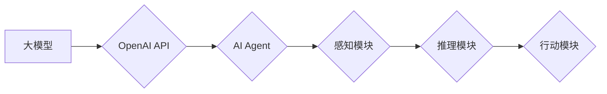

> 大模型、OpenAI API、Agent开发、对话系统、人工智能、自然语言处理、机器学习

## 1. 背景介绍

近年来，大模型技术取得了飞速发展，其强大的语言理解和生成能力为人工智能领域带来了革命性的变革。OpenAI作为一家领先的AI研究机构，推出了GPT-3、GPT-4等一系列强大的语言模型，并开放了其API接口，使得开发者能够轻松地将这些模型集成到自己的应用中。

基于大模型的AI Agent的概念也逐渐兴起，它指的是能够自主学习、推理、决策并与用户进行交互的智能代理。AI Agent可以广泛应用于各种场景，例如聊天机器人、智能客服、自动写作、代码生成等。

## 2. 核心概念与联系

### 2.1 大模型

大模型是指参数量巨大、训练数据海量的人工智能模型。它们通过学习海量文本数据，掌握了丰富的语言知识和模式，能够进行复杂的语言理解和生成任务。

### 2.2 OpenAI API

OpenAI API是OpenAI开放给开发者的接口，允许开发者调用OpenAI的预训练模型，例如GPT-3、DALL-E等，进行各种任务，例如文本生成、翻译、问答等。

### 2.3 AI Agent

AI Agent是一种能够自主学习、推理、决策并与环境交互的智能代理。它通常由以下几个核心组件组成：

* **感知模块:** 收集环境信息，例如用户输入、传感器数据等。
* **推理模块:** 对收集到的信息进行分析和理解，做出决策。
* **行动模块:** 执行决策，与环境进行交互，例如生成文本、控制机器人等。

**核心概念与联系流程图:**



## 3. 核心算法原理 & 具体操作步骤

### 3.1 算法原理概述

AI Agent的开发主要依赖于大模型的语言理解和生成能力，以及强化学习算法。

* **语言理解:** 大模型通过训练学习了语言的语法和语义，能够理解用户的自然语言输入。
* **强化学习:** AI Agent通过与环境交互，学习如何做出最优决策，以获得最大的奖励。

### 3.2 算法步骤详解

1. **环境搭建:** 创建一个模拟真实世界的环境，例如聊天机器人需要模拟用户与机器人的对话场景。
2. **模型选择:** 选择合适的OpenAI API模型，例如GPT-3可以用于文本生成和理解。
3. **训练数据准备:** 收集和准备训练数据，例如聊天机器人需要准备大量的对话数据。
4. **模型训练:** 使用训练数据训练AI Agent，使其能够理解用户输入并生成合适的回复。
5. **评估和优化:** 评估AI Agent的性能，并根据评估结果进行模型调整和优化。

### 3.3 算法优缺点

**优点:**

* **强大的语言能力:** 基于大模型的AI Agent能够理解和生成自然流畅的语言。
* **自主学习能力:** 强化学习算法使AI Agent能够自主学习和改进。
* **广泛应用场景:** AI Agent可以应用于各种场景，例如聊天机器人、智能客服、自动写作等。

**缺点:**

* **训练成本高:** 大模型的训练需要大量的计算资源和时间。
* **数据依赖性强:** AI Agent的性能取决于训练数据的质量和数量。
* **伦理风险:** AI Agent的应用可能带来一些伦理风险，例如生成虚假信息、偏见等。

### 3.4 算法应用领域

* **聊天机器人:** 提供智能对话服务，例如客服机器人、陪伴机器人等。
* **智能客服:** 自动处理用户咨询，提高服务效率。
* **自动写作:** 自动生成文章、报告、代码等文本内容。
* **个性化推荐:** 根据用户的喜好推荐商品、服务等。
* **教育辅助:** 提供个性化学习辅导、智能答疑等服务。

## 4. 数学模型和公式 & 详细讲解 & 举例说明

### 4.1 数学模型构建

AI Agent的决策过程可以建模为马尔可夫决策过程 (MDP)。

* **状态空间 (S):** 环境可能存在的各种状态。
* **动作空间 (A):** AI Agent可以执行的动作。
* **转移概率 (P):** 从一个状态执行一个动作后转移到另一个状态的概率。
* **奖励函数 (R):** AI Agent在某个状态执行某个动作后获得的奖励。

### 4.2 公式推导过程

目标是找到一个策略 $\pi$，使得AI Agent在与环境交互的过程中获得最大的总奖励。

$$
\max_{\pi} \mathbb{E}_{\pi} \sum_{t=0}^{\infty} \gamma^t R_t
$$

其中：

* $\mathbb{E}_{\pi}$ 表示根据策略 $\pi$ 的期望值。
* $\gamma$ 是折扣因子，控制未来奖励的权重。
* $R_t$ 是在时间步 $t$ 获得的奖励。

### 4.3 案例分析与讲解

例如，训练一个简单的聊天机器人，状态空间可以是用户的输入文本，动作空间可以是机器人回复的文本，奖励函数可以根据用户的反馈来定义。

通过强化学习算法，例如Q-learning，AI Agent可以学习到最佳的回复策略，使得与用户的对话更加自然流畅。

## 5. 项目实践：代码实例和详细解释说明

### 5.1 开发环境搭建

* Python 3.7+
* OpenAI API 
* 库: transformers, requests

### 5.2 源代码详细实现

```python
import openai
import requests

openai.api_key = "YOUR_API_KEY"

def generate_response(prompt):
    response = openai.Completion.create(
        engine="text-davinci-003",
        prompt=prompt,
        max_tokens=150,
        temperature=0.7
    )
    return response.choices[0].text.strip()

def main():
    while True:
        user_input = input("您: ")
        if user_input.lower() == "exit":
            break
        response = generate_response(user_input)
        print("机器人: ", response)

if __name__ == "__main__":
    main()
```

### 5.3 代码解读与分析

* **API Key:** 首先需要获取OpenAI API Key，并将其设置到代码中。
* **generate_response 函数:** 
    * 使用 `openai.Completion.create` 函数调用OpenAI API，生成文本回复。
    * `engine`: 指定使用的模型，这里使用 `text-davinci-003`。
    * `prompt`: 用户输入的文本。
    * `max_tokens`: 生成文本的最大长度。
    * `temperature`: 控制文本生成的随机性。
* **main 函数:**
    * 创建一个无限循环，不断接收用户输入。
    * 如果用户输入 "exit"，则退出循环。
    * 调用 `generate_response` 函数获取机器人回复。
    * 打印机器人回复。

### 5.4 运行结果展示

```
您: 你好
机器人: 你好！有什么可以帮你的吗？
您: 你是谁？
机器人: 我是一个由OpenAI训练的大型语言模型。
您: 你能写诗吗？
机器人: 当然可以！你想写什么样的诗？
您: 写一首关于春天的诗
机器人: 春风拂面暖洋洋，
花儿盛开香满园。
小鸟歌唱枝头俏，
万物复苏生机盎。
您: exit
```

## 6. 实际应用场景

### 6.1 聊天机器人

AI Agent可以构建出更加智能、自然、富有表现力的聊天机器人，能够与用户进行更深入、更自然的对话。

### 6.2 智能客服

AI Agent可以自动处理用户咨询，例如订单查询、退换货、常见问题解答等，提高客服效率，降低人工成本。

### 6.3 自动写作

AI Agent可以根据用户的需求自动生成各种文本内容，例如文章、报告、邮件、代码等，提高写作效率，解放人力。

### 6.4 未来应用展望

* **个性化教育:** AI Agent可以根据学生的学习进度和特点提供个性化的学习辅导和答疑服务。
* **医疗辅助:** AI Agent可以辅助医生诊断疾病、制定治疗方案，提高医疗效率和准确性。
* **金融服务:** AI Agent可以提供个性化的理财建议、风险评估等服务，帮助用户更好地管理财务。

## 7. 工具和资源推荐

### 7.1 学习资源推荐

* **OpenAI 官方文档:** https://platform.openai.com/docs/
* **HuggingFace Transformers:** https://huggingface.co/docs/transformers/index
* **DeepMind AlphaStar:** https://deepmind.com/blog/alphastar-mastering-starcraft-ii-with-deep-reinforcement-learning/

### 7.2 开发工具推荐

* **Python:** https://www.python.org/
* **Jupyter Notebook:** https://jupyter.org/
* **Google Colab:** https://colab.research.google.com/

### 7.3 相关论文推荐

* **Attention Is All You Need:** https://arxiv.org/abs/1706.03762
* **BERT: Pre-training of Deep Bidirectional Transformers for Language Understanding:** https://arxiv.org/abs/1810.04805
* **GPT-3: Language Models are Few-Shot Learners:** https://arxiv.org/abs/2005.14165

## 8. 总结：未来发展趋势与挑战

### 8.1 研究成果总结

近年来，大模型和AI Agent技术取得了显著进展，为人工智能的应用带来了新的可能性。

### 8.2 未来发展趋势

* **模型规模和能力的提升:** 未来大模型的规模和能力将会进一步提升，能够处理更复杂的任务，提供更智能的服务。
* **多模态AI Agent:** 未来AI Agent将不仅仅是文本交互，还会支持图像、音频、视频等多模态交互。
* **联邦学习和隐私保护:** 未来AI Agent的训练和部署将更加注重数据隐私和安全，例如使用联邦学习技术。

### 8.3 面临的挑战

* **数据获取和标注:** 大模型的训练需要海量高质量的数据，数据获取和标注仍然是一个挑战。
* **模型解释性和可信度:** 大模型的决策过程往往难以解释，如何提高模型的透明度和可信度是一个重要问题。
* **伦理风险和社会影响:** AI Agent的应用可能带来一些伦理风险和社会影响，需要进行深入的思考和研究。

### 8.4 研究展望

未来，AI Agent技术将继续发展，为人类社会带来更多益处。我们需要加强对AI技术的研究和探索，并积极应对其带来的挑战，确保AI技术能够安全、可持续地发展。

## 9. 附录：常见问题与解答

### 9.1 如何获取OpenAI API Key？

访问OpenAI官网 (https://openai.com/)，注册账号并申请API Key。

### 9.2 如何选择合适的OpenAI模型？

根据您的应用场景选择合适的模型。例如，需要生成创意文本可以使用GPT-3，需要进行代码生成可以使用 Codex。

### 9.3 如何解决AI Agent生成的文本质量问题？

您可以通过调整模型参数、增加训练数据、改进训练策略等方法来提高AI Agent生成的文本质量。


作者：禅与计算机程序设计艺术 / Zen and the Art of Computer Programming 
<end_of_turn>