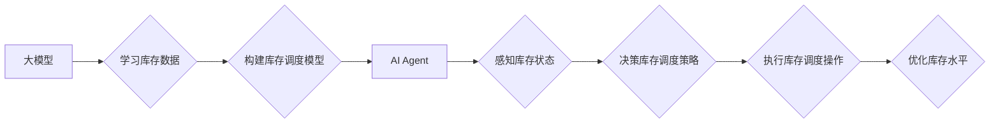

> 大模型、AI Agent、库存调度、自动优化、机器学习、深度学习、强化学习

## 1. 背景介绍

在当今数字化时代，企业面临着日益复杂的供应链管理挑战。库存管理作为供应链管理的核心环节之一，直接影响着企业的运营效率、成本控制和客户满意度。传统的库存调度方法往往依赖于经验和规则，难以适应市场需求的快速变化和供应链的复杂性。

随着人工智能技术的快速发展，大模型和AI Agent技术为库存调度带来了新的机遇。大模型能够学习和理解海量数据中的复杂模式，而AI Agent则可以根据学习到的知识自动执行库存调度任务，实现智能化、自动化和优化。

## 2. 核心概念与联系

### 2.1 大模型

大模型是指参数量巨大、训练数据量庞大的深度学习模型。它们能够在自然语言处理、图像识别、语音合成等多个领域展现出强大的能力。

### 2.2 AI Agent

AI Agent是指能够感知环境、做出决策并执行行动的智能体。它可以自主学习和适应环境变化，实现特定任务的自动化执行。

### 2.3 库存调度

库存调度是指根据企业的需求、市场趋势和供应链情况，合理规划和控制库存水平，以满足客户需求并降低库存成本。

**核心概念与联系的Mermaid流程图:**



## 3. 核心算法原理 & 具体操作步骤

### 3.1 算法原理概述

自动库存调度的核心算法通常基于机器学习和强化学习技术。

* **机器学习:** 利用历史库存数据训练预测模型，预测未来需求和库存水平。
* **强化学习:** 通过试错学习，优化库存调度策略，最大化收益并最小化成本。

### 3.2 算法步骤详解

1. **数据收集和预处理:** 收集历史库存数据、销售数据、供应商信息等，并进行清洗、转换和特征工程。
2. **模型训练:** 利用机器学习算法训练预测模型，例如线性回归、ARIMA模型等，预测未来需求和库存水平。
3. **策略优化:** 利用强化学习算法，例如Q学习、SARSA等，优化库存调度策略，例如订货量、补货时间等。
4. **策略执行:** 根据优化后的策略，自动执行库存调度操作，例如下订单、安排运输等。
5. **性能评估:** 评估算法的性能，例如库存周转率、缺货率等，并根据评估结果进行模型调整和策略优化。

### 3.3 算法优缺点

**优点:**

* 自动化程度高，提高效率。
* 能够适应市场需求变化。
* 优化库存水平，降低成本。

**缺点:**

* 需要大量数据进行训练。
* 模型训练和优化需要专业知识。
* 算法的性能受数据质量影响。

### 3.4 算法应用领域

自动库存调度算法广泛应用于零售、制造、物流等多个领域。

## 4. 数学模型和公式 & 详细讲解 & 举例说明

### 4.1 数学模型构建

**库存水平模型:**

$$
S_t = S_{t-1} + D_t - O_t
$$

其中:

* $S_t$：时间t时刻的库存水平
* $S_{t-1}$：时间t-1时刻的库存水平
* $D_t$：时间t时刻的需求量
* $O_t$：时间t时刻的订货量

**需求预测模型:**

$$
D_t = f(S_{t-1}, O_{t-1}, T_t)
$$

其中:

* $f$：需求预测函数
* $T_t$：时间t时刻的外部因素，例如季节、促销活动等

**订货量优化模型:**

$$
O_t = g(S_{t-1}, D_t, C_o, C_h)
$$

其中:

* $g$：订货量优化函数
* $C_o$：订货成本
* $C_h$：持有成本

### 4.2 公式推导过程

**库存成本最小化:**

目标函数:

$$
Minimize \quad C = C_o \cdot O_t + C_h \cdot S_t
$$

约束条件:

* $S_t \geq 0$
* $O_t \geq 0$

利用拉格朗日乘数法等优化方法，可以求解出最优的订货量和库存水平。

### 4.3 案例分析与讲解

假设一家零售企业需要对商品A进行库存调度。

* 历史数据显示，商品A的平均需求量为100件/周。
* 订货成本为每件10元，持有成本为每件每周2元。
* 企业希望将库存水平控制在安全库存水平以下，以避免缺货风险。

利用上述模型和公式，可以计算出最优的订货量和库存水平，以最小化库存成本。

## 5. 项目实践：代码实例和详细解释说明

### 5.1 开发环境搭建

* Python 3.x
* TensorFlow/PyTorch
* scikit-learn
* Pandas
* Matplotlib

### 5.2 源代码详细实现

```python
# 导入必要的库
import pandas as pd
from sklearn.linear_model import LinearRegression

# 加载历史库存数据
data = pd.read_csv('inventory_data.csv')

# 数据预处理
X = data[['previous_week_demand', 'previous_week_order']]
y = data['current_week_demand']

# 训练线性回归模型
model = LinearRegression()
model.fit(X, y)

# 预测未来一周的需求量
future_demand = model.predict([[100, 50]])  # 假设上周需求量为100件，订货量为50件

# 计算最优订货量
# ...
```

### 5.3 代码解读与分析

* 代码首先导入必要的库。
* 然后加载历史库存数据，并进行数据预处理，提取特征和目标变量。
* 训练线性回归模型，预测未来一周的需求量。
* 最后根据预测的需求量和库存成本模型，计算最优订货量。

### 5.4 运行结果展示

运行代码后，可以得到预测的未来一周需求量和最优订货量。

## 6. 实际应用场景

自动库存调度工具可以应用于各种行业和场景，例如：

* **零售业:** 自动优化商品库存水平，减少缺货和积压库存。
* **制造业:** 优化原材料和半成品库存，提高生产效率。
* **物流业:** 优化仓储库存，提高物流效率。

### 6.4 未来应用展望

随着人工智能技术的不断发展，自动库存调度工具将更加智能化、自动化和精准化。

* **更强大的预测模型:** 利用更先进的机器学习和深度学习算法，提高需求预测的准确性。
* **更智能的决策策略:** 利用强化学习算法，优化库存调度策略，最大化收益并最小化成本。
* **更广泛的应用场景:** 应用于更多行业和场景，例如医疗、教育等。

## 7. 工具和资源推荐

### 7.1 学习资源推荐

* **书籍:**
    * 《Reinforcement Learning: An Introduction》
    * 《Deep Learning》
* **在线课程:**
    * Coursera: Machine Learning
    * Udacity: Deep Learning Nanodegree

### 7.2 开发工具推荐

* **Python:** 
* **TensorFlow/PyTorch:** 深度学习框架
* **scikit-learn:** 机器学习库
* **Pandas:** 数据处理库
* **Matplotlib:** 数据可视化库

### 7.3 相关论文推荐

* **Deep Reinforcement Learning for Inventory Control**
* **A Survey of Reinforcement Learning for Inventory Management**

## 8. 总结：未来发展趋势与挑战

### 8.1 研究成果总结

自动库存调度工具基于大模型和AI Agent技术，能够有效提高库存管理效率，降低成本，并适应市场需求变化。

### 8.2 未来发展趋势

未来，自动库存调度工具将更加智能化、自动化和精准化，应用于更多行业和场景。

### 8.3 面临的挑战

* 数据质量问题
* 模型训练和优化难度
* 算法解释性和可解释性

### 8.4 研究展望

未来研究方向包括：

* 开发更强大的预测模型和决策策略
* 提高算法的解释性和可解释性
* 将自动库存调度工具应用于更多行业和场景

## 9. 附录：常见问题与解答

* **Q1: 自动库存调度工具是否会取代人类库存管理人员？**

* **A1:** 自动库存调度工具可以自动化许多库存管理任务，但它并不会完全取代人类库存管理人员。人类仍然需要负责制定策略、监控系统运行和解决复杂问题。

* **Q2: 自动库存调度工具需要哪些数据才能运行？**

* **A2:** 自动库存调度工具需要历史库存数据、销售数据、供应商信息等数据才能运行。

* **Q3: 自动库存调度工具的成本如何？**

* **A3:** 自动库存调度工具的成本取决于具体的功能和复杂度，一般来说，其成本可以通过提高效率和降低库存成本来抵消。


作者：禅与计算机程序设计艺术 / Zen and the Art of Computer Programming 
<end_of_turn>