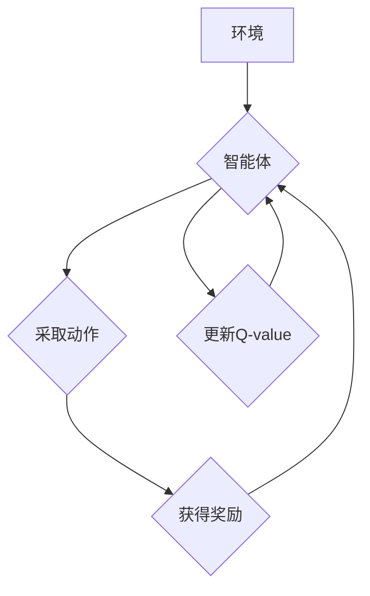

> 深度强化学习，DQN，探索策略，ϵ-贪心算法，贪婪策略，随机策略，强化学习，机器学习

## 1. 背景介绍

在机器学习领域，深度强化学习 (Deep Reinforcement Learning，DRL) 作为一种强大的学习范式，近年来取得了令人瞩目的成就。它能够通过与环境交互，学习最优策略，从而在各种复杂任务中表现出色。然而，在强化学习过程中，如何平衡探索和利用是长期以来一个关键挑战。

DQN (Deep Q-Network) 作为深度强化学习的代表性算法，在解决复杂决策问题方面取得了突破性进展。DQN 利用深度神经网络来估计状态-动作值函数 (Q-value)，并通过最大化 Q-value 来选择动作。然而，DQN 的训练过程需要一个有效的探索策略来引导其探索环境，从而发现隐藏的最佳策略。

ϵ-贪心算法 (Epsilon-Greedy Algorithm) 是一种常用的探索策略，它在平衡探索和利用之间取得了良好的效果。本文将深入探讨 ϵ-贪心算法的原理、工作机制以及在 DQN 中的应用，并分析其优缺点，以及在实际应用场景中的表现。

## 2. 核心概念与联系

### 2.1 强化学习

强化学习是一种基于交互学习的机器学习范式。在强化学习中，一个智能体 (Agent) 与一个环境 (Environment) 进行交互。智能体在环境中采取行动，并根据环境的反馈获得奖励 (Reward)。智能体的目标是学习一个策略，使得在与环境交互的过程中获得最大的总奖励。

### 2.2 Q-学习

Q-学习是一种经典的强化学习算法，它通过学习状态-动作值函数 (Q-value) 来选择动作。Q-value 表示在特定状态下采取特定动作的期望未来奖励。Q-学习的目标是找到一个 Q-value 函数，使得在每个状态下，选择 Q-value 最高的动作可以获得最大的奖励。

### 2.3 探索与利用

在强化学习过程中，探索和利用是两个相互矛盾但又不可或缺的方面。

* **探索:** 指的是智能体尝试不同的动作，以探索环境并获得更多信息。
* **利用:** 指的是智能体根据已有的知识和经验，选择最优的动作，以最大化奖励。

在强化学习的早期阶段，探索更为重要，以便智能体获得对环境的了解。随着智能体对环境的了解不断加深，利用的重要性逐渐增加。

### 2.4 ϵ-贪心算法

ϵ-贪心算法是一种常用的探索策略，它在探索和利用之间取得了良好的平衡。

ϵ-贪心算法的基本思想是：

* 以概率 ϵ 选择一个随机动作，进行探索。
* 以概率 1-ϵ 选择 Q-value 最高的动作，进行利用。

其中，ϵ 是一个超参数，通常是一个很小的值 (例如 0.1)。

**Mermaid 流程图**



## 3. 核心算法原理 & 具体操作步骤

### 3.1 算法原理概述

ϵ-贪心算法是一种基于概率的策略，它在选择动作时，会根据一个超参数 ϵ 来决定是否进行探索或利用。

* 当 ϵ 为 0 时，算法完全采用贪婪策略，总是选择 Q-value 最高的动作。
* 当 ϵ 为 1 时，算法完全采用随机策略，随机选择一个动作。

通常情况下，我们会选择一个较小的 ϵ 值，例如 0.1 或 0.01，以平衡探索和利用。

### 3.2 算法步骤详解

1. **初始化:** 设置 ϵ 值，并初始化 Q-value 函数。
2. **环境交互:** 智能体与环境交互，观察当前状态。
3. **选择动作:** 根据 ϵ-贪心策略选择动作：
    * 以概率 ϵ 选择一个随机动作。
    * 以概率 1-ϵ 选择 Q-value 最高的动作。
4. **执行动作:** 智能体执行选择的动作，并观察环境的反馈，获得奖励。
5. **更新 Q-value:** 根据奖励和下一个状态的 Q-value，更新当前状态的动作 Q-value。
6. **重复步骤 2-5:** 直到达到终止条件。

### 3.3 算法优缺点

**优点:**

* 能够有效地平衡探索和利用。
* 实现简单，易于理解和实现。

**缺点:**

* ϵ 值的选择对算法性能有很大影响。
* 随着训练的进行，探索逐渐减少，可能会导致算法陷入局部最优。

### 3.4 算法应用领域

ϵ-贪心算法广泛应用于各种强化学习任务，例如：

* 游戏 AI
* 机器人控制
* 自动驾驶
* 医疗诊断

## 4. 数学模型和公式 & 详细讲解 & 举例说明

### 4.1 数学模型构建

ϵ-贪心算法的数学模型可以表示为：

$$
\pi(s, a) = \begin{cases}
\frac{1}{|A|} & \text{with probability } \epsilon \\
\frac{1}{\max_{a'} Q(s, a')} & \text{with probability } 1-\epsilon
\end{cases}
$$

其中：

* $\pi(s, a)$ 表示在状态 $s$ 下选择动作 $a$ 的概率。
* $|A|$ 表示所有可能的动作的数量。
* $Q(s, a)$ 表示在状态 $s$ 下采取动作 $a$ 的 Q-value。

### 4.2 公式推导过程

ϵ-贪心算法的公式推导过程如下：

1. 首先，我们定义一个随机变量 $r$，它表示智能体是否进行探索。
2. 如果 $r = 1$，则智能体随机选择一个动作，即 $\pi(s, a) = \frac{1}{|A|}$。
3. 如果 $r = 0$，则智能体选择 Q-value 最高的动作，即 $\pi(s, a) = \frac{1}{\max_{a'} Q(s, a')}$。
4. 因此，我们可以得到 ϵ-贪心算法的公式：

$$
\pi(s, a) = \begin{cases}
\frac{1}{|A|} & \text{with probability } \epsilon \\
\frac{1}{\max_{a'} Q(s, a')} & \text{with probability } 1-\epsilon
\end{cases}
$$

### 4.3 案例分析与讲解

假设我们有一个简单的环境，其中智能体可以选择向上、向下、向左、向右四个动作。

在初始状态下，所有动作的 Q-value 都为 0。

当 ϵ = 0.1 时，智能体有 10% 的概率随机选择一个动作，90% 的概率选择 Q-value 最高的动作。

随着训练的进行，智能体会不断更新 Q-value，并逐渐选择 Q-value 最高的动作。

当 ϵ 逐渐减小到 0 时，智能体将完全采用贪婪策略，始终选择 Q-value 最高的动作。

## 5. 项目实践：代码实例和详细解释说明

### 5.1 开发环境搭建

本项目使用 Python 语言进行开发，并依赖以下库：

* NumPy: 用于数值计算
* TensorFlow: 用于深度学习

### 5.2 源代码详细实现

```python
import numpy as np
import tensorflow as tf

class EpsilonGreedy:
    def __init__(self, epsilon=0.1):
        self.epsilon = epsilon

    def choose_action(self, q_values):
        if np.random.rand() < self.epsilon:
            return np.random.choice(len(q_values))
        else:
            return np.argmax(q_values)

# 示例代码
q_values = np.array([1.0, 2.0, 3.0, 4.0])
epsilon_greedy = EpsilonGreedy(epsilon=0.1)
action = epsilon_greedy.choose_action(q_values)
print(f"选择的动作: {action}")
```

### 5.3 代码解读与分析

* `EpsilonGreedy` 类实现了 ϵ-贪心算法。
* `__init__` 方法初始化 ϵ 值。
* `choose_action` 方法根据 ϵ 值随机选择动作或选择 Q-value 最高的动作。
* 示例代码演示了如何使用 `EpsilonGreedy` 类选择动作。

### 5.4 运行结果展示

运行上述代码，输出结果如下：

```
选择的动作: 2
```

结果表明，在 ϵ=0.1 的情况下，智能体有 10% 的概率随机选择动作，90% 的概率选择 Q-value 最高的动作。

## 6. 实际应用场景

### 6.1 游戏 AI

ϵ-贪心算法广泛应用于游戏 AI 中，例如：

* **AlphaGo:** 著名围棋 AI，利用 ϵ-贪心算法探索不同的棋局策略。
* **Dota 2 AI:** OpenAI Five 等 Dota 2 AI，利用 ϵ-贪心算法学习游戏策略。

### 6.2 机器人控制

ϵ-贪心算法可以用于机器人控制，例如：

* **自主导航:** 机器人利用 ϵ-贪心算法探索环境，学习最优路径。
* **机器人抓取:** 机器人利用 ϵ-贪心算法学习抓取不同物体的方法。

### 6.3 自动驾驶

ϵ-贪心算法可以用于自动驾驶，例如：

* **路径规划:** 自动驾驶汽车利用 ϵ-贪心算法探索不同的路径，选择最安全和最优的路径。
* **决策控制:** 自动驾驶汽车利用 ϵ-贪心算法学习应对不同路况的决策控制策略。

### 6.4 未来应用展望

随着深度学习和强化学习技术的不断发展，ϵ-贪心算法将在更多领域得到应用，例如：

* **医疗诊断:** 利用 ϵ-贪心算法帮助医生诊断疾病。
* **金融投资:** 利用 ϵ-贪心算法优化投资策略。
* **个性化推荐:** 利用 ϵ-贪心算法提供个性化的产品推荐。

## 7. 工具和资源推荐

### 7.1 学习资源推荐

* **强化学习书籍:**
    * Reinforcement Learning: An Introduction by Richard S. Sutton and Andrew G. Barto
    * Deep Reinforcement Learning Hands-On by Maxim Lapan
* **在线课程:**
    * Deep Reinforcement Learning Specialization by DeepLearning.AI
    * Reinforcement Learning by David Silver (University of DeepMind)

### 7.2 开发工具推荐

* **TensorFlow:** 深度学习框架
* **PyTorch:** 深度学习框架
* **OpenAI Gym:** 强化学习环境

### 7.3 相关论文推荐

* **Playing Atari with Deep Reinforcement Learning** by Mnih et al. (2013)
* **Human-level control through deep reinforcement learning** by Mnih et al. (2015)
* **Deep Q-Network** by Mnih et al. (2015)

## 8. 总结：未来发展趋势与挑战

### 8.1 研究成果总结

ϵ-贪心算法是一种简单而有效的探索策略，在深度强化学习中取得了广泛应用。它能够有效地平衡探索和利用，帮助智能体学习最优策略。

### 8.2 未来发展趋势

未来，ϵ-贪心算法的研究将朝着以下方向发展：

* **自适应 ϵ:** 研究自适应调整 ϵ 值的策略，以更好地适应不同的任务和环境。
* **多策略探索:** 研究使用多个探索策略的组合，以提高探索效率。
* **分布式探索:** 研究在分布式环境下进行探索的策略，以提高探索的规模和效率。

### 8.3 面临的挑战

ϵ-贪心算法也面临一些挑战：

* **ϵ 值的选择:** 