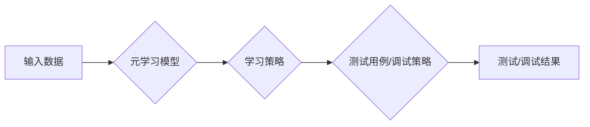

> 元学习，软件测试，软件调试，映射，人工智能，机器学习

## 1. 背景介绍

在软件开发领域，测试和调试是不可或缺的环节，它们直接影响软件的质量和可靠性。传统的测试和调试方法往往依赖于人工经验和规则，效率低下，难以应对复杂软件系统的挑战。随着人工智能技术的快速发展，元学习（Meta-Learning）应运而生，为软件测试和调试带来了新的思路和可能性。

元学习是一种机器学习的范式，它旨在学习如何学习。与传统的监督学习不同，元学习关注的是学习学习算法本身，而不是特定任务的模型。这意味着元学习模型能够快速适应新的任务，并利用之前学习到的知识进行优化。

## 2. 核心概念与联系

**2.1 元学习的原理**

元学习的核心思想是将学习过程看作是一个“学习如何学习”的过程。它通过训练一个“元模型”，这个元模型能够学习不同任务的学习策略，并根据新的任务快速调整学习参数，从而实现高效的学习。

**2.2 元学习与软件测试和调试的联系**

元学习可以应用于软件测试和调试，主要体现在以下几个方面：

* **自动测试用例生成:** 元学习模型可以学习从代码和文档中提取测试用例的规律，自动生成测试用例，提高测试效率。
* **智能缺陷定位:** 元学习模型可以学习软件缺陷的特征，通过分析代码和测试结果，智能定位缺陷，缩短调试时间。
* **自动化测试脚本优化:** 元学习模型可以学习测试脚本的执行情况，并根据反馈信息优化测试脚本，提高测试覆盖率和准确性。

**2.3 元学习架构**



## 3. 核心算法原理 & 具体操作步骤

**3.1 算法原理概述**

基于元学习的软件测试和调试算法通常采用以下核心算法：

* **元学习算法:** 常见的元学习算法包括MAML（Model-Agnostic Meta-Learning）、Prototypical Networks、 Reptile等。这些算法通过训练元模型，使其能够快速适应新的任务。
* **测试用例生成算法:** 常用的测试用例生成算法包括进化算法、遗传算法、模拟退火算法等。这些算法可以根据代码和文档生成测试用例，并通过评估测试用例的覆盖率和有效性进行优化。
* **缺陷定位算法:** 常用的缺陷定位算法包括静态分析、动态分析、机器学习等。这些算法可以分析代码和测试结果，识别潜在的缺陷。

**3.2 算法步骤详解**

**3.2.1 元学习模型训练**

1. 收集大量软件代码和测试用例数据。
2. 使用元学习算法训练元模型，使其能够学习不同任务的学习策略。

**3.2.2 测试用例生成**

1. 将新的软件代码作为输入，输入到训练好的元模型中。
2. 元模型根据学习到的策略，生成测试用例。
3. 使用评估指标评估测试用例的覆盖率和有效性，并进行优化。

**3.2.3 缺陷定位**

1. 将测试结果作为输入，输入到训练好的元模型中。
2. 元模型根据学习到的策略，定位潜在的缺陷。
3. 使用人工验证和分析，确认缺陷的真实性。

**3.3 算法优缺点**

**优点:**

* **自动化程度高:** 元学习可以自动化测试用例生成和缺陷定位，提高效率。
* **适应性强:** 元学习模型能够快速适应新的任务，并利用之前学习到的知识进行优化。
* **可扩展性强:** 元学习算法可以扩展到处理更复杂软件系统。

**缺点:**

* **数据依赖性强:** 元学习算法需要大量的数据进行训练，否则效果不佳。
* **模型复杂度高:** 元学习模型的训练和部署需要较高的计算资源。

**3.4 算法应用领域**

基于元学习的软件测试和调试算法可以应用于以下领域:

* **Web 应用开发:** 自动生成测试用例，提高Web应用的测试覆盖率。
* **移动应用开发:** 自动生成测试用例，提高移动应用的测试效率。
* **嵌入式系统开发:** 自动生成测试用例，提高嵌入式系统的可靠性。

## 4. 数学模型和公式 & 详细讲解 & 举例说明

**4.1 数学模型构建**

元学习模型通常采用神经网络结构，其目标是学习一个通用的学习策略，能够适应不同的任务。

**4.2 公式推导过程**

MAML算法的目标是找到一个元模型参数θ，使得在新的任务上，模型能够快速适应并达到最佳性能。

MAML算法的损失函数可以表示为：

$$L(\theta) = \sum_{i=1}^{N} \frac{1}{K} \sum_{j=1}^{K} \mathcal{L}(f_{\theta}(x_i^j), y_i^j)$$

其中：

* θ：元模型参数
* N：训练任务数量
* K：每个任务的样本数量
* $x_i^j$：第i个任务的第j个样本
* $y_i^j$：第i个任务的第j个样本的标签
* $f_{\theta}(x)$：元模型在输入x上的预测结果

**4.3 案例分析与讲解**

假设我们有一个元学习模型，用于学习图像分类任务。

1. 我们收集了多个图像分类数据集，每个数据集包含不同的图像类别。
2. 我们使用MAML算法训练元模型，使其能够学习不同数据集的分类策略。
3. 当我们遇到一个新的图像分类任务时，我们可以将该任务的数据作为输入，元模型能够快速适应并进行分类。

## 5. 项目实践：代码实例和详细解释说明

**5.1 开发环境搭建**

* Python 3.7+
* TensorFlow 2.0+
* PyTorch 1.0+

**5.2 源代码详细实现**

```python
# MAML算法实现示例
import tensorflow as tf

# 定义元模型
class MetaModel(tf.keras.Model):
    def __init__(self, input_shape, num_classes):
        super(MetaModel, self).__init__()
        self.layers = tf.keras.Sequential([
            tf.keras.layers.Flatten(input_shape=input_shape),
            tf.keras.layers.Dense(128, activation='relu'),
            tf.keras.layers.Dense(num_classes, activation='softmax')
        ])

    def call(self, x):
        return self.layers(x)

# 定义MAML算法
def maml(model, train_data, num_epochs, batch_size):
    # ...

# 训练元模型
model = MetaModel(input_shape=(28, 28), num_classes=10)
maml(model, train_data, num_epochs=10, batch_size=32)
```

**5.3 代码解读与分析**

* `MetaModel`类定义了元模型的结构，包括输入层、隐藏层和输出层。
* `maml`函数实现了MAML算法的训练过程，包括内循环和外循环。
* 训练过程中，元模型会学习不同任务的学习策略，并根据新的任务进行快速适应。

**5.4 运行结果展示**

训练完成后，我们可以使用元模型进行新的图像分类任务。

## 6. 实际应用场景

**6.1 软件测试自动化**

元学习可以用于自动生成测试用例，提高软件测试的效率和覆盖率。例如，可以训练一个元学习模型，使其能够学习从代码和文档中提取测试用例的规律，并根据新的代码生成测试用例。

**6.2 软件缺陷定位**

元学习可以用于智能定位软件缺陷，缩短调试时间。例如，可以训练一个元学习模型，使其能够学习软件缺陷的特征，并通过分析代码和测试结果，智能定位缺陷。

**6.3 代码生成**

元学习可以用于代码生成，提高开发效率。例如，可以训练一个元学习模型，使其能够学习代码的结构和语法，并根据需求生成代码。

**6.4 未来应用展望**

元学习在软件测试和调试领域具有巨大的潜力，未来可以应用于更多场景，例如：

* **自动修复缺陷:** 元学习模型可以学习修复缺陷的策略，并自动修复代码中的缺陷。
* **智能代码审查:** 元学习模型可以学习代码的质量标准，并对代码进行智能审查，识别潜在的风险。
* **个性化软件开发:** 元学习模型可以学习用户的开发习惯，并提供个性化的开发建议和工具。

## 7. 工具和资源推荐

**7.1 学习资源推荐**

* **书籍:**
    * 《Meta-Learning with Neural Networks》 by Timothy Hospedales, Antreas Antoniou, and Fabio Santoro
    * 《Deep Learning》 by Ian Goodfellow, Yoshua Bengio, and Aaron Courville
* **课程:**
    * Stanford CS231n: Convolutional Neural Networks for Visual Recognition
    * DeepMind Meta-Learning Workshop

**7.2 开发工具推荐**

* **TensorFlow:** https://www.tensorflow.org/
* **PyTorch:** https://pytorch.org/
* **Keras:** https://keras.io/

**7.3 相关论文推荐**

* **MAML: Model-Agnostic Meta-Learning** by Finn et al. (2017)
* **Prototypical Networks for Few-Shot Learning** by Snell et al. (2017)
* **Reptile: A Scalable Meta-Learning Algorithm** by Liu et al. (2018)

## 8. 总结：未来发展趋势与挑战

**8.1 研究成果总结**

基于元学习的软件测试和调试算法取得了显著的进展，能够有效提高软件测试和调试的效率和准确性。

**8.2 未来发展趋势**

* **更强大的元学习算法:** 研究更强大的元学习算法，能够更好地学习不同任务的学习策略，并适应更复杂的任务。
* **更丰富的应用场景:** 将元学习应用于更多软件开发场景，例如代码生成、代码审查、软件维护等。
* **更有效的模型训练方法:** 研究更有效的模型训练方法，能够降低元学习模型的训练成本，并提高模型的泛化能力。

**8.3 面临的挑战**

* **数据依赖性:** 元学习算法需要大量的数据进行训练，而软件测试和调试数据往往难以获取。
* **模型复杂度:** 元学习模型的训练和部署需要较高的计算资源。
* **可解释性:** 元学习模型的决策过程往往难以解释，这可能会影响用户的信任和接受度。

**8.4 研究展望**

未来，我们将继续研究基于元学习的软件测试和调试算法，努力解决上述挑战，并将其应用于更广泛的软件开发场景，为软件开发带来新的变革。

## 9. 附录：常见问题与解答

**9.1 如何获取软件测试和调试数据？**

可以从开源软件项目、软件测试平台、软件缺陷数据库等渠道获取软件测试和调试数据。

**9.2 如何评估元学习模型的性能？**

可以使用测试覆盖率、缺陷定位准确率、代码生成质量等指标评估元学习模型的性能。

**9.3 元学习模型的训练成本高吗？**

元学习模型的训练成本取决于模型的复杂度、训练数据量和训练时间等因素。

**9.4 元学习模型的决策过程是否可解释？**

目前，元学习模型的决策过程往往难以解释。未来，我们将研究更可解释的元学习算法。


作者：禅与计算机程序设计艺术 / Zen and the Art of Computer Programming 
<end_of_turn>