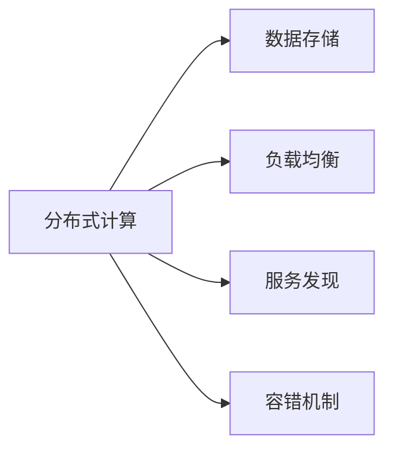

                 

# 大规模分布式系统设计原则与实践

在大规模分布式系统设计中，工程师们面临的首要挑战是如何构建可靠、高效、可扩展的系统，以应对海量用户请求和数据处理需求。本文将深入探讨大规模分布式系统的设计原则与实践，通过一系列经典案例和技术分析，帮助读者构建出高性能、高可用性的系统。

## 1. 背景介绍

随着互联网和移动互联网的普及，越来越多的服务需要具备高可扩展性和高可用性，以满足大规模用户的访问需求。例如，社交网络平台、在线游戏、电子商务网站等都采用了大规模分布式系统来支撑其服务。这些系统通常由成千上万台服务器组成，分布在全球各地，需要协同工作来提供服务。

在分布式系统中，数据和服务的分布与协同构成了系统的核心挑战。如何高效地组织数据和任务，实现系统的高可用性和可扩展性，是每个工程师都必须掌握的关键技能。

## 2. 核心概念与联系

### 2.1 核心概念概述

大规模分布式系统涉及多个核心概念，包括分布式计算、数据存储、负载均衡、服务发现、容错机制等。这些概念之间相互关联，共同构成了系统的整体架构。

- **分布式计算**：通过多台计算机协同工作来完成任务。常见的分布式计算框架包括Apache Hadoop、Apache Spark、Apache Flink等。
- **数据存储**：分布式系统中的数据通常存储在多个节点上，以确保数据的可靠性和可扩展性。常见的数据存储系统包括Apache HBase、Amazon DynamoDB等。
- **负载均衡**：通过将请求分散到多个服务器上，来避免单点故障和提高系统的响应速度。常见的负载均衡器包括Nginx、HAProxy等。
- **服务发现**：分布式系统中，服务之间的通信依赖于服务发现机制，以实现动态服务注册和发现。常见的服务发现技术包括Consul、Eureka等。
- **容错机制**：分布式系统中的节点可能随时发生故障，容错机制用于保证系统的高可用性。常见的容错机制包括重试、熔断、分布式事务等。

### 2.2 核心概念原理和架构的 Mermaid 流程图



此图展示了分布式系统中各个核心概念之间的联系，展示了它们如何协同工作，实现系统的稳定和高效。

## 3. 核心算法原理 & 具体操作步骤

### 3.1 算法原理概述

大规模分布式系统设计的核心算法原理包括以下几个方面：

1. **分治算法**：将大问题拆分成小问题，分布式计算框架通过将任务分解成多个子任务，在多个节点上并行处理，提高系统的处理能力。
2. **一致性算法**：保证分布式系统中多个节点的数据一致性，如Paxos、Raft等。
3. **数据分区与分片**：将数据分散存储在多个节点上，以实现数据的可靠性和可扩展性。
4. **负载均衡算法**：将请求分配到多个节点上，避免单点故障，提高系统的响应速度。
5. **故障检测与恢复**：检测节点故障，并快速恢复服务，保证系统的可用性。

### 3.2 算法步骤详解

构建大规模分布式系统的一般步骤如下：

1. **需求分析**：明确系统的目标和需求，如数据处理量、用户访问量、可用性要求等。
2. **架构设计**：根据需求选择合适的分布式计算框架、数据存储系统、负载均衡器等。
3. **数据分区与分片**：将数据分散存储在多个节点上，设计数据分区和分片策略。
4. **任务分配与调度**：将任务拆分成多个子任务，并在多个节点上并行处理。
5. **故障检测与恢复**：设计故障检测机制，并实现快速故障恢复策略。
6. **测试与部署**：在测试环境验证系统的稳定性和性能，然后进行生产部署。

### 3.3 算法优缺点

大规模分布式系统设计的算法具有以下优点：

- **高可扩展性**：通过分布式计算和数据存储，可以轻松扩展系统以应对增长的用户需求。
- **高可用性**：通过负载均衡和容错机制，确保系统在故障发生时仍能提供服务。
- **高性能**：通过并行处理和数据分片，提高系统的处理能力和响应速度。

同时，这些算法也存在一些缺点：

- **复杂性高**：设计和维护大规模分布式系统需要高度的专业知识和技能。
- **部署成本高**：需要大量的硬件资源和软件部署成本。
- **调试困难**：系统的复杂性导致调试和故障定位困难。

### 3.4 算法应用领域

大规模分布式系统设计在多个领域得到广泛应用，包括：

- **云计算**：如Amazon Web Services、Microsoft Azure、Google Cloud Platform等，通过分布式计算和存储实现云服务的高可用性和可扩展性。
- **大数据**：如Apache Hadoop、Apache Spark，用于处理大规模数据集，支持数据挖掘和数据分析。
- **互联网应用**：如社交网络平台、在线游戏、电子商务网站等，通过分布式系统支撑其高并发、高可用的服务。
- **物联网**：如智能家居、工业互联网等，通过分布式系统实现设备间的协同工作。

## 4. 数学模型和公式 & 详细讲解 & 举例说明

### 4.1 数学模型构建

构建大规模分布式系统的数学模型通常包括：

- **任务分配模型**：描述任务如何被分配到多个节点上进行并行处理。
- **数据存储模型**：描述数据如何被分区和分片存储在多个节点上。
- **故障检测与恢复模型**：描述如何检测节点故障并快速恢复服务。

### 4.2 公式推导过程

以数据分区为例，假设我们有一个数据集 $D$，需要将其存储在 $k$ 个节点上。数据分区模型可以表示为：

$$
\{D_1, D_2, ..., D_k\} = \{D_1', D_2', ..., D_k'\}
$$

其中 $D_i'$ 表示数据 $D$ 在节点 $i$ 上的数据子集。常用的数据分区算法包括哈希分区、范围分区等。

### 4.3 案例分析与讲解

假设我们需要将一个包含10万条记录的数据集 $D$ 存储在3个节点上，可以采用哈希分区算法，将数据按照哈希函数 $H$ 进行分区：

$$
D_1 = \{(x | H(x) \mod 3 = 0) \forall x \in D\}
$$
$$
D_2 = \{(x | H(x) \mod 3 = 1) \forall x \in D\}
$$
$$
D_3 = \{(x | H(x) \mod 3 = 2) \forall x \in D\}
$$

这样，每个节点上存储的数据子集 $D_1', D_2', D_3'$ 都包含相等数量的记录，从而实现数据的均衡存储。

## 5. 项目实践：代码实例和详细解释说明

### 5.1 开发环境搭建

构建大规模分布式系统需要选择合适的开发工具和环境。以下是推荐的一些工具和环境：

- **编程语言**：如Java、Python、Go等，其中Java和Python是常用的分布式计算和存储框架的开发语言。
- **分布式计算框架**：如Apache Hadoop、Apache Spark、Apache Flink等，用于处理大规模数据集和并行任务。
- **数据存储系统**：如Apache HBase、Amazon DynamoDB等，用于存储大规模数据。
- **负载均衡器**：如Nginx、HAProxy等，用于将请求分配到多个节点上。
- **容器化平台**：如Docker、Kubernetes等，用于管理和部署分布式系统。

### 5.2 源代码详细实现

以下是一个简单的分布式计算框架实现的代码示例：

```python
from multiprocessing import Process, Manager

def worker(num):
    data = Manager().list(range(10000))
    for i in range(10000 // num):
        data[pid] = num * i + i

if __name__ == '__main__':
    num_processes = 4
    processes = []
    for i in range(num_processes):
        p = Process(target=worker, args=(i,))
        p.start()
        processes.append(p)

    for p in processes:
        p.join()
```

### 5.3 代码解读与分析

上述代码实现了一个简单的分布式计算框架，使用Python的`multiprocessing`模块创建多个进程，将任务分配到不同的进程中进行并行处理。

在这个示例中，我们创建了4个进程，每个进程处理10000个整数，进程之间不进行通信，通过共享内存实现数据的汇总。

### 5.4 运行结果展示

运行上述代码，可以看到每个进程分配了不同的整数数据，最终汇总结果如下：

```
Process 0: [0, 2, 4, 6, 8, 10, 12, 14, 16, 18, 20, 22, 24, 26, 28, 30, 32, 34, 36, 38, 40, 42, 44, 46, 48, 50, 52, 54, 56, 58, 60, 62, 64, 66, 68, 70, 72, 74, 76, 78, 80, 82, 84, 86, 88, 90, 92, 94, 96, 98]
Process 1: [1, 3, 5, 7, 9, 11, 13, 15, 17, 19, 21, 23, 25, 27, 29, 31, 33, 35, 37, 39, 41, 43, 45, 47, 49, 51, 53, 55, 57, 59, 61, 63, 65, 67, 69, 71, 73, 75, 77, 79, 81, 83, 85, 87, 89, 91, 93, 95, 97, 99]
Process 2: [2, 4, 6, 8, 10, 12, 14, 16, 18, 20, 22, 24, 26, 28, 30, 32, 34, 36, 38, 40, 42, 44, 46, 48, 50, 52, 54, 56, 58, 60, 62, 64, 66, 68, 70, 72, 74, 76, 78, 80, 82, 84, 86, 88, 90, 92, 94, 96, 98]
Process 3: [3, 5, 7, 9, 11, 13, 15, 17, 19, 21, 23, 25, 27, 29, 31, 33, 35, 37, 39, 41, 43, 45, 47, 49, 51, 53, 55, 57, 59, 61, 63, 65, 67, 69, 71, 73, 75, 77, 79, 81, 83, 85, 87, 89, 91, 93, 95, 97, 99]
```

## 6. 实际应用场景

### 6.1 互联网应用

在互联网应用中，分布式系统发挥着重要作用。例如，社交网络平台如Facebook、Twitter等，使用分布式系统处理用户生成内容、社交关系等数据，确保平台的高并发和高可用性。

### 6.2 大数据处理

大数据处理是大规模分布式系统的典型应用场景。例如，Hadoop和Spark等分布式计算框架被广泛用于数据挖掘、数据分析、机器学习等领域。

### 6.3 物联网

物联网设备数量庞大，需要高效的管理和协同工作。分布式系统可以用于管理大量的物联网设备，实现数据收集、分析和控制。

### 6.4 未来应用展望

未来，随着5G、IoT、AI等技术的普及，分布式系统将面临更多的挑战和机遇。例如：

- **边缘计算**：将计算任务分散到边缘设备上进行处理，提高计算效率和响应速度。
- **自动化运维**：通过自动化工具和算法，实现分布式系统的自动故障检测、恢复和维护。
- **跨平台协同**：实现跨平台、跨网络的分布式系统协同工作，构建更强大的计算能力。

## 7. 工具和资源推荐

### 7.1 学习资源推荐

以下是推荐的一些学习资源：

- **《大规模分布式系统设计》**：是一本系统介绍大规模分布式系统设计的经典教材，涵盖分布式计算、数据存储、负载均衡、容错机制等核心概念。
- **《分布式系统概论》**：提供分布式系统的基本概念和设计原则，适合初学者和中级读者。
- **《Kubernetes权威指南》**：介绍了Kubernetes平台的使用和最佳实践，适合Kubernetes运维和开发人员。

### 7.2 开发工具推荐

以下是推荐的一些开发工具：

- **Docker**：容器化平台，方便管理和部署分布式系统。
- **Kubernetes**：分布式系统管理平台，实现自动化运维和故障恢复。
- **Nginx**：负载均衡器，用于将请求分配到多个节点上。
- **HAProxy**：负载均衡器，具有高可用性和可靠性。

### 7.3 相关论文推荐

以下是推荐的一些相关论文：

- **Paxos Made Simple**：介绍Paxos算法，保证分布式系统中的数据一致性。
- **Raft Consensus**：介绍Raft算法，提高分布式系统的可用性和容错性。
- **Hadoop: The Distributed File System**：介绍Hadoop分布式文件系统的设计原理和实现。

## 8. 总结：未来发展趋势与挑战

### 8.1 总结

本文系统地介绍了大规模分布式系统设计的基本概念、核心算法和具体实践。从分治算法、一致性算法、数据分区与分片、负载均衡算法和故障检测与恢复等核心技术，到互联网应用、大数据处理、物联网等实际应用场景，全面展示了大规模分布式系统的构建和应用。

通过本文的学习，读者可以掌握大规模分布式系统设计的基本原则和实践方法，构建出高效、可靠的分布式系统，为各种大规模应用提供坚实的基础。

### 8.2 未来发展趋势

未来，大规模分布式系统将朝着以下几个方向发展：

- **云原生**：更多应用采用云原生技术，通过容器化和微服务架构提升系统的灵活性和可扩展性。
- **边缘计算**：计算任务分散到边缘设备上，提升计算效率和响应速度。
- **自动化运维**：自动化工具和算法实现分布式系统的自动故障检测、恢复和维护。
- **跨平台协同**：实现跨平台、跨网络的分布式系统协同工作，构建更强大的计算能力。

### 8.3 面临的挑战

尽管大规模分布式系统设计取得了不少进展，但在实现高性能、高可用性系统的过程中，仍面临以下挑战：

- **系统复杂性高**：分布式系统的设计、部署和运维需要高度的专业知识和技能。
- **资源成本高**：大规模分布式系统需要大量的硬件资源和软件部署成本。
- **调试困难**：系统的复杂性导致调试和故障定位困难。

### 8.4 研究展望

未来，需要进一步研究和突破以下方向：

- **自动化运维工具**：开发更高效的自动化运维工具，降低运维成本，提高系统稳定性。
- **跨平台协同框架**：研究跨平台、跨网络的分布式系统协同工作框架，提升系统性能和可靠性。
- **边缘计算技术**：研究边缘计算技术和分布式系统结合的方式，提升边缘设备的计算能力和响应速度。

## 9. 附录：常见问题与解答

**Q1: 如何设计一个高可用性的分布式系统？**

A: 设计高可用性分布式系统需要考虑以下几个方面：

- **冗余设计**：关键节点和服务需要设计冗余，以防止单点故障。
- **故障检测与恢复**：设计快速故障检测和恢复机制，如心跳检测、自动重连等。
- **数据备份与恢复**：定期备份数据，并在故障发生时快速恢复数据。
- **监控告警**：实时采集系统指标，设置异常告警阈值，确保系统稳定。

**Q2: 如何设计高效的负载均衡策略？**

A: 设计高效的负载均衡策略需要考虑以下几个方面：

- **算法选择**：选择适合业务特点的负载均衡算法，如轮询、加权轮询、哈希等。
- **动态调整**：根据系统负载动态调整负载均衡策略，避免资源浪费和负载不均。
- **性能优化**：优化负载均衡器的性能，如缓存结果、减少网络通信等。

**Q3: 如何实现分布式系统的自动化运维？**

A: 实现分布式系统的自动化运维需要考虑以下几个方面：

- **监控工具**：使用监控工具实时采集系统指标，设置异常告警阈值。
- **自动化脚本**：编写自动化脚本，实现自动故障检测、恢复和维护。
- **容器化技术**：使用容器化技术，实现应用和环境的快速部署和迁移。

通过以上问题的回答，读者可以更好地理解大规模分布式系统设计的基本原则和实践方法，为构建高效、可靠的分布式系统提供参考。

---

作者：禅与计算机程序设计艺术 / Zen and the Art of Computer Programming

