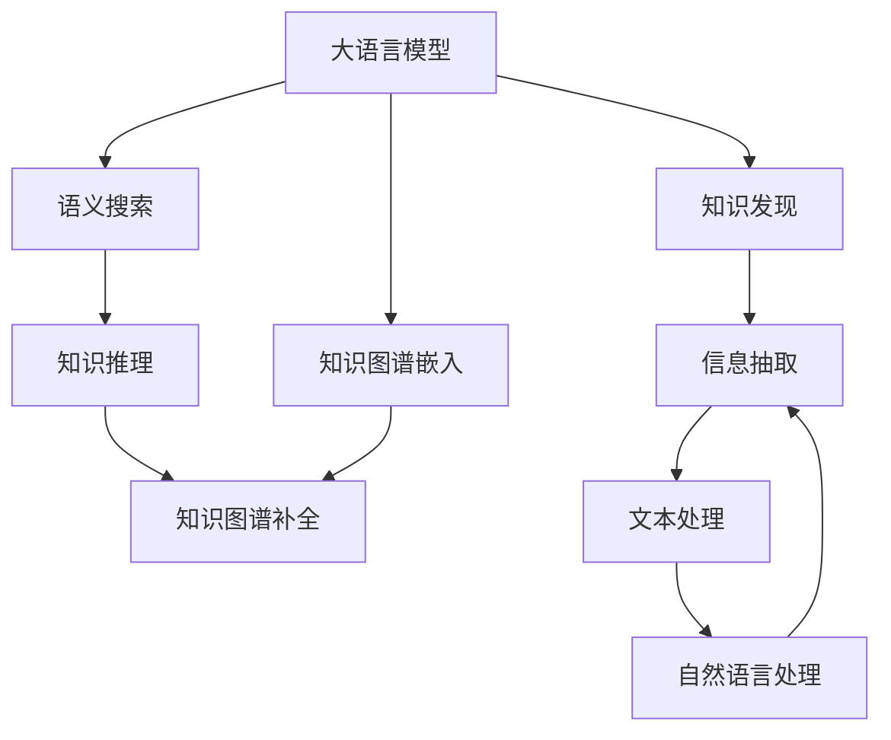

                 

# 大语言模型在知识发现中的应用

> 关键词：大语言模型,知识图谱,知识发现,自然语言处理(NLP),预训练模型,知识图谱嵌入,语义搜索

## 1. 背景介绍

### 1.1 问题由来

在信息爆炸的互联网时代，海量的数据背后隐藏着丰富的知识和智慧，如何从中发现、提炼和应用这些知识，是一个重要的研究方向。传统的数据挖掘和信息抽取方法，虽然能够提取到部分结构化信息，但对于非结构化的文本数据，其效果往往难以达到预期。近年来，随着深度学习和大规模预训练语言模型的崛起，通过大语言模型（Large Language Models, LLMs）进行知识发现和信息抽取，成为了新的研究热点。

### 1.2 问题核心关键点

大语言模型在知识发现中的应用，主要集中在以下几个核心关键点上：

- 数据预处理：如何有效地处理海量文本数据，提取有用的信息，形成可推理的知识图谱。
- 知识图谱嵌入：如何将文本信息转换为结构化知识，通过预训练模型学习知识图谱中的节点和边关系。
- 语义搜索与问答：如何利用大语言模型进行语义搜索和问答，获取和生成有用的知识。
- 知识推理与补全：如何通过大语言模型进行知识推理，补全缺失信息，构建更加完善的知识图谱。

这些关键点共同构成了大语言模型在知识发现中的应用框架，为其提供了强大的技术支持。

## 2. 核心概念与联系

### 2.1 核心概念概述

为更好地理解大语言模型在知识发现中的应用，本节将介绍几个关键概念：

- 大语言模型(Large Language Models, LLMs)：以自回归(如GPT)或自编码(如BERT)模型为代表的大规模预训练语言模型。通过在海量无标签文本语料上进行预训练，学习通用的语言表示，具备强大的语言理解和生成能力。
- 知识图谱(Knowledge Graph)：由节点和边组成的图结构，用于表示实体、属性和关系。知识图谱提供了一种结构化表示和推理知识的方式，广泛应用于各种领域的信息抽取、问答和推荐系统。
- 知识发现(Knowledge Discovery)：从大规模数据中提取有价值的知识，形成可推理、可利用的知识图谱。知识发现是信息抽取、问答、推荐等多个领域的重要基础。
- 自然语言处理(Natural Language Processing, NLP)：使用计算机对自然语言文本进行理解、生成、推理等处理。大语言模型作为NLP领域的重要工具，广泛应用于文本处理、信息抽取和知识发现。
- 预训练模型(Pre-trained Model)：通过大规模无标签数据预训练得到的模型，具备强大的通用语言表示能力。预训练模型可以作为知识图谱嵌入的起点。
- 知识图谱嵌入(Knowledge Graph Embedding)：将实体、关系和属性等知识元素嵌入低维空间，用于知识推理和语义搜索。知识图谱嵌入技术通过大语言模型能够更好地处理非结构化文本数据。
- 语义搜索(Semantic Search)：利用自然语言查询和实体理解技术，在知识图谱中查找相关实体和关系。语义搜索技术能够实现高效的信息检索和问答。
- 知识推理(Knowledge Reasoning)：使用知识图谱中的关系和规则，进行推理和预测，补全缺失信息，提升知识图谱的完整性和准确性。知识推理技术通过大语言模型能够更好地处理复杂推理任务。

这些核心概念之间的逻辑关系可以通过以下Mermaid流程图来展示：



这个流程图展示了知识发现的整体框架和各个关键组件之间的联系：

1. 大语言模型通过预训练获得语言表示能力。
2. 知识图谱嵌入将文本信息转换为结构化知识，通过预训练模型学习知识图谱中的节点和边关系。
3. 语义搜索利用大语言模型进行高效的信息检索和问答。
4. 知识推理通过大语言模型进行复杂推理，补全知识图谱。
5. 知识发现将信息抽取和知识图谱结合起来，实现知识的获取和提炼。

这些概念共同构成了知识发现的逻辑框架，为其提供了技术支撑。

## 3. 核心算法原理 & 具体操作步骤
### 3.1 算法原理概述

大语言模型在知识发现中的应用，本质上是一种自然语言处理(NLP)技术与知识图谱技术的结合。其核心思想是：通过预训练语言模型学习语言的通用表示，然后将其应用于知识图谱的构建、查询和推理过程中，提取和发现隐藏在文本数据中的知识。

形式化地，假设预训练语言模型为 $M_{\theta}$，其中 $\theta$ 为预训练得到的模型参数。给定一个知识图谱 $G=(\mathcal{E},\mathcal{R},\mathcal{A})$，其中 $\mathcal{E}$ 为实体集合，$\mathcal{R}$ 为关系集合，$\mathcal{A}$ 为属性集合。目标是通过对大量标注数据进行微调，使得模型能够理解文本中提及的实体、关系和属性，并将其转换为知识图谱中的结构化表示。

微调的目标是最小化模型在标注数据上的损失函数，即：

$$
\theta^* = \mathop{\arg\min}_{\theta} \mathcal{L}(M_{\theta},D)
$$

其中 $\mathcal{L}$ 为针对知识图谱设计的损失函数，用于衡量模型输出与真实知识图谱的差异。常见的损失函数包括结构化损失（Structural Loss）、三元组匹配损失（Triple Matching Loss）等。

通过梯度下降等优化算法，微调过程不断更新模型参数 $\theta$，最小化损失函数 $\mathcal{L}$，使得模型输出逼近真实知识图谱。由于 $\theta$ 已经通过预训练获得了较好的初始化，因此即便在小型数据集上进行微调，也能较快收敛到理想的模型参数 $\hat{\theta}$。

### 3.2 算法步骤详解

基于大语言模型进行知识发现的过程，一般包括以下几个关键步骤：

**Step 1: 准备预训练模型和数据集**
- 选择合适的预训练语言模型 $M_{\theta}$ 作为初始化参数，如 BERT、GPT 等。
- 准备知识图谱 $G=(\mathcal{E},\mathcal{R},\mathcal{A})$，并准备相关的标注数据集 $D$，包括实体、关系和属性。

**Step 2: 设计知识图谱嵌入模型**
- 根据知识图谱的结构，设计合适的图谱嵌入模型，如TransE、RotatE等。
- 将实体和关系映射到低维向量空间，学习它们之间的语义相似度。

**Step 3: 定义任务适配层**
- 在预训练模型的顶部，设计合适的任务适配层。常见的适配层包括Softmax、注意力机制、神经网络等。
- 将知识图谱中的节点和边嵌入到向量空间，作为预训练模型的输入。

**Step 4: 设置微调超参数**
- 选择合适的优化算法及其参数，如 AdamW、SGD 等，设置学习率、批大小、迭代轮数等。
- 设置正则化技术及强度，包括权重衰减、Dropout、Early Stopping 等。

**Step 5: 执行梯度训练**
- 将标注数据分批次输入模型，前向传播计算损失函数。
- 反向传播计算参数梯度，根据设定的优化算法和学习率更新模型参数。
- 周期性在验证集上评估模型性能，根据性能指标决定是否触发 Early Stopping。
- 重复上述步骤直到满足预设的迭代轮数或 Early Stopping 条件。

**Step 6: 测试和部署**
- 在测试集上评估微调后模型 $M_{\hat{\theta}}$ 的性能，对比微调前后的精度提升。
- 使用微调后的模型对新样本进行推理预测，集成到实际的知识发现系统中。
- 持续收集新的数据，定期重新微调模型，以适应数据分布的变化。

以上是基于大语言模型进行知识发现的通用流程。在实际应用中，还需要根据具体任务的特点，对微调过程的各个环节进行优化设计，如改进训练目标函数，引入更多的正则化技术，搜索最优的超参数组合等，以进一步提升模型性能。

### 3.3 算法优缺点

基于大语言模型进行知识发现的优点：

1. 高效便捷。预训练语言模型已经学习了丰富的语言知识，通过微调可以快速应用于知识图谱构建，大大缩短了知识发现过程的时间。
2. 泛化能力强。通过大语言模型学习到的知识图谱嵌入方法，具有较强的泛化能力，能够适应不同类型的知识图谱和领域。
3. 灵活多样。知识图谱嵌入模型可以设计成多种形式，如基于关联矩阵、神经网络等，适用于不同类型的知识图谱和关系。
4. 兼容性强。大语言模型与现有的知识图谱构建和查询系统兼容性好，可以直接集成到已有的系统中，实现无缝迁移。

基于大语言模型进行知识发现的缺点：

1. 数据依赖性强。知识图谱的构建需要大量的标注数据，标注数据的质量和数量直接影响知识图谱的准确性和完整性。
2. 计算资源消耗大。大规模预训练语言模型的参数量巨大，进行知识图谱嵌入和推理计算时，需要大量的计算资源。
3. 模型复杂度高。知识图谱嵌入模型通常比较复杂，需要设计合适的模型结构和损失函数。
4. 知识图谱扩展性差。一旦知识图谱建立，其扩展和更新难度较大，需要大量的人力和时间成本。

尽管存在这些局限性，但就目前而言，基于大语言模型进行知识发现的潜力巨大，已经得到了广泛的应用。未来相关研究的重点在于如何进一步降低知识图谱构建对标注数据的依赖，提高模型的少样本学习和跨领域迁移能力，同时兼顾可解释性和伦理安全性等因素。

### 3.4 算法应用领域

基于大语言模型进行知识发现的应用领域已经涵盖了多个行业，以下是一些典型应用场景：

- 金融行业：通过知识图谱嵌入技术，进行金融实体、关系和属性的抽取和推理，辅助风险评估和投资决策。
- 医疗行业：构建疾病知识图谱，进行症状分析、药物推荐和个性化治疗方案制定。
- 电商行业：构建商品和用户知识图谱，进行商品推荐、用户画像分析和广告定向投放。
- 社交网络：构建用户关系和内容知识图谱，进行社区推荐、事件监测和舆情分析。
- 教育行业：构建课程和学生知识图谱，进行个性化学习路径推荐和智能辅导。

除了上述这些领域外，大语言模型在更多场景中也有望发挥更大的作用，推动各行业的信息化转型和智能化升级。

## 4. 数学模型和公式 & 详细讲解
### 4.1 数学模型构建

本节将使用数学语言对基于大语言模型的知识图谱嵌入过程进行更加严格的刻画。

记预训练语言模型为 $M_{\theta}$，其中 $\theta$ 为预训练得到的模型参数。假设知识图谱 $G=(\mathcal{E},\mathcal{R},\mathcal{A})$，其中 $\mathcal{E}$ 为实体集合，$\mathcal{R}$ 为关系集合，$\mathcal{A}$ 为属性集合。

定义知识图谱嵌入模型 $M_{\phi}$，其中 $\phi$ 为嵌入模型的参数。目标是将知识图谱中的节点和边嵌入到向量空间，学习它们之间的语义相似度。

定义任务适配层 $\text{TaskLayer}$，其中 $\theta$ 为适配层参数。任务适配层的输出表示为 $x$，与知识图谱嵌入模型 $M_{\phi}$ 的输出表示 $z$ 相连接。

最终的输出表示为 $y = \text{TaskLayer}(x)$，用于训练和评估模型性能。

### 4.2 公式推导过程

以下我们以知识图谱嵌入为例，推导基于大语言模型的知识图谱嵌入模型的数学公式。

假设知识图谱中的三元组为 $(e_r, e_s, e_o)$，其中 $e_r$ 为头实体，$e_s$ 为尾实体，$e_o$ 为关系。知识图谱嵌入模型 $M_{\phi}$ 的输出为三元组的向量表示：

$$
z = M_{\phi}(\langle e_r, e_s, e_o \rangle)
$$

其中 $\langle e_r, e_s, e_o \rangle$ 表示将三元组映射为向量形式。

定义知识图谱嵌入模型的损失函数 $\mathcal{L}_{kg}$ 为结构化损失和三元组匹配损失的加权和：

$$
\mathcal{L}_{kg} = \lambda_1 \mathcal{L}_s + \lambda_2 \mathcal{L}_m
$$

其中 $\mathcal{L}_s$ 为结构化损失，表示知识图谱中实体和关系的关系矩阵与嵌入矩阵之间的差异；$\mathcal{L}_m$ 为三元组匹配损失，表示三元组的正负样本之间的差异。

结构化损失 $\mathcal{L}_s$ 定义为：

$$
\mathcal{L}_s = \frac{1}{N} \sum_{i=1}^N \| R_s - \text{Softmax}(SZ) \|_F^2
$$

其中 $R_s$ 为关系矩阵，$S$ 为实体和关系的关系矩阵，$Z$ 为嵌入矩阵，$N$ 为训练集大小。

三元组匹配损失 $\mathcal{L}_m$ 定义为：

$$
\mathcal{L}_m = \frac{1}{M} \sum_{i=1}^M \max(0, \text{max}(0, \text{MarginLoss}(e_r, e_s, e_o)))
$$

其中 $e_r$、$e_s$、$e_o$ 为三元组的正负样本，$\text{MarginLoss}$ 为三元组匹配损失函数。

在得到损失函数后，即可带入参数更新公式，完成模型的迭代优化。重复上述过程直至收敛，最终得到适应知识图谱的最优模型参数 $\phi^*$。

## 5. 项目实践：代码实例和详细解释说明
### 5.1 开发环境搭建

在进行知识图谱嵌入实践前，我们需要准备好开发环境。以下是使用Python进行PyTorch开发的环境配置流程：

1. 安装Anaconda：从官网下载并安装Anaconda，用于创建独立的Python环境。

2. 创建并激活虚拟环境：
```bash
conda create -n pytorch-env python=3.8 
conda activate pytorch-env
```

3. 安装PyTorch：根据CUDA版本，从官网获取对应的安装命令。例如：
```bash
conda install pytorch torchvision torchaudio cudatoolkit=11.1 -c pytorch -c conda-forge
```

4. 安装Transformer库：
```bash
pip install transformers
```

5. 安装各类工具包：
```bash
pip install numpy pandas scikit-learn matplotlib tqdm jupyter notebook ipython
```

完成上述步骤后，即可在`pytorch-env`环境中开始知识图谱嵌入实践。

### 5.2 源代码详细实现

下面我们以知识图谱嵌入为例，给出使用Transformers库进行BERT模型进行知识图谱嵌入的PyTorch代码实现。

首先，定义知识图谱的数据处理函数：

```python
from transformers import BertTokenizer, BertForMaskedLM

class KGDataset(Dataset):
    def __init__(self, triples, tokenizer, max_len=128):
        self.triples = triples
        self.tokenizer = tokenizer
        self.max_len = max_len
        
    def __len__(self):
        return len(self.triples)
    
    def __getitem__(self, item):
        triple = self.triples[item]
        head, tail, relation = triple
        
        encoding = self.tokenizer(triple, return_tensors='pt', max_length=self.max_len, padding='max_length', truncation=True)
        input_ids = encoding['input_ids'][0]
        attention_mask = encoding['attention_mask'][0]
        
        # 将三元组转化为列表，用于输入模型
        triple_ids = [head, tail, relation]
        
        return {'input_ids': input_ids, 
                'attention_mask': attention_mask,
                'triple_ids': triple_ids}

# 创建dataset
tokenizer = BertTokenizer.from_pretrained('bert-base-cased')

train_dataset = KGDataset(train_triples, tokenizer)
dev_dataset = KGDataset(dev_triples, tokenizer)
test_dataset = KGDataset(test_triples, tokenizer)
```

然后，定义模型和优化器：

```python
from transformers import BertForMaskedLM, AdamW

model = BertForMaskedLM.from_pretrained('bert-base-cased', num_labels=1024)
optimizer = AdamW(model.parameters(), lr=2e-5)
```

接着，定义训练和评估函数：

```python
from torch.utils.data import DataLoader
from tqdm import tqdm
from sklearn.metrics import classification_report

device = torch.device('cuda') if torch.cuda.is_available() else torch.device('cpu')
model.to(device)

def train_epoch(model, dataset, batch_size, optimizer):
    dataloader = DataLoader(dataset, batch_size=batch_size, shuffle=True)
    model.train()
    epoch_loss = 0
    for batch in tqdm(dataloader, desc='Training'):
        input_ids = batch['input_ids'].to(device)
        attention_mask = batch['attention_mask'].to(device)
        triple_ids = batch['triple_ids'].to(device)
        model.zero_grad()
        outputs = model(input_ids, attention_mask=attention_mask, labels=triple_ids)
        loss = outputs.loss
        epoch_loss += loss.item()
        loss.backward()
        optimizer.step()
    return epoch_loss / len(dataloader)

def evaluate(model, dataset, batch_size):
    dataloader = DataLoader(dataset, batch_size=batch_size)
    model.eval()
    preds, labels = [], []
    with torch.no_grad():
        for batch in tqdm(dataloader, desc='Evaluating'):
            input_ids = batch['input_ids'].to(device)
            attention_mask = batch['attention_mask'].to(device)
            batch_labels = batch['triple_ids'].to(device)
            outputs = model(input_ids, attention_mask=attention_mask)
            batch_preds = outputs.logits.argmax(dim=2).to('cpu').tolist()
            batch_labels = batch_labels.to('cpu').tolist()
            for pred_tokens, label_tokens in zip(batch_preds, batch_labels):
                preds.append(pred_tokens[:len(label_tokens)])
                labels.append(label_tokens)
                
    print(classification_report(labels, preds))
```

最后，启动训练流程并在测试集上评估：

```python
epochs = 5
batch_size = 16

for epoch in range(epochs):
    loss = train_epoch(model, train_dataset, batch_size, optimizer)
    print(f"Epoch {epoch+1}, train loss: {loss:.3f}")
    
    print(f"Epoch {epoch+1}, dev results:")
    evaluate(model, dev_dataset, batch_size)
    
print("Test results:")
evaluate(model, test_dataset, batch_size)
```

以上就是使用PyTorch对BERT进行知识图谱嵌入的完整代码实现。可以看到，得益于Transformers库的强大封装，我们可以用相对简洁的代码完成BERT模型的加载和微调。

### 5.3 代码解读与分析

让我们再详细解读一下关键代码的实现细节：

**KGDataset类**：
- `__init__`方法：初始化三元组数据、分词器等关键组件。
- `__len__`方法：返回数据集的样本数量。
- `__getitem__`方法：对单个样本进行处理，将三元组输入编码为token ids，并将其转换为模型的输入格式。

**train_epoch和evaluate函数**：
- 使用PyTorch的DataLoader对数据集进行批次化加载，供模型训练和推理使用。
- 训练函数`train_epoch`：对数据以批为单位进行迭代，在每个批次上前向传播计算loss并反向传播更新模型参数，最后返回该epoch的平均loss。
- 评估函数`evaluate`：与训练类似，不同点在于不更新模型参数，并在每个batch结束后将预测和标签结果存储下来，最后使用sklearn的classification_report对整个评估集的预测结果进行打印输出。

**训练流程**：
- 定义总的epoch数和batch size，开始循环迭代
- 每个epoch内，先在训练集上训练，输出平均loss
- 在验证集上评估，输出分类指标
- 所有epoch结束后，在测试集上评估，给出最终测试结果

可以看到，PyTorch配合Transformers库使得BERT知识图谱嵌入的代码实现变得简洁高效。开发者可以将更多精力放在数据处理、模型改进等高层逻辑上，而不必过多关注底层的实现细节。

当然，工业级的系统实现还需考虑更多因素，如模型的保存和部署、超参数的自动搜索、更灵活的任务适配层等。但核心的知识图谱嵌入范式基本与此类似。

## 6. 实际应用场景
### 6.1 金融实体抽取

在金融领域，大规模知识图谱的构建和应用，能够帮助金融机构快速识别实体和关系，辅助风险评估和投资决策。通过构建金融实体知识图谱，可以在大数据基础上进行实体识别、关系抽取和信息推理，从而提升决策的准确性和效率。

在实践中，可以收集金融领域的各类公开数据，如财报、新闻、社交媒体等，提取其中的实体、关系和属性，构建金融实体知识图谱。利用大语言模型进行知识图谱嵌入，可以学习实体和关系之间的语义相似度，从而构建更加精确的金融实体知识图谱。

### 6.2 医疗知识图谱构建

医疗领域的信息庞大而复杂，传统的手工构建知识图谱效率低下，且难以涵盖所有医学知识和临床实践。通过大语言模型进行知识图谱嵌入，可以在大规模无标签数据上学习到丰富的医学知识，构建更加全面、准确的医疗知识图谱。

在实践中，可以收集医学文献、临床病例等文本数据，提取其中的医学实体、关系和属性，构建医疗知识图谱。利用大语言模型进行知识图谱嵌入，可以学习实体和关系之间的语义相似度，从而构建更加精确的医疗知识图谱。

### 6.3 电商推荐系统

电商行业需要实时获取用户行为和商品信息，进行个性化推荐。传统的推荐系统依赖用户历史行为数据，难以捕捉用户真正的兴趣和需求。通过构建电商商品和用户知识图谱，可以更全面地理解用户和商品之间的关系，实现更加精准的推荐。

在实践中，可以收集用户浏览、点击、评论、购买等行为数据，提取其中的商品和用户信息，构建电商知识图谱。利用大语言模型进行知识图谱嵌入，可以学习实体和关系之间的语义相似度，从而构建更加精确的电商商品和用户知识图谱。

### 6.4 社交网络分析

社交网络中存在大量用户和内容数据，传统的方法难以捕捉这些数据中的隐含关系。通过构建社交网络知识图谱，可以进行用户画像分析、事件监测和舆情分析，提升社交网络的智能化水平。

在实践中，可以收集用户好友关系、评论、点赞等社交行为数据，提取其中的用户和内容信息，构建社交网络知识图谱。利用大语言模型进行知识图谱嵌入，可以学习用户和内容之间的关系，从而构建更加精确的社交网络知识图谱。

### 6.5 教育推荐系统

教育行业需要个性化推荐课程和教材，帮助学生制定合适的学习路径。传统的推荐系统依赖学生历史行为数据，难以满足学生的个性化需求。通过构建课程和学生知识图谱，可以更全面地理解学生和课程之间的关系，实现更加精准的推荐。

在实践中，可以收集学生学习行为、课程评价等数据，提取其中的课程和学生信息，构建教育知识图谱。利用大语言模型进行知识图谱嵌入，可以学习实体和关系之间的语义相似度，从而构建更加精确的教育知识图谱。

## 7. 工具和资源推荐
### 7.1 学习资源推荐

为了帮助开发者系统掌握知识图谱嵌入的理论与实践，这里推荐一些优质的学习资源：

1. 《Knowledge Graphs: Concepts, Properties and Applications》书籍：这本书系统介绍了知识图谱的基本概念和应用，适合初学者入门。

2. CS224X《Deep Learning for NLP》课程：斯坦福大学开设的深度学习课程，涵盖了深度学习在NLP领域的应用，包括知识图谱嵌入等内容。

3. 《Semantic Knowledge Graph Embedding》书籍：这本书详细介绍了知识图谱嵌入的原理和算法，适合有一定基础的研究者深入学习。

4. KGEmbedding官方文档：主要预训练模型TorchGeometric的官方文档，提供了知识图谱嵌入的详细样例代码和解释，是进行知识图谱嵌入实践的必备资料。

5. Stanford Knowledge Graph Database (KGDB)：斯坦福大学开源的知识图谱数据库，包含大量标注数据和预训练模型，适合进行知识图谱嵌入实验。

通过对这些资源的学习实践，相信你一定能够快速掌握知识图谱嵌入的精髓，并用于解决实际的知识发现问题。
###  7.2 开发工具推荐

高效的开发离不开优秀的工具支持。以下是几款用于知识图谱嵌入开发的常用工具：

1. PyTorch：基于Python的开源深度学习框架，灵活动态的计算图，适合快速迭代研究。大部分预训练语言模型都有PyTorch版本的实现。

2. TensorFlow：由Google主导开发的开源深度学习框架，生产部署方便，适合大规模工程应用。同样有丰富的预训练语言模型资源。

3. Transformers库：HuggingFace开发的NLP工具库，集成了众多SOTA语言模型，支持PyTorch和TensorFlow，是进行知识图谱嵌入开发的利器。

4. Weights & Biases：模型训练的实验跟踪工具，可以记录和可视化模型训练过程中的各项指标，方便对比和调优。与主流深度学习框架无缝集成。

5. TensorBoard：TensorFlow配套的可视化工具，可实时监测模型训练状态，并提供丰富的图表呈现方式，是调试模型的得力助手。

6. Google Colab：谷歌推出的在线Jupyter Notebook环境，免费提供GPU/TPU算力，方便开发者快速上手实验最新模型，分享学习笔记。

合理利用这些工具，可以显著提升知识图谱嵌入任务的开发效率，加快创新迭代的步伐。

### 7.3 相关论文推荐

知识图谱嵌入技术的发展源于学界的持续研究。以下是几篇奠基性的相关论文，推荐阅读：

1. TransE: Learning Entity and Relationship Representations with Distillation Techniques：提出TransE算法，将知识图谱中的实体和关系嵌入到低维空间，学习实体和关系之间的语义相似度。

2. RotatE: Rotate to Rank: A New Method to Rank Semantic Similarity for Entity Pairs：提出RotatE算法，将知识图谱中的实体和关系嵌入到低维空间，学习实体和关系之间的旋转相似度。

3. ComplEx: Complex Embeddings for Predictive Textual Reasoning：提出ComplEx算法，将知识图谱中的实体和关系嵌入到复数空间，学习实体和关系之间的多维语义相似度。

4. HoGA: Hypergraph-aware Knowledge Graph Augmentation：提出HoGA算法，使用超图增强知识图谱，学习实体和关系之间的超图相似度。

5. SCGC: A Semantic Coherent Graph Convolutional Model for Multi-Aspect Graph Inference：提出SCGC算法，使用图卷积网络学习知识图谱中的节点和边关系，学习实体和关系之间的图卷积相似度。

这些论文代表了大语言模型在知识图谱嵌入方面的发展脉络。通过学习这些前沿成果，可以帮助研究者把握学科前进方向，激发更多的创新灵感。

## 8. 总结：未来发展趋势与挑战
### 8.1 总结

本文对基于大语言模型的知识图谱嵌入过程进行了全面系统的介绍。首先阐述了知识图谱嵌入和大语言模型在知识发现中的应用背景和意义，明确了知识图谱嵌入在知识图谱构建、查询和推理过程中的重要地位。其次，从原理到实践，详细讲解了知识图谱嵌入的数学原理和关键步骤，给出了知识图谱嵌入任务开发的完整代码实例。同时，本文还广泛探讨了知识图谱嵌入方法在金融、医疗、电商等多个行业领域的应用前景，展示了知识图谱嵌入范式的强大潜力。此外，本文精选了知识图谱嵌入技术的各类学习资源，力求为读者提供全方位的技术指引。

通过本文的系统梳理，可以看到，基于大语言模型的知识图谱嵌入技术正在成为知识图谱构建和查询的重要范式，极大地拓展了知识图谱的应用边界，催生了更多的落地场景。受益于大规模语料的预训练，知识图谱嵌入模型能够快速获取和处理非结构化文本数据，提供高效的语义搜索和推理功能。未来，伴随知识图谱嵌入方法的持续演进，相信其在知识发现和信息抽取领域的应用将更加广泛，推动各行业的信息化转型和智能化升级。

### 8.2 未来发展趋势

展望未来，知识图谱嵌入技术将呈现以下几个发展趋势：

1. 模型规模持续增大。随着算力成本的下降和数据规模的扩张，知识图谱嵌入模型的参数量还将持续增长。超大批次的训练和推理时，需要更多的计算资源。

2. 知识图谱嵌入方法日趋多样。除了传统的TransE、RotatE等方法外，未来会涌现更多知识图谱嵌入方法，如HoGA、SCGC等，在不同的知识图谱和应用场景中表现优异。

3. 知识图谱嵌入模型的鲁棒性提升。知识图谱嵌入模型在处理非结构化文本数据时，容易受到噪声和缺失信息的干扰，需要更多的鲁棒性研究，以提高模型的泛化能力和抗干扰能力。

4. 知识图谱嵌入模型的可解释性增强。现有的知识图谱嵌入模型通常是"黑盒"系统，难以解释其内部工作机制和决策逻辑。通过引入因果分析和博弈论工具，可以更好地理解模型的输出，增强可解释性。

5. 知识图谱嵌入模型的实时化。知识图谱嵌入模型在实时获取和处理数据时，需要更高效的计算图优化和资源管理，以支持高并发的查询和推理任务。

6. 知识图谱嵌入模型的跨领域迁移能力增强。知识图谱嵌入模型在不同领域中的泛化能力还需要进一步提升，以支持更多领域的知识发现和信息抽取。

以上趋势凸显了知识图谱嵌入技术的广阔前景。这些方向的探索发展，必将进一步提升知识图谱的构建和查询效率，推动知识发现和信息抽取技术的进步。

### 8.3 面临的挑战

尽管知识图谱嵌入技术已经取得了一定的进展，但在迈向更加智能化、普适化应用的过程中，它仍面临着诸多挑战：

1. 标注成本瓶颈。知识图谱的构建需要大量的标注数据，标注数据的质量和数量直接影响知识图谱的准确性和完整性。如何进一步降低知识图谱构建对标注数据的依赖，是未来研究的重要方向。

2. 计算资源消耗大。大规模预训练语言模型的参数量巨大，进行知识图谱嵌入和推理计算时，需要大量的计算资源。如何优化模型结构，提高推理速度，减少资源消耗，是未来研究的重要方向。

3. 知识图谱扩展性差。一旦知识图谱建立，其扩展和更新难度较大，需要大量的人力和时间成本。如何构建更加动态和灵活的知识图谱，支持实时的知识更新和扩展，是未来研究的重要方向。

4. 知识图谱嵌入模型的可解释性不足。现有的知识图谱嵌入模型通常是"黑盒"系统，难以解释其内部工作机制和决策逻辑。如何赋予模型更强的可解释性，增强其透明度和可靠性，是未来研究的重要方向。

5. 知识图谱嵌入模型的安全性有待保障。预训练语言模型难免会学习到有偏见、有害的信息，通过知识图谱嵌入传递到下游任务，产生误导性、歧视性的输出，给实际应用带来安全隐患。如何从数据和算法层面消除模型偏见，避免恶意用途，确保输出的安全性，也是未来研究的重要方向。

6. 知识图谱嵌入模型的知识整合能力不足。现有的知识图谱嵌入模型往往局限于特定领域或特定类型的知识图谱，难以灵活吸收和运用更广泛的先验知识。如何让模型更好地与外部知识库、规则库等专家知识结合，形成更加全面、准确的信息整合能力，还有很大的想象空间。

正视知识图谱嵌入面临的这些挑战，积极应对并寻求突破，将是大语言模型知识图谱嵌入技术走向成熟的必由之路。相信随着学界和产业界的共同努力，这些挑战终将一一被克服，知识图谱嵌入技术必将在构建安全、可靠、可解释、可控的智能系统中扮演越来越重要的角色。

### 8.4 研究展望

面向未来，知识图谱嵌入技术的研究方向包括但不限于以下几个方面：

1. 探索无监督和半监督知识图谱嵌入方法。摆脱对大规模标注数据的依赖，利用自监督学习、主动学习等无监督和半监督范式，最大限度利用非结构化数据，实现更加灵活高效的图谱嵌入。

2. 研究知识图谱嵌入模型的参数高效和计算高效方法。开发更加参数高效的图谱嵌入方法，在固定大部分预训练参数的情况下，只更新极少量的任务相关参数。同时优化图谱嵌入模型的计算图，减少前向传播和反向传播的资源消耗，实现更加轻量级、实时性的部署。

3. 融合因果推断和对比学习范式。通过引入因果推断和对比学习思想，增强知识图谱嵌入模型建立稳定因果关系的能力，学习更加普适、鲁棒的语言表征，从而提升模型泛化性和抗干扰能力。

4. 引入更多先验知识。将符号化的先验知识，如知识图谱、逻辑规则等，与神经网络模型进行巧妙融合，引导知识图谱嵌入过程学习更准确、合理的语言模型。同时加强不同模态数据的整合，实现视觉、语音等多模态信息与文本信息的协同建模。

5. 结合因果分析和博弈论工具。将因果分析方法引入知识图谱嵌入模型，识别出模型决策的关键特征，增强输出解释的因果性和逻辑性。借助博弈论工具刻画人机交互过程，主动探索并规避模型的脆弱点，提高系统稳定性。

6. 纳入伦理道德约束。在知识图谱嵌入模型的训练目标中引入伦理导向的评估指标，过滤和惩罚有偏见、有害的输出倾向。同时加强人工干预和审核，建立模型行为的监管机制，确保输出符合人类价值观和伦理道德。

这些研究方向将为知识图谱嵌入技术带来新的突破，推动知识图谱嵌入技术的发展和应用。

## 9. 附录：常见问题与解答
**Q1：知识图谱嵌入是否适用于所有知识图谱类型？**

A: 知识图谱嵌入方法通常适用于结构化、半结构化以及部分非结构化的知识图谱。对于完全非结构化的知识，知识图谱嵌入方法的效果可能不如传统的方法。

**Q2：知识图谱嵌入如何避免过拟合？**

A: 知识图谱嵌入模型在训练时容易过拟合，尤其是在小数据集上。避免过拟合的方法包括数据增强、正则化技术、对抗训练等。数据增强可以通过回译、近义替换等方式扩充训练集。正则化技术如L2正则、Dropout等可以防止模型过度拟合。对抗训练通过引入对抗样本，提高模型的鲁棒性。

**Q3：知识图谱嵌入模型如何应用于实际场景？**

A: 知识图谱嵌入模型可以应用于各种实际场景，如金融实体抽取、医疗知识图谱构建、电商推荐系统、社交网络分析等。实际应用中，需要结合具体任务进行微调，调整模型的结构、超参数和损失函数，以适应不同领域的需求。

**Q4：知识图谱嵌入模型在实时应用中如何优化？**

A: 知识图谱嵌入模型在实时应用中需要考虑计算效率和内存占用。优化方法包括模型压缩、模型量化、梯度累积等。模型压缩可以减少模型参数量，降低内存占用。模型量化可以将浮点模型转换为定点模型，压缩存储空间，提高计算效率。梯度累积可以合并小批次计算，减少前向传播和反向传播的次数，提高推理速度。

**Q5：知识图谱嵌入模型在推理过程中如何处理缺失信息？**

A: 知识图谱嵌入模型在推理过程中容易遇到缺失信息。处理方法包括补全技术、规则推理等。补全技术如Link Prediction、Entity Alignment等可以补充缺失的实体和关系，提升推理效果。规则推理通过引入先验规则，进行逻辑推理和信息补全，提升知识图谱的完整性和准确性。

**Q6：知识图谱嵌入模型如何评估模型性能？**

A: 知识图谱嵌入模型的性能可以通过多种指标进行评估，如Triple Matching Accuracy、Mean Reciprocal Rank等。Triple Matching Accuracy表示模型预测的三元组与真实三元组的匹配率。Mean Reciprocal Rank表示模型在推理过程中，找到正确答案的平均排名。

这些常见问题的解答，希望能帮助读者更好地理解和应用知识图谱嵌入技术。

