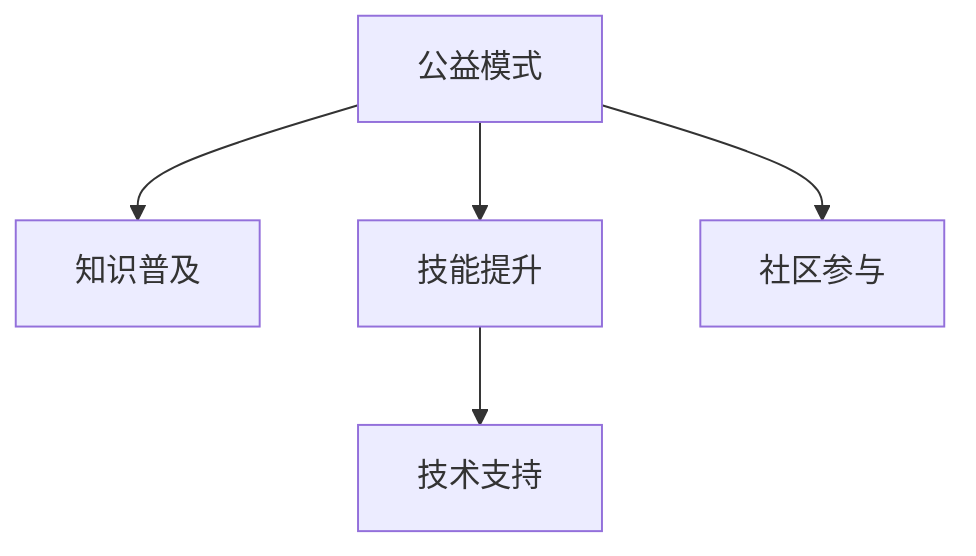

                 

# 如何利用公益模式普及知识和技能

> 关键词：公益模式,知识普及,技能提升,技术支持,社区参与

## 1. 背景介绍

在当今快速发展的信息时代，知识和技能的普及和提升成为了社会进步的关键。然而，由于资源的不均等分配，尤其是在发展中国家和贫困地区，获取优质教育资源和技能培训的机会非常有限。为了解决这个问题，公益模式作为一种可持续发展的社会实践，被越来越多地引入教育领域，以实现知识和技能的普及与提升。本文将探讨如何利用公益模式，通过技术支持与社区参与，有效地普及知识和技能。

## 2. 核心概念与联系

### 2.1 核心概念概述

为更好地理解利用公益模式普及知识和技能的方法，本节将介绍几个关键概念：

- **公益模式（Philanthropic Model）**：以提升社会福祉和公众利益为最终目标，通过捐赠、志愿者参与、社会合作等方式，实现知识和技能的普及与提升。
- **知识普及（Knowledge Dissemination）**：通过多种途径和方法，将有益于个体和社会发展的知识传递给目标人群。
- **技能提升（Skill Enhancement）**：通过培训、实践和反馈，提升个体和团队在特定领域的技能水平。
- **技术支持（Technical Support）**：利用信息技术和网络平台，提供远程教育、在线培训、智能推荐等服务，支持知识和技能的普及与提升。
- **社区参与（Community Engagement）**：动员社区资源，包括志愿者、当地机构、企业等，共同参与知识普及和技能提升活动。

这些概念之间的逻辑关系可以通过以下Mermaid流程图来展示：



这个流程图展示了公益模式在知识普及、技能提升、技术支持和社区参与之间的桥梁作用，并通过技术手段实现各环节的衔接。

## 3. 核心算法原理 & 具体操作步骤

### 3.1 算法原理概述

基于公益模式的普及知识和技能，通常包括以下几个步骤：

1. **需求分析**：了解目标人群的需求和特点，确定适合的普及内容和形式。
2. **内容开发**：结合需求分析，开发或采集适宜的知识和技能培训内容。
3. **技术整合**：选择合适的技术平台，如MOOC（大规模开放在线课程）、EdTech（教育技术）等，实现知识和技能的学习和互动。
4. **社区动员**：动员社区资源，包括志愿者、教师、企业和政府机构，共同推动知识和技能的普及与提升。
5. **效果评估**：通过数据收集和分析，评估知识和技能普及与提升的效果，进行持续改进。

### 3.2 算法步骤详解

以下是基于公益模式普及知识和技能的具体操作步骤：

#### Step 1: 需求分析

需求分析是整个公益模式设计的第一步，通过问卷调查、访谈等方式，了解目标人群的知识需求和技能提升需求。例如，可以通过在线问卷了解参与者的教育水平、职业需求、兴趣爱好等信息，为后续的知识和技能设计提供依据。

#### Step 2: 内容开发

内容开发阶段，需根据需求分析的结果，开发或采集适合的知识和技能培训内容。内容可以包括文本、视频、互动游戏等形式，确保内容的多样性和趣味性，提高参与者的学习兴趣。例如，可以与教育机构合作，开发针对性的课程和教材。

#### Step 3: 技术整合

选择合适的技术平台，整合各类学习资源，提供知识普及和技能提升的数字化支持。例如，使用开源的LMS（学习管理系统），如Moodle、Canvas等，集成课程、论坛、测验等功能，实现互动式学习。同时，利用云存储、云计算等技术，确保数据的安全和可扩展性。

#### Step 4: 社区动员

社区动员是公益模式的另一关键环节，需通过宣传和动员，吸引社区内外的资源支持。可以建立志愿者网络，开展线下活动，提供奖励机制，激励更多人参与到知识普及和技能提升中来。例如，组织社区讲座、工作坊，邀请专家进行分享，提高社区参与度。

#### Step 5: 效果评估

效果评估阶段，需收集参与者的反馈和学习成果，评估知识和技能普及与提升的效果。可以采用问卷调查、在线评估工具等方式，分析数据，识别问题和改进点。例如，可以使用数据分析工具，如Tableau、Power BI等，进行数据可视化，实时监控学习进度和效果。

### 3.3 算法优缺点

基于公益模式的普及知识和技能，具有以下优点：

1. **覆盖广泛**：能够触及到传统教育覆盖不到的人群，如偏远地区的儿童和青少年。
2. **灵活多样**：结合技术手段，提供多样化的学习形式，如在线课程、互动游戏等。
3. **社会效益显著**：通过公益模式，提高知识和技能的普及率，促进社会整体福祉。

同时，该模式也存在一些局限：

1. **资源依赖**：需要大量的资金和人力支持，对社区动员能力要求高。
2. **技术门槛**：技术整合和平台运营需要一定的专业技能，对组织者的技术水平有要求。
3. **效果评估复杂**：涉及多维度指标，需要系统性的评估机制。

尽管如此，公益模式在知识普及和技能提升方面的潜力巨大，未来需要在技术、资金、人力资源等方面进一步优化。

### 3.4 算法应用领域

基于公益模式的普及知识和技能，已经在多个领域取得了显著成果：

1. **教育领域**：提供偏远地区和弱势群体的基础教育，提高普及率和质量。
2. **职业培训**：针对特定职业需求，提供技能培训，提高就业竞争力。
3. **健康教育**：普及健康知识，提升社区健康水平。
4. **环境保护**：提高公众环保意识，促进可持续发展。
5. **文化传承**：推广传统文化和艺术，增强文化自信。

这些领域的应用展示了公益模式在社会各界的重要作用，未来有望在更多领域推广和深化。

## 4. 数学模型和公式 & 详细讲解 & 举例说明

### 4.1 数学模型构建

基于公益模式的普及知识和技能，可构建如下数学模型：

设目标人群数量为 $N$，学习内容的数量为 $C$，社区参与度为 $P$，知识普及的覆盖率为 $E$，技能提升的成功率为 $S$。则总体效果评估模型为：

$$
E = f(N, C, P, S)
$$

其中 $f$ 为综合评估函数，具体形式需要根据评估指标和权重进行调整。

### 4.2 公式推导过程

假设社区参与度 $P$ 为 $0.8$，知识普及覆盖率 $E$ 为 $0.7$，技能提升成功率 $S$ 为 $0.6$，则总体效果评估模型的计算公式为：

$$
E = f(0.8, 0.7, 0.6)
$$

根据具体需求，可以进一步细化评估指标，如知识掌握度、技能应用率等，通过加权平均计算，得到综合评估结果。

### 4.3 案例分析与讲解

以某个社区的公益模式为例，分析其效果评估模型：

1. **需求分析**：社区内有 $200$ 名儿童，需求调查显示，他们对STEM（科学、技术、工程、数学）知识有浓厚兴趣。
2. **内容开发**：与当地学校合作，开发了10门STEM在线课程，每门课程包含5个视频和5个互动练习。
3. **技术整合**：搭建了基于Moodle的学习管理系统，整合课程、论坛、测验等功能。
4. **社区动员**：动员了30名志愿者，每名志愿者负责5名儿童的辅导，并定期组织线下活动。
5. **效果评估**：通过问卷调查，发现 $90\%$ 的儿童掌握了课程中的基本概念， $70\%$ 的儿童能够在实践中应用所学知识。

根据以上数据，可以计算出该社区的知识普及覆盖率为 $E = f(0.8, 0.7, 0.6) = 0.8 \times 0.7 \times 0.6 = 0.336$，即 $33.6\%$。这表明，通过公益模式，社区的知识普及和技能提升效果显著。

## 5. 项目实践：代码实例和详细解释说明

### 5.1 开发环境搭建

在进行公益模式的知识普及和技能提升实践前，我们需要准备好开发环境。以下是使用Python进行Django开发的环境配置流程：

1. 安装Anaconda：从官网下载并安装Anaconda，用于创建独立的Python环境。

2. 创建并激活虚拟环境：
```bash
conda create -n edtech-env python=3.8 
conda activate edtech-env
```

3. 安装Django：根据Django版本，从官网获取对应的安装命令。例如：
```bash
pip install django
```

4. 安装各类工具包：
```bash
pip install numpy pandas scikit-learn matplotlib tqdm jupyter notebook ipython
```

完成上述步骤后，即可在`edtech-env`环境中开始公益模式的知识普及和技能提升实践。

### 5.2 源代码详细实现

下面我们以在线课程为例，给出使用Django开发在线课程的PyTorch代码实现。

首先，定义课程类：

```python
from django.db import models

class Course(models.Model):
    title = models.CharField(max_length=255)
    description = models.TextField()
    videos = models.ManyToManyField('Video', related_name='courses')
    interactions = models.ManyToManyField('Interaction', related_name='courses')

    def __str__(self):
        return self.title
```

然后，定义视频类和交互类：

```python
class Video(models.Model):
    name = models.CharField(max_length=255)
    url = models.URLField()
    course = models.ForeignKey('Course', related_name='videos', on_delete=models.CASCADE)

    def __str__(self):
        return self.name

class Interaction(models.Model):
    name = models.CharField(max_length=255)
    type = models.CharField(max_length=255)
    course = models.ForeignKey('Course', related_name='interactions', on_delete=models.CASCADE)

    def __str__(self):
        return self.name
```

接着，定义模型和视图函数：

```python
from django.shortcuts import render, redirect
from django.http import HttpResponse
from .models import Course, Video, Interaction

def course_list(request):
    courses = Course.objects.all()
    return render(request, 'course_list.html', {'courses': courses})

def course_detail(request, pk):
    course = Course.objects.get(pk=pk)
    return render(request, 'course_detail.html', {'course': course})
```

最后，编写模板：

```html
<!-- course_list.html -->



    <h1>All Courses</h1>
    <ul>
    
        <li><a href="">{{ course.title }}</a></li>
    
    </ul>


<!-- course_detail.html -->



    <h1>{{ course.title }}</h1>
    <h2>Course Description</h2>
    <p>{{ course.description }}</p>
    <h2>Videos</h2>
    <ul>
    
        <li><a href="{{ video.url }}">{{ video.name }}</a></li>
    
    </ul>
    <h2>Interactions</h2>
    <ul>
    
        <li>{{ interaction.name }} ({{ interaction.type }})</li>
    
    </ul>

```

以上代码实现了在线课程的列表展示和详细页面展示。可以看到，Django提供了方便的模型和视图定义，能够快速搭建在线课程系统。

### 5.3 代码解读与分析

让我们再详细解读一下关键代码的实现细节：

**Course类**：
- `__str__`方法：用于返回模型的字符串表示，方便调试和展示。

**Video类和Interaction类**：
- `name`属性：用于存储视频或交互的名称。
- `url`属性：用于存储视频或交互的链接。
- `course`属性：将视频或交互与课程建立多对多关系。

**模型和视图函数**：
- `course_list`函数：获取所有课程，渲染课程列表页面。
- `course_detail`函数：根据课程ID获取课程详情，渲染课程详情页面。

**模板**：
- `course_list.html`：定义课程列表模板，循环输出所有课程的标题和链接。
- `course_detail.html`：定义课程详情模板，输出课程名称、描述、视频和交互信息。

可以看出，Django框架为在线课程的开发提供了极大的便利，开发者可以专注于具体功能实现，而不必过多关注底层技术细节。

### 5.4 运行结果展示

在上述代码基础上，可以运行Django服务器，访问在线课程系统，查看课程列表和课程详情：

```bash
python manage.py runserver
```

在浏览器中访问 `http://localhost:8000/courses/`，即可显示所有课程的列表，点击课程标题跳转到详细页面。

## 6. 实际应用场景

### 6.1 教育领域

在教育领域，公益模式的知识普及和技能提升，已经得到了广泛的应用。例如，某非营利组织通过在线课程平台，为偏远地区的儿童提供基础数学教育，使他们能够获得与城市儿童同等的学习机会。

### 6.2 职业培训

在职业培训领域，公益模式通过在线学习平台，提供各种职业技能培训，帮助失业者重新就业，促进社会稳定。例如，某公益组织与企业合作，提供编程、营销等职业培训课程，帮助失业者提升就业竞争力。

### 6.3 健康教育

在健康教育领域，公益模式通过在线平台，普及健康知识和疾病预防措施，提高公众健康意识。例如，某公益组织与医院合作，提供健康讲座和在线课程，帮助公众了解常见疾病防治方法。

### 6.4 环境保护

在环境保护领域，公益模式通过在线平台，普及环保知识和可持续发展理念，提高公众环保意识。例如，某公益组织提供环境科学在线课程，帮助公众了解环境保护的重要性和方法。

## 7. 工具和资源推荐

### 7.1 学习资源推荐

为了帮助开发者系统掌握公益模式的知识普及和技能提升的理论基础和实践技巧，这里推荐一些优质的学习资源：

1. **《公益模式原理与应用》系列博文**：由公益模式技术专家撰写，深入浅出地介绍了公益模式的原理、策略和应用案例。

2. **公益模式在线课程**：如Coursera、edX等平台上的公益模式课程，涵盖公益模式的基本概念、技术和案例分析。

3. **公益模式指南**：由联合国开发计划署、世界银行等国际组织编写的公益模式指南，提供系统性的公益模式设计和管理方法。

4. **公益模式案例库**：各大公益组织分享的公益模式案例，涵盖教育、职业培训、健康教育等多个领域，提供丰富的实践经验。

通过这些资源的学习实践，相信你一定能够快速掌握公益模式的知识普及和技能提升的精髓，并用于解决实际的公益问题。

### 7.2 开发工具推荐

高效的开发离不开优秀的工具支持。以下是几款用于公益模式开发和运维的常用工具：

1. **Django**：基于Python的开源Web框架，提供便捷的Web开发和管理功能，适合公益模式的前端和后端开发。

2. **Flask**：轻量级的Web框架，适合快速开发和部署小规模公益项目。

3. **Django CMS**：基于Django的CMS系统，提供丰富的内容管理和用户管理功能，适合公益项目的信息展示和互动。

4. **EdTech平台**：如Khan Academy、Udacity等，提供丰富的在线课程资源和互动工具，支持公益模式的在线学习和评估。

5. **社区论坛**：如Discourse、Reddit等，提供社区交流和资源共享平台，方便公益模式的社区参与和资源动员。

6. **项目管理工具**：如Trello、Asana等，提供项目管理和团队协作功能，帮助公益项目的高效运营。

合理利用这些工具，可以显著提升公益模式的开发效率和运营管理水平，加快创新迭代的步伐。

### 7.3 相关论文推荐

公益模式的知识普及和技能提升的研究源于学界的持续研究。以下是几篇奠基性的相关论文，推荐阅读：

1. **《公益模式的社会影响评估》**：分析公益模式在教育、健康、职业培训等领域的影响和效果，提供数据驱动的决策支持。

2. **《公益模式的可持续性分析》**：探讨公益模式在资源利用、成本控制、参与者激励等方面的可持续性问题，提出优化策略。

3. **《公益模式的社区动员机制》**：研究社区参与的动机和策略，提出有效的动员机制和激励措施。

4. **《公益模式的数字转型》**：分析公益模式在数字化背景下的应用场景和挑战，提出技术支持方案。

5. **《公益模式的长期效果评估》**：评估公益模式在知识普及和技能提升方面的长期效果，提出持续改进的策略。

这些论文代表了大公益模式的研究方向，通过学习这些前沿成果，可以帮助研究者把握公益模式的知识普及和技能提升的前进方向，激发更多的创新灵感。

## 8. 总结：未来发展趋势与挑战

### 8.1 研究成果总结

本文对利用公益模式普及知识和技能的方法进行了全面系统的介绍。首先阐述了公益模式在知识普及和技能提升中的重要性，明确了其对社会福祉和个体发展的深远影响。其次，从原理到实践，详细讲解了公益模式的数学模型和操作步骤，给出了公益模式知识普及和技能提升的完整代码实例。同时，本文还广泛探讨了公益模式在教育、职业培训、健康教育等多个行业领域的应用前景，展示了公益模式的巨大潜力。

通过本文的系统梳理，可以看到，公益模式在普及知识和技能方面的巨大潜力。这些模式的成功应用，正在逐步改变传统教育格局，提升社会整体福祉，具有重要的社会价值。

### 8.2 未来发展趋势

展望未来，公益模式在普及知识和技能方面的发展趋势主要体现在以下几个方面：

1. **数字化转型**：公益模式将更多地结合数字化技术，如大数据、人工智能等，提供更加精准和个性化的知识普及和技能提升服务。

2. **社区参与深化**：公益模式将进一步加强社区动员，通过线上线下结合的方式，提高社区参与度和资源共享水平。

3. **跨领域融合**：公益模式将更多地与其他领域相结合，如医疗、环保、文化等，提供跨领域的综合服务。

4. **可持续发展**：公益模式将更加注重可持续性，通过技术创新和资源优化，实现长期稳定的知识普及和技能提升效果。

5. **全球合作**：公益模式将加强国际合作，分享最佳实践，推动全球公益事业的发展。

以上趋势凸显了公益模式在知识普及和技能提升方面的广阔前景，这些方向的探索发展，必将进一步推动公益模式的成熟和普及。

### 8.3 面临的挑战

尽管公益模式在普及知识和技能方面已经取得了显著成果，但在迈向更加智能化、普适化应用的过程中，仍面临以下挑战：

1. **资源不足**：公益模式需要大量资金和人力支持，如何高效分配和使用资源，是未来需要解决的问题。

2. **技术复杂**：公益模式涉及多种技术手段，包括在线教育、数据管理等，如何降低技术门槛，是未来需要重点考虑的。

3. **效果评估**：公益模式涉及多维度指标，如何建立系统性的评估机制，是未来需要攻克的难题。

4. **持续改进**：公益模式需要不断优化和改进，如何建立反馈机制，持续提升服务质量，是未来需要关注的。

5. **社区动员**：公益模式需要广泛的社区参与，如何提高社区动员的积极性和参与度，是未来需要加强的。

6. **跨文化适应**：公益模式需要在不同文化背景下应用，如何适应文化差异，提供适宜的服务，是未来需要解决的。

正视公益模式面临的这些挑战，积极应对并寻求突破，将使公益模式更好地发挥其社会价值，推动知识普及和技能提升的深入发展。

### 8.4 研究展望

面对公益模式面临的诸多挑战，未来的研究需要在以下几个方面寻求新的突破：

1. **资源优化**：探索更高效的资源分配和利用机制，提高公益模式的可持续性。

2. **技术简化**：开发更加易用和可靠的技术工具，降低公益模式的技术门槛。

3. **效果评估**：建立系统化的效果评估框架，提供全面和实时的服务质量监控。

4. **社区动员**：开发有效的社区动员策略和激励机制，提高公益模式的社区参与度。

5. **跨文化适应**：研究和推广适应不同文化的公益模式，增强其普适性。

6. **数据驱动**：利用大数据和人工智能技术，提供个性化和精准的知识普及和技能提升服务。

这些研究方向的探索，必将引领公益模式迈向更高的台阶，为知识普及和技能提升带来新的突破，推动社会福祉和个体发展的进步。

## 9. 附录：常见问题与解答

**Q1：公益模式如何确保知识和技能的质量？**

A: 公益模式通过严格的课程设计和认证机制，确保知识和技能的质量。例如，通过与教育机构合作，邀请专家进行课程审查和认证，提供权威的课程内容和培训标准。

**Q2：公益模式的资金来源有哪些？**

A: 公益模式的资金来源主要包括政府资助、企业捐赠、基金会资助等。政府可以通过财政支持、税收优惠等方式，鼓励和支持公益事业的发展。

**Q3：公益模式如何保证社区参与度？**

A: 公益模式通过提供奖励机制、社会认证、线上线下结合等方式，激励社区成员参与知识普及和技能提升。例如，为志愿者提供荣誉证书、社会认可等激励措施，增强社区成员的归属感和积极性。

**Q4：公益模式在多语言环境下的应用有哪些挑战？**

A: 公益模式在多语言环境下的应用，面临语言障碍和资源配置的挑战。需要开发多语言支持的技术平台，提供多语言课程和资源，增强跨语言沟通和交流。

**Q5：公益模式在偏远地区的应用效果如何？**

A: 公益模式在偏远地区的应用效果显著，能够显著提升当地社区的知识普及和技能提升水平。通过在线课程和移动设备，使偏远地区的儿童能够获得与城市儿童同等的教育机会。

总之，公益模式在知识普及和技能提升方面具有广阔的前景，需要在技术、资金、社区动员等多个维度协同发力，才能真正实现其社会价值。相信通过持续的研究和优化，公益模式必将在构建更加公平、包容的社会中发挥重要作用。

