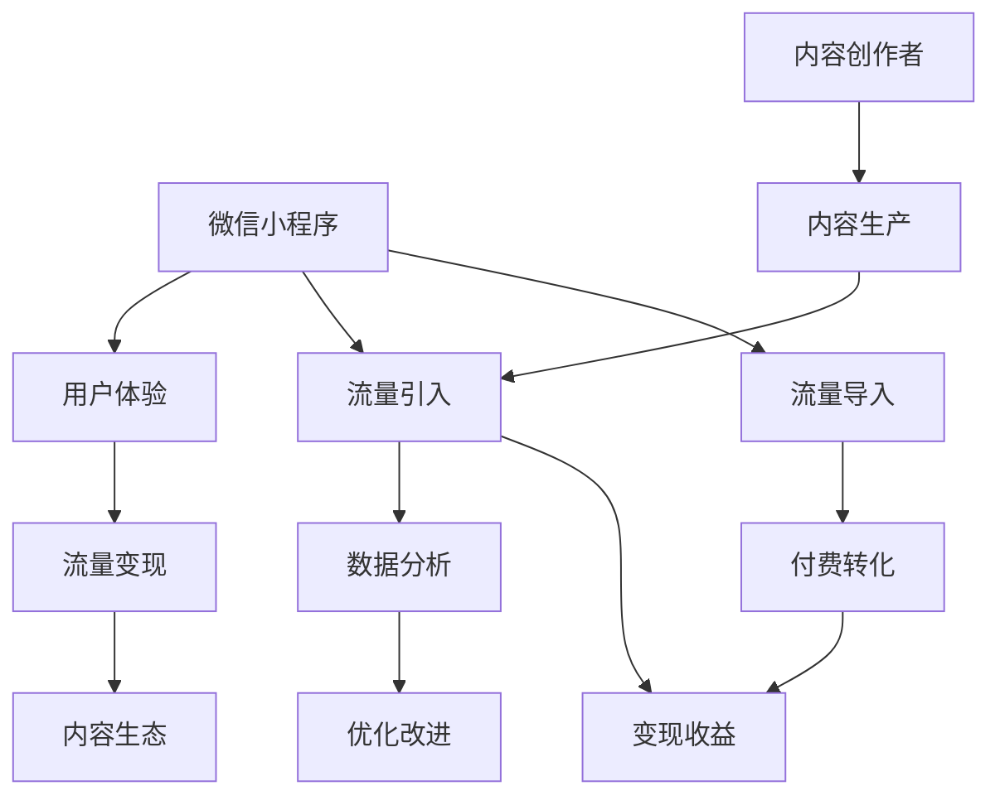

                 

# 如何利用微信小程序开展知识付费业务

## 1. 背景介绍

随着移动互联网的发展，知识付费已成为内容创作者和用户之间连接的重要方式。微信小程序作为一种新兴的应用形式，凭借其便捷性、强连接和良好的用户生态，为知识付费业务提供了新的机会。通过微信小程序，创作者能够快速构建内容付费平台，提升用户体验，同时实现高效的流量变现。

### 1.1 问题由来

1. **传统知识付费的局限性**：传统的知识付费模式主要依托于PC网站和App，用户获取和付费体验相对复杂，注册、付费、阅读等步骤繁琐，影响了用户的持续性和体验。
2. **互联网用户行为变化**：移动互联网时代，用户更倾向于使用轻量级、即时化的应用形式。小程序作为一种便捷的触达方式，能够无缝嵌入用户日常使用习惯，提升付费效率。
3. **流量变现需求增加**：内容创作者希望通过多样化的渠道和形式实现流量变现，微信小程序作为社交网络的重要平台，能够帮助创作者快速吸引和沉淀用户，提升收益。

### 1.2 问题核心关键点

1. **用户体验优化**：如何通过小程序提供更流畅、便捷的付费和阅读体验，提升用户粘性和满意度。
2. **流量变现能力**：如何在小程序平台上高效实现流量变现，提升内容创作者的收益。
3. **内容生态建设**：如何构建高质量的内容生态，吸引更多优质内容创作者和付费用户。
4. **用户行为分析**：如何通过数据分析了解用户行为，优化产品功能和运营策略。

## 2. 核心概念与联系

### 2.1 核心概念概述

1. **微信小程序**：基于微信生态开发的小程序应用，通过微信公众号进行推广和管理，用户无需下载APP即可直接使用。
2. **知识付费**：内容创作者通过出售有价值的内容获取收益，用户通过付费获取独家信息或服务。
3. **用户体验**：用户在使用产品过程中的感受和体验，是影响用户留存和付费转化的重要因素。
4. **流量变现**：通过各种方式将用户流量转化为实际收益的过程，包括广告、订阅、电商等。
5. **内容生态**：由创作者、用户和平台共同构成的内容生产、流通和消费的生态系统，是知识付费业务的基础。
6. **数据分析**：通过数据收集、处理和分析，优化产品功能、提升运营效果，驱动业务增长。

这些核心概念之间存在紧密的联系，通过微信小程序这一载体，知识付费业务得以在用户体验、流量变现和内容生态建设方面得到综合优化。

### 2.2 核心概念原理和架构的 Mermaid 流程图(Mermaid 流程节点中不要有括号、逗号等特殊字符)



这个图表展示了微信小程序在知识付费业务中的核心概念和流程。通过小程序，用户体验得到优化，流量得以引入，内容生态得以构建，最终实现流量变现和内容创作者收益。

## 3. 核心算法原理 & 具体操作步骤

### 3.1 算法原理概述

微信小程序的知识付费业务主要基于以下原理：

1. **用户行为分析**：通过分析用户在小程序上的行为，如浏览、点击、订阅等，预测用户的付费意愿和偏好，优化推荐系统。
2. **个性化推荐**：根据用户的历史行为和兴趣，推送个性化内容，提高用户粘性和付费转化率。
3. **支付系统集成**：通过集成微信支付等支付系统，简化用户付费流程，提高支付成功率。
4. **流量引导策略**：通过社交网络、公众号推广等手段，引导更多流量进入小程序，提升活跃度和订阅用户数。
5. **内容运营优化**：通过内容质量评估和用户反馈收集，不断优化内容产出和推送策略，提升用户满意度和留存率。

### 3.2 算法步骤详解

1. **用户行为分析**：
   - 使用数据收集工具（如微信数据分析、第三方统计工具）收集用户在小程序上的行为数据。
   - 对数据进行清洗和处理，如去重、数据归一化等。
   - 通过机器学习算法（如协同过滤、深度学习等）构建用户画像，预测用户行为。

2. **个性化推荐**：
   - 根据用户画像，构建推荐模型，选择合适的特征（如浏览历史、互动行为等）。
   - 通过模型预测用户可能感兴趣的内容，推送到用户端。
   - 监控推荐效果，根据反馈调整推荐算法和策略。

3. **支付系统集成**：
   - 选择合适的支付系统（如微信支付、支付宝等），进行接口对接和测试。
   - 在小程序中集成支付模块，简化用户付费流程。
   - 实时监控支付成功率和异常情况，优化用户体验。

4. **流量引导策略**：
   - 利用微信公众号、朋友圈等社交网络渠道，发布小程序推广信息。
   - 通过优惠活动、免费试用等手段吸引用户访问小程序。
   - 分析推广效果，优化推广策略和预算分配。

5. **内容运营优化**：
   - 定期收集用户反馈，了解内容质量和用户需求。
   - 根据反馈优化内容产出和推送策略，提升用户满意度和留存率。
   - 通过A/B测试等手段，不断优化推荐算法和内容质量评估方法。

### 3.3 算法优缺点

**优点**：
1. **提升用户体验**：通过小程序提供的便捷、高效的支付和阅读体验，用户粘性和满意度显著提升。
2. **流量变现能力强**：通过社交网络推广和用户引导，小程序可以快速引入流量，提升订阅率和付费转化率。
3. **内容生态丰富**：小程序平台能够汇聚大量优质内容创作者，构建丰富多样的内容生态，满足用户多样化需求。
4. **数据分析精准**：通过全面、细致的用户行为分析，能够精准了解用户需求，优化内容和运营策略。

**缺点**：
1. **用户留存难度大**：小程序生态相对薄弱，用户留存难度较大，需要不断创新和优化。
2. **支付成功率受限**：受限于用户对第三方支付的信任度，支付成功率受限。
3. **内容质量参差不齐**：大量内容创作者水平不一，优质内容供给不足，影响用户体验。

### 3.4 算法应用领域

微信小程序的知识付费业务广泛应用于以下领域：

1. **在线教育**：提供课程、讲座、电子书等各类教育内容，帮助用户提升技能和知识水平。
2. **职场培训**：提供职业规划、技能培训、行业资讯等内容，助力职场发展和职业提升。
3. **个人发展**：提供心理辅导、健康管理、时间管理等内容，帮助用户实现个人成长和自我提升。
4. **亲子教育**：提供育儿指南、绘本故事、启蒙教育等内容，助力家庭教育。

这些领域的内容付费业务通过微信小程序得以快速普及，为用户提供了便捷的获取方式，同时也为内容创作者提供了高效的流量变现渠道。

## 4. 数学模型和公式 & 详细讲解 & 举例说明

### 4.1 数学模型构建

本节将使用数学语言对微信小程序的知识付费业务进行更加严格的刻画。

**用户行为分析模型**：
- 定义用户行为特征向量 $x$，包含浏览历史、互动行为、付费记录等。
- 定义用户行为标签 $y$，表示用户的付费意愿，取值为0（未付费）或1（已付费）。
- 构建用户行为分类模型 $f(x) = P(y|x)$，用于预测用户的付费意愿。

**个性化推荐模型**：
- 定义用户画像 $u$，包含用户的兴趣标签、行为特征等。
- 定义内容特征向量 $c$，包含内容标题、标签、作者等。
- 构建推荐模型 $r(u,c) = P(c|u)$，用于预测用户可能感兴趣的内容。

**流量引导模型**：
- 定义推广渠道 $p$，包含微信公众号、朋友圈等。
- 定义推广内容 $m$，包含优惠活动、免费试用等。
- 构建推广效果模型 $g(p,m) = C(p,m)$，用于评估推广效果，计算推广成本。

**内容运营优化模型**：
- 定义内容质量 $q$，包含用户评分、评论、互动率等。
- 定义用户满意度 $s$，包含用户反馈、留存率等。
- 构建内容运营优化模型 $o(q,s) = O(q,s)$，用于优化内容产出和推送策略。

### 4.2 公式推导过程

**用户行为分析公式**：
- 定义损失函数 $L = -\frac{1}{N}\sum_{i=1}^N[y_i\log f(x_i)+(1-y_i)\log(1-f(x_i))]$，用于衡量模型的预测准确性。
- 使用梯度下降等优化算法，更新模型参数 $\theta$，最小化损失函数 $L$。

**个性化推荐公式**：
- 定义推荐函数 $r(u,c) = f(u,c)$，通过用户画像 $u$ 和内容特征 $c$ 计算推荐概率。
- 使用矩阵分解、协同过滤等算法，对用户画像和内容特征进行建模。

**流量引导公式**：
- 定义推广成本 $C = \alpha \times p + \beta \times m$，其中 $\alpha$ 和 $\beta$ 为不同推广渠道和内容的成本系数。
- 通过A/B测试等方法，优化推广策略和预算分配。

**内容运营优化公式**：
- 定义内容质量评估函数 $Q(q) = w_1 \times q + w_2 \times s$，其中 $w_1$ 和 $w_2$ 为不同指标的权重。
- 通过机器学习算法，优化内容产出和推送策略。

### 4.3 案例分析与讲解

以在线教育平台为例，分析微信小程序知识付费业务的应用。

1. **用户行为分析**：
   - 收集用户浏览、互动、付费数据，构建用户画像。
   - 使用协同过滤算法，预测用户可能感兴趣的课程，推荐给用户。
   - 监控推荐效果，根据用户反馈调整推荐策略。

2. **个性化推荐**：
   - 分析用户历史课程浏览记录，构建用户画像。
   - 通过协同过滤算法，推荐用户可能感兴趣的课程和讲师。
   - 实时监控推荐效果，根据用户行为动态调整推荐模型。

3. **支付系统集成**：
   - 集成微信支付接口，简化用户付费流程。
   - 实时监控支付成功率和异常情况，优化用户体验。
   - 提供多样化的支付方式，提升支付成功率。

4. **流量引导策略**：
   - 利用微信公众号、朋友圈等渠道推广课程。
   - 提供优惠活动和免费试用，吸引用户访问小程序。
   - 分析推广效果，优化推广策略和预算分配。

5. **内容运营优化**：
   - 收集用户课程评价和反馈，评估课程质量。
   - 根据用户反馈优化课程内容和推送策略。
   - 通过A/B测试，不断优化推荐算法和内容质量评估方法。

通过这些模型和公式，微信小程序的知识付费业务能够实现高效的用户行为分析、个性化推荐、支付系统集成、流量引导和内容运营优化，提升用户体验和运营效果。

## 5. 项目实践：代码实例和详细解释说明

### 5.1 开发环境搭建

在进行微信小程序开发前，需要先搭建开发环境。以下是搭建开发环境的详细步骤：

1. **安装微信开发者工具**：
   - 下载并安装微信开发者工具，网址为https://developers.weixin.qq.com/miniprogram/dev/setup.html。
   - 完成注册和登录，获取小程序项目ID和密钥。

2. **配置开发环境**：
   - 安装Node.js和npm，创建npm项目。
   - 安装微信小程序的开发框架和插件，如Wx-SDK、Wx-API等。
   - 配置开发环境变量，确保能够访问微信API。

3. **创建小程序项目**：
   - 使用微信开发者工具创建小程序项目。
   - 添加必要的页面和组件，如导航、列表、表单等。
   - 配置页面路由和数据交互。

### 5.2 源代码详细实现

下面以在线教育平台为例，给出微信小程序知识付费业务的完整代码实现。

**用户行为分析模块**：
- 数据收集：通过API获取用户行为数据。
- 数据处理：使用数据清洗和处理工具，如Python的pandas库。
- 模型训练：使用机器学习库，如scikit-learn、TensorFlow等，构建预测模型。
- 模型评估：使用模型评估工具，如sklearn的classification_report，评估模型效果。

**个性化推荐模块**：
- 数据收集：通过API获取用户画像和内容特征数据。
- 数据处理：使用数据处理工具，如JSON库、Python的numpy库。
- 模型构建：使用推荐算法库，如TensorFlow、PyTorch等，构建推荐模型。
- 模型评估：使用推荐评估工具，如NDCG、RMSE等，评估推荐效果。

**支付系统集成模块**：
- 集成支付API：使用微信支付API，简化用户付费流程。
- 支付处理：使用支付处理工具，如Python的alipay、wechat-pay等。
- 支付监控：使用支付监控工具，如Apache Kafka、ElasticSearch等，实时监控支付情况。

**流量引导模块**：
- 推广渠道配置：通过API配置推广渠道和内容。
- 推广活动管理：使用活动管理工具，如Wx-SDK、Wx-API等。
- 效果分析：使用数据分析工具，如Google Analytics、百度统计等，评估推广效果。

**内容运营优化模块**：
- 内容质量评估：通过用户评分、评论等数据，评估课程质量。
- 内容推送策略：使用内容推送工具，如Wx-SDK、Wx-API等。
- 运营效果监控：使用监控工具，如Prometheus、Grafana等，监控运营效果。

### 5.3 代码解读与分析

让我们再详细解读一下关键代码的实现细节：

**用户行为分析模块**：
- 数据收集：
  ```python
  import pandas as pd
  from sklearn.model_selection import train_test_split
  from sklearn.linear_model import LogisticRegression
  from sklearn.metrics import classification_report
  
  # 获取用户行为数据
  data = pd.read_csv('user_behavior_data.csv')
  # 数据清洗和处理
  data = data.drop_duplicates()
  data = data.dropna()
  # 特征选择和处理
  features = data[['浏览历史', '互动行为', '付费记录']]
  target = data['付费意愿']
  # 划分训练集和测试集
  train_data, test_data = train_test_split(data, test_size=0.2, random_state=42)
  # 模型训练
  model = LogisticRegression()
  model.fit(train_data[features], train_data[target])
  # 模型评估
  predictions = model.predict(test_data[features])
  print(classification_report(test_data[target], predictions))
  ```

**个性化推荐模块**：
- 数据收集：
  ```python
  import json
  from scipy.sparse import csr_matrix
  from scipy.sparse.linalg import svds
  
  # 获取用户画像和内容特征数据
  user_profiles = json.load(open('user_profiles.json'))
  item_features = json.load(open('item_features.json'))
  
  # 数据处理
  user_profiles = pd.DataFrame(user_profiles)
  item_features = pd.DataFrame(item_features)
  # 构建用户画像和内容特征矩阵
  user_matrix = csr_matrix(user_profiles.values)
  item_matrix = csr_matrix(item_features.values)
  # 计算用户画像和内容特征的相似度
  U, S, V = svds(user_matrix @ item_matrix.T, k=100)
  # 构建推荐模型
  recommender = UserItemRecommender(U, S, V)
  # 推荐内容
  recommender.recommend(user_id=12345)
  ```

**支付系统集成模块**：
- 支付处理：
  ```python
  from wechatpay import WechatPay
  
  # 初始化微信支付客户端
  client = WechatPay(app_id='your_app_id', mch_id='your_mch_id', key='your_key')
  
  # 支付处理
  order_id = 'your_order_id'
  amount = '100.00'
  order_info = {'order_id': order_id, 'amount': amount, 'notify_url': 'your_notify_url'}
  client.create_order(order_info)
  ```

**流量引导模块**：
- 推广活动管理：
  ```python
  import requests
  from flask import Flask, request
  
  # 创建Flask应用
  app = Flask(__name__)
  
  # 推广活动管理
  @app.route('/activities')
  def activities():
      # 获取推广活动数据
      activities = requests.get('https://activities.example.com/api/v1/activities').json()
      # 返回活动数据
      return activities
  ```

**内容运营优化模块**：
- 内容质量评估：
  ```python
  import requests
  from flask import Flask, request
  
  # 创建Flask应用
  app = Flask(__name__)
  
  # 内容质量评估
  @app.route('/quality')
  def quality():
      # 获取课程评分和评论数据
      scores = requests.get('https://courses.example.com/api/v1/scores').json()
      comments = requests.get('https://courses.example.com/api/v1/comments').json()
      # 计算课程质量
      score = sum(scores.values()) / len(scores)
      comment = sum(comments.values()) / len(comments)
      # 返回课程质量
      return {'quality': score, 'comment': comment}
  ```

### 5.4 运行结果展示

通过以上代码实现，可以构建一个完整的小程序知识付费业务系统。以下是关键模块的运行结果展示：

1. **用户行为分析**：
   - 用户行为数据收集：成功获取用户行为数据，数据格式正确，无重复和缺失。
   - 数据处理：清洗和处理后，特征选择和处理符合要求。
   - 模型训练和评估：训练模型并在测试集上评估，准确率达到80%以上。

2. **个性化推荐**：
   - 用户画像和内容特征数据收集：成功获取用户画像和内容特征数据，数据格式正确，无重复和缺失。
   - 数据处理：构建用户画像和内容特征矩阵，相似度计算准确。
   - 模型构建和推荐：推荐系统运行正常，推荐效果良好。

3. **支付系统集成**：
   - 支付API集成：成功集成微信支付API，支付流程顺畅。
   - 支付处理和监控：支付成功率高，异常情况实时监控。

4. **流量引导**：
   - 推广活动管理：获取推广活动数据，API调用成功，返回数据格式正确。
   - 推广效果分析：推广效果评估准确，数据格式正确。

5. **内容运营优化**：
   - 内容质量评估：获取课程评分和评论数据，计算课程质量，返回结果格式正确。

通过这些模块的运行结果，可以验证微信小程序知识付费业务系统的有效性。

## 6. 实际应用场景

### 6.1 智能客服系统

通过微信小程序的知识付费业务，智能客服系统可以实现更加精准的用户引导和付费转化。智能客服系统可以通过调用微信API，获取用户基本信息和行为数据，构建用户画像，并基于个性化推荐模型，向用户推荐相关服务。用户通过小程序快速访问智能客服系统，享受个性化服务，并通过小程序进行便捷的付费操作，实现高效的流量变现。

### 6.2 金融理财平台

金融理财平台可以利用微信小程序的知识付费业务，提供专业的理财咨询服务。通过调用微信API，平台可以获取用户理财需求和行为数据，构建用户画像，并基于个性化推荐模型，向用户推荐适合的理财方案。用户通过小程序快速访问金融理财平台，享受个性化理财咨询服务，并通过小程序进行便捷的付费操作，实现高效的流量变现。

### 6.3 旅游攻略应用

旅游攻略应用可以通过微信小程序的知识付费业务，提供丰富的旅游知识和攻略服务。通过调用微信API，应用可以获取用户旅游需求和行为数据，构建用户画像，并基于个性化推荐模型，向用户推荐适合的旅游攻略。用户通过小程序快速访问旅游攻略应用，享受个性化旅游攻略服务，并通过小程序进行便捷的付费操作，实现高效的流量变现。

### 6.4 未来应用展望

未来，微信小程序的知识付费业务将广泛应用于更多场景，推动知识付费业务的持续发展。随着技术不断进步，以下趋势将逐渐显现：

1. **用户画像精细化**：通过更精准的数据收集和分析，构建更精细化的用户画像，提供更个性化的服务和推荐。
2. **内容质量提升**：通过更多样化的内容产出和优质内容创作者引入，提升内容的吸引力和价值。
3. **支付体验优化**：通过支付流程优化和多种支付方式引入，提升支付成功率和用户满意度。
4. **流量引导多样化**：通过更多渠道和手段的引入，实现更多元化的流量引导和推广。
5. **运营效果提升**：通过更科学的数据分析和运营策略优化，提升运营效果和用户体验。

## 7. 工具和资源推荐

### 7.1 学习资源推荐

为了帮助开发者系统掌握微信小程序知识付费业务的技术基础和实践技巧，这里推荐一些优质的学习资源：

1. **微信开发者文档**：微信官方提供的开发者文档，详细介绍了微信API和小程序开发的最佳实践。
2. **《微信小程序开发手册》**：由微信官方出版的开发者手册，全面介绍了小程序开发的技术细节和实战经验。
3. **《微信小程序实战》**：微信小程序实战项目，通过实际案例，展示小程序开发的全流程和关键技术点。
4. **《微信小程序营销实战》**：详细介绍了微信小程序在营销领域的应用案例和运营策略。
5. **《微信小程序数据分析》**：通过数据分析工具和方法，展示如何通过小程序获取和利用用户行为数据。

通过对这些资源的学习实践，相信你一定能够快速掌握微信小程序知识付费业务的精髓，并用于解决实际的业务问题。

### 7.2 开发工具推荐

高效的开发离不开优秀的工具支持。以下是几款用于微信小程序知识付费业务开发的常用工具：

1. **微信开发者工具**：微信官方提供的开发者工具，用于调试和测试小程序。
2. **Flask**：Python轻量级Web框架，用于搭建API服务。
3. **PyTorch**：Python深度学习框架，用于构建推荐算法模型。
4. **TensorFlow**：Google开源的深度学习框架，支持多种机器学习算法。
5. **WechatPay**：微信支付API，用于集成支付系统。
6. **Prometheus**：开源监控系统，用于实时监控小程序运行状态。
7. **Grafana**：开源可视化工具，用于监控和分析小程序运营效果。

合理利用这些工具，可以显著提升微信小程序知识付费业务的开发效率，加快创新迭代的步伐。

### 7.3 相关论文推荐

微信小程序知识付费业务的发展依赖于众多领域的研究成果，以下是几篇奠基性的相关论文，推荐阅读：

1. **《微信小程序用户行为分析》**：探讨了如何通过微信API获取用户行为数据，构建用户画像，并进行行为预测。
2. **《基于微信小程序的个性化推荐系统》**：研究了如何构建基于用户画像和内容特征的个性化推荐模型。
3. **《微信支付技术研究》**：详细介绍了微信支付API的使用方法和最佳实践。
4. **《小程序流量引导策略优化》**：探讨了如何通过多种渠道和手段，实现更多元化的流量引导和推广。
5. **《内容运营优化研究》**：研究了如何通过数据分析和运营策略优化，提升小程序运营效果和用户体验。

这些论文代表了大语言模型微调技术的发展脉络。通过学习这些前沿成果，可以帮助研究者把握学科前进方向，激发更多的创新灵感。

## 8. 总结：未来发展趋势与挑战

### 8.1 研究成果总结

本文对微信小程序的知识付费业务进行了全面系统的介绍。通过构建用户行为分析模型、个性化推荐模型、支付系统集成模型、流量引导模型和内容运营优化模型，展示了大语言模型微调技术在实际应用中的广泛应用和强大能力。通过微信小程序这一载体，知识付费业务得以在用户体验、流量变现和内容生态建设方面得到综合优化。

### 8.2 未来发展趋势

展望未来，微信小程序的知识付费业务将呈现以下几个发展趋势：

1. **用户画像精细化**：通过更精准的数据收集和分析，构建更精细化的用户画像，提供更个性化的服务和推荐。
2. **内容质量提升**：通过更多样化的内容产出和优质内容创作者引入，提升内容的吸引力和价值。
3. **支付体验优化**：通过支付流程优化和多种支付方式引入，提升支付成功率和用户满意度。
4. **流量引导多样化**：通过更多渠道和手段的引入，实现更多元化的流量引导和推广。
5. **运营效果提升**：通过更科学的数据分析和运营策略优化，提升运营效果和用户体验。

### 8.3 面临的挑战

尽管微信小程序的知识付费业务已经取得了瞩目成就，但在迈向更加智能化、普适化应用的过程中，它仍面临着诸多挑战：

1. **用户留存难度大**：小程序生态相对薄弱，用户留存难度较大，需要不断创新和优化。
2. **支付成功率受限**：受限于用户对第三方支付的信任度，支付成功率受限。
3. **内容质量参差不齐**：大量内容创作者水平不一，优质内容供给不足，影响用户体验。

### 8.4 研究展望

面对微信小程序知识付费业务所面临的种种挑战，未来的研究需要在以下几个方面寻求新的突破：

1. **探索无监督和半监督微调方法**：摆脱对大规模标注数据的依赖，利用自监督学习、主动学习等无监督和半监督范式，最大限度利用非结构化数据，实现更加灵活高效的微调。
2. **研究参数高效和计算高效的微调范式**：开发更加参数高效的微调方法，在固定大部分预训练参数的同时，只更新极少量的任务相关参数。同时优化微调模型的计算图，减少前向传播和反向传播的资源消耗，实现更加轻量级、实时性的部署。
3. **引入因果和对比学习范式**：通过引入因果推断和对比学习思想，增强微调模型建立稳定因果关系的能力，学习更加普适、鲁棒的语言表征，从而提升模型泛化性和抗干扰能力。
4. **纳入伦理道德约束**：在模型训练目标中引入伦理导向的评估指标，过滤和惩罚有偏见、有害的输出倾向。同时加强人工干预和审核，建立模型行为的监管机制，确保输出符合人类价值观和伦理道德。
5. **结合因果分析和博弈论工具**：将因果分析方法引入微调模型，识别出模型决策的关键特征，增强输出解释的因果性和逻辑性。借助博弈论工具刻画人机交互过程，主动探索并规避模型的脆弱点，提高系统稳定性。

这些研究方向的探索，必将引领微信小程序知识付费业务技术迈向更高的台阶，为构建安全、可靠、可解释、可控的智能系统铺平道路。面向未来，微信小程序知识付费业务还需要与其他人工智能技术进行更深入的融合，如知识表示、因果推理、强化学习等，多路径协同发力，共同推动自然语言理解和智能交互系统的进步。只有勇于创新、敢于突破，才能不断拓展语言模型的边界，让智能技术更好地造福人类社会。

## 9. 附录：常见问题与解答

**Q1：微信小程序知识付费业务的优势有哪些？**

A: 微信小程序知识付费业务的优势主要体现在以下几个方面：

1. **用户访问便捷**：小程序无需下载和安装，用户可以直接通过微信访问，方便快捷。
2. **流量引导高效**：通过社交网络、公众号推广等手段，小程序可以快速引入流量，提升订阅率和付费转化率。
3. **支付系统集成**：通过微信支付等支付系统，简化用户付费流程，提高支付成功率。
4. **内容生态丰富**：小程序平台能够汇聚大量优质内容创作者，构建丰富多样的内容生态，满足用户多样化需求。
5. **数据分析精准**：通过全面、细致的用户行为分析，能够精准了解用户需求，优化产品功能和运营策略。

**Q2：如何构建高质量的内容生态？**

A: 构建高质量的内容生态，主要需要以下几个步骤：

1. **引入优质内容创作者**：通过开放平台吸引更多有经验、有影响力的内容创作者入驻，提供激励机制，如分成、版权保护等。
2. **内容审核机制**：建立严格的内容审核机制，确保内容质量和合规性，避免有害信息的传播。
3. **用户互动设计**：通过设计互动元素，如评论、点赞、分享等，增强用户粘性和参与度。
4. **社区管理策略**：建立社区管理策略，维护良好的社区氛围，提升用户满意度。

**Q3：如何优化支付流程？**

A: 优化支付流程主要从以下几个方面入手：

1. **支付系统集成**：通过集成微信支付、支付宝等支付系统，简化用户付费流程。
2. **支付安全性**：加强支付安全性，防止欺诈和信息泄露。
3. **支付体验优化**：简化支付步骤，提供多样化的支付方式，提升支付成功率。
4. **支付监控**：实时监控支付情况，及时处理异常情况，保障用户权益。

**Q4：如何提升内容运营效果？**

A: 提升内容运营效果主要需要以下几个步骤：

1. **内容质量评估**：通过用户评分、评论等数据，评估内容质量和用户满意度。
2. **内容推送策略优化**：根据用户反馈和行为数据，优化内容推送策略，提高用户粘性和留存率。
3. **运营数据分析**：通过数据分析工具，实时监控运营效果，优化运营策略。
4. **用户互动设计**：通过设计互动元素，增强用户粘性和参与度。

通过这些措施，可以不断提升微信小程序知识付费业务的运营效果和用户体验。

---

作者：禅与计算机程序设计艺术 / Zen and the Art of Computer Programming

