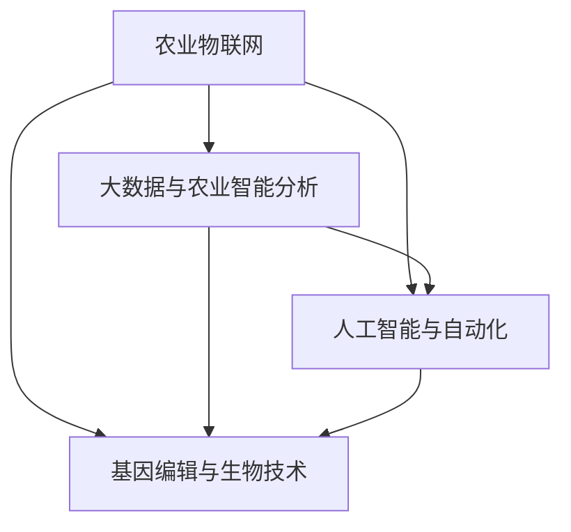

                 

## 1. 背景介绍

### 1.1 问题由来

农业作为人类社会的重要基础，其创新和发展关乎国家粮食安全、环境保护和乡村振兴等重大问题。传统农业依赖人力、经验和历史数据的积累，面对气候变化、病虫害、环境污染等挑战，缺乏快速响应和科学决策的手段。当前，农业科技创新正进入数字化、智能化转型期，如何有效利用技术手段，提升农业生产效率和环境可持续性，成为全球关注的焦点。

### 1.2 问题核心关键点

农业科技创新的核心在于如何利用先进的科技手段，如物联网、大数据、人工智能等，实现农业生产的精准化、智能化、高效化和可持续化。其中，利用技术能力进行农业科技创新主要包括以下几个方面：

- 农业物联网技术：通过传感器、无人机、卫星遥感等手段，实时监测农作物的生长状况、土壤条件、气象变化等信息，提升农业生产管理的精准度。
- 大数据与农业智能分析：基于大数据和机器学习技术，分析历史和实时数据，预测农业生产风险和优化种植策略，实现个性化农业管理。
- 人工智能与自动化：应用机器学习、自然语言处理等AI技术，提高农业决策的自动化水平，辅助农民科学决策。
- 基因编辑与生物技术：利用基因编辑、生物技术等前沿科技，改善作物品质、增加产量和抗逆性，提升农业的可持续发展能力。

这些技术的应用，有助于实现农业生产的科学化、智能化和可持续发展，为解决农业生产中的实际问题提供了新思路和新方法。

### 1.3 问题研究意义

农业科技创新对于提高农业生产效率、保障食品安全、促进农村经济发展具有重要意义。通过技术手段进行农业创新，不仅可以提高土地产出率和水资源利用率，还能有效应对气候变化、病虫害等挑战，推动农业绿色发展。此外，农业科技创新的进步，还将加速农业机械化和自动化进程，降低农业劳动力成本，提高农业竞争力。

## 2. 核心概念与联系

### 2.1 核心概念概述

为更好地理解如何利用技术能力进行农业科技创新，本节将介绍几个密切相关的核心概念：

- 农业物联网(IoT in Agriculture)：通过物联网技术，实现农业生产的实时监测、数据采集和远程控制，提升农业管理的精准度和效率。
- 大数据与农业智能分析(Big Data and Agricultural Intelligence)：基于大数据和机器学习技术，对农业数据进行分析，预测农业生产风险和优化种植策略，实现智能化农业管理。
- 人工智能与自动化(Artificial Intelligence and Automation)：利用机器学习、自然语言处理等AI技术，提高农业决策的自动化水平，辅助农民科学决策。
- 基因编辑与生物技术(Gene Editing and Biotechnology)：利用基因编辑、生物技术等前沿科技，改善作物品质、增加产量和抗逆性，提升农业的可持续发展能力。

这些核心概念之间的逻辑关系可以通过以下Mermaid流程图来展示：



这个流程图展示了大农业科技创新的核心概念及其之间的关系：

1. 农业物联网提供实时数据采集和监测能力。
2. 大数据与农业智能分析利用数据进行农业风险预测和决策支持。
3. 人工智能与自动化提升农业决策的自动化水平。
4. 基因编辑与生物技术优化作物品质和抗逆性。
5. 这些核心技术相互配合，推动农业生产的高效化和智能化。

## 3. 核心算法原理 & 具体操作步骤

### 3.1 算法原理概述

农业科技创新的核心在于利用先进的科技手段，提高农业生产的效率和可持续性。基于此，本文将重点介绍利用人工智能、大数据和物联网技术，实现农业生产的高效化和智能化的算法原理和操作步骤。

### 3.2 算法步骤详解

基于人工智能、大数据和物联网技术的农业科技创新主要包括以下几个关键步骤：

**Step 1: 数据采集与预处理**
- 利用农业物联网技术，收集土壤、气象、病虫害等信息，通过传感器、无人机、卫星遥感等手段，实现对农业生产的实时监测。
- 将采集到的数据进行预处理，包括去噪、归一化、特征提取等操作，为后续分析提供高质量的数据。

**Step 2: 数据存储与管理**
- 将处理后的数据存储在大数据平台中，如Hadoop、Spark等，方便后续的数据分析与处理。
- 建立数据管理系统，实现数据的分类、存储和访问控制，确保数据的安全性和可用性。

**Step 3: 数据建模与分析**
- 利用机器学习算法，对历史和实时数据进行建模和分析，预测农业生产风险和优化种植策略。
- 应用深度学习技术，训练预测模型，实现对农业生产的智能预测和决策支持。

**Step 4: 农业决策支持**
- 基于智能分析结果，提供农业生产决策建议，如最佳种植时间、肥料使用量、病虫害防治措施等。
- 利用物联网技术，实现远程控制和智能灌溉、施肥等操作，提高农业生产管理的精准度。

**Step 5: 模型优化与验证**
- 根据实际生产效果，对预测模型进行优化和验证，不断提升模型精度和泛化能力。
- 利用A/B测试等方法，评估模型在不同条件下的表现，确保模型的稳定性和可靠性。

### 3.3 算法优缺点

利用人工智能、大数据和物联网技术进行农业科技创新的优点：
1. 提高生产效率：通过实时监测和数据分析，优化种植策略，提高土地产出率和水资源利用率。
2. 降低成本：减少人工操作，提高自动化水平，降低农业生产成本。
3. 促进可持续发展：通过智能分析，优化资源利用，减少环境污染和资源浪费。
4. 提升管理精度：实时数据采集和分析，提升农业生产管理的精准度，提高决策科学性。

同时，这些技术的应用也存在一定的局限性：
1. 技术门槛高：物联网设备、大数据平台和AI模型需要较高的技术投入和专业技能。
2. 数据质量要求高：采集到的数据需要经过严格的预处理和质量控制，才能保证分析结果的准确性。
3. 设备成本高：农业物联网设备和传感器等硬件设施成本较高，需要较高的前期投入。
4. 数据隐私问题：农业数据的隐私保护需要重视，避免数据泄露和滥用。
5. 模型复杂度高：深度学习和机器学习模型复杂度高，训练和优化需要较高的计算资源。

尽管存在这些局限性，但就目前而言，利用人工智能、大数据和物联网技术进行农业创新，已成为提高农业生产效率和可持续性的重要手段。未来相关研究的重点在于如何进一步降低技术门槛，提高模型的自动化和智能化水平，同时兼顾数据隐私和安全等因素。

### 3.4 算法应用领域

利用人工智能、大数据和物联网技术的农业科技创新，在农业生产的各个环节都有广泛的应用，例如：

- 精准农业：通过物联网设备和传感器，实时监测农作物的生长状况、土壤条件、气象变化等信息，提升农业生产管理的精准度。
- 农业机器人：利用无人驾驶、自动导航等技术，实现农业机械的自动化和智能化操作，提高生产效率。
- 病虫害预测与防治：通过大数据和机器学习技术，预测病虫害发生情况，及时采取防治措施，减少农作物损失。
- 智能灌溉：基于传感器数据和智能分析，优化灌溉计划，实现水资源的节约和利用效率的提升。
- 智能施肥：通过数据分析和模型预测，优化施肥方案，提高肥料利用率和作物产量。
- 农产品追溯：利用区块链技术和大数据，实现农产品的追溯和质量安全监控，保障食品安全。

除了上述这些经典应用外，农业科技创新的未来发展方向还包括无人机植保、农业无人机、农业物联网平台等，为农业生产带来更多的智能化解决方案。随着技术的日益成熟，相信农业科技创新的前景将更加广阔，为农业生产带来深远的影响。

## 4. 数学模型和公式 & 详细讲解 & 举例说明

### 4.1 数学模型构建

本文将以农业生产中的智能灌溉系统为例，介绍如何利用数学模型进行数据分析和优化。

假设智能灌溉系统采集到的气象数据为 $X=(X_1,X_2,\cdots,X_n)$，其中 $X_i$ 表示第 $i$ 天的水分需求。利用机器学习模型预测未来 $k$ 天的灌溉需求，记为 $\hat{Y}=(\hat{Y}_1,\hat{Y}_2,\cdots,\hat{Y}_k)$。智能灌溉系统的目标是最小化灌溉需求与预测需求之间的差距，即最小化损失函数 $L=\sum_{i=1}^k(X_i-\hat{Y}_i)^2$。

### 4.2 公式推导过程

根据最小二乘法的原理，利用历史气象数据 $D=\{(X_i,Y_i)\}_{i=1}^n$，对 $L$ 进行优化，求解最优的预测模型参数 $\theta$：

$$
\theta = \mathop{\arg\min}_{\theta} \sum_{i=1}^k(X_i-\hat{Y}_i)^2
$$

令 $\hat{Y}_i=f(X_i,\theta)$，其中 $f$ 为预测函数。则损失函数可以表示为：

$$
L(\theta)=\sum_{i=1}^k(X_i-f(X_i,\theta))^2
$$

对 $L(\theta)$ 进行一阶导数求导，得到梯度：

$$
\nabla_{\theta}L(\theta)=\sum_{i=1}^k2(X_i-f(X_i,\theta))f'(X_i,\theta)
$$

其中 $f'(X_i,\theta)$ 为 $f$ 对 $X_i$ 的导数。通过梯度下降等优化算法，更新参数 $\theta$：

$$
\theta \leftarrow \theta - \eta\nabla_{\theta}L(\theta)
$$

其中 $\eta$ 为学习率。

### 4.3 案例分析与讲解

假设智能灌溉系统采集到的气象数据为 $X=(X_1,X_2,\cdots,X_n)$，其中 $X_i$ 表示第 $i$ 天的水分需求。利用历史气象数据 $D=\{(X_i,Y_i)\}_{i=1}^n$，对 $L$ 进行优化，求解最优的预测模型参数 $\theta$：

假设 $f(X_i,\theta)=\theta_0+\theta_1X_i$，其中 $\theta_0,\theta_1$ 为模型参数。代入损失函数：

$$
L(\theta)=\sum_{i=1}^k(X_i-\theta_0-\theta_1X_i)^2
$$

对 $L(\theta)$ 进行一阶导数求导，得到梯度：

$$
\nabla_{\theta}L(\theta)=2\sum_{i=1}^k(X_i-\theta_0-\theta_1X_i)(-1+\theta_1)
$$

通过梯度下降等优化算法，更新参数 $\theta$：

$$
\theta \leftarrow \theta - \eta\nabla_{\theta}L(\theta)
$$

通过不断迭代优化，最终得到适应农业生产的预测模型，用于指导智能灌溉系统。

## 5. 项目实践：代码实例和详细解释说明

### 5.1 开发环境搭建

在进行农业科技创新项目开发前，我们需要准备好开发环境。以下是使用Python进行项目开发的典型环境配置流程：

1. 安装Python：从官网下载并安装Python，确保版本为3.6或以上。
2. 安装必要的依赖包：
   ```bash
   pip install numpy pandas scikit-learn torch torchvision transformers pytorch-lightning
   ```
3. 创建虚拟环境：
   ```bash
   python -m venv env
   source env/bin/activate
   ```

完成上述步骤后，即可在虚拟环境中开始农业科技创新项目的开发。

### 5.2 源代码详细实现

下面以智能灌溉系统的开发为例，给出利用PyTorch进行模型训练和优化的完整代码实现。

```python
import torch
import torch.nn as nn
import torch.optim as optim
from torch.utils.data import DataLoader, Dataset
from sklearn.preprocessing import StandardScaler

class AgriculturalData(Dataset):
    def __init__(self, data, target):
        self.data = data
        self.target = target
        self.scaler = StandardScaler()

    def __len__(self):
        return len(self.data)

    def __getitem__(self, index):
        data = self.data[index]
        target = self.target[index]
        data = torch.tensor(self.scaler.fit_transform(data), dtype=torch.float)
        target = torch.tensor(target, dtype=torch.float)
        return data, target

class Net(nn.Module):
    def __init__(self):
        super(Net, self).__init__()
        self.fc1 = nn.Linear(1, 1)

    def forward(self, x):
        x = self.fc1(x)
        return x

# 数据预处理
data = [...]  # 气象数据
target = [...]  # 灌溉需求
scaler = StandardScaler()
data = scaler.fit_transform(data)

# 构建数据集
dataset = AgriculturalData(data, target)
dataloader = DataLoader(dataset, batch_size=32)

# 定义模型和优化器
model = Net()
criterion = nn.MSELoss()
optimizer = optim.Adam(model.parameters(), lr=0.01)

# 训练模型
for epoch in range(100):
    for data, target in dataloader:
        optimizer.zero_grad()
        output = model(data)
        loss = criterion(output, target)
        loss.backward()
        optimizer.step()

# 模型预测
new_data = [...]  # 新的气象数据
new_data = scaler.transform(new_data)
output = model(new_data)
```

以上代码实现了利用PyTorch进行智能灌溉系统的模型训练和优化。可以看到，利用Python和PyTorch等工具，可以实现从数据预处理到模型训练的全流程自动化，极大地提高了开发效率。

### 5.3 代码解读与分析

让我们再详细解读一下关键代码的实现细节：

**AgriculturalData类**：
- `__init__`方法：初始化数据和标签，并进行归一化处理。
- `__len__`方法：返回数据集的样本数量。
- `__getitem__`方法：对单个样本进行处理，将数据和标签转换为Tensor格式，并进行归一化处理。

**Net类**：
- 定义了一个简单的线性回归模型，用于预测灌溉需求。

**数据预处理**：
- 利用Scikit-learn的StandardScaler对数据进行归一化处理，使得模型能够更好地学习数据规律。

**训练模型**：
- 定义了模型和优化器，使用Adam算法进行参数优化。
- 在每个epoch内，对数据集进行批次化加载，进行前向传播和反向传播，更新模型参数。

**模型预测**：
- 对新的气象数据进行归一化处理，利用训练好的模型进行预测。

可以看到，通过Python和PyTorch等工具，可以实现从数据预处理到模型训练的全流程自动化，极大地提高了开发效率。

## 6. 实际应用场景

### 6.1 智能灌溉系统

智能灌溉系统是利用人工智能和物联网技术，实现农业生产管理的精准化和智能化。该系统通过传感器采集气象数据、土壤水分数据等，结合历史数据和智能分析，预测未来的灌溉需求，实现智能灌溉。

在技术实现上，可以收集历史气象数据、土壤水分数据等，建立灌溉需求预测模型。通过传感器实时监测土壤水分，结合预测模型，优化灌溉计划，提高水资源利用效率，减少浪费。利用物联网技术，实现远程控制和数据分析，提升农业生产管理的精准度。

### 6.2 农业机器人

农业机器人利用无人驾驶、自动导航等技术，实现农业机械的自动化和智能化操作，提高生产效率。机器人能够自动完成耕种、播种、施肥、喷药等操作，解放人力，降低劳动成本。

在技术实现上，可以基于GPS和LIDAR等传感器，实现机器人的定位和导航。利用计算机视觉技术，识别作物和病虫害，实现精准操作。结合机器学习技术，优化作业路径和作业参数，提高作业效率和作业质量。

### 6.3 病虫害预测与防治

病虫害预测与防治是农业生产中面临的重要问题。利用大数据和机器学习技术，可以实现病虫害发生情况的预测和防治。通过传感器采集病虫害数据、气象数据等，结合历史数据和智能分析，预测病虫害发生风险。

在技术实现上，可以收集历史病虫害数据、气象数据等，建立病虫害预测模型。通过传感器实时监测病虫害数据，结合预测模型，及时采取防治措施，减少农作物损失。利用物联网技术，实现病虫害监测和防治信息的实时传输和共享。

### 6.4 未来应用展望

随着人工智能、大数据和物联网技术的不断进步，农业科技创新的前景将更加广阔。未来，这些技术将在更多领域得到应用，为农业生产带来深远的影响。

在智慧农业领域，基于智能分析和物联网技术，实现农作物的精准管理和优化，提高农业生产效率和资源利用率。在农业机械化领域，利用机器人技术和自动化技术，实现农业机械的智能化和自动化，降低人力成本，提高生产效率。在环境保护领域，通过智能分析和数据监测，实现农业生产的绿色和可持续发展，减少环境污染和资源浪费。

## 7. 工具和资源推荐

### 7.1 学习资源推荐

为了帮助开发者系统掌握农业科技创新的理论基础和实践技巧，这里推荐一些优质的学习资源：

1. Coursera《机器学习基础》课程：由斯坦福大学开设的入门级课程，涵盖机器学习的基本概念和算法。
2. 《深度学习与农业智能化》书籍：介绍深度学习在农业智能化中的应用，包括智能灌溉、农业机器人、病虫害预测等。
3. 《农业物联网技术与应用》系列文章：介绍农业物联网的基本原理和应用场景，涵盖传感器、无人机、卫星遥感等技术。
4. 《农业机器学习》文章：介绍机器学习在农业中的典型应用，如预测模型、分类模型等。
5. 《农业生物技术》文章：介绍生物技术在农业中的应用，如基因编辑、生物育种等。

通过对这些资源的学习实践，相信你一定能够快速掌握农业科技创新的精髓，并用于解决实际的农业问题。

### 7.2 开发工具推荐

高效的开发离不开优秀的工具支持。以下是几款用于农业科技创新开发的常用工具：

1. Python：Python是农业科技创新开发的主流语言，其丰富的库和框架支持数据分析、机器学习、物联网等各个环节。
2. PyTorch：基于Python的深度学习框架，支持GPU加速，适合进行模型训练和优化。
3. TensorFlow：由Google主导开发的深度学习框架，适合进行大规模模型训练和生产部署。
4. TensorBoard：TensorFlow配套的可视化工具，可实时监测模型训练状态，提供丰富的图表呈现方式。
5. Weights & Biases：模型训练的实验跟踪工具，可以记录和可视化模型训练过程中的各项指标，方便对比和调优。
6. Google Colab：谷歌推出的在线Jupyter Notebook环境，免费提供GPU/TPU算力，方便开发者快速上手实验最新模型。

合理利用这些工具，可以显著提升农业科技创新开发的效率，加快创新迭代的步伐。

### 7.3 相关论文推荐

农业科技创新涉及领域广泛，技术发展迅猛。以下是几篇奠基性的相关论文，推荐阅读：

1. 《利用机器学习进行精准农业管理的探索》：研究利用机器学习算法对农业生产数据进行分析，优化种植策略。
2. 《基于物联网的智能灌溉系统研究》：介绍智能灌溉系统的设计与实现，利用传感器和物联网技术，实现智能灌溉。
3. 《农业机器人在农业生产中的应用》：研究农业机器人技术在农业生产中的应用，实现自动化和智能化操作。
4. 《病虫害预测与防治的机器学习方法》：研究利用机器学习算法对病虫害数据进行分析，预测病虫害发生情况。
5. 《基因编辑技术在农业中的应用》：研究基因编辑技术在农业中的应用，如抗病育种、品种改良等。

这些论文代表了大农业科技创新的发展脉络。通过学习这些前沿成果，可以帮助研究者把握学科前进方向，激发更多的创新灵感。

## 8. 总结：未来发展趋势与挑战

### 8.1 总结

本文对利用人工智能、大数据和物联网技术进行农业科技创新的方法进行了全面系统的介绍。首先阐述了农业科技创新的研究背景和意义，明确了农业科技创新的重要性。其次，从原理到实践，详细讲解了利用人工智能、大数据和物联网技术实现农业生产管理的算法原理和操作步骤。最后，探讨了农业科技创新在智能灌溉、农业机器人、病虫害预测与防治等实际应用场景中的具体应用，展示了其广阔前景。

通过本文的系统梳理，可以看到，利用人工智能、大数据和物联网技术进行农业科技创新，将极大地提升农业生产效率和资源利用率，推动农业绿色发展。未来，伴随技术的持续演进，农业科技创新将不断突破传统农业生产模式，为农业生产带来革命性的变化。

### 8.2 未来发展趋势

展望未来，农业科技创新将呈现以下几个发展趋势：

1. 智能农业发展：基于大数据和人工智能技术，实现农业生产的智能化和自动化，提升生产效率和资源利用率。
2. 精准农业推广：利用物联网和传感器技术，实现农业生产的精准化管理，提高资源利用效率。
3. 农业机器人普及：利用无人驾驶、自动导航等技术，实现农业机械的自动化和智能化操作，降低人力成本。
4. 基因编辑普及：利用基因编辑技术，改善作物品质、增加产量和抗逆性，提升农业的可持续发展能力。
5. 农业物联网普及：利用物联网技术，实现农业生产管理的实时监测和远程控制，提升管理精度和效率。
6. 农业生态可持续发展：利用智能分析和数据监测，实现农业生产的绿色和可持续发展，减少环境污染和资源浪费。

以上趋势凸显了大农业科技创新的广阔前景。这些方向的探索发展，必将进一步提升农业生产效率和可持续性，为农业生产带来深远的影响。

### 8.3 面临的挑战

尽管大农业科技创新已经取得了一定的进展，但在迈向更加智能化、普适化应用的过程中，仍面临诸多挑战：

1. 技术门槛高：农业物联网设备和传感器等硬件设施成本较高，需要较高的前期投入。
2. 数据质量要求高：采集到的数据需要经过严格的预处理和质量控制，才能保证分析结果的准确性。
3. 技术协同难：农业科技创新的实现需要跨学科合作，各领域技术的协同融合是关键难题。
4. 数据隐私问题：农业数据的隐私保护需要重视，避免数据泄露和滥用。
5. 模型复杂度高：深度学习和机器学习模型复杂度高，训练和优化需要较高的计算资源。

尽管存在这些挑战，但就目前而言，利用人工智能、大数据和物联网技术进行农业科技创新，已成为提高农业生产效率和可持续性的重要手段。未来相关研究的重点在于如何进一步降低技术门槛，提高模型的自动化和智能化水平，同时兼顾数据隐私和安全等因素。

### 8.4 研究展望

面对大农业科技创新所面临的挑战，未来的研究需要在以下几个方面寻求新的突破：

1. 探索低成本、高精度的大数据采集和处理技术：降低农业物联网设备和传感器的成本，提高数据的采集精度和实时性。
2. 研究多模态数据的融合技术：将物联网、传感器、卫星遥感等不同模态的数据进行融合，提升农业生产管理的精准度和智能化水平。
3. 开发高效、低成本的深度学习模型：开发更加高效、低成本的深度学习模型，提高农业生产数据分析的效率和精度。
4. 引入因果分析和博弈论工具：将因果分析方法引入农业生产数据分析，识别出模型决策的关键特征，增强输出解释的因果性和逻辑性。
5. 引入人工智能伦理和法规框架：在农业科技创新中引入伦理和法规框架，确保技术应用的公正性和安全性。

这些研究方向的探索，必将引领大农业科技创新的技术突破，为农业生产带来革命性的变化。相信随着学界和产业界的共同努力，这些挑战终将一一被克服，大农业科技创新必将在构建智能农业中扮演越来越重要的角色。

## 9. 附录：常见问题与解答

**Q1：如何降低农业物联网设备和传感器的成本？**

A: 通过技术创新和规模化应用，降低农业物联网设备和传感器的成本是关键。可以采用开源硬件平台、批量采购等手段，降低硬件成本。同时，可以利用政府补贴、农业合作社等渠道，降低农民的采购负担。

**Q2：如何确保农业数据的隐私和安全？**

A: 在数据采集和处理过程中，需要采取严格的隐私保护措施，如数据加密、访问控制等。建立数据管理系统，确保数据的安全性和可用性。利用区块链技术，实现数据的去中心化和透明化，防止数据滥用和泄露。

**Q3：如何优化农业机器学习模型的训练和部署？**

A: 通过引入模型压缩、量化加速等技术，优化模型的计算资源占用，提高训练和推理的效率。利用容器化技术，将模型封装为标准化的服务接口，方便模型的部署和管理。利用A/B测试等方法，评估模型在不同条件下的表现，确保模型的稳定性和可靠性。

**Q4：如何实现农业生产的智能化和自动化？**

A: 利用物联网技术，实现对农业生产的实时监测和远程控制。利用计算机视觉技术，识别作物和病虫害，实现精准操作。结合机器学习技术，优化作业路径和作业参数，提高作业效率和作业质量。利用大数据和人工智能技术，实现农业生产的智能化和自动化。

这些研究方向的探索，必将引领大农业科技创新的技术突破，为农业生产带来革命性的变化。相信随着学界和产业界的共同努力，这些挑战终将一一被克服，大农业科技创新必将在构建智能农业中扮演越来越重要的角色。

---

作者：禅与计算机程序设计艺术 / Zen and the Art of Computer Programming

